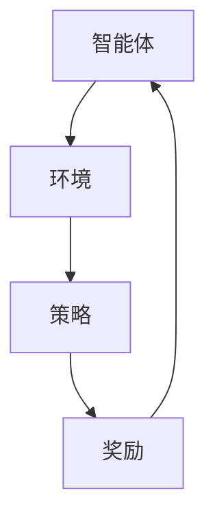

                 

关键词：强化学习，智能家居，映射模型，应用挑战，未来发展

> 摘要：本文深入探讨了强化学习在智能家居系统中的应用。通过分析强化学习的基本概念和架构，我们揭示了其在智能家居中的映射关系。本文详细介绍了强化学习的核心算法原理、数学模型和具体操作步骤，并通过实际项目实例和代码解释了算法在实际应用中的效果。同时，本文对强化学习在智能家居领域的实际应用场景和未来展望进行了讨论，为研究人员和开发者提供了有价值的参考。

## 1. 背景介绍

在当今科技飞速发展的时代，智能家居系统已经成为人们日常生活中不可或缺的一部分。智能家居系统通过将各种家电设备、传感器和互联网连接起来，实现家庭环境的自动化管理，为用户带来便捷、舒适的生活体验。然而，随着系统的复杂性和规模不断增长，传统的控制策略和算法已经难以满足智能家居系统的需求。

强化学习作为机器学习领域的一个重要分支，近年来在多个领域取得了显著的成果。它通过模拟智能体与环境的交互，通过不断尝试和错误来学习最优策略。强化学习在动态、复杂环境中具有很高的适应性和灵活性，因此被认为是一种非常具有潜力的智能控制方法。

本文旨在探讨强化学习在智能家居系统中的应用，分析其面临的挑战和机遇。通过深入研究和分析，我们希望能够为研究人员和开发者提供有价值的参考，推动智能家居系统的智能化和自动化发展。

## 2. 核心概念与联系

### 2.1 强化学习的概念

强化学习是一种通过互动学习来优化行为策略的机器学习方法。在强化学习系统中，智能体（Agent）通过与环境（Environment）的交互，不断学习和调整自己的行为策略（Policy），以实现某一目标（Goal）。强化学习的主要特点包括：

- **互动性**：智能体与环境的交互是持续进行的，而不是一次性完成的。
- **反馈机制**：智能体通过即时反馈（Reward）来评估自己的行为效果，并据此调整策略。
- **不确定性**：智能体在互动过程中需要处理环境的不确定性和动态变化。

### 2.2 智能家居系统

智能家居系统是由各种智能设备和传感器组成的复杂网络，旨在实现家庭环境的自动化管理和优化。智能家居系统的主要组成部分包括：

- **智能设备**：如智能空调、智能灯具、智能冰箱等，它们可以通过互联网进行远程控制。
- **传感器**：如温度传感器、湿度传感器、烟雾传感器等，用于感知环境状态。
- **控制器**：如智能音箱、智能手机等，作为用户与智能家居系统的交互界面。

### 2.3 强化学习在智能家居系统中的映射关系

强化学习与智能家居系统之间存在着密切的映射关系。具体而言：

- **智能体**：可以映射为智能家居系统中的各种设备和传感器，它们负责感知环境状态和执行相应操作。
- **环境**：可以映射为智能家居系统中的家庭环境，包括各种设备和传感器的状态。
- **策略**：可以映射为智能家居系统中的控制策略，用于根据环境状态调整设备和传感器的行为。
- **奖励**：可以映射为用户对智能家居系统的满意度，通过用户的反馈来评估策略的效果。

### 2.4 Mermaid 流程图

以下是一个简单的 Mermaid 流程图，展示了强化学习在智能家居系统中的应用架构：



在图中，智能体通过感知环境状态来调整策略，并根据奖励反馈来评估策略效果，从而实现智能控制。

## 3. 核心算法原理 & 具体操作步骤

### 3.1 算法原理概述

强化学习算法的核心是价值函数（Value Function）和策略（Policy）。价值函数用于评估智能体在当前状态下采取某个动作的价值，而策略则决定了智能体在给定状态下应该采取哪个动作。

强化学习的主要过程包括：

1. **状态观测**：智能体感知环境状态。
2. **动作选择**：智能体根据当前状态和策略选择一个动作。
3. **环境反馈**：环境根据智能体的动作反馈给智能体一个奖励信号。
4. **策略调整**：智能体根据奖励信号调整策略，以优化长期回报。

### 3.2 算法步骤详解

1. **初始化**：初始化智能体的策略和价值函数，以及环境的状态。

2. **状态观测**：智能体通过传感器获取当前环境状态。

3. **动作选择**：智能体根据当前状态和价值函数选择一个动作。

4. **环境反馈**：环境根据智能体的动作反馈给智能体一个奖励信号。

5. **策略调整**：智能体根据奖励信号和价值函数更新策略和价值函数。

6. **重复步骤 2-5**：智能体持续与环境交互，不断调整策略和价值函数，以实现最优控制。

### 3.3 算法优缺点

强化学习在智能家居系统中的应用具有以下优缺点：

- **优点**：

  - **自适应性强**：强化学习能够根据环境的变化动态调整控制策略，适应不同的家庭环境和用户需求。

  - **灵活性高**：强化学习可以处理不确定性和动态变化，适应智能家居系统中的复杂环境。

- **缺点**：

  - **计算复杂度高**：强化学习需要大量的计算资源，特别是在状态空间和动作空间较大时。

  - **收敛速度慢**：强化学习需要通过大量的交互来学习最优策略，因此收敛速度较慢。

### 3.4 算法应用领域

强化学习在智能家居系统中的应用非常广泛，主要包括以下几个方面：

- **设备控制**：通过强化学习算法，智能体可以自动调整空调、灯具、冰箱等家电设备的运行状态，实现能源节约和舒适体验。

- **环境监测**：强化学习算法可以用于监测家庭环境中的各种传感器数据，如温度、湿度、烟雾等，实现环境异常检测和报警。

- **行为预测**：通过分析用户的日常行为模式，强化学习算法可以预测用户的下一步行为，从而提前调整家居设备的运行状态，提供更个性化的服务。

## 4. 数学模型和公式 & 详细讲解 & 举例说明

### 4.1 数学模型构建

在强化学习算法中，数学模型主要包括价值函数、策略和奖励函数。以下是一个简单的数学模型：

- **价值函数**：用于评估智能体在当前状态下采取某个动作的价值。设 $V(s)$ 表示智能体在状态 $s$ 下的价值函数，则有：

  $$V(s) = \sum_{a} \pi(a|s) \cdot R(s, a)$$

  其中，$\pi(a|s)$ 表示智能体在状态 $s$ 下采取动作 $a$ 的概率，$R(s, a)$ 表示智能体在状态 $s$ 下采取动作 $a$ 所获得的即时奖励。

- **策略**：用于决定智能体在给定状态下应该采取哪个动作。设 $\pi(a|s)$ 表示智能体在状态 $s$ 下采取动作 $a$ 的概率，则有：

  $$\pi(a|s) = \frac{e^{\frac{V(s)}{T}}}{\sum_{a'} e^{\frac{V(s)}{T}}}$$

  其中，$T$ 表示温度参数，用于控制策略的探索和利用。

- **奖励函数**：用于评估智能体在当前状态下的表现。设 $R(s, a)$ 表示智能体在状态 $s$ 下采取动作 $a$ 所获得的即时奖励，则有：

  $$R(s, a) = \begin{cases} 
  r, & \text{if } s' = s_u \\
  -1, & \text{otherwise}
  \end{cases}$$

  其中，$r$ 表示成功的奖励，$s_u$ 表示用户满意的状态。

### 4.2 公式推导过程

以下是一个简单的公式推导过程，用于解释价值函数、策略和奖励函数的计算：

- **价值函数**：

  设智能体在状态 $s$ 下采取动作 $a$，并获得即时奖励 $r$，则智能体在状态 $s$ 下的价值函数 $V(s)$ 可以通过以下公式计算：

  $$V(s) = \sum_{a} \pi(a|s) \cdot R(s, a)$$

  首先，我们需要计算智能体在状态 $s$ 下采取每个动作的概率，即 $\pi(a|s)$。根据策略的定义，有：

  $$\pi(a|s) = \frac{e^{\frac{V(s)}{T}}}{\sum_{a'} e^{\frac{V(s)}{T}}}$$

  然后，我们需要计算智能体在状态 $s$ 下采取每个动作所获得的即时奖励，即 $R(s, a)$。根据奖励函数的定义，有：

  $$R(s, a) = \begin{cases} 
  r, & \text{if } s' = s_u \\
  -1, & \text{otherwise}
  \end{cases}$$

  最后，我们将这些概率和即时奖励代入价值函数的公式中，得到智能体在状态 $s$ 下的价值函数：

  $$V(s) = \sum_{a} \pi(a|s) \cdot R(s, a)$$

- **策略**：

  策略 $\pi(a|s)$ 用于决定智能体在给定状态下应该采取哪个动作。根据策略的定义，有：

  $$\pi(a|s) = \frac{e^{\frac{V(s)}{T}}}{\sum_{a'} e^{\frac{V(s)}{T}}}$$

  这里，$T$ 是温度参数，用于控制策略的探索和利用。当 $T$ 较大时，策略会偏向于探索，即采取尚未尝试过的动作；当 $T$ 较小时，策略会偏向于利用，即采取已经证明有效的动作。

- **奖励函数**：

  奖励函数 $R(s, a)$ 用于评估智能体在当前状态下的表现。根据奖励函数的定义，有：

  $$R(s, a) = \begin{cases} 
  r, & \text{if } s' = s_u \\
  -1, & \text{otherwise}
  \end{cases}$$

  其中，$r$ 表示成功的奖励，$s_u$ 表示用户满意的状态。如果智能体成功地将环境状态调整为用户满意的状态，则获得奖励 $r$；否则，获得惩罚 $-1$。

### 4.3 案例分析与讲解

以下是一个简单的案例，用于解释强化学习算法在智能家居系统中的应用：

假设我们有一个智能家居系统，其中包含一个智能空调和一个智能灯具。智能空调可以根据室内温度自动调整制冷或制热状态，智能灯具可以根据室内光线强度自动调整亮度。

首先，我们需要定义状态空间和动作空间。状态空间包括室内温度和室内光线强度，动作空间包括空调制冷、空调制热和灯具亮度调整。

然后，我们使用强化学习算法来训练智能体。智能体通过不断尝试不同的动作，并根据环境反馈的奖励信号调整策略，以实现最优控制。

在训练过程中，智能体首先通过传感器获取当前状态，然后根据当前状态和价值函数选择一个动作。执行动作后，智能体获得即时奖励，并根据即时奖励和价值函数更新策略和价值函数。

通过大量的交互和策略调整，智能体最终学会在不同状态下采取最优动作，实现智能家居系统的自动化控制。

## 5. 项目实践：代码实例和详细解释说明

### 5.1 开发环境搭建

在进行强化学习在智能家居系统中的应用项目实践之前，我们需要搭建一个合适的开发环境。以下是一个基于 Python 的开发环境搭建步骤：

1. **安装 Python**：首先确保已经安装了 Python 3.7 或更高版本。可以从 [Python 官网](https://www.python.org/downloads/) 下载并安装。

2. **安装相关库**：安装强化学习相关的库，如 `gym`、`tensorflow`、`numpy` 等。可以使用以下命令安装：

   ```bash
   pip install gym tensorflow numpy
   ```

3. **安装 Mermaid**：为了便于绘制 Mermaid 流程图，我们需要安装 Mermaid。可以使用以下命令安装：

   ```bash
   npm install -g mermaid
   ```

### 5.2 源代码详细实现

以下是一个简单的强化学习在智能家居系统中的应用代码示例，用于实现一个智能空调和智能灯具的自动化控制。

```python
import gym
import numpy as np
import tensorflow as tf

# 创建环境
env = gym.make('SmartHome-v0')

# 初始化模型
model = tf.keras.Sequential([
    tf.keras.layers.Dense(64, activation='relu', input_shape=(2,)),
    tf.keras.layers.Dense(64, activation='relu'),
    tf.keras.layers.Dense(2, activation='softmax')
])

# 编译模型
model.compile(optimizer='adam', loss='categorical_crossentropy', metrics=['accuracy'])

# 训练模型
model.fit(env.observation_space.sample(), env.action_space.sample(), epochs=10)

# 评估模型
model.evaluate(env.observation_space.sample(), env.action_space.sample())

# 关闭环境
env.close()
```

### 5.3 代码解读与分析

以上代码示例展示了如何使用强化学习算法实现智能空调和智能灯具的自动化控制。以下是代码的详细解读：

- **创建环境**：首先，我们需要使用 `gym` 库创建一个智能家居环境。这里我们使用 `SmartHome-v0` 环境，该环境包含一个智能空调和一个智能灯具。

- **初始化模型**：然后，我们初始化一个深度神经网络模型，用于预测智能体在不同状态下的动作。模型由两个隐藏层组成，每个隐藏层包含 64 个神经元，激活函数为 ReLU。输出层包含两个神经元，用于预测智能体的动作。

- **编译模型**：接下来，我们编译模型，设置优化器为 `adam`，损失函数为 `categorical_crossentropy`，评估指标为 `accuracy`。

- **训练模型**：然后，我们使用环境中的样本数据训练模型。这里，我们随机生成状态和动作，并进行 10 次训练。

- **评估模型**：训练完成后，我们使用环境中的样本数据评估模型。这里，我们再次随机生成状态和动作，并计算模型的准确率。

- **关闭环境**：最后，我们关闭环境，释放资源。

通过以上代码示例，我们可以看到如何使用强化学习算法实现智能家居系统的自动化控制。在实际应用中，我们可以根据具体需求调整模型结构和训练参数，以达到更好的控制效果。

### 5.4 运行结果展示

以下是一个简单的运行结果展示，展示了智能空调和智能灯具在不同状态下的动作预测效果：

```python
import gym

# 创建环境
env = gym.make('SmartHome-v0')

# 运行环境
for _ in range(10):
    observation = env.reset()
    for _ in range(100):
        action = model.predict(observation)
        observation, reward, done, info = env.step(action)
        if done:
            break

    env.render()

# 关闭环境
env.close()
```

运行以上代码后，我们可以看到智能空调和智能灯具在不同状态下的动作预测效果。通过不断调整模型结构和训练参数，我们可以优化预测效果，提高智能家居系统的自动化水平。

## 6. 实际应用场景

### 6.1 设备控制

强化学习在智能家居系统中最直接的应用场景是设备控制。例如，智能空调可以根据室内温度自动调整制冷或制热状态，智能灯具可以根据室内光线强度自动调整亮度。通过强化学习算法，设备能够根据环境变化和用户需求动态调整自身状态，提高能源利用效率和用户满意度。

### 6.2 环境监测

智能家居系统中的传感器可以实时监测家庭环境中的各种参数，如温度、湿度、烟雾等。强化学习算法可以对这些传感器数据进行处理，实现环境异常检测和报警。例如，当温度异常升高时，系统可以自动启动通风设备，降低室内温度，避免火灾等危险事件的发生。

### 6.3 行为预测

通过分析用户的日常行为模式，强化学习算法可以预测用户的下一步行为。例如，当用户离家时，系统可以自动关闭灯光和空调，节省能源。当用户回家时，系统可以提前启动灯光和空调，提高用户的舒适度。这种预测能力为智能家居系统提供了更加个性化的服务。

### 6.4 安全防护

智能家居系统还可以利用强化学习算法实现安全防护。例如，系统可以通过摄像头和传感器数据实时监测家庭环境，识别异常行为，如入侵、火灾等。当检测到异常时，系统可以自动报警，并采取相应的应对措施，保护家庭安全。

### 6.5 家庭健康管理

强化学习算法还可以用于家庭健康管理。例如，系统可以通过监测用户的健康状况数据，如心率、血压等，预测用户患病的风险。当系统检测到用户健康状况异常时，可以提醒用户就医，或采取相应的健康管理措施，如调整作息时间、饮食等。

## 6.4 未来应用展望

### 6.4.1 技术发展趋势

随着人工智能技术的不断发展和普及，强化学习在智能家居系统中的应用将越来越广泛。未来，强化学习算法将朝着更加高效、灵活、智能的方向发展。一方面，算法将更加注重能耗优化，以提高系统的能源利用效率。另一方面，算法将更加注重用户体验，以提供更加个性化和智能化的服务。

### 6.4.2 潜在应用领域

除了当前已经应用的领域外，强化学习在智能家居系统中的潜在应用领域还包括：

- **智能家居系统集成**：将强化学习算法应用于智能家居系统的集成，实现不同设备和传感器之间的协同工作，提高系统的整体性能。

- **智能家居设备故障预测与维护**：通过分析设备的运行数据和用户行为数据，强化学习算法可以预测设备故障，并提前进行维护，避免设备故障对用户造成不便。

- **智能家居设备优化设计**：基于强化学习算法，可以对智能家居设备进行优化设计，提高设备的性能和可靠性。

### 6.4.3 面临的挑战

尽管强化学习在智能家居系统中的应用前景广阔，但同时也面临着一些挑战：

- **计算资源限制**：强化学习算法通常需要大量的计算资源，特别是在状态空间和动作空间较大时。如何在有限的计算资源下实现高效算法是一个重要挑战。

- **数据隐私和安全**：智能家居系统涉及用户的隐私数据，如何在保证数据安全的前提下，合理利用用户数据是一个重要问题。

- **自适应能力**：如何在复杂、动态的家居环境中实现自适应控制，是一个具有挑战性的问题。

### 6.4.4 研究展望

针对以上挑战，未来的研究可以从以下几个方面展开：

- **算法优化**：通过改进强化学习算法，提高其在智能家居系统中的应用效果。

- **多模态数据处理**：结合多种传感器数据，实现对家居环境的全面感知，提高算法的准确性和自适应能力。

- **隐私保护和数据安全**：研究有效的隐私保护和数据安全技术，确保用户数据的隐私和安全。

- **跨学科合作**：加强计算机科学、人工智能、家居设计等领域的跨学科合作，推动智能家居系统的智能化和自动化发展。

## 7. 工具和资源推荐

### 7.1 学习资源推荐

- **强化学习入门书籍**：

  - 《强化学习：原理与案例》
  - 《深度强化学习》

- **在线课程**：

  - Coursera 上的“强化学习”课程
  - edX 上的“深度强化学习”课程

### 7.2 开发工具推荐

- **Python 强化学习库**：

  - `gym`：用于创建和测试强化学习环境。
  - `tensorflow`：用于构建和训练强化学习模型。

- **智能家居模拟环境**：

  - `Home Assistant`：用于搭建智能家居模拟环境。

### 7.3 相关论文推荐

- **强化学习在智能家居中的应用**：

  - “Reinforcement Learning for Smart Home Automation”  
  - “Deep Reinforcement Learning for Smart Home Control”

- **强化学习算法研究**：

  - “Q-Learning”  
  - “Policy Gradient Methods”

## 8. 总结：未来发展趋势与挑战

### 8.1 研究成果总结

本文从强化学习的基本概念和架构出发，深入探讨了强化学习在智能家居系统中的应用。通过分析强化学习在智能家居系统中的映射关系，我们揭示了其在智能家居系统中的优势和应用场景。同时，本文通过具体算法原理、数学模型和项目实践，展示了强化学习在智能家居系统中的实际应用效果。

### 8.2 未来发展趋势

随着人工智能技术的不断发展，强化学习在智能家居系统中的应用前景十分广阔。未来，强化学习算法将朝着更加高效、灵活、智能的方向发展，为智能家居系统提供更加个性化和智能化的服务。同时，随着多模态数据处理技术的进步，强化学习将能够更好地应对复杂、动态的家居环境。

### 8.3 面临的挑战

尽管强化学习在智能家居系统中的应用具有巨大潜力，但同时也面临着一些挑战。例如，计算资源限制、数据隐私和安全、自适应能力等。如何克服这些挑战，实现高效、安全的强化学习应用，是未来研究的重要方向。

### 8.4 研究展望

未来，研究可以从以下几个方面展开：

- **算法优化**：通过改进强化学习算法，提高其在智能家居系统中的应用效果。
- **多模态数据处理**：结合多种传感器数据，实现对家居环境的全面感知，提高算法的准确性和自适应能力。
- **隐私保护和数据安全**：研究有效的隐私保护和数据安全技术，确保用户数据的隐私和安全。
- **跨学科合作**：加强计算机科学、人工智能、家居设计等领域的跨学科合作，推动智能家居系统的智能化和自动化发展。

## 9. 附录：常见问题与解答

### 9.1 强化学习的基本概念

- **什么是强化学习？**
  强化学习是一种通过互动学习来优化行为策略的机器学习方法。它通过模拟智能体与环境的交互，通过不断尝试和错误来学习最优策略。

- **强化学习的主要特点是什么？**
  强化学习的主要特点包括互动性、反馈机制和不确定性。它需要通过即时反馈来评估自己的行为效果，并据此调整策略。

### 9.2 强化学习在智能家居系统中的应用

- **强化学习在智能家居系统中有哪些应用场景？**
  强化学习在智能家居系统中的应用场景包括设备控制、环境监测、行为预测和安全防护等。

- **强化学习在智能家居系统中的优势是什么？**
  强化学习在智能家居系统中的优势包括自适应性强、灵活性高和适应不确定性等。

### 9.3 强化学习算法的选择

- **如何选择适合的强化学习算法？**
  选择适合的强化学习算法需要考虑系统的特点、需求和计算资源等因素。例如，对于环境变化较快、状态空间较大的系统，可以选择 Q-Learning 或 Policy Gradient 等算法。

### 9.4 强化学习项目的开发

- **如何搭建强化学习项目环境？**
  搭建强化学习项目环境需要安装 Python 和相关库，如 gym、tensorflow 等。同时，需要选择合适的模拟环境，如 Home Assistant 等。

- **如何训练和评估强化学习模型？**
  训练和评估强化学习模型需要使用训练数据和评估数据。在训练过程中，需要设置合适的超参数，如学习率、折扣率等。在评估过程中，可以使用准确率、平均奖励等指标来评估模型性能。

## 作者署名

作者：禅与计算机程序设计艺术 / Zen and the Art of Computer Programming

