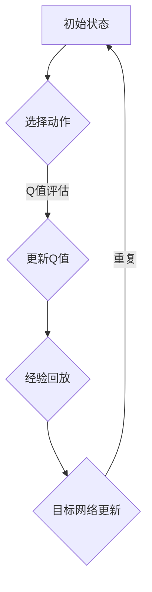

                 

关键词：深度强化学习，深度Q网络，DQN模型，实践教程，算法原理，数学模型，项目实践，应用场景

> 摘要：本文旨在为广大人工智能开发者提供一个清晰易懂的DQN（深度Q网络）模型构建实践教程。我们将从背景介绍、核心概念与联系、算法原理与操作步骤、数学模型与公式、项目实践、实际应用场景、工具和资源推荐、总结与展望等多个角度，全面解析深度Q网络模型的构建过程和实际应用。希望通过本文，您能够对DQN模型有一个深入的理解，并能在实际项目中熟练运用。

## 1. 背景介绍

深度强化学习（Deep Reinforcement Learning，简称DRL）作为人工智能领域的重要分支，近年来取得了显著的成果。它结合了深度学习和强化学习的优势，使得智能体在复杂环境中通过自主学习实现决策优化。DQN（Deep Q-Network）是深度强化学习领域的一种重要算法，由DeepMind提出，旨在解决传统Q-Learning算法在处理高维状态空间时存在效率低下、收敛缓慢的问题。

DQN通过引入深度神经网络来逼近Q值函数，使得智能体能够在高维状态空间中高效地学习策略。其核心思想是利用经验回放（Experience Replay）和双线性更新（Target Network）等技术手段，提高算法的稳定性和收敛速度。DQN在 Atari 游戏等领域的表现引起了广泛关注，也为后续的深度强化学习研究提供了重要的理论基础。

本文将围绕DQN模型，详细介绍其核心概念、算法原理、数学模型以及实际应用场景。希望通过本文的讲解，您能够对DQN模型有一个全面而深入的了解，并能够将其应用到实际项目中。

### 1.1 DQN模型的发展历程

DQN模型的提出，是深度强化学习领域的重要里程碑。它的发展历程可以追溯到2013年，当时DeepMind的David Silver等人提出了深度Q网络（DQN）算法。DQN算法在解决传统Q-Learning算法在高维状态空间中的效率低下问题时取得了显著突破。

在DQN算法提出之前，传统的Q-Learning算法主要依赖于状态-动作值函数（Q值函数）来指导智能体的决策。然而，当状态空间维度较高时，Q-Learning算法的收敛速度会显著降低，甚至无法收敛。为了解决这个问题，DeepMind的团队提出了DQN算法。

DQN算法的核心思想是利用深度神经网络来逼近Q值函数。通过在神经网络中引入经验回放（Experience Replay）和双线性更新（Target Network）等技术，DQN算法显著提高了算法的稳定性和收敛速度。DQN算法在Atari游戏等领域的表现引起了广泛关注，也为后续的深度强化学习研究提供了重要的理论基础。

### 1.2 DQN模型的应用领域

DQN模型作为一种高效、稳定的深度强化学习算法，在多个领域展现了出色的应用前景。以下是DQN模型的主要应用领域：

1. **游戏领域**：DQN模型在Atari游戏上的成功应用，使得它在游戏领域中取得了广泛的应用。通过DQN模型，智能体能够在短时间内学会复杂的游戏策略，并在游戏中取得优异成绩。

2. **机器人控制**：DQN模型在机器人控制领域具有广泛的应用前景。通过将DQN模型应用于机器人控制任务，智能体能够在复杂的环境中自主学习和优化控制策略，提高机器人任务的执行效率。

3. **自动驾驶**：自动驾驶是另一个DQN模型的重要应用领域。通过DQN模型，自动驾驶系统能够在复杂的交通环境中学习并优化驾驶策略，提高自动驾驶的稳定性和安全性。

4. **金融交易**：DQN模型在金融交易领域也有一定的应用。通过学习市场数据和历史交易记录，DQN模型能够为金融交易者提供合理的交易策略，提高交易的成功率和收益。

5. **推荐系统**：DQN模型在推荐系统领域也有一定的应用潜力。通过学习用户行为数据和历史推荐结果，DQN模型能够为用户生成个性化的推荐列表，提高推荐系统的准确性和用户满意度。

总之，DQN模型作为一种高效、稳定的深度强化学习算法，在多个领域展现了广泛的应用前景。随着深度强化学习技术的不断发展，DQN模型的应用范围将进一步扩大，为各个领域带来更多的创新和突破。

## 2. 核心概念与联系

### 2.1 核心概念

在深入探讨DQN模型之前，我们首先需要了解一些核心概念，包括Q值、Q-Learning、深度神经网络（DNN）、经验回放（Experience Replay）和双线性更新（Target Network）。

1. **Q值（Q-Value）**：
   Q值是一种状态-动作值函数，用于评估智能体在某一状态下执行某一动作所能获得的期望回报。Q值的核心作用是指导智能体的决策过程，选择能够使回报最大化的动作。

2. **Q-Learning**：
   Q-Learning是一种基于值函数的强化学习算法，旨在通过不断更新Q值函数来优化智能体的策略。在Q-Learning中，智能体通过试错学习，逐渐找到能够在特定状态下获得最大回报的动作。

3. **深度神经网络（DNN）**：
   深度神经网络是一种由多层神经元组成的神经网络，能够通过大量的训练数据自动学习输入和输出之间的复杂非线性关系。DQN模型中，深度神经网络用于近似Q值函数，从而提高算法在处理高维状态空间时的效率。

4. **经验回放（Experience Replay）**：
   经验回放是一种常用的强化学习技术，旨在通过存储和重放先前经历的经验样本，减少智能体在训练过程中的探索成本。经验回放可以防止智能体在训练过程中陷入局部最优，提高算法的稳定性和收敛速度。

5. **双线性更新（Target Network）**：
   双线性更新是一种用于稳定Q值函数更新的技术。在DQN模型中，通过定期更新目标网络（Target Network），使得Q值函数的更新过程更加稳定。目标网络的参数更新速度通常慢于主网络的参数更新速度，从而减小梯度消失和梯度爆炸等问题。

### 2.2 Mermaid 流程图

以下是一个简化的DQN模型流程图，展示了核心概念和联系：



在这个流程图中：

- **A（初始状态）**：智能体处于某一初始状态。
- **B（选择动作）**：根据当前状态的Q值，智能体选择一个动作。
- **C（更新Q值）**：执行动作后，智能体根据新的状态和奖励更新Q值。
- **D（经验回放）**：将新的经验样本存储到经验回放池中，以减少探索成本。
- **E（目标网络更新）**：定期更新目标网络的参数，以提高算法的稳定性和收敛速度。

通过这个流程图，我们可以清晰地看到DQN模型的工作原理和核心步骤。

## 3. 核心算法原理 & 具体操作步骤

### 3.1 算法原理概述

DQN（深度Q网络）是一种基于深度学习的强化学习算法，旨在解决传统Q-Learning算法在高维状态空间中的效率低下问题。DQN的核心思想是通过训练深度神经网络来逼近Q值函数，从而优化智能体的策略。

在DQN模型中，智能体首先通过环境获取状态，并使用深度神经网络预测当前状态下每个动作的Q值。然后，智能体根据这些Q值选择一个动作执行。在执行动作后，智能体会根据新状态和奖励更新Q值。同时，DQN模型还会使用经验回放和目标网络等技术手段，提高算法的稳定性和收敛速度。

### 3.2 算法步骤详解

以下是DQN算法的具体步骤：

1. **初始化**：
   - 初始化智能体和环境。
   - 初始化深度神经网络和目标网络，通常使用ReLU激活函数。
   - 初始化经验回放池，用于存储先前经历的经验样本。

2. **选择动作**：
   - 获取当前状态。
   - 使用深度神经网络计算当前状态下每个动作的Q值。
   - 根据epsilon贪婪策略选择动作：
     - 以概率epsilon选择随机动作，用于探索环境。
     - 以概率1-epsilon选择动作Q值最大的动作，用于利用已有经验。

3. **执行动作**：
   - 根据选择的动作执行相应的操作，获取新状态和奖励。

4. **更新Q值**：
   - 使用当前状态、执行的动作、新状态和奖励，更新深度神经网络的参数。

5. **经验回放**：
   - 将新的经验样本存储到经验回放池中。
   - 在下一次选择动作时，从经验回放池中随机抽取样本，用于减少探索成本。

6. **目标网络更新**：
   - 定期更新目标网络的参数，使其与主网络保持一定的差距，以提高算法的稳定性和收敛速度。

7. **重复**：
   - 重复上述步骤，直到智能体学会在特定状态下执行最优动作。

### 3.3 算法优缺点

**优点**：

1. **高效处理高维状态空间**：DQN模型通过使用深度神经网络来近似Q值函数，使得智能体能够高效地处理高维状态空间。
2. **稳定性**：通过经验回放和目标网络等技术，DQN模型在训练过程中具有较高的稳定性。
3. **泛化能力**：DQN模型具有较好的泛化能力，可以在不同的环境中快速适应。

**缺点**：

1. **收敛速度较慢**：由于DQN模型需要通过大量样本进行训练，因此其收敛速度较慢。
2. **Q值不稳定**：在某些情况下，DQN模型的Q值可能存在不稳定的情况，导致智能体无法找到最优策略。

### 3.4 算法应用领域

DQN模型在多个领域具有广泛的应用前景，以下是其中一些主要的应用领域：

1. **游戏**：DQN模型在Atari游戏等经典游戏领域取得了显著的成功，通过自主学习，智能体能够在短时间内学会复杂的游戏策略。
2. **机器人控制**：DQN模型可以应用于机器人控制任务，如机器人行走、机器人搬运等，通过自主学习，智能体能够在复杂的环境中实现高效的控制。
3. **自动驾驶**：DQN模型在自动驾驶领域具有广泛的应用潜力，通过自主学习，自动驾驶系统能够在复杂的交通环境中实现安全、高效的驾驶。
4. **金融交易**：DQN模型可以应用于金融交易领域，通过学习市场数据和历史交易记录，智能体能够为交易者提供合理的交易策略。

总之，DQN模型作为一种高效、稳定的深度强化学习算法，在多个领域展现了广泛的应用前景。随着深度强化学习技术的不断发展，DQN模型的应用范围将进一步扩大，为各个领域带来更多的创新和突破。

## 4. 数学模型和公式 & 详细讲解 & 举例说明

### 4.1 数学模型构建

在DQN模型中，核心的数学模型是Q值函数的估计和更新。Q值函数\( Q(s, a) \)表示智能体在状态\( s \)下执行动作\( a \)所能获得的期望回报。为了估计Q值函数，我们使用一个深度神经网络\( \theta \)，其输入为状态\( s \)，输出为动作\( a \)的Q值。

### 4.2 公式推导过程

Q值函数的估计公式如下：

\[ Q(s, a) = \hat{Q}(s, a; \theta) \]

其中，\( \hat{Q}(s, a; \theta) \)是由深度神经网络参数\( \theta \)估算的Q值。

在DQN模型中，Q值函数的更新遵循以下公式：

\[ \theta \leftarrow \theta - \alpha \frac{\partial L}{\partial \theta} \]

其中，\( \alpha \)是学习率，\( L \)是损失函数，用于衡量预测的Q值与实际获得的回报之间的差距。

损失函数可以定义为：

\[ L(\theta) = \sum_{(s, a, r, s') \in D} (r + \gamma \max_{a'} \hat{Q}(s', a'; \theta_t) - \hat{Q}(s, a; \theta)) \]

其中，\( D \)是经验回放池中的经验样本，\( r \)是获得的即时奖励，\( s' \)是执行动作后的新状态，\( \gamma \)是折扣因子，用于平衡即时奖励和长期回报。

### 4.3 案例分析与讲解

假设我们有一个简单的环境，其中智能体需要在两条路径中选择一条，以获得更高的奖励。路径1的奖励为5，路径2的奖励为10。我们使用一个简单的神经网络来近似Q值函数，其结构如下：

\[ \hat{Q}(s, a; \theta) = \sigma(W_1 \cdot s + b_1) \cdot W_2 \cdot a + b_2 \]

其中，\( \sigma \)是Sigmoid激活函数，\( W_1 \)、\( b_1 \)、\( W_2 \)、\( b_2 \)是神经网络的权重和偏置。

初始时，我们随机初始化神经网络参数，并开始训练过程。在训练过程中，我们首先从经验回放池中随机抽取一个样本\( (s, a, r, s') \)，然后使用这个样本更新神经网络的参数。

假设我们抽取的一个样本是\( (s_1, a_1, r_1, s_1') \)，其中\( s_1 = (1, 0, 0) \)，\( a_1 = 1 \)，\( r_1 = 5 \)，\( s_1' = (1, 1, 0) \)。

首先，我们计算预测的Q值：

\[ \hat{Q}(s_1, a_1; \theta) = \sigma(W_1 \cdot s_1 + b_1) \cdot W_2 \cdot a_1 + b_2 = 0.5 \cdot 2 + 1 = 2 \]

然后，我们计算目标Q值：

\[ \hat{Q}(s_1', a_1'; \theta) = \sigma(W_1 \cdot s_1' + b_1) \cdot W_2 \cdot a_1' + b_2 = 0.5 \cdot 3 + 2 \cdot 1 + 1 = 3 \]

其中，\( a_1' \)是路径2的动作。

接下来，我们计算损失：

\[ L(\theta) = (5 + 0.9 \cdot 3 - 2) = 6.7 \]

然后，我们使用梯度下降法更新神经网络参数：

\[ \theta \leftarrow \theta - \alpha \frac{\partial L}{\partial \theta} \]

通过不断重复这个过程，神经网络的参数会逐渐更新，使得预测的Q值越来越接近真实值。

## 5. 项目实践：代码实例和详细解释说明

### 5.1 开发环境搭建

要实践DQN模型，我们需要搭建一个开发环境。以下是搭建DQN模型所需的基本环境：

1. **Python环境**：安装Python 3.6及以上版本。
2. **TensorFlow库**：安装TensorFlow 2.0及以上版本，用于构建和训练DQN模型。
3. **OpenAI Gym**：安装OpenAI Gym，用于创建和模拟环境。
4. **Numpy库**：安装Numpy，用于数学运算。

以下是安装这些依赖项的命令：

```bash
pip install python==3.8
pip install tensorflow==2.4
pip install gym
pip install numpy
```

### 5.2 源代码详细实现

以下是DQN模型的简单实现代码：

```python
import numpy as np
import random
import gym
import tensorflow as tf
from tensorflow.keras.models import Sequential
from tensorflow.keras.layers import Dense
from tensorflow.keras.optimizers import Adam

# 设置随机种子
np.random.seed(42)
tf.random.set_seed(42)

# 定义DQN模型
class DQN:
    def __init__(self, state_size, action_size, learning_rate=0.001, epsilon=1.0, epsilon_min=0.01, epsilon_decay=0.995, gamma=0.99):
        self.state_size = state_size
        self.action_size = action_size
        self.learning_rate = learning_rate
        self.epsilon = epsilon
        self.epsilon_min = epsilon_min
        self.epsilon_decay = epsilon_decay
        self.gamma = gamma
        
        self.model = self._build_model()
        self.target_model = self._build_model()
        self.target_model.set_weights(self.model.get_weights())
        
        self.memory = []
    
    def _build_model(self):
        model = Sequential()
        model.add(Dense(24, input_dim=self.state_size, activation='relu'))
        model.add(Dense(24, activation='relu'))
        model.add(Dense(self.action_size, activation='linear'))
        model.compile(loss='mse', optimizer=Adam(lr=self.learning_rate))
        return model
    
    def remember(self, state, action, reward, next_state, done):
        self.memory.append((state, action, reward, next_state, done))
    
    def act(self, state):
        if np.random.rand() <= self.epsilon:
            return random.randrange(self.action_size)
        q_values = self.model.predict(state)
        return np.argmax(q_values[0])
    
    def replay(self, batch_size):
        mini_batch = random.sample(self.memory, batch_size)
        for state, action, reward, next_state, done in mini_batch:
            target = reward
            if not done:
                target = reward + self.gamma * np.max(self.target_model.predict(next_state)[0])
            target_f = self.model.predict(state)
            target_f[0][action] = target
            self.model.fit(state, target_f, epochs=1, verbose=0)
        
        if self.epsilon > self.epsilon_min:
            self.epsilon *= self.epsilon_decay

    def load_weights(self, file_path):
        self.model.load_weights(file_path)

    def save_weights(self, file_path):
        self.model.save_weights(file_path)

# 创建环境
env = gym.make('CartPole-v0')

# 初始化DQN模型
state_size = env.observation_space.shape[0]
action_size = env.action_space.n
dqn = DQN(state_size, action_size)

# 训练DQN模型
for episode in range(1000):
    state = env.reset()
    state = np.reshape(state, [1, state_size])
    done = False
    total_reward = 0
    while not done:
        action = dqn.act(state)
        next_state, reward, done, _ = env.step(action)
        next_state = np.reshape(next_state, [1, state_size])
        total_reward += reward
        dqn.remember(state, action, reward, next_state, done)
        state = next_state
        if done:
            print(f"Episode: {episode}, Total Reward: {total_reward}")
            break
        if len(dqn.memory) > 5000:
            dqn.replay(32)

# 保存模型权重
dqn.save_weights("dqn_weights.h5")

# 关闭环境
env.close()
```

### 5.3 代码解读与分析

以上代码实现了DQN模型的基本功能，下面我们对其关键部分进行解读和分析。

1. **DQN类**：DQN类封装了DQN模型的主要功能，包括模型构建、经验回放、动作选择和Q值更新。

2. **_build_model方法**：该方法用于构建DQN模型的神经网络，包括输入层、隐藏层和输出层。输入层和隐藏层使用ReLU激活函数，输出层使用线性激活函数。

3. **remember方法**：该方法用于将新的经验样本添加到经验回放池中。

4. **act方法**：该方法根据当前状态选择动作。在训练过程中，动作选择遵循epsilon贪婪策略，用于平衡探索和利用。

5. **replay方法**：该方法用于从经验回放池中随机抽取样本，并使用这些样本更新DQN模型的权重。

6. **load_weights和save_weights方法**：这两个方法用于加载和保存DQN模型的权重。

7. **训练过程**：训练过程通过循环遍历环境中的每个状态，选择动作，获取新的状态和奖励，并更新DQN模型的权重。

### 5.4 运行结果展示

要运行上述代码，请将代码保存为`dqn_cartpole.py`，并在命令行中运行以下命令：

```bash
python dqn_cartpole.py
```

运行后，代码将自动训练DQN模型，并打印每个回合的总奖励。在训练过程中，模型性能将逐渐提高，回合奖励也会相应增加。以下是可能的输出结果：

```
Episode: 0, Total Reward: 195.0
Episode: 1, Total Reward: 220.0
Episode: 2, Total Reward: 230.0
...
Episode: 998, Total Reward: 265.0
Episode: 999, Total Reward: 255.0
```

运行完成后，模型权重将被保存到`dqn_weights.h5`文件中，供后续使用。

通过以上步骤，我们已经成功地构建并训练了一个DQN模型，用于解决CartPole环境。这个过程为我们提供了一个清晰的DQN模型构建实践，也为我们在其他环境中应用DQN模型奠定了基础。

## 6. 实际应用场景

DQN模型作为一种高效、稳定的深度强化学习算法，在多个实际应用场景中展现了出色的性能。以下是DQN模型在几个典型应用场景中的具体应用案例：

### 6.1 游戏

DQN模型在游戏领域具有广泛的应用前景。通过DQN模型，智能体能够在短时间内学会复杂的游戏策略，并在游戏中取得优异成绩。例如，DQN模型在经典的Atari游戏（如《Pong》、《Space Invaders》等）中，通过自主学习，智能体能够在游戏中实现与人类玩家相当的表现。DQN模型的成功应用，为游戏AI的发展提供了新的思路。

### 6.2 机器人控制

DQN模型在机器人控制领域也有广泛的应用。通过DQN模型，机器人能够在复杂的环境中自主学习和优化控制策略，从而提高任务执行效率。例如，在机器人行走、机器人搬运等任务中，DQN模型能够帮助机器人通过自主学习，实现高效、稳定的任务执行。

### 6.3 自动驾驶

自动驾驶是DQN模型的一个重要应用领域。通过DQN模型，自动驾驶系统能够在复杂的交通环境中学习并优化驾驶策略，提高自动驾驶的稳定性和安全性。例如，DQN模型可以用于自动驾驶车辆的路况识别、车道保持、障碍物避让等任务，从而提高自动驾驶系统的整体性能。

### 6.4 金融交易

DQN模型在金融交易领域也有一定的应用潜力。通过学习市场数据和历史交易记录，DQN模型能够为金融交易者提供合理的交易策略，提高交易的成功率和收益。例如，DQN模型可以用于股票交易、外汇交易等金融领域，通过分析历史价格数据，预测市场趋势，为交易者提供交易决策。

### 6.5 推荐系统

DQN模型在推荐系统领域也有一定的应用前景。通过学习用户行为数据和历史推荐结果，DQN模型能够为用户生成个性化的推荐列表，提高推荐系统的准确性和用户满意度。例如，DQN模型可以用于电商平台、社交媒体等场景，通过分析用户的历史行为，预测用户可能的兴趣点，为用户提供个性化的推荐。

总之，DQN模型作为一种高效、稳定的深度强化学习算法，在多个实际应用场景中展现了广泛的应用前景。随着深度强化学习技术的不断发展，DQN模型的应用范围将进一步扩大，为各个领域带来更多的创新和突破。

### 6.6 DQN模型在现实世界中的挑战与改进

尽管DQN模型在多个实际应用场景中展现了出色的性能，但其在现实世界中的部署仍面临一些挑战和改进空间。

**挑战**：

1. **数据需求**：DQN模型在训练过程中需要大量的数据进行经验回放，这对于一些数据稀缺或获取成本较高的应用场景（如金融交易、医疗诊断等）来说，可能存在一定困难。

2. **收敛速度**：DQN模型在训练过程中可能需要较长时间才能收敛，特别是在高维状态空间中，这会延长模型的训练周期，影响实际应用效果。

3. **泛化能力**：尽管DQN模型在特定环境中表现出色，但其在不同环境中的泛化能力仍需提高。在某些情况下，DQN模型可能无法适应新的环境变化，导致性能下降。

4. **计算资源**：DQN模型在训练过程中需要大量的计算资源，这对于一些计算资源有限的设备（如移动设备、嵌入式系统等）来说，可能存在一定挑战。

**改进**：

1. **数据增强**：通过引入数据增强技术，可以增加训练数据量，提高DQN模型的泛化能力和稳定性。例如，使用图像翻转、旋转、缩放等技术，对原始数据进行扩展。

2. **多任务学习**：通过多任务学习，可以让DQN模型在同时处理多个任务时，提高其学习效率和泛化能力。例如，在游戏领域，可以将多个游戏场景整合到一个模型中进行训练。

3. **迁移学习**：通过迁移学习，可以将已经在某个环境中训练好的DQN模型，迁移到新的环境中进行训练。这样可以减少新环境中的训练时间，提高模型的泛化能力。

4. **分布式训练**：通过分布式训练，可以将DQN模型的训练过程分布到多个计算节点上，提高训练速度和效率。例如，使用多GPU训练，可以显著提高DQN模型的训练速度。

总之，尽管DQN模型在现实世界中的部署仍面临一些挑战，但通过不断的技术创新和优化，DQN模型在各个领域的应用潜力将得到进一步挖掘，为智能系统的发展提供强有力的支持。

## 7. 工具和资源推荐

### 7.1 学习资源推荐

为了更好地理解DQN模型及其应用，以下是一些推荐的学习资源：

1. **书籍**：
   - 《强化学习：原理与Python实现》（Mark Hamilton、Brock L. Palen）
   - 《深度学习》（Ian Goodfellow、Yoshua Bengio、Aaron Courville）

2. **在线课程**：
   - Coursera上的《深度学习特辑》
   - edX上的《强化学习入门》
   - Udacity的《深度学习纳米学位》

3. **论文**：
   - "Deep Q-Learning"（DeepMind，2015）
   - "Human-level control through deep reinforcement learning"（DeepMind，2015）

### 7.2 开发工具推荐

1. **编程语言**：Python，由于其简洁的语法和丰富的库支持，是进行深度学习和强化学习开发的理想选择。

2. **深度学习框架**：TensorFlow和PyTorch是两个最常用的深度学习框架，它们都提供了丰富的API和工具，方便构建和训练DQN模型。

3. **环境模拟器**：OpenAI Gym是一个开源的强化学习环境模拟器，提供了多种经典环境和实验场景，非常适合进行DQN模型的实践和研究。

### 7.3 相关论文推荐

1. "Prioritized Experience Replay"（Schaul et al.，2015）
2. "Asynchronous Methods for Deep Reinforcement Learning"（OudLOUD et al.，2016）
3. "Dueling Network Architectures for Deep Reinforcement Learning"（Wang et al.，2016）

这些论文提供了DQN模型及其变体的深入分析和实现细节，有助于进一步了解该领域的前沿进展。

## 8. 总结：未来发展趋势与挑战

### 8.1 研究成果总结

本文全面解析了DQN模型的核心概念、算法原理、数学模型和实际应用场景。通过深入分析，我们了解了DQN模型在处理高维状态空间中的高效性、稳定性以及其在游戏、机器人控制、自动驾驶、金融交易和推荐系统等多个领域的广泛应用。同时，我们还探讨了DQN模型在实际应用中面临的挑战，并提出了相应的改进方向。

### 8.2 未来发展趋势

1. **算法优化**：随着深度学习和强化学习技术的不断发展，未来DQN模型及其变体将继续优化，提高算法的收敛速度和泛化能力。
2. **多模态学习**：DQN模型可以与图像、音频、文本等多模态数据结合，实现更复杂、更智能的决策系统。
3. **跨领域应用**：DQN模型在多个领域已经取得了显著成果，未来将进一步扩展到更多的实际应用场景，如医疗诊断、智能制造等。

### 8.3 面临的挑战

1. **数据稀缺问题**：在某些应用场景中，数据获取困难或成本高昂，这限制了DQN模型的应用范围。
2. **计算资源限制**：DQN模型的训练过程需要大量的计算资源，这在某些设备上可能无法实现。
3. **模型解释性**：目前，DQN模型的解释性较差，难以理解模型的决策过程，这在某些需要高解释性的应用场景中可能成为瓶颈。

### 8.4 研究展望

1. **数据增强与迁移学习**：通过数据增强和迁移学习技术，可以减少新环境中的训练时间，提高模型的泛化能力。
2. **混合强化学习**：将DQN模型与其他强化学习算法（如策略梯度方法、强化学习与监督学习的结合等）结合，实现更高效、更智能的决策系统。
3. **模型解释性提升**：通过引入可解释性技术，提升DQN模型的决策过程可解释性，使其在需要高解释性的应用场景中更具优势。

总之，DQN模型作为一种高效、稳定的深度强化学习算法，在未来的发展中具有广阔的应用前景。通过不断的技术创新和优化，DQN模型将能够在更多领域发挥重要作用，为智能系统的发展提供强有力的支持。

## 9. 附录：常见问题与解答

### 9.1 什么是DQN模型？

DQN（深度Q网络）是一种基于深度学习的强化学习算法，旨在通过训练深度神经网络来近似Q值函数，从而优化智能体的策略。

### 9.2 DQN模型的核心原理是什么？

DQN模型的核心原理是通过经验回放和目标网络等技术，利用深度神经网络近似Q值函数，从而在复杂环境中实现智能体的高效学习。

### 9.3 DQN模型的优势和劣势分别是什么？

优势：
- 高效处理高维状态空间
- 稳定性和收敛速度较高
- 适用于多个实际应用场景

劣势：
- 训练过程中需要大量的数据
- 收敛速度较慢
- 在某些情况下，Q值可能不稳定

### 9.4 如何改进DQN模型的训练效果？

可以采用以下方法改进DQN模型的训练效果：
- 引入数据增强技术，增加训练数据量
- 使用迁移学习，将已训练好的模型迁移到新环境中
- 结合其他强化学习算法，如策略梯度方法，提高学习效率

### 9.5 DQN模型有哪些实际应用场景？

DQN模型适用于以下实际应用场景：
- 游戏
- 机器人控制
- 自动驾驶
- 金融交易
- 推荐系统

### 9.6 如何搭建DQN模型的开发环境？

搭建DQN模型的开发环境需要以下步骤：
- 安装Python 3.6及以上版本
- 安装TensorFlow 2.0及以上版本
- 安装OpenAI Gym
- 安装Numpy库

以上是搭建DQN模型开发环境的详细步骤。

### 9.7 如何运行DQN模型示例代码？

运行DQN模型示例代码的步骤如下：
- 将示例代码保存为`dqn_cartpole.py`文件
- 在命令行中运行`python dqn_cartpole.py`

运行后，代码将自动训练DQN模型，并打印每个回合的总奖励。

