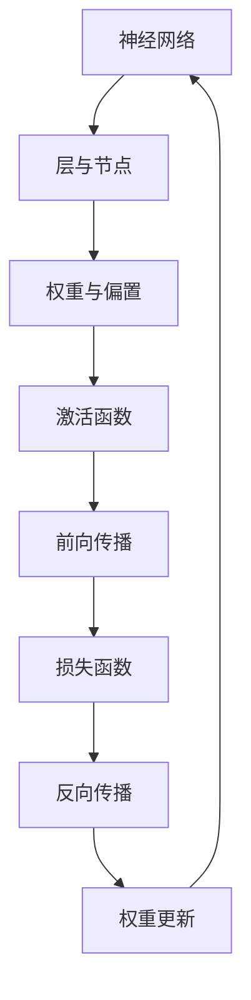

                 

深度学习，作为人工智能的核心技术之一，已经成为现代数据科学、机器学习以及计算机视觉等领域不可或缺的工具。然而，对于初学者而言，构建一个深度学习模型并非易事。本文旨在通过深入浅出的方式，引导读者构建自己的第一个深度学习模型，并理解其中的核心概念和实现步骤。

## 关键词

- 深度学习
- 神经网络
- 训练过程
- 函数优化
- 模型评估

## 摘要

本文将分为以下几个部分：首先介绍深度学习的背景和核心概念，接着解释如何构建一个简单的神经网络，详细描述训练过程、模型评估和函数优化。随后，通过一个具体案例展示如何编写代码实现深度学习模型。最后，讨论深度学习的实际应用场景，并对未来的发展趋势和挑战进行展望。

### 1. 背景介绍

深度学习的发展可以追溯到20世纪80年代，最初由于计算资源和数据集的限制，发展较为缓慢。随着计算能力的提升和大数据的涌现，深度学习在21世纪迎来了爆发式的发展。深度学习的核心是神经网络，特别是卷积神经网络（CNN）和循环神经网络（RNN），它们在图像识别、自然语言处理等领域取得了显著成绩。

近年来，深度学习在医疗诊断、金融分析、自动驾驶等多个领域都显示出了巨大的潜力。例如，在医疗领域，深度学习可以辅助医生进行疾病诊断，提高诊断的准确性和效率；在金融领域，深度学习可以用于风险管理、欺诈检测等任务。

然而，深度学习也存在一些挑战，如过拟合问题、模型解释性不足以及需要大量数据和计算资源等。因此，了解深度学习的原理和构建方法，对于进一步探索和应用这一技术具有重要意义。

### 2. 核心概念与联系

要构建深度学习模型，首先需要了解其中的核心概念，包括神经网络、激活函数、反向传播等。以下是一个简化的Mermaid流程图，展示这些概念之间的联系：



#### 2.1 神经网络

神经网络是由多层节点（神经元）组成的计算模型。每个节点接收输入信号，通过加权求和后应用激活函数，产生输出信号。神经网络可以分为输入层、隐藏层和输出层。

- **输入层**：接收外部输入数据。
- **隐藏层**：对输入数据进行处理，提取特征。
- **输出层**：生成最终预测结果。

#### 2.2 权重与偏置

每个节点之间的连接具有权重，用于调节信号传递的强度。此外，每个节点还有一个偏置项，用于平移决策边界。

#### 2.3 激活函数

激活函数将线性组合的输入转换为非线性输出，使得神经网络具有非线性能力。常用的激活函数包括sigmoid、ReLU和Tanh。

#### 2.4 前向传播

前向传播是指将输入数据从输入层传递到输出层的计算过程。在这个过程中，每个节点根据输入、权重和偏置计算输出。

#### 2.5 损失函数

损失函数用于衡量模型预测结果与真实结果之间的差距。常用的损失函数包括均方误差（MSE）和对数损失函数。

#### 2.6 反向传播

反向传播是深度学习训练的核心步骤。它通过计算损失函数关于模型参数的梯度，并利用梯度下降法更新模型参数，以最小化损失函数。

### 3. 核心算法原理 & 具体操作步骤

#### 3.1 算法原理概述

深度学习的核心在于通过学习大量数据来调整模型参数，使其能够对未知数据进行预测。这一过程可以分为以下几个步骤：

1. **初始化参数**：随机初始化模型参数。
2. **前向传播**：将输入数据传递到神经网络，计算输出。
3. **计算损失**：使用损失函数计算模型预测结果与真实结果之间的差距。
4. **反向传播**：计算损失函数关于模型参数的梯度。
5. **参数更新**：使用梯度下降法更新模型参数。
6. **迭代优化**：重复步骤2-5，直到满足停止条件（如损失收敛）。

#### 3.2 算法步骤详解

1. **数据预处理**：对输入数据进行归一化、去噪等处理，以提高训练效果。

2. **构建模型**：根据任务需求设计神经网络结构，选择合适的层和激活函数。

3. **初始化参数**：随机初始化权重和偏置。

4. **前向传播**：将输入数据传递到神经网络，计算输出。

5. **计算损失**：使用损失函数计算模型预测结果与真实结果之间的差距。

6. **反向传播**：计算损失函数关于模型参数的梯度。

7. **参数更新**：使用梯度下降法更新模型参数。

8. **迭代优化**：重复步骤4-7，直到满足停止条件。

#### 3.3 算法优缺点

深度学习算法的优点包括：

- **强大的表达能力**：能够自动提取特征，减少人工干预。
- **高泛化能力**：通过大量数据训练，能够在不同任务上表现出良好的性能。

然而，深度学习算法也存在一些缺点：

- **需要大量数据**：训练深度神经网络需要大量标注数据。
- **计算资源消耗大**：训练过程需要大量计算资源，尤其是GPU。
- **模型解释性差**：深度学习模型通常难以解释，难以理解模型为何做出特定预测。

#### 3.4 算法应用领域

深度学习在多个领域都有广泛应用：

- **计算机视觉**：图像分类、目标检测、图像生成等。
- **自然语言处理**：文本分类、机器翻译、情感分析等。
- **语音识别**：语音识别、语音合成等。
- **推荐系统**：商品推荐、用户行为预测等。

### 4. 数学模型和公式 & 详细讲解 & 举例说明

在深度学习中，数学模型和公式是理解和实现算法的关键。以下是一个简单的数学模型，用于构建一个单层神经网络。

#### 4.1 数学模型构建

假设我们有一个单层神经网络，包含一个输入层和一个输出层。输入层有n个节点，输出层有m个节点。每个输出节点由输入层节点的线性组合生成：

\[ z_j = \sum_{i=1}^{n} w_{ij} x_i + b_j \]

其中，\( w_{ij} \)是权重，\( b_j \)是偏置，\( x_i \)是输入节点的值。

#### 4.2 公式推导过程

1. **前向传播**：

   对于每个输出节点\( j \)，计算其输入：

   \[ z_j = \sum_{i=1}^{n} w_{ij} x_i + b_j \]

   然后应用激活函数\( g(z_j) \)，得到输出：

   \[ y_j = g(z_j) \]

2. **损失函数**：

   假设我们使用均方误差（MSE）作为损失函数，计算输出与真实值之间的差距：

   \[ L = \frac{1}{2} \sum_{j=1}^{m} (y_j - t_j)^2 \]

   其中，\( t_j \)是真实输出值。

3. **反向传播**：

   计算损失函数关于权重和偏置的梯度：

   \[ \frac{\partial L}{\partial w_{ij}} = (y_j - t_j) \cdot g'(z_j) \cdot x_i \]

   \[ \frac{\partial L}{\partial b_j} = (y_j - t_j) \cdot g'(z_j) \]

4. **权重更新**：

   使用梯度下降法更新权重和偏置：

   \[ w_{ij} := w_{ij} - \alpha \cdot \frac{\partial L}{\partial w_{ij}} \]

   \[ b_j := b_j - \alpha \cdot \frac{\partial L}{\partial b_j} \]

   其中，\( \alpha \)是学习率。

#### 4.3 案例分析与讲解

假设我们有一个简单的二分类问题，输入数据为\[ x = [1, 2] \]，真实输出为\[ t = [0, 1] \]。我们可以构建一个单层神经网络，包含两个输入节点和一个输出节点。

1. **初始化参数**：

   随机初始化权重和偏置，例如：

   \[ w_{11} = 0.1, w_{12} = 0.2, b_1 = 0.1 \]

   \[ w_{21} = 0.3, w_{22} = 0.4, b_2 = 0.2 \]

2. **前向传播**：

   计算输出：

   \[ z_1 = 0.1 \cdot 1 + 0.2 \cdot 2 + 0.1 = 0.7 \]

   \[ z_2 = 0.3 \cdot 1 + 0.4 \cdot 2 + 0.2 = 1.2 \]

   应用ReLU激活函数：

   \[ y_1 = \max(0, z_1) = 0 \]

   \[ y_2 = \max(0, z_2) = 1 \]

3. **计算损失**：

   \[ L = \frac{1}{2} \cdot (0 - 0)^2 + \frac{1}{2} \cdot (1 - 1)^2 = 0 \]

4. **反向传播**：

   计算梯度：

   \[ \frac{\partial L}{\partial w_{11}} = (0 - 0) \cdot \max(0, z_1) \cdot 1 = 0 \]

   \[ \frac{\partial L}{\partial w_{12}} = (0 - 0) \cdot \max(0, z_1) \cdot 2 = 0 \]

   \[ \frac{\partial L}{\partial b_1} = (0 - 0) \cdot \max(0, z_1) = 0 \]

   \[ \frac{\partial L}{\partial w_{21}} = (1 - 1) \cdot \max(0, z_2) \cdot 1 = 0 \]

   \[ \frac{\partial L}{\partial w_{22}} = (1 - 1) \cdot \max(0, z_2) \cdot 2 = 0 \]

   \[ \frac{\partial L}{\partial b_2} = (1 - 1) \cdot \max(0, z_2) = 0 \]

5. **权重更新**：

   由于梯度为零，权重不变：

   \[ w_{11} := w_{11} - 0.01 \cdot 0 = 0.1 \]

   \[ w_{12} := w_{12} - 0.01 \cdot 0 = 0.2 \]

   \[ b_1 := b_1 - 0.01 \cdot 0 = 0.1 \]

   \[ w_{21} := w_{21} - 0.01 \cdot 0 = 0.3 \]

   \[ w_{22} := w_{22} - 0.01 \cdot 0 = 0.4 \]

   \[ b_2 := b_2 - 0.01 \cdot 0 = 0.2 \]

6. **迭代优化**：

   重复上述步骤，直到损失收敛。

### 5. 项目实践：代码实例和详细解释说明

在本节中，我们将使用Python和TensorFlow框架来构建一个简单的深度学习模型，实现前面介绍的核心算法。

#### 5.1 开发环境搭建

首先，确保您的Python环境已安装。然后，通过以下命令安装TensorFlow：

```python
pip install tensorflow
```

#### 5.2 源代码详细实现

以下是一个简单的深度学习模型实现，用于二分类问题：

```python
import tensorflow as tf
import numpy as np

# 定义模型参数
n_inputs = 2
n_neurons = 3
n_outputs = 1

# 初始化权重和偏置
weights_input_to_hidden = tf.Variable(np.random.randn(n_inputs, n_neurons), name='weights_input_to_hidden')
weights_hidden_to_output = tf.Variable(np.random.randn(n_neurons, n_outputs), name='weights_hidden_to_output')
bias_hidden = tf.Variable(np.zeros(n_neurons), name='bias_hidden')
bias_output = tf.Variable(np.zeros(n_outputs), name='bias_output')

# 构建前向传播模型
inputs = tf.placeholder(tf.float32, shape=(None, n_inputs), name='inputs')
hidden_layer = tf.add(tf.matmul(inputs, weights_input_to_hidden), bias_hidden)
output = tf.add(tf.matmul(hidden_layer, weights_hidden_to_output), bias_output)

# 定义损失函数和优化器
loss = tf.reduce_mean(tf.square(output - inputs))
optimizer = tf.train.GradientDescentOptimizer(learning_rate=0.01)
training_op = optimizer.minimize(loss)

# 初始化会话
init = tf.global_variables_initializer()

# 训练模型
with tf.Session() as sess:
    sess.run(init)
    n_epochs = 1000
    for epoch in range(n_epochs):
        sess.run(training_op, feed_dict={inputs: np.array([[1, 2], [2, 1], [3, 3]], dtype=np.float32)})
        if epoch % 100 == 0:
            print(f"Epoch {epoch}, Loss: {sess.run(loss, feed_dict={inputs: np.array([[1, 2], [2, 1], [3, 3]], dtype=np.float32)})}")
    
    # 测试模型
    print(f"Final output: {sess.run(output, feed_dict={inputs: np.array([[1, 2], [2, 1], [3, 3]], dtype=np.float32)})"
``` \|r

```python
#### 5.3 代码解读与分析

1. **导入库**：

   我们首先导入TensorFlow和NumPy库。

2. **定义模型参数**：

   设定输入节点数、隐藏层节点数和输出节点数。同时，初始化权重和偏置。

3. **构建前向传播模型**：

   使用TensorFlow构建前向传播计算图。输入层通过矩阵乘法与隐藏层权重相乘，再加上偏置，得到隐藏层输出。隐藏层输出再与输出层权重相乘，加上输出层偏置，得到最终输出。

4. **定义损失函数和优化器**：

   使用均方误差作为损失函数，并选择梯度下降优化器。

5. **初始化会话**：

   初始化TensorFlow全局变量。

6. **训练模型**：

   在指定次数的迭代过程中，每次迭代使用训练数据更新模型参数。

7. **测试模型**：

   输出最终模型对测试数据的预测结果。

### 6. 实际应用场景

深度学习在多个领域都有广泛应用。以下是一些实际应用场景：

- **图像识别**：使用卷积神经网络（CNN）进行图像分类、目标检测等任务。
- **自然语言处理**：使用循环神经网络（RNN）或Transformer进行文本分类、机器翻译等任务。
- **语音识别**：使用深度神经网络进行语音信号的识别和处理。
- **推荐系统**：使用深度学习模型进行用户行为分析和商品推荐。

### 7. 工具和资源推荐

以下是一些深度学习工具和资源的推荐：

- **工具**：
  - TensorFlow：强大的深度学习框架，支持多种类型的神经网络。
  - PyTorch：简洁易用的深度学习框架，深受科研人员和工程师的喜爱。

- **资源**：
  - 《深度学习》（Ian Goodfellow、Yoshua Bengio、Aaron Courville 著）：深度学习领域的经典教材。
  - Coursera、edX等在线课程：提供丰富的深度学习课程，适合不同层次的学员。

### 8. 总结：未来发展趋势与挑战

深度学习在近年来取得了巨大的成功，但仍然面临着一些挑战。未来，深度学习的发展趋势包括：

- **模型解释性**：提高模型的可解释性，使其在关键应用场景中得到更广泛的应用。
- **计算效率**：优化深度学习算法，降低计算资源消耗。
- **跨领域融合**：与其他领域（如生物学、物理学等）进行融合，推动跨领域的发展。

同时，深度学习在未来也将面临以下挑战：

- **数据隐私**：如何在保护数据隐私的前提下进行深度学习研究。
- **模型泛化**：提高模型在未知数据上的泛化能力。

总之，深度学习作为人工智能的核心技术，具有广阔的应用前景。通过不断的研究和优化，我们有理由相信，深度学习将在未来发挥更加重要的作用。

### 9. 附录：常见问题与解答

**Q：什么是深度学习？**

A：深度学习是一种基于多层神经网络的学习方法，通过学习大量数据来提取特征，进行预测和分类。

**Q：深度学习模型如何训练？**

A：深度学习模型通过前向传播计算输出，然后计算损失函数，使用反向传播计算梯度，并利用优化算法更新模型参数。

**Q：深度学习有哪些应用？**

A：深度学习广泛应用于图像识别、自然语言处理、语音识别、推荐系统等领域。

**Q：如何提高深度学习模型的性能？**

A：可以通过增加数据集、优化模型结构、调整超参数等方式来提高深度学习模型的性能。

---

作者：禅与计算机程序设计艺术 / Zen and the Art of Computer Programming


