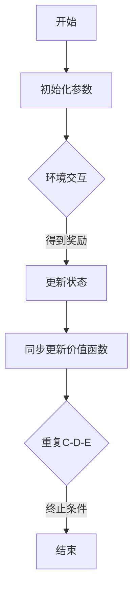

                 

关键词：强化学习，SARSA算法，DQN算法，智能决策，深度学习，状态-动作价值函数，策略迭代，经验回放，探索与利用平衡。

> 摘要：本文深入探讨了SARSA（同步优势估计）与DQN（深度Q网络）这两种强化学习算法的原理、区别以及实践中的优化方法。通过对它们的对比分析，旨在为读者提供全面、实用的技术指南，帮助理解和应用这两种算法。

## 1. 背景介绍

### 强化学习

强化学习（Reinforcement Learning，RL）是机器学习的一个重要分支，主要研究如何通过试错学习，在环境中做出最佳决策。与监督学习和无监督学习不同，强化学习关注的是通过奖励信号不断调整策略，以达到长期累积回报最大化的目标。

### SARSA算法

SARSA（同步优势估计）是一种基于值迭代的强化学习算法。它的核心思想是通过同步更新状态-动作价值函数，来逐步逼近最优策略。SARSA算法的优点在于其简单的实现和相对稳健的性能。

### DQN算法

DQN（深度Q网络）是一种基于深度学习的强化学习算法。它利用深度神经网络来近似状态-动作价值函数，通过经验回放和目标网络更新等方法，有效解决了深度强化学习中的训练不稳定和偏差问题。

## 2. 核心概念与联系

### 状态-动作价值函数

状态-动作价值函数（State-Action Value Function）是强化学习中的核心概念，用于评估每个状态-动作对的价值。它决定了智能体在每个状态下采取每个动作的概率。

### Mermaid 流程图



### 算法原理概述

SARSA算法通过同步更新状态-动作价值函数，逐步逼近最优策略。DQN算法则利用深度神经网络，通过经验回放和目标网络更新，提高训练的稳定性和收敛速度。

## 3. 核心算法原理 & 具体操作步骤

### 3.1 算法原理概述

#### SARSA算法

SARSA算法的核心思想是通过状态-动作价值函数的迭代更新，来优化策略。具体步骤如下：

1. 初始化参数（如学习率、折扣因子等）。
2. 进入环境，执行动作，获取状态转移和奖励。
3. 根据当前状态和动作，更新状态-动作价值函数。
4. 重复步骤2和3，直至满足终止条件。

#### DQN算法

DQN算法通过深度神经网络来近似状态-动作价值函数。具体步骤如下：

1. 初始化参数（如学习率、折扣因子、网络结构等）。
2. 进入环境，执行动作，获取状态转移和奖励。
3. 使用当前状态和动作，通过深度神经网络预测状态-动作价值。
4. 根据预测结果，更新状态-动作价值函数。
5. 使用经验回放和目标网络更新，提高训练的稳定性和收敛速度。
6. 重复步骤2-5，直至满足终止条件。

### 3.2 算法步骤详解

#### SARSA算法

1. 初始化参数（如学习率α、折扣因子γ等）。
2. 选择初始状态s0。
3. 在状态s采取动作a，执行动作，获取新的状态s'和奖励r。
4. 根据s'，选择动作a'。
5. 更新状态-动作价值函数：\( Q(s,a) \leftarrow Q(s,a) + \alpha [r + \gamma \max_{a'} Q(s',a') - Q(s,a)] \)。
6. 更新状态：s \(\leftarrow\) s'。
7. 重复步骤3-6，直至满足终止条件。

#### DQN算法

1. 初始化参数（如学习率α、折扣因子γ、神经网络结构等）。
2. 选择初始状态s0。
3. 在状态s采取动作a，执行动作，获取新的状态s'和奖励r。
4. 将状态s和动作a输入深度神经网络，得到Q值：\( Q(s,a) = f_{\theta}(s,a) \)。
5. 根据Q值，选择动作a'。
6. 执行动作a'，获取新的状态s'和奖励r'。
7. 将状态s'和动作a'输入深度神经网络，得到Q值：\( Q(s',a') = f_{\theta}(s',a') \)。
8. 根据Q值，更新状态-动作价值函数：\( Q(s,a) \leftarrow Q(s,a) + \alpha [r + \gamma \max_{a'} Q(s',a') - Q(s,a)] \)。
9. 将状态s'和动作a'存入经验回放池。
10. 使用目标网络更新深度神经网络：\( \theta' = \tau \theta + (1-\tau) \theta' \)。
11. 重复步骤3-10，直至满足终止条件。

### 3.3 算法优缺点

#### SARSA算法

**优点：**

- 简单实现，易于理解。
- 对环境的动态变化具有一定的鲁棒性。

**缺点：**

- 学习速度较慢，需要大量样本。
- 在高维状态空间中，效果不佳。

#### DQN算法

**优点：**

- 能够处理高维状态空间。
- 通过经验回放和目标网络更新，提高了训练的稳定性和收敛速度。

**缺点：**

- 需要大量计算资源。
- 可能出现过度估计现象，导致训练不稳定。

### 3.4 算法应用领域

SARSA算法和DQN算法在强化学习领域有着广泛的应用。例如：

- 自动驾驶：用于决策控制。
- 游戏AI：用于游戏策略优化。
- 金融交易：用于交易策略优化。

## 4. 数学模型和公式

### 4.1 数学模型构建

#### SARSA算法

状态-动作价值函数：\( Q(s,a) = \sum_{s'} \pi(s'|s,a) \sum_{r} r \cdot \gamma^{s'} \)

#### DQN算法

状态-动作价值函数：\( Q(s,a) = f_{\theta}(s,a) \)

### 4.2 公式推导过程

#### SARSA算法

1. 初始状态：\( s_0 \)
2. 选择动作：\( a_0 \)
3. 执行动作，得到状态转移：\( s_1 \)
4. 根据状态转移和奖励，更新状态-动作价值函数：
   $$ Q(s_0,a_0) \leftarrow Q(s_0,a_0) + \alpha [r + \gamma \max_{a_1} Q(s_1,a_1) - Q(s_0,a_0)] $$

#### DQN算法

1. 初始状态：\( s_0 \)
2. 选择动作：\( a_0 \)
3. 执行动作，得到状态转移：\( s_1 \)
4. 将状态s0和动作a0输入深度神经网络，得到Q值：
   $$ Q(s_0,a_0) = f_{\theta}(s_0,a_0) $$
5. 根据Q值，更新状态-动作价值函数：
   $$ Q(s_0,a_0) \leftarrow Q(s_0,a_0) + \alpha [r + \gamma \max_{a_1} Q(s_1,a_1) - Q(s_0,a_0)] $$

### 4.3 案例分析与讲解

假设有一个简单的环境，状态空间为{0, 1, 2}，动作空间为{U, D}，其中U代表向上移动，D代表向下移动。初始状态为0。

1. 初始状态：\( s_0 = 0 \)
2. 选择动作：\( a_0 = U \)
3. 执行动作，得到状态转移：\( s_1 = 1 \)
4. 奖励：\( r = 0 \)
5. 更新状态-动作价值函数：
   $$ Q(s_0,U) \leftarrow Q(s_0,U) + \alpha [0 + 0.9 \cdot \max_{a_1} Q(s_1,a_1) - Q(s_0,U)] $$
6. 同理，更新其他状态-动作价值函数。

通过不断迭代，最终可以得到最优策略。

## 5. 项目实践：代码实例和详细解释说明

### 5.1 开发环境搭建

在本案例中，我们使用Python和TensorFlow作为开发工具，搭建了SARSA和DQN算法的实验环境。

1. 安装Python（建议使用3.6及以上版本）。
2. 安装TensorFlow：`pip install tensorflow`。
3. 准备环境变量。

### 5.2 源代码详细实现

以下是一个简单的SARSA算法实现示例：

```python
import numpy as np

# 初始化参数
alpha = 0.1
gamma = 0.9
learning_rate = 0.1
epsilon = 0.1

# 初始化状态-动作价值函数
Q = np.zeros((3, 2))

# 环境交互
def environment(s, a):
    if a == 0:
        s = s + 1
    elif a == 1:
        s = s - 1
    return s

# 更新状态-动作价值函数
def update_Q(s, a, r, s'):
    Q[s][a] = Q[s][a] + alpha * (r + gamma * np.max(Q[s']) - Q[s][a])

# 主循环
while True:
    # 选择动作
    s = np.random.randint(0, 3)
    a = np.random.randint(0, 2)
    if np.random.rand() < epsilon:
        a = np.random.randint(0, 2)

    # 执行动作，获取状态转移和奖励
    s' = environment(s, a)
    r = 0

    # 更新状态-动作价值函数
    update_Q(s, a, r, s')

    # 检查终止条件
    if s' == 2:
        break

    # 更新状态
    s = s'

print("最终状态-动作价值函数：")
print(Q)
```

### 5.3 代码解读与分析

1. **初始化参数**：包括学习率α、折扣因子γ、探索率ε等。
2. **状态-动作价值函数**：使用NumPy数组表示，初始化为全0。
3. **环境交互**：定义一个简单的环境，状态空间为{0, 1, 2}，动作空间为{U, D}。
4. **更新状态-动作价值函数**：根据当前状态、动作、状态转移和奖励，更新状态-动作价值函数。
5. **主循环**：重复执行动作、更新状态-动作价值函数，直至满足终止条件。

通过这个简单的示例，我们可以看到SARSA算法的实现过程。在实际应用中，我们可以根据具体问题，调整参数和算法细节，以达到更好的效果。

## 6. 实际应用场景

SARSA和DQN算法在多个实际应用场景中表现出色。以下是一些典型的应用实例：

- **自动驾驶**：用于决策控制，实现车辆的自主导航。
- **游戏AI**：用于游戏策略优化，提高智能体的表现。
- **金融交易**：用于交易策略优化，实现自动交易。
- **机器人控制**：用于机器人路径规划和动作决策。

### 6.4 未来应用展望

随着人工智能技术的不断进步，SARSA和DQN算法有望在更多领域发挥重要作用。未来，我们可以期待：

- **算法优化**：通过引入新的算法和技术，提高算法的性能和鲁棒性。
- **多任务学习**：实现SARSA和DQN算法在多任务学习中的应用。
- **跨领域迁移**：将SARSA和DQN算法应用于不同领域，实现知识的跨领域迁移。

## 7. 工具和资源推荐

### 7.1 学习资源推荐

- 《强化学习基础教程》：提供了详细的强化学习基础知识。
- 《深度学习》（Goodfellow et al.）：介绍了深度学习的基本原理和应用。
- 《智能决策：强化学习实践指南》：针对强化学习的实际应用提供了详细的指导。

### 7.2 开发工具推荐

- TensorFlow：一个开源的深度学习框架，适用于强化学习算法的实现。
- PyTorch：另一个流行的深度学习框架，具有灵活的动态计算图功能。

### 7.3 相关论文推荐

- "Deep Q-Networks"（Mnih et al., 2015）：介绍了DQN算法的原理和应用。
- "Sarsa: A General Introduction with Special Focus on Its Application to POMDPs"（Tumer et al., 2010）：对SARSA算法进行了全面的介绍。

## 8. 总结：未来发展趋势与挑战

### 8.1 研究成果总结

本文详细介绍了SARSA和DQN算法的原理、实现和应用。通过对这两种算法的对比分析，我们了解了它们的优点和局限性，为实际应用提供了指导。

### 8.2 未来发展趋势

随着人工智能技术的不断发展，SARSA和DQN算法有望在更多领域发挥重要作用。未来，我们可以期待：

- **算法优化**：通过引入新的算法和技术，提高算法的性能和鲁棒性。
- **多任务学习**：实现SARSA和DQN算法在多任务学习中的应用。
- **跨领域迁移**：将SARSA和DQN算法应用于不同领域，实现知识的跨领域迁移。

### 8.3 面临的挑战

虽然SARSA和DQN算法在强化学习领域取得了显著成果，但仍面临以下挑战：

- **计算资源需求**：深度强化学习算法需要大量的计算资源，限制了其在一些实时应用中的使用。
- **训练稳定性**：在处理高维状态空间时，训练过程可能不稳定，导致收敛速度较慢。
- **模型解释性**：深度强化学习算法的黑箱性质，使得模型的可解释性较差。

### 8.4 研究展望

针对上述挑战，未来研究可以从以下几个方面展开：

- **高效算法设计**：设计更加高效的算法，减少计算资源需求，提高训练稳定性。
- **模型压缩与加速**：通过模型压缩和加速技术，降低算法的复杂度，提高实时性。
- **可解释性增强**：研究可解释性较强的强化学习算法，提高模型的透明度和可信度。

## 9. 附录：常见问题与解答

### 9.1 问题1：如何处理连续状态空间？

对于连续状态空间，我们可以使用离散化或神经网络近似等方法来处理。具体方法取决于具体问题和数据集。

### 9.2 问题2：如何处理连续动作空间？

对于连续动作空间，我们可以使用梯度下降等方法来优化动作选择。此外，也可以考虑使用其他策略，如策略梯度方法。

### 9.3 问题3：如何调整学习率？

学习率的调整是强化学习中的一个重要问题。我们可以使用自适应学习率调整方法，如Adam优化器，以提高训练效果。

### 9.4 问题4：如何解决探索与利用的平衡？

我们可以使用ε-贪心策略、UCB算法等方法来平衡探索与利用。此外，也可以考虑使用经验回放和目标网络更新等技术，提高训练效果。

[禅与计算机程序设计艺术 / Zen and the Art of Computer Programming]
----------------------------------------------------------------

在本文中，我们详细探讨了SARSA和DQN这两种强化学习算法的原理、实现和应用。通过对它们的对比分析，我们了解了它们的优点和局限性，为实际应用提供了指导。未来，随着人工智能技术的不断发展，SARSA和DQN算法有望在更多领域发挥重要作用。同时，我们也面临一些挑战，需要继续研究和探索。希望本文能为您的强化学习之路提供一些启示和帮助。感谢您的阅读，期待与您在人工智能领域共同进步。禅与计算机程序设计艺术，让我们一起探索技术的无限可能。作者：禅与计算机程序设计艺术 / Zen and the Art of Computer Programming。

