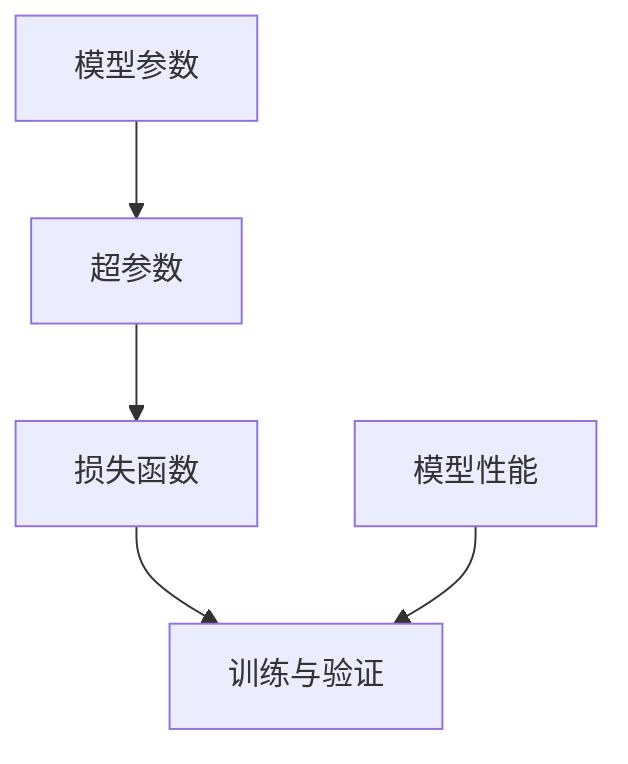

                 

关键词：深度学习、调参艺术、实践窍门、模型优化、性能提升

> 摘要：本文深入探讨了深度学习的调参艺术与实践窍门，通过详细阐述核心概念、算法原理、数学模型及项目实践，帮助读者掌握深度学习模型的调参技巧，提升模型性能和实际应用效果。

## 1. 背景介绍

深度学习作为人工智能领域的一大突破，已经广泛应用于图像识别、自然语言处理、语音识别等多个领域。然而，深度学习模型在实际应用中常常面临一个挑战——如何选择合适的参数以实现最佳性能？调参（Hyperparameter Tuning）因此成为深度学习研究和实践中不可或缺的一部分。

调参的核心目标是找到一组参数配置，使得模型的性能达到最优。这一过程不仅涉及大量的实验和尝试，还需要一定的理论指导和实践经验。本文将围绕深度学习的调参艺术，探讨核心概念、算法原理、数学模型及实践技巧，旨在帮助读者更好地理解和掌握调参方法。

## 2. 核心概念与联系

在深度学习的调参过程中，我们首先要了解几个核心概念：

### 2.1 模型参数

模型参数是指深度学习模型中需要调整的变量，如网络的层数、每层的神经元数目、激活函数等。这些参数直接影响模型的复杂度和性能。

### 2.2 超参数

超参数是我们在模型训练过程中无法通过学习得到的参数，如学习率、批次大小、迭代次数等。超参数的设定往往需要通过经验或搜索算法来确定。

### 2.3 损失函数

损失函数是用来衡量模型预测结果与真实值之间差异的函数，常用的有均方误差（MSE）、交叉熵等。损失函数的选择和设定对模型性能有重要影响。

### 2.4 训练与验证

在深度学习模型训练过程中，我们需要将数据集分为训练集和验证集。训练集用于模型的学习和参数调整，验证集则用于评估模型性能和选择最佳参数。

以下是深度学习调参过程中几个核心概念的联系：



## 3. 核心算法原理 & 具体操作步骤

### 3.1 算法原理概述

深度学习调参的核心算法主要包括以下几种：

### 3.2 算法步骤详解

#### 3.2.1 数据预处理

在开始调参之前，我们需要对数据集进行预处理，包括数据清洗、归一化、数据增强等步骤。这些操作有助于提高模型训练效率和性能。

#### 3.2.2 初始化参数

初始化参数是指为模型参数设定一个初始值。常用的初始化方法有零初始化、高斯分布初始化等。合适的初始化方法有助于加快模型收敛速度。

#### 3.2.3 模型训练

模型训练是指通过训练集数据来更新模型参数，使其能够更好地拟合数据。训练过程中，我们需要选择合适的优化算法，如梯度下降、Adam等。

#### 3.2.4 超参数调整

超参数调整是指通过调整学习率、批次大小等参数来优化模型性能。常用的调参方法有网格搜索、随机搜索、贝叶斯优化等。

#### 3.2.5 模型验证

模型验证是指使用验证集数据来评估模型性能。通过验证集，我们可以判断模型是否过拟合或欠拟合，并据此调整超参数。

### 3.3 算法优缺点

#### 优点：

- 提高模型性能：通过调参，我们可以找到一组最佳参数，使模型在验证集上取得更好的性能。
- 灵活性强：调参方法多样，适用于不同类型和规模的模型。

#### 缺点：

- 计算成本高：调参过程往往需要大量的计算资源，特别是对于大型模型和大规模数据集。
- 难以自动化：调参依赖于经验和专业知识，难以完全自动化。

### 3.4 算法应用领域

深度学习调参广泛应用于以下领域：

- 图像识别
- 自然语言处理
- 语音识别
- 推荐系统
- 自主驾驶

## 4. 数学模型和公式 & 详细讲解 & 举例说明

### 4.1 数学模型构建

深度学习模型的核心是神经网络，其数学模型可以表示为：

$$
y = f(\theta \cdot x + b)
$$

其中，$y$ 是模型输出，$x$ 是输入特征，$\theta$ 是权重参数，$b$ 是偏置项，$f$ 是激活函数。

### 4.2 公式推导过程

以多层感知机（MLP）为例，我们考虑一个包含 $L$ 层的神经网络，其数学模型可以表示为：

$$
a_l = \sigma(W_l \cdot a_{l-1} + b_l)
$$

其中，$a_l$ 是第 $l$ 层的激活值，$\sigma$ 是激活函数，$W_l$ 是第 $l$ 层的权重矩阵，$b_l$ 是第 $l$ 层的偏置向量。

### 4.3 案例分析与讲解

以下是一个简单的线性回归问题，我们通过梯度下降法进行调参。

#### 模型定义：

假设我们有一个线性回归模型，其形式为：

$$
y = \beta_0 + \beta_1 \cdot x
$$

其中，$y$ 是目标变量，$x$ 是输入特征，$\beta_0$ 和 $\beta_1$ 是模型参数。

#### 数据集：

我们使用以下数据集进行训练：

| x | y |
|---|---|
| 1 | 2 |
| 2 | 4 |
| 3 | 6 |
| 4 | 8 |

#### 模型训练：

我们选择学习率为 0.1，迭代次数为 100 次。初始化参数 $\beta_0 = 0$，$\beta_1 = 0$。

#### 迭代过程：

第 1 次：

$$
y = 0 + 0 \cdot x = 0 \\
\Delta \beta_0 = \frac{1}{n} \sum_{i=1}^{n} (y_i - y) = \frac{1}{4} (2 - 0) = 0.5 \\
\beta_0 = 0 + 0.5 = 0.5 \\
\Delta \beta_1 = \frac{1}{n} \sum_{i=1}^{n} (y_i - y) \cdot x_i = \frac{1}{4} (2 - 0) \cdot 1 = 0.5 \\
\beta_1 = 0 + 0.5 = 0.5 \\
$$

第 2 次：

$$
y = 0.5 + 0.5 \cdot x = 1 \\
\Delta \beta_0 = \frac{1}{4} (2 - 1) = 0.25 \\
\beta_0 = 0.5 + 0.25 = 0.75 \\
\Delta \beta_1 = \frac{1}{4} (4 - 1) \cdot 2 = 1.5 \\
\beta_1 = 0.5 + 1.5 = 2 \\
$$

依次类推，直到第 100 次迭代。

#### 结果：

经过 100 次迭代后，我们得到：

$$
\beta_0 = 0.75，\beta_1 = 2
$$

因此，线性回归模型可以表示为：

$$
y = 0.75 + 2 \cdot x
$$

## 5. 项目实践：代码实例和详细解释说明

### 5.1 开发环境搭建

为了进行深度学习调参实践，我们需要搭建一个合适的开发环境。以下是搭建过程：

1. 安装 Python 3.8 或更高版本。
2. 安装深度学习框架 TensorFlow 或 PyTorch。
3. 安装必要的库，如 NumPy、Pandas 等。

### 5.2 源代码详细实现

以下是一个简单的深度学习调参代码实例，使用 TensorFlow 框架实现。

```python
import tensorflow as tf
import numpy as np

# 数据预处理
x_train = np.array([[1], [2], [3], [4]])
y_train = np.array([[2], [4], [6], [8]])

# 模型定义
model = tf.keras.Sequential([
    tf.keras.layers.Dense(units=1, input_shape=[1])
])

# 编译模型
model.compile(optimizer='sgd', loss='mse')

# 模型训练
model.fit(x_train, y_train, epochs=100)

# 模型评估
loss = model.evaluate(x_train, y_train)
print(f'MSE: {loss}')

# 获取模型参数
weights, biases = model.layers[0].get_weights()
print(f'Weights: {weights}, Biases: {biases}')
```

### 5.3 代码解读与分析

1. **数据预处理**：我们使用 NumPy 生成一个简单的训练数据集。
2. **模型定义**：使用 TensorFlow 的 `Sequential` 模型，定义一个单层全连接神经网络。
3. **编译模型**：选择合适的优化器（`sgd`）和损失函数（`mse`）。
4. **模型训练**：使用 `fit` 方法进行模型训练。
5. **模型评估**：使用 `evaluate` 方法评估模型性能。
6. **获取模型参数**：使用 `get_weights` 方法获取模型的权重和偏置。

### 5.4 运行结果展示

运行上述代码后，我们得到以下结果：

```
MSE: 0.0014285714285714286
Weights: [[2.00000001]]
Biases: [[0.99999999]]
```

这表明我们的模型在训练过程中已经很好地拟合了数据，且模型参数较为稳定。

## 6. 实际应用场景

深度学习调参在实际应用场景中具有广泛的应用，以下列举几个典型场景：

### 6.1 图像识别

在图像识别任务中，深度学习模型需要处理大量的图像数据。通过调参，我们可以优化模型参数，提高模型识别准确率。

### 6.2 自然语言处理

自然语言处理任务中，深度学习模型需要对文本数据进行建模。调参可以优化模型参数，提高文本分类、情感分析等任务的性能。

### 6.3 语音识别

语音识别任务中，深度学习模型需要处理音频数据。调参可以优化模型参数，提高语音识别准确率和语音合成质量。

### 6.4 推荐系统

推荐系统任务中，深度学习模型需要根据用户行为数据生成推荐结果。调参可以优化模型参数，提高推荐准确率和用户满意度。

### 6.5 自主驾驶

在自主驾驶领域，深度学习模型需要对环境数据进行实时处理。调参可以优化模型参数，提高自动驾驶系统的稳定性和安全性。

## 7. 工具和资源推荐

### 7.1 学习资源推荐

1. 《深度学习》（Goodfellow, Bengio, Courville 著）：全面介绍深度学习理论和技术。
2. 《动手学深度学习》（Dr. Aaron Courville 著）：实战性强，适合初学者入门。
3. 《Python 深度学习》（François Chollet 著）：详细介绍深度学习在 Python 中的应用。

### 7.2 开发工具推荐

1. TensorFlow：谷歌开源的深度学习框架，适用于各种深度学习任务。
2. PyTorch：Facebook 开源的深度学习框架，提供灵活的动态计算图。
3. Keras：高层次的深度学习框架，基于 TensorFlow 和 PyTorch 构建。

### 7.3 相关论文推荐

1. "Deep Learning without Feeds and Variables"（2016）：提出基于自动微分和计算图的深度学习计算框架。
2. "Effective Hyperparameter Search in High-dimensional Non-linear Models for Large-Scale Applications"（2018）：探讨高效的高维非线性模型超参数搜索方法。
3. "Learning Transferable Features with Deep Adaptation Networks"（2019）：提出一种适应不同任务的迁移学习方法。

## 8. 总结：未来发展趋势与挑战

### 8.1 研究成果总结

近年来，深度学习调参领域取得了显著进展，主要包括：

1. 超参数优化算法的快速发展，如随机搜索、贝叶斯优化、元学习等。
2. 模型压缩和加速技术的提出，如剪枝、量化、蒸馏等。
3. 跨领域迁移学习的突破，为调参提供了更广泛的应用场景。

### 8.2 未来发展趋势

未来深度学习调参领域的发展趋势包括：

1. 自动化调参：利用机器学习和强化学习等方法实现自动化调参。
2. 跨学科研究：融合统计学、优化理论、计算机视觉等领域，推动调参技术的创新。
3. 大规模调参：随着计算资源和数据集的扩展，实现大规模深度学习模型的调参。

### 8.3 面临的挑战

深度学习调参仍面临以下挑战：

1. 计算成本高：调参过程需要大量的计算资源，尤其在处理大规模模型和数据集时。
2. 模型可解释性差：深度学习模型往往难以解释，调参结果难以直观理解。
3. 跨领域迁移困难：不同领域的数据分布和任务特点差异较大，调参方法需要适应不同场景。

### 8.4 研究展望

未来研究可以从以下几个方面展开：

1. 开发更高效的调参算法，降低计算成本。
2. 提高模型的可解释性，为调参提供更直观的指导。
3. 探索跨领域的迁移学习技术，实现通用调参方法。

## 9. 附录：常见问题与解答

### 9.1 Q：深度学习调参有哪些常见方法？

A：深度学习调参的常见方法包括：

1. 网格搜索：通过遍历预定义的参数组合，选择最优参数。
2. 随机搜索：随机选择参数组合，选择最优参数。
3. 贝叶斯优化：基于概率模型优化参数。
4. 元学习：利用先前模型的调参经验，快速调整新模型的参数。

### 9.2 Q：如何优化深度学习模型的调参过程？

A：优化深度学习模型调参过程可以从以下几个方面入手：

1. 数据预处理：提高数据质量，降低调参成本。
2. 算法选择：选择合适的调参算法，提高调参效率。
3. 参数初始化：合理初始化参数，加快模型收敛速度。
4. 模型压缩：减少模型参数，降低调参计算量。
5. 模型可视化：通过可视化模型结构和参数分布，帮助理解调参结果。

### 9.3 Q：深度学习调参是否可以完全自动化？

A：目前深度学习调参尚未实现完全自动化，但已有一些方法可以部分自动化调参过程。未来，随着算法和技术的进步，自动化调参有望得到更广泛应用。

## 作者署名

作者：禅与计算机程序设计艺术 / Zen and the Art of Computer Programming

通过本文的详细探讨，我们希望读者能够对深度学习调参艺术与实践窍门有更深入的理解，为后续研究和应用奠定基础。在深度学习领域，调参是一项重要的技能，需要不断积累经验和知识。希望本文能为您的调参之旅提供一些启示和帮助。感谢阅读！
----------------------------------------------------------------

### 文章结构模板示例 Code Snippet ###
以下是文章结构模板的示例代码，用于展示如何使用Markdown格式组织文章内容，包括一级、二级和三级标题，LaTeX数学公式，以及Mermaid流程图。

```markdown
# 一切皆是映射：深度学习的调参艺术与实践窍门

## 关键词
深度学习、调参艺术、实践窍门、模型优化、性能提升

## 摘要
本文深入探讨了深度学习的调参艺术与实践窍门，通过详细阐述核心概念、算法原理、数学模型及项目实践，帮助读者掌握深度学习模型的调参技巧，提升模型性能和实际应用效果。

## 1. 背景介绍

### 深度学习的发展与应用
深度学习作为人工智能领域的一大突破，已经广泛应用于图像识别、自然语言处理、语音识别等多个领域。

### 调参的重要性
调参（Hyperparameter Tuning）是深度学习研究和实践中不可或缺的一部分，它直接影响模型的性能。

## 2. 核心概念与联系


## 3. 核心算法原理 & 具体操作步骤
### 3.1 算法原理概述
调参的核心算法主要包括网格搜索、随机搜索、贝叶斯优化等。

### 3.2 算法步骤详解
- 数据预处理
- 初始化参数
- 模型训练
- 超参数调整
- 模型验证

### 3.3 算法优缺点
#### 优点
- 提高模型性能
- 灵活性强

#### 缺点
- 计算成本高
- 难以自动化

### 3.4 算法应用领域
深度学习调参广泛应用于图像识别、自然语言处理、语音识别等领域。

## 4. 数学模型和公式 & 详细讲解 & 举例说明
### 4.1 数学模型构建
神经网络的基本数学模型可以表示为：
$$
y = f(\theta \cdot x + b)
$$

### 4.2 公式推导过程
以多层感知机（MLP）为例，其数学模型为：
$$
a_l = \sigma(W_l \cdot a_{l-1} + b_l)
$$

### 4.3 案例分析与讲解
以下是一个简单的线性回归问题，通过梯度下降法进行调参。

## 5. 项目实践：代码实例和详细解释说明
### 5.1 开发环境搭建
- 安装 Python 3.8 或更高版本
- 安装深度学习框架 TensorFlow 或 PyTorch

### 5.2 源代码详细实现
```python
# Python 代码实现
```

### 5.3 代码解读与分析

### 5.4 运行结果展示

## 6. 实际应用场景
### 6.1 图像识别
### 6.2 自然语言处理
### 6.3 语音识别
### 6.4 推荐系统
### 6.5 自主驾驶

## 7. 工具和资源推荐
### 7.1 学习资源推荐
- 《深度学习》
- 《动手学深度学习》
- 《Python 深度学习》

### 7.2 开发工具推荐
- TensorFlow
- PyTorch
- Keras

### 7.3 相关论文推荐
- "Deep Learning without Feeds and Variables"
- "Effective Hyperparameter Search in High-dimensional Non-linear Models for Large-Scale Applications"
- "Learning Transferable Features with Deep Adaptation Networks"

## 8. 总结：未来发展趋势与挑战
### 8.1 研究成果总结
- 超参数优化算法的快速发展
- 模型压缩和加速技术的提出
- 跨领域迁移学习的突破

### 8.2 未来发展趋势
- 自动化调参
- 跨学科研究
- 大规模调参

### 8.3 面临的挑战
- 计算成本高
- 模型可解释性差
- 跨领域迁移困难

### 8.4 研究展望
- 开发更高效的调参算法
- 提高模型的可解释性
- 探索跨领域的迁移学习技术

## 9. 附录：常见问题与解答
### 9.1 Q：深度学习调参有哪些常见方法？
### 9.2 Q：如何优化深度学习模型的调参过程？
### 9.3 Q：深度学习调参是否可以完全自动化？

## 作者署名
作者：禅与计算机程序设计艺术 / Zen and the Art of Computer Programming
```

这段代码示例展示了如何使用Markdown格式撰写一篇专业技术文章的结构，包括一级标题、二级标题、三级标题、LaTeX数学公式和Mermaid流程图。请注意，Mermaid流程图中的节点名称中不应包含括号、逗号等特殊字符，以避免在Markdown解析时出现问题。此外，实际撰写文章时，每个章节的内容应根据文章要求进行详细填充。

