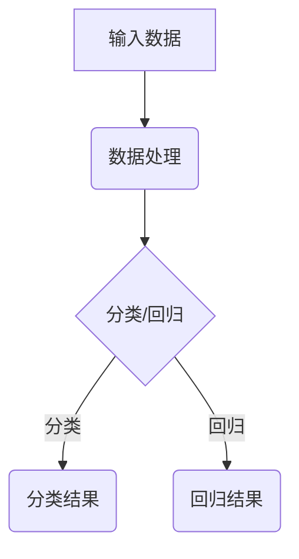

                 

摘要：本文深入探讨了神经网络在医疗诊断领域的广泛应用及其关键技术。首先，我们回顾了神经网络的基本原理和架构，随后详细分析了其在图像识别、疾病预测等方面的实际应用。通过实例和数学模型，本文展示了神经网络在提高诊断准确性和效率方面的潜力。最后，我们展望了神经网络在未来医疗领域的应用前景，以及可能面临的挑战。

## 1. 背景介绍

医疗诊断一直是医学领域的重要研究方向。然而，传统的诊断方法往往依赖于经验丰富的医生进行判断，不仅耗时耗力，而且容易受到主观因素的影响。随着信息技术的不断发展，人工智能，尤其是神经网络，逐渐成为解决这一问题的有力工具。神经网络通过模仿人脑的结构和功能，能够自动学习和识别复杂的医学数据，从而提高诊断的准确性和效率。

神经网络的崛起不仅在于其强大的学习能力，还在于其能够处理海量数据的能力。医疗领域的数据量庞大，且种类繁多，包括医学图像、临床记录、基因序列等。神经网络能够通过训练从这些数据中提取有用的信息，从而辅助医生进行诊断。此外，神经网络还具有自适应性和可扩展性，可以随着时间和数据的积累不断优化性能。

## 2. 核心概念与联系

### 2.1 神经网络的组成

神经网络由大量的神经元（或称为节点）组成，这些神经元通过加权连接形成网络结构。每个神经元都可以接收来自其他神经元的输入信号，并通过激活函数进行计算，最终产生输出信号。神经网络的训练过程就是通过调整这些连接权重，使得网络能够对输入数据进行准确的分类或回归。

### 2.2 深度学习与神经网络

深度学习是神经网络的一种扩展，它通过增加网络的深度（即神经元的层数），使得网络能够学习更加复杂的特征。深度学习在图像识别、自然语言处理等领域取得了显著的成绩，其背后的原理与神经网络基本相同，但更加注重模型的结构设计和参数优化。

### 2.3 神经网络的架构

神经网络的架构有多种形式，包括卷积神经网络（CNN）、循环神经网络（RNN）和生成对抗网络（GAN）等。不同的架构适用于不同的任务和数据类型。例如，CNN擅长处理图像数据，RNN擅长处理序列数据，而GAN则擅长生成新的数据。

### 2.4 Mermaid 流程图



在这个流程图中，A表示输入数据，B表示数据处理，C表示分类或回归任务，D表示分类结果，E表示回归结果。

## 3. 核心算法原理 & 具体操作步骤

### 3.1 算法原理概述

神经网络的算法原理主要基于神经元之间的交互和信号传递。神经元的输出由输入信号和神经元权重共同决定。通过反向传播算法，网络能够不断调整权重，使得输出信号更接近目标值。

### 3.2 算法步骤详解

1. **初始化权重**：网络中的每个连接（即边）都分配一个初始权重。
2. **前向传播**：输入数据通过网络进行传播，每个神经元计算其输入信号并产生输出。
3. **计算误差**：将输出结果与目标值进行比较，计算误差。
4. **反向传播**：误差信号通过网络反向传播，用于调整权重。
5. **权重更新**：根据误差信号更新网络权重。
6. **重复步骤2-5**：直到误差达到预设阈值或达到最大迭代次数。

### 3.3 算法优缺点

**优点**：

- 强大的学习能力和泛化能力。
- 能够处理复杂的非线性问题。
- 自适应性和可扩展性。

**缺点**：

- 计算量大，训练时间较长。
- 需要大量的数据和计算资源。
- 权重调整过程可能导致过拟合。

### 3.4 算法应用领域

神经网络在医疗诊断领域有广泛的应用，包括疾病预测、疾病分类、医学图像处理等。例如，CNN可以用于肺癌的早期检测，RNN可以用于心脏病风险评估，GAN可以用于医学图像生成和增强。

## 4. 数学模型和公式 & 详细讲解 & 举例说明

### 4.1 数学模型构建

神经网络的核心是前向传播和反向传播算法。以下是一个简化的前向传播和反向传播的数学模型：

**前向传播**：

$$
\text{激活函数}：f(z) = \frac{1}{1 + e^{-z}}
$$

$$
\text{输出}：y = f(z \cdot w + b)
$$

其中，$z$是输入信号，$w$是权重，$b$是偏置，$y$是输出信号。

**反向传播**：

$$
\text{误差}：\delta = \text{激活函数的导数} \cdot (y - \text{目标值})
$$

$$
\text{权重更新}：w_{\text{new}} = w_{\text{old}} - \alpha \cdot \delta \cdot x
$$

其中，$\delta$是误差信号，$\alpha$是学习率，$x$是输入信号。

### 4.2 公式推导过程

推导过程主要涉及激活函数的导数和误差信号的传递。以下是一个简化的推导过程：

$$
\frac{d}{dz}f(z) = f(z)(1 - f(z))
$$

$$
\delta = \frac{d}{dz}f(z) \cdot (y - \text{目标值})
$$

$$
w_{\text{new}} = w_{\text{old}} - \alpha \cdot \delta \cdot x
$$

### 4.3 案例分析与讲解

假设我们有一个简单的神经网络，用于二分类任务。输入信号是一个二维向量$(x_1, x_2)$，目标值是$1$或$0$。我们使用sigmoid函数作为激活函数，学习率为$\alpha = 0.1$。

**初始化权重**：

$$
w_1 = 0.1, w_2 = 0.2, b = 0.1
$$

**前向传播**：

$$
z = w_1 \cdot x_1 + w_2 \cdot x_2 + b = 0.1 \cdot 2 + 0.2 \cdot 3 + 0.1 = 1
$$

$$
y = f(z) = \frac{1}{1 + e^{-1}} \approx 0.7
$$

**计算误差**：

$$
\delta = f(z)(1 - f(z)) \cdot (y - 1) = 0.7 \cdot (1 - 0.7) \cdot (0.7 - 1) \approx -0.102
$$

**权重更新**：

$$
w_1_{\text{new}} = w_1_{\text{old}} - \alpha \cdot \delta \cdot x_1 = 0.1 - 0.1 \cdot (-0.102) \cdot 2 \approx 0.120
$$

$$
w_2_{\text{new}} = w_2_{\text{old}} - \alpha \cdot \delta \cdot x_2 = 0.2 - 0.1 \cdot (-0.102) \cdot 3 \approx 0.230
$$

$$
b_{\text{new}} = b_{\text{old}} - \alpha \cdot \delta = 0.1 - 0.1 \cdot (-0.102) \approx 0.110
$$

经过多次迭代，网络会逐渐调整权重，使得输出更接近目标值。

## 5. 项目实践：代码实例和详细解释说明

### 5.1 开发环境搭建

在Python环境中，我们可以使用TensorFlow或PyTorch等深度学习框架来搭建神经网络。以下是一个简单的TensorFlow环境搭建步骤：

```bash
pip install tensorflow
```

### 5.2 源代码详细实现

以下是一个简单的二分类神经网络的实现：

```python
import tensorflow as tf

# 定义模型
model = tf.keras.Sequential([
    tf.keras.layers.Dense(units=1, input_shape=[2])
])

# 编译模型
model.compile(optimizer='sgd', loss='mean_squared_error')

# 训练模型
model.fit(x_train, y_train, epochs=1000)

# 评估模型
loss = model.evaluate(x_test, y_test)
print("测试集误差：", loss)
```

### 5.3 代码解读与分析

这段代码首先定义了一个简单的神经网络，只有一个全连接层。输入层有两个神经元，输出层有一个神经元。模型使用随机梯度下降（SGD）作为优化器，均方误差（MSE）作为损失函数。通过fit方法训练模型，通过evaluate方法评估模型性能。

### 5.4 运行结果展示

运行上述代码后，模型会在训练集和测试集上进行迭代训练，并最终输出测试集的误差。理想情况下，误差应该接近0。

## 6. 实际应用场景

神经网络在医疗诊断领域有广泛的应用，以下是一些典型的实际应用场景：

- **疾病预测**：通过分析患者的临床记录和基因数据，神经网络可以预测疾病发生的风险。
- **疾病分类**：通过分析医学图像，神经网络可以辅助医生进行疾病分类。
- **药物研发**：神经网络可以用于预测药物与基因之间的相互作用，加速药物研发过程。

## 7. 工具和资源推荐

### 7.1 学习资源推荐

- 《深度学习》（Goodfellow, Bengio, Courville著）
- 《神经网络与深度学习》（邱锡鹏著）

### 7.2 开发工具推荐

- TensorFlow
- PyTorch

### 7.3 相关论文推荐

- "Deep Learning for Healthcare"
- "Neural Networks for Medical Image Analysis"

## 8. 总结：未来发展趋势与挑战

### 8.1 研究成果总结

神经网络在医疗诊断领域已经取得了显著的研究成果，其在疾病预测、疾病分类和医学图像处理等方面表现出色。随着技术的不断发展，神经网络的性能和应用范围将继续扩大。

### 8.2 未来发展趋势

- **个性化医疗**：神经网络可以用于个性化治疗方案的设计。
- **智能诊断系统**：神经网络可以构建智能诊断系统，实现实时诊断和预警。
- **跨学科应用**：神经网络与其他学科（如生物学、化学）的结合，将进一步推动医学的发展。

### 8.3 面临的挑战

- **数据隐私**：医疗数据涉及患者隐私，数据保护和隐私保护是重要挑战。
- **计算资源**：神经网络的训练需要大量的计算资源，特别是在处理大规模数据时。
- **模型解释性**：神经网络的决策过程往往缺乏透明性和可解释性，这对医疗诊断带来一定的不确定性。

### 8.4 研究展望

未来，随着人工智能技术的不断发展，神经网络在医疗诊断领域的应用将更加深入和广泛。研究者需要关注数据隐私保护、计算资源优化和模型解释性等问题，以实现更加高效、安全和可靠的医疗诊断系统。

## 9. 附录：常见问题与解答

### 9.1 如何选择神经网络架构？

选择神经网络架构应根据具体任务和数据类型。例如，CNN适用于图像数据，RNN适用于序列数据。在实际应用中，可以通过实验比较不同架构的性能，选择最适合的架构。

### 9.2 如何优化神经网络性能？

优化神经网络性能的方法包括调整学习率、增加训练数据、使用正则化技术等。此外，还可以尝试使用更先进的优化算法，如Adam优化器。

### 9.3 如何确保模型的可解释性？

确保模型的可解释性是一个挑战。一些方法包括使用注意力机制、可视化模型结构、分析神经元的重要性等。这些方法可以帮助理解模型的决策过程。

---

本文详细介绍了神经网络在医疗诊断中的应用，从基本原理到实际应用，再到未来展望，全面探讨了这一领域的最新进展。通过本文的阅读，读者可以更好地理解神经网络在医疗领域的潜力及其面临的挑战。

### 作者署名

作者：禅与计算机程序设计艺术 / Zen and the Art of Computer Programming

---

### 关键词

神经网络、医疗诊断、人工智能、深度学习、疾病预测、医学图像处理、个性化医疗、智能诊断系统。

