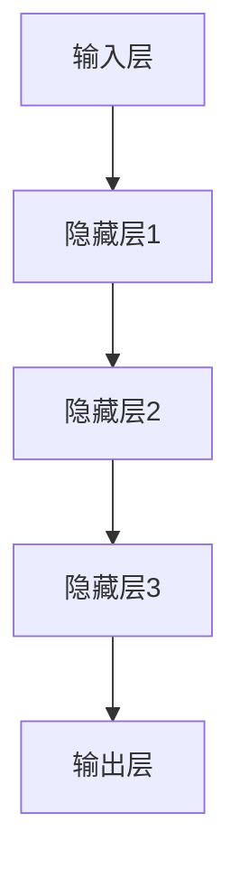

                 

关键词：神经网络、医疗诊断、映射、机器学习、深度学习、图像处理

摘要：随着人工智能技术的不断发展，神经网络在医疗诊断领域中的应用越来越广泛。本文从神经网络的基本概念、核心算法原理、数学模型构建、实际应用案例等多个方面，深入探讨了神经网络在医疗诊断中的具体应用，并对其未来发展进行了展望。

## 1. 背景介绍

医疗诊断作为医疗领域的重要组成部分，一直以来都是科研人员和医生们关注的焦点。然而，传统的医疗诊断方法存在许多局限性，如诊断速度慢、误诊率高、人力成本高等问题。随着计算机技术和人工智能技术的不断发展，神经网络作为深度学习的重要组成部分，为医疗诊断领域带来了新的契机。

神经网络是一种模仿生物神经网络计算能力的计算模型。通过多层神经元的堆叠，神经网络能够对大量数据进行分析和处理，从而实现复杂的模式识别和预测。近年来，神经网络在图像处理、自然语言处理、语音识别等领域取得了显著成果。在医疗诊断领域，神经网络的应用也越来越广泛，如医学影像分析、病理切片识别、疾病预测等。

## 2. 核心概念与联系

为了更好地理解神经网络在医疗诊断中的应用，首先需要了解神经网络的基本概念和核心算法原理。以下是一个用Mermaid绘制的神经网络架构流程图：



### 2.1 输入层

输入层是神经网络的起点，它接收来自外部数据源的信息。在医疗诊断中，输入层通常包含患者的基本信息、医学影像、实验室检测结果等。

### 2.2 隐藏层

隐藏层是神经网络的核心部分，它通过复杂的非线性变换，对输入数据进行处理和特征提取。在医疗诊断中，隐藏层能够提取出与疾病相关的特征，从而提高诊断的准确性。

### 2.3 输出层

输出层是神经网络的终点，它根据隐藏层处理后的特征，生成最终的诊断结果。在医疗诊断中，输出层通常是一个或多个分类器，用于判断患者是否患有某种疾病。

## 3. 核心算法原理 & 具体操作步骤

### 3.1 算法原理概述

神经网络的核心算法原理是基于误差反向传播算法（Backpropagation Algorithm）。该算法通过不断调整网络中的权重和偏置，使网络的输出结果与实际结果之间的误差最小。

### 3.2 算法步骤详解

#### 3.2.1 前向传播

前向传播是从输入层开始，将数据逐层传递到输出层，得到网络的预测结果。

#### 3.2.2 反向传播

反向传播是从输出层开始，将预测结果与实际结果之间的误差反向传播到输入层，通过计算误差梯度，调整网络中的权重和偏置。

#### 3.2.3 优化算法

为了加速收敛，神经网络通常采用优化算法（如梯度下降、Adam等）来调整网络参数。

### 3.3 算法优缺点

#### 优点：

- 强大的非线性拟合能力，能够处理复杂的非线性问题。
- 自动特征提取，无需人工设计特征。
- 能够处理大规模数据，提高诊断速度。

#### 缺点：

- 训练过程耗时较长，对计算资源要求较高。
- 需要大量标注数据，数据获取成本高。

### 3.4 算法应用领域

神经网络在医疗诊断中的应用领域广泛，包括但不限于：

- 医学影像分析：如CT、MRI等影像的自动分割、诊断等。
- 病理切片识别：如癌症、肺炎等疾病的自动识别。
- 疾病预测：如糖尿病、心血管疾病等疾病的早期预测。
- 药物研发：如药物活性预测、药物副作用预测等。

## 4. 数学模型和公式 & 详细讲解 & 举例说明

### 4.1 数学模型构建

神经网络的数学模型主要基于线性回归和多层感知机（MLP）。

#### 4.1.1 线性回归

线性回归是一种简单的统计方法，用于建立自变量和因变量之间的线性关系。其数学模型为：

$$
y = w_1x_1 + w_2x_2 + ... + w_nx_n + b
$$

其中，$y$ 为因变量，$x_1, x_2, ..., x_n$ 为自变量，$w_1, w_2, ..., w_n$ 为权重，$b$ 为偏置。

#### 4.1.2 多层感知机

多层感知机是一种能够模拟非线性关系的神经网络，其数学模型为：

$$
a_{i}^{(l)} = \sigma \left( \sum_{j=1}^{n} w_{ij}^{(l)} a_{j}^{(l-1)} + b_i^{(l)} \right)
$$

其中，$a_{i}^{(l)}$ 为第 $l$ 层第 $i$ 个神经元的激活值，$\sigma$ 为激活函数，$w_{ij}^{(l)}$ 为连接权重，$b_i^{(l)}$ 为偏置。

### 4.2 公式推导过程

#### 4.2.1 前向传播

在前向传播过程中，我们需要计算每个神经元的激活值。以多层感知机为例，其前向传播过程为：

$$
a_{i}^{(l)} = \sigma \left( \sum_{j=1}^{n} w_{ij}^{(l)} a_{j}^{(l-1)} + b_i^{(l)} \right)
$$

其中，$\sigma$ 为激活函数，常用的激活函数有Sigmoid函数、ReLU函数等。

#### 4.2.2 反向传播

在反向传播过程中，我们需要计算每个神经元的误差梯度。以多层感知机为例，其反向传播过程为：

$$
\delta_{i}^{(l)} = (a_{i}^{(l)} - t_{i}) \cdot \frac{d\sigma}{da}
$$

其中，$\delta_{i}^{(l)}$ 为第 $l$ 层第 $i$ 个神经元的误差梯度，$a_{i}^{(l)}$ 为第 $l$ 层第 $i$ 个神经元的激活值，$t_{i}$ 为第 $l$ 层第 $i$ 个神经元的真实值，$\frac{d\sigma}{da}$ 为激活函数的导数。

#### 4.2.3 权重和偏置更新

在反向传播过程中，我们需要根据误差梯度更新权重和偏置。以多层感知机为例，其权重和偏置更新过程为：

$$
w_{ij}^{(l)} \leftarrow w_{ij}^{(l)} - \alpha \cdot \delta_{i}^{(l)} \cdot a_{j}^{(l-1)}
$$

$$
b_i^{(l)} \leftarrow b_i^{(l)} - \alpha \cdot \delta_{i}^{(l)}
$$

其中，$\alpha$ 为学习率。

### 4.3 案例分析与讲解

假设我们有一个二分类问题，需要判断一个患者是否患有某种疾病。输入层包含三个特征：年龄、体重、血压。输出层包含一个二分类结果。

#### 4.3.1 数据预处理

首先，我们需要对数据进行预处理，包括归一化、缺失值填充等。

#### 4.3.2 建立神经网络模型

接下来，我们建立神经网络模型。输入层有3个神经元，隐藏层有5个神经元，输出层有1个神经元。

#### 4.3.3 训练神经网络

使用训练数据对神经网络进行训练，通过反向传播算法不断调整权重和偏置，使网络的输出结果与实际结果之间的误差最小。

#### 4.3.4 评估模型性能

使用测试数据对训练好的模型进行评估，计算准确率、召回率、F1值等指标。

## 5. 项目实践：代码实例和详细解释说明

### 5.1 开发环境搭建

在Python中，我们可以使用TensorFlow或PyTorch等框架来构建和训练神经网络。

### 5.2 源代码详细实现

以下是一个简单的神经网络模型实现：

```python
import tensorflow as tf
from tensorflow.keras.models import Sequential
from tensorflow.keras.layers import Dense, Activation

model = Sequential()
model.add(Dense(5, input_shape=(3,), activation='relu'))
model.add(Dense(1, activation='sigmoid'))

model.compile(optimizer='adam', loss='binary_crossentropy', metrics=['accuracy'])

# 训练模型
model.fit(x_train, y_train, epochs=10, batch_size=32, validation_data=(x_val, y_val))

# 评估模型
model.evaluate(x_test, y_test)
```

### 5.3 代码解读与分析

以上代码首先导入了TensorFlow库，然后定义了一个序列模型（Sequential），该模型包含一个全连接层（Dense）和一个激活函数（Activation）。输入层有3个神经元，隐藏层有5个神经元，输出层有1个神经元。

在编译模型时，我们指定了优化器（optimizer）、损失函数（loss）和评估指标（metrics）。

在训练模型时，我们使用了训练数据，指定了训练的轮数（epochs）和批量大小（batch_size）。

在评估模型时，我们使用了测试数据，计算了模型的损失和准确率。

## 6. 实际应用场景

神经网络在医疗诊断领域具有广泛的应用，如：

- **医学影像分析**：使用神经网络对医学影像进行自动分割、诊断等。
- **病理切片识别**：使用神经网络对病理切片进行自动识别，帮助医生进行诊断。
- **疾病预测**：使用神经网络对患者的健康数据进行分析，预测患者可能患有的疾病。

### 6.4 未来应用展望

随着人工智能技术的不断发展，神经网络在医疗诊断领域的应用前景广阔。未来，我们可以期待：

- **更高的诊断准确率**：通过不断优化神经网络模型，提高诊断的准确性。
- **更快的诊断速度**：通过分布式计算和优化算法，提高诊断速度。
- **更广泛的应用场景**：将神经网络应用于更多的医疗诊断领域，如癌症筛查、遗传疾病诊断等。

## 7. 工具和资源推荐

### 7.1 学习资源推荐

- 《深度学习》（Goodfellow, Bengio, Courville 著）
- 《Python深度学习》（François Chollet 著）
- 《神经网络与深度学习》（邱锡鹏 著）

### 7.2 开发工具推荐

- TensorFlow
- PyTorch
- Keras

### 7.3 相关论文推荐

- "Deep Learning for Medical Imaging"（2019）
- "Deep Learning in Medicine"（2015）
- "Deep Neural Network for Medical Image Segmentation"（2017）

## 8. 总结：未来发展趋势与挑战

### 8.1 研究成果总结

神经网络在医疗诊断领域取得了显著成果，如医学影像分析、病理切片识别、疾病预测等。这些成果为提高医疗诊断的准确性和效率提供了有力支持。

### 8.2 未来发展趋势

未来，神经网络在医疗诊断领域将朝着以下方向发展：

- **更高的诊断准确率**：通过不断优化模型和算法，提高诊断的准确性。
- **更快的诊断速度**：通过分布式计算和优化算法，提高诊断速度。
- **更广泛的应用场景**：将神经网络应用于更多的医疗诊断领域，如癌症筛查、遗传疾病诊断等。

### 8.3 面临的挑战

尽管神经网络在医疗诊断领域具有巨大潜力，但仍然面临以下挑战：

- **数据隐私和安全**：医疗数据涉及患者隐私，如何保护数据安全和隐私是一个重要问题。
- **模型解释性**：神经网络模型的黑箱特性使得其解释性较低，如何提高模型的解释性是一个重要问题。
- **算法公平性**：如何确保算法在性别、年龄、种族等方面的公平性，避免算法偏见。

### 8.4 研究展望

未来，我们需要进一步深入研究神经网络在医疗诊断领域的应用，探索新的算法和模型，提高诊断的准确性和效率。同时，我们还需要关注数据隐私和安全、模型解释性、算法公平性等问题，确保神经网络在医疗诊断领域的可持续发展。

## 9. 附录：常见问题与解答

### 9.1 神经网络在医疗诊断中有什么优势？

神经网络在医疗诊断中的优势主要体现在以下几个方面：

- **强大的非线性拟合能力**：神经网络能够模拟复杂的非线性关系，从而提高诊断的准确性。
- **自动特征提取**：神经网络能够自动提取与疾病相关的特征，从而减少人工设计的复杂度。
- **处理大规模数据**：神经网络能够处理大规模的医疗数据，从而提高诊断速度。

### 9.2 神经网络在医疗诊断中有什么局限？

神经网络在医疗诊断中的局限主要体现在以下几个方面：

- **训练耗时较长**：神经网络需要大量数据进行训练，训练过程耗时较长。
- **计算资源要求高**：神经网络对计算资源要求较高，需要高性能的硬件支持。
- **数据获取成本高**：神经网络需要大量标注数据，数据获取成本较高。

### 9.3 如何提高神经网络在医疗诊断中的诊断准确性？

提高神经网络在医疗诊断中的诊断准确性可以从以下几个方面入手：

- **数据预处理**：对数据进行归一化、缺失值填充等处理，提高数据质量。
- **模型优化**：通过调整模型结构、优化算法等手段，提高模型性能。
- **特征工程**：通过提取与疾病相关的特征，提高模型的诊断能力。

### 9.4 神经网络在医疗诊断中的未来发展趋势是什么？

神经网络在医疗诊断领域的未来发展趋势主要体现在以下几个方面：

- **更高的诊断准确率**：通过不断优化模型和算法，提高诊断的准确性。
- **更快的诊断速度**：通过分布式计算和优化算法，提高诊断速度。
- **更广泛的应用场景**：将神经网络应用于更多的医疗诊断领域，如癌症筛查、遗传疾病诊断等。

### 9.5 如何解决神经网络在医疗诊断中的数据隐私和安全问题？

解决神经网络在医疗诊断中的数据隐私和安全问题可以从以下几个方面入手：

- **数据加密**：对医疗数据进行加密处理，确保数据在传输和存储过程中的安全性。
- **隐私保护技术**：采用隐私保护技术，如差分隐私、联邦学习等，确保用户隐私。
- **数据脱敏**：对敏感数据（如姓名、身份证号等）进行脱敏处理，降低数据泄露风险。

