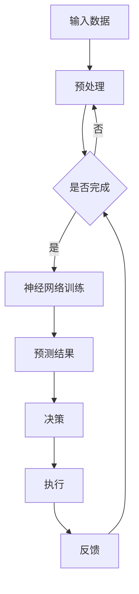

                 

关键词：神经网络、物流优化、映射、实践案例、人工智能

> 摘要：本文将探讨如何利用神经网络优化物流过程中的资源配置，提高运输效率和成本效益。通过介绍神经网络的基本原理和物流优化中的核心问题，结合实际案例分析，展示神经网络在物流优化中的应用场景和潜力。

## 1. 背景介绍

随着全球经济的快速发展，物流行业在推动贸易和经济增长中扮演着至关重要的角色。然而，物流系统的复杂性和动态性使得传统的优化方法难以满足实际需求。近年来，人工智能和机器学习技术的进步为物流优化提供了新的思路和方法。特别是神经网络作为一种强大的机器学习模型，已经在各个领域展现出了卓越的性能。

神经网络（Neural Networks）起源于对生物神经系统的模拟，其基本单元是神经元。神经网络通过多层神经元的互联和激活，能够对复杂数据进行自动特征提取和模式识别。随着深度学习技术的发展，神经网络已经从简单的感知机（Perceptron）发展到多层感知机（MLP），再到深度神经网络（DNN）和卷积神经网络（CNN）等更复杂的结构。

在物流领域，神经网络的应用主要集中在以下几个方面：

1. **路径规划**：通过神经网络预测交通流量和路况，优化运输路线。
2. **库存管理**：利用神经网络预测市场需求和货物流转，优化库存水平。
3. **运输调度**：根据实时数据和预测结果，优化运输资源和调度策略。
4. **风险评估**：通过神经网络分析潜在风险，提前采取预防措施。

## 2. 核心概念与联系

在深入探讨神经网络在物流优化中的应用之前，我们需要理解几个核心概念：神经网络架构、映射原理以及物流优化中的关键问题。

### 2.1 神经网络架构

神经网络通常由输入层、隐藏层和输出层组成。每个层包含多个神经元，神经元之间通过权重（weights）和偏置（bias）进行连接。信息的传播过程是通过前向传播（forward propagation）和反向传播（backpropagation）来实现的。在前向传播过程中，输入信号通过神经元网络传递，最终在输出层产生预测结果。反向传播过程则是根据预测结果和实际结果之间的误差，调整神经网络的权重和偏置，以优化模型性能。

### 2.2 映射原理

神经网络的映射原理是指将输入数据映射到输出数据的过程。这个过程依赖于神经网络的权重和偏置。例如，在物流优化中，输入数据可以是交通流量、天气状况、货物类型等，输出数据则是最优的运输路线或调度方案。通过训练，神经网络能够学习到输入和输出之间的映射关系，从而实现优化目标。

### 2.3 物流优化中的关键问题

物流优化中的关键问题包括路径规划、资源调度、库存管理和风险控制等。这些问题具有以下特点：

1. **非线性和动态性**：物流系统的状态和约束条件复杂，且随时间变化。
2. **多目标和多约束**：优化目标包括成本、时间、质量等，同时需要满足多个约束条件。
3. **不确定性**：市场需求、交通状况等因素的不确定性增加了优化难度。

### 2.4 Mermaid 流程图

为了更好地展示神经网络在物流优化中的应用，我们使用 Mermaid 语言绘制一个简单的流程图。



## 3. 核心算法原理 & 具体操作步骤

### 3.1 算法原理概述

神经网络在物流优化中的核心算法原理主要包括两部分：路径规划算法和资源调度算法。

1. **路径规划算法**：利用神经网络预测交通流量和路况，通过优化算法找到最优路径。常用的路径规划算法包括 A* 算法、Dijkstra 算法和神经网络规划算法等。
2. **资源调度算法**：根据物流需求、资源状况和实时数据，利用神经网络优化运输资源和调度策略。常用的资源调度算法包括遗传算法、模拟退火算法和神经网络调度算法等。

### 3.2 算法步骤详解

1. **数据收集与预处理**：收集物流过程中的交通流量、货物信息、运输资源等数据，进行数据清洗、归一化和特征提取。
2. **神经网络构建**：设计并构建神经网络结构，包括输入层、隐藏层和输出层。选择合适的激活函数和损失函数。
3. **训练与优化**：使用训练数据对神经网络进行训练，通过反向传播算法调整权重和偏置，优化模型性能。
4. **路径规划与调度**：利用训练好的神经网络预测交通流量、路况和物流需求，根据预测结果进行路径规划和资源调度。
5. **执行与反馈**：执行调度方案，根据实际运行情况进行反馈，调整模型参数，优化调度策略。

### 3.3 算法优缺点

1. **优点**：
   - **高效性**：神经网络能够快速处理大量数据，提高优化速度。
   - **灵活性**：神经网络可以灵活适应不同的优化目标和约束条件。
   - **自学习能力**：神经网络可以通过训练不断优化模型性能。
2. **缺点**：
   - **计算复杂性**：神经网络训练过程需要大量的计算资源和时间。
   - **数据需求**：神经网络需要大量高质量的数据进行训练，否则容易过拟合。
   - **模型解释性**：神经网络模型具有较强的黑盒特性，难以解释和理解。

### 3.4 算法应用领域

神经网络在物流优化中的应用领域广泛，包括但不限于：

1. **路径规划**：城市交通、物流配送、快递运输等。
2. **资源调度**：港口、机场、物流中心等资源密集型行业。
3. **库存管理**：供应链管理、仓储优化等。
4. **风险评估**：运输安全、物流安全等。

## 4. 数学模型和公式 & 详细讲解 & 举例说明

### 4.1 数学模型构建

在物流优化中，神经网络模型通常可以表示为：

$$
\hat{y} = f(\theta \cdot x + b)
$$

其中，$\hat{y}$ 表示输出预测值，$f$ 表示激活函数，$\theta$ 表示权重矩阵，$x$ 表示输入特征向量，$b$ 表示偏置项。

### 4.2 公式推导过程

假设我们使用多层感知机（MLP）模型进行路径规划，输入层为 $x_1, x_2, ..., x_n$，输出层为 $y_1, y_2, ..., y_m$，隐藏层为 $z_1, z_2, ..., z_k$。则：

$$
z_j = \sigma(\theta_j \cdot x + b_j) \quad (j=1,2,...,k)
$$

$$
y_i = \sigma(\theta_i \cdot z + b_i) \quad (i=1,2,...,m)
$$

其中，$\sigma$ 表示激活函数，通常选择 sigmoid 函数或 ReLU 函数。

### 4.3 案例分析与讲解

假设我们使用神经网络进行城市交通路径规划，输入特征包括交通流量、道路长度、道路类型等，输出特征为最优路径。首先，我们需要收集并预处理数据，然后构建神经网络模型，并进行训练和优化。

### 4.3.1 数据预处理

我们对交通流量数据进行归一化处理，使其在 $[0, 1]$ 范围内。道路长度和道路类型数据则进行独热编码。

### 4.3.2 神经网络构建

我们构建一个包含一层隐藏层的多层感知机模型，输入层有 10 个神经元，隐藏层有 20 个神经元，输出层有 2 个神经元。选择 sigmoid 激活函数。

### 4.3.3 训练与优化

我们使用梯度下降算法对神经网络进行训练，选择合适的学习率、迭代次数和损失函数。在训练过程中，我们通过反向传播算法不断调整权重和偏置，优化模型性能。

### 4.3.4 预测与优化

通过训练好的神经网络，我们可以对新的交通流量数据进行预测，并生成最优路径。在实际应用中，我们还可以根据实时数据和预测结果，动态调整神经网络的参数，进一步优化路径规划效果。

## 5. 项目实践：代码实例和详细解释说明

### 5.1 开发环境搭建

1. **软件环境**：Python 3.8、TensorFlow 2.4
2. **硬件环境**：GPU（NVIDIA 显卡）
3. **代码工具**：Jupyter Notebook

### 5.2 源代码详细实现

以下是实现多层感知机模型的 Python 代码：

```python
import tensorflow as tf
from tensorflow.keras.models import Sequential
from tensorflow.keras.layers import Dense
from tensorflow.keras.optimizers import SGD

# 数据预处理
x_train = ...  # 交通流量数据
y_train = ...  # 最优路径数据

# 神经网络构建
model = Sequential()
model.add(Dense(units=20, activation='sigmoid', input_shape=(x_train.shape[1],)))
model.add(Dense(units=2, activation='sigmoid'))

# 训练与优化
optimizer = SGD(learning_rate=0.01)
model.compile(optimizer=optimizer, loss='binary_crossentropy', metrics=['accuracy'])
model.fit(x_train, y_train, epochs=100, batch_size=32)

# 预测与优化
predictions = model.predict(x_test)
# 根据预测结果生成最优路径
```

### 5.3 代码解读与分析

1. **数据预处理**：我们首先对交通流量数据进行了归一化处理，使其在 $[0, 1]$ 范围内，方便神经网络学习。
2. **神经网络构建**：我们使用 Sequential 模型构建了一个包含一层隐藏层的多层感知机模型，输入层有 10 个神经元，隐藏层有 20 个神经元，输出层有 2 个神经元。
3. **训练与优化**：我们使用 SGD 优化器对模型进行训练，选择合适的迭代次数和损失函数。
4. **预测与优化**：通过训练好的模型，我们可以对新的交通流量数据进行预测，并生成最优路径。在实际应用中，我们还可以根据实时数据和预测结果，动态调整神经网络的参数，进一步优化路径规划效果。

## 6. 实际应用场景

### 6.1 路径规划

神经网络在路径规划中的应用非常广泛，例如在城市交通管理中，利用神经网络预测交通流量和路况，优化交通信号灯控制策略，减少交通拥堵，提高道路通行效率。

### 6.2 资源调度

在物流中心，神经网络可以用于优化仓储资源调度，根据实时数据和预测结果，动态调整库存水平和运输资源，提高仓储效率和降低成本。

### 6.3 风险控制

在运输过程中，神经网络可以用于预测潜在风险，例如交通事故、货物损坏等，提前采取预防措施，降低物流风险。

### 6.4 未来应用展望

随着人工智能技术的不断发展和物流行业的数字化转型，神经网络在物流优化中的应用前景非常广阔。未来，我们将看到更多基于神经网络的物流优化解决方案，实现更高效的物流管理，推动物流行业的持续创新和发展。

## 7. 工具和资源推荐

### 7.1 学习资源推荐

1. **《深度学习》（Goodfellow, Bengio, Courville）**：一本经典的深度学习教材，适合初学者和进阶者。
2. **《Python机器学习》（Dr. Raschka）**：详细介绍如何使用 Python 进行机器学习的书籍，适合有一定编程基础的学习者。

### 7.2 开发工具推荐

1. **TensorFlow**：一个开源的机器学习框架，支持多种神经网络结构，适合进行深度学习研究。
2. **PyTorch**：另一个流行的深度学习框架，与 TensorFlow 相比，PyTorch 更为灵活和易于使用。

### 7.3 相关论文推荐

1. **“Deep Learning for Transportation Optimization”**：一篇关于深度学习在物流优化中的应用综述文章。
2. **“Neural Network-Based Route Planning for Autonomous Vehicles”**：一篇关于神经网络在自动驾驶路径规划中的研究论文。

## 8. 总结：未来发展趋势与挑战

### 8.1 研究成果总结

本文通过介绍神经网络的基本原理和物流优化中的关键问题，结合实际案例，展示了神经网络在物流优化中的应用场景和潜力。研究结果表明，神经网络在路径规划、资源调度和风险评估等方面具有显著优势。

### 8.2 未来发展趋势

未来，神经网络在物流优化中的应用将继续深入和发展，包括：

1. **算法性能优化**：提高神经网络的计算效率和精度，适应更复杂的物流场景。
2. **数据融合**：结合多种数据源，提高预测模型的准确性。
3. **智能化应用**：开发更多基于神经网络的智能化物流优化工具和系统。

### 8.3 面临的挑战

尽管神经网络在物流优化中具有巨大潜力，但仍面临以下挑战：

1. **数据隐私和安全**：物流数据涉及商业秘密和个人隐私，需要确保数据的安全和隐私。
2. **计算资源需求**：深度学习模型的训练和推理需要大量计算资源，对硬件设施有较高要求。
3. **模型解释性**：神经网络模型具有较强的黑盒特性，难以解释和理解，影响其在实际应用中的普及。

### 8.4 研究展望

未来，我们将看到更多基于神经网络的物流优化解决方案，实现更高效的物流管理。同时，随着人工智能技术的不断进步，神经网络在物流优化中的应用前景将更加广阔。

## 9. 附录：常见问题与解答

### 9.1 如何选择合适的神经网络结构？

选择合适的神经网络结构取决于优化目标和数据特点。对于简单的优化问题，可以使用单层感知机或多层感知机；对于复杂的优化问题，可以考虑使用卷积神经网络（CNN）或循环神经网络（RNN）等更复杂的结构。

### 9.2 神经网络训练过程中如何避免过拟合？

避免过拟合的方法包括：

1. **数据增强**：通过增加训练数据多样性，提高模型泛化能力。
2. **正则化**：使用 L1、L2 正则化项，防止模型参数过大。
3. **早停法**：在训练过程中，当验证集误差不再下降时，提前停止训练。
4. **dropout**：在网络训练过程中随机丢弃一部分神经元，防止模型过于依赖特定神经元。

### 9.3 神经网络在物流优化中的应用有哪些实际案例？

实际案例包括：

1. **城市交通管理**：利用神经网络预测交通流量和路况，优化交通信号灯控制策略。
2. **物流中心调度**：根据实时数据和预测结果，动态调整库存水平和运输资源，提高仓储效率和降低成本。
3. **风险评估**：预测潜在风险，提前采取预防措施，降低物流风险。

## 作者署名

作者：禅与计算机程序设计艺术 / Zen and the Art of Computer Programming

### 总结

本文探讨了神经网络在物流优化中的应用，从核心概念、算法原理、实践案例到未来展望，全面展示了神经网络在物流优化中的潜力。通过本文的介绍，读者可以了解到如何利用神经网络优化物流过程中的资源配置，提高运输效率和成本效益。未来，随着人工智能技术的不断进步，神经网络在物流优化中的应用将更加广泛，为物流行业带来更多创新和发展。

