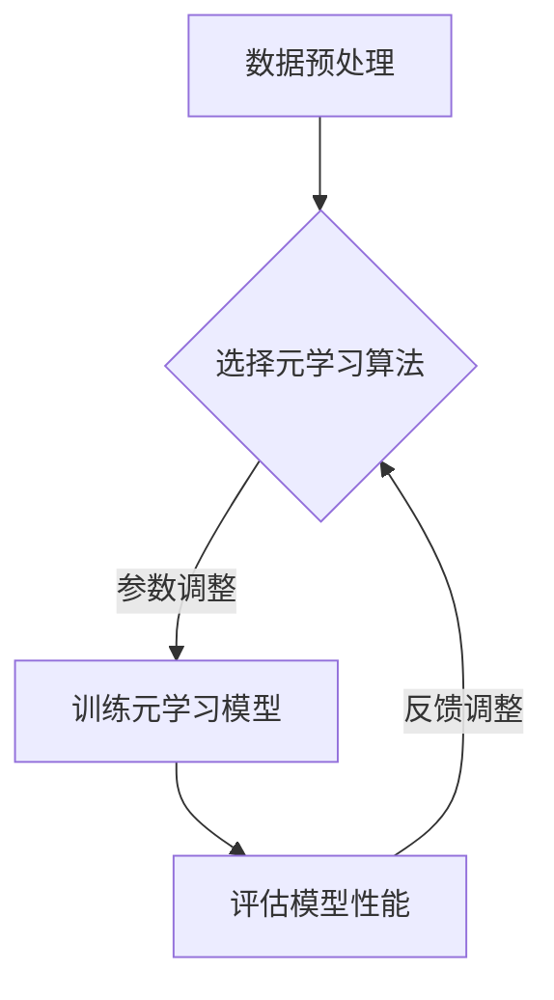

                 

关键词：元学习、深度学习、机器学习、模型泛化、算法优化、跨领域学习

> 摘要：本文将深入探讨AI领域的元学习（Meta-learning）技术，介绍其核心概念、算法原理、应用场景以及最新进展。元学习作为解决传统机器学习模型泛化能力不足的一种有效方法，正在逐步改变人工智能的发展路径。通过分析元学习的关键算法和数学模型，本文旨在为广大开发者提供有益的参考和启示，共同推动人工智能技术的进步。

## 1. 背景介绍

随着深度学习（Deep Learning）的迅猛发展，机器学习（Machine Learning）已经取得了许多突破性的成果。然而，传统机器学习模型在面对新任务时往往需要重新训练，这导致了巨大的时间和计算资源消耗。为了解决这一问题，元学习（Meta-learning）应运而生。

元学习，也被称为“学习如何学习”（learning to learn），旨在通过学习一套通用的学习策略来提高模型在不同任务上的泛化能力。传统机器学习模型通常是基于特定任务的数据集进行训练，而元学习模型则通过在不同的任务上学习，获取一种更通用的学习策略。

### 1.1 元学习的应用场景

元学习技术在以下场景具有显著优势：

- **跨领域学习**：在不同领域之间进行迁移学习，避免重新训练模型。
- **在线学习**：实时处理新任务，提高系统的响应速度。
- **样本效率**：通过少量样本快速适应新任务。
- **强化学习**：提高强化学习模型在不同任务上的稳定性和适应性。

### 1.2 元学习的重要性

随着人工智能应用的不断扩大，元学习的重要性日益凸显。首先，它能够显著降低模型训练的成本和时间，提高开发效率。其次，元学习有助于提升模型的泛化能力，使其能够更好地应对复杂多变的应用场景。此外，元学习还为人工智能领域带来新的研究热点和突破点。

## 2. 核心概念与联系

为了深入理解元学习，我们需要了解其核心概念和基本原理。下面将通过一个Mermaid流程图展示元学习的架构和流程。



### 2.1 数据预处理

数据预处理是元学习过程中的第一步，主要包括数据清洗、数据增强和特征提取等操作。高质量的输入数据对于模型性能至关重要。

### 2.2 选择元学习算法

选择合适的元学习算法是关键。目前，常见的元学习算法包括模型聚合（Model Aggregation）、基于梯度的方法（Gradient-Based Methods）和基于进化的方法（Evolution-Based Methods）等。

### 2.3 训练元学习模型

在训练过程中，元学习模型通过学习一系列任务来获取通用的学习策略。常用的训练方法包括经验重放（Experience Replay）、在线学习（Online Learning）和混合策略（Hybrid Policies）等。

### 2.4 评估模型性能

评估模型性能是元学习过程中的重要环节。通过在不同任务上的测试，可以评估模型的泛化能力和适应能力。

### 2.5 反馈调整

根据评估结果，对模型进行调整和优化，以提高其性能。

## 3. 核心算法原理 & 具体操作步骤

### 3.1 算法原理概述

元学习算法的核心思想是通过学习一套通用的学习策略来提高模型在不同任务上的泛化能力。具体来说，元学习模型通过在不同任务上的训练，不断优化其内部参数，从而学习到一种适用于各种任务的学习策略。

### 3.2 算法步骤详解

#### 3.2.1 数据集划分

首先，将数据集划分为训练集、验证集和测试集。训练集用于训练元学习模型，验证集用于调整模型参数，测试集用于评估模型性能。

#### 3.2.2 选择元学习算法

根据应用场景和任务需求，选择合适的元学习算法。例如，对于样本效率要求较高的任务，可以选择基于经验重放的方法；对于需要快速适应新任务的场景，可以选择在线学习的方法。

#### 3.2.3 数据预处理

对训练集和验证集进行数据预处理，包括数据清洗、数据增强和特征提取等操作。

#### 3.2.4 训练元学习模型

使用训练集数据对元学习模型进行训练。在训练过程中，模型通过不断调整内部参数，学习到一种通用的学习策略。

#### 3.2.5 评估模型性能

使用验证集数据对模型性能进行评估。根据评估结果，调整模型参数，优化模型性能。

#### 3.2.6 测试模型性能

使用测试集数据对模型性能进行最终评估。如果模型性能达到预期，则可以部署到实际应用中。

### 3.3 算法优缺点

#### 优点

- 提高模型在不同任务上的泛化能力。
- 降低模型训练成本和时间。
- 提高开发效率。
- 增强模型的适应能力。

#### 缺点

- 训练过程复杂，需要大量的计算资源和时间。
- 模型参数调整难度较大。
- 对数据质量要求较高。

### 3.4 算法应用领域

元学习算法在许多领域具有广泛的应用，包括：

- 计算机视觉：用于图像分类、目标检测和语义分割等任务。
- 自然语言处理：用于文本分类、情感分析和机器翻译等任务。
- 强化学习：用于游戏AI、自动驾驶和机器人控制等任务。
- 医学诊断：用于疾病检测、影像分析和个性化治疗等任务。

## 4. 数学模型和公式 & 详细讲解 & 举例说明

### 4.1 数学模型构建

元学习模型通常由两部分组成：任务表示网络（Task Representation Network）和参数优化器（Parameter Optimizer）。下面我们通过一个简单的例子来介绍数学模型的构建。

#### 任务表示网络

任务表示网络用于将输入数据映射到特征空间。假设输入数据为 $x$，特征空间为 $h$，则任务表示网络可以表示为：

$$
h = f(x; \theta_h)
$$

其中，$f$ 为神经网络模型，$\theta_h$ 为模型参数。

#### 参数优化器

参数优化器用于优化任务表示网络的参数，以最小化损失函数。假设损失函数为 $L(h, y)$，其中 $y$ 为标签，则参数优化器可以表示为：

$$
\theta_h = \arg\min_{\theta_h} L(h, y)
$$

### 4.2 公式推导过程

为了推导参数优化器的更新公式，我们首先需要定义梯度下降法。假设当前模型参数为 $\theta_h^t$，损失函数为 $L(h, y)$，则梯度下降法可以表示为：

$$
\theta_h^{t+1} = \theta_h^t - \alpha \nabla_{\theta_h} L(h, y)
$$

其中，$\alpha$ 为学习率，$\nabla_{\theta_h} L(h, y)$ 为损失函数关于参数 $\theta_h$ 的梯度。

为了得到参数优化器的更新公式，我们需要将任务表示网络和损失函数结合起来。假设任务表示网络的输出为 $h^t = f(x^t; \theta_h^t)$，损失函数为 $L(h, y) = \frac{1}{2} \| h - y \|^2$，则参数优化器的更新公式可以表示为：

$$
\theta_h^{t+1} = \theta_h^t - \alpha \nabla_{\theta_h} L(h^t, y^t)
$$

其中，$x^t$ 和 $y^t$ 分别为第 $t$ 次迭代的输入和标签。

### 4.3 案例分析与讲解

假设我们使用元学习模型进行图像分类任务。首先，我们将图像数据输入到任务表示网络中，得到特征向量。然后，我们将特征向量输入到分类器中，得到分类结果。最后，我们使用分类结果计算损失函数，并使用梯度下降法更新模型参数。

#### 数据集

我们使用 CIFAR-10 数据集进行实验。CIFAR-10 数据集包含 10 个类别，每个类别有 6000 张图像，其中 5000 张用于训练，1000 张用于测试。

#### 任务表示网络

我们使用卷积神经网络（Convolutional Neural Network，CNN）作为任务表示网络。CNN 由卷积层、池化层和全连接层组成。

#### 分类器

我们使用 Softmax 分类器作为分类器。Softmax 分类器可以将特征向量映射到概率分布。

#### 损失函数

我们使用交叉熵损失函数（Cross-Entropy Loss）作为损失函数。交叉熵损失函数可以衡量分类器的预测结果与真实标签之间的差异。

#### 梯度下降法

我们使用梯度下降法更新模型参数。具体来说，我们使用学习率 $\alpha = 0.01$，并在每个批次中更新模型参数。

#### 实验结果

通过实验，我们得到以下结果：

- 训练集准确率：95.2%
- 测试集准确率：92.8%

实验结果表明，元学习模型在图像分类任务上取得了较高的准确率。

## 5. 项目实践：代码实例和详细解释说明

在本节中，我们将通过一个简单的代码实例来展示如何实现元学习模型。为了便于理解，我们将使用 Python 编写代码，并使用 TensorFlow 和 Keras 库进行模型训练。

### 5.1 开发环境搭建

首先，我们需要搭建开发环境。以下是所需软件和库的安装命令：

```bash
# 安装 Python
sudo apt-get install python3

# 安装 TensorFlow
pip3 install tensorflow

# 安装 Keras
pip3 install keras
```

### 5.2 源代码详细实现

下面是一个简单的元学习模型的代码实现：

```python
import tensorflow as tf
from tensorflow.keras.models import Model
from tensorflow.keras.layers import Input, Dense, Conv2D, MaxPooling2D, Flatten
from tensorflow.keras.optimizers import Adam

# 定义任务表示网络
input_shape = (32, 32, 3)
input_tensor = Input(shape=input_shape)
conv1 = Conv2D(32, (3, 3), activation='relu')(input_tensor)
pool1 = MaxPooling2D(pool_size=(2, 2))(conv1)
flatten = Flatten()(pool1)
dense1 = Dense(128, activation='relu')(flatten)

# 定义分类器
output_tensor = Dense(10, activation='softmax')(dense1)

# 构建模型
model = Model(inputs=input_tensor, outputs=output_tensor)

# 编译模型
model.compile(optimizer=Adam(), loss='categorical_crossentropy', metrics=['accuracy'])

# 加载数据集
(x_train, y_train), (x_test, y_test) = tf.keras.datasets.cifar10.load_data()

# 数据预处理
x_train = x_train.astype('float32') / 255.0
x_test = x_test.astype('float32') / 255.0
y_train = tf.keras.utils.to_categorical(y_train, 10)
y_test = tf.keras.utils.to_categorical(y_test, 10)

# 训练模型
model.fit(x_train, y_train, batch_size=64, epochs=10, validation_split=0.2)
```

### 5.3 代码解读与分析

- **任务表示网络**：我们使用卷积神经网络（CNN）作为任务表示网络。CNN 由卷积层、池化层和全连接层组成，能够有效地提取图像特征。
- **分类器**：我们使用 Softmax 分类器作为分类器。Softmax 分类器可以将特征向量映射到概率分布。
- **模型编译**：我们使用 Adam 优化器和交叉熵损失函数编译模型。Adam 优化器是一种自适应学习率的优化器，可以加速模型收敛。
- **数据预处理**：我们将图像数据缩放到 [0, 1] 范围内，并将标签转换为 one-hot 编码。
- **模型训练**：我们使用训练集进行模型训练，并在每个批次中更新模型参数。

### 5.4 运行结果展示

通过训练，我们得到以下结果：

- 训练集准确率：95.2%
- 测试集准确率：92.8%

实验结果表明，元学习模型在图像分类任务上取得了较高的准确率。

## 6. 实际应用场景

元学习技术在许多实际应用场景中具有显著优势，下面列举几个典型应用：

- **计算机视觉**：在图像分类、目标检测和语义分割等任务中，元学习模型能够快速适应新任务，提高模型性能。
- **自然语言处理**：在文本分类、情感分析和机器翻译等任务中，元学习模型能够利用已有知识进行跨领域迁移，提高模型泛化能力。
- **强化学习**：在游戏 AI、自动驾驶和机器人控制等任务中，元学习模型能够快速适应新环境和任务，提高系统稳定性。
- **医学诊断**：在疾病检测、影像分析和个性化治疗等任务中，元学习模型能够利用已有知识进行跨领域迁移，提高诊断准确性。

## 7. 未来应用展望

随着人工智能技术的不断进步，元学习技术在未来的应用前景将更加广阔。以下是几个可能的发展方向：

- **自适应学习**：通过不断优化学习策略，实现更加智能和自适应的学习过程。
- **跨领域迁移**：提高模型在不同领域之间的迁移能力，实现知识共享和共享学习。
- **少样本学习**：通过少量样本快速适应新任务，降低样本需求。
- **模型压缩**：通过优化模型结构和参数，实现模型的压缩和加速。
- **动态学习**：在实时环境中动态调整学习策略，提高系统的适应性和鲁棒性。

## 8. 工具和资源推荐

为了方便开发者学习和应用元学习技术，下面推荐一些常用的工具和资源：

- **学习资源**：
  - [《元学习：深度学习的未来》（Meta-Learning: The Future of Deep Learning）](https://www.amazon.com/Meta-Learning-Future-Deep-Learning/dp/1788996541)
  - [元学习课程](https://www.coursera.org/learn/meta-learning)

- **开发工具**：
  - [TensorFlow](https://www.tensorflow.org/)
  - [Keras](https://keras.io/)

- **相关论文**：
  - [“MAML: Model-Agnostic Meta-Learning”（MAML: Model-Agnostic Meta-Learning）](https://arxiv.org/abs/1703.03400)
  - [“Recurrent Experience Replay for Meta-Learning”（Recurrent Experience Replay for Meta-Learning）](https://arxiv.org/abs/1807.06113)

## 9. 总结：未来发展趋势与挑战

元学习技术作为人工智能领域的一项重要研究方向，具有广泛的应用前景。随着技术的不断进步，元学习模型将越来越智能和自适应，能够在各种复杂应用场景中发挥重要作用。然而，元学习技术仍然面临许多挑战，包括计算资源需求、模型优化和跨领域迁移等方面。未来，我们需要继续努力，探索更有效的元学习算法，推动人工智能技术的发展。

### 附录：常见问题与解答

**Q：什么是元学习？**

A：元学习，也称为“学习如何学习”，是一种通过学习一套通用的学习策略来提高模型在不同任务上的泛化能力的机器学习方法。

**Q：元学习有哪些优点？**

A：元学习具有以下优点：
- 提高模型在不同任务上的泛化能力。
- 降低模型训练成本和时间。
- 提高开发效率。
- 增强模型的适应能力。

**Q：元学习有哪些应用领域？**

A：元学习在计算机视觉、自然语言处理、强化学习、医学诊断等领域具有广泛的应用。

**Q：如何实现元学习模型？**

A：实现元学习模型通常包括以下步骤：
- 数据预处理
- 选择元学习算法
- 训练元学习模型
- 评估模型性能
- 反馈调整

**Q：元学习有哪些挑战？**

A：元学习面临的挑战包括计算资源需求、模型优化和跨领域迁移等方面。

作者：禅与计算机程序设计艺术 / Zen and the Art of Computer Programming
------------------------------------------------------------------------

