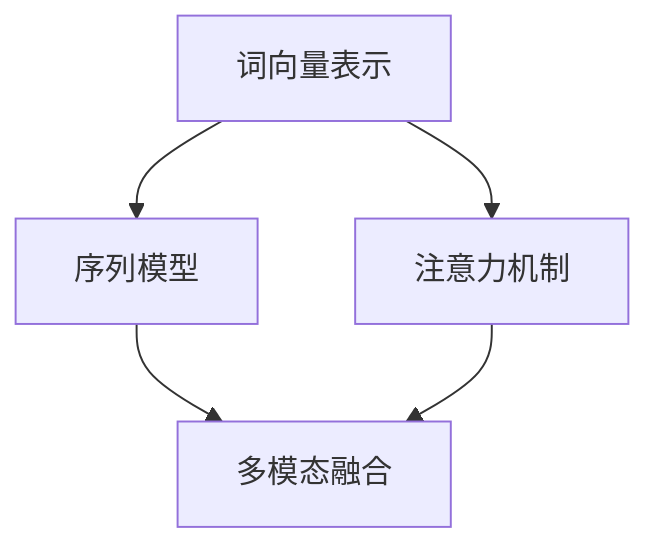

                 

 在人工智能领域，自然语言处理（NLP）已经成为了一个非常重要的研究方向。尤其是随着深度学习的兴起，AI在与人类的对话中表现得越来越自然。然而，即使是最先进的对话系统，仍然面临一个核心挑战：如何在连续的对话中保持上下文的连贯性。

上下文学习是解决这一挑战的关键。本文将深入探讨上下文学习的概念、核心算法原理、具体操作步骤，以及其在不同应用领域的重要性。通过详细的数学模型和公式推导，我们将展示如何提高AI对话的连贯性。同时，我们还将通过一个实际的项目实践案例，展示上下文学习在真实场景中的应用。

## 1. 背景介绍

随着互联网的普及和智能手机的普及，人们越来越依赖与机器的交互。从简单的查询信息，到复杂的智能客服，AI对话系统已经成为我们日常生活中不可或缺的一部分。然而，一个关键的问题是，当前的AI对话系统在面对复杂的对话场景时，常常无法理解上下文，导致对话的连贯性受到严重影响。

上下文是指对话中的一些相关信息，这些信息可以帮助AI系统更好地理解对话内容。例如，当我们说“我想买一个苹果”时，“苹果”这个词本身并没有明确的意义，但如果我们之前提到了“苹果手机”，那么这里的“苹果”很可能指的是手机。上下文学习就是让AI系统从大量的对话数据中学习并理解这些上下文信息。

上下文学习的目的是提高AI对话的连贯性。具体来说，它涉及到以下几个方面的挑战：

1. **长距离上下文理解**：在连续的对话中，理解当前句子与之前句子的关系。
2. **多模态上下文融合**：将文本、语音、图像等多种类型的信息结合起来，共同提高上下文理解。
3. **语境适应能力**：AI系统需要能够根据对话的不同场景和用户的行为，灵活地调整上下文理解。

## 2. 核心概念与联系

### 2.1 核心概念

**上下文学习**涉及多个核心概念，包括但不限于：

- **词向量表示**：将单词转换为向量表示，以便于机器进行计算和理解。
- **序列模型**：处理连续文本序列的模型，如循环神经网络（RNN）和其变体，如长短时记忆网络（LSTM）和门控循环单元（GRU）。
- **注意力机制**：在处理长序列时，注意力机制可以帮助模型关注到重要的上下文信息。
- **多模态融合**：将不同的模态（如文本、图像、语音）融合起来，共同提高上下文理解。

### 2.2 关联流程图

以下是上下文学习中的核心概念和关联的Mermaid流程图：

在这个流程图中，词向量表示是基础，它将文本转换为机器可处理的向量。序列模型负责处理这些向量序列，并利用注意力机制来关注重要的上下文信息。多模态融合则将不同类型的信息结合起来，进一步提高上下文理解的能力。

## 3. 核心算法原理 & 具体操作步骤

### 3.1 算法原理概述

上下文学习主要依赖于以下几种核心算法：

- **循环神经网络（RNN）**：RNN是处理序列数据的一种常见神经网络架构。它通过保留隐藏状态来捕捉序列中的历史信息。
- **长短时记忆网络（LSTM）**：LSTM是RNN的一种变体，专门设计来解决长序列依赖问题。它通过引入门控机制，有效地抑制了梯度消失问题。
- **门控循环单元（GRU）**：GRU是LSTM的简化版本，它在保持有效性的同时减少了模型的复杂性。
- **注意力机制**：注意力机制允许模型在处理长序列时，动态地关注序列中的不同部分。

### 3.2 算法步骤详解

**步骤 1：词向量表示**

首先，我们需要将文本转换为词向量表示。这通常通过词嵌入（word embeddings）实现，如Word2Vec、GloVe等。词嵌入将每个单词映射到一个固定维度的向量，这些向量可以捕获单词的语义信息。

**步骤 2：构建序列模型**

接下来，我们使用RNN、LSTM或GRU构建序列模型。这些模型将处理词向量序列，并尝试捕捉序列中的依赖关系。具体来说，每个时间步，模型将输入一个词向量，并更新其隐藏状态，从而逐步构建对文本序列的理解。

**步骤 3：引入注意力机制**

在处理长序列时，注意力机制可以显著提高上下文理解的能力。它允许模型动态地关注序列中的不同部分，从而更好地捕捉长距离依赖。

**步骤 4：多模态融合**

如果对话中涉及图像、语音等其他模态的信息，我们可以使用多模态融合技术将这些信息与文本信息结合起来。这可以通过将不同模态的信息映射到同一特征空间，然后融合这些特征来实现。

### 3.3 算法优缺点

**优点**：

- **强大的上下文理解能力**：通过使用RNN、LSTM和注意力机制，模型可以捕捉长序列中的依赖关系，从而更好地理解上下文。
- **灵活性**：注意力机制和多模态融合技术使得模型可以灵活地适应不同的对话场景。

**缺点**：

- **计算复杂度**：尤其是对于长序列和复杂的多模态融合，计算成本较高。
- **数据需求**：训练有效的上下文学习模型需要大量的高质量对话数据。

### 3.4 算法应用领域

上下文学习在多个领域有广泛的应用：

- **智能客服**：在处理复杂的用户查询时，上下文学习可以帮助智能客服系统更好地理解用户的需求。
- **对话生成**：在生成连续的对话文本时，上下文学习可以帮助模型保持对话的连贯性。
- **信息检索**：在构建智能搜索引擎时，上下文学习可以帮助模型更好地理解用户查询，并提供更准确的搜索结果。

## 4. 数学模型和公式 & 详细讲解 & 举例说明

### 4.1 数学模型构建

上下文学习涉及多个数学模型，其中最核心的是RNN、LSTM和注意力机制。

**RNN模型**：

RNN的核心方程如下：

$$
h_t = \sigma(W_h \cdot [h_{t-1}, x_t] + b_h)
$$

其中，$h_t$是时间步$t$的隐藏状态，$x_t$是输入的词向量，$W_h$和$b_h$是权重和偏置。

**LSTM模型**：

LSTM通过引入三个门控机制（输入门、遗忘门和输出门）来控制信息的流动：

$$
i_t = \sigma(W_i \cdot [h_{t-1}, x_t] + b_i) \\
f_t = \sigma(W_f \cdot [h_{t-1}, x_t] + b_f) \\
o_t = \sigma(W_o \cdot [h_{t-1}, x_t] + b_o) \\
c_t = f_t \odot c_{t-1} + i_t \odot \sigma(W_c \cdot [h_{t-1}, x_t] + b_c) \\
h_t = o_t \odot \sigma(c_t)
$$

其中，$i_t$、$f_t$和$

