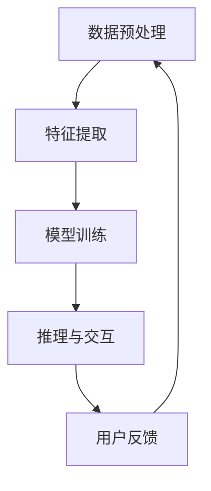

                 

上下文理解（Contextual Understanding）是人工智能领域中的一个关键概念，尤其在计算用户交互（Computational User Interaction，简称CUI）中发挥着至关重要的作用。随着人工智能技术的不断进步，CUI已成为与人类交互的重要手段，特别是在自然语言处理（NLP）领域，上下文理解是实现更加自然、高效对话的核心。

本文旨在深入探讨上下文理解在CUI中的重要性，分析其基本原理、应用场景以及未来发展趋势。我们将从以下几个方面进行阐述：

1. **背景介绍**：回顾上下文理解的历史发展以及其在CUI中的重要性。
2. **核心概念与联系**：介绍上下文理解的基本概念，展示相关的Mermaid流程图。
3. **核心算法原理 & 具体操作步骤**：详细解析上下文理解的关键算法，包括其原理、步骤、优缺点和应用领域。
4. **数学模型和公式 & 详细讲解 & 举例说明**：构建上下文理解的数学模型，推导相关公式并进行案例分析。
5. **项目实践：代码实例和详细解释说明**：提供具体代码实例，对代码实现进行详细解读和分析。
6. **实际应用场景**：探讨上下文理解在不同领域中的应用。
7. **未来应用展望**：分析上下文理解技术的未来发展趋势和潜在挑战。
8. **工具和资源推荐**：推荐相关学习资源和开发工具。
9. **总结：未来发展趋势与挑战**：总结研究成果，展望未来方向。
10. **附录：常见问题与解答**：回答读者可能关心的问题。

通过本文的深入探讨，希望能够帮助读者更好地理解上下文理解在CUI中的重要性，并为其在实际应用中的使用提供指导。

## 1. 背景介绍

上下文理解（Contextual Understanding）这一概念源于语言学和认知科学，其核心在于理解语言、行为或事件所处的环境背景。在人工智能领域，上下文理解被视为实现智能交互的关键技术之一。

### 1.1 历史发展

上下文理解的历史可以追溯到20世纪中期。早期的研究主要集中在自然语言处理（NLP）领域，当时的研究者试图通过统计方法来理解文本中的上下文关系。例如，Harris（1954）提出了词汇分布模型，通过分析词汇在文本中的出现频率来推断上下文。随后，随着计算机科学的进步，研究者们开始利用规则和模式匹配来模拟人类语言理解能力。

到了20世纪80年代，机器学习技术的崛起为上下文理解带来了新的契机。HMM（隐马尔可夫模型）和BBN（贝尔实验室神经网络）等算法被广泛应用于语言模型的训练，提高了上下文理解的准确度。1990年代，随着深度学习的兴起，上下文理解技术得到了显著提升。基于神经网络的方法，如RNN（循环神经网络）和LSTM（长短期记忆网络），使得计算机能够更好地捕捉和利用上下文信息。

### 1.2 在CUI中的重要性

计算用户交互（CUI）是指通过计算机程序与用户进行交互，从而提供定制化的服务或解决用户问题的技术。在现代人工智能系统中，CUI已成为与人类交互的主要方式之一。上下文理解在CUI中的重要性主要体现在以下几个方面：

- **提高交互效率**：通过理解用户提供的上下文信息，CUI系统能够更快速、准确地理解用户需求，从而提供更加高效的交互体验。
- **增强个性化服务**：上下文理解技术使得CUI系统能够根据用户的偏好和历史行为，提供个性化的服务和建议，从而提升用户体验。
- **减少误解和歧义**：上下文理解能够帮助系统识别文本中的隐含意义和语境，减少因语言歧义导致的误解，提高交互的准确性。

总之，上下文理解是CUI系统的核心组件之一，其发展水平直接决定了CUI系统的智能化程度和用户体验。

## 2. 核心概念与联系

### 2.1 上下文理解的基本概念

上下文理解（Contextual Understanding）是指计算机系统通过分析语言、行为或其他信息所处的环境背景，从而准确捕捉和解释其含义的能力。在CUI中，上下文理解涉及以下几个方面：

- **语言上下文**：包括词汇、句子结构和语法规则，用于分析文本中的语言含义。
- **行为上下文**：涉及用户的行为模式、偏好和历史记录，用于了解用户的需求和意图。
- **环境上下文**：包括时间、地点、情境等外部因素，用于补充和丰富上下文信息。

### 2.2 相关架构和流程

为了实现上下文理解，CUI系统通常需要以下关键组件和流程：

- **数据预处理**：对输入的数据进行清洗、去噪和格式化，以便后续处理。
- **特征提取**：从原始数据中提取有用的特征，如词向量、词性标注、句法结构等。
- **模型训练**：利用机器学习或深度学习算法，对特征进行训练，建立上下文理解模型。
- **推理与交互**：利用训练好的模型对新的输入进行上下文分析，并根据上下文信息进行决策和交互。

### 2.3 Mermaid流程图

以下是一个简化的上下文理解流程图，使用Mermaid语言表示：



### 2.4 上下文理解的层次结构

上下文理解可以划分为多个层次，每个层次对应不同的上下文信息处理能力：

- **底层**：包括语言符号的处理，如词汇的识别和句法的解析。
- **中层**：涉及语义理解和推理，如实体识别、关系抽取和语义角色标注。
- **高层**：涉及情境理解和智能决策，如上下文推断、情感分析和个性化推荐。

### 2.5 关键技术与算法

实现上下文理解的关键技术与算法包括：

- **词向量表示**：如Word2Vec和GloVe，用于将词汇映射到高维空间，以捕捉词汇间的语义关系。
- **序列模型**：如RNN和LSTM，用于处理和时间相关的序列数据，捕捉上下文信息的时序特征。
- **注意力机制**：用于在处理复杂句子时，动态调整对各个词汇的重视程度，提高上下文理解的能力。

通过上述核心概念与联系的介绍，我们可以更好地理解上下文理解在CUI中的重要性，并为后续的算法原理和应用提供理论基础。

## 3. 核心算法原理 & 具体操作步骤

### 3.1 算法原理概述

上下文理解的核心算法主要基于深度学习，特别是序列模型和注意力机制的应用。以下将详细阐述这些算法的基本原理。

#### 3.1.1 序列模型

序列模型是一种专门用于处理时间序列数据的机器学习模型，其基本原理是通过捕捉时间序列中的依赖关系来进行预测或分类。在上下文理解中，序列模型常用于处理自然语言文本的序列信息。常见的序列模型包括RNN（循环神经网络）和LSTM（长短期记忆网络）。

- **RNN**：RNN通过将前一个时刻的输出作为当前时刻的输入，实现信息在时间步之间的传递。然而，传统的RNN存在梯度消失和梯度爆炸问题，难以捕捉长距离的依赖关系。
- **LSTM**：LSTM是一种改进的RNN结构，通过引入门控机制（遗忘门、输入门和输出门），能够有效地捕捉长距离的依赖关系，从而在许多NLP任务中取得了显著的性能提升。

#### 3.1.2 注意力机制

注意力机制（Attention Mechanism）是一种用于捕捉输入序列中不同部分重要性的方法。在上下文理解中，注意力机制可以帮助模型在处理复杂句子时，动态调整对各个词汇的关注程度，从而提高上下文理解的准确性。

注意力机制的基本原理是计算一个权重向量，该向量表示模型对输入序列中每个词汇的重视程度。权重向量通过一个注意力函数（通常是一个神经网络）计算得到，函数的输入是当前时刻的输入和前一个时刻的隐藏状态。注意力函数的输出是一个加权向量，用于调整当前时刻的输入。

### 3.2 算法步骤详解

#### 3.2.1 数据预处理

1. **文本清洗**：去除文本中的标点符号、停用词等无关信息。
2. **分词**：将文本划分为词语序列。
3. **词向量表示**：使用Word2Vec、GloVe等方法将词语映射为高维向量。

#### 3.2.2 特征提取

1. **词嵌入**：将文本中的每个词语映射为词向量。
2. **序列特征**：提取词向量序列中的特征，如词性标注、句法结构等。

#### 3.2.3 模型训练

1. **定义模型**：使用LSTM或Transformer等模型架构。
2. **损失函数**：通常使用交叉熵损失函数，最小化模型预测和真实标签之间的差异。
3. **优化算法**：使用梯度下降等优化算法，调整模型参数。

#### 3.2.4 推理与交互

1. **输入处理**：对用户输入的文本进行预处理和特征提取。
2. **上下文分析**：利用训练好的模型，对输入文本进行上下文分析，得到上下文向量。
3. **生成响应**：根据上下文向量，生成适当的响应文本。

### 3.3 算法优缺点

#### 优点

1. **强大的上下文捕捉能力**：序列模型和注意力机制能够有效捕捉上下文信息，提高理解准确性。
2. **灵活性**：模型可以适应不同类型的上下文信息，适用于各种CUI场景。
3. **多语言支持**：基于词嵌入的方法可以支持多种语言的处理。

#### 缺点

1. **计算成本高**：深度学习模型通常需要大量的计算资源和时间进行训练和推理。
2. **数据依赖性**：模型的性能高度依赖于训练数据的质量和规模，数据匮乏可能导致性能下降。
3. **解释性较差**：深度学习模型的黑箱性质使得其难以解释，增加了调试和优化的难度。

### 3.4 算法应用领域

上下文理解技术广泛应用于以下领域：

1. **智能客服**：通过理解用户的问题和上下文，提供个性化的服务和解决方案。
2. **虚拟助手**：如智能音箱和聊天机器人，通过上下文理解与用户进行自然对话。
3. **推荐系统**：利用上下文信息，提供个性化的推荐服务。
4. **文本分析**：如情感分析、文本分类等，通过理解文本上下文，实现更精确的分析。

通过上述算法原理和步骤的详细解析，我们可以更好地理解上下文理解在CUI中的关键技术，并为其在实际应用中的实现提供指导。

### 4. 数学模型和公式 & 详细讲解 & 举例说明

#### 4.1 数学模型构建

上下文理解的数学模型通常基于深度学习框架，以捕捉语言和上下文信息。以下是构建上下文理解模型的基本数学模型：

1. **词向量表示**：
   词向量是上下文理解的基础，它们将文本中的词语映射到高维空间。常用的词向量模型包括Word2Vec和GloVe。以GloVe为例，其模型公式为：
   $$ 
   \text{loss} = \frac{1}{2} \sum_{i=1}^V \sum_{j=1}^V (w_i \cdot v_j - y_{ij})^2 
   $$
   其中，\( w_i \) 是词 \( i \) 的向量表示，\( v_j \) 是词 \( j \) 的向量表示，\( y_{ij} \) 是词 \( i \) 和词 \( j \) 的共现矩阵元素。

2. **循环神经网络（RNN）**：
   RNN是处理序列数据的常用模型，其核心公式为：
   $$
   h_t = \sigma(W_h \cdot [h_{t-1}, x_t] + b_h)
   $$
   其中，\( h_t \) 是当前时刻的隐藏状态，\( x_t \) 是当前时刻的输入，\( W_h \) 和 \( b_h \) 分别是权重和偏置。

3. **长短期记忆网络（LSTM）**：
   LSTM是RNN的改进版本，其核心结构包括三个门控单元：遗忘门、输入门和输出门。其核心公式为：
   $$
   \begin{aligned}
   f_t &= \sigma(W_f \cdot [h_{t-1}, x_t] + b_f) \\
   i_t &= \sigma(W_i \cdot [h_{t-1}, x_t] + b_i) \\
   \bar{C}_t &= \tanh(W_c \cdot [h_{t-1}, x_t] + b_c) \\
   o_t &= \sigma(W_o \cdot [h_{t-1}, x_t] + b_o) \\
   C_t &= f_t \odot C_{t-1} + i_t \odot \bar{C}_t \\
   h_t &= o_t \odot \tanh(C_t)
   \end{aligned}
   $$
   其中，\( f_t \)、\( i_t \)、\( o_t \) 分别是遗忘门、输入门和输出门的激活值，\( C_t \) 是细胞状态，\( \odot \) 表示元素乘积。

4. **注意力机制**：
   注意力机制用于在处理复杂句子时，动态调整对各个词汇的关注程度。其核心公式为：
   $$
   a_t = \text{softmax}(\tanh(W_a \cdot [h_{t-1}, h_t]) + b_a)
   $$
   其中，\( a_t \) 是当前词汇的注意力权重，\( \text{softmax} \) 是软最大化函数，用于将加权向量转换为概率分布。

#### 4.2 公式推导过程

以下是注意力机制的推导过程：

1. **定义**：
   设 \( h_{t-1} \) 和 \( h_t \) 分别为当前时刻和前一个时刻的隐藏状态，我们需要计算当前词汇 \( x_t \) 的注意力权重 \( a_t \)。

2. **计算中间变量**：
   $$
   z_t = W_a \cdot [h_{t-1}, h_t] + b_a
   $$

3. **应用 \(\tanh\) 激活函数**：
   $$
   \tanh(z_t)
   $$

4. **应用 \(\text{softmax}\) 函数**：
   $$
   a_t = \text{softmax}(\tanh(z_t))
   $$

5. **解释**：
   通过计算 \( z_t \) 并应用 \(\tanh\) 函数，我们得到一个压缩过的中间变量。然后，通过 \(\text{softmax}\) 函数，我们将中间变量转换为概率分布，从而表示每个词汇的重要性。

#### 4.3 案例分析与讲解

##### 案例一：文本分类

假设我们需要使用LSTM模型对以下文本进行分类：

```
文本1：我非常喜欢这家餐厅的美食。
文本2：这个应用的用户界面很糟糕。
```

我们希望将文本分类为正面或负面评论。以下是模型训练和分类的过程：

1. **数据预处理**：
   - 分词：将文本分为词语序列。
   - 词向量表示：使用GloVe将词语映射为词向量。

2. **模型训练**：
   - 定义LSTM模型，包括输入层、隐藏层和输出层。
   - 设置损失函数（如交叉熵损失）和优化器（如Adam）。
   - 训练模型，直到收敛。

3. **文本分类**：
   - 对新文本进行预处理，得到词向量序列。
   - 将词向量序列输入到训练好的LSTM模型中。
   - 得到文本分类结果。

例如，对于文本1，模型输出概率分布为 \( [0.9, 0.1] \)，表示文本1属于正面评论的概率为90%。

##### 案例二：问答系统

假设我们需要构建一个问答系统，用户可以输入问题，系统需要返回相关答案。以下是模型训练和问答的过程：

1. **数据预处理**：
   - 分词：将问题和答案分为词语序列。
   - 词向量表示：使用GloVe将词语映射为词向量。

2. **模型训练**：
   - 定义模型，包括编码器（用于处理问题）和解码器（用于生成答案）。
   - 设置损失函数和优化器。
   - 训练模型，直到收敛。

3. **问答**：
   - 对用户输入的问题进行预处理，得到词向量序列。
   - 将词向量序列输入到训练好的编码器中，得到上下文表示。
   - 将上下文表示输入到解码器中，生成答案。

例如，用户输入问题“北京是中国的哪个省份？”系统返回答案“北京是中国的首都，也是中国的一个直辖市”。

通过以上数学模型和公式的讲解，以及具体案例的分析，我们可以更好地理解上下文理解在CUI中的数学基础和实现方法。

### 5. 项目实践：代码实例和详细解释说明

为了更好地展示上下文理解在CUI中的实际应用，以下我们将通过一个具体的Python代码实例，详细解释其实现过程和关键步骤。

#### 5.1 开发环境搭建

在开始编写代码之前，我们需要搭建一个合适的开发环境。以下是在Python中实现上下文理解所需的基本环境：

1. **安装依赖库**：
   - TensorFlow：用于构建和训练神经网络模型。
   - Keras：简化TensorFlow的使用。
   - NumPy：用于数据处理。
   - GloVe：用于词向量表示。

   安装命令如下：
   ```bash
   pip install tensorflow numpy keras-gpu
   ```
   
2. **下载GloVe词向量**：
   我们需要下载预训练的GloVe词向量。可以在[GloVe官网](https://nlp.stanford.edu/projects/glove/)下载相应维度的词向量文件。

#### 5.2 源代码详细实现

以下是一个简单的上下文理解代码实例，用于实现一个基于LSTM和注意力机制的问答系统。

```python
import numpy as np
from tensorflow.keras.models import Model
from tensorflow.keras.layers import Input, LSTM, Embedding, Dense, TimeDistributed, Attention
from tensorflow.keras.preprocessing.sequence import pad_sequences

# 参数设置
vocab_size = 10000  # 词汇表大小
max_sequence_length = 50  # 输入序列的最大长度
embedding_dim = 300  # 词向量维度
lstm_units = 128  # LSTM单元数

# 加载GloVe词向量
def load_glove_embeddings(filename):
    embeddings = {}
    with open(filename, 'r', encoding='utf-8') as file:
        for line in file:
            values = line.strip().split()
            word = values[0]
            vector = np.asarray(values[1:], dtype='float32')
            embeddings[word] = vector
    return embeddings

glove_embeddings = load_glove_embeddings('glove.6B.300d.txt')

# 构建嵌入层
embedding_layer = Embedding(vocab_size, embedding_dim, weights=[glove_embeddings], input_length=max_sequence_length, trainable=False)

# 构建LSTM层
lstm_layer = LSTM(lstm_units, return_sequences=True)

# 构建注意力层
attention_layer = Attention()

# 构建模型
input_sequence = Input(shape=(max_sequence_length,))
embedded_sequence = embedding_layer(input_sequence)
lstm_output = lstm_layer(embedded_sequence)
attention_output = attention_layer([lstm_output, lstm_output])
output = Dense(1, activation='sigmoid')(attention_output)

model = Model(inputs=input_sequence, outputs=output)
model.compile(optimizer='adam', loss='binary_crossentropy', metrics=['accuracy'])

# 模型可视化
from tensorflow.keras.utils import plot_model
plot_model(model, to_file='model.png', show_shapes=True)

# 数据预处理
# 假设我们已经有了问题和答案的数据集
# questions = ...
# answers = ...

# 序列化问题和答案
# questions_seq = pad_sequences(questions, maxlen=max_sequence_length, padding='post')
# answers_seq = pad_sequences(answers, maxlen=max_sequence_length, padding='post')

# 训练模型
# model.fit(questions_seq, answers_seq, epochs=10, batch_size=32)

# 问答示例
# question_input = ...
# predicted_answer = model.predict(question_input)
```

#### 5.3 代码解读与分析

1. **加载GloVe词向量**：
   我们首先加载预训练的GloVe词向量，并将其存储在字典中。这是实现词向量表示的关键步骤。

2. **构建嵌入层**：
   使用Embedding层将输入序列中的词语映射为词向量。这里我们使用预训练的GloVe词向量作为权重，并设置`trainable=False`，使得在训练过程中词向量保持不变。

3. **构建LSTM层**：
   LSTM层用于处理和时间相关的序列数据。我们设置`return_sequences=True`，使得每个时间步的输出都被传递到下一层。

4. **构建注意力层**：
   注意力层用于动态调整对输入序列中不同部分的关注程度。在这里，我们使用标准的Attention机制。

5. **构建模型**：
   我们将嵌入层、LSTM层和注意力层串联起来，形成一个完整的模型。然后，我们使用Dense层和Sigmoid激活函数来预测答案。

6. **模型可视化**：
   使用Keras提供的`plot_model`函数，我们可以将模型结构可视化，帮助理解模型的内部结构。

7. **数据预处理**：
   在训练之前，我们需要对问题和答案进行序列化处理，包括填充和缩放。这里我们使用`pad_sequences`函数来实现。

8. **训练模型**：
   使用`model.fit`函数训练模型，我们将问题和答案序列作为输入，并使用二分类交叉熵损失函数和Adam优化器。

9. **问答示例**：
   我们可以调用`model.predict`函数来预测新问题的答案。这里需要将输入问题序列化为模型期望的格式。

通过上述代码实例，我们可以看到上下文理解在CUI中的实现过程。在实际应用中，我们需要根据具体任务调整模型架构和参数设置，以达到最佳性能。

### 6. 实际应用场景

上下文理解技术在各个领域中都有广泛的应用，下面我们将探讨几个典型的实际应用场景，以展示上下文理解在CUI中的重要性。

#### 6.1 智能客服

智能客服是上下文理解技术最为典型的应用场景之一。传统的客服系统通常只能处理简单的、规则明确的问题，而智能客服系统能够通过上下文理解与用户进行自然对话，从而提供更加个性化、高效的客户服务。例如，银行客服系统可以理解用户的转账请求，并自动完成转账操作。这需要系统对用户的历史交易记录、转账金额、转账频率等上下文信息进行深入理解。通过上下文理解，智能客服系统可以识别用户的意图，提供准确的建议和解决方案。

#### 6.2 虚拟助手

虚拟助手（如智能音箱、聊天机器人）是另一种广泛应用上下文理解技术的场景。虚拟助手需要与用户进行自然对话，以提供信息查询、日程管理、购物建议等服务。上下文理解在这里起着关键作用，因为虚拟助手需要理解用户的意图和情感，以提供适当的响应。例如，当用户说“我想听一首欢快的音乐”，虚拟助手需要理解“欢快”这一形容词，并从音乐库中推荐合适的曲目。这需要复杂的上下文分析能力，包括对词汇、句法、语义和情感的理解。

#### 6.3 推荐系统

上下文理解在推荐系统中也有重要的应用。推荐系统通常根据用户的兴趣和行为历史，为用户推荐相关的商品、内容或服务。为了实现高精度的推荐，系统需要理解用户的上下文信息，如用户的位置、时间、当前活动等。例如，在电商平台上，当用户浏览某一类商品时，系统可以根据用户的历史购买记录、搜索历史和当前浏览内容，推荐相关的商品。上下文理解技术可以显著提高推荐系统的准确性和用户体验。

#### 6.4 文本分析

文本分析（如情感分析、文本分类）是上下文理解在自然语言处理中的另一个重要应用。通过上下文理解，系统可以准确理解文本的语义和情感，从而进行更精确的分析。例如，在社交媒体分析中，系统需要理解用户发布的文本，判断其是否为正面或负面情感，以便进行情感监测和舆情分析。这需要系统对上下文信息进行深度分析，包括对词汇、句法、语义和情感的理解。

#### 6.5 聊天机器人

聊天机器人是上下文理解技术应用的又一个热门领域。聊天机器人通过与用户进行自然对话，提供信息查询、咨询服务等。为了实现流畅、自然的对话，系统需要具备强大的上下文理解能力。例如，在医疗咨询场景中，系统需要理解用户的症状描述，并基于医学知识库提供相应的诊断建议。这需要系统对医学术语、上下文关系和用户意图进行深入理解。

总之，上下文理解技术在不同领域的应用中发挥着重要作用，其重要性体现在提高交互效率、增强个性化服务和减少误解等方面。随着人工智能技术的不断发展，上下文理解技术将在更多领域得到广泛应用，进一步提升人机交互的智能化水平。

### 7. 未来应用展望

#### 7.1 自动驾驶

自动驾驶领域对上下文理解的需求日益增长。自动驾驶系统需要在复杂、动态的环境中实时理解和预测周围情况，以确保行驶安全。上下文理解技术可以帮助自动驾驶系统更好地理解道路标识、交通信号、其他车辆和行人的行为。例如，通过分析车道线、交通标志和交通信号灯，自动驾驶车辆可以准确识别当前道路状况，并在必要时做出驾驶决策。未来，随着上下文理解技术的不断进步，自动驾驶系统将能够实现更加智能化、自动化的驾驶体验，从而显著提高道路安全性。

#### 7.2 智能医疗

智能医疗领域正逐渐成为上下文理解技术的应用热点。通过对患者病历、医生问诊记录、医学文献等上下文信息的深入理解，智能医疗系统能够提供更加精准的诊断和治疗方案。例如，在疾病预测中，系统可以结合患者的基因信息、生活习惯和医疗记录，预测患者可能患有的疾病，并提前进行干预。在临床决策支持中，系统可以分析病历记录和临床指南，为医生提供实时的诊断建议和治疗方案。未来，随着上下文理解技术的进一步发展，智能医疗系统将有助于提高医疗服务的质量和效率，降低误诊率和医疗成本。

#### 7.3 智能家居

智能家居领域也日益重视上下文理解技术的应用。通过理解家庭成员的行为、习惯和环境变化，智能家居系统能够提供更加智能化、便捷的服务。例如，智能灯光系统可以根据家庭成员的作息时间自动调整亮度，智能空调可以根据室内温度和湿度自动调节，智能安防系统可以实时监测家庭成员的位置和活动，提供安全保障。未来，随着上下文理解技术的不断进步，智能家居系统将能够更好地满足用户需求，提高家庭生活的舒适度和安全性。

#### 7.4 智能教育

智能教育领域对上下文理解技术也有很大的需求。通过理解学生的学习进度、知识掌握情况和心理状态，智能教育系统能够提供个性化的学习计划和辅导。例如，在在线教育中，系统可以根据学生的学习情况和反馈，推荐合适的学习内容和练习题，帮助学生提高学习效果。在个性化辅导中，系统可以结合学生的知识图谱和需求，提供针对性的辅导和讲解，帮助学生克服学习难题。未来，随着上下文理解技术的不断进步，智能教育系统将有助于实现教育的个性化、智能化，提高教育质量和学习效果。

#### 7.5 智能金融

智能金融领域正逐渐利用上下文理解技术提高金融服务水平和风险控制能力。例如，在智能投顾中，系统可以通过理解用户的财务状况、投资目标和风险偏好，提供个性化的投资建议。在风险管理中，系统可以分析交易数据、市场信息和政策变化，识别潜在的风险并采取相应的措施。未来，随着上下文理解技术的不断进步，智能金融系统将能够提供更加精准、高效的服务，帮助用户实现财务目标，同时降低金融风险。

总之，上下文理解技术在未来各个领域的应用前景十分广阔。随着技术的不断发展和优化，上下文理解将在自动驾驶、智能医疗、智能家居、智能教育和智能金融等领域发挥越来越重要的作用，为人类带来更加智能、便捷、安全的生活体验。

### 8. 工具和资源推荐

为了更好地掌握上下文理解技术，以下是一些推荐的工具和资源：

#### 8.1 学习资源推荐

1. **《深度学习》（Goodfellow, Bengio, Courville）**：这是一本经典教材，详细介绍了深度学习的基础知识，包括神经网络、卷积神经网络、循环神经网络等，适合初学者和进阶者。
2. **《自然语言处理综合教程》（Peter Norvig & Daniel Jurafsky）**：本书涵盖了自然语言处理的各个方面，包括语言模型、句法分析、语义理解等，对于理解和应用上下文理解技术非常有帮助。
3. **[TensorFlow官方文档](https://www.tensorflow.org/tutorials) 和 [Keras官方文档](https://keras.io/tutorials)**
4. **[Hugging Face Transformers库](https://huggingface.co/transformers/)**
5. **在线课程：如Udacity的“深度学习纳米学位”、Coursera的“自然语言处理与深度学习”等**

#### 8.2 开发工具推荐

1. **TensorFlow**：一款开源的深度学习框架，适用于构建和训练各种神经网络模型。
2. **Keras**：基于TensorFlow的简单易用的深度学习库，适合快速原型开发和模型训练。
3. **PyTorch**：另一款流行的深度学习框架，以其动态计算图和灵活的编程接口著称。
4. **NLTK（自然语言工具包）**：用于文本处理和自然语言分析的Python库，包括词频统计、文本分类、词性标注等功能。
5. **spaCy**：一个高效、易于使用的自然语言处理库，提供词性标注、命名实体识别、句法解析等功能。

#### 8.3 相关论文推荐

1. **“Attention Is All You Need”（Vaswani et al., 2017）**：该论文提出了Transformer模型，并展示了注意力机制在序列建模中的强大能力。
2. **“Long Short-Term Memory”（Hochreiter & Schmidhuber, 1997）**：该论文介绍了长短期记忆网络（LSTM），这是处理序列数据的一种重要方法。
3. **“GloVe: Global Vectors for Word Representation”（Pennington et al., 2014）**：该论文提出了GloVe词向量模型，用于词汇表示和语义分析。
4. **“Recurrent Neural Network-Based Text Classification”（Lai et al., 2015）**：该论文探讨了如何使用循环神经网络进行文本分类任务。
5. **“Attention Mechanisms: A Survey”（Yan et al., 2020）**：这篇综述文章详细介绍了注意力机制在不同领域中的应用和研究进展。

通过使用这些工具和资源，可以更好地学习和实践上下文理解技术，为开发高效、智能的CUI系统打下坚实的基础。

### 9. 总结：未来发展趋势与挑战

#### 9.1 研究成果总结

在过去的几年中，上下文理解技术取得了显著的进展，尤其是在自然语言处理和计算用户交互领域。以下是一些主要的研究成果：

1. **词向量模型**：GloVe和Word2Vec等词向量模型为文本表示提供了有效的解决方案，使得计算机能够更好地理解词汇间的语义关系。
2. **序列模型**：RNN和LSTM等序列模型通过捕捉时间序列中的依赖关系，显著提升了上下文理解的能力。
3. **注意力机制**：Transformer模型中的注意力机制使得计算机能够动态调整对输入序列中不同部分的关注程度，进一步提高了上下文理解的准确性。
4. **多模态融合**：结合文本、语音、图像等多模态信息，能够更全面地理解上下文，为复杂任务提供了更丰富的数据支持。
5. **预训练语言模型**：如GPT和BERT等大型预训练模型，通过在海量数据上预训练，能够在各种下游任务中表现出优异的性能。

#### 9.2 未来发展趋势

随着人工智能技术的不断进步，上下文理解技术在未来有望在以下方面取得进一步发展：

1. **更强的泛化能力**：通过引入迁移学习和元学习等技术，上下文理解模型将能够更好地适应不同任务和领域，提高泛化能力。
2. **实时性**：随着计算资源的增长，上下文理解模型将能够实现实时推理，为实时交互场景提供更加流畅和自然的体验。
3. **解释性**：当前的深度学习模型在解释性方面存在一定挑战，未来的研究将致力于提高模型的透明度和可解释性，使其更容易被理解和调试。
4. **跨模态理解**：通过结合多种模态信息，上下文理解模型将能够更全面地捕捉和利用上下文，实现更高层次的语义理解。
5. **隐私保护**：随着数据隐私问题的日益突出，上下文理解技术将需要考虑如何在保护用户隐私的同时，提供有效的服务。

#### 9.3 面临的挑战

尽管上下文理解技术取得了显著进展，但在实际应用中仍面临一些挑战：

1. **数据质量**：上下文理解的性能高度依赖于训练数据的质量和规模。在许多领域，获取高质量、标注丰富的训练数据仍然是一个挑战。
2. **计算成本**：深度学习模型通常需要大量的计算资源和时间进行训练和推理，这对于实时应用的部署提出了较高的要求。
3. **解释性**：当前的深度学习模型在解释性方面存在不足，这使得模型难以被理解和信任。
4. **适应性**：上下文理解模型在不同任务和领域的适应性有限，如何提高其泛化能力仍是一个重要研究方向。
5. **隐私问题**：在处理个人数据时，如何保护用户隐私是一个亟待解决的问题。

#### 9.4 研究展望

未来的研究应重点关注以下几个方面：

1. **数据增强**：通过数据增强技术，如数据扩充、合成和生成对抗网络（GAN），提高训练数据的质量和多样性，从而提升模型的泛化能力。
2. **高效模型**：设计更高效、计算成本更低的模型架构，以满足实时应用的部署需求。
3. **可解释性**：开发可解释性强的模型，使其更容易被理解和信任。
4. **多模态融合**：探索如何更好地融合多种模态信息，实现更高层次的语义理解。
5. **隐私保护**：研究隐私保护的方法，如差分隐私和联邦学习，以在保护用户隐私的同时，提供有效的上下文理解服务。

总之，上下文理解技术在未来的发展中具有巨大的潜力和广泛的应用前景。通过不断克服现有挑战，上下文理解技术将在人工智能和计算用户交互领域发挥更加重要的作用。

### 10. 附录：常见问题与解答

**Q1**：上下文理解为什么如此重要？

A1：上下文理解是人工智能技术的核心组成部分，它使得计算机能够像人类一样理解语言、行为和情境。在计算用户交互（CUI）中，上下文理解能够提高交互的准确性和效率，使系统能够更好地理解用户的需求和意图，从而提供更个性化的服务。

**Q2**：上下文理解是如何工作的？

A2：上下文理解通过分析语言、行为和情境中的信息，捕捉并解释其含义。这通常涉及词向量表示、序列模型（如RNN和LSTM）和注意力机制等技术。词向量表示将词汇映射到高维空间，序列模型捕捉时间序列中的依赖关系，注意力机制动态调整对输入序列中不同部分的关注程度。

**Q3**：如何评估上下文理解模型的性能？

A3：上下文理解模型的性能通常通过多种指标进行评估，如准确率、召回率、F1分数等。在自然语言处理任务中，还可以使用BLEU分数或ROUGE评分等专门用于文本比较的指标。此外，实际应用中的用户体验和反馈也是评估模型性能的重要参考。

**Q4**：上下文理解技术有哪些应用领域？

A4：上下文理解技术广泛应用于智能客服、虚拟助手、推荐系统、文本分析、聊天机器人等领域。这些应用场景需要系统能够理解用户的意图、情感和行为，从而提供准确、个性化的服务。

**Q5**：如何提高上下文理解模型的性能？

A5：提高上下文理解模型性能的方法包括：增加高质量训练数据、优化模型架构（如使用深度学习模型、注意力机制）、引入多模态融合技术、使用预训练模型（如BERT、GPT）以及通过迁移学习和元学习技术提升模型的泛化能力。

通过回答上述常见问题，我们希望能够帮助读者更好地理解上下文理解技术及其在实际应用中的重要性。

