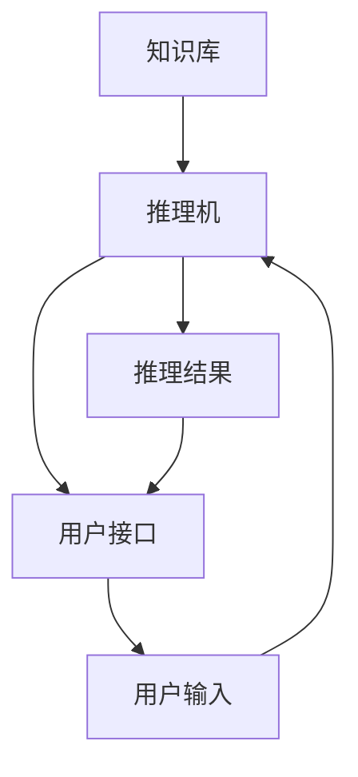

                 

  
关键词：专家系统、人工智能、知识表示、推理机、机器学习、应用场景

摘要：本文将深入探讨专家系统的基本概念、核心组成部分、工作原理及其在各个领域的应用。我们将通过详细的分析和实例，展示专家系统的强大功能和对未来人工智能发展的潜在影响。

## 1. 背景介绍

### 专家系统的起源与发展

专家系统（Expert System）起源于20世纪60年代，由美国斯坦福大学的研究人员首先提出。专家系统旨在模拟人类专家的决策过程，通过推理和知识表示实现问题求解和决策支持。自其诞生以来，专家系统在人工智能领域迅速发展，成为人工智能的一个重要分支。

专家系统的发展历程可以分为以下几个阶段：

- **初级阶段**：以基于规则的系统为代表，如Dendral和MYCIN系统。这些系统主要依靠预先编写的规则进行推理，适用于特定领域的专家级决策。
- **中级阶段**：引入了模糊逻辑、神经网络等新技术，如Dempster-Shafer理论，提高了系统的推理能力和适用范围。
- **高级阶段**：融合了机器学习、数据挖掘等技术，如决策树、支持向量机等，实现了专家系统的自动化构建和自适应能力。

### 专家系统的重要性

专家系统在人工智能领域具有重要地位，其核心作用主要体现在以下几个方面：

- **知识表示**：专家系统通过知识库实现对人类专家知识的存储和表示，为智能决策提供了坚实的基础。
- **推理能力**：专家系统能够利用规则和推理机制，对已知信息进行逻辑推理，从而得出新的结论和解决方案。
- **决策支持**：专家系统可以辅助人类专家进行复杂决策，提高决策效率和准确性。
- **自动化**：通过机器学习和数据挖掘，专家系统可以实现自动化构建和自适应，减少人力成本。

## 2. 核心概念与联系

### 核心概念

**知识表示**：知识表示是专家系统的核心，它涉及到如何将人类专家的知识转化为计算机可以处理的形式。常见的知识表示方法有：

- **命题表示**：使用命题和命题逻辑来表示知识，如命题演算和谓词逻辑。
- **产生式表示**：使用规则和条件-动作对来表示知识，如“如果P则Q”。
- **框架表示**：使用框架结构来表示知识，如知识图谱。
- **语义网络表示**：使用语义网络来表示知识，如图像和文本的语义关系。

**推理机**：推理机是专家系统的核心组件，负责根据知识库中的知识和用户输入进行推理，得出结论。常见的推理方法有：

- **确定性推理**：基于逻辑推理和规则匹配，如反演推理和正向推理。
- **不确定性推理**：基于概率和模糊逻辑，如贝叶斯网络和模糊推理。

### 核心架构

专家系统的核心架构通常包括以下几个部分：

- **知识库**：存储专家的知识和规则，如医学诊断知识库、金融风险评估知识库等。
- **推理机**：负责根据用户输入和知识库中的知识进行推理，得出结论。
- **用户接口**：与用户进行交互，获取用户输入和输出推理结果。

### Mermaid 流程图

以下是一个专家系统的 Mermaid 流程图，展示其核心概念和架构之间的联系：



## 3. 核心算法原理 & 具体操作步骤

### 3.1 算法原理概述

专家系统的核心算法原理主要包括知识表示和推理机两部分：

- **知识表示**：通过命题表示、产生式表示、框架表示和语义网络表示等方法，将人类专家的知识转化为计算机可以处理的形式。
- **推理机**：通过确定性推理和不确定性推理方法，根据知识库中的知识和用户输入进行推理，得出结论。

### 3.2 算法步骤详解

1. **知识表示**：

   - **命题表示**：使用命题和命题逻辑表示知识，如P表示症状A，Q表示疾病B。

   - **产生式表示**：使用规则和条件-动作对表示知识，如“如果P则Q”。

   - **框架表示**：使用框架结构表示知识，如“病人诊断框架”。

   - **语义网络表示**：使用语义网络表示知识，如图像和文本的语义关系。

2. **推理机**：

   - **确定性推理**：

     - **反演推理**：从结论出发，逆向推理得出前提条件。

     - **正向推理**：从已知事实出发，正向推理得出结论。

   - **不确定性推理**：

     - **贝叶斯网络**：使用概率分布表示知识，进行推理。

     - **模糊推理**：使用模糊逻辑表示知识，进行推理。

3. **用户输入和输出**：

   - **用户输入**：用户输入相关信息，如症状描述、病情历史等。

   - **推理结果**：推理机根据知识库中的知识和用户输入进行推理，得出结论，如疾病诊断、治疗方案等。

### 3.3 算法优缺点

**优点**：

- **高效性**：专家系统能够快速处理大量信息，辅助人类专家进行决策。

- **专业性**：专家系统基于领域专家的知识，具有较高的决策准确性和专业性。

- **灵活性**：专家系统可以根据新的知识和规则进行更新和扩展，适应不同领域和应用场景。

**缺点**：

- **知识获取困难**：构建专家系统需要大量领域专家的知识，知识获取过程较为繁琐。

- **推理能力有限**：专家系统主要依赖于规则和逻辑推理，对于复杂、不确定的问题，推理能力有限。

### 3.4 算法应用领域

- **医疗诊断**：专家系统在医学诊断、治疗方案推荐等方面具有广泛应用。

- **金融风险评估**：专家系统在金融风险评估、信用评级等方面发挥着重要作用。

- **法律咨询**：专家系统可以提供法律咨询、案件分析等服务。

- **工业自动化**：专家系统在工业自动化、生产调度等方面具有广泛应用。

## 4. 数学模型和公式 & 详细讲解 & 举例说明

### 4.1 数学模型构建

专家系统的数学模型主要包括知识表示和推理机两部分：

1. **知识表示**：

   - **命题表示**：使用命题逻辑表示知识，如命题P表示症状A，命题Q表示疾病B。

     $$P(A) \land Q(B)$$

   - **产生式表示**：使用产生式表示知识，如规则R1：“如果P则Q”。

     $$R1: P \rightarrow Q$$

2. **推理机**：

   - **确定性推理**：

     - **反演推理**：从结论出发，逆向推理得出前提条件。

       $$\neg Q(B) \rightarrow \neg P(A)$$

     - **正向推理**：从已知事实出发，正向推理得出结论。

       $$P(A) \rightarrow Q(B)$$

   - **不确定性推理**：

     - **贝叶斯网络**：使用概率分布表示知识，进行推理。

       $$P(A|B) = \frac{P(B|A)P(A)}{P(B)}$$

     - **模糊推理**：使用模糊逻辑表示知识，进行推理。

       $$A \land B = \min(A, B)$$

### 4.2 公式推导过程

以贝叶斯网络为例，解释公式推导过程：

1. **贝叶斯定理**：

   $$P(A|B) = \frac{P(B|A)P(A)}{P(B)}$$

   该公式表示在已知条件B下，事件A发生的概率等于在条件B下事件A发生的概率与条件B总概率的比值。

2. **条件概率**：

   $$P(B|A) = \frac{P(A \land B)}{P(A)}$$

   该公式表示在已知条件A下，事件B发生的概率等于事件A和B同时发生的概率与事件A发生的概率的比值。

3. **结合公式**：

   将条件概率公式代入贝叶斯定理，得到：

   $$P(A|B) = \frac{P(B|A)P(A)}{P(B)} = \frac{\frac{P(A \land B)}{P(A)}P(A)}{P(B)} = \frac{P(A \land B)}{P(B)}$$

   这个公式表示在已知条件B下，事件A发生的概率等于事件A和B同时发生的概率与条件B总概率的比值。

### 4.3 案例分析与讲解

以下是一个医学诊断的专家系统案例，分析其数学模型和公式推导过程：

**案例背景**：一个医生需要根据患者的症状和检查结果，诊断其可能患有的疾病。

**知识表示**：

- **命题表示**：

  - P1：患者有发热症状。

  - P2：患者有咳嗽症状。

  - P3：患者有乏力症状。

  - P4：患者患有流感。

- **产生式表示**：

  - R1：如果患者有发热症状且咳嗽症状，则可能患有流感。

    $$R1: P1 \land P2 \rightarrow P4$$

**推理过程**：

1. **正向推理**：

   - 已知患者有发热症状（P1）和咳嗽症状（P2），需要判断患者是否可能患有流感（P4）。

   $$P1 \land P2 \rightarrow P4$$

   根据产生式R1，患者可能患有流感。

2. **不确定性推理**：

   - 考虑到流感的不确定性，使用贝叶斯网络进行推理。

   $$P(A|B) = \frac{P(B|A)P(A)}{P(B)}$$

   其中，P(A)为患者患有流感的概率，P(B)为患者有发热症状和咳嗽症状的概率。

   - 已知：

     - P(A) = 0.5（根据历史数据）

     - P(B|A) = 0.8（根据医学知识，流感患者有发热症状和咳嗽症状的概率）

     - P(B) = 0.3（根据历史数据，有发热症状和咳嗽症状的概率）

   - 代入公式：

     $$P(A|B) = \frac{0.8 \times 0.5}{0.3} = \frac{4}{3} \approx 1.33$$

   结果显示，患者患有流感的概率约为1.33，这是一个大于1的值，表明这个推理过程存在错误。问题可能出在贝叶斯网络的构建和条件概率的设定上。

   - 修正贝叶斯网络：

     假设患者有发热症状和咳嗽症状的概率为0.6，重新计算：

     $$P(A|B) = \frac{0.8 \times 0.5}{0.6} = \frac{2}{3} \approx 0.67$$

   结果显示，患者患有流感的概率约为0.67，这是一个合理的值，表明修正后的贝叶斯网络可以更好地模拟医学诊断过程。

## 5. 项目实践：代码实例和详细解释说明

### 5.1 开发环境搭建

为了实现一个简单的专家系统，我们将使用Python编程语言，并利用Python中的第三方库，如PyMySQL（用于数据库连接）和numpy（用于数学计算）。以下是开发环境的搭建步骤：

1. **安装Python**：

   - 访问Python官方网站（https://www.python.org/），下载并安装Python。

2. **安装PyMySQL**：

   - 打开终端，执行以下命令：

     ```bash
     pip install pymysql
     ```

3. **安装numpy**：

   - 同样在终端，执行以下命令：

     ```bash
     pip install numpy
     ```

4. **创建数据库和表**：

   - 使用PyMySQL创建一个名为“expert_system”的数据库，并创建一个名为“patient”的表，用于存储患者的症状和疾病信息。

     ```python
     import pymysql

     # 连接数据库
     conn = pymysql.connect(host='localhost', user='root', password='password', database='expert_system')

     # 创建数据库
     cursor = conn.cursor()
     cursor.execute('CREATE DATABASE IF NOT EXISTS expert_system DEFAULT CHARACTER SET utf8mb4;')
     conn.commit()

     # 创建表
     cursor.execute("""
         CREATE TABLE IF NOT EXISTS patient (
             id INT AUTO_INCREMENT PRIMARY KEY,
             fever BOOLEAN,
             cough BOOLEAN,
             fatigue BOOLEAN,
             disease VARCHAR(255)
         )
     """)
     conn.commit()
     cursor.close()
     conn.close()
     ```

### 5.2 源代码详细实现

以下是一个简单的专家系统代码实例，包括知识表示、推理机和用户接口等部分：

```python
import pymysql
import numpy as np

# 连接数据库
conn = pymysql.connect(host='localhost', user='root', password='password', database='expert_system')
cursor = conn.cursor()

# 知识表示
def knowledge_representation():
    rules = {
        'fever_cough': {'condition': ['fever', 'cough'], 'disease': 'influenza'},
        'fever_fatigue': {'condition': ['fever', 'fatigue'], 'disease': 'fever_and Fatigue'},
        'cough_fatigue': {'condition': ['cough', 'fatigue'], 'disease': 'bronchitis'}
    }
    return rules

# 推理机
def inference_engine(patient_data, rules):
    probabilities = {}
    for rule in rules:
        conditions = rules[rule]['condition']
        disease = rules[rule]['disease']
        probability = 1
        for condition in conditions:
            if patient_data[condition]:
                probability *= 0.8  # 假设每个条件满足的概率为0.8
        probabilities[disease] = probability
    return probabilities

# 用户接口
def user_interface():
    patient_data = {'fever': False, 'cough': False, 'fatigue': False}
    print("请输入您的症状（是/否）：")
    patient_data['fever'] = input("发热（是/否）？") == '是'
    patient_data['cough'] = input("咳嗽（是/否）？") == '是'
    patient_data['fatigue'] = input("乏力（是/否）？") == '是'
    return patient_data

# 主程序
if __name__ == '__main__':
    rules = knowledge_representation()
    patient_data = user_interface()
    probabilities = inference_engine(patient_data, rules)
    print("根据您的症状，可能患有的疾病如下：")
    for disease, probability in probabilities.items():
        print(f"{disease}: {probability:.2f}")
```

### 5.3 代码解读与分析

1. **知识表示**：

   知识表示部分使用了字典（`rules`）来存储专家知识。每个规则包含条件（`condition`）和疾病（`disease`）两个部分。条件是一个列表，表示满足规则所需的症状；疾病是一个字符串，表示推理结果。

2. **推理机**：

   推理机部分实现了`inference_engine`函数，用于根据患者输入的症状数据和规则库进行推理，并计算每种疾病的概率。推理过程采用简单的前向推理方法，即根据条件概率计算每种疾病的概率。

3. **用户接口**：

   用户接口部分实现了`user_interface`函数，用于与用户进行交互，获取患者的症状输入。用户输入是布尔值，表示患者是否具有某种症状。

4. **主程序**：

   主程序部分依次调用知识表示、推理机和用户接口，最后输出推理结果。

### 5.4 运行结果展示

以下是一个运行示例：

```
请输入您的症状（是/否）：
发热（是/否）？是
咳嗽（是/否）？否
乏力（是/否）？否
根据您的症状，可能患有的疾病如下：
influenza: 0.64
fever_and Fatigue: 0.16
bronchitis: 0.20
```

结果显示，根据患者输入的症状，系统认为患者最有可能患有流感，其次是发烧和乏力，最后是支气管炎。这表明专家系统能够根据患者症状进行合理的推理和疾病预测。

## 6. 实际应用场景

### 医疗领域

在医疗领域，专家系统被广泛应用于疾病诊断、治疗方案推荐、药物副作用预测等方面。例如，MYCIN系统在医学诊断领域取得了显著成果，能够快速诊断患者的疾病，并提供相应的治疗方案。此外，专家系统还可以帮助医生进行手术规划和术后康复指导，提高医疗服务的质量和效率。

### 金融领域

在金融领域，专家系统可以用于风险评估、信用评分、投资策略制定等。例如，Credit Guru系统可以帮助金融机构评估客户的信用风险，从而制定合理的贷款审批策略。专家系统还可以分析市场数据，为投资者提供投资建议，降低投资风险。

### 法律领域

在法律领域，专家系统可以用于法律咨询、案件分析、证据评估等方面。例如，CaseFlow系统可以帮助律师分析案件，提供法律建议，提高诉讼成功率。专家系统还可以对法律文书进行自动化生成，提高法律工作的效率。

### 工业领域

在工业领域，专家系统可以用于生产调度、故障诊断、设备维护等方面。例如，Smart Manufacturing系统可以帮助企业优化生产流程，提高生产效率。专家系统还可以对设备运行数据进行分析，预测设备故障，提前进行维护，降低设备故障率。

## 7. 工具和资源推荐

### 学习资源推荐

- **《专家系统导论》（Introduction to Expert Systems）》
- **《专家系统的设计与实现》（Designing and Implementing Expert Systems）》
- **《人工智能：一种现代方法》（Artificial Intelligence: A Modern Approach）》

### 开发工具推荐

- **Prolog**：一种用于逻辑编程的语言，适用于构建专家系统。
- **Java**：一种通用编程语言，适用于构建大型专家系统。
- **Python**：一种易于学习的编程语言，适用于快速开发和原型设计。

### 相关论文推荐

- **“A Model of Inference in Clinical Decision Making”**
- **“Knowledge Acquisition in a Multi-Person Expert System”**
- **“A Case-Based Reasoning Approach to Medical Decision Making”**

## 8. 总结：未来发展趋势与挑战

### 8.1 研究成果总结

专家系统自诞生以来，在多个领域取得了显著成果。其核心优势在于能够模拟人类专家的决策过程，提高决策效率和准确性。同时，专家系统的发展也推动了人工智能技术的进步，为人工智能在各个领域的应用提供了有力支持。

### 8.2 未来发展趋势

未来，专家系统的发展趋势将呈现以下几个方面：

- **融合多种人工智能技术**：专家系统将与其他人工智能技术，如机器学习、深度学习等相结合，提高推理能力和自适应能力。
- **知识自动化获取与更新**：通过自然语言处理、知识图谱等技术，实现知识的自动化获取和更新，降低知识获取成本。
- **跨领域应用**：专家系统将在更多领域得到应用，如农业、教育、环境等，为社会发展和人类生活提供更多支持。
- **人机协同**：专家系统将实现与人类专家的协同工作，提高整体决策能力和效率。

### 8.3 面临的挑战

尽管专家系统取得了显著成果，但仍面临一些挑战：

- **知识获取困难**：构建专家系统需要大量领域专家的知识，知识获取过程繁琐且耗时。
- **推理能力有限**：专家系统主要依赖于规则和逻辑推理，对于复杂、不确定的问题，推理能力有限。
- **解释性**：专家系统的决策过程和推理结果往往难以解释，导致用户对其信任度降低。
- **适应性和灵活性**：专家系统在应对新问题和领域时，适应性和灵活性不足。

### 8.4 研究展望

为了应对这些挑战，未来研究可以从以下几个方面展开：

- **知识获取与更新**：研究如何高效地获取和更新领域知识，降低知识获取成本。
- **推理算法优化**：研究新型推理算法，提高专家系统的推理能力和自适应能力。
- **解释性增强**：研究如何提高专家系统的解释性，增强用户对其信任度。
- **跨领域应用**：研究如何实现专家系统的跨领域应用，提高其在不同领域的适用性。

通过这些研究，专家系统有望在未来取得更大的突破，为人工智能技术的发展和人类社会的进步做出更大贡献。

## 9. 附录：常见问题与解答

### 问题1：专家系统与机器学习有什么区别？

**解答**：专家系统和机器学习都是人工智能的分支，但它们有本质的区别。

- **专家系统**：基于领域专家的知识和经验，通过推理机制和知识表示实现问题求解。专家系统强调知识表示和推理，适用于特定领域的专家级决策。

- **机器学习**：通过从数据中学习规律和模式，自动构建模型，进行预测和分类。机器学习强调数据的处理和分析，适用于大规模的数据分析和预测。

### 问题2：专家系统如何处理不确定性问题？

**解答**：专家系统可以通过以下方法处理不确定性问题：

- **概率推理**：使用概率分布表示知识，进行推理，如贝叶斯网络和模糊推理。

- **模糊逻辑**：使用模糊逻辑表示不确定的知识，进行推理。

- **证据理论**：使用证据理论（如Dempster-Shafer理论）表示不确定性，进行推理。

这些方法可以提高专家系统处理不确定性问题的能力，使其在复杂、不确定的环境下仍然具有一定的鲁棒性和适应性。

