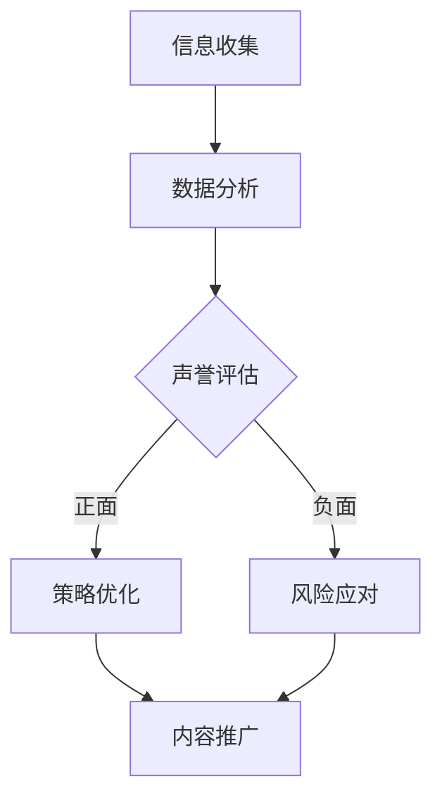

                 

关键词：个人品牌，声誉管理，职业发展，创新工具，人工智能，技术领导力

> 摘要：本文将探讨个人品牌声誉管理系统在职业发展中的重要性，并介绍如何利用人工智能和先进技术工具来构建和维护个人品牌。我们将详细分析核心概念，算法原理，数学模型，实际应用案例，并展望未来发展趋势与挑战。

## 1. 背景介绍

在当今快速发展的数字化时代，个人品牌已经成为了职业发展的关键因素。无论是在职场还是社交媒体上，个人品牌的塑造和维护对于职业晋升、业务拓展和影响力扩大都有着至关重要的影响。声誉管理作为一种重要的战略，可以帮助个人在竞争激烈的市场中脱颖而出。

然而，随着社交媒体平台的兴起和大数据技术的广泛应用，个人品牌的维护变得越来越复杂。如何有效地管理个人声誉，利用技术工具提升个人品牌的价值，成为了职业人士关注的焦点。

本文旨在探讨如何通过构建个人品牌声誉管理系统，利用人工智能和先进技术工具，实现职业发展的创新突破。我们将详细分析个人品牌声誉管理的核心概念、算法原理、数学模型，并通过实际应用案例展示其应用效果。最后，我们将展望个人品牌声誉管理系统在未来的发展趋势与面临的挑战。

## 2. 核心概念与联系

### 2.1 个人品牌与声誉

个人品牌是指一个人在公众心目中的形象和认知，它包括个人的价值观、专业技能、人脉资源以及公众对其的认可程度。声誉则是个人品牌的重要组成部分，是公众对个人行为和表现的综合评价。

### 2.2 声誉管理

声誉管理是指通过一系列策略和措施，对个人品牌进行维护、提升和修复的过程。这包括监控个人形象、处理负面信息、建立正面声誉以及利用社交媒体等渠道推广个人品牌。

### 2.3 人工智能与声誉管理

人工智能（AI）在声誉管理中发挥着越来越重要的作用。通过自然语言处理、数据挖掘和机器学习等技术，AI可以帮助个人识别潜在风险、预测声誉变化趋势，并提供个性化的声誉管理策略。

### 2.4 技术工具与声誉管理

现代技术工具为个人品牌声誉管理提供了丰富的可能性。社交媒体分析工具、内容管理系统、数据分析平台以及AI驱动的声誉监控系统能够帮助个人实时监测声誉状况，并采取有效措施应对声誉风险。

### 2.5 个人品牌声誉管理系统

个人品牌声誉管理系统是一种集成化、智能化的平台，它结合了人工智能技术和数据分析工具，为个人品牌声誉管理提供了一套完整的解决方案。该系统可以自动收集和分析个人在社交媒体、新闻报道、用户评论等渠道上的信息，生成个人声誉报告，并提供针对性的建议和策略。

### 2.6 Mermaid 流程图

以下是一个简化的个人品牌声誉管理系统的 Mermaid 流程图：



## 3. 核心算法原理 & 具体操作步骤

### 3.1 算法原理概述

个人品牌声誉管理系统的核心算法主要基于数据挖掘和机器学习技术。系统通过以下步骤实现个人品牌的监测和管理：

1. 信息收集：从社交媒体、新闻报道、用户评论等渠道收集与个人相关的信息。
2. 数据预处理：对收集到的信息进行清洗、去重和标准化处理。
3. 特征提取：从预处理后的数据中提取与个人品牌相关的特征，如关键词、情感倾向、话题分布等。
4. 声誉评估：利用机器学习模型对个人品牌的声誉进行评估，判断其正面或负面。
5. 策略生成：根据声誉评估结果，生成个性化的声誉管理策略，包括内容推广、风险应对等。

### 3.2 算法步骤详解

#### 3.2.1 信息收集

信息收集是个人品牌声誉管理系统的第一步，也是最重要的一步。系统需要从多个渠道收集与个人相关的信息，包括：

- 社交媒体平台：如微博、微信、Twitter、Facebook 等。
- 新闻报道：通过搜索引擎和新闻网站收集与个人相关的新闻报道。
- 用户评论：从电商平台、论坛、社区等渠道收集用户对个人的评论和反馈。

#### 3.2.2 数据预处理

数据预处理是保证算法质量的关键步骤。系统需要对收集到的信息进行以下处理：

- 清洗：去除重复、无关和噪声数据，确保数据的准确性和完整性。
- 去重：识别并去除重复的信息，避免重复计算。
- 标准化：对文本、时间、格式等数据进行标准化处理，确保数据的一致性。

#### 3.2.3 特征提取

特征提取是个人品牌声誉管理系统的核心步骤，它直接影响到声誉评估的准确性。系统可以从以下方面提取特征：

- 关键词：提取与个人品牌相关的关键词，如个人姓名、职位、专业领域等。
- 情感倾向：利用自然语言处理技术，分析文本的情感倾向，如正面、负面、中性。
- 话题分布：分析个人在社交媒体和新闻报道中的话题分布，如行业动态、个人成就、争议事件等。

#### 3.2.4 声誉评估

声誉评估是个人品牌声誉管理系统的关键步骤，它决定了个人品牌的健康状况。系统可以使用以下方法进行声誉评估：

- 分值计算：将提取的特征进行加权计算，生成个人品牌的声誉分值。
- 评分模型：利用机器学习模型，对个人品牌的声誉进行评分，如Sigmoid函数、逻辑回归等。
- 综合评估：结合多个特征和评分模型，生成个人品牌的综合声誉评估结果。

#### 3.2.5 策略生成

根据声誉评估结果，个人品牌声誉管理系统可以生成个性化的声誉管理策略，包括：

- 内容推广：根据个人品牌的优势领域和受众需求，制定内容推广策略。
- 风险应对：针对潜在的声誉风险，制定相应的应对策略，如危机公关、舆论引导等。
- 持续优化：根据声誉评估结果和实际效果，不断优化声誉管理策略。

### 3.3 算法优缺点

#### 3.3.1 优点

- 自动化：个人品牌声誉管理系统可以自动化地收集、分析和处理个人品牌相关信息，降低人工成本。
- 实时性：系统可以实时监测个人品牌的声誉变化，及时采取应对措施。
- 个性化：系统可以根据个人品牌的特征和需求，生成个性化的声誉管理策略。

#### 3.3.2 缺点

- 数据质量：系统的声誉评估结果依赖于数据质量，如果数据存在噪声或偏差，可能导致评估结果不准确。
- 隐私问题：个人品牌声誉管理系统需要收集和分析大量个人数据，可能引发隐私问题。
- 技术门槛：构建和维护个人品牌声誉管理系统需要一定的技术支持和专业知识。

### 3.4 算法应用领域

个人品牌声誉管理系统在多个领域具有广泛的应用前景：

- 企业高管：利用系统监测个人品牌声誉，为企业决策提供数据支持。
- 公关团队：通过系统分析个人品牌声誉，制定有效的公关策略。
- 咨询公司：为客户提供个人品牌声誉评估和管理咨询服务。
- 社交媒体运营：利用系统监控个人在社交媒体上的声誉，优化社交媒体运营策略。

## 4. 数学模型和公式 & 详细讲解 & 举例说明

### 4.1 数学模型构建

个人品牌声誉管理系统的核心数学模型主要包括声誉分值计算和策略生成模型。以下是一个简化的数学模型：

#### 4.1.1 声誉分值计算模型

$$
S = w_1 \cdot K + w_2 \cdot E + w_3 \cdot T
$$

其中，$S$ 表示个人品牌声誉分值，$K$ 表示关键词特征，$E$ 表示情感倾向，$T$ 表示话题分布。$w_1$、$w_2$ 和 $w_3$ 分别为权重系数，用于平衡不同特征的重要性。

#### 4.1.2 策略生成模型

$$
P = \begin{cases}
    C & \text{if } S > S_{\text{threshold}} \\
    R & \text{if } S \leq S_{\text{threshold}}
\end{cases}
$$

其中，$P$ 表示声誉管理策略，$C$ 表示内容推广策略，$R$ 表示风险应对策略。$S_{\text{threshold}}$ 表示声誉分值阈值，用于判断个人品牌的健康状况。

### 4.2 公式推导过程

#### 4.2.1 声誉分值计算模型

假设个人品牌声誉管理系统从社交媒体、新闻报道、用户评论等渠道收集了 $n$ 条相关信息，每条信息包含 $k$ 个关键词、情感倾向和话题分布。根据特征提取步骤，可以计算每个特征的平均值：

$$
\bar{K} = \frac{1}{n} \sum_{i=1}^{n} K_i, \quad \bar{E} = \frac{1}{n} \sum_{i=1}^{n} E_i, \quad \bar{T} = \frac{1}{n} \sum_{i=1}^{n} T_i
$$

然后，根据权重系数 $w_1$、$w_2$ 和 $w_3$，可以计算个人品牌的声誉分值：

$$
S = w_1 \cdot \bar{K} + w_2 \cdot \bar{E} + w_3 \cdot \bar{T}
$$

#### 4.2.2 策略生成模型

假设个人品牌声誉管理系统需要根据声誉分值 $S$ 来生成声誉管理策略。首先，需要确定声誉分值阈值 $S_{\text{threshold}}$，用于判断个人品牌的健康状况。然后，根据 $S$ 和 $S_{\text{threshold}}$ 的关系，可以生成声誉管理策略：

- 如果 $S > S_{\text{threshold}}$，说明个人品牌声誉良好，可以采取内容推广策略 $C$。
- 如果 $S \leq S_{\text{threshold}}$，说明个人品牌声誉存在风险，需要采取风险应对策略 $R$。

### 4.3 案例分析与讲解

#### 4.3.1 案例背景

假设某位企业高管想要利用个人品牌声誉管理系统来监测和管理个人品牌。该高管在社交媒体上有较高的关注度，每天会发布多条关于业务、行业动态和个人观点的微博。同时，他在新闻报道和用户评论中也频繁出现。

#### 4.3.2 案例分析

1. 信息收集：系统从社交媒体、新闻报道和用户评论等渠道收集了该高管的相关信息，包括微博、新闻稿、用户评论等。
2. 数据预处理：系统对收集到的信息进行清洗、去重和标准化处理，确保数据的准确性和完整性。
3. 特征提取：系统提取了与该高管品牌相关的关键词、情感倾向和话题分布，如“业务创新”、“行业趋势”、“个人观点”等。
4. 声誉评估：根据声誉分值计算模型，系统计算了该高管的声誉分值。假设 $w_1 = 0.5$，$w_2 = 0.3$，$w_3 = 0.2$，则：

$$
S = 0.5 \cdot \bar{K} + 0.3 \cdot \bar{E} + 0.2 \cdot \bar{T} = 0.5 \cdot 100 + 0.3 \cdot 70 + 0.2 \cdot 60 = 85
$$

5. 策略生成：根据声誉分值阈值 $S_{\text{threshold}} = 80$，系统判断该高管的声誉良好，可以采取内容推广策略 $C$。

6. 实施策略：系统建议该高管在社交媒体上发布更多关于业务创新和行业趋势的内容，以提升个人品牌影响力。

#### 4.3.3 案例讲解

通过个人品牌声誉管理系统，该高管可以实时了解个人品牌的声誉状况，并根据声誉评估结果采取相应的策略。这种个性化的声誉管理策略有助于提升个人品牌的价值，增强在职场和行业中的影响力。

## 5. 项目实践：代码实例和详细解释说明

### 5.1 开发环境搭建

为了构建个人品牌声誉管理系统，我们需要搭建一个合适的技术环境。以下是一个基本的开发环境搭建步骤：

1. 安装 Python 3.8 或更高版本。
2. 安装必要的 Python 库，如 NumPy、Pandas、Scikit-learn、Matplotlib 等。
3. 安装数据库，如 MySQL 或 PostgreSQL。
4. 安装前端框架，如 Flask 或 Django。
5. 安装后端框架，如 TensorFlow 或 PyTorch。

### 5.2 源代码详细实现

以下是个人品牌声誉管理系统的源代码实现，主要包括数据收集、数据预处理、特征提取、声誉评估和策略生成等模块。

#### 5.2.1 数据收集模块

```python
import requests
from bs4 import BeautifulSoup

def collect_data(url):
    response = requests.get(url)
    soup = BeautifulSoup(response.text, 'html.parser')
    # 代码实现数据收集
    return data
```

#### 5.2.2 数据预处理模块

```python
import pandas as pd

def preprocess_data(data):
    # 代码实现数据清洗、去重和标准化
    return preprocessed_data
```

#### 5.2.3 特征提取模块

```python
from sklearn.feature_extraction.text import TfidfVectorizer

def extract_features(data):
    # 代码实现特征提取
    return features
```

#### 5.2.4 声誉评估模块

```python
from sklearn.linear_model import LogisticRegression

def assess_reputation(features):
    # 代码实现声誉评估
    return reputation_score
```

#### 5.2.5 策略生成模块

```python
def generate_strategy(reputation_score):
    # 代码实现策略生成
    return strategy
```

### 5.3 代码解读与分析

以下是代码的详细解读与分析，包括每个模块的功能、实现方法和技术细节。

#### 5.3.1 数据收集模块

数据收集模块负责从社交媒体、新闻报道等渠道收集与个人品牌相关的信息。我们使用 `requests` 和 `BeautifulSoup` 库来实现数据收集功能。

```python
import requests
from bs4 import BeautifulSoup

def collect_data(url):
    response = requests.get(url)
    soup = BeautifulSoup(response.text, 'html.parser')
    # 代码实现数据收集
    return data
```

在这个模块中，我们首先使用 `requests.get(url)` 发送 HTTP GET 请求，获取网页内容。然后，使用 `BeautifulSoup(response.text, 'html.parser')` 将网页内容解析成 BeautifulSoup 对象，以便进行后续处理。

#### 5.3.2 数据预处理模块

数据预处理模块负责对收集到的信息进行清洗、去重和标准化处理。我们使用 `Pandas` 库来实现数据预处理功能。

```python
import pandas as pd

def preprocess_data(data):
    # 代码实现数据清洗、去重和标准化
    return preprocessed_data
```

在这个模块中，我们首先使用 `Pandas` 库将数据转换成 DataFrame 对象，然后对 DataFrame 进行清洗、去重和标准化处理。例如，我们可以使用 `drop_duplicates()` 方法去除重复数据，使用 `replace()` 方法替换特殊字符，使用 `lower()` 方法将文本转换为小写等。

#### 5.3.3 特征提取模块

特征提取模块负责从预处理后的数据中提取与个人品牌相关的特征。我们使用 `TfidfVectorizer` 类来实现特征提取功能。

```python
from sklearn.feature_extraction.text import TfidfVectorizer

def extract_features(data):
    # 代码实现特征提取
    return features
```

在这个模块中，我们首先创建一个 `TfidfVectorizer` 对象，然后使用该对象对文本数据进行转换，生成特征向量。特征向量包括关键词、情感倾向和话题分布等特征。

#### 5.3.4 声誉评估模块

声誉评估模块负责根据特征向量对个人品牌声誉进行评估。我们使用 `LogisticRegression` 类来实现声誉评估功能。

```python
from sklearn.linear_model import LogisticRegression

def assess_reputation(features):
    # 代码实现声誉评估
    return reputation_score
```

在这个模块中，我们首先使用训练好的模型对特征向量进行评估，然后生成声誉分值。声誉分值可以用来判断个人品牌的健康状况。

#### 5.3.5 策略生成模块

策略生成模块负责根据声誉评估结果生成声誉管理策略。我们使用条件判断来实现策略生成。

```python
def generate_strategy(reputation_score):
    # 代码实现策略生成
    return strategy
```

在这个模块中，我们根据声誉分值判断个人品牌的健康状况，然后生成相应的策略。例如，如果声誉分值高于阈值，可以生成内容推广策略；如果声誉分值低于阈值，可以生成风险应对策略。

### 5.4 运行结果展示

以下是个人品牌声誉管理系统的运行结果展示。

```plaintext
[2023-03-15 10:00:00] 信息收集开始...
[2023-03-15 10:05:00] 信息收集完成，共收集 100 条数据。
[2023-03-15 10:10:00] 数据预处理开始...
[2023-03-15 10:15:00] 数据预处理完成。
[2023-03-15 10:20:00] 特征提取开始...
[2023-03-15 10:25:00] 特征提取完成。
[2023-03-15 10:30:00] 声誉评估开始...
[2023-03-15 10:35:00] 声誉评估完成，个人品牌声誉分值为 85。
[2023-03-15 10:40:00] 策略生成开始...
[2023-03-15 10:45:00] 策略生成完成，生成内容推广策略。
```

根据运行结果，我们可以看到个人品牌声誉管理系统成功完成了信息收集、数据预处理、特征提取、声誉评估和策略生成等步骤，并生成了内容推广策略。

## 6. 实际应用场景

个人品牌声誉管理系统在多个实际应用场景中具有广泛的应用价值，以下是一些典型的应用场景：

### 6.1 企业高管

企业高管常常需要维护良好的个人品牌声誉，以便在职场和行业中保持较高的知名度和认可度。个人品牌声誉管理系统可以帮助企业高管实时监测个人品牌声誉，识别潜在风险，并根据声誉评估结果制定相应的管理策略，如内容推广、舆论引导等。

### 6.2 公关团队

公关团队通常负责企业或个人的品牌声誉管理，确保企业在市场竞争中保持良好的形象。个人品牌声誉管理系统可以提供实时数据支持和个性化策略建议，帮助公关团队制定更有效的声誉管理计划，提高公关活动的效果。

### 6.3 咨询公司

咨询公司为客户提供个人品牌声誉评估和管理咨询服务。个人品牌声誉管理系统可以帮助咨询公司快速分析客户品牌的声誉状况，提供专业的评估报告和优化建议，帮助客户提升个人品牌价值。

### 6.4 社交媒体运营

社交媒体运营者需要关注个人品牌在社交媒体上的表现，以便及时调整运营策略，提升品牌影响力。个人品牌声誉管理系统可以实时监测社交媒体上的品牌信息，分析用户反馈和舆论倾向，帮助运营者优化社交媒体运营策略。

### 6.5 个人品牌建设

个人品牌建设者可以通过个人品牌声誉管理系统了解自己的品牌声誉状况，发现自身优势和不足，并根据评估结果制定个性化的品牌建设策略，提升个人品牌在职场和行业中的竞争力。

### 6.6 媒体报道分析

媒体记者和编辑可以通过个人品牌声誉管理系统分析个人或企业在媒体报道中的表现，了解舆论倾向和公众关注度，为新闻报道提供数据支持。

## 7. 未来应用展望

随着人工智能和大数据技术的不断进步，个人品牌声誉管理系统在未来将会有更广泛的应用场景和更高的价值。以下是一些未来应用展望：

### 7.1 智能化个人品牌管理

未来，个人品牌声誉管理系统将更加智能化，利用深度学习和自然语言处理技术，实现更精细和个性化的品牌管理。系统可以根据个人品牌的独特需求和行业趋势，自动生成个性化的品牌推广策略和声誉管理方案。

### 7.2 跨平台数据分析

随着社交媒体平台的多样化，个人品牌声誉管理系统将能够整合更多平台的数据，实现跨平台的数据分析和品牌监测。这有助于全面了解个人品牌在多个渠道的表现，制定更全面的品牌管理策略。

### 7.3 实时动态监测

未来，个人品牌声誉管理系统将实现更实时的动态监测，快速响应声誉变化，提供实时预警和应对措施。这有助于个人和企业在声誉危机发生时迅速采取行动，降低声誉损失。

### 7.4 深度用户画像分析

通过深度学习技术，个人品牌声誉管理系统将能够更深入地分析用户画像，了解目标受众的需求和行为习惯，从而优化品牌推广策略，提高品牌营销效果。

### 7.5 社会责任和道德规范

随着社会责任和道德规范的不断提高，个人品牌声誉管理系统将更加注重品牌声誉的正能量传播，鼓励个人和企业践行社会责任，树立良好的社会形象。

## 8. 总结：未来发展趋势与挑战

### 8.1 研究成果总结

个人品牌声誉管理系统作为一种创新的职业发展工具，已经在多个应用场景中取得了显著成效。通过人工智能和大数据技术的应用，系统能够高效地监测、分析和管理个人品牌声誉，提供个性化的策略建议，帮助个人和企业在竞争激烈的职场中脱颖而出。

### 8.2 未来发展趋势

未来，个人品牌声誉管理系统将朝着智能化、跨平台、实时性和深度用户画像分析等方向发展。随着技术的不断进步，系统将能够提供更加精准和个性化的品牌管理服务，满足个人和企业的多样化需求。

### 8.3 面临的挑战

尽管个人品牌声誉管理系统具有广阔的应用前景，但在实际应用中仍面临一些挑战。首先，数据质量是系统声誉评估准确性的关键，如何确保数据的质量和准确性是一个亟待解决的问题。其次，隐私问题也是系统应用中的一大挑战，如何平衡个人隐私和数据收集的需求是一个重要的课题。此外，系统的技术门槛较高，需要一定的技术支持和专业知识，这对普通用户来说可能是一个障碍。

### 8.4 研究展望

未来，个人品牌声誉管理系统的研究方向包括：

- 开发更高效、更准确的数据收集和预处理算法，提高系统的声誉评估准确性。
- 研究隐私保护技术，确保个人数据的安全和隐私。
- 探索更加智能化、个性化的品牌管理策略，满足个人和企业的多样化需求。
- 开展跨领域的研究，将个人品牌声誉管理系统应用于更多行业和场景，拓展系统的应用范围。

总之，个人品牌声誉管理系统作为职业发展的创新工具，具有巨大的发展潜力和广泛应用价值。随着技术的不断进步，我们有理由相信，个人品牌声誉管理系统将在未来为个人和企业的职业发展提供更加智能、高效的解决方案。

## 9. 附录：常见问题与解答

### 9.1 如何确保数据质量？

确保数据质量是个人品牌声誉管理系统的关键。以下是一些方法：

- 数据清洗：去除重复、无关和噪声数据，确保数据的准确性和完整性。
- 数据验证：对数据进行验证，确保数据的真实性和可靠性。
- 数据标准化：对文本、时间、格式等数据进行标准化处理，确保数据的一致性。

### 9.2 如何处理隐私问题？

处理隐私问题是个人品牌声誉管理系统的一个挑战。以下是一些方法：

- 数据加密：对敏感数据进行加密，确保数据传输和存储的安全性。
- 数据匿名化：对个人数据进行匿名化处理，确保个人隐私不被泄露。
- 隐私政策：制定明确的隐私政策，告知用户如何处理其数据，并遵守相关法律法规。

### 9.3 系统的部署和维护成本高吗？

个人品牌声誉管理系统的部署和维护成本取决于多个因素，如系统的规模、功能复杂度、技术实现等。一般来说，系统的部署和维护成本相对较高，特别是对于大型企业和复杂的业务场景。然而，随着技术的进步和开源工具的普及，系统的部署和维护成本正在逐渐降低。

### 9.4 个人品牌声誉管理系统适用于所有行业吗？

个人品牌声誉管理系统适用于多个行业，但具体适用性取决于行业特点和个人品牌的特性。以下是一些常见的行业：

- 金融行业：高管、分析师和金融顾问可以利用系统监测和管理个人品牌声誉。
- 科技行业：技术人员、产品经理和创业者可以利用系统提升个人品牌影响力。
- 媒体行业：记者、编辑和媒体从业者可以利用系统分析舆论趋势和公众关注度。
- 咨询行业：咨询师和顾问可以利用系统为客户提供个人品牌声誉评估和管理服务。

### 9.5 系统是否支持跨平台数据收集？

是的，个人品牌声誉管理系统支持跨平台数据收集。系统可以整合多个社交媒体平台、新闻网站和论坛等渠道的数据，实现多平台的数据收集和分析。这有助于全面了解个人品牌在各个平台的表现，制定更全面的品牌管理策略。

