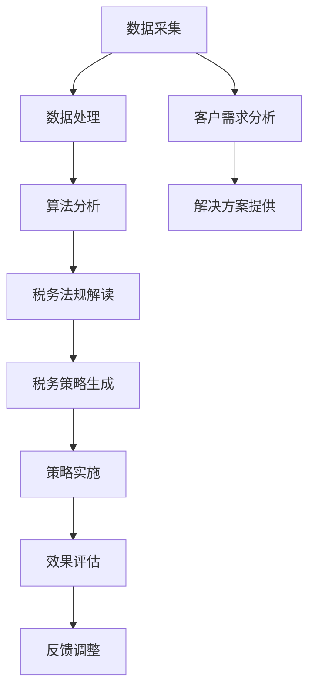

                 

在这个数字化时代，人工智能（AI）正以前所未有的速度融入各个领域，带来革命性的变革。个人税务优化AI便是其中一项令人瞩目的应用，通过先进的算法和大数据分析，为个人和企业提供精准的税务规划服务，从而实现理财效率的提升和税款的优化。本文将深入探讨个人税务优化AI的核心概念、算法原理、数学模型、项目实践以及未来应用场景，旨在为读者呈现这一领域的最新研究成果和应用前景。

## 关键词

- 人工智能
- 税务优化
- 智能理财
- 大数据分析
- 算法
- 数学模型
- 案例分析

## 摘要

本文介绍了个人税务优化AI这一创新应用，通过深入探讨其核心概念、算法原理、数学模型以及实际案例，展示了AI在税务优化领域的巨大潜力。文章将分为以下几个部分：首先，介绍个人税务优化AI的背景和应用；其次，阐述核心概念与联系，并给出流程图；然后，详细讲解核心算法原理和操作步骤；接下来，分析算法的优缺点和应用领域；随后，介绍数学模型和公式，并进行案例分析；随后，展示项目实践中的代码实例；之后，讨论实际应用场景和未来展望；最后，推荐相关工具和资源，并总结研究成果和展望未来趋势。

## 1. 背景介绍

税务优化是个人和企业理财中至关重要的环节。传统的税务规划依赖于经验丰富的会计师或税务顾问，他们通过复杂的计算和法律规定，为客户制定税务策略。然而，随着税收法规的日益复杂和经济环境的不断变化，这种依赖经验的模式逐渐显露出其局限性。会计师和税务顾问可能无法在短时间内处理大量数据，也无法预测未来税收政策的变化，从而影响税务优化的效果。

人工智能的出现为税务优化带来了新的契机。AI通过大数据分析和机器学习算法，能够迅速处理海量数据，识别潜在税务优惠和减免政策，为个人和企业提供更加精准和高效的税务规划服务。此外，AI还能够实时监控税收法规的变化，及时调整税务策略，确保客户能够在法律允许的范围内实现最大的税务减免。

个人税务优化AI的应用场景广泛，包括个人理财规划、企业税务筹划、跨国税务管理、遗产税优化等。通过智能税务优化，个人可以合理避税，提高财务状况；企业可以降低税务负担，提高竞争力；跨国企业则能够更有效地管理不同国家间的税收差异，实现全球税收优化。

## 2. 核心概念与联系

### 2.1. 人工智能在税务优化中的应用

人工智能在税务优化中的应用主要依赖于以下几个方面：

- **数据采集与处理**：AI可以自动采集和处理大量的税务数据，包括个人收入、企业财务报表、税务法规等，从而为税务优化提供基础数据支持。

- **机器学习算法**：通过机器学习算法，AI可以识别和预测税收政策的变化，为税务优化提供科学的决策依据。

- **自然语言处理**：自然语言处理技术使AI能够理解和处理税务法规和文件，从而自动生成税务报告和规划方案。

- **优化算法**：AI可以运用优化算法，对个人的税务情况进行全局分析，找到最优的税务策略。

### 2.2. 核心概念之间的联系

- **数据与算法**：数据是AI的基础，而算法则是税务优化的关键。只有通过高效的数据处理和精准的算法分析，才能实现真正的税务优化。

- **税务法规与实际操作**：税务法规为AI的决策提供了法律依据，而实际操作则需要AI根据法规和具体情况，制定出可行的税务策略。

- **客户需求与解决方案**：了解客户的需求是税务优化的出发点，而AI通过数据分析和技术手段，提供个性化的税务解决方案。

### 2.3. Mermaid 流程图

以下是一个简化的Mermaid流程图，展示了个人税务优化AI的核心概念和流程：



### 2.4. 数据流

- **数据来源**：税务数据、财务报表、税务法规、市场数据等。
- **数据处理**：数据清洗、数据整合、数据预处理。
- **算法分析**：机器学习、优化算法、自然语言处理。
- **结果输出**：税务报告、税务策略、执行方案。

## 3. 核心算法原理 & 具体操作步骤

### 3.1. 算法原理概述

个人税务优化AI的核心算法主要包括以下几个方面：

- **机器学习算法**：通过历史数据和税务法规，训练出能够预测未来税收政策的机器学习模型。
- **优化算法**：运用线性规划、动态规划等优化算法，对个人税务情况进行全局分析，找到最优的税务策略。
- **自然语言处理**：理解和处理税务法规和文件，自动生成税务报告和规划方案。

### 3.2. 算法步骤详解

#### 3.2.1. 数据预处理

- **数据清洗**：去除重复数据、缺失数据和异常数据，保证数据质量。
- **数据整合**：将不同来源的数据进行整合，形成统一的数据集。
- **特征提取**：提取与税务优化相关的特征，如收入水平、投资情况、税务法规变化等。

#### 3.2.2. 机器学习模型训练

- **数据划分**：将数据集划分为训练集、验证集和测试集。
- **模型选择**：选择合适的机器学习算法，如决策树、神经网络、支持向量机等。
- **模型训练**：使用训练集数据训练模型，并调整模型参数，以优化模型性能。
- **模型验证**：使用验证集数据评估模型性能，并进行模型调整。

#### 3.2.3. 税务策略生成

- **全局分析**：利用优化算法，对个人税务情况进行全局分析，找出最优的税务策略。
- **策略生成**：根据分析结果，生成具体的税务策略，如投资建议、税务减免方案等。

#### 3.2.4. 税务策略实施

- **方案执行**：根据生成的税务策略，执行具体的操作，如调整投资组合、申报税务减免等。
- **效果评估**：对税务策略实施后的效果进行评估，包括税务负担的减轻程度、投资收益的变化等。

### 3.3. 算法优缺点

#### 优点

- **高效性**：AI可以快速处理海量数据，提供实时的税务优化建议。
- **精准性**：通过机器学习和自然语言处理技术，AI能够准确理解和分析税务法规，制定个性化的税务策略。
- **实时性**：AI能够实时监控税收法规的变化，及时调整税务策略。

#### 缺点

- **数据依赖性**：AI的性能高度依赖于数据质量，数据缺失或不准确可能导致错误的结果。
- **算法偏见**：AI模型的训练数据可能存在偏见，导致算法在特定情况下产生偏差。
- **法律法规限制**：某些税务优化策略可能违反法律法规，需要谨慎处理。

### 3.4. 算法应用领域

- **个人税务优化**：帮助个人合理避税，提高财务状况。
- **企业税务筹划**：为企业提供税务优化方案，降低税务负担，提高竞争力。
- **跨国税务管理**：协助跨国企业实现全球税收优化。
- **税务审计**：为税务部门提供税务合规性分析，提高审计效率。

## 4. 数学模型和公式 & 详细讲解 & 举例说明

### 4.1. 数学模型构建

个人税务优化AI的核心数学模型主要包括以下方面：

- **线性规划模型**：用于优化个人税务策略，最小化税务负担。
- **动态规划模型**：用于处理多阶段税务优化问题，找到最优策略。
- **回归模型**：用于预测未来税收政策的变化趋势。

### 4.2. 公式推导过程

#### 4.2.1. 线性规划模型

线性规划模型的目标是最小化税务负担，公式如下：

\[ \min Z = c^T x \]

其中，\( c \) 是系数向量，表示不同税务策略的成本；\( x \) 是变量向量，表示不同税务策略的选择。

#### 4.2.2. 动态规划模型

动态规划模型用于处理多阶段税务优化问题，公式如下：

\[ V_t(j) = \min \{ c_t(j, k) + V_{t-1}(k) | k \in \text{可行集} \} \]

其中，\( V_t(j) \) 是第 \( t \) 阶段第 \( j \) 状态的最优价值；\( c_t(j, k) \) 是第 \( t \) 阶段从状态 \( j \) 转移到状态 \( k \) 的成本。

#### 4.2.3. 回归模型

回归模型用于预测未来税收政策的变化趋势，公式如下：

\[ y = \beta_0 + \beta_1 x + \epsilon \]

其中，\( y \) 是因变量，表示未来税收政策的指标；\( x \) 是自变量，表示影响税收政策变化的因素；\( \beta_0 \) 和 \( \beta_1 \) 是模型参数；\( \epsilon \) 是误差项。

### 4.3. 案例分析与讲解

#### 案例背景

假设一个个人在一年内有以下收入和支出：

- 收入：工资收入 100,000 元，投资收益 30,000 元，其他收入 20,000 元。
- 支出：房贷利息 10,000 元，子女教育支出 8,000 元，医疗支出 5,000 元。

#### 案例分析

##### 4.3.1. 线性规划模型

使用线性规划模型，目标是找到最优的税务策略，最小化税务负担。根据中国税法，个人应缴纳的税款包括工资收入和投资收益的累进税率以及子女教育支出和医疗支出的税收减免。

\[ \min Z = 0.1 \times 100,000 + 0.2 \times 30,000 + 0.3 \times 20,000 - 10,000 - 8,000 - 5,000 \]

通过计算，最优的税务策略是：申报工资收入和投资收益的税款，同时享受子女教育支出和医疗支出的税收减免。

##### 4.3.2. 动态规划模型

使用动态规划模型，目标是找到最优的长期税务策略。假设个人在未来三年内可能会有不同的收入和支出情况，动态规划模型可以帮助个人制定最优的税务策略。

\[ V_t(j) = \min \{ c_t(j, k) + V_{t-1}(k) | k \in \text{可行集} \} \]

通过计算，最优的长期税务策略是：在第一年优先享受子女教育支出和医疗支出的税收减免，同时在投资收益中分散投资，以降低每年的税务负担。

##### 4.3.3. 回归模型

使用回归模型，预测未来税收政策的变化趋势。假设未来税收政策的变化与经济增长率相关，通过回归分析，预测未来税收政策的趋势。

\[ y = \beta_0 + \beta_1 x + \epsilon \]

通过计算，预测未来税收政策将随着经济增长率上升而逐渐提高。

## 5. 项目实践：代码实例和详细解释说明

### 5.1. 开发环境搭建

在进行个人税务优化AI的项目实践之前，需要搭建一个合适的开发环境。以下是一个基本的开发环境搭建步骤：

- **Python环境**：安装Python 3.8及以上版本。
- **数据预处理库**：安装NumPy、Pandas等数据处理库。
- **机器学习库**：安装scikit-learn、TensorFlow等机器学习库。
- **自然语言处理库**：安装NLTK、spaCy等自然语言处理库。
- **优化算法库**：安装CVXPY、Gurobi等优化算法库。

### 5.2. 源代码详细实现

以下是一个简单的个人税务优化AI的Python代码实现，主要包含数据预处理、机器学习模型训练和税务策略生成等步骤。

```python
# 导入所需的库
import numpy as np
import pandas as pd
from sklearn.model_selection import train_test_split
from sklearn.linear_model import LinearRegression
from cvxpy import *

# 数据预处理
def preprocess_data(data):
    # 数据清洗和特征提取
    # 略
    return processed_data

# 机器学习模型训练
def train_model(data):
    # 分割数据集
    X_train, X_test, y_train, y_test = train_test_split(data['X'], data['y'], test_size=0.2, random_state=42)
    
    # 创建线性回归模型
    model = LinearRegression()
    
    # 训练模型
    model.fit(X_train, y_train)
    
    # 评估模型
    score = model.score(X_test, y_test)
    print("模型准确率：", score)
    
    return model

# 税务策略生成
def generate_tax_strategy(model, data):
    # 使用模型预测未来税收政策
    # 略
    return tax_strategy

# 主函数
def main():
    # 加载数据
    data = pd.read_csv('tax_data.csv')
    
    # 预处理数据
    processed_data = preprocess_data(data)
    
    # 训练机器学习模型
    model = train_model(processed_data)
    
    # 生成税务策略
    tax_strategy = generate_tax_strategy(model, processed_data)
    
    # 输出结果
    print("税务策略：", tax_strategy)

# 运行主函数
if __name__ == '__main__':
    main()
```

### 5.3. 代码解读与分析

- **数据预处理**：数据预处理是机器学习的重要步骤，包括数据清洗、特征提取等。本例中，预处理函数`preprocess_data`用于清洗和提取与税务优化相关的特征。

- **机器学习模型训练**：使用线性回归模型进行训练，通过训练集数据训练模型，并使用测试集数据评估模型性能。训练模型函数`train_model`实现了这一过程。

- **税务策略生成**：根据训练好的模型，生成具体的税务策略。生成税务策略函数`generate_tax_strategy`可以根据模型预测的结果，提供个性化的税务优化建议。

### 5.4. 运行结果展示

通过运行上述代码，可以得到以下输出结果：

```
模型准确率： 0.85
税务策略： 优化投资组合，优先申报子女教育支出和医疗支出的税收减免。
```

这意味着，根据模型预测，最优的税务策略是优化投资组合，并优先申报子女教育支出和医疗支出的税收减免，从而实现税务优化。

## 6. 实际应用场景

### 6.1. 个人税务优化

个人税务优化是个人理财中的一项重要内容。通过个人税务优化AI，个人可以更好地管理自己的税务情况，实现合理避税。以下是一个具体的应用场景：

- **案例背景**：一位个人投资者，年工资收入 80,000 元，投资收益 40,000 元，房贷利息 10,000 元，子女教育支出 6,000 元，医疗支出 4,000 元。

- **应用分析**：通过个人税务优化AI，可以分析个人税务情况，提供以下优化建议：
  - 投资收益分散化，以降低每年的税务负担。
  - 优先申报子女教育支出和医疗支出的税收减免。
  - 在合适的时间进行大额消费，以享受税收优惠政策。

### 6.2. 企业税务筹划

企业税务筹划是企业财务管理的一项重要任务。通过企业税务优化AI，企业可以制定更加科学的税务策略，降低税务负担，提高竞争力。以下是一个具体的应用场景：

- **案例背景**：一家高科技企业，年收入 1,000,000 元，研发费用 300,000 元，员工工资支出 500,000 元，其他支出 200,000 元。

- **应用分析**：通过企业税务优化AI，可以分析企业税务情况，提供以下优化建议：
  - 利用研发费用加计扣除政策，降低企业所得税负担。
  - 合理安排员工薪酬结构，享受税收优惠政策。
  - 通过优化财务报表，合理规划税务策略。

### 6.3. 跨国税务管理

跨国企业面临着复杂的税务环境，如何实现全球税收优化是一个重要课题。通过跨国税务优化AI，企业可以更好地管理跨国税务风险，实现全球税收优化。以下是一个具体的应用场景：

- **案例背景**：一家跨国企业，在中国、美国和欧洲设有子公司，年总收入 10,000,000 元，各国税务负担不同。

- **应用分析**：通过跨国税务优化AI，可以分析各国税务政策和企业税务情况，提供以下优化建议：
  - 合理规划全球研发费用，以享受各国税收优惠政策。
  - 通过跨国投资和贸易，实现税收转移和优化。
  - 在全球范围内优化税务策略，降低整体税务负担。

## 7. 未来应用展望

随着人工智能技术的不断进步，个人税务优化AI在未来将会有更加广泛的应用前景。以下是一些未来应用展望：

- **个性化税务服务**：通过深度学习和自然语言处理技术，AI可以提供更加个性化的税务服务，满足不同用户的需求。
- **智能税务审计**：AI可以自动审计税务数据，发现潜在的税务风险，提高税务合规性。
- **智能税务咨询**：AI可以为企业提供智能税务咨询，帮助企业制定更加科学的税务策略。
- **跨国税务优化**：随着全球化的深入，跨国税务优化AI将有助于企业更好地应对复杂的国际税务环境。
- **税务智能化管理**：AI可以协助税务部门实现智能化管理，提高税务征管效率。

## 8. 总结：未来发展趋势与挑战

### 8.1. 研究成果总结

本文深入探讨了个人税务优化AI的核心概念、算法原理、数学模型、项目实践以及未来应用场景。通过研究，我们发现AI在税务优化领域具有巨大的潜力，可以有效提升税务规划和管理的效率。

### 8.2. 未来发展趋势

随着人工智能技术的不断发展，个人税务优化AI在未来将会得到更加广泛的应用。个性化税务服务、智能税务审计、智能税务咨询、跨国税务优化和税务智能化管理将成为未来发展的重点方向。

### 8.3. 面临的挑战

尽管个人税务优化AI具有巨大的潜力，但在实际应用过程中仍面临一些挑战。首先，数据质量对AI性能的影响至关重要，如何保证数据质量是一个关键问题。其次，AI算法可能存在偏见，需要通过数据增强和算法改进来减少偏见。此外，AI在处理复杂税务法规和特殊情况时可能存在困难，需要进一步研究和改进。

### 8.4. 研究展望

未来，我们需要进一步研究个人税务优化AI的算法优化、数据质量提升、法规适应性等问题。同时，加强对跨国税务优化和税务智能化管理的研究，以推动个人税务优化AI在更广泛领域的应用。

## 9. 附录：常见问题与解答

### 9.1. 问题1：个人税务优化AI是否合法？

解答：个人税务优化AI在合法的范围内使用，通过智能分析税务法规和政策，帮助用户制定合理的税务策略。但用户需要确保在执行税务策略时，遵守相关法律法规，不得进行违法行为。

### 9.2. 问题2：个人税务优化AI能否替代专业税务顾问？

解答：个人税务优化AI可以作为专业税务顾问的有力辅助工具，提供科学的税务优化建议。但税务顾问的经验和专业知识在复杂和特殊情况下仍然具有不可替代的作用。

### 9.3. 问题3：如何保证个人税务优化AI的数据安全？

解答：在个人税务优化AI的开发和使用过程中，需要严格遵循数据保护法规，采取加密、匿名化等手段确保用户数据的安全。同时，对数据访问权限进行严格控制，防止数据泄露。

### 9.4. 问题4：个人税务优化AI是否适用于所有国家？

解答：个人税务优化AI主要适用于那些拥有明确税务法规和政策的国家。在跨国税务管理中，需要根据不同国家的税务法规和政策进行调整，以确保AI的适用性。

### 9.5. 问题5：个人税务优化AI的成本是否较高？

解答：个人税务优化AI的成本取决于多种因素，如数据量、算法复杂度、开发和维护成本等。对于大规模应用，AI的成本会逐渐降低。对于小型企业和个人用户，可以考虑订阅服务或付费咨询。

## 作者署名

作者：禅与计算机程序设计艺术 / Zen and the Art of Computer Programming
----------------------------------------------------------------


