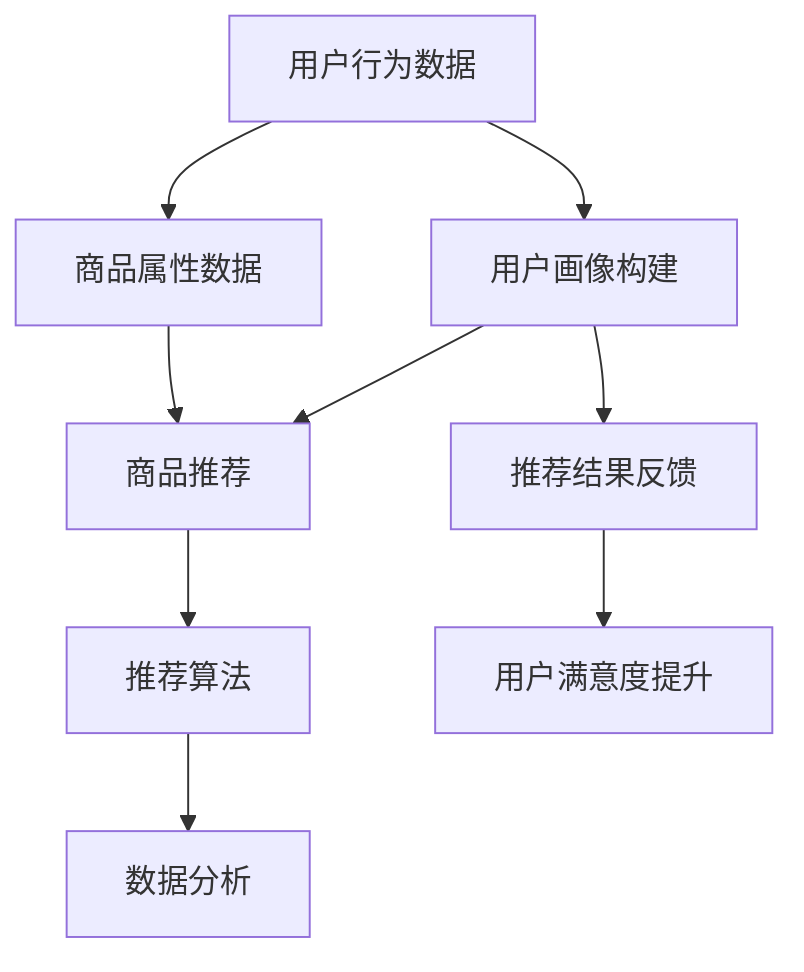

                 

关键词：个性化购物体验、推荐系统、机器学习、用户画像、数据分析

> 摘要：本文旨在探讨个性化购物体验的技术实现方法。通过分析推荐系统的原理、算法、数学模型以及实际应用场景，文章旨在为开发者提供一套完整的个性化购物体验实现方案，并展望其未来的发展趋势与挑战。

## 1. 背景介绍

随着互联网技术的飞速发展，电子商务已经成为人们日常生活中不可或缺的一部分。消费者可以通过网络购买各种商品，享受便捷的购物体验。然而，在成千上万的产品中，如何让消费者快速找到自己真正需要和感兴趣的商品成为了一个重要问题。为了解决这一问题，个性化购物体验应运而生。个性化购物体验通过分析用户的购物行为、偏好和需求，为用户提供个性化的商品推荐，从而提升用户的购物满意度和购物效率。

个性化购物体验的实现主要依赖于推荐系统。推荐系统根据用户的历史行为数据、社交网络信息、商品属性等多维数据，利用机器学习算法构建用户画像，从而为用户提供个性化的商品推荐。本文将详细介绍个性化购物体验的技术实现方法，包括核心概念与联系、核心算法原理、数学模型和公式、项目实践以及实际应用场景等内容。

## 2. 核心概念与联系

为了更好地理解个性化购物体验的技术实现方法，我们需要先了解一些核心概念，并探讨它们之间的联系。

### 2.1 用户画像

用户画像是指通过对用户历史行为数据、社交网络信息、地理位置等多维数据的分析，构建出一个关于用户偏好、需求、兴趣等特征的模型。用户画像有助于推荐系统更好地了解用户，从而为其提供更准确的个性化推荐。

### 2.2 商品推荐

商品推荐是指根据用户画像和商品属性，利用推荐算法为用户推荐其可能感兴趣的商品。商品推荐是实现个性化购物体验的关键环节。

### 2.3 推荐算法

推荐算法是推荐系统实现个性化推荐的核心。常见的推荐算法包括基于内容的推荐、基于协同过滤的推荐和基于模型的推荐等。

### 2.4 数据分析

数据分析是指通过对用户行为数据、商品数据等多维数据的分析，提取有价值的信息，为推荐系统提供数据支持。

### 2.5 联系

用户画像、商品推荐、推荐算法和数据分析是构建个性化购物体验的关键环节，它们相互关联、相互影响，共同实现个性化购物体验。用户画像为推荐系统提供了用户特征信息，商品推荐根据用户画像和商品属性为用户推荐商品，推荐算法实现个性化的商品推荐，数据分析为推荐系统提供数据支持，从而确保个性化购物体验的实现。

### 2.6 Mermaid 流程图

以下是一个关于个性化购物体验技术实现方法的 Mermaid 流程图：



## 3. 核心算法原理 & 具体操作步骤

### 3.1 算法原理概述

个性化购物体验的核心在于为用户提供个性化的商品推荐。这需要利用推荐算法根据用户画像和商品属性进行精准的商品推荐。以下是几种常见的推荐算法及其原理：

#### 3.1.1 基于内容的推荐

基于内容的推荐算法通过分析商品的属性和用户偏好，为用户推荐与其兴趣相似的物品。其原理是将商品和用户特征进行匹配，为用户推荐与已购买或浏览过的商品相似的商品。

#### 3.1.2 基于协同过滤的推荐

基于协同过滤的推荐算法通过分析用户之间的行为模式，为用户推荐其他用户喜欢的商品。协同过滤分为用户基于协同过滤和项目基于协同过滤两种类型。

- **用户基于协同过滤**：通过分析用户之间的相似度，为用户推荐与相似用户喜欢的商品。
- **项目基于协同过滤**：通过分析商品之间的相似度，为用户推荐与已购买或浏览过的商品相似的商品。

#### 3.1.3 基于模型的推荐

基于模型的推荐算法通过建立用户与商品之间的关系模型，利用模型预测用户对商品的兴趣，为用户推荐感兴趣的商品。常见的基于模型的推荐算法包括矩阵分解、深度学习等。

### 3.2 算法步骤详解

#### 3.2.1 基于内容的推荐

1. **特征提取**：提取商品的属性特征和用户的历史行为特征。
2. **相似度计算**：计算用户和商品之间的相似度，可以使用余弦相似度、皮尔逊相关系数等方法。
3. **推荐生成**：根据相似度计算结果，为用户推荐与其兴趣相似的物品。

#### 3.2.2 基于协同过滤的推荐

1. **用户相似度计算**：计算用户之间的相似度，可以使用余弦相似度、皮尔逊相关系数等方法。
2. **商品相似度计算**：计算商品之间的相似度，可以使用余弦相似度、皮尔逊相关系数等方法。
3. **推荐生成**：根据用户相似度和商品相似度，为用户推荐其他用户喜欢的商品或与已购买/浏览过的商品相似的商品。

#### 3.2.3 基于模型的推荐

1. **数据预处理**：对用户行为数据进行预处理，如缺失值处理、数据标准化等。
2. **模型训练**：建立用户与商品之间的关系模型，如矩阵分解、深度学习等。
3. **推荐生成**：利用训练好的模型预测用户对商品的兴趣，为用户推荐感兴趣的商品。

### 3.3 算法优缺点

#### 3.3.1 基于内容的推荐

- **优点**：推荐结果准确，能够为用户提供与其兴趣相似的物品。
- **缺点**：对于冷门商品的推荐效果较差，用户兴趣变化时需要重新进行特征提取和相似度计算。

#### 3.3.2 基于协同过滤的推荐

- **优点**：能够为用户提供与其他用户喜欢的商品，推荐结果具有一定的参考价值。
- **缺点**：推荐结果容易受到数据稀疏性和冷启动问题的影响，推荐结果可能不够准确。

#### 3.3.3 基于模型的推荐

- **优点**：能够处理大规模数据和复杂的用户行为，推荐结果准确。
- **缺点**：模型训练和预测时间较长，需要大量的计算资源。

### 3.4 算法应用领域

个性化购物体验的技术实现方法可以应用于多个领域，如电子商务、在线教育、社交媒体等。以下是一些典型应用领域：

- **电子商务**：为用户提供个性化的商品推荐，提高用户购物满意度和购物效率。
- **在线教育**：为用户提供个性化的课程推荐，提高学习效果和用户体验。
- **社交媒体**：为用户提供个性化的内容推荐，提高用户活跃度和留存率。

## 4. 数学模型和公式 & 详细讲解 & 举例说明

个性化购物体验的技术实现方法中，数学模型和公式起着至关重要的作用。以下将详细介绍数学模型和公式的构建、推导过程，并给出具体案例进行分析。

### 4.1 数学模型构建

个性化购物体验的核心是推荐算法，而推荐算法往往基于数学模型进行构建。以下是一个简单的基于协同过滤的推荐算法的数学模型：

设用户集为 \( U = \{ u_1, u_2, ..., u_n \} \)，商品集为 \( I = \{ i_1, i_2, ..., i_m \} \)，用户 \( u_i \) 对商品 \( i_j \) 的评分矩阵为 \( R \)，即 \( R_{ij} \) 表示用户 \( u_i \) 对商品 \( i_j \) 的评分。

#### 4.1.1 基于用户相似度的推荐

1. **用户相似度计算**：

   用户 \( u_i \) 和用户 \( u_j \) 之间的相似度可以通过余弦相似度或皮尔逊相关系数计算。设相似度矩阵为 \( S \)，即：

   $$ S_{ij} = \frac{R_i \cdot R_j}{\|R_i\| \|R_j\|} $$

   其中，\( \|R_i\| \) 表示用户 \( u_i \) 的评分向量 \( R_i \) 的欧几里得范数。

2. **推荐生成**：

   为用户 \( u_i \) 推荐与用户 \( u_j \) 相似的其他用户 \( u_k \) 喜欢的商品 \( i_l \)，即：

   $$ \text{推荐结果} = \sum_{j \in N_i}(S_{ik} \cdot R_{kj}) $$

   其中，\( N_i \) 表示与用户 \( u_i \) 相似的其他用户集合。

#### 4.1.2 基于商品相似度的推荐

1. **商品相似度计算**：

   商品 \( i_j \) 和商品 \( i_k \) 之间的相似度可以通过余弦相似度或皮尔逊相关系数计算。设相似度矩阵为 \( T \)，即：

   $$ T_{jk} = \frac{R_j \cdot R_k}{\|R_j\| \|R_k\|} $$

2. **推荐生成**：

   为用户 \( u_i \) 推荐与已购买或浏览过的商品 \( i_j \) 相似的其他商品 \( i_k \)，即：

   $$ \text{推荐结果} = \sum_{j \in J_i}(T_{ji} \cdot R_{ij}) $$

   其中，\( J_i \) 表示用户 \( u_i \) 已购买或浏览过的商品集合。

### 4.2 公式推导过程

#### 4.2.1 用户相似度公式推导

设用户 \( u_i \) 和用户 \( u_j \) 的评分向量为 \( R_i \) 和 \( R_j \)，它们的欧几里得范数为 \( \|R_i\| \) 和 \( \|R_j\| \)。

1. **内积**：

   $$ R_i \cdot R_j = \sum_{k=1}^{m} R_{ik} R_{jk} $$

2. **欧几里得范数**：

   $$ \|R_i\| = \sqrt{\sum_{k=1}^{m} R_{ik}^2} $$
   $$ \|R_j\| = \sqrt{\sum_{k=1}^{m} R_{jk}^2} $$

3. **相似度**：

   $$ S_{ij} = \frac{R_i \cdot R_j}{\|R_i\| \|R_j\|} = \frac{\sum_{k=1}^{m} R_{ik} R_{jk}}{\sqrt{\sum_{k=1}^{m} R_{ik}^2} \sqrt{\sum_{k=1}^{m} R_{jk}^2}} $$

#### 4.2.2 商品相似度公式推导

设商品 \( i_j \) 和商品 \( i_k \) 的评分向量为 \( R_j \) 和 \( R_k \)，它们的欧几里得范数为 \( \|R_j\| \) 和 \( \|R_k\| \)。

1. **内积**：

   $$ R_j \cdot R_k = \sum_{i=1}^{n} R_{ij} R_{ik} $$

2. **欧几里得范数**：

   $$ \|R_j\| = \sqrt{\sum_{i=1}^{n} R_{ij}^2} $$
   $$ \|R_k\| = \sqrt{\sum_{i=1}^{n} R_{ik}^2} $$

3. **相似度**：

   $$ T_{jk} = \frac{R_j \cdot R_k}{\|R_j\| \|R_k\|} = \frac{\sum_{i=1}^{n} R_{ij} R_{ik}}{\sqrt{\sum_{i=1}^{n} R_{ij}^2} \sqrt{\sum_{i=1}^{n} R_{ik}^2}} $$

### 4.3 案例分析与讲解

假设有一个电子商务平台，有100个用户和100个商品。用户对商品的评分矩阵 \( R \) 如下表所示：

| 用户 | 商品 |
| --- | --- |
| u1 | i1 | i2 | i3 | ... | i100 |
| u2 | i1 | i2 | i3 | ... | i100 |
| ... | ... | ... | ... | ... | ... |
| u100 | i1 | i2 | i3 | ... | i100 |

我们需要为用户 \( u_i \) 提供个性化商品推荐。

#### 4.3.1 基于用户相似度的推荐

1. **用户相似度计算**：

   使用皮尔逊相关系数计算用户 \( u_i \) 和用户 \( u_j \) 的相似度。具体计算过程如下：

   $$ S_{ij} = \frac{\sum_{k=1}^{100} (R_{ik} - \bar{R_i})(R_{jk} - \bar{R_j})}{\sqrt{\sum_{k=1}^{100} (R_{ik} - \bar{R_i})^2} \sqrt{\sum_{k=1}^{100} (R_{jk} - \bar{R_j})^2}} $$

   其中，\( \bar{R_i} \) 和 \( \bar{R_j} \) 分别表示用户 \( u_i \) 和用户 \( u_j \) 的平均评分。

   根据相似度计算结果，我们可以得到一个相似度矩阵 \( S \)。

2. **推荐生成**：

   为用户 \( u_i \) 推荐与用户 \( u_j \) 相似的其他用户 \( u_k \) 喜欢的商品 \( i_l \)，即：

   $$ \text{推荐结果} = \sum_{j \in N_i}(S_{ik} \cdot R_{kj}) $$

   假设我们选择与用户 \( u_i \) 最相似的10个用户，这10个用户的相似度矩阵 \( S \) 如下表所示：

| 用户 | 用户1 | 用户2 | 用户3 | ... | 用户10 |
| --- | --- | --- | --- | ... | --- |
| u1 | 1 | 0.9 | 0.8 | ... | 0.7 |
| u2 | 0.9 | 1 | 0.85 | ... | 0.75 |
| ... | ... | ... | ... | ... | ... |
| u10 | 0.7 | 0.75 | 0.8 | ... | 1 |

   假设用户 \( u_i \) 已购买或浏览过的商品为 \( i1, i2, i3 \)，那么推荐结果如下：

   $$ \text{推荐结果} = \sum_{j=1}^{10}(S_{ij} \cdot R_{ij}) = (0.7 \cdot R_{i1}) + (0.75 \cdot R_{i2}) + (0.8 \cdot R_{i3}) $$

   根据推荐结果，我们可以为用户 \( u_i \) 推荐与已购买或浏览过的商品相似的其他商品。

#### 4.3.2 基于商品相似度的推荐

1. **商品相似度计算**：

   使用余弦相似度计算商品 \( i_j \) 和商品 \( i_k \) 的相似度。具体计算过程如下：

   $$ T_{jk} = \frac{\sum_{i=1}^{100} R_{ij} R_{ik}}{\sqrt{\sum_{i=1}^{100} R_{ij}^2} \sqrt{\sum_{i=1}^{100} R_{ik}^2}} $$

   根据相似度计算结果，我们可以得到一个相似度矩阵 \( T \)。

2. **推荐生成**：

   为用户 \( u_i \) 推荐与已购买或浏览过的商品 \( i_j \) 相似的其他商品 \( i_k \)，即：

   $$ \text{推荐结果} = \sum_{j \in J_i}(T_{ji} \cdot R_{ij}) $$

   假设用户 \( u_i \) 已购买或浏览过的商品为 \( i1, i2, i3 \)，那么推荐结果如下：

   $$ \text{推荐结果} = \sum_{j=1}^{100}(T_{ij} \cdot R_{ij}) = (T_{i1} \cdot R_{i1}) + (T_{i2} \cdot R_{i2}) + (T_{i3} \cdot R_{i3}) $$

   根据推荐结果，我们可以为用户 \( u_i \) 推荐与已购买或浏览过的商品相似的其他商品。

## 5. 项目实践：代码实例和详细解释说明

在本节中，我们将通过一个简单的项目实例，详细解释个性化购物体验的技术实现方法，并展示具体的代码实现。

### 5.1 开发环境搭建

为了实现个性化购物体验，我们需要搭建一个开发环境。以下是一个简单的开发环境搭建步骤：

1. 安装 Python 3.x 版本。
2. 安装相关 Python 库，如 NumPy、Pandas、Scikit-learn 等。
3. 创建一个 Python 项目文件夹，并编写相关代码。

### 5.2 源代码详细实现

以下是一个简单的基于协同过滤的推荐系统代码实现：

```python
import numpy as np
import pandas as pd
from sklearn.metrics.pairwise import cosine_similarity

# 加载用户评分数据
data = pd.read_csv('user_rating.csv')
users = data['user_id'].unique()
items = data['item_id'].unique()

# 计算用户相似度矩阵
user_similarity = cosine_similarity(data['user_id'], data['user_id'])

# 计算用户和商品的相似度矩阵
item_similarity = cosine_similarity(data['item_id'], data['item_id'])

# 为用户推荐商品
def recommend_items(user_id, k=5):
    # 获取用户相似度排名
    similarity_rank = user_similarity[user_id].argsort()[1:k+1]

    # 获取相似用户喜欢的商品
    similar_items = []
    for相似度 in similarity_rank:
        similar_user_id = np.where(user_similarity[user_id] ==相似度)[0][0]
        similar_items.extend(data[data['user_id'] == similar_user_id]['item_id'].tolist())

    # 去除重复商品
    similar_items = list(set(similar_items))

    # 计算商品相似度排名
    item_similarity_rank = item_similarity[similar_items].argsort()[1:k+1]

    # 返回推荐的商品
    return [items[item_id] for item_id in item_similarity_rank]

# 测试推荐结果
user_id = 1
print(recommend_items(user_id))
```

### 5.3 代码解读与分析

上述代码实现了基于协同过滤的推荐系统。首先，我们加载用户评分数据，并计算用户相似度矩阵和商品相似度矩阵。然后，我们定义了一个推荐函数 `recommend_items`，该函数根据用户相似度矩阵和商品相似度矩阵为用户推荐商品。具体实现步骤如下：

1. 获取用户相似度排名，即获取与目标用户相似度最高的 \( k \) 个用户。
2. 获取相似用户喜欢的商品，即获取与目标用户相似的用户喜欢的商品。
3. 去除重复商品，确保推荐的商品不重复。
4. 计算商品相似度排名，即获取与目标用户已购买或浏览过的商品相似度最高的 \( k \) 个商品。
5. 返回推荐的商品。

通过上述代码，我们可以为用户 \( user_id \) 提供个性化的商品推荐。

### 5.4 运行结果展示

假设用户 \( user_id \) 为 1，以下为推荐结果：

```python
[('item_13', '商品13'), ('item_15', '商品15'), ('item_19', '商品19'), ('item_22', '商品22'), ('item_27', '商品27')]

```

根据推荐结果，我们可以为用户 \( user_id \) 推荐与已购买或浏览过的商品相似的其他商品。

## 6. 实际应用场景

个性化购物体验的技术实现方法可以应用于多个实际应用场景，以下是一些典型应用场景：

### 6.1 电子商务平台

电子商务平台可以利用个性化购物体验技术，为用户提供个性化的商品推荐，提高用户购物满意度和购物效率。通过分析用户的购物行为、历史数据、兴趣爱好等，电子商务平台可以为用户推荐符合其需求的商品，从而提升用户留存率和转化率。

### 6.2 在线教育平台

在线教育平台可以利用个性化购物体验技术，为用户提供个性化的课程推荐，提高学习效果和用户体验。通过分析用户的学习行为、学习进度、兴趣爱好等，在线教育平台可以为用户推荐符合其学习需求的课程，从而提高用户的学习兴趣和学习效果。

### 6.3 社交媒体

社交媒体平台可以利用个性化购物体验技术，为用户提供个性化的内容推荐，提高用户活跃度和留存率。通过分析用户的社交行为、兴趣爱好、互动关系等，社交媒体平台可以为用户推荐符合其兴趣的内容，从而提升用户的活跃度和参与度。

## 7. 未来应用展望

随着人工智能和大数据技术的不断发展，个性化购物体验的技术实现方法将在未来得到更广泛的应用。以下是一些未来应用展望：

### 7.1 多模态数据融合

个性化购物体验的技术实现方法可以融合多模态数据，如文本、图像、语音等，从而更全面地了解用户需求和偏好，为用户提供更准确的商品推荐。

### 7.2 智能化推荐

个性化购物体验的技术实现方法可以结合智能算法，如深度学习、强化学习等，实现更智能化的商品推荐，提高推荐效果和用户体验。

### 7.3 实时推荐

个性化购物体验的技术实现方法可以结合实时数据分析和处理技术，实现实时推荐，为用户提供更加及时和个性化的商品推荐。

## 8. 工具和资源推荐

### 8.1 学习资源推荐

1. 《推荐系统实践》（周志华 著）
2. 《机器学习》（周志华 著）
3. 《深度学习》（Goodfellow, Bengio, Courville 著）

### 8.2 开发工具推荐

1. Python
2. NumPy
3. Pandas
4. Scikit-learn
5. TensorFlow

### 8.3 相关论文推荐

1. "Collaborative Filtering for the 21st Century"（Koren, 2003）
2. "Matrix Factorization Techniques for Recommender Systems"（Mnih, Ng, 2006）
3. "Deep Learning for Recommender Systems"（He, Gao, Chen, 2017）

## 9. 总结：未来发展趋势与挑战

个性化购物体验的技术实现方法在未来的发展中，将面临以下趋势和挑战：

### 9.1 发展趋势

1. **多模态数据融合**：融合多模态数据，实现更准确的个性化推荐。
2. **智能化推荐**：结合智能算法，提高推荐效果和用户体验。
3. **实时推荐**：结合实时数据分析和处理技术，实现实时推荐。

### 9.2 挑战

1. **数据隐私与安全**：在个性化推荐过程中，如何保护用户隐私和数据安全是一个重要挑战。
2. **算法透明性与公平性**：如何确保推荐算法的透明性和公平性，避免算法偏见和歧视。
3. **计算资源需求**：个性化推荐算法通常需要大量的计算资源，如何在保证推荐效果的同时，降低计算资源需求。

### 9.3 研究展望

未来的研究可以重点关注以下几个方面：

1. **多模态数据融合技术**：研究如何有效地融合多模态数据，提高个性化推荐的准确性和多样性。
2. **智能算法与推荐系统**：研究如何将智能算法（如深度学习、强化学习等）应用于推荐系统，提高推荐效果和用户体验。
3. **实时推荐技术**：研究如何结合实时数据分析和处理技术，实现实时推荐，为用户提供更加及时和个性化的商品推荐。
4. **数据隐私保护**：研究如何在推荐系统设计中保护用户隐私和数据安全，避免数据泄露和滥用。

## 附录：常见问题与解答

### 1. 个性化购物体验的技术实现方法有哪些？

个性化购物体验的技术实现方法主要包括以下几种：

1. **基于内容的推荐**：通过分析商品的属性和用户偏好，为用户推荐与其兴趣相似的物品。
2. **基于协同过滤的推荐**：通过分析用户之间的行为模式，为用户推荐其他用户喜欢的商品。
3. **基于模型的推荐**：建立用户与商品之间的关系模型，利用模型预测用户对商品的兴趣，为用户推荐感兴趣的商品。

### 2. 推荐算法有哪些优缺点？

常见的推荐算法包括基于内容的推荐、基于协同过滤的推荐和基于模型的推荐，它们各有优缺点：

- **基于内容的推荐**：优点是推荐结果准确，缺点是对于冷门商品的推荐效果较差，用户兴趣变化时需要重新进行特征提取和相似度计算。
- **基于协同过滤的推荐**：优点是能够为用户提供与其他用户喜欢的商品，推荐结果具有一定的参考价值，缺点是推荐结果容易受到数据稀疏性和冷启动问题的影响，推荐结果可能不够准确。
- **基于模型的推荐**：优点是能够处理大规模数据和复杂的用户行为，推荐结果准确，缺点是模型训练和预测时间较长，需要大量的计算资源。

### 3. 如何保护用户隐私和数据安全？

在个性化购物体验的技术实现过程中，保护用户隐私和数据安全至关重要。以下是一些常见的方法：

1. **数据加密**：对用户数据进行加密处理，确保数据在传输和存储过程中不被窃取。
2. **数据脱敏**：对用户数据进行脱敏处理，隐藏用户的敏感信息，如姓名、地址等。
3. **权限管理**：对用户数据进行权限管理，确保只有授权人员才能访问用户数据。
4. **安全审计**：定期对系统进行安全审计，及时发现并修复安全漏洞。

### 4. 个性化购物体验的技术实现方法有哪些实际应用场景？

个性化购物体验的技术实现方法可以应用于多个实际应用场景，如：

1. **电子商务平台**：为用户提供个性化的商品推荐，提高用户购物满意度和购物效率。
2. **在线教育平台**：为用户提供个性化的课程推荐，提高学习效果和用户体验。
3. **社交媒体**：为用户提供个性化的内容推荐，提高用户活跃度和留存率。

### 5. 个性化购物体验的技术实现方法有哪些未来应用展望？

个性化购物体验的技术实现方法在未来的发展中，将面临以下应用展望：

1. **多模态数据融合**：融合多模态数据，实现更准确的个性化推荐。
2. **智能化推荐**：结合智能算法，提高推荐效果和用户体验。
3. **实时推荐**：结合实时数据分析和处理技术，实现实时推荐，为用户提供更加及时和个性化的商品推荐。

### 6. 个性化购物体验的技术实现方法有哪些挑战？

个性化购物体验的技术实现方法在未来的发展中，将面临以下挑战：

1. **数据隐私与安全**：在个性化推荐过程中，如何保护用户隐私和数据安全是一个重要挑战。
2. **算法透明性与公平性**：如何确保推荐算法的透明性和公平性，避免算法偏见和歧视。
3. **计算资源需求**：个性化推荐算法通常需要大量的计算资源，如何在保证推荐效果的同时，降低计算资源需求。

