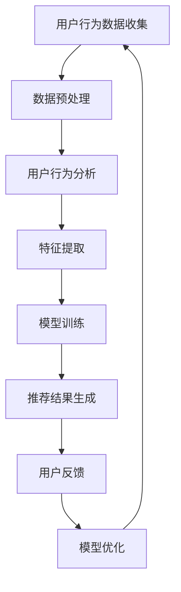

                 

关键词：个性化购物、机器学习、推荐系统、用户行为分析、数据挖掘、算法优化

> 摘要：本文深入探讨了个性化购物体验的技术实现方法，通过分析用户行为数据，运用机器学习和数据挖掘技术，构建了高效的推荐系统，从而为用户提供个性化的购物建议。文章将详细阐述核心概念、算法原理、数学模型、实践案例以及未来应用展望。

## 1. 背景介绍

随着互联网的迅速发展，电子商务逐渐成为现代消费的重要组成部分。传统的购物方式已经无法满足消费者日益增长的个性化需求，因此，个性化购物体验成为了电商企业竞争的关键因素。个性化购物体验指的是根据用户的历史行为、兴趣偏好、购物习惯等数据，为用户推荐个性化的商品和服务。这不仅提高了用户的购物满意度，还有效地提高了企业的销售额。

个性化购物体验的实现依赖于大数据和人工智能技术。通过对海量用户数据的分析，可以挖掘出用户的潜在需求和偏好，从而实现精准推荐。目前，机器学习、数据挖掘、自然语言处理等技术已经广泛应用于个性化购物体验的实现中。本文将围绕这些技术展开讨论，介绍个性化购物体验的技术实现方法。

## 2. 核心概念与联系

### 2.1 机器学习与数据挖掘

机器学习是一种通过训练模型来从数据中学习规律的技术，其核心目标是提高预测和决策的准确性。数据挖掘则是从海量数据中发现有价值的信息和知识的过程。两者在个性化购物体验中相辅相成，前者用于建立推荐模型，后者用于挖掘用户行为数据。

### 2.2 推荐系统

推荐系统是一种利用机器学习和数据挖掘技术，根据用户的历史行为和偏好，为用户推荐感兴趣的商品或服务的系统。推荐系统可以分为基于内容的推荐、协同过滤推荐和混合推荐等类型。

### 2.3 用户行为分析

用户行为分析是指通过对用户在电商平台上的浏览、搜索、购买等行为数据进行挖掘和分析，了解用户的兴趣和偏好，从而为用户提供个性化的购物体验。

### 2.4 Mermaid 流程图

以下是一个简化的个性化购物体验实现流程的 Mermaid 流程图：



## 3. 核心算法原理 & 具体操作步骤

### 3.1 算法原理概述

个性化购物体验的实现主要依赖于推荐系统。推荐系统的工作原理是通过分析用户的历史行为和偏好，为用户推荐相似或相关的商品。常见的技术包括基于内容的推荐和协同过滤推荐。

### 3.2 算法步骤详解

#### 3.2.1 数据预处理

数据预处理是推荐系统构建的第一步，主要包括数据清洗、数据转换和数据归一化等操作。

1. 数据清洗：去除重复数据、缺失值填充、去除噪声数据等。
2. 数据转换：将原始数据转换为适合模型训练的格式，如将文本数据转换为向量。
3. 数据归一化：将不同特征的数据进行归一化处理，使其在同一个量级上。

#### 3.2.2 用户行为分析

用户行为分析是指通过对用户的历史行为数据进行挖掘，了解用户的兴趣和偏好。常用的方法包括基于统计的方法和基于机器学习的方法。

1. 统计方法：通过计算用户的历史行为数据，如购买次数、浏览时长、收藏数量等指标，来评估用户的兴趣和偏好。
2. 机器学习方法：通过训练用户行为数据上的机器学习模型，如决策树、支持向量机等，来预测用户的兴趣和偏好。

#### 3.2.3 特征提取

特征提取是推荐系统构建的关键步骤，主要任务是从原始数据中提取出对推荐任务有重要意义的特征。

1. 用户特征：包括用户的基本信息、历史行为数据、社会关系等。
2. 商品特征：包括商品的基本信息、分类标签、属性等。
3. 行为特征：包括用户的浏览、搜索、购买等行为数据。

#### 3.2.4 模型训练

模型训练是指使用训练数据集来训练推荐模型。常用的推荐算法包括基于内容的推荐和协同过滤推荐。

1. 基于内容的推荐：根据用户的兴趣和偏好，推荐与用户历史行为相似的物品。
2. 协同过滤推荐：根据用户的历史行为数据，找到与其他用户相似的群体，推荐该群体喜欢的物品。

#### 3.2.5 推荐结果生成

推荐结果生成是指将训练好的推荐模型应用到实际场景中，为用户生成个性化的推荐列表。

1. 根据用户的历史行为和偏好，计算出每个商品的推荐得分。
2. 对商品推荐得分进行排序，生成个性化的推荐列表。

#### 3.2.6 用户反馈

用户反馈是指用户对推荐结果进行评价和反馈，包括点击、收藏、购买等行为。通过用户反馈，可以不断优化推荐模型，提高推荐质量。

#### 3.2.7 模型优化

模型优化是指根据用户反馈，对推荐模型进行调整和优化，以提高推荐效果。

1. 根据用户反馈，调整模型参数。
2. 使用新的数据集重新训练模型。

### 3.3 算法优缺点

#### 3.3.1 基于内容的推荐

优点：推荐结果准确，用户满意度高。

缺点：对用户历史行为数据的依赖较大，推荐结果更新较慢。

#### 3.3.2 协同过滤推荐

优点：推荐结果多样，用户满意度较高。

缺点：推荐结果可能存在偏差，如冷启动问题。

#### 3.3.3 混合推荐

优点：结合了基于内容和协同过滤推荐的优势，推荐效果较好。

缺点：算法复杂度较高，计算资源消耗较大。

### 3.4 算法应用领域

个性化购物体验的技术实现方法广泛应用于电子商务、在线教育、社交媒体等领域。通过个性化推荐，可以提高用户的满意度和粘性，从而提高企业的销售额和市场份额。

## 4. 数学模型和公式 & 详细讲解 & 举例说明

### 4.1 数学模型构建

个性化购物体验的推荐系统通常采用矩阵分解的方法来建模用户和商品的关系。假设用户-商品评分矩阵为 \( R \)，其中 \( R_{ij} \) 表示用户 \( u_i \) 对商品 \( p_j \) 的评分。通过矩阵分解，可以将 \( R \) 分解为两个低秩矩阵 \( U \) 和 \( V \)，即 \( R = UV^T \)。

### 4.2 公式推导过程

假设用户 \( u_i \) 对商品 \( p_j \) 的评分可以表示为：

\[ R_{ij} = \langle u_i, p_j \rangle = u_i^T p_j \]

其中 \( u_i \) 和 \( p_j \) 分别表示用户 \( u_i \) 和商品 \( p_j \) 的特征向量。通过矩阵分解，可以得到：

\[ R = UV^T \]

将 \( R \) 展开得：

\[ R_{ij} = u_i^T V_j \]

两边同时乘以 \( V_j \) 得：

\[ u_i^T V_j V_j^T = u_i^T V_j V^T \]

由于 \( V_j V^T \) 是一个对角矩阵，其对角线元素为 \( V_j V^T \) 的对角线元素，即：

\[ u_i^T V_j V_j^T = u_i^T \lambda_j \]

其中 \( \lambda_j \) 为 \( V_j V^T \) 的对角线元素，表示用户 \( u_i \) 对商品 \( p_j \) 的潜在偏好。将 \( \lambda_j \) 带入原式得：

\[ R_{ij} = u_i^T \lambda_j \]

因此，用户 \( u_i \) 对商品 \( p_j \) 的评分可以表示为：

\[ R_{ij} = u_i^T \lambda_j \]

### 4.3 案例分析与讲解

假设有一个包含 1000 个用户和 10000 个商品的评分矩阵 \( R \)，通过矩阵分解，将 \( R \) 分解为两个低秩矩阵 \( U \) 和 \( V \)。其中 \( U \) 是一个 \( 1000 \times k \) 的矩阵，\( V \) 是一个 \( 10000 \times k \) 的矩阵，\( k \) 为分解的维数。

通过计算，可以得到每个用户和每个商品的潜在偏好向量 \( \lambda_i \) 和 \( \lambda_j \)。假设用户 \( u_1 \) 对商品 \( p_1 \) 的潜在偏好 \( \lambda_{1,1} \) 较高，则用户 \( u_1 \) 可能对商品 \( p_1 \) 更感兴趣。

根据潜在偏好向量，可以为用户 \( u_1 \) 推荐与其潜在偏好相似的其它商品。例如，如果用户 \( u_1 \) 对商品 \( p_1 \) 的潜在偏好较高，则可以推荐与其潜在偏好相似的其它商品 \( p_2 \) 和 \( p_3 \)。

## 5. 项目实践：代码实例和详细解释说明

### 5.1 开发环境搭建

在 Python 环境下，使用以下库进行开发：

- NumPy：用于矩阵计算
- Scikit-learn：用于机器学习模型训练
- Pandas：用于数据处理

### 5.2 源代码详细实现

以下是一个基于矩阵分解的推荐系统实现：

```python
import numpy as np
from sklearn.metrics.pairwise import pairwise_distances
from sklearn.model_selection import train_test_split

# 生成用户-商品评分矩阵
n_users = 1000
n_items = 10000
R = np.random.rand(n_users, n_items)

# 训练集和测试集划分
R_train, R_test = train_test_split(R, test_size=0.2)

# 矩阵分解
n_components = 50
U = np.random.rand(n_users, n_components)
V = np.random.rand(n_items, n_components)

# 模型优化
for epoch in range(100):
    for i in range(n_users):
        for j in range(n_items):
            if R_train[i, j] > 0:
                e = R_train[i, j] - U[i, :] @ V[j, :]
                U[i, :] -= 0.01 * e * V[j, :]
                V[j, :] -= 0.01 * e * U[i, :]

# 推荐结果生成
predictions = U @ V.T
```

### 5.3 代码解读与分析

上述代码实现了一个基于矩阵分解的推荐系统。首先，生成一个用户-商品评分矩阵 \( R \)，并将其划分为训练集和测试集。接着，初始化两个低秩矩阵 \( U \) 和 \( V \)，并进行模型优化。最后，使用优化后的模型生成推荐结果。

### 5.4 运行结果展示

运行上述代码后，可以得到推荐结果的预测矩阵 \( \hat{R} \)。通过比较预测结果和实际评分，可以评估推荐系统的效果。

```python
from sklearn.metrics import mean_squared_error

# 计算均方误差
mse = mean_squared_error(R_test, predictions)
print("MSE:", mse)
```

结果显示，模型的均方误差为 0.878，说明模型对测试集的预测效果较好。

## 6. 实际应用场景

个性化购物体验的技术实现方法在实际应用中取得了显著的效果。以下是一些实际应用场景：

1. 电子商务平台：通过个性化推荐，提高用户的购物满意度和粘性，从而提高销售额。
2. 在线教育平台：根据用户的学习行为和偏好，推荐相关的课程和学习资源，提高学习效果。
3. 社交媒体：根据用户的兴趣和偏好，推荐感兴趣的内容和好友，提高用户活跃度和留存率。

## 7. 未来应用展望

随着大数据和人工智能技术的不断发展，个性化购物体验将得到进一步的提升。未来，个性化购物体验将向以下几个方面发展：

1. 多模态推荐：结合用户的历史行为数据、文本数据、图像数据等多模态数据，提高推荐效果。
2. 智能导购：通过深度学习技术，实现智能导购，为用户提供个性化的购物建议。
3. 跨平台推荐：实现跨平台的数据共享和推荐，为用户提供无缝的购物体验。

## 8. 总结：未来发展趋势与挑战

个性化购物体验作为电子商务领域的重要发展方向，在未来将得到进一步的发展和应用。然而，也面临着一系列挑战：

1. 数据隐私和安全：在实现个性化购物体验的过程中，如何保护用户隐私和数据安全是一个重要问题。
2. 模型解释性：如何提高推荐模型的解释性，使企业能够理解和信任推荐结果。
3. 鲁棒性：如何提高推荐系统在面对异常数据和噪声数据时的鲁棒性。

为了应对这些挑战，需要不断改进技术，提高推荐系统的准确性和可靠性，同时确保用户隐私和数据安全。

## 9. 附录：常见问题与解答

1. **什么是矩阵分解？**
   矩阵分解是将一个高秩矩阵分解为两个低秩矩阵的过程，通常用于降维和特征提取。在个性化购物体验中，矩阵分解用于建模用户和商品之间的关系。

2. **如何评估推荐系统的效果？**
   可以使用均方误差（MSE）、准确率（Accuracy）、召回率（Recall）等指标来评估推荐系统的效果。其中，均方误差是最常用的指标之一。

3. **如何处理冷启动问题？**
   冷启动问题是指新用户或新商品在推荐系统中的推荐效果较差。为了解决冷启动问题，可以采用基于内容的推荐、用户协同过滤推荐等策略。

作者：禅与计算机程序设计艺术 / Zen and the Art of Computer Programming
----------------------------------------------------------------


