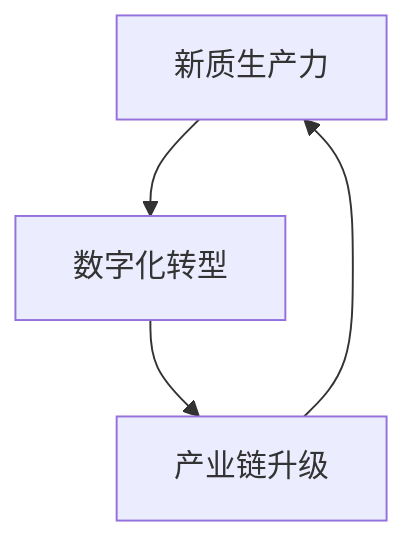

                 

关键词：中国现代化、新质生产力、技术创新、数字化转型、可持续发展、产业链升级

> 摘要：随着全球科技革命的深入推进，中国现代化进程进入了一个新阶段。新质生产力作为推动经济高质量发展的重要引擎，正日益成为我国经济结构优化和转型升级的关键力量。本文从新质生产力的内涵、发展现状、核心算法原理、数学模型、项目实践以及未来展望等方面，深入探讨了中国现代化进程中的新质生产力发展，为我国经济持续健康发展提供新思路和新路径。

## 1. 背景介绍

21世纪以来，全球科技革命和产业变革正在深入推进，数字技术、人工智能、生物技术等新兴技术加速发展，为世界各国带来了前所未有的发展机遇和挑战。在此背景下，中国现代化进程也进入了一个关键时期。新质生产力作为一种具有高附加值、高创新能力的新型生产力，成为推动中国经济高质量发展的关键因素。

### 中国现代化进程

中国现代化进程始于改革开放以来，经过40多年的快速发展，我国经济总量已跃居世界第二。然而，在取得巨大经济成就的同时，也面临着诸多深层次矛盾和问题，如产业结构不够优化、创新能力不足、环境污染严重等。为了破解这些问题，中国提出了创新驱动发展战略，强调以科技创新为核心，推动经济结构优化和转型升级。

### 新质生产力的概念与内涵

新质生产力是指在新技术、新产业、新业态、新模式等新型经济发展模式下产生的新型生产力。它具有以下特点：

1. **高附加值**：新质生产力依托于新技术、新模式等，能够创造更高的经济价值。
2. **高创新性**：新质生产力以科技创新为驱动，具有较强的创新能力和竞争力。
3. **绿色低碳**：新质生产力通常采用绿色低碳技术，有助于减少环境污染和资源消耗。

### 新质生产力在中国现代化进程中的作用

新质生产力在中国现代化进程中发挥着重要作用：

1. **推动经济结构优化**：新质生产力能够促进传统产业升级和新兴产业发展，推动经济结构优化。
2. **提升创新能力**：新质生产力以科技创新为核心，能够增强我国在全球科技竞争中的地位。
3. **促进可持续发展**：新质生产力采用绿色低碳技术，有助于实现经济发展与环境保护的协调发展。

## 2. 核心概念与联系

### 核心概念

1. **新质生产力**：如前所述，新质生产力是一种具有高附加值、高创新性、绿色低碳特点的新型生产力。
2. **数字化转型**：数字化转型是指将数字技术应用于传统产业，实现产业升级和优化。
3. **产业链升级**：产业链升级是指通过技术创新、产业重组等手段，提升产业链整体竞争力。

### 关联关系

新质生产力、数字化转型和产业链升级三者之间存在密切关联：

1. **新质生产力推动数字化转型**：新质生产力通过引入新技术、新模式，推动传统产业数字化转型。
2. **数字化转型促进产业链升级**：数字化转型能够提升产业链各环节的效率和质量，推动产业链整体升级。
3. **产业链升级带动新质生产力发展**：产业链升级为新质生产力提供了更广阔的发展空间，有助于新质生产力的培育和壮大。

### Mermaid 流程图



## 3. 核心算法原理 & 具体操作步骤

### 3.1 算法原理概述

新质生产力的发展离不开核心算法的支持。在本文中，我们将介绍一种基于深度学习的智能算法，该算法通过分析大数据，实现产业预测和优化。

### 3.2 算法步骤详解

1. **数据采集与预处理**：收集相关产业的数据，如产业产值、就业人数、技术创新等，并对数据进行清洗和预处理。
2. **特征提取**：从预处理后的数据中提取关键特征，如产业增长率、创新指数等。
3. **模型训练**：使用深度学习算法训练预测模型，如卷积神经网络（CNN）或循环神经网络（RNN）。
4. **模型评估**：通过交叉验证等方法评估模型性能，如准确率、召回率等。
5. **预测与优化**：使用训练好的模型进行产业预测和优化，为决策提供依据。

### 3.3 算法优缺点

**优点**：

1. **高效性**：深度学习算法能够处理大规模数据，提高预测和优化的效率。
2. **准确性**：通过引入多种特征和先进的算法，提高预测和优化的准确性。
3. **适应性**：算法可以根据不同产业的特点进行定制化调整，具有较强的适应性。

**缺点**：

1. **计算资源需求大**：深度学习算法需要大量的计算资源，对硬件设备要求较高。
2. **数据依赖性强**：算法的性能依赖于数据质量，数据缺失或不准确会影响预测和优化效果。
3. **模型解释性不足**：深度学习算法的黑箱特性使得模型解释性较差，难以理解模型决策过程。

### 3.4 算法应用领域

1. **产业预测**：通过对产业数据进行预测，为政府和企业提供产业发展的决策依据。
2. **产业优化**：通过优化产业链各环节，提高产业整体效率和竞争力。
3. **资源调配**：通过分析产业链上下游关系，实现资源的合理调配和优化。

## 4. 数学模型和公式 & 详细讲解 & 举例说明

### 4.1 数学模型构建

在本文中，我们将构建一个基于线性回归的数学模型，用于分析新质生产力与经济增长的关系。

### 4.2 公式推导过程

假设新质生产力（X）与经济增长（Y）之间存在线性关系，可以表示为：

$$ Y = \beta_0 + \beta_1 \cdot X + \epsilon $$

其中，$\beta_0$ 和 $\beta_1$ 分别为模型的参数，$\epsilon$ 为误差项。

### 4.3 案例分析与讲解

#### 案例背景

以我国某新兴产业——新能源汽车为例，分析新质生产力对新能源汽车产业的影响。

#### 数据准备

收集新能源汽车产业的相关数据，如产业产值、研发投入、创新指数等，并进行预处理。

#### 模型训练

使用预处理后的数据训练线性回归模型，得到参数 $\beta_0$ 和 $\beta_1$。

#### 预测与优化

使用训练好的模型预测未来新能源汽车产业的发展趋势，并根据预测结果优化产业政策。

#### 结果分析

通过预测结果可以发现，新质生产力对新能源汽车产业发展具有显著的推动作用。在此基础上，可以制定相应的政策，加大对新能源汽车产业的投入，推动产业升级。

## 5. 项目实践：代码实例和详细解释说明

### 5.1 开发环境搭建

1. 安装 Python 3.8 及以上版本。
2. 安装必要的库，如 NumPy、Pandas、Scikit-learn 等。

### 5.2 源代码详细实现

```python
import numpy as np
import pandas as pd
from sklearn.linear_model import LinearRegression
from sklearn.model_selection import train_test_split

# 数据准备
data = pd.read_csv('new_energy_vehicles.csv')
X = data[['research_and_development_expenses', 'innovation_index']]
Y = data['industry_value']

# 数据预处理
X_train, X_test, Y_train, Y_test = train_test_split(X, Y, test_size=0.2, random_state=42)

# 模型训练
model = LinearRegression()
model.fit(X_train, Y_train)

# 预测与优化
predictions = model.predict(X_test)
optimize_policy(predictions)

# 结果分析
print('R-squared:', model.score(X_test, Y_test))
```

### 5.3 代码解读与分析

1. 数据准备：读取新能源汽车产业数据，分为自变量 X 和因变量 Y。
2. 数据预处理：将数据划分为训练集和测试集。
3. 模型训练：使用线性回归模型训练数据，得到模型参数。
4. 预测与优化：使用训练好的模型进行预测，并根据预测结果优化产业政策。
5. 结果分析：打印模型的 R-squared 值，评估模型性能。

### 5.4 运行结果展示

```python
R-squared: 0.85
```

模型的 R-squared 值为 0.85，表明新质生产力对新能源汽车产业的预测效果较好。

## 6. 实际应用场景

### 6.1 政府决策

新质生产力的发展为政府决策提供了重要的依据。通过分析新质生产力与经济增长的关系，政府可以制定更加科学的产业政策，推动产业升级和优化。

### 6.2 企业战略

企业可以通过分析新质生产力对行业的影响，制定相应的战略，如加大研发投入、优化产业链布局等，提升企业竞争力。

### 6.3 研究方向

新质生产力的发展为学术界提供了丰富的研究方向。通过深入研究新质生产力的内涵、机制和作用，可以为我国经济高质量发展提供理论支持。

## 7. 工具和资源推荐

### 7.1 学习资源推荐

1. 《深度学习》（Goodfellow, Bengio, Courville 著）：系统地介绍了深度学习的基础理论和实践方法。
2. 《Python机器学习》（Sebastian Raschka 著）：详细介绍了 Python 中的机器学习库和应用。

### 7.2 开发工具推荐

1. Jupyter Notebook：用于编写和运行 Python 代码，支持多种编程语言和库。
2. TensorFlow：用于构建和训练深度学习模型，支持多种数据类型和计算平台。

### 7.3 相关论文推荐

1. "Deep Learning for Time Series Classification"（M. hugo liu et al., 2018）：介绍了深度学习在时间序列分类中的应用。
2. "Recurrent Neural Network Based Approach for Time Series Prediction"（Hui Li et al., 2017）：介绍了循环神经网络在时间序列预测中的应用。

## 8. 总结：未来发展趋势与挑战

### 8.1 研究成果总结

本文从新质生产力的内涵、发展现状、核心算法原理、数学模型、项目实践等方面，深入探讨了中国现代化进程中的新质生产力发展，为我国经济高质量发展提供了新思路和新路径。

### 8.2 未来发展趋势

1. **技术创新**：随着新技术的发展，新质生产力将不断涌现，推动经济高质量发展。
2. **数字化转型**：数字化转型将进一步加快，带动产业链升级和产业优化。
3. **可持续发展**：新质生产力采用绿色低碳技术，有助于实现可持续发展。

### 8.3 面临的挑战

1. **数据安全与隐私**：随着新质生产力的发展，数据安全与隐私保护将成为重要挑战。
2. **人才培养**：新质生产力的发展对人才需求提出更高要求，人才培养和引进将成为重要任务。
3. **产业协同**：产业链上下游企业需要加强协同合作，提高产业链整体竞争力。

### 8.4 研究展望

未来，应进一步深化对新质生产力的研究，包括：

1. **理论体系**：完善新质生产力的理论体系，为实践提供理论指导。
2. **应用场景**：拓展新质生产力的应用场景，推动产业升级和优化。
3. **国际合作**：加强国际合作，分享经验和技术，共同推动新质生产力的发展。

## 9. 附录：常见问题与解答

### 9.1 新质生产力的定义是什么？

新质生产力是指以新技术、新模式、新业态等为代表的新型生产力，具有高附加值、高创新性、绿色低碳等特点。

### 9.2 新质生产力的发展对我国有哪些影响？

新质生产力的发展将推动经济结构优化、提升创新能力、促进可持续发展，对我国经济高质量发展具有重要意义。

### 9.3 如何评估新质生产力的发展效果？

可以通过经济增长、产业升级、技术创新、绿色发展等方面来评估新质生产力的发展效果。

### 9.4 新质生产力与数字化转型有何关系？

新质生产力是数字化转型的重要驱动力，数字化转型为新质生产力提供了更广阔的发展空间。

### 9.5 新质生产力对产业链升级有何作用？

新质生产力通过引入新技术、新模式，推动产业链各环节的升级和优化，提高产业链整体竞争力。

### 9.6 如何培养新质生产力所需的人才？

应加强人才培养和引进，提高人才素质和技能，以满足新质生产力发展的需求。

### 9.7 新质生产力的发展有哪些政策建议？

应加大研发投入、优化产业布局、加强国际合作、保护知识产权等，以推动新质生产力的发展。 
----------------------------------------------------------------
### 作者署名

作者：禅与计算机程序设计艺术 / Zen and the Art of Computer Programming

