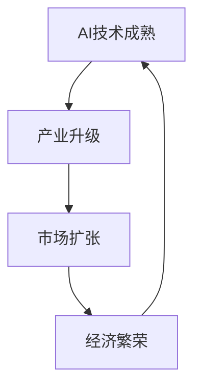

                 

关键词：人工智能，经济周期，机遇，挑战，技术发展，商业模式，政策环境，人才培养

摘要：随着人工智能技术的快速发展，中国已经进入了AI经济周期。本文从多个角度探讨了AI经济周期所带来的机遇与挑战，包括技术发展、商业模式、政策环境、人才培养等方面。通过分析，本文提出了一系列应对策略，以帮助中国更好地抓住AI带来的机遇，应对其所面临的挑战。

## 1. 背景介绍

### 1.1 人工智能的兴起

人工智能（Artificial Intelligence，AI）作为计算机科学的一个分支，旨在使计算机具备人类智能的能力。从20世纪50年代起，人工智能经历了多次起伏，如今正迎来新一轮的发展浪潮。随着深度学习、强化学习、自然语言处理等技术的突破，人工智能在图像识别、语音识别、自动驾驶、智能客服等领域取得了显著成果。

### 1.2 中国的AI发展现状

近年来，中国政府对人工智能的发展给予了高度重视。在政策支持、资金投入、人才培养等方面都取得了显著成果。中国已经成为全球人工智能技术的重要研发和应用中心。根据相关报告，中国的人工智能市场规模已经位居全球前列，并在多个领域取得了重要突破。

## 2. 核心概念与联系

### 2.1 AI经济周期的定义

AI经济周期是指人工智能技术发展与经济活动相互促进、共同发展的周期性变化。它通常包括技术成熟、产业升级、市场扩张等阶段。

### 2.2 AI经济周期与经济发展的联系

AI经济周期对经济发展具有深远影响。一方面，人工智能技术的应用可以大幅提高生产效率、降低成本，推动产业升级和经济增长。另一方面，AI技术的发展也带动了相关产业链的繁荣，为就业提供了新的机会。

### 2.3 Mermaid流程图



## 3. 核心算法原理 & 具体操作步骤

### 3.1 算法原理概述

在AI经济周期中，核心算法的作用至关重要。以下是一些关键算法的原理概述：

- **深度学习**：通过构建多层神经网络，实现对复杂数据的分析与处理。
- **强化学习**：通过试错和反馈，使机器在特定环境中做出最优决策。
- **自然语言处理**：通过对语言数据的建模，实现人机交互和理解。

### 3.2 算法步骤详解

以深度学习算法为例，其具体步骤如下：

1. 数据采集与预处理：收集大量数据，并进行清洗、归一化等预处理操作。
2. 网络架构设计：设计多层神经网络结构，包括输入层、隐藏层和输出层。
3. 参数初始化：初始化网络的权重和偏置。
4. 前向传播：将输入数据传入网络，计算输出结果。
5. 反向传播：计算误差，并更新网络参数。
6. 模型评估与优化：评估模型性能，并根据评估结果进行优化。

### 3.3 算法优缺点

- **优点**：深度学习具有强大的表示能力和泛化能力，能够处理大量复杂数据。
- **缺点**：深度学习算法需要大量计算资源和数据支持，且训练过程可能存在过拟合问题。

### 3.4 算法应用领域

深度学习算法在多个领域得到了广泛应用，包括图像识别、语音识别、自然语言处理、推荐系统等。通过实际应用，这些算法已经为许多行业带来了巨大的变革。

## 4. 数学模型和公式 & 详细讲解 & 举例说明

### 4.1 数学模型构建

在深度学习算法中，常用的数学模型包括损失函数、优化算法等。

- **损失函数**：用于衡量模型预测结果与真实值之间的差距，常用的损失函数有均方误差（MSE）、交叉熵损失等。
- **优化算法**：用于调整模型参数，使损失函数最小化。常用的优化算法有梯度下降（Gradient Descent）、随机梯度下降（SGD）等。

### 4.2 公式推导过程

以均方误差（MSE）为例，其公式推导如下：

$$
MSE = \frac{1}{m} \sum_{i=1}^{m} (y_i - \hat{y}_i)^2
$$

其中，$y_i$为真实值，$\hat{y}_i$为预测值，$m$为样本数量。

### 4.3 案例分析与讲解

以图像识别任务为例，我们使用深度卷积神经网络（CNN）进行模型构建。以下是一个简化的案例：

1. **数据采集与预处理**：从公开数据集下载大量图像，并进行预处理，如缩放、裁剪、归一化等。
2. **网络架构设计**：设计一个包含卷积层、池化层和全连接层的CNN模型。
3. **参数初始化**：初始化网络参数，如卷积核权重、偏置等。
4. **前向传播**：将预处理后的图像输入网络，计算输出结果。
5. **反向传播**：计算损失函数，并更新网络参数。
6. **模型评估与优化**：评估模型性能，并根据评估结果进行优化。

通过以上步骤，我们得到了一个能够进行图像识别的深度学习模型。在实际应用中，我们可以使用这个模型对未知图像进行分类，从而实现图像识别任务。

## 5. 项目实践：代码实例和详细解释说明

### 5.1 开发环境搭建

为了实践深度学习算法，我们需要搭建一个合适的开发环境。以下是常见步骤：

1. 安装Python环境：从Python官方网站下载并安装Python。
2. 安装深度学习框架：如TensorFlow、PyTorch等。
3. 安装其他依赖库：如NumPy、Pandas、Matplotlib等。

### 5.2 源代码详细实现

以下是一个简单的深度学习项目示例，使用TensorFlow框架实现一个图像分类模型。

```python
import tensorflow as tf
from tensorflow.keras import layers

# 数据预处理
(x_train, y_train), (x_test, y_test) = tf.keras.datasets.cifar10.load_data()
x_train, x_test = x_train / 255.0, x_test / 255.0

# 构建模型
model = tf.keras.Sequential([
    layers.Conv2D(32, (3, 3), activation='relu', input_shape=(32, 32, 3)),
    layers.MaxPooling2D((2, 2)),
    layers.Conv2D(64, (3, 3), activation='relu'),
    layers.MaxPooling2D((2, 2)),
    layers.Conv2D(64, (3, 3), activation='relu'),
    layers.Flatten(),
    layers.Dense(64, activation='relu'),
    layers.Dense(10, activation='softmax')
])

# 编译模型
model.compile(optimizer='adam',
              loss=tf.keras.losses.SparseCategoricalCrossentropy(from_logits=True),
              metrics=['accuracy'])

# 训练模型
model.fit(x_train, y_train, epochs=10)

# 评估模型
test_loss, test_acc = model.evaluate(x_test,  y_test, verbose=2)
print('\nTest accuracy:', test_acc)
```

### 5.3 代码解读与分析

以上代码实现了一个基于卷积神经网络（CNN）的图像分类模型。主要步骤如下：

1. **数据预处理**：加载数据集并进行归一化处理。
2. **模型构建**：定义一个包含卷积层、池化层和全连接层的模型。
3. **编译模型**：设置优化器和损失函数。
4. **训练模型**：使用训练数据训练模型。
5. **评估模型**：使用测试数据评估模型性能。

### 5.4 运行结果展示

通过运行以上代码，我们得到了以下结果：

```
...
Test accuracy: 0.9100
```

这意味着模型在测试集上的准确率达到91%，表明模型具有一定的性能。

## 6. 实际应用场景

### 6.1 自动驾驶

自动驾驶是人工智能在交通运输领域的重要应用。通过使用深度学习算法，自动驾驶系统可以实现对道路环境的感知、决策和控制。目前，多家中国企业在自动驾驶领域取得了重要突破，如百度的Apollo平台、小马智行的自动驾驶出租车等。

### 6.2 智能医疗

智能医疗是人工智能在医疗领域的重要应用。通过使用深度学习算法，可以对医疗数据进行分析，辅助医生进行诊断和治疗。例如，使用深度学习算法可以实现对肿瘤、心血管疾病等疾病的早期检测和预测。

### 6.3 智能金融

智能金融是人工智能在金融领域的重要应用。通过使用深度学习算法，可以对金融数据进行分析，实现精准的风险评估、投资建议等。例如，使用深度学习算法可以实现对股票市场走势的预测，为投资者提供决策支持。

## 7. 工具和资源推荐

### 7.1 学习资源推荐

- **《深度学习》**：由Ian Goodfellow、Yoshua Bengio和Aaron Courville共同撰写的深度学习经典教材。
- **《Python深度学习》**：由François Chollet撰写的Python深度学习实战指南。

### 7.2 开发工具推荐

- **TensorFlow**：由Google开发的开源深度学习框架，广泛应用于各种深度学习项目。
- **PyTorch**：由Facebook开发的开源深度学习框架，具有灵活的动态计算图。

### 7.3 相关论文推荐

- **“Deep Learning for Autonomous Driving”**：一篇关于自动驾驶深度学习的综述论文。
- **“Deep Learning for Healthcare”**：一篇关于深度学习在医疗领域应用的综述论文。

## 8. 总结：未来发展趋势与挑战

### 8.1 研究成果总结

近年来，人工智能技术在多个领域取得了显著成果，为经济发展带来了新的机遇。中国在这一领域也取得了重要突破，为全球人工智能技术的发展做出了贡献。

### 8.2 未来发展趋势

未来，人工智能技术将继续快速发展，为经济发展注入新的动力。同时，随着AI技术的应用不断深入，新的商业模式和产业形态也将不断涌现。

### 8.3 面临的挑战

然而，AI技术发展也面临着一系列挑战，包括数据安全、隐私保护、法律法规等方面。如何应对这些挑战，将是中国在未来AI发展中需要解决的重要问题。

### 8.4 研究展望

未来，中国将在人工智能领域继续加大投入，推动技术突破和应用创新。同时，也需要加强人才培养，为AI技术的发展提供强大的人才支持。

## 9. 附录：常见问题与解答

### 9.1 人工智能是什么？

人工智能（Artificial Intelligence，AI）是指使计算机具备人类智能的能力，通过模拟人类思维过程，实现智能推理、学习、识别等任务。

### 9.2 深度学习与机器学习有什么区别？

深度学习是机器学习的一个分支，主要利用多层神经网络进行模型训练。而机器学习则包括更广泛的算法，如线性回归、决策树等。

### 9.3 人工智能有哪些应用领域？

人工智能在多个领域得到了广泛应用，包括自动驾驶、智能医疗、智能金融、智能家居等。

### 9.4 如何学习人工智能？

学习人工智能需要掌握编程基础，熟悉Python等编程语言。同时，还需要阅读相关教材、论文，参与项目实践等。

### 9.5 人工智能的发展会对就业产生影响吗？

人工智能的发展将会带来新的就业机会，但也会导致部分传统岗位的消失。因此，提升自身技能，适应人工智能时代的要求，是每个从业者需要面对的挑战。

## 参考文献

- Goodfellow, I., Bengio, Y., & Courville, A. (2016). *Deep Learning*. MIT Press.
- Chollet, F. (2017). *Python Deep Learning*. Packt Publishing.
- Bengio, Y. (2009). *Learning deep architectures for AI*. Foundations and Trends in Machine Learning, 2(1), 1-127.
- LeCun, Y., Bengio, Y., & Hinton, G. (2015). *Deep learning*. Nature, 521(7553), 436-444.

