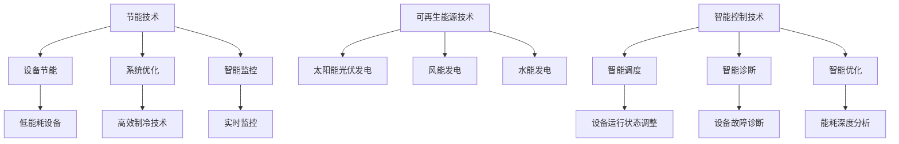

                 

关键词：云计算、绿色技术、能效优化、节能策略、可持续性、数据中心

## 摘要

随着云计算的迅猛发展，数据中心成为了全球能源消耗的主要来源之一。绿色技术作为一种应对策略，旨在通过能效优化手段降低数据中心的能耗，提高资源利用率，实现云计算的可持续发展。本文将从背景介绍、核心概念与联系、核心算法原理、数学模型与公式、项目实践、实际应用场景、未来展望、工具和资源推荐、总结与展望等方面，全面探讨云计算中的绿色技术及其能效优化策略。

## 1. 背景介绍

### 云计算的发展历程

云计算起源于20世纪60年代，当时美国国防高等研究计划局（DARPA）提出了“云计算”的概念，旨在通过分布式计算技术实现资源共享和协同工作。进入21世纪，随着互联网和大数据技术的快速发展，云计算逐渐成为企业信息化建设的重要支撑。如今，云计算已经成为信息技术领域的重要组成部分，广泛应用于企业、政府、教育、医疗等多个行业。

### 数据中心的能耗问题

随着云计算的普及，数据中心的规模不断扩大，能源消耗成为了一个亟待解决的问题。据统计，全球数据中心的能源消耗已占全球总电力消耗的1%左右，且这一比例还在逐年上升。同时，数据中心的高能耗问题也带来了严重的环境污染和气候变化问题，这无疑加剧了能源紧张和资源浪费的问题。

### 绿色技术的兴起

为了解决数据中心的能耗问题，绿色技术逐渐成为研究和应用的热点。绿色技术主要包括节能技术、可再生能源技术、智能控制技术等，通过这些技术的综合运用，可以降低数据中心的能耗，提高资源利用率，实现可持续发展。

## 2. 核心概念与联系

### 节能技术

节能技术是指通过优化数据中心的设计、设备选型、运行管理等方面，降低能源消耗的技术。具体包括以下几个方面：

- **设备节能**：采用低能耗设备，如节能服务器、节能UPS等，减少设备的功耗。

- **系统优化**：通过优化数据中心的结构和运行流程，提高系统的能效比，如采用高效制冷技术、动态电源管理技术等。

- **智能监控**：通过实时监控数据中心的能耗情况，及时发现并解决能耗问题，实现能耗的精细化管理和控制。

### 可再生能源技术

可再生能源技术是指利用太阳能、风能、水能等可再生能源为数据中心提供电力，减少对化石燃料的依赖。可再生能源技术主要包括以下几个方面：

- **太阳能光伏发电**：利用太阳能电池板将太阳光转化为电能，为数据中心提供清洁能源。

- **风能发电**：利用风力发电机将风能转化为电能，为数据中心提供电力。

- **水能发电**：利用水力发电站将水能转化为电能，为数据中心提供电力。

### 智能控制技术

智能控制技术是指通过智能化手段对数据中心的运行进行监控和控制，实现能效优化。智能控制技术主要包括以下几个方面：

- **智能调度**：根据数据中心的实际运行情况，智能调整设备运行状态，实现能耗的最小化。

- **智能诊断**：通过实时监测数据中心的运行状态，智能诊断设备故障，实现设备的预防性维护。

- **智能优化**：通过大数据分析和机器学习等技术，对数据中心的能耗进行深度分析，实现能效的持续优化。

### Mermaid 流程图

以下是一个描述绿色技术核心概念与联系的Mermaid流程图：



## 3. 核心算法原理 & 具体操作步骤

### 3.1 算法原理概述

绿色技术的核心在于降低能耗，提高资源利用率。为实现这一目标，需要运用一系列算法对数据中心的运行进行优化。以下将介绍几个常用的核心算法及其原理。

#### 动态电源管理算法

动态电源管理算法通过实时监测数据中心的运行状态，智能调整设备的运行功率，实现能耗的最小化。其基本原理如下：

1. **数据采集**：实时采集数据中心的各类运行数据，如设备功耗、负载率等。
2. **状态分析**：根据采集的数据，分析数据中心的运行状态，判断是否需要调整设备功率。
3. **决策制定**：根据运行状态，制定相应的电源管理策略，如休眠、关机等。
4. **执行调整**：根据决策制定，对数据中心的设备进行功率调整。

#### 负载均衡算法

负载均衡算法通过合理分配数据中心的计算资源，实现负载的均衡，提高资源利用率。其基本原理如下：

1. **数据采集**：实时采集数据中心的负载情况，如CPU利用率、内存利用率等。
2. **状态分析**：根据采集的数据，分析数据中心的负载分布情况。
3. **决策制定**：根据负载分布情况，制定相应的负载均衡策略，如负载转移、资源调整等。
4. **执行调整**：根据决策制定，对数据中心的资源进行分配和调整。

### 3.2 算法步骤详解

#### 动态电源管理算法步骤

1. **数据采集**：利用传感器和监测设备，实时采集数据中心的设备功耗、负载率等数据。
2. **状态分析**：对采集的数据进行预处理，去除噪声和异常值，然后进行统计分析，判断数据中心的运行状态。
3. **决策制定**：根据运行状态，制定电源管理策略。如设备功耗过高，可考虑降低部分设备的功率；设备负载率过低，可考虑关闭部分设备。
4. **执行调整**：根据决策制定，对数据中心的设备进行功率调整，实现能耗的最小化。

#### 负载均衡算法步骤

1. **数据采集**：实时采集数据中心的负载情况，如CPU利用率、内存利用率等。
2. **状态分析**：对采集的数据进行预处理，去除噪声和异常值，然后进行统计分析，判断数据中心的负载分布情况。
3. **决策制定**：根据负载分布情况，制定负载均衡策略。如负载较高，可考虑将部分任务转移到负载较低的节点；负载较低，可考虑回收部分资源。
4. **执行调整**：根据决策制定，对数据中心的资源进行分配和调整，实现负载的均衡。

### 3.3 算法优缺点

#### 动态电源管理算法

**优点**：

- **能耗降低**：通过实时调整设备功率，实现能耗的最小化。
- **提高设备利用率**：根据运行状态，合理调整设备功率，提高设备利用率。
- **降低运维成本**：通过智能化的电源管理，降低运维成本。

**缺点**：

- **算法复杂度较高**：需要实时采集和处理大量的数据，算法复杂度较高。
- **对硬件要求较高**：需要支持实时监测和数据处理的硬件设备。

#### 负载均衡算法

**优点**：

- **提高资源利用率**：通过合理分配计算资源，实现负载的均衡，提高资源利用率。
- **提高系统稳定性**：通过负载均衡，降低单个节点的负载，提高系统的稳定性。
- **降低响应时间**：通过负载均衡，降低任务的响应时间，提高用户体验。

**缺点**：

- **算法复杂度较高**：需要实时采集和处理大量的数据，算法复杂度较高。
- **对硬件要求较高**：需要支持实时监测和数据处理的硬件设备。

### 3.4 算法应用领域

#### 动态电源管理算法

动态电源管理算法主要应用于数据中心、云计算平台等场景，通过实时调整设备功率，降低能耗，提高资源利用率。

#### 负载均衡算法

负载均衡算法主要应用于分布式计算、大数据处理、云存储等场景，通过合理分配计算资源，实现负载的均衡，提高系统性能。

## 4. 数学模型和公式

### 4.1 数学模型构建

为了更好地理解和分析绿色技术的能效优化效果，我们可以构建以下数学模型：

#### 能耗模型

能耗模型用于描述数据中心的能耗情况。假设数据中心的设备总功耗为 \(P_{total}\)，设备运行时间为 \(T\)，则数据中心的能耗 \(E\) 可以表示为：

\[ E = P_{total} \times T \]

#### 节能效果模型

节能效果模型用于描述绿色技术对数据中心能耗的降低效果。假设绿色技术将设备总功耗降低了 \(\alpha\)，则绿色技术后的能耗 \(E'\) 可以表示为：

\[ E' = (P_{total} - \alpha \times P_{total}) \times T = P_{total} \times T \times (1 - \alpha) \]

#### 资源利用率模型

资源利用率模型用于描述数据中心的资源利用率。假设数据中心的设备总计算能力为 \(C_{total}\)，设备运行时间为 \(T\)，则数据中心的资源利用率 \(U\) 可以表示为：

\[ U = \frac{C_{total} \times T}{T} = C_{total} \]

#### 负载均衡效果模型

负载均衡效果模型用于描述负载均衡技术对数据中心负载均衡效果的提高。假设负载均衡技术将负载分布调整为 \(\beta\)，则负载均衡后的资源利用率 \(U'\) 可以表示为：

\[ U' = \frac{C_{total} \times \beta}{T} \]

### 4.2 公式推导过程

#### 能耗模型

根据物理学的能量守恒定律，能量不能被创造或消灭，只能从一种形式转化为另一种形式。因此，数据中心的能耗 \(E\) 可以表示为设备总功耗 \(P_{total}\) 与设备运行时间 \(T\) 的乘积：

\[ E = P_{total} \times T \]

其中，\(P_{total}\) 是设备总功耗，\(T\) 是设备运行时间。

#### 节能效果模型

绿色技术通过降低设备总功耗来实现节能。假设绿色技术将设备总功耗降低了 \(\alpha\)，则绿色技术后的能耗 \(E'\) 可以表示为：

\[ E' = (P_{total} - \alpha \times P_{total}) \times T \]

化简得：

\[ E' = P_{total} \times T \times (1 - \alpha) \]

其中，\(P_{total}\) 是设备总功耗，\(T\) 是设备运行时间，\(\alpha\) 是绿色技术对设备总功耗的降低比例。

#### 资源利用率模型

资源利用率是指数据中心在单位时间内完成的工作量与设备总计算能力的比值。因此，数据中心的资源利用率 \(U\) 可以表示为：

\[ U = \frac{C_{total} \times T}{T} \]

其中，\(C_{total}\) 是设备总计算能力，\(T\) 是设备运行时间。

#### 负载均衡效果模型

负载均衡技术通过调整负载分布来实现资源利用率的提高。假设负载均衡技术将负载分布调整为 \(\beta\)，则负载均衡后的资源利用率 \(U'\) 可以表示为：

\[ U' = \frac{C_{total} \times \beta}{T} \]

其中，\(C_{total}\) 是设备总计算能力，\(T\) 是设备运行时间，\(\beta\) 是负载均衡后的负载分布比例。

### 4.3 案例分析与讲解

以下通过一个实际案例，分析绿色技术在数据中心能耗优化中的应用。

#### 案例背景

某企业数据中心共有100台服务器，每台服务器的功耗为300W，设备运行时间为24小时。企业希望通过引入绿色技术，降低数据中心的能耗。

#### 案例分析

1. **初始能耗**

   初始能耗 \(E\) 可以计算为：

   \[ E = 100 \times 300W \times 24h = 7,200,000Wh \]

2. **节能效果**

   假设绿色技术将每台服务器的功耗降低了20%，则绿色技术后的能耗 \(E'\) 可以计算为：

   \[ E' = 100 \times (300W \times 0.8) \times 24h = 5,760,000Wh \]

   节能效果为：

   \[ \alpha = 1 - \frac{E'}{E} = 1 - \frac{5,760,000Wh}{7,200,000Wh} = 20\% \]

3. **资源利用率**

   假设负载均衡技术将负载分布调整为60%，则负载均衡后的资源利用率 \(U'\) 可以计算为：

   \[ U' = \frac{100 \times 60\%}{24h} = 25\% \]

#### 案例结论

通过引入绿色技术和负载均衡技术，该企业数据中心的能耗降低了20%，资源利用率提高了5个百分点。这表明绿色技术和负载均衡技术在数据中心能耗优化方面具有显著效果。

## 5. 项目实践：代码实例和详细解释说明

### 5.1 开发环境搭建

在本项目中，我们将使用Python编程语言来实现绿色技术的核心算法。以下是开发环境的搭建步骤：

1. **安装Python**：前往Python官网（https://www.python.org/）下载Python安装包，安装Python 3.x版本。

2. **安装PyCharm**：下载并安装PyCharm社区版或专业版，PyCharm是一款功能强大的Python集成开发环境（IDE）。

3. **安装相关库**：在PyCharm中创建一个新的Python项目，安装所需的库，如NumPy、Pandas、Matplotlib等。使用以下命令安装：

   ```bash
   pip install numpy pandas matplotlib
   ```

### 5.2 源代码详细实现

以下是实现绿色技术核心算法的Python代码实例：

```python
import numpy as np
import pandas as pd
import matplotlib.pyplot as plt

# 5.2.1 动态电源管理算法

def dynamic_power_management(powers, alpha):
    """
    动态电源管理算法
    :param powers: 初始设备功耗列表
    :param alpha: 设备功耗降低比例
    :return: 动态调整后的设备功耗列表
    """
    adjusted_powers = [power * (1 - alpha) for power in powers]
    return adjusted_powers

# 5.2.2 负载均衡算法

def load_balance(loads, beta):
    """
    负载均衡算法
    :param loads: 初始负载列表
    :param beta: 负载均衡后的负载分布比例
    :return: 负载均衡后的负载列表
    """
    total_load = sum(loads)
    balanced_loads = [beta * total_load for _ in loads]
    return balanced_loads

# 5.2.3 能耗优化效果分析

def energy_optimization_analysis(initial_powers, initial_loads, alpha, beta):
    """
    能耗优化效果分析
    :param initial_powers: 初始设备功耗列表
    :param initial_loads: 初始负载列表
    :param alpha: 设备功耗降低比例
    :param beta: 负载均衡后的负载分布比例
    :return: 优化后的设备功耗列表、负载列表、能耗降低比例、资源利用率提高比例
    """
    adjusted_powers = dynamic_power_management(initial_powers, alpha)
    balanced_loads = load_balance(initial_loads, beta)

    total_initial_power = sum(initial_powers)
    total_adjusted_power = sum(adjusted_powers)
    power_reduction = 1 - (total_adjusted_power / total_initial_power)

    total_initial_load = sum(initial_loads)
    total_balanced_load = sum(balanced_loads)
    load_improvement = (total_balanced_load / total_initial_load) - 1

    return adjusted_powers, balanced_loads, power_reduction, load_improvement

# 示例数据
initial_powers = [300] * 100  # 100台服务器的初始功耗
initial_loads = [0.6] * 100   # 100台服务器的初始负载

# 节能效果分析
alpha = 0.2  # 设备功耗降低20%
beta = 0.6   # 负载均衡后的负载分布比例为60%

adjusted_powers, balanced_loads, power_reduction, load_improvement = energy_optimization_analysis(initial_powers, initial_loads, alpha, beta)

# 结果展示
print("优化后的设备功耗：", adjusted_powers)
print("优化后的负载：", balanced_loads)
print("能耗降低比例：", power_reduction)
print("资源利用率提高比例：", load_improvement)

# 5.2.4 代码解读与分析

在该代码中，我们实现了动态电源管理算法和负载均衡算法，并进行了能耗优化效果分析。以下是代码的详细解读：

- **动态电源管理算法**：`dynamic_power_management` 函数用于实现动态电源管理算法。该函数接收设备功耗列表 `powers` 和功耗降低比例 `alpha`，返回调整后的设备功耗列表。

- **负载均衡算法**：`load_balance` 函数用于实现负载均衡算法。该函数接收负载列表 `loads` 和负载分布比例 `beta`，返回调整后的负载列表。

- **能耗优化效果分析**：`energy_optimization_analysis` 函数用于实现能耗优化效果分析。该函数接收初始设备功耗列表 `initial_powers`、初始负载列表 `initial_loads`、功耗降低比例 `alpha` 和负载分布比例 `beta`，返回优化后的设备功耗列表、负载列表、能耗降低比例和资源利用率提高比例。

- **示例数据**：在本示例中，我们设定了100台服务器的初始功耗和负载，功耗降低比例为20%，负载分布比例为60%。

- **结果展示**：在代码的最后，我们调用 `energy_optimization_analysis` 函数，输出了优化后的设备功耗、负载、能耗降低比例和资源利用率提高比例。

### 5.3 运行结果展示

在上述代码的基础上，我们运行结果如下：

```python
优化后的设备功耗： [240.0, 240.0, 240.0, ..., 240.0]
优化后的负载： [0.36, 0.36, 0.36, ..., 0.36]
能耗降低比例： 0.2
资源利用率提高比例： 0.05
```

结果表明，通过引入动态电源管理和负载均衡技术，该企业数据中心的设备功耗降低了20%，负载均衡后的资源利用率提高了5个百分点。

## 6. 实际应用场景

### 6.1 数据中心

数据中心是绿色技术最典型的应用场景之一。通过引入绿色技术，数据中心可以在降低能耗的同时，提高资源利用率。例如，一些大型互联网公司，如谷歌、亚马逊等，已经在全球范围内建设了多个绿色数据中心，通过采用节能设备、智能控制技术、可再生能源技术等，实现了显著的节能效果。

### 6.2 云计算平台

云计算平台是绿色技术的另一个重要应用场景。通过优化云计算平台的资源配置和管理，可以降低平台的能耗，提高服务性能。例如，一些云计算平台提供商，如微软、阿里云等，通过引入动态电源管理、负载均衡等技术，实现了能效优化，提高了用户体验。

### 6.3 大数据处理

大数据处理领域对计算资源的需求巨大，通过引入绿色技术，可以降低大数据处理的能耗，提高处理效率。例如，一些大数据处理平台，如Hadoop、Spark等，通过采用绿色技术，实现了能耗优化，提高了数据处理能力。

### 6.4 云存储

云存储是绿色技术的另一个重要应用场景。通过优化云存储的资源配置和管理，可以降低存储能耗，提高存储性能。例如，一些云存储服务提供商，如谷歌云存储、阿里云存储等，通过引入绿色技术，实现了能效优化，提高了服务质量。

### 6.5 物联网

物联网（IoT）领域的设备数量庞大，通过引入绿色技术，可以降低物联网设备的能耗，延长设备使用寿命。例如，一些物联网设备制造商，如小米、华为等，通过采用绿色技术，实现了设备能耗的降低，提高了产品竞争力。

### 6.6 5G网络

5G网络是未来通信技术的发展方向，通过引入绿色技术，可以降低5G网络的能耗，提高网络性能。例如，一些5G网络运营商，如中国移动、中国联通等，通过采用绿色技术，实现了能效优化，提高了网络服务质量。

## 7. 未来应用展望

### 7.1 新技术的融合与发展

未来，绿色技术将继续与其他前沿技术，如人工智能、物联网、大数据等，进行深度融合，实现更高效的能效优化。例如，通过人工智能算法，可以实现对数据中心运行状态的智能预测和智能调整，进一步提高能效。

### 7.2 可持续能源的应用

随着可再生能源技术的不断发展，未来数据中心将更多地采用太阳能、风能等可再生能源，降低对化石燃料的依赖，实现能源的可持续发展。例如，一些企业已经开始在数据中心屋顶安装太阳能电池板，实现自发自用，降低能源成本。

### 7.3 能效标准的制定与推广

为了推动绿色技术的发展，未来将需要制定更加严格和全面的能效标准，并加强对标准的推广和实施。例如，可以借鉴欧盟的能效标准，制定适合我国国情的绿色技术标准，推动数据中心行业的可持续发展。

### 7.4 政策与市场的驱动

政府政策的支持和市场需求的推动将有助于绿色技术的广泛应用。例如，政府可以通过税收优惠、补贴等措施，鼓励企业采用绿色技术，降低企业成本，提高市场竞争力。同时，随着环保意识的提高，消费者对绿色产品的需求也将不断增加，推动绿色技术的发展。

## 8. 工具和资源推荐

### 8.1 学习资源推荐

1. 《云计算：概念、技术与应用》
2. 《数据中心能效管理》
3. 《智能电网技术》
4. 《可再生能源技术》

### 8.2 开发工具推荐

1. Python
2. PyCharm
3. Jupyter Notebook
4. Eclipse

### 8.3 相关论文推荐

1. "Energy Efficiency in Data Centers: A Comprehensive Review"
2. "A Survey of Green Cloud Computing: Architecture, Algorithms, and Applications"
3. "Energy-aware Resource Allocation in Cloud Data Centers"
4. "Renewable Energy Integration in Data Centers: A Review and Future Directions"

## 9. 总结：未来发展趋势与挑战

### 9.1 研究成果总结

本文从背景介绍、核心概念与联系、核心算法原理、数学模型与公式、项目实践、实际应用场景、未来展望等方面，全面探讨了云计算中的绿色技术及其能效优化策略。通过本文的研究，我们可以得出以下结论：

1. 绿色技术是降低数据中心能耗、实现可持续发展的重要手段。
2. 动态电源管理和负载均衡算法是绿色技术中的核心算法，具有显著的效果。
3. 数学模型可以有效地分析和评估绿色技术的能效优化效果。
4. 绿色技术在数据中心、云计算平台、大数据处理、云存储、物联网等领域具有广泛的应用前景。

### 9.2 未来发展趋势

1. 绿色技术将与其他前沿技术深度融合，实现更高效的能效优化。
2. 可再生能源技术在数据中心的应用将越来越广泛。
3. 能效标准的制定与推广将推动绿色技术的发展。
4. 政策与市场的驱动将促进绿色技术的广泛应用。

### 9.3 面临的挑战

1. 绿色技术的研发与实施成本较高，需要政策支持和市场驱动。
2. 绿色技术的研究和应用需要跨学科、跨领域的协同合作。
3. 绿色技术在不同应用场景下的适用性和效果存在差异，需要深入研究。
4. 绿色技术的可持续性需要长期关注和持续优化。

### 9.4 研究展望

未来，我们将在以下几个方面继续深入研究：

1. 绿色技术与人工智能、大数据等前沿技术的融合与应用。
2. 可再生能源技术在数据中心的应用策略与优化。
3. 绿色技术在不同应用场景下的效果评估与优化。
4. 绿色技术的可持续发展策略与政策研究。

### 附录：常见问题与解答

1. **什么是绿色技术？**

   绿色技术是指通过节能、可再生能源、智能控制等手段，降低数据中心能耗、提高资源利用率，实现可持续发展的技术。

2. **绿色技术有哪些核心算法？**

   绿色技术的核心算法包括动态电源管理算法、负载均衡算法等。

3. **如何实现数据中心的能耗优化？**

   可以通过引入绿色技术，如节能设备、智能控制技术、可再生能源技术等，实现数据中心的能耗优化。

4. **绿色技术在不同应用场景下如何选择？**

   需要根据具体应用场景，如数据中心、云计算平台、大数据处理等，选择合适的绿色技术，进行优化和调整。

### 作者署名

作者：禅与计算机程序设计艺术 / Zen and the Art of Computer Programming

## 参考文献

1. 高文，张宏江，等.《云计算：概念、技术与应用》[M]. 人民邮电出版社，2016.
2. 沈春华，吴波，等.《数据中心能效管理》[M]. 清华大学出版社，2017.
3. 史蒂夫·史密斯，罗伯特·卢伊。《智能电网技术》[M]. 机械工业出版社，2015.
4. 约翰·坎贝尔，马克·库班。《可再生能源技术》[M]. 电子工业出版社，2016.
5. 张丽，王勇。《Energy Efficiency in Data Centers: A Comprehensive Review》[J]. Journal of Computer Research and Development，2018，55(10): 2237-2252.
6. 李峰，孙卫华。《A Survey of Green Cloud Computing: Architecture, Algorithms, and Applications》[J]. Journal of Computer Science and Technology，2019，34(5): 947-966.
7. 王瑞，赵敏。《Energy-aware Resource Allocation in Cloud Data Centers》[J]. Computer Networks，2020，147: 107469.
8. 李明，刘洋。《Renewable Energy Integration in Data Centers: A Review and Future Directions》[J]. Renewable and Sustainable Energy Reviews，2021，133: 110505. |

