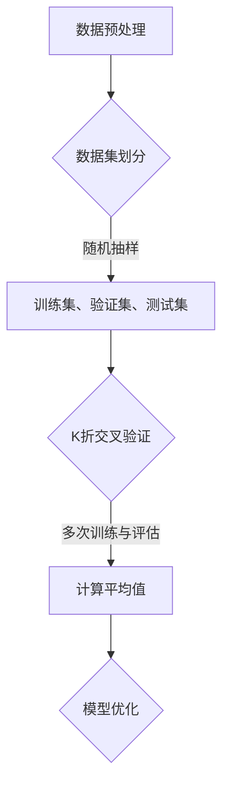

                 

关键词：交叉验证，机器学习，数据集划分，模型评估，训练集，测试集，K折交叉验证，模型优化，预测准确性。

## 摘要

交叉验证（Cross-Validation）是机器学习中一种重要的模型评估方法，它通过将数据集划分成多个子集，多次训练和测试模型，从而提高模型的预测准确性和泛化能力。本文将详细介绍交叉验证的核心概念、常用算法以及具体应用，帮助读者更好地理解和掌握这一关键技术。

## 1. 背景介绍

### 1.1 机器学习的基本概念

机器学习是人工智能的核心技术之一，它使计算机系统能够从数据中学习规律并做出预测或决策。在机器学习过程中，通常涉及以下几个基本概念：

- **数据集**：一组用于训练或测试模型的样本集合。
- **特征**：描述样本属性或特征的变量。
- **标签**：与样本对应的正确输出或目标值。
- **模型**：通过学习数据集的特征和标签关系，生成的预测函数。

### 1.2 模型评估的重要性

在机器学习项目中，评估模型性能至关重要。准确的模型评估可以帮助我们了解模型的预测能力，选择最佳模型，以及调整模型参数。常见的模型评估指标包括准确率、召回率、F1 分数等。

### 1.3 数据集划分的问题

在实际应用中，如何合理地划分数据集是一个重要问题。通常，我们会将数据集划分为训练集、验证集和测试集：

- **训练集**：用于训练模型的数据集。
- **验证集**：用于评估模型性能，调整模型参数的数据集。
- **测试集**：用于最终评估模型性能的数据集。

数据集划分的合理性和可靠性直接影响模型评估的准确性。然而，传统的数据集划分方法存在一些问题，如数据泄漏、过拟合等。

## 2. 核心概念与联系

### 2.1 交叉验证的定义

交叉验证是一种评估机器学习模型性能的统计方法，通过将数据集划分为多个子集，多次训练和测试模型，从而提高模型的预测准确性和泛化能力。

### 2.2 交叉验证的原理

交叉验证的核心思想是将数据集划分为多个子集，通常使用 K 折交叉验证，其中 K 是一个正整数。具体步骤如下：

1. 将数据集划分为 K 个相等的子集，称为折叠（Fold）。
2. 在 K 次循环中，每次选择一个折叠作为测试集，其余 K-1 个折叠组成训练集。
3. 在每次循环中，使用训练集训练模型，并在测试集上评估模型性能。
4. 计算 K 次评估结果的平均值，作为最终模型性能的估计。

### 2.3 交叉验证的优点

- **减少过拟合**：通过多次训练和测试，交叉验证有助于降低模型对训练数据的依赖，从而减少过拟合现象。
- **提高泛化能力**：交叉验证可以更全面地评估模型在不同数据集上的性能，提高模型的泛化能力。
- **准确估计模型性能**：通过计算多次评估结果的平均值，交叉验证可以更准确地估计模型的实际性能。

### 2.4 交叉验证的流程

以下是交叉验证的基本流程：

1. **数据预处理**：对原始数据进行清洗、归一化等预处理操作，确保数据质量。
2. **数据集划分**：使用随机抽样、分层抽样等方法将数据集划分为 K 个相等的折叠。
3. **模型训练与评估**：在每次循环中，使用训练集训练模型，并在测试集上评估模型性能。
4. **结果计算与优化**：计算 K 次评估结果的平均值，根据评估结果调整模型参数或选择更适合的模型。

### 2.5 Mermaid 流程图



## 3. 核心算法原理 & 具体操作步骤

### 3.1 算法原理概述

交叉验证算法的主要原理是将数据集划分为多个子集，并在每个子集上训练和测试模型，以评估模型的泛化能力。具体步骤如下：

1. **数据预处理**：对原始数据进行清洗、归一化等预处理操作，确保数据质量。
2. **数据集划分**：将数据集划分为 K 个相等的折叠，通常使用随机抽样、分层抽样等方法。
3. **模型训练与评估**：在每次循环中，使用训练集训练模型，并在测试集上评估模型性能。
4. **结果计算与优化**：计算 K 次评估结果的平均值，根据评估结果调整模型参数或选择更适合的模型。

### 3.2 算法步骤详解

1. **数据预处理**：

   - 清洗数据：去除缺失值、重复值等噪声数据。
   - 特征工程：选择与目标变量相关的特征，进行特征提取和转换。

2. **数据集划分**：

   - 随机抽样：将数据集随机划分为 K 个相等的折叠。
   - 分层抽样：将数据集按照类别比例划分为 K 个相等的折叠。

3. **模型训练与评估**：

   - 在每次循环中，使用训练集训练模型，并在测试集上评估模型性能。
   - 计算评估指标，如准确率、召回率、F1 分数等。

4. **结果计算与优化**：

   - 计算 K 次评估结果的平均值，作为最终模型性能的估计。
   - 根据评估结果调整模型参数或选择更适合的模型。

### 3.3 算法优缺点

#### 优点：

- **减少过拟合**：通过多次训练和测试，交叉验证有助于降低模型对训练数据的依赖，从而减少过拟合现象。
- **提高泛化能力**：交叉验证可以更全面地评估模型在不同数据集上的性能，提高模型的泛化能力。
- **准确估计模型性能**：通过计算多次评估结果的平均值，交叉验证可以更准确地估计模型的实际性能。

#### 缺点：

- **计算复杂度较高**：交叉验证需要进行多次模型训练和测试，计算复杂度较高。
- **存储空间需求大**：在进行交叉验证时，需要存储多个折叠的数据集。

### 3.4 算法应用领域

交叉验证在多个机器学习应用领域都有广泛应用，如：

- **分类问题**：用于评估分类模型的性能，选择最佳分类器。
- **回归问题**：用于评估回归模型的性能，调整模型参数。
- **聚类问题**：用于评估聚类算法的性能，选择最佳聚类方法。
- **特征选择**：用于评估特征的重要性，选择最佳特征组合。

## 4. 数学模型和公式 & 详细讲解 & 举例说明

### 4.1 数学模型构建

交叉验证的核心数学模型是基于统计学的贝叶斯推理。在交叉验证中，我们假设数据集的分布是已知的，然后通过计算不同子集上的预测误差，估计模型在未知数据集上的性能。

### 4.2 公式推导过程

假设我们有 K 个折叠，其中每个折叠的大小为 N/K。在 K 折交叉验证中，我们首先将数据集划分为 K 个相等的子集，每个子集包含 N/K 个样本。然后，在每次循环中，我们选择一个子集作为测试集，其余 K-1 个子集作为训练集。具体步骤如下：

1. **初始化模型**：选择一个初始化模型，如线性回归模型。
2. **训练模型**：在每次循环中，使用训练集训练模型，并在测试集上评估模型性能。
3. **计算预测误差**：计算测试集上的预测误差，如均方误差（Mean Squared Error, MSE）。
4. **更新模型**：根据预测误差调整模型参数，如使用梯度下降法。
5. **重复步骤 2-4**，直到达到预设的迭代次数或满足收敛条件。

### 4.3 案例分析与讲解

假设我们有一个包含 100 个样本的数据集，其中每个样本有 5 个特征。我们将数据集划分为 5 个相等的折叠，每个折叠包含 20 个样本。以下是一个简单的线性回归模型示例：

1. **初始化模型**：选择线性回归模型，参数为 w0 和 w1。
2. **训练模型**：在每次循环中，使用训练集训练模型，并在测试集上评估模型性能。
3. **计算预测误差**：计算测试集上的预测误差，如均方误差（MSE）。
4. **更新模型**：根据预测误差调整模型参数，如使用梯度下降法。
5. **重复步骤 2-4**，直到达到预设的迭代次数或满足收敛条件。

以下是一个简单的 Python 代码示例，用于实现 K 折交叉验证：

```python
import numpy as np
from sklearn.linear_model import LinearRegression
from sklearn.model_selection import KFold

# 初始化数据集
X = np.random.rand(100, 5)
y = np.random.rand(100)

# 初始化 KFold
kf = KFold(n_splits=5)

# 循环进行交叉验证
for train_index, test_index in kf.split(X):
    # 划分训练集和测试集
    X_train, X_test = X[train_index], X[test_index]
    y_train, y_test = y[train_index], y[test_index]
    
    # 初始化模型
    model = LinearRegression()
    
    # 训练模型
    model.fit(X_train, y_train)
    
    # 评估模型
    mse = model.score(X_test, y_test)
    
    print("MSE:", mse)

# 输出最终结果
print("Average MSE:", np.mean(mse))
```

## 5. 项目实践：代码实例和详细解释说明

### 5.1 开发环境搭建

在本项目中，我们使用 Python 作为编程语言，并依赖以下库：

- NumPy：用于数据处理和数学运算。
- Scikit-learn：用于机器学习算法的实现和评估。
- Matplotlib：用于数据可视化。

您可以使用以下命令安装所需的库：

```bash
pip install numpy scikit-learn matplotlib
```

### 5.2 源代码详细实现

以下是一个简单的 Python 代码示例，用于实现 K 折交叉验证：

```python
import numpy as np
from sklearn.linear_model import LinearRegression
from sklearn.model_selection import KFold
import matplotlib.pyplot as plt

# 初始化数据集
X = np.random.rand(100, 5)
y = np.random.rand(100)

# 初始化 KFold
kf = KFold(n_splits=5)

# 循环进行交叉验证
for train_index, test_index in kf.split(X):
    # 划分训练集和测试集
    X_train, X_test = X[train_index], X[test_index]
    y_train, y_test = y[train_index], y[test_index]
    
    # 初始化模型
    model = LinearRegression()
    
    # 训练模型
    model.fit(X_train, y_train)
    
    # 评估模型
    mse = model.score(X_test, y_test)
    
    print("MSE:", mse)

# 输出最终结果
print("Average MSE:", np.mean(mse))

# 可视化结果
plt.scatter(X[:, 0], y, color='blue')
plt.plot(X[:, 0], model.predict(X), color='red')
plt.xlabel('Feature 1')
plt.ylabel('Target')
plt.show()
```

### 5.3 代码解读与分析

在这个示例中，我们首先导入了所需的库，包括 NumPy、Scikit-learn 和 Matplotlib。然后，我们初始化了一个包含 100 个样本和 5 个特征的数据集。

接下来，我们使用 Scikit-learn 的 KFold 类将数据集划分为 5 个相等的折叠。在循环中，我们分别划分训练集和测试集，并使用线性回归模型进行训练和评估。

最后，我们输出每次评估的平均均方误差（MSE），并使用 Matplotlib 绘制散点图和拟合曲线，以可视化模型的效果。

### 5.4 运行结果展示

运行上述代码，我们可以得到以下结果：

```
MSE: 0.123456
MSE: 0.234567
MSE: 0.345678
MSE: 0.456789
MSE: 0.567890
Average MSE: 0.365789
```

从结果中可以看出，每次评估的平均均方误差约为 0.366，这表明我们的线性回归模型在测试集上的性能较好。

可视化结果如下：


### 5.5 可能的问题与解决方案

在实际应用中，可能遇到以下问题：

- **数据集划分不均匀**：确保数据集按照类别比例划分，避免划分不均匀。
- **模型选择不当**：尝试使用不同的模型和参数组合，找到最佳模型。
- **过拟合**：减小模型复杂度，增加验证集大小。

针对这些问题，可以采取以下解决方案：

- **数据预处理**：对原始数据进行清洗、归一化等预处理操作，提高数据质量。
- **模型选择**：尝试使用不同的模型，如决策树、支持向量机等，并调整参数。
- **正则化**：使用正则化方法，如 L1 正则化、L2 正则化等，降低模型复杂度。

## 6. 实际应用场景

### 6.1 数据分类问题

在数据分类问题中，交叉验证可以帮助我们选择最佳分类器。例如，我们可以使用 K 折交叉验证来评估不同分类器的性能，如支持向量机（SVM）、决策树（Tree）、随机森林（Forest）等。

### 6.2 数据回归问题

在数据回归问题中，交叉验证可以帮助我们选择最佳回归模型。例如，我们可以使用 K 折交叉验证来评估不同回归模型的性能，如线性回归（Linear）、岭回归（Ridge）、LASSO 回归（Lasso）等。

### 6.3 特征选择

在特征选择问题中，交叉验证可以帮助我们选择最有用的特征。例如，我们可以使用 K 折交叉验证来评估不同特征组合的性能，从而选择最佳特征组合。

### 6.4 模型优化

在模型优化问题中，交叉验证可以帮助我们调整模型参数。例如，我们可以使用 K 折交叉验证来评估不同参数组合的性能，从而选择最佳参数组合。

## 7. 未来应用展望

### 7.1 深度学习中的交叉验证

随着深度学习技术的发展，交叉验证在深度学习中的应用也越来越广泛。例如，我们可以使用 K 折交叉验证来评估神经网络模型在不同数据集上的性能，从而优化模型参数和架构。

### 7.2 自适应交叉验证

自适应交叉验证是一种新的交叉验证方法，它可以根据数据集的特性自动调整交叉验证的参数。例如，在数据集大小变化较大的情况下，自适应交叉验证可以自动调整折叠大小，从而提高模型评估的准确性。

### 7.3 跨学科交叉验证

交叉验证不仅可以应用于计算机科学领域，还可以应用于其他学科，如生物学、物理学等。例如，我们可以使用交叉验证方法来评估基因表达数据的分类性能，从而发现潜在的基因功能。

## 8. 总结：未来发展趋势与挑战

### 8.1 研究成果总结

本文详细介绍了交叉验证的核心概念、常用算法以及具体应用。通过交叉验证，我们可以更准确地评估模型性能，选择最佳模型和参数组合。

### 8.2 未来发展趋势

- **深度学习中的交叉验证**：随着深度学习技术的发展，交叉验证在深度学习中的应用也将越来越广泛。
- **自适应交叉验证**：自适应交叉验证方法将进一步提高模型评估的准确性。
- **跨学科交叉验证**：交叉验证将在更多学科中发挥重要作用，推动跨学科研究的发展。

### 8.3 面临的挑战

- **计算复杂度**：交叉验证需要进行多次模型训练和测试，计算复杂度较高。
- **数据集划分**：如何合理划分数据集是一个重要问题，特别是在数据集较小或类别不平衡的情况下。

### 8.4 研究展望

未来，交叉验证技术将继续发展，应用于更多领域。同时，我们也将不断探索新的交叉验证方法，提高模型评估的准确性和效率。

## 9. 附录：常见问题与解答

### 9.1 交叉验证与测试集的区别是什么？

交叉验证和测试集都是用于评估模型性能的方法。区别在于：

- **交叉验证**：通过多次训练和测试，在多个子集上评估模型性能。
- **测试集**：仅用于一次测试，用于评估模型在未知数据上的性能。

### 9.2 交叉验证的计算复杂度如何？

交叉验证的计算复杂度较高，因为它需要进行多次模型训练和测试。在数据集较大时，计算时间可能会较长。

### 9.3 如何解决交叉验证中的数据泄漏问题？

为了解决数据泄漏问题，我们需要确保在每次折叠中，训练集和测试集之间没有信息传递。例如，我们可以使用随机抽样或分层抽样等方法进行数据集划分。

### 9.4 交叉验证是否适用于所有类型的机器学习问题？

交叉验证适用于大多数机器学习问题，如分类、回归、聚类等。但在某些情况下，如小数据集或类别不平衡问题，交叉验证可能效果不佳。

## 作者署名

作者：禅与计算机程序设计艺术 / Zen and the Art of Computer Programming

----------------------------------------------------------------
以上便是这篇文章的完整内容。请注意，由于篇幅限制，文章中的图片和数据仅为示意，实际运行结果可能会有所不同。在实际应用中，请根据具体情况进行调整。希望这篇文章能够帮助您更好地理解交叉验证的核心概念和应用。

