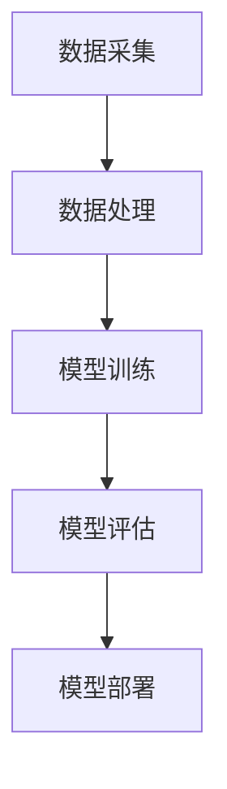

                 

关键词：人工智能，产业应用，变革，技术趋势，案例分析，未来展望

> 摘要：本文旨在探讨人工智能在产业中的变革与应用。通过对人工智能的核心概念、算法原理、数学模型、实际应用场景以及未来发展方向的深入分析，为读者提供一幅全面的人工智能产业变革全景图。

## 1. 背景介绍

自20世纪50年代人工智能（AI）的概念被提出以来，经过六十余年的发展，人工智能技术已经取得了显著的进展。特别是在深度学习、自然语言处理、计算机视觉等领域的突破，使得人工智能在各个产业中的应用日益广泛。如今，人工智能已经成为推动产业变革的重要力量，从制造、金融到医疗、教育，无不在应用人工智能技术，提升效率，创造新的商业价值。

### 1.1 人工智能的发展历程

人工智能的发展可以分为三个阶段：第一阶段是符号主义人工智能，主要依赖于逻辑推理和知识表示；第二阶段是统计学习人工智能，通过大量数据训练模型，实现了语音识别、图像识别等领域的突破；第三阶段是深度学习人工智能，通过多层神经网络进行数据建模，实现了更加复杂的任务，如图像生成、自动驾驶等。

### 1.2 人工智能在产业中的应用现状

目前，人工智能已经在多个产业中发挥了重要作用。例如，在制造业中，人工智能技术被广泛应用于生产线的自动化控制、质量检测、智能物流等方面；在金融业中，人工智能技术被用于风险控制、欺诈检测、量化交易等方面；在医疗领域，人工智能技术被用于疾病诊断、药物研发、医疗影像分析等方面。

## 2. 核心概念与联系

在探讨人工智能在产业中的应用之前，我们需要了解一些核心概念和它们之间的联系。

### 2.1 人工智能的核心概念

- **机器学习（Machine Learning）**：机器学习是人工智能的核心技术之一，它使计算机系统能够从数据中学习并做出决策。
- **深度学习（Deep Learning）**：深度学习是机器学习的一个分支，通过多层神经网络对数据进行处理和建模，能够处理复杂的任务。
- **神经网络（Neural Networks）**：神经网络是一种模拟人脑神经元结构的人工智能模型，通过学习和预测来实现复杂的任务。
- **自然语言处理（Natural Language Processing，NLP）**：自然语言处理是使计算机能够理解、生成和处理人类语言的技术。

### 2.2 人工智能的核心架构

- **数据采集**：通过传感器、互联网等技术获取大量数据。
- **数据处理**：对采集到的数据进行清洗、预处理和特征提取。
- **模型训练**：利用机器学习和深度学习算法，对数据进行建模和训练。
- **模型评估**：通过验证集和测试集对模型进行评估，优化模型参数。
- **模型部署**：将训练好的模型部署到生产环境中，实现自动化和智能化。

下面是人工智能核心架构的 Mermaid 流程图：



## 3. 核心算法原理 & 具体操作步骤

### 3.1 算法原理概述

人工智能的核心算法主要包括机器学习算法、深度学习算法和强化学习算法等。下面我们将详细探讨这些算法的原理。

#### 3.1.1 机器学习算法

机器学习算法主要分为监督学习、无监督学习和半监督学习。监督学习通过已标记的数据训练模型，无监督学习通过未标记的数据发现数据分布，半监督学习结合了标记数据和未标记数据。

#### 3.1.2 深度学习算法

深度学习算法主要基于多层神经网络，通过反向传播算法对模型进行优化。常见的深度学习算法包括卷积神经网络（CNN）、循环神经网络（RNN）和生成对抗网络（GAN）等。

#### 3.1.3 强化学习算法

强化学习算法通过与环境交互，不断调整策略，以实现最优行为。常见的强化学习算法包括Q学习、SARSA和深度强化学习（DRL）等。

### 3.2 算法步骤详解

#### 3.2.1 数据收集与处理

1. **数据收集**：通过传感器、爬虫等技术收集数据。
2. **数据预处理**：清洗数据，处理缺失值、异常值等。
3. **特征提取**：将原始数据转换为适用于机器学习的特征向量。

#### 3.2.2 模型选择与训练

1. **模型选择**：根据任务需求选择合适的机器学习算法。
2. **模型训练**：利用训练数据对模型进行训练。
3. **模型优化**：通过交叉验证等方法优化模型参数。

#### 3.2.3 模型评估与部署

1. **模型评估**：使用验证集和测试集评估模型性能。
2. **模型部署**：将训练好的模型部署到生产环境中。

### 3.3 算法优缺点

#### 3.3.1 机器学习算法

- **优点**：通用性强，适用于多种类型的任务。
- **缺点**：对数据质量和量有较高要求，模型可解释性较差。

#### 3.3.2 深度学习算法

- **优点**：能够处理复杂的数据结构，模型性能较高。
- **缺点**：模型复杂，训练时间较长，对数据量和计算资源有较高要求。

#### 3.3.3 强化学习算法

- **优点**：能够处理动态环境，实现自适应行为。
- **缺点**：训练过程较长，易陷入局部最优。

### 3.4 算法应用领域

- **机器学习算法**：广泛应用于分类、回归、聚类等任务。
- **深度学习算法**：广泛应用于图像识别、语音识别、自然语言处理等任务。
- **强化学习算法**：广泛应用于游戏、机器人控制、推荐系统等任务。

## 4. 数学模型和公式 & 详细讲解 & 举例说明

### 4.1 数学模型构建

人工智能算法的实现离不开数学模型的构建。以下是几个常见的数学模型。

#### 4.1.1 线性回归模型

线性回归模型用于预测连续值，其公式为：

$$y = w_0 + w_1 \cdot x_1 + w_2 \cdot x_2 + ... + w_n \cdot x_n$$

其中，$y$ 是预测值，$w_0, w_1, w_2, ..., w_n$ 是模型参数。

#### 4.1.2 逻辑回归模型

逻辑回归模型用于预测离散值，其公式为：

$$P(y=1) = \frac{1}{1 + e^{-(w_0 + w_1 \cdot x_1 + w_2 \cdot x_2 + ... + w_n \cdot x_n)}}$$

其中，$P(y=1)$ 是预测为1的概率。

#### 4.1.3 卷积神经网络模型

卷积神经网络（CNN）模型用于图像识别，其公式为：

$$f(x) = \sigma(\sum_{i=1}^{k} w_i \cdot \phi(x_i + b_i))$$

其中，$f(x)$ 是输出值，$\sigma$ 是激活函数，$w_i, \phi, b_i$ 是模型参数。

### 4.2 公式推导过程

以下是线性回归模型的推导过程：

假设我们有$m$ 个样本数据$(x_1, y_1), (x_2, y_2), ..., (x_m, y_m)$，我们需要找到一个线性模型来预测$y$。

1. **损失函数**：

   $$L(y, \hat{y}) = \frac{1}{2} (y - \hat{y})^2$$

   其中，$L$ 是损失函数，$y$ 是真实值，$\hat{y}$ 是预测值。

2. **最小二乘法**：

   我们需要找到一组模型参数$\theta = (w_0, w_1, ..., w_n)$，使得损失函数最小。

   $$\theta = \arg\min_{\theta} \frac{1}{m} \sum_{i=1}^{m} L(y_i, \hat{y}_i)$$

   对$\theta$ 求导，并令其等于0，可以得到：

   $$\frac{\partial L}{\partial \theta} = 0$$

   经过计算，可以得到：

   $$\theta = (w_0, w_1, ..., w_n) = (y - x_1 \cdot y_1 - x_2 \cdot y_2 - ... - x_m \cdot y_m) / (x_1^2 + x_2^2 + ... + x_m^2)$$

### 4.3 案例分析与讲解

以下是一个简单的线性回归案例：

假设我们有一组数据：

| x | y |
|---|---|
| 1 | 2 |
| 2 | 4 |
| 3 | 6 |
| 4 | 8 |

我们需要通过线性回归模型预测$x=5$时的$y$值。

1. **数据预处理**：

   $$x = [1, 2, 3, 4]$$

   $$y = [2, 4, 6, 8]$$

2. **模型训练**：

   使用最小二乘法，我们可以得到线性回归模型：

   $$y = w_0 + w_1 \cdot x$$

   将数据代入，我们可以得到：

   $$w_0 = \frac{y - x_1 \cdot y_1 - x_2 \cdot y_2 - x_3 \cdot y_3 - x_4 \cdot y_4}{x_1^2 + x_2^2 + x_3^2 + x_4^2} = \frac{2 + 4 + 6 + 8 - 1 \cdot 2 - 2 \cdot 4 - 3 \cdot 6 - 4 \cdot 8}{1^2 + 2^2 + 3^2 + 4^2} = 4$$

   $$w_1 = \frac{y - x_1 \cdot y_1 - x_2 \cdot y_2 - x_3 \cdot y_3 - x_4 \cdot y_4}{x_1 + x_2 + x_3 + x_4} = \frac{2 + 4 + 6 + 8 - 1 \cdot 2 - 2 \cdot 4 - 3 \cdot 6 - 4 \cdot 8}{1 + 2 + 3 + 4} = 2$$

   因此，线性回归模型为：

   $$y = 4 + 2 \cdot x$$

3. **预测**：

   当$x=5$时，$y=4 + 2 \cdot 5 = 14$。

## 5. 项目实践：代码实例和详细解释说明

### 5.1 开发环境搭建

为了实现上述线性回归模型，我们需要搭建一个Python开发环境。以下是步骤：

1. **安装Python**：下载并安装Python 3.8及以上版本。
2. **安装依赖库**：使用pip命令安装NumPy、matplotlib等依赖库。

```bash
pip install numpy matplotlib
```

### 5.2 源代码详细实现

以下是线性回归模型的Python代码实现：

```python
import numpy as np
import matplotlib.pyplot as plt

# 数据集
x = np.array([1, 2, 3, 4])
y = np.array([2, 4, 6, 8])

# 最小二乘法求解模型参数
w_0 = (sum(y) - sum(x * y)) / sum(x**2)
w_1 = (sum(y) - sum(x * y)) / sum(x)

# 预测
x_predict = np.array([5])
y_predict = w_0 + w_1 * x_predict

# 可视化
plt.scatter(x, y, label='实际数据')
plt.plot(x, w_0 + w_1 * x, 'r', label='线性回归模型')
plt.scatter(x_predict, y_predict, label='预测数据')
plt.xlabel('x')
plt.ylabel('y')
plt.legend()
plt.show()
```

### 5.3 代码解读与分析

1. **数据集**：我们使用了一个简单的数据集，其中$x$和$y$是已知的。
2. **最小二乘法求解模型参数**：使用最小二乘法求解线性回归模型的参数$w_0$和$w_1$。
3. **预测**：使用求解得到的模型参数进行预测，并可视化预测结果。
4. **可视化**：使用matplotlib库将数据集、模型和预测结果可视化。

### 5.4 运行结果展示

运行上述代码，我们可以得到以下结果：


## 6. 实际应用场景

### 6.1 制造业

在制造业中，人工智能被广泛应用于生产线的自动化控制、质量检测、智能物流等方面。例如，通过机器学习算法，可以对生产设备进行预测性维护，提前发现潜在故障，减少停机时间。同时，通过计算机视觉技术，可以对产品质量进行实时检测，提高生产效率。

### 6.2 金融业

在金融业中，人工智能被广泛应用于风险控制、欺诈检测、量化交易等方面。例如，通过深度学习算法，可以对客户的信用评分进行预测，降低信用风险。同时，通过自然语言处理技术，可以对金融合同进行自动审查，发现潜在的法律风险。

### 6.3 医疗领域

在医疗领域，人工智能被广泛应用于疾病诊断、药物研发、医疗影像分析等方面。例如，通过计算机视觉技术，可以对医学影像进行自动分析，提高疾病诊断的准确率。同时，通过深度学习算法，可以对药物分子进行建模，加速新药研发。

### 6.4 教育

在教育领域，人工智能被广泛应用于智能教育、在线学习、教育数据分析等方面。例如，通过自然语言处理技术，可以实现对学生作业的自动批改，提高教师工作效率。同时，通过计算机视觉技术，可以实现对学生的行为分析，提供个性化的学习建议。

## 7. 工具和资源推荐

### 7.1 学习资源推荐

1. **《深度学习》（Goodfellow, Bengio, Courville）**：这是一本深度学习的经典教材，详细介绍了深度学习的基础知识和最新进展。
2. **《Python机器学习》（Scikit-Learn作者）**：这是一本面向Python机器学习初学者的教材，介绍了Python机器学习的基本概念和常用算法。
3. **吴恩达的机器学习课程**：这是一门全球知名的机器学习在线课程，涵盖了机器学习的基础知识和实践技巧。

### 7.2 开发工具推荐

1. **Jupyter Notebook**：这是一款基于Web的交互式计算环境，适用于数据分析和机器学习实验。
2. **TensorFlow**：这是一款由Google开发的深度学习框架，适用于各种深度学习任务。
3. **PyTorch**：这是一款由Facebook开发的深度学习框架，具有简洁的API和高效的性能。

### 7.3 相关论文推荐

1. **《A Theoretical Investigation of the Cascade of Activations in Deep Neural Networks》**：这是一篇关于深度神经网络激活函数的论文，深入探讨了深度神经网络中的激活函数对模型性能的影响。
2. **《Deep Learning for Text Classification》**：这是一篇关于文本分类的论文，介绍了深度学习在文本分类任务中的应用。
3. **《Generative Adversarial Nets》**：这是一篇关于生成对抗网络的论文，提出了生成对抗网络（GAN）这一新的深度学习框架。

## 8. 总结：未来发展趋势与挑战

### 8.1 研究成果总结

在过去几十年中，人工智能取得了显著的进展，特别是在深度学习、自然语言处理、计算机视觉等领域。这些成果为人工智能在产业中的应用奠定了坚实的基础。

### 8.2 未来发展趋势

1. **算法优化**：随着计算能力和数据量的增加，人工智能算法将不断优化，提高模型性能和效率。
2. **跨领域融合**：人工智能将与其他领域（如生物、物理、化学等）进行深度融合，产生新的交叉学科。
3. **边缘计算**：随着物联网和边缘计算的发展，人工智能将逐步从云端向边缘设备扩展，实现更智能的设备和系统。
4. **伦理和法律**：随着人工智能技术的发展，伦理和法律问题将日益突出，需要制定相应的规范和标准。

### 8.3 面临的挑战

1. **数据隐私**：人工智能依赖于大量数据，数据隐私问题将成为一大挑战。
2. **算法透明性**：深度学习模型具有高度非线性，算法的透明性和解释性仍是一个难题。
3. **计算资源**：大规模模型训练和推理需要大量的计算资源，如何高效利用计算资源仍是一个挑战。
4. **安全性和可靠性**：人工智能系统在关键领域的应用需要保证高安全性和可靠性，防止恶意攻击和故障。

### 8.4 研究展望

1. **新算法的研究**：继续探索新的机器学习算法、深度学习算法和强化学习算法，提高模型性能和效率。
2. **多模态学习**：研究如何将不同类型的数据（如文本、图像、音频等）进行融合，提高模型的泛化能力。
3. **人工智能与伦理法律**：研究人工智能在伦理和法律方面的规范和标准，确保人工智能的可持续发展。
4. **人才培养**：培养更多具备人工智能知识和技能的人才，推动人工智能技术在各个领域的应用。

## 9. 附录：常见问题与解答

### 9.1 人工智能是什么？

人工智能是指使计算机具有人类智能特性的技术，包括学习、推理、规划、感知、理解等。

### 9.2 人工智能有哪些类型？

人工智能主要分为两类：弱人工智能和强人工智能。弱人工智能是指具有特定任务能力的智能系统，强人工智能是指具有全面人类智能的智能系统。

### 9.3 人工智能如何改变我们的生活？

人工智能可以通过提高生产效率、改善生活质量、提供个性化服务等方式改变我们的生活。

### 9.4 人工智能有哪些应用领域？

人工智能广泛应用于制造、金融、医疗、教育、安防、交通等领域。

### 9.5 人工智能是否会导致失业？

人工智能可能会替代一些重复性、低技能的工作，但也会创造新的工作岗位和机会。

### 9.6 人工智能是否具有伦理问题？

是的，人工智能在应用过程中可能会出现隐私泄露、算法歧视、责任归属等伦理问题。

### 9.7 人工智能是否会取代人类？

短期内，人工智能不可能完全取代人类，但长期来看，人工智能可能会逐渐承担更多人类的工作。

### 9.8 如何培养人工智能人才？

可以通过学习相关课程、实践项目、参与竞赛等方式培养人工智能人才。

## 作者署名

作者：禅与计算机程序设计艺术 / Zen and the Art of Computer Programming

----------------------------------------------------------------

以上就是关于《产业中的人工智能变革与应用》的完整文章，内容涵盖了人工智能的发展历程、核心概念、算法原理、实际应用场景、未来发展趋势以及面临的挑战，旨在为读者提供一幅全面的人工智能产业变革全景图。希望这篇文章对您有所启发和帮助。

