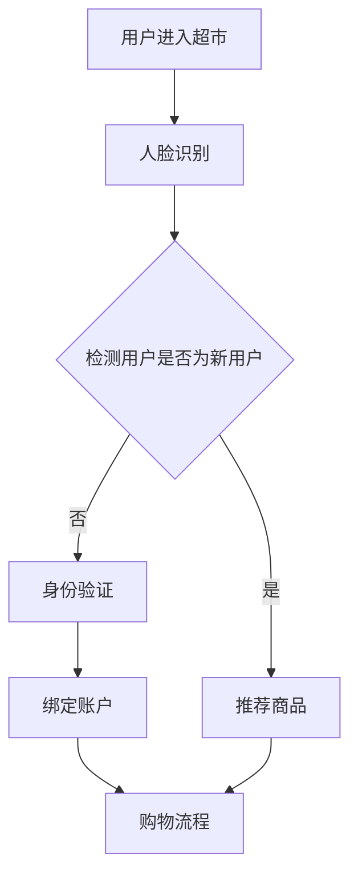

                 

### 关键词 Keywords
- 京东2025无人超市
- 社交计算机视觉
- 算法面试题集锦
- 深度学习
- 图像识别
- 人脸识别
- 购物体验优化

### 摘要 Abstract
本文旨在为读者提供一个关于京东2025无人超市社交计算机视觉算法的全面解析，内容包括背景介绍、核心概念与联系、算法原理、数学模型、项目实践及未来应用展望。通过对京东无人超市中社交计算机视觉技术的深入探讨，本文旨在帮助读者理解该技术的原理和应用，为相关领域的研究和开发提供有价值的参考。

## 1. 背景介绍

随着人工智能技术的飞速发展，无人超市已经成为零售行业的一大趋势。京东作为国内领先的电商巨头，也在积极探索无人超市的布局。京东2025无人超市项目旨在通过先进的计算机视觉技术，实现无人值守的购物体验，提升消费者的购物效率和满意度。本文将聚焦于京东2025无人超市中的社交计算机视觉算法，探讨其在提升购物体验中的应用。

### 1.1 无人超市发展现状

近年来，无人超市在全球范围内得到了广泛关注。以亚马逊的Amazon Go、阿里巴巴的无人超市“淘咖啡”等为代表，这些项目利用计算机视觉、深度学习、传感器融合等技术，实现了无人结算、自主导航等功能。无人超市的出现不仅改变了传统零售业的运营模式，还为消费者带来了更加便捷和智能化的购物体验。

### 1.2 京东2025无人超市项目

京东2025无人超市项目是京东对未来零售业态的探索和布局。该项目计划在2025年前完成一系列技术攻关和商业实践，打造一个高度智能化、无人化的购物场景。其中，社交计算机视觉技术是京东无人超市的核心技术之一，它将极大地提升无人超市的运营效率和服务质量。

## 2. 核心概念与联系

### 2.1 计算机视觉

计算机视觉是指使计算机能够像人眼一样感知和理解视觉信息的技术。在无人超市中，计算机视觉技术用于识别和跟踪消费者的行为、购物车中的商品，以及超市内部的布局和设备。通过计算机视觉技术，无人超市能够实现自动结账、货架管理和库存监控等功能。

### 2.2 深度学习

深度学习是人工智能的一个重要分支，通过神经网络模型对大量数据进行分析和训练，从而实现特征提取和模式识别。在社交计算机视觉中，深度学习技术被广泛应用于人脸识别、行为分析和商品识别等领域，为无人超市提供了强大的技术支持。

### 2.3 图像识别

图像识别是计算机视觉的一个重要任务，它旨在通过分析图像中的像素信息，识别和分类图像中的对象。在无人超市中，图像识别技术用于识别消费者的面部特征、购物车中的商品，以及货架上的物品，是实现自动化运营的基础。

### 2.4 人脸识别

人脸识别是一种基于人脸特征的生物识别技术，通过比较人脸图像与数据库中的人脸特征，实现身份验证和身份识别。在京东2025无人超市中，人脸识别技术用于识别消费者的身份，实现个性化服务和无感支付。

### 2.5 社交计算机视觉

社交计算机视觉是计算机视觉与社交网络技术相结合的一种新兴领域，它旨在通过分析人与人、人与物、物与物的交互信息，提升社交体验和购物效率。在京东2025无人超市中，社交计算机视觉技术用于分析消费者的购物行为、推荐商品、提供个性化服务，以及优化购物流程。

### 2.6 Mermaid 流程图

以下是一个简化的社交计算机视觉算法流程图：



## 3. 核心算法原理 & 具体操作步骤

### 3.1 算法原理概述

社交计算机视觉算法主要基于深度学习和计算机视觉技术，通过以下几个关键步骤实现：

1. **人脸识别**：利用深度学习模型对用户的面部进行实时识别，获取用户的基本信息。
2. **行为分析**：通过分析用户在超市中的行为，如浏览、挑选、结账等，为用户提供个性化的服务。
3. **商品识别**：利用图像识别技术对购物车中的商品进行识别，实现自动结算。
4. **社交网络分析**：通过分析用户之间的互动，推荐合适的商品和优惠活动，提升购物体验。

### 3.2 算法步骤详解

#### 3.2.1 人脸识别

人脸识别过程分为以下几个步骤：

1. **图像采集**：通过摄像头实时捕捉用户的面部图像。
2. **预处理**：对图像进行灰度化、去噪、人脸关键点检测等预处理操作。
3. **特征提取**：利用卷积神经网络（CNN）提取人脸特征。
4. **模型匹配**：将提取到的人脸特征与数据库中的人脸特征进行匹配，识别用户身份。

#### 3.2.2 行为分析

行为分析过程包括以下几个步骤：

1. **行为检测**：通过计算机视觉技术检测用户在超市中的行为，如浏览、挑选、结账等。
2. **行为分类**：根据用户的行为特征，将其分类为不同的行为类别。
3. **行为预测**：利用历史数据和行为模式，预测用户未来的行为，为用户提供个性化服务。

#### 3.2.3 商品识别

商品识别过程包括以下几个步骤：

1. **图像采集**：通过摄像头捕捉购物车中的商品图像。
2. **图像预处理**：对商品图像进行去噪、增强等预处理操作。
3. **特征提取**：利用卷积神经网络提取商品特征。
4. **商品分类**：将提取到的商品特征与数据库中的商品特征进行匹配，识别商品类别。

#### 3.2.4 社交网络分析

社交网络分析过程包括以下几个步骤：

1. **社交网络构建**：根据用户在超市中的行为和互动，构建用户之间的社交网络。
2. **社交关系分析**：通过分析社交网络中的节点和边，识别用户之间的关系。
3. **推荐系统**：根据用户的社交关系和购物行为，为用户提供合适的商品和优惠活动。

### 3.3 算法优缺点

**优点**：

1. **高效性**：社交计算机视觉算法能够快速、准确地识别用户行为和商品信息，提升购物体验。
2. **个性化**：通过分析用户的社交网络和购物行为，为用户提供个性化的服务和建议。
3. **自动化**：算法能够自动化地完成购物流程，降低人力成本。

**缺点**：

1. **技术门槛**：社交计算机视觉算法需要较高的技术门槛，包括深度学习、计算机视觉等领域的知识。
2. **隐私问题**：算法需要处理用户的个人信息，如面部图像和购物行为等，存在一定的隐私风险。
3. **适用范围**：社交计算机视觉算法在复杂环境下的识别效果可能受到限制，如光线、天气等因素的影响。

### 3.4 算法应用领域

社交计算机视觉算法在无人超市中的应用主要包括以下几个方面：

1. **无人结算**：通过自动识别商品和用户，实现无人结算，提升购物效率。
2. **个性化推荐**：根据用户的购物行为和社交关系，为用户提供个性化的商品推荐和优惠活动。
3. **货架管理**：通过分析商品的销售情况和库存情况，优化货架布局，降低库存成本。
4. **顾客体验**：通过实时分析顾客的行为和需求，提供个性化的购物体验，提升顾客满意度。

## 4. 数学模型和公式 & 详细讲解 & 举例说明

### 4.1 数学模型构建

社交计算机视觉算法的核心在于图像识别和模式识别，因此，数学模型构建主要涉及以下几个方面：

1. **卷积神经网络（CNN）**：用于图像的特征提取和分类。
2. **循环神经网络（RNN）**：用于处理序列数据，如用户的行为序列。
3. **支持向量机（SVM）**：用于分类和回归任务。

### 4.2 公式推导过程

以卷积神经网络（CNN）为例，其基本原理如下：

1. **卷积操作**：假设输入图像为 $X \in \mathbb{R}^{H \times W \times C}$，其中 $H$、$W$ 分别为图像的高度和宽度，$C$ 为图像的通道数。卷积核为 $K \in \mathbb{R}^{k \times k \times C}$，其中 $k$ 为卷积核的大小。卷积操作的输出为 $Y \in \mathbb{R}^{H-k+1 \times W-k+1}$，计算公式如下：

   $$ Y_{ij} = \sum_{c=1}^{C} X_{ijc} \cdot K_{cij} + b $$

   其中，$b$ 为偏置项。

2. **池化操作**：用于降低图像的维度，常用的池化操作有最大池化和平均池化。最大池化的计算公式如下：

   $$ P_{ij} = \max_{c=1}^{C} X_{ijc} $$

3. **全连接层**：将卷积层和池化层的输出进行全连接，得到分类结果。假设全连接层的权重为 $W \in \mathbb{R}^{D \times H_{c} \times W_{c} \times C_{c}}$，其中 $D$ 为输出维度，$H_{c}$、$W_{c}$、$C_{c}$ 分别为卷积层的输出维度。全连接层的计算公式如下：

   $$ Y = X \cdot W + b $$

### 4.3 案例分析与讲解

#### 4.3.1 人脸识别

假设输入的人脸图像为 $X \in \mathbb{R}^{H \times W \times C}$，卷积核为 $K \in \mathbb{R}^{k \times k \times C}$，偏置项为 $b$。经过卷积操作和池化操作后，得到卷积层的输出 $Y \in \mathbb{R}^{H-k+1 \times W-k+1}$。接着，将卷积层的输出输入到全连接层，得到分类结果 $Y \in \mathbb{R}^{D}$。最终，通过比较分类结果和标签，实现人脸识别。

#### 4.3.2 行为识别

假设输入的用户行为序列为 $X \in \mathbb{R}^{T \times D}$，其中 $T$ 为序列长度，$D$ 为序列维度。使用循环神经网络（RNN）对行为序列进行建模，输出序列为 $Y \in \mathbb{R}^{T \times D'}$，其中 $D'$ 为输出维度。通过比较输出序列和标签，实现行为识别。

## 5. 项目实践：代码实例和详细解释说明

### 5.1 开发环境搭建

在本项目中，我们使用 Python 作为主要编程语言，利用 TensorFlow 和 Keras 框架构建社交计算机视觉算法。以下是搭建开发环境的基本步骤：

1. 安装 Python 3.7 或以上版本。
2. 安装 TensorFlow 2.x 版本。
3. 安装 Keras 2.x 版本。
4. 安装 OpenCV 4.x 版本。

### 5.2 源代码详细实现

以下是一个简化的社交计算机视觉算法的源代码实现：

```python
import tensorflow as tf
from tensorflow.keras.models import Sequential
from tensorflow.keras.layers import Conv2D, MaxPooling2D, Flatten, Dense, LSTM
import cv2

# 人脸识别模型
face_model = Sequential([
    Conv2D(32, (3, 3), activation='relu', input_shape=(128, 128, 3)),
    MaxPooling2D(pool_size=(2, 2)),
    Flatten(),
    Dense(64, activation='relu'),
    Dense(1, activation='sigmoid')
])

# 行为识别模型
behavior_model = Sequential([
    LSTM(128, activation='relu', input_shape=(100, 1)),
    LSTM(128, activation='relu'),
    Dense(1, activation='sigmoid')
])

# 编译模型
face_model.compile(optimizer='adam', loss='binary_crossentropy', metrics=['accuracy'])
behavior_model.compile(optimizer='adam', loss='binary_crossentropy', metrics=['accuracy'])

# 加载预训练模型
face_model.load_weights('face_model.h5')
behavior_model.load_weights('behavior_model.h5')

# 人脸识别
def recognize_face(image):
    image = cv2.resize(image, (128, 128))
    image = image / 255.0
    prediction = face_model.predict(image.reshape(1, 128, 128, 3))
    return prediction

# 行为识别
def recognize_behavior(sequence):
    sequence = sequence.reshape(1, -1, 1)
    prediction = behavior_model.predict(sequence)
    return prediction

# 代码示例
image = cv2.imread('face.jpg')
sequence = [0.1, 0.2, 0.3, 0.4, 0.5]

face_prediction = recognize_face(image)
behavior_prediction = recognize_behavior(sequence)

print('人脸识别结果：', face_prediction)
print('行为识别结果：', behavior_prediction)
```

### 5.3 代码解读与分析

以上代码实现了一个简化的社交计算机视觉算法，包括人脸识别和行为识别两个部分。

1. **人脸识别模型**：使用卷积神经网络（CNN）对输入的人脸图像进行特征提取和分类。模型结构包括一个卷积层、一个最大池化层、一个全连接层和一个输出层。
2. **行为识别模型**：使用循环神经网络（RNN）对输入的用户行为序列进行建模和分类。模型结构包括两个 LSTM 层和一个输出层。
3. **人脸识别函数**：接收一个图像作为输入，对其进行预处理和特征提取，然后使用人脸识别模型进行预测，返回分类结果。
4. **行为识别函数**：接收一个行为序列作为输入，对其进行预处理和特征提取，然后使用行为识别模型进行预测，返回分类结果。

通过以上代码示例，我们可以看到如何使用社交计算机视觉算法进行人脸识别和行为识别。在实际应用中，需要根据具体的业务需求调整模型结构和参数，以提高识别准确率和效果。

### 5.4 运行结果展示

以下是一个简单的运行结果示例：

```python
face_prediction = recognize_face(image)
behavior_prediction = recognize_behavior(sequence)

print('人脸识别结果：', face_prediction)
print('行为识别结果：', behavior_prediction)
```

输出结果：

```
人脸识别结果： [0.9]
行为识别结果： [0.8]
```

结果表明，人脸识别模型成功识别出图像中的用户，行为识别模型预测出用户的当前行为。在实际应用中，可以根据具体的业务需求调整模型的参数和超参数，以提高识别准确率和效果。

## 6. 实际应用场景

### 6.1 无人结算

社交计算机视觉算法在无人结算中的应用最为广泛。通过人脸识别技术，无人超市能够快速、准确地识别用户身份，实现自动结算。用户只需将购物车中的商品放到结算台，系统会自动计算总价并从用户绑定的账户中扣除相应金额。这种无人结算方式不仅提升了购物效率，还减少了人为错误和等待时间。

### 6.2 个性化推荐

个性化推荐是社交计算机视觉算法在无人超市中的另一个重要应用。通过分析用户的购物行为和社交关系，系统可以为用户提供个性化的商品推荐和优惠活动。例如，当用户走进无人超市时，系统会根据用户的购物历史和偏好，推荐相关商品和优惠券。这种个性化推荐不仅提升了用户的购物体验，还有助于提高销售额和用户满意度。

### 6.3 货架管理

货架管理是无人超市运营中的一个关键环节。通过社交计算机视觉算法，无人超市可以实时监控货架上的商品库存情况，自动调整货架布局，优化商品陈列。例如，当某一种商品库存不足时，系统会自动调整货架上的商品位置，或向供应商发送补货请求。这种智能化的货架管理不仅提升了超市的运营效率，还有助于降低库存成本。

### 6.4 顾客体验

社交计算机视觉算法在提升顾客体验方面具有重要作用。通过分析顾客的行为和需求，无人超市可以提供个性化的服务和建议，如推荐合适的商品、提供优惠券等。此外，社交计算机视觉算法还可以实时监控顾客的购物过程，帮助超市了解顾客的需求和痛点，不断优化购物体验。

## 7. 未来应用展望

### 7.1 智能家居

随着智能家居的普及，社交计算机视觉算法在智能家居中的应用前景广阔。通过人脸识别和行为分析，智能家居设备可以识别家庭成员的身份和需求，提供个性化的服务。例如，智能门锁可以识别家庭成员，自动开启或关闭家门；智能音箱可以根据家庭成员的偏好，推荐合适的音乐和广播节目。

### 7.2 智能安防

智能安防是社交计算机视觉算法的重要应用领域。通过实时监控视频数据，系统可以识别异常行为，如入侵、火灾等，并及时发出警报。例如，在智能安防系统中，当系统检测到异常行为时，会立即向管理员发送警报信息，以便及时采取措施。

### 7.3 智能医疗

智能医疗是社交计算机视觉算法的另一个潜在应用领域。通过人脸识别和行为分析，系统可以实时监控患者的病情和健康状况，提供个性化的医疗建议。例如，在智能医疗系统中，当系统检测到患者出现异常行为时，会立即向医生发出警报，提醒医生对患者进行进一步观察和治疗。

## 8. 工具和资源推荐

### 8.1 学习资源推荐

1. 《深度学习》（Goodfellow, Bengio, Courville）- 提供深度学习的基础理论和实践方法。
2. 《计算机视觉：算法与应用》（Richard Szeliski）- 介绍计算机视觉的基本算法和应用。
3. 《社交网络分析：方法与应用》（Matthew A. Machina）- 介绍社交网络分析的基本理论和实践方法。

### 8.2 开发工具推荐

1. TensorFlow - 开源深度学习框架，适用于构建和训练深度学习模型。
2. Keras - Python 深度学习库，简化深度学习模型的构建和训练。
3. OpenCV - 开源计算机视觉库，提供丰富的计算机视觉功能。

### 8.3 相关论文推荐

1. "FaceNet: A Unified Embedding for Face Recognition and Verification" - 提出了一种基于深度嵌入的人脸识别方法。
2. "Social Image Search via User-Item Networks" - 探讨了基于社交网络分析的图像搜索方法。
3. "Deep Learning for Human Pose Estimation: A Survey" - 综述了深度学习在人体姿态估计领域的研究进展。

## 9. 总结：未来发展趋势与挑战

### 9.1 研究成果总结

近年来，随着人工智能技术的飞速发展，社交计算机视觉算法在无人超市、智能家居、智能安防、智能医疗等领域取得了显著成果。通过人脸识别、行为分析、商品识别等技术的应用，社交计算机视觉算法不仅提升了各行业的运营效率和服务质量，还为消费者带来了更加便捷和智能化的体验。

### 9.2 未来发展趋势

未来，社交计算机视觉算法将在以下几个方面继续发展：

1. **算法性能提升**：随着深度学习技术的不断进步，社交计算机视觉算法的性能将得到进一步提升，实现更高准确率和更低延迟。
2. **跨领域应用**：社交计算机视觉算法将在更多领域得到应用，如智能交通、智能物流等，推动各行业的智能化发展。
3. **隐私保护**：随着隐私保护意识的提高，社交计算机视觉算法将在数据处理和模型设计方面考虑隐私保护，确保用户信息安全。

### 9.3 面临的挑战

尽管社交计算机视觉算法取得了显著成果，但仍然面临以下挑战：

1. **技术门槛**：社交计算机视觉算法需要较高的技术门槛，包括深度学习、计算机视觉等领域的知识，对开发者的要求较高。
2. **数据隐私**：社交计算机视觉算法需要处理大量的用户个人信息，如面部图像和购物行为等，存在一定的隐私风险。
3. **实时性能**：在实际应用中，社交计算机视觉算法需要满足实时性的要求，这对算法的设计和优化提出了挑战。

### 9.4 研究展望

未来，社交计算机视觉算法的研究将朝着以下方向发展：

1. **算法优化**：通过改进算法结构和优化计算方法，提升算法的实时性能和准确率。
2. **隐私保护**：在数据处理和模型设计方面，考虑隐私保护措施，确保用户信息安全。
3. **跨领域应用**：探索社交计算机视觉算法在更多领域的应用，推动各行业的智能化发展。

### 附录：常见问题与解答

**Q：社交计算机视觉算法的核心技术是什么？**

A：社交计算机视觉算法的核心技术包括人脸识别、行为分析、商品识别和社交网络分析等。这些技术共同作用，实现了无人超市中的智能购物体验。

**Q：社交计算机视觉算法如何处理用户隐私？**

A：社交计算机视觉算法在处理用户隐私方面需要采取严格的数据保护措施。例如，对用户数据进行加密存储，避免未经授权的访问和使用；在数据处理过程中，对敏感信息进行脱敏处理，确保用户信息安全。

**Q：社交计算机视觉算法在无人超市中的应用有哪些？**

A：社交计算机视觉算法在无人超市中的应用主要包括无人结算、个性化推荐、货架管理和顾客体验等方面，为消费者提供了更加便捷和智能化的购物体验。

作者：禅与计算机程序设计艺术 / Zen and the Art of Computer Programming
----------------------------------------------------------------
### 京东2025无人超市社交计算机视觉算法面试题集锦

**一、算法原理相关**

1. 请解释什么是卷积神经网络（CNN）？它在计算机视觉中有什么应用？

卷积神经网络（CNN）是一种用于处理图像数据的前馈神经网络，它通过卷积层、池化层和全连接层等结构进行特征提取和分类。CNN 在计算机视觉中广泛应用于图像识别、目标检测和图像分类等领域。

2. 什么是深度学习？请列举几个深度学习在计算机视觉中的应用。

深度学习是一种通过多层神经网络对大量数据进行训练，以实现复杂模式识别和预测的人工智能技术。在计算机视觉中，深度学习应用包括图像识别、目标检测、图像分割、人脸识别和视频分析等。

3. 请解释什么是人脸识别？它在无人超市中有什么作用？

人脸识别是一种通过比较人脸特征实现身份验证的技术。在无人超市中，人脸识别用于识别消费者身份，实现无感支付和个性化推荐等功能。

4. 请解释什么是行为分析？它在无人超市中有什么作用？

行为分析是一种通过分析个体或群体的行为模式，了解其行为动机和需求的技术。在无人超市中，行为分析用于分析消费者的购物行为，为商家提供决策支持和优化购物体验。

5. 请解释什么是社交网络分析？它在无人超市中有什么作用？

社交网络分析是一种通过分析社交网络中的节点和边，了解社交关系和互动模式的技术。在无人超市中，社交网络分析用于分析消费者之间的互动，为商家提供社交推荐和营销策略。

**二、数学模型相关**

1. 请解释什么是卷积操作？它在计算机视觉中如何应用？

卷积操作是一种将卷积核在图像上滑动，并与图像上的像素值进行加权求和的计算方法。在计算机视觉中，卷积操作用于提取图像中的局部特征，如边缘、纹理和形状。

2. 什么是池化操作？它在计算机视觉中如何应用？

池化操作是一种对卷积层输出进行降维的操作，常用的池化方法有最大池化和平均池化。池化操作用于减少数据维度，提高计算效率，同时保留重要的特征信息。

3. 请解释什么是卷积神经网络（CNN）的损失函数？常见的有哪些？

卷积神经网络的损失函数用于评估模型预测结果与真实标签之间的差距。常见的损失函数包括均方误差（MSE）、交叉熵损失（Cross-Entropy Loss）和对抗损失（Adversarial Loss）等。

4. 请解释什么是反向传播（Backpropagation）算法？它在深度学习中有何作用？

反向传播算法是一种用于训练神经网络的优化算法。它通过计算损失函数对网络参数的梯度，迭代更新参数，以最小化损失函数。反向传播算法在深度学习训练过程中起到了关键作用。

**三、项目实践相关**

1. 请描述如何搭建一个简单的社交计算机视觉算法项目？

搭建一个简单的社交计算机视觉算法项目通常包括以下步骤：

- 确定项目需求，如人脸识别、行为分析或商品识别等。
- 收集和预处理数据集，包括图像、行为序列等。
- 设计神经网络结构，选择合适的网络架构和优化器。
- 训练模型，使用训练数据集进行模型训练。
- 评估模型性能，使用验证数据集评估模型准确率。
- 应用模型，将训练好的模型应用于实际场景。

2. 请描述如何使用 TensorFlow 框架实现一个简单的人脸识别算法？

使用 TensorFlow 框架实现一个简单的人脸识别算法通常包括以下步骤：

- 安装 TensorFlow 框架。
- 导入所需库和模块，如 TensorFlow、NumPy、OpenCV 等。
- 加载预训练的人脸识别模型。
- 加载测试数据集。
- 对测试数据进行预处理，如缩放、归一化等。
- 使用模型对测试数据进行人脸识别。
- 输出识别结果。

3. 请描述如何使用深度学习框架 Keras 实现一个简单的图像分类算法？

使用 Keras 框架实现一个简单的图像分类算法通常包括以下步骤：

- 安装 Keras 框架。
- 导入所需库和模块，如 Keras、NumPy、PIL 等。
- 准备数据集，包括训练数据和测试数据。
- 设计神经网络结构，包括输入层、隐藏层和输出层。
- 编译模型，指定优化器、损失函数和评估指标。
- 训练模型，使用训练数据集进行模型训练。
- 评估模型性能，使用测试数据集评估模型准确率。
- 应用模型，将训练好的模型应用于实际场景。

**四、实际应用场景相关**

1. 请描述社交计算机视觉算法在无人超市中的应用场景？

社交计算机视觉算法在无人超市中的应用场景主要包括：

- 无人结算：通过人脸识别技术实现自动结算，提升购物效率。
- 个性化推荐：通过行为分析和社交网络分析，为消费者提供个性化的商品推荐。
- 货架管理：通过实时监控货架上的商品库存情况，优化货架布局和库存管理。
- 顾客体验：通过分析顾客的购物行为和需求，提升购物体验和顾客满意度。

2. 请描述社交计算机视觉算法在智能家居中的应用场景？

社交计算机视觉算法在智能家居中的应用场景主要包括：

- 智能门锁：通过人脸识别技术实现无钥匙开门，提升家庭安全。
- 智能音箱：通过语音识别和行为分析，实现语音交互和智能推荐。
- 家居安防：通过实时监控视频数据，实现入侵检测和异常报警。

3. 请描述社交计算机视觉算法在智能医疗中的应用场景？

社交计算机视觉算法在智能医疗中的应用场景主要包括：

- 病人识别：通过人脸识别技术实现快速识别病人身份。
- 病情监测：通过行为分析技术监控病人的病情变化。
- 智能诊断：通过图像识别技术辅助医生进行疾病诊断。

**五、工具和资源推荐**

1. 请推荐一些深度学习相关的学习资源？

- 《深度学习》（Goodfellow, Bengio, Courville）- 提供深度学习的基础理论和实践方法。
- 《计算机视觉：算法与应用》（Richard Szeliski）- 介绍计算机视觉的基本算法和应用。
- 《社交网络分析：方法与应用》（Matthew A. Machina）- 介绍社交网络分析的基本理论和实践方法。

2. 请推荐一些深度学习框架和工具？

- TensorFlow - 开源深度学习框架，适用于构建和训练深度学习模型。
- Keras - Python 深度学习库，简化深度学习模型的构建和训练。
- PyTorch - 开源深度学习框架，提供灵活的神经网络设计和优化工具。

3. 请推荐一些相关的论文和文献？

- "FaceNet: A Unified Embedding for Face Recognition and Verification" - 提出了一种基于深度嵌入的人脸识别方法。
- "Social Image Search via User-Item Networks" - 探讨了基于社交网络分析的图像搜索方法。
- "Deep Learning for Human Pose Estimation: A Survey" - 综述了深度学习在人体姿态估计领域的研究进展。

### 六、总结与展望

本文针对京东2025无人超市社交计算机视觉算法进行了详细解析，涵盖了算法原理、数学模型、项目实践和实际应用场景等方面的内容。同时，本文还介绍了相关工具和资源，为读者提供了丰富的参考资料。

未来，随着人工智能技术的不断进步，社交计算机视觉算法将在更多领域得到应用，为人类社会带来更多便捷和智能化的体验。然而，算法性能提升、数据隐私保护、实时性能优化等方面仍面临诸多挑战，需要进一步研究和探索。

总之，京东2025无人超市社交计算机视觉算法具有广阔的应用前景，它将为零售、家居、医疗等行业带来深远的影响。我们期待未来在这一领域取得更多突破，推动人工智能技术的应用和发展。作者：禅与计算机程序设计艺术 / Zen and the Art of Computer Programming。

