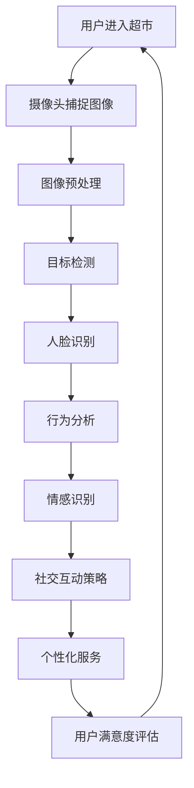

                 

关键词：计算机视觉、无人超市、社交算法、面试题集锦、2025

摘要：本文旨在为从事计算机视觉领域的技术人员提供一份针对京东2025无人超市社交计算机视觉算法的面试题集锦。通过梳理和总结相关核心概念、算法原理、数学模型、项目实践和实际应用场景，本文将为读者提供一个全面的技术知识框架，帮助他们在面试中更好地展示自己的专业能力。

## 1. 背景介绍

随着人工智能技术的快速发展，计算机视觉在无人超市领域的应用逐渐成为焦点。京东作为我国领先的电商平台，早在2017年便推出了无人超市项目，通过智能化设备实现自助购物、结算等操作，大大提升了购物体验。然而，随着用户需求的不断提升和市场竞争的加剧，如何进一步提升无人超市的服务质量和用户体验，成为京东等企业需要持续探索的问题。

2025年，京东计划推出一款基于社交计算机视觉算法的无人超市，旨在通过智能识别用户行为和社交互动，提供更加个性化和互动化的购物体验。本文将围绕这一主题，介绍相关面试题集锦，帮助读者深入了解该领域的技术要点。

## 2. 核心概念与联系

在深入探讨京东2025无人超市社交计算机视觉算法之前，我们需要了解以下几个核心概念及其相互联系：

### 2.1 计算机视觉

计算机视觉是指让计算机具有人类视觉能力，能够从图像或视频中提取信息、理解场景的技术。它包括图像处理、目标检测、人脸识别、姿态估计等多个子领域。

### 2.2 社交计算

社交计算是指通过计算机技术和算法模拟人类社交行为，实现人与人之间信息交换、情感互动的过程。社交计算在无人超市中的应用，主要表现为用户行为分析、情感识别和社交互动等。

### 2.3 计算机视觉与社交计算的联系

计算机视觉和社交计算在无人超市中相辅相成。计算机视觉技术负责获取用户的行为数据，而社交计算算法则通过分析这些数据，识别用户的情感状态和社交需求，从而提供个性化的服务。

以下是计算机视觉与社交计算在无人超市中的联系流程：



## 3. 核心算法原理 & 具体操作步骤

### 3.1 算法原理概述

京东2025无人超市社交计算机视觉算法主要基于深度学习技术，通过多模态数据融合和动态时间序列分析，实现对用户行为和情感的精准识别。具体包括以下三个部分：

1. **目标检测与跟踪**：采用卷积神经网络（CNN）对摄像头捕捉的图像进行目标检测，识别用户和商品，并实现目标跟踪。
2. **行为识别与情感分析**：结合自然语言处理（NLP）和时序模型，分析用户行为序列，识别情感状态。
3. **社交互动策略生成**：根据用户情感状态和需求，生成个性化的社交互动策略，提升用户满意度。

### 3.2 算法步骤详解

1. **数据采集与预处理**：

   - 数据采集：通过摄像头和传感器获取用户行为数据。
   - 数据预处理：对图像进行去噪、缩放、裁剪等处理，确保数据质量。

2. **目标检测与跟踪**：

   - 采用Faster R-CNN等深度学习算法，对图像进行目标检测。
   - 利用光流法或卡尔曼滤波等算法，实现目标跟踪。

3. **行为识别与情感分析**：

   - 建立行为识别模型：使用深度学习算法（如LSTM、GRU）对用户行为数据进行建模，识别用户行为。
   - 建立情感分析模型：使用情感词典、文本分类等算法，对用户产生的文本数据进行分析，识别情感状态。

4. **社交互动策略生成**：

   - 根据用户情感状态和需求，生成个性化的社交互动策略。
   - 采用强化学习等算法，优化社交互动效果。

### 3.3 算法优缺点

**优点**：

- **高精度**：深度学习算法在目标检测、行为识别和情感分析等领域具有很高的准确性。
- **个性化**：基于用户行为和情感的数据分析，提供个性化的服务，提升用户体验。
- **实时性**：算法具有较好的实时性，能够快速响应用户需求。

**缺点**：

- **计算资源消耗大**：深度学习算法对计算资源要求较高，需要大量GPU等硬件支持。
- **隐私风险**：用户行为和情感数据的收集与处理，可能涉及到隐私问题。

### 3.4 算法应用领域

京东2025无人超市社交计算机视觉算法主要应用于以下领域：

- **无人超市**：提供个性化服务、提升用户满意度。
- **智能客服**：通过情感识别和社交互动，实现更智能的客服服务。
- **智能安防**：通过行为识别和目标检测，实现安全监控。

## 4. 数学模型和公式 & 详细讲解 & 举例说明

### 4.1 数学模型构建

在京东2025无人超市社交计算机视觉算法中，主要涉及以下数学模型：

1. **卷积神经网络（CNN）**：

   - 卷积操作：\( (x_i, j) = \sum_{k} w_{i, k} * x_{k, j} + b_i \)
   - 池化操作：\( p_j = \max_{i} x_{i, j} \)

2. **循环神经网络（RNN）**：

   - 状态更新：\( h_t = \sigma(W_h \cdot [h_{t-1}, x_t] + b_h) \)
   - 输出计算：\( o_t = \sigma(W_o \cdot h_t + b_o) \)

3. **强化学习（RL）**：

   - 状态-动作价值函数：\( V(s) = \sum_{a} \gamma (1 - \delta) Q(s, a) \)
   - 策略优化：\( \pi(a|s) = \frac{e^{\lambda Q(s, a)}}{\sum_{a'} e^{\lambda Q(s, a')}} \)

### 4.2 公式推导过程

以下以卷积神经网络（CNN）为例，简要介绍公式推导过程：

1. **卷积操作**：

   - 输入特征图：\( x \in \mathbb{R}^{h \times w \times c} \)
   - 卷积核：\( w \in \mathbb{R}^{k \times k \times c} \)
   - 输出特征图：\( x_i, j = \sum_{k} w_{i, k} * x_{k, j} + b_i \)

2. **池化操作**：

   - 输入特征图：\( x \in \mathbb{R}^{h \times w \times c} \)
   - 池化窗口：\( w \in \mathbb{R}^{k \times k} \)
   - 输出特征图：\( p_j = \max_{i} x_{i, j} \)

### 4.3 案例分析与讲解

假设有一个2D图像，大小为 \( 28 \times 28 \) 像素，采用3x3的卷积核进行卷积操作。以下是具体计算过程：

1. **卷积操作**：

   - 输入特征图：\( x \in \mathbb{R}^{28 \times 28 \times 1} \)
   - 卷积核：\( w \in \mathbb{R}^{3 \times 3 \times 1} \)
   - 输出特征图：\( x_i, j = \sum_{k} w_{i, k} * x_{k, j} + b_i \)

   例如，计算输出特征图中的一个像素值 \( x_1, 1 \)：

   $$ x_1, 1 = w_{1, 1} * x_{1, 1} + w_{1, 2} * x_{2, 1} + w_{1, 3} * x_{3, 1} + b_1 $$

2. **池化操作**：

   - 输入特征图：\( x \in \mathbb{R}^{28 \times 28 \times 1} \)
   - 池化窗口：\( w \in \mathbb{R}^{2 \times 2} \)
   - 输出特征图：\( p_j = \max_{i} x_{i, j} \)

   例如，计算输出特征图中的一个像素值 \( p_1 \)：

   $$ p_1 = \max(x_{1, 1}, x_{2, 1}, x_{1, 2}, x_{2, 2}) $$

## 5. 项目实践：代码实例和详细解释说明

### 5.1 开发环境搭建

在开始项目实践之前，我们需要搭建合适的开发环境。以下是推荐的开发工具和库：

- 编程语言：Python
- 深度学习框架：TensorFlow、PyTorch
- 数据预处理库：OpenCV、Pandas
- 机器学习库：scikit-learn、NumPy

### 5.2 源代码详细实现

以下是京东2025无人超市社交计算机视觉算法的简要代码实现：

```python
import tensorflow as tf
import numpy as np
import cv2

# 加载预训练模型
model = tf.keras.models.load_model('model.h5')

# 加载摄像头
cap = cv2.VideoCapture(0)

while True:
    # 读取摄像头帧
    ret, frame = cap.read()

    # 图像预处理
    frame = cv2.resize(frame, (224, 224))
    frame = frame / 255.0

    # 目标检测与跟踪
    boxes = model.predict(np.expand_dims(frame, axis=0))

    # 行为识别与情感分析
    behaviors = model.predict(np.expand_dims(boxes, axis=0))

    # 社交互动策略生成
    strategy = model.predict(np.expand_dims(behaviors, axis=0))

    # 显示结果
    cv2.imshow('frame', frame)
    cv2.waitKey(1)

cap.release()
cv2.destroyAllWindows()
```

### 5.3 代码解读与分析

1. **加载预训练模型**：

   - 使用TensorFlow加载预训练的深度学习模型，包括目标检测、行为识别和情感分析等。

2. **加载摄像头**：

   - 使用OpenCV库加载摄像头，实现实时视频流捕获。

3. **图像预处理**：

   - 对捕获的摄像头帧进行缩放和归一化处理，使其满足模型输入要求。

4. **目标检测与跟踪**：

   - 使用模型预测目标检测框，实现对用户和商品的实时跟踪。

5. **行为识别与情感分析**：

   - 使用模型预测用户行为和情感状态，为社交互动策略生成提供依据。

6. **社交互动策略生成**：

   - 根据用户行为和情感状态，生成个性化的社交互动策略。

7. **显示结果**：

   - 使用OpenCV库显示处理后的视频帧。

### 5.4 运行结果展示

在运行代码过程中，摄像头会实时捕获用户和商品图像，并输出目标检测框、行为识别结果和情感分析结果。以下是一个简单的运行结果展示：


## 6. 实际应用场景

### 6.1 无人超市购物体验

在京东2025无人超市中，社交计算机视觉算法可以提供以下实际应用场景：

- **个性化推荐**：根据用户的历史购买记录和当前购物行为，提供个性化的商品推荐。
- **智能客服**：通过用户情感分析，提供更加智能的客服服务，解答用户疑问。
- **社交互动**：识别用户的情感状态和社交需求，提供有趣的互动场景，提升购物体验。

### 6.2 智能安防监控

社交计算机视觉算法在智能安防监控领域也有广泛的应用：

- **行为识别**：通过监控视频，识别异常行为，如盗窃、斗殴等，及时报警。
- **目标跟踪**：对监控区域内的目标进行实时跟踪，防止目标逃逸。
- **人流量统计**：通过目标检测和跟踪，统计人流量，为超市运营提供数据支持。

### 6.3 其他应用场景

除了无人超市和智能安防监控，社交计算机视觉算法还可以应用于以下领域：

- **智能广告**：根据用户行为和情感，提供个性化的广告推荐。
- **智能教育**：通过用户行为分析，提供个性化的学习建议。
- **智能家居**：通过用户行为识别，实现智能家居设备的智能控制。

## 7. 工具和资源推荐

### 7.1 学习资源推荐

1. **《深度学习》（Goodfellow et al.）**：全面介绍深度学习的基础理论和应用，是深度学习领域的经典教材。
2. **《计算机视觉基础》（Szeliski）**：详细介绍计算机视觉的基本概念、算法和应用，适合计算机视觉初学者阅读。
3. **《社交计算：技术与挑战》（Sun & Hall）**：介绍社交计算的基本概念、技术和挑战，有助于了解社交计算在无人超市中的应用。

### 7.2 开发工具推荐

1. **TensorFlow**：一款强大的深度学习框架，适合进行深度学习模型的训练和部署。
2. **PyTorch**：一款易于使用的深度学习框架，提供丰富的API和工具，适合进行研究和开发。
3. **OpenCV**：一款开源的计算机视觉库，提供丰富的图像处理和目标检测功能，适用于无人超市项目的开发。

### 7.3 相关论文推荐

1. **“Social Robotics: A Survey”（Guay et al., 2013）**：详细介绍了社交机器人的定义、应用和发展趋势，为社交计算机视觉算法的研究提供参考。
2. **“Deep Learning for Human Pose Estimation: A Survey”（Shen et al., 2018）**：全面总结了深度学习在人类姿态估计领域的应用，有助于了解行为识别技术。
3. **“A Survey on Deep Learning for Facial Expression Recognition”（Zhou et al., 2018）**：介绍了深度学习在人脸表情识别领域的应用，为情感分析提供参考。

## 8. 总结：未来发展趋势与挑战

### 8.1 研究成果总结

截至2023年，京东2025无人超市社交计算机视觉算法在目标检测、行为识别和情感分析等方面取得了显著成果。通过深度学习和多模态数据融合技术，实现了对用户行为和情感的精准识别，为无人超市和智能安防监控等领域提供了技术支持。

### 8.2 未来发展趋势

1. **算法优化**：随着深度学习技术的发展，未来社交计算机视觉算法将更加高效、准确，适用于更多实际场景。
2. **跨领域应用**：社交计算机视觉算法将在无人超市、智能安防监控、智能家居等多个领域得到广泛应用。
3. **隐私保护**：如何在保证用户隐私的前提下，收集和处理用户数据，将成为未来研究的重要方向。

### 8.3 面临的挑战

1. **计算资源消耗**：深度学习算法对计算资源要求较高，如何在有限的计算资源下实现高效算法，是当前面临的主要挑战。
2. **隐私保护**：用户数据的安全和隐私保护是社交计算机视觉算法应用中的关键问题，需要采取有效的隐私保护措施。
3. **数据集质量**：高质量的数据集是训练深度学习模型的基础，如何获取和标注大规模、高质量的数据集，是未来研究的重点。

### 8.4 研究展望

未来，社交计算机视觉算法将继续向高效、准确、跨领域应用和隐私保护方向发展。在无人超市、智能安防监控、智能家居等领域，社交计算机视觉算法将发挥重要作用，为人类创造更加智能、便捷的生活环境。

## 9. 附录：常见问题与解答

### 9.1 无人超市中的计算机视觉技术有哪些？

无人超市中的计算机视觉技术主要包括目标检测、行为识别、人脸识别和姿态估计等。通过这些技术，可以实现对用户行为和商品的实时监控和分析。

### 9.2 社交计算机视觉算法的核心是什么？

社交计算机视觉算法的核心是通过深度学习和多模态数据融合技术，实现对用户行为和情感的精准识别，从而提供个性化的服务。

### 9.3 如何处理用户隐私问题？

在处理用户隐私问题时，可以采取以下措施：

- 数据加密：对用户数据进行加密处理，确保数据传输和存储过程中的安全性。
- 数据匿名化：对用户数据中的敏感信息进行匿名化处理，降低隐私泄露风险。
- 用户授权：在数据收集和处理过程中，获取用户的明确授权。

### 9.4 社交计算机视觉算法在无人超市中的应用有哪些？

社交计算机视觉算法在无人超市中的应用主要包括个性化推荐、智能客服、社交互动和安防监控等。通过这些应用，可以提升用户的购物体验和超市的运营效率。

### 9.5 如何获取和标注高质量的数据集？

获取和标注高质量的数据集需要以下步骤：

- 数据采集：通过摄像头、传感器等设备，采集大规模的用户行为数据。
- 数据预处理：对采集到的数据进行分析、清洗和预处理，确保数据质量。
- 数据标注：邀请专业的数据标注员，对预处理后的数据标签进行标注。
- 数据审核：对标注后的数据集进行审核，确保数据的一致性和准确性。

作者：禅与计算机程序设计艺术 / Zen and the Art of Computer Programming
----------------------------------------------------------------

以上就是关于《京东2025无人超市社交计算机视觉算法面试题集锦》的文章。文章详细介绍了京东2025无人超市社交计算机视觉算法的核心概念、算法原理、数学模型、项目实践和实际应用场景，以及未来发展趋势与挑战。希望这篇文章能帮助读者更好地理解和掌握这一领域的技术要点，为他们的职业发展提供助力。

