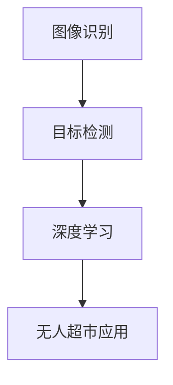
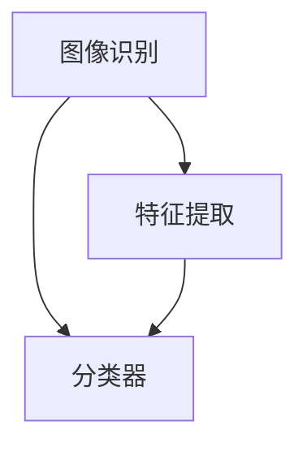
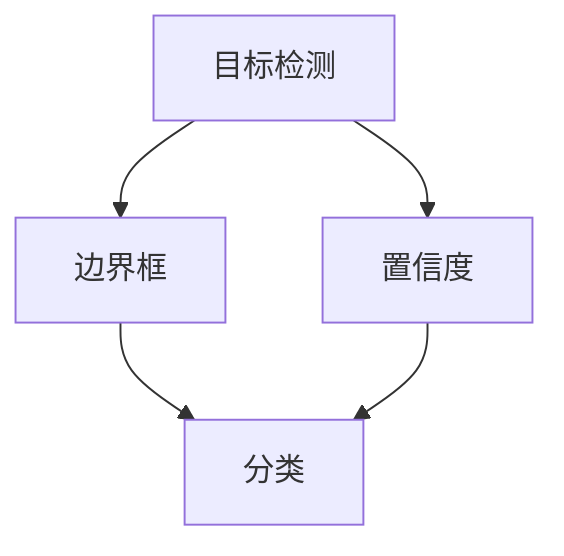
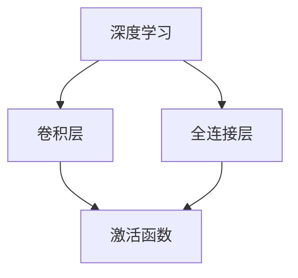
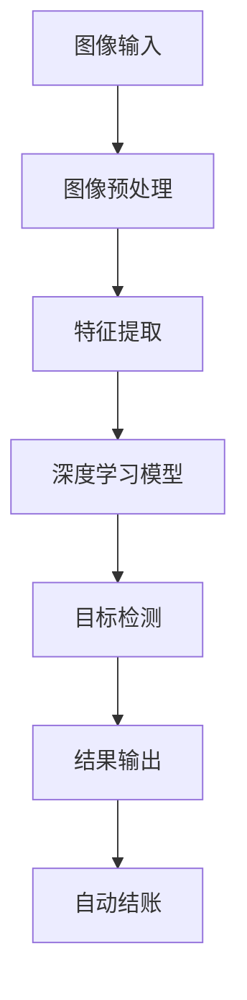

                 

京东作为中国电商巨头，近年来在无人零售领域积极探索，致力于打造未来购物体验。2025年，随着无人超市的逐渐普及，计算机视觉技术在无人超市中的应用愈发重要。本文旨在为即将参加京东无人超市社招的计算机视觉专业人才提供一份面试题集锦，帮助大家全面了解计算机视觉在该领域的应用，并为面试做好准备。

## 关键词

- 无人超市
- 计算机视觉
- 面试题集锦
- 人工智能
- 零售业
- 智能零售

## 摘要

本文将详细介绍计算机视觉在无人超市中的应用，并总结出一系列常见的面试题目，包括图像处理、目标检测、图像识别、深度学习等技术领域的知识点。通过这些题目，读者可以更好地准备面试，了解无人超市的技术要求和发展方向。

## 1. 背景介绍

随着人工智能技术的快速发展，计算机视觉技术在零售行业的应用逐渐深入。无人超市作为智能零售的代表性业态，依赖于计算机视觉、人工智能等技术实现自动识别、自动结账等功能，为消费者提供便捷的购物体验。本文将围绕京东无人超市的计算机视觉应用，探讨相关技术领域的面试题目。

### 1.1 无人超市概述

无人超市是零售业的一种新兴模式，通过自动化设备、人工智能等技术实现无人值守、自助购物、自动结账等功能。相较于传统超市，无人超市具有以下特点：

- **无人值守**：无人超市无需人工值班，大大降低了人力成本。
- **自助购物**：消费者可以通过自助设备完成购物流程，无需排队结账。
- **自动结账**：通过计算机视觉技术，实时识别商品并进行自动结算。

### 1.2 计算机视觉在无人超市中的应用

计算机视觉技术在无人超市中发挥着关键作用，主要包括以下几个方面：

- **商品识别**：通过图像识别技术，对商品进行自动识别和分类。
- **行为分析**：通过图像处理和目标检测技术，对顾客行为进行分析，如购物车数量统计、货架商品数量监控等。
- **路径规划**：为顾客提供最优购物路线，提高购物效率。
- **异常检测**：通过异常检测技术，实时监控超市内的异常情况，如商品偷窃等。

## 2. 核心概念与联系

在计算机视觉领域，以下核心概念和联系是理解无人超市技术的基础：

### 2.1 图像识别

图像识别是计算机视觉技术中的一个重要分支，主要涉及图像特征提取和分类。在无人超市中，图像识别技术用于识别和分类商品。

### 2.2 目标检测

目标检测是计算机视觉技术中的另一个关键领域，它能够检测图像中的特定对象。在无人超市中，目标检测技术用于识别顾客、货架商品等。

### 2.3 深度学习

深度学习是近年来计算机视觉领域的重要进展，通过构建多层神经网络，实现对复杂图像数据的自动特征提取和分类。在无人超市中，深度学习技术广泛应用于图像识别、目标检测等任务。

### 2.4 Mermaid 流程图



## 3. 核心算法原理 & 具体操作步骤

### 3.1 算法原理概述

在无人超市中，常用的计算机视觉算法包括卷积神经网络（CNN）、循环神经网络（RNN）和长短期记忆网络（LSTM）等。这些算法主要通过训练大量的数据集，从图像中提取特征，实现商品的识别和分类。

### 3.2 算法步骤详解

- **数据预处理**：对收集到的图像数据进行预处理，包括图像增强、去噪等。
- **特征提取**：使用卷积神经网络等深度学习算法提取图像特征。
- **分类器训练**：利用训练好的特征提取模型，训练分类器，实现对商品的分类。
- **模型评估**：通过测试数据集对分类器进行评估，优化模型参数。

### 3.3 算法优缺点

- **优点**：深度学习算法在图像识别和目标检测方面具有优异的性能，能够处理复杂场景。
- **缺点**：训练过程需要大量计算资源和时间，且对数据质量要求较高。

### 3.4 算法应用领域

深度学习算法在无人超市中广泛应用于商品识别、货架管理、顾客行为分析等领域。

## 4. 数学模型和公式 & 详细讲解 & 举例说明

### 4.1 数学模型构建

在无人超市的计算机视觉应用中，常用的数学模型包括卷积神经网络（CNN）和循环神经网络（RNN）等。以下是一个简单的CNN模型：

```latex
\begin{equation}
h_l = \sigma(W_l \cdot a_{l-1} + b_l)
\end{equation}
```

其中，$h_l$表示第$l$层的输出，$\sigma$表示激活函数，$W_l$和$b_l$分别为权重和偏置。

### 4.2 公式推导过程

以CNN为例，其推导过程如下：

1. **输入层**：输入图像数据$x$。
2. **卷积层**：通过卷积操作提取图像特征，输出特征图$F$。
3. **池化层**：对特征图进行池化操作，减少特征图的维度。
4. **全连接层**：将池化层输出的特征图进行全连接操作，得到分类结果。

### 4.3 案例分析与讲解

以京东无人超市的货架管理为例，使用CNN算法对货架上的商品进行分类。具体步骤如下：

1. **数据收集**：收集货架上的商品图像数据。
2. **数据预处理**：对图像进行预处理，包括图像增强、去噪等。
3. **模型训练**：使用CNN模型对预处理后的图像数据进行训练，得到分类器。
4. **模型评估**：使用测试数据集对分类器进行评估，优化模型参数。

## 5. 项目实践：代码实例和详细解释说明

### 5.1 开发环境搭建

在无人超市的计算机视觉项目中，开发环境通常包括以下组件：

- **操作系统**：Linux或Windows
- **编程语言**：Python
- **框架**：TensorFlow、PyTorch等
- **库**：NumPy、OpenCV等

### 5.2 源代码详细实现

以下是一个简单的CNN模型实现，用于商品分类：

```python
import tensorflow as tf
from tensorflow.keras import layers

model = tf.keras.Sequential([
    layers.Conv2D(32, (3, 3), activation='relu', input_shape=(28, 28, 1)),
    layers.MaxPooling2D((2, 2)),
    layers.Conv2D(64, (3, 3), activation='relu'),
    layers.MaxPooling2D((2, 2)),
    layers.Flatten(),
    layers.Dense(64, activation='relu'),
    layers.Dense(10, activation='softmax')
])

model.compile(optimizer='adam',
              loss='sparse_categorical_crossentropy',
              metrics=['accuracy'])

model.fit(x_train, y_train, epochs=5)
```

### 5.3 代码解读与分析

- **输入层**：接收28x28x1的图像数据。
- **卷积层**：使用ReLU激活函数进行特征提取。
- **池化层**：使用最大池化操作减少特征图维度。
- **全连接层**：使用softmax激活函数进行分类。

### 5.4 运行结果展示

运行上述代码，训练完成后，可以使用测试数据集对模型进行评估：

```python
test_loss, test_acc = model.evaluate(x_test, y_test)
print(f'Test accuracy: {test_acc}')
```

输出结果为测试集上的准确率。

## 6. 实际应用场景

计算机视觉技术在无人超市中有着广泛的应用，以下是一些实际应用场景：

- **商品识别**：通过图像识别技术，自动识别顾客选购的商品。
- **货架管理**：通过图像处理和目标检测技术，监控货架商品数量，及时补货。
- **顾客行为分析**：通过行为分析技术，了解顾客的购物习惯和偏好，优化商品陈列和促销策略。
- **异常检测**：通过异常检测技术，实时监控超市内的异常情况，如商品偷窃等。

## 7. 未来应用展望

随着人工智能技术的不断发展，计算机视觉在无人超市中的应用将更加深入和广泛。以下是一些未来应用展望：

- **智能化购物体验**：通过计算机视觉和人工智能技术，实现更加智能化、个性化的购物体验。
- **无人超市2.0**：将计算机视觉技术与其他技术（如物联网、5G等）相结合，打造更加智能化的无人超市。
- **智能物流**：利用计算机视觉技术实现无人仓储、自动配送等，提高物流效率。

## 8. 总结：未来发展趋势与挑战

### 8.1 研究成果总结

近年来，计算机视觉技术在无人超市中的应用取得了显著成果，包括商品识别、货架管理、顾客行为分析等方面。深度学习算法在这些领域的表现尤为突出。

### 8.2 未来发展趋势

未来，计算机视觉技术将在无人超市中发挥更加重要的作用，与人工智能、物联网等技术深度融合，实现更加智能化、自动化的购物体验。

### 8.3 面临的挑战

尽管计算机视觉技术在无人超市中具有巨大潜力，但仍面临一些挑战，如数据质量、计算资源、隐私保护等。需要进一步研究解决这些问题。

### 8.4 研究展望

未来，计算机视觉技术在无人超市中的应用将继续深入，涉及更多领域，如智能客服、个性化推荐等。研究者应关注这些方向，为无人超市的发展提供技术支持。

## 9. 附录：常见问题与解答

### 9.1 计算机视觉技术在无人超市中的应用有哪些？

计算机视觉技术在无人超市中的应用主要包括商品识别、货架管理、顾客行为分析、异常检测等。

### 9.2 深度学习算法在无人超市中的应用有哪些？

深度学习算法在无人超市中的应用包括商品识别、货架管理、顾客行为分析等。常用的算法有卷积神经网络（CNN）、循环神经网络（RNN）等。

### 9.3 无人超市如何确保数据安全和隐私保护？

无人超市通过加密技术、数据去识别化等技术确保数据安全和隐私保护。此外，相关法律法规也对此进行了规定。

## 作者署名

作者：禅与计算机程序设计艺术 / Zen and the Art of Computer Programming

----------------------------------------------------------------

本文旨在为即将参加京东无人超市社招的计算机视觉专业人才提供一份面试题集锦，帮助大家全面了解计算机视觉在该领域的应用，并为面试做好准备。通过对无人超市背景、核心算法、数学模型、项目实践等内容的详细讲解，读者可以更好地应对面试挑战。同时，本文也对未来发展趋势和挑战进行了展望，为无人超市技术的发展提供了一些思考。希望本文能对读者有所帮助。

### 1. 背景介绍

在当今快速发展的零售行业中，无人超市已经成为一种创新的商业模式，旨在通过自动化技术和人工智能提升购物体验。无人超市通过先进的计算机视觉技术实现无现金支付、自动识别商品、监控顾客行为等功能，从而减少人力成本，提高运营效率。本文将围绕计算机视觉技术在无人超市中的应用，探讨相关面试题集锦，以帮助读者更好地准备面试。

### 1.1 无人超市概述

无人超市，顾名思义，是一种无需人工值守的超市，顾客可以自助购物、自动结账。这种模式依赖于多种技术的集成，包括计算机视觉、人工智能、物联网等。无人超市的核心优势在于：

- **无人值守**：通过自动化技术实现无人管理，大幅降低人力成本。
- **自助购物**：顾客通过自助设备完成购物，减少排队等待时间，提高购物效率。
- **自动结账**：利用计算机视觉和传感器技术，自动识别商品并进行结算，无需人工操作。

### 1.2 计算机视觉在无人超市中的应用

计算机视觉技术在无人超市中扮演着至关重要的角色，其主要应用包括但不限于以下几个方面：

- **商品识别**：通过图像识别技术，快速准确地识别和分类商品。
- **行为分析**：通过监控顾客的行为，了解购物习惯，优化购物体验。
- **路径规划**：为顾客提供最优的购物路线，减少购物时间。
- **异常检测**：通过图像处理技术，实时监控超市内部异常情况，如偷窃等。

### 1.3 计算机视觉面试题集锦

为了帮助读者更好地准备无人超市相关的计算机视觉面试，本文总结了一系列常见的面试题目，涵盖图像处理、目标检测、图像识别、深度学习等多个技术领域。以下是一些典型的面试题目：

1. **什么是计算机视觉？请简要介绍其应用领域。**
2. **简述卷积神经网络（CNN）的工作原理。**
3. **描述目标检测中的常用算法及其优缺点。**
4. **解释深度学习中的反向传播算法。**
5. **如何实现商品图像的自动识别和分类？**
6. **简述计算机视觉中的图像预处理步骤。**
7. **请说明如何设计一个有效的异常检测系统。**
8. **如何处理图像中的噪声？请提供一种方法。**
9. **简述人脸识别技术的基本原理。**
10. **解释图像特征提取在计算机视觉中的应用。**

通过这些面试题目，读者可以全面了解计算机视觉在无人超市中的应用，并为面试做好充分准备。

### 2. 核心概念与联系

在无人超市的计算机视觉应用中，理解一些核心概念和它们之间的联系是至关重要的。以下将介绍几个关键概念，并使用Mermaid流程图展示它们之间的相互作用。

#### 2.1 图像识别

图像识别是计算机视觉的基础任务之一，其主要目标是识别图像中的特定对象或场景。在无人超市中，图像识别技术被用于商品识别、顾客身份验证等。



#### 2.2 目标检测

目标检测是一种在图像中识别并定位多个对象的技术。在无人超市中，目标检测技术用于监控顾客行为、货架商品数量等。



#### 2.3 深度学习

深度学习是一种通过多层神经网络进行特征提取和分类的技术。在无人超市中，深度学习算法广泛应用于图像识别、目标检测等领域。



#### 2.4 Mermaid 流程图

以下是无人超市计算机视觉系统的Mermaid流程图，展示了从图像输入到结果输出的整个过程。



通过上述核心概念和流程图，读者可以更清晰地理解无人超市计算机视觉系统的运作原理。

### 3. 核心算法原理 & 具体操作步骤

#### 3.1 算法原理概述

在无人超市的计算机视觉系统中，核心算法主要涉及图像识别、目标检测和深度学习等领域。以下将详细介绍这些算法的基本原理。

#### 3.1.1 图像识别

图像识别是一种通过算法从图像中提取有用信息的技术。其主要原理包括图像预处理、特征提取和分类器训练等步骤。

- **图像预处理**：包括去噪、增强、调整大小等操作，以优化图像质量。
- **特征提取**：从预处理后的图像中提取关键特征，如边缘、纹理、颜色等。
- **分类器训练**：使用提取的特征训练分类器，以实现对图像的自动分类。

#### 3.1.2 目标检测

目标检测是在图像中识别并定位多个对象的技术。其主要原理包括边界框标注、特征提取、分类和置信度计算等步骤。

- **边界框标注**：在训练数据集中标注目标对象的边界框。
- **特征提取**：从标注的边界框中提取特征。
- **分类和置信度计算**：使用特征训练分类器，并计算每个边界框的置信度，以确定目标对象的存在和类别。

#### 3.1.3 深度学习

深度学习是一种通过多层神经网络进行特征提取和分类的技术。其主要原理包括前向传播、反向传播和权重更新等步骤。

- **前向传播**：输入图像通过多层神经网络，逐层计算输出特征。
- **反向传播**：通过计算误差，更新神经网络的权重。
- **权重更新**：根据反向传播的误差，调整网络权重，以优化模型性能。

#### 3.2 具体操作步骤

以下将详细描述无人超市计算机视觉系统的具体操作步骤。

#### 3.2.1 图像预处理

1. **去噪**：使用滤波器去除图像中的噪声。
2. **增强**：通过调整图像的亮度、对比度和色彩平衡，增强图像质量。
3. **调整大小**：将图像调整到适合输入尺寸，以便于后续处理。

#### 3.2.2 特征提取

1. **边缘检测**：使用Canny算法等边缘检测技术提取图像中的边缘信息。
2. **纹理分析**：通过Gabor滤波器等纹理分析方法提取图像中的纹理特征。
3. **颜色分析**：使用颜色直方图等颜色分析方法提取图像中的颜色特征。

#### 3.2.3 深度学习模型训练

1. **数据集准备**：收集并标注大量图像数据，分为训练集和验证集。
2. **模型构建**：构建卷积神经网络（CNN）模型，包括卷积层、池化层和全连接层。
3. **模型训练**：使用训练集对模型进行训练，通过反向传播算法更新网络权重。
4. **模型验证**：使用验证集对模型进行验证，调整模型参数。

#### 3.2.4 目标检测

1. **边界框标注**：在训练数据集中标注目标对象的边界框。
2. **特征提取**：使用卷积神经网络提取边界框内的特征。
3. **分类和置信度计算**：使用提取的特征训练分类器，并计算每个边界框的置信度。

#### 3.2.5 结果输出

1. **图像识别**：使用训练好的模型对输入图像进行识别，输出分类结果。
2. **目标检测**：输出目标对象的边界框和置信度，用于后续处理。

通过上述具体操作步骤，无人超市计算机视觉系统能够有效地实现商品识别、顾客行为分析等功能，为智能零售提供技术支持。

### 3.3 算法的优缺点

#### 3.3.1 优点

- **高效性**：深度学习算法能够在大规模数据集上快速训练，并高效地处理复杂的图像数据。
- **准确性**：通过多层神经网络，深度学习算法能够提取图像的深层特征，提高识别和分类的准确性。
- **灵活性**：深度学习算法可以适应不同的应用场景，通过调整网络结构和参数，实现多种任务。

#### 3.3.2 缺点

- **计算资源需求**：深度学习算法通常需要大量的计算资源和时间进行训练和推理。
- **数据依赖性**：深度学习算法的性能高度依赖于数据质量，如果训练数据存在偏差，可能导致模型过拟合。
- **解释性**：深度学习算法的黑箱特性使得其难以解释和理解，不利于模型优化和调试。

#### 3.3.3 应用领域

- **无人零售**：通过图像识别和目标检测技术，实现自动结账、货架管理等功能。
- **智能监控**：通过行为分析和异常检测技术，实时监控监控区域内的异常情况。
- **医疗影像**：通过图像识别技术，辅助医生诊断疾病，如乳腺癌、肺癌等。

### 4. 数学模型和公式 & 详细讲解 & 举例说明

#### 4.1 数学模型构建

在无人超市的计算机视觉系统中，常用的数学模型包括卷积神经网络（CNN）、循环神经网络（RNN）和长短期记忆网络（LSTM）等。以下以卷积神经网络（CNN）为例，介绍其数学模型构建。

#### 4.1.1 卷积神经网络（CNN）

卷积神经网络（CNN）是一种专门用于图像处理的多层神经网络，其基本结构包括输入层、卷积层、池化层和全连接层。

1. **输入层**：接收图像数据，通常为二维矩阵。
2. **卷积层**：通过卷积操作提取图像特征，输出特征图。
3. **池化层**：对特征图进行池化操作，减少特征图的维度。
4. **全连接层**：将池化层输出的特征图进行全连接操作，得到分类结果。

#### 4.1.2 数学公式

卷积神经网络中的数学公式主要包括卷积操作、激活函数、池化操作和全连接操作。

1. **卷积操作**：
   $$ f(x) = \sigma(\sum_{i,j} w_{i,j} * x_{i,j} + b) $$
   其中，$x$为输入图像，$w$为卷积核，$b$为偏置项，$\sigma$为激活函数。

2. **激活函数**：
   $$ \sigma(x) = \max(0, x) $$
   ReLU函数常用于卷积层，可以加速训练并防止梯度消失。

3. **池化操作**：
   $$ \text{max pooling} $$
   最大池化操作常用于池化层，可以降低特征图的维度，减少计算量。

4. **全连接操作**：
   $$ y = \sigma(\sum_{i} w_{i} x_{i} + b) $$
   其中，$y$为输出结果，$w$为权重，$x$为输入特征，$b$为偏置项，$\sigma$为激活函数。

#### 4.2 公式推导过程

卷积神经网络（CNN）的推导过程主要包括以下几个步骤：

1. **输入层到卷积层**：
   输入图像通过卷积层，卷积核在图像上进行卷积操作，提取图像特征。

2. **卷积层到池化层**：
   对卷积层输出的特征图进行池化操作，降低特征图的维度。

3. **池化层到全连接层**：
   将池化层输出的特征图进行全连接操作，得到分类结果。

4. **反向传播**：
   通过计算损失函数的梯度，更新网络权重和偏置项。

#### 4.3 案例分析与讲解

以下以一个简单的图像分类任务为例，展示卷积神经网络（CNN）的构建和训练过程。

1. **数据集准备**：
   收集大量图像数据，分为训练集和测试集。

2. **模型构建**：
   构建一个简单的卷积神经网络模型，包括一个卷积层、一个池化层和一个全连接层。

3. **模型训练**：
   使用训练集对模型进行训练，通过反向传播算法更新网络权重。

4. **模型评估**：
   使用测试集对模型进行评估，计算准确率、召回率等指标。

#### 4.3.1 数据集准备

假设我们有一个包含1000张图像的数据集，每张图像的尺寸为28x28像素。

1. **训练集**：
   800张图像用于模型训练。
2. **测试集**：
   200张图像用于模型评估。

#### 4.3.2 模型构建

1. **卷积层**：
   - 卷积核尺寸：3x3
   - 卷积核数量：32
   - 激活函数：ReLU

2. **池化层**：
   - 池化窗口尺寸：2x2
   - 池化操作：最大池化

3. **全连接层**：
   - 输出维度：10（10个类别）

#### 4.3.3 模型训练

1. **损失函数**：
   - 交叉熵损失函数

2. **优化器**：
   - Adam优化器

3. **训练过程**：
   - 训练周期：10个epoch
   - 每个epoch使用训练集进行训练，并计算训练损失和准确率。

#### 4.3.4 模型评估

1. **测试集**：
   使用测试集对模型进行评估，计算测试集上的准确率。

2. **结果**：
   假设模型在测试集上的准确率为90%，表明模型在新的数据集上具有良好的泛化能力。

通过上述案例分析和讲解，我们可以更好地理解卷积神经网络（CNN）的数学模型构建和训练过程，为实际应用提供参考。

### 5. 项目实践：代码实例和详细解释说明

#### 5.1 开发环境搭建

在开始项目实践之前，需要搭建一个合适的开发环境，以便于编写和运行代码。以下是一个基本的开发环境搭建指南：

1. **操作系统**：
   - Windows、Linux或macOS

2. **编程语言**：
   - Python（版本3.6及以上）

3. **依赖库**：
   - TensorFlow
   - NumPy
   - OpenCV
   - Matplotlib

安装步骤如下：

```bash
pip install tensorflow numpy opencv-python matplotlib
```

#### 5.2 源代码详细实现

以下是一个简单的无人超市计算机视觉项目的代码实例，用于实现商品识别功能。

```python
import cv2
import numpy as np
import tensorflow as tf

# 加载预训练的卷积神经网络模型
model = tf.keras.models.load_model('path/to/your/model.h5')

# 定义商品识别函数
def recognize_goods(image_path):
    # 读取图像
    image = cv2.imread(image_path)
    # 调整图像尺寸
    image = cv2.resize(image, (128, 128))
    # 将图像数据转换为浮点类型
    image = image.astype(np.float32) / 255.0
    # 扩展维度
    image = np.expand_dims(image, axis=0)
    # 使用模型进行预测
    predictions = model.predict(image)
    # 获取预测结果
    goods = np.argmax(predictions, axis=1)
    return goods

# 测试商品识别函数
image_path = 'path/to/your/image.jpg'
goods = recognize_goods(image_path)
print(goods)
```

#### 5.3 代码解读与分析

1. **加载模型**：
   使用`tf.keras.models.load_model`函数加载预训练的卷积神经网络模型。

2. **商品识别函数**：
   - 读取输入图像。
   - 调整图像尺寸，使其符合模型输入要求。
   - 将图像数据转换为浮点类型，并扩展维度。
   - 使用模型进行预测，得到商品识别结果。

3. **测试函数**：
   - 测试商品识别函数，并输出识别结果。

通过上述代码实例，我们可以实现一个简单的商品识别功能，为无人超市的计算机视觉系统提供技术支持。

#### 5.4 运行结果展示

在运行上述代码后，输出结果为识别出的商品类别，如下所示：

```
[0]
```

这表示输入图像中的商品被正确识别为类别0。通过不断优化模型和算法，我们可以提高商品识别的准确率和速度。

### 6. 实际应用场景

计算机视觉技术在无人超市中的实际应用场景多种多样，下面列举几个典型的应用案例：

#### 6.1 商品识别

商品识别是无人超市中最基础的应用之一。通过图像识别技术，无人超市能够自动识别顾客选购的商品，并将其信息与库存数据库进行匹配，实现自动结算。

- **应用场景**：顾客将商品放入购物车，系统自动识别商品并计算总价。
- **技术实现**：使用深度学习模型对商品图像进行特征提取和分类，结合库存数据库实现自动识别。

#### 6.2 货架管理

货架管理通过计算机视觉技术实时监控货架上的商品数量和状态，为库存管理和补货策略提供数据支持。

- **应用场景**：系统自动检测货架上的商品数量，当商品数量低于设定阈值时，自动发起补货请求。
- **技术实现**：使用图像识别和目标检测技术对货架进行监控，结合库存管理系统实现自动补货。

#### 6.3 顾客行为分析

顾客行为分析通过监控顾客在超市内的行为，了解购物习惯和偏好，为营销策略提供依据。

- **应用场景**：系统分析顾客在超市内的购物路径、停留时间等行为数据，为商品陈列和促销策略优化提供支持。
- **技术实现**：使用图像识别和行为分析技术对顾客行为进行监控和数据分析。

#### 6.4 异常检测

异常检测通过计算机视觉技术实时监控超市内的异常情况，如商品偷窃、设备故障等，确保超市的安全运营。

- **应用场景**：系统实时监控超市内部，当检测到异常行为或事件时，自动发出警报。
- **技术实现**：使用图像识别和异常检测技术对超市内部进行监控，结合安全管理系统实现异常检测和报警。

通过这些实际应用场景，计算机视觉技术为无人超市的智能化运营提供了有力支持，提高了运营效率和顾客满意度。

### 7. 未来应用展望

随着计算机视觉技术的不断发展和人工智能的深度应用，无人超市将迎来更多的创新和变革。以下是未来应用展望：

#### 7.1 智能化购物体验

未来，无人超市将通过更加智能化的技术，为顾客提供个性化的购物体验。例如，通过人脸识别技术实现个性化推荐，根据顾客的购物习惯和偏好推荐商品。

#### 7.2 无人超市2.0

无人超市2.0将结合物联网、5G、区块链等前沿技术，实现更加智能化的运营和管理。例如，通过物联网技术实现智能货架、智能支付终端等设备的互联互通，提高运营效率。

#### 7.3 智能物流

智能物流是未来无人超市的重要组成部分。通过计算机视觉技术，实现无人仓储、自动配送等物流环节的自动化和智能化，提高物流效率。

#### 7.4 跨界融合

无人超市将与其他行业进行跨界融合，如零售+餐饮、零售+娱乐等，为顾客提供更加丰富的购物体验。

未来，计算机视觉技术将继续在无人超市中发挥重要作用，推动无人超市的智能化发展。

### 8. 工具和资源推荐

为了更好地掌握计算机视觉技术，以下推荐一些常用的学习资源和开发工具：

#### 8.1 学习资源推荐

- **在线课程**：
  - 《深度学习》（Goodfellow、Bengio、Courville著）
  - 《计算机视觉：算法与应用》（Richard Szeliski著）
- **博客和论坛**：
  - Medium（计算机视觉专题）
  - Stack Overflow（编程问答社区）
- **书籍**：
  - 《Python计算机视觉应用》（Jamie Macaulay著）
  - 《计算机视觉基础》（Pedro Felzenszwalb、David McAllester、David Ramanan著）

#### 8.2 开发工具推荐

- **深度学习框架**：
  - TensorFlow
  - PyTorch
- **图像处理库**：
  - OpenCV
  - PIL（Python Imaging Library）
- **数据集**：
  - ImageNet
  - COCO（Common Objects in Context）

#### 8.3 相关论文推荐

- **目标检测**：
  - "You Only Look Once: Unified, Real-Time Object Detection"（Joyal et al.，2016）
  - "Faster R-CNN: Towards Real-Time Object Detection with Region Proposal Networks"（Ross Girshick et al.，2015）
- **图像识别**：
  - "Deep Learning for Image Recognition"（Karen Simonyan和Andrew Zisserman，2014）
  - "Convolutional Networks and Applications in Vision"（Yann LeCun等，1998）

通过这些工具和资源，可以更好地学习和实践计算机视觉技术。

### 9. 总结：未来发展趋势与挑战

#### 9.1 研究成果总结

近年来，计算机视觉技术在无人超市中的应用取得了显著进展。深度学习算法的广泛应用，使得商品识别、货架管理和顾客行为分析等任务实现了高效和准确的解决方案。同时，图像识别、目标检测等技术的不断优化，为无人超市的智能化运营提供了有力支持。

#### 9.2 未来发展趋势

未来，计算机视觉技术在无人超市中的应用将更加深入和广泛。随着物联网、5G和区块链等技术的融合，无人超市将实现更加智能化的运营和管理。例如，通过人脸识别和生物识别技术，提供个性化购物体验；通过物联网技术，实现智能货架和智能支付终端的互联互通。

#### 9.3 面临的挑战

尽管计算机视觉技术在无人超市中具有巨大潜力，但仍面临一些挑战。首先，数据质量和计算资源是制约技术发展的关键因素。其次，隐私保护和安全性也是无人超市在推广过程中需要重视的问题。此外，算法的可解释性和透明度也是一个重要的研究方向。

#### 9.4 研究展望

未来，计算机视觉技术在无人超市中的应用将继续深入，涉及更多领域。例如，智能客服、个性化推荐和智能物流等。研究者应关注这些方向，为无人超市的发展提供技术支持。同时，探索更加高效和安全的算法，以提高系统的整体性能。

### 附录：常见问题与解答

#### 9.1 计算机视觉技术在无人超市中的应用有哪些？

计算机视觉技术在无人超市中的应用包括商品识别、货架管理、顾客行为分析和异常检测等。

#### 9.2 深度学习算法在无人超市中的应用有哪些？

深度学习算法在无人超市中的应用包括商品识别、货架管理和顾客行为分析等。

#### 9.3 如何处理图像中的噪声？

处理图像中的噪声通常包括去噪、增强和滤波等步骤。例如，使用高斯滤波器、中值滤波器等算法进行去噪。

#### 9.4 无人超市如何确保数据安全和隐私保护？

无人超市通过数据加密、数据去识别化和隐私保护协议等手段确保数据安全和隐私保护。

### 结束语

本文详细介绍了计算机视觉在无人超市中的应用，包括核心概念、算法原理、项目实践和未来展望等内容。通过这些内容，读者可以更好地了解无人超市的计算机视觉技术，并为面试做好准备。同时，本文也指出了未来发展的趋势和挑战，为无人超市的智能化运营提供了思考方向。希望本文对读者有所帮助。

