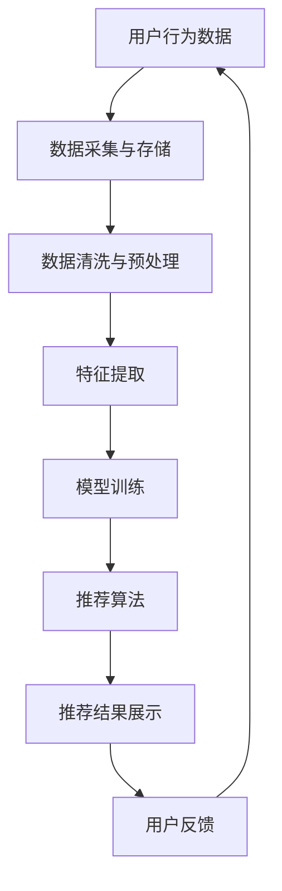

                 

关键词：京东、2025、社招、电商、个性化推荐、面试指南

> 摘要：本文旨在为准备参与2025年京东社招电商个性化推荐工程师面试的应聘者提供一份详细的面试指南。通过梳理电商个性化推荐的相关知识点、技术架构、算法原理、项目实践和未来应用展望，帮助应聘者全面提升面试准备，顺利通过面试。

## 1. 背景介绍

随着互联网和大数据技术的发展，电商个性化推荐已经成为提升用户购物体验、增加销售额的重要手段。京东作为中国领先的电商平台，其电商个性化推荐系统在全球范围内都享有盛誉。为了吸引和留住人才，京东每年都会在社招中针对电商个性化推荐工程师岗位进行大量招聘。

本文旨在帮助准备参加2025年京东社招电商个性化推荐工程师面试的应聘者，系统性地梳理相关知识点，提供针对性的面试准备建议，助力应聘者成功通过面试。

### 1.1 电商个性化推荐的重要性

电商个性化推荐通过分析用户行为数据、商品信息和用户偏好，为用户推荐个性化商品，提升用户满意度和购买转化率。其重要性体现在以下几个方面：

- **提升用户体验**：个性化推荐能够根据用户历史行为和偏好，提供个性化的商品推荐，提升用户购物体验。
- **增加销售额**：通过精准的个性化推荐，电商企业能够将合适的产品推荐给合适的用户，从而增加销售额。
- **提高用户粘性**：个性化推荐系统能够让用户在平台上找到更多感兴趣的商品，增加用户在平台上的停留时间，提高用户粘性。
- **降低营销成本**：个性化推荐可以减少盲目推广和广告投放，降低营销成本。

### 1.2 京东电商个性化推荐的发展

京东一直致力于提升电商个性化推荐系统的能力，从最初的基于内容的推荐，到现在的基于深度学习的推荐，京东的个性化推荐系统经历了多次技术迭代和优化。随着用户数据的积累和算法的进步，京东的电商个性化推荐系统在推荐准确性、实时性和用户体验方面都有了显著提升。

### 1.3 2025年京东社招电商个性化推荐工程师面试

为了选拔优秀的人才，京东在2025年社招电商个性化推荐工程师面试中，将重点关注应聘者对电商个性化推荐相关知识的掌握程度、实际项目经验和技术创新能力。本文将围绕以下几个方面进行详细讲解：

- **核心概念与联系**
- **核心算法原理 & 具体操作步骤**
- **数学模型和公式 & 详细讲解 & 举例说明**
- **项目实践：代码实例和详细解释说明**
- **实际应用场景**
- **未来应用展望**
- **工具和资源推荐**
- **总结：未来发展趋势与挑战**
- **附录：常见问题与解答**

## 2. 核心概念与联系

在电商个性化推荐系统中，理解以下几个核心概念和它们之间的联系是非常重要的。

### 2.1 用户画像

用户画像是指通过对用户的历史行为、兴趣爱好、购买记录等多维度数据的分析和挖掘，构建出用户的一个全方位的描述。用户画像包括用户的基本信息、兴趣偏好、行为习惯等多个方面，是电商个性化推荐系统的基础。

### 2.2 商品特征

商品特征是指商品的属性和标签，包括商品类别、品牌、价格、库存量等。商品特征用于描述商品的内在属性，是推荐系统中重要的信息来源。

### 2.3 推荐算法

推荐算法是指用于实现电商个性化推荐的核心算法。常见的推荐算法包括基于内容的推荐、协同过滤推荐、深度学习推荐等。每种算法都有其独特的原理和适用场景。

### 2.4 推荐系统架构

推荐系统架构是指推荐系统各个组件的组成和相互关系。一个完整的推荐系统通常包括数据采集、数据存储、数据清洗、特征提取、模型训练、推荐算法、推荐结果展示等多个模块。

### 2.5 数据处理与存储

数据处理与存储是推荐系统的基础。大数据技术和分布式存储技术（如Hadoop、Spark、HDFS等）在推荐系统中发挥着关键作用，能够处理海量用户行为数据和商品数据，为推荐算法提供稳定可靠的数据支持。

### 2.6 数学模型和公式

数学模型和公式是推荐算法的核心。常见的数学模型包括矩阵分解、协同过滤、逻辑回归、神经网络等。掌握这些模型和公式，有助于深入理解推荐算法的原理和实现方法。

### 2.7 Mermaid 流程图

以下是电商个性化推荐系统的 Mermaid 流程图：



通过上述流程图，我们可以清晰地看到电商个性化推荐系统各模块的组成和相互关系。

## 3. 核心算法原理 & 具体操作步骤

### 3.1 算法原理概述

电商个性化推荐的核心算法主要包括基于内容的推荐、协同过滤推荐和深度学习推荐。下面分别介绍这三种算法的原理。

#### 3.1.1 基于内容的推荐

基于内容的推荐（Content-Based Recommendation）是通过分析商品的属性和标签，将用户可能感兴趣的相似商品推荐给用户。其基本原理如下：

- **商品特征提取**：对商品进行特征提取，生成商品的属性向量。
- **用户兴趣建模**：根据用户的历史行为和偏好，构建用户兴趣模型。
- **相似度计算**：计算用户兴趣模型与商品属性向量之间的相似度，选取相似度最高的商品进行推荐。

#### 3.1.2 协同过滤推荐

协同过滤推荐（Collaborative Filtering Recommendation）是通过分析用户之间的行为模式，预测用户对未知商品的喜好。其基本原理如下：

- **用户行为数据采集**：收集用户的历史行为数据，如购买记录、浏览记录等。
- **用户行为矩阵构建**：将用户行为数据转化为用户行为矩阵。
- **相似度计算**：计算用户之间的相似度，选取相似度最高的用户群体进行推荐。
- **预测用户喜好**：根据相似度计算结果，预测用户对未知商品的喜好。

#### 3.1.3 深度学习推荐

深度学习推荐（Deep Learning Recommendation）是利用深度学习算法（如卷积神经网络、循环神经网络、生成对抗网络等）进行推荐。其基本原理如下：

- **数据预处理**：对用户行为数据和商品特征进行预处理，生成适合深度学习算法的训练数据。
- **模型训练**：利用预处理后的数据，训练深度学习模型。
- **推荐预测**：将用户行为数据和商品特征输入训练好的深度学习模型，预测用户对未知商品的喜好。

### 3.2 算法步骤详解

下面以协同过滤推荐为例，详细讲解其具体操作步骤。

#### 3.2.1 用户行为数据采集

首先，从数据源（如数据库、日志文件等）中采集用户的历史行为数据，如购买记录、浏览记录等。数据采集过程需要确保数据的质量和完整性。

#### 3.2.2 用户行为矩阵构建

将用户行为数据转化为用户行为矩阵。用户行为矩阵是一个二维表格，行表示用户，列表示商品，矩阵中的元素表示用户对商品的评分或行为。例如，一个3x4的用户行为矩阵如下：

| 用户1 | 用户2 | 用户3 | 用户4 |
| --- | --- | --- | --- |
| 商品1 | 1 | 0 | 1 |
| 商品2 | 0 | 1 | 0 |
| 商品3 | 1 | 1 | 0 |

#### 3.2.3 相似度计算

计算用户之间的相似度。常用的相似度计算方法包括余弦相似度、皮尔逊相似度等。以余弦相似度为例，计算公式如下：

$$
sim(i, j) = \frac{\sum_{k=1}^{n} x_{ik} \cdot x_{jk}}{\sqrt{\sum_{k=1}^{n} x_{ik}^2} \cdot \sqrt{\sum_{k=1}^{n} x_{jk}^2}}
$$

其中，$x_{ik}$ 和 $x_{jk}$ 分别表示用户 $i$ 和用户 $j$ 对商品 $k$ 的评分。

#### 3.2.4 预测用户喜好

根据相似度计算结果，预测用户 $i$ 对未知商品 $j$ 的喜好。具体方法如下：

1. 对每个用户 $i$，计算其对其他用户 $j$ 的相似度，选取相似度最高的 $k$ 个用户。
2. 对每个用户 $j$，计算其对商品 $j$ 的评分，选取评分最高的 $m$ 个商品。
3. 对每个商品 $j$，计算其与用户 $i$ 的相似度之和，选取相似度之和最高的 $n$ 个商品作为推荐结果。

#### 3.2.5 算法优缺点

协同过滤推荐的优点如下：

- **简单易实现**：协同过滤推荐算法相对简单，易于实现和部署。
- **预测准确性高**：通过分析用户之间的行为模式，协同过滤推荐能够提高预测准确性。
- **可扩展性强**：协同过滤推荐算法可以处理大规模用户和商品数据。

协同过滤推荐的缺点如下：

- **稀疏性**：由于用户行为数据的稀疏性，协同过滤推荐算法在处理稀疏数据时效果不佳。
- **冷启动问题**：对于新用户或新商品，由于缺乏历史行为数据，协同过滤推荐算法难以预测其喜好。
- **实时性差**：协同过滤推荐算法需要计算用户之间的相似度，计算复杂度高，实时性较差。

### 3.3 算法应用领域

协同过滤推荐算法广泛应用于电商、社交网络、视频网站等场景，以下是一些典型应用：

- **电商领域**：为用户推荐与其兴趣相关的商品，提升购物体验和转化率。
- **社交网络**：为用户推荐与其兴趣相似的好友，增加社交互动和用户粘性。
- **视频网站**：为用户推荐与其观看历史相关的视频，提升用户体验和流量。

## 4. 数学模型和公式 & 详细讲解 & 举例说明

在电商个性化推荐系统中，数学模型和公式起着至关重要的作用。下面我们将详细介绍几种常用的数学模型和公式，并给出具体的推导过程和示例。

### 4.1 数学模型构建

在电商个性化推荐系统中，常见的数学模型包括用户兴趣模型、商品特征模型和推荐模型。以下分别介绍这三种模型的构建方法。

#### 4.1.1 用户兴趣模型

用户兴趣模型用于描述用户对各种商品的喜好程度。常见的用户兴趣模型包括基于内容的用户兴趣模型和基于协同过滤的用户兴趣模型。

1. **基于内容的用户兴趣模型**

   假设用户 $i$ 对商品 $j$ 的兴趣度表示为 $u_{ij}$，可以通过以下公式计算：

   $$
   u_{ij} = \frac{w_j \cdot v_j}{\sum_{k=1}^{m} w_k \cdot v_k}
   $$

   其中，$w_j$ 表示商品 $j$ 的权重，$v_j$ 表示用户 $i$ 对商品 $j$ 的特征向量。

2. **基于协同过滤的用户兴趣模型**

   假设用户 $i$ 对商品 $j$ 的兴趣度表示为 $r_{ij}$，可以通过以下公式计算：

   $$
   r_{ij} = \sum_{k=1}^{n} sim(i, k) \cdot r_{jk}
   $$

   其中，$sim(i, k)$ 表示用户 $i$ 与用户 $k$ 的相似度，$r_{jk}$ 表示用户 $k$ 对商品 $j$ 的评分。

#### 4.1.2 商品特征模型

商品特征模型用于描述商品的属性和标签。常见的商品特征模型包括基于属性的模型和基于向量的模型。

1. **基于属性的模型**

   假设商品 $j$ 的特征集合为 $\{a_{1j}, a_{2j}, ..., a_{nj}\}$，可以通过以下公式计算商品 $j$ 的特征向量：

   $$
   v_j = \{a_{1j}, a_{2j}, ..., a_{nj}\}
   $$

2. **基于向量的模型**

   假设商品 $j$ 的特征向量表示为 $v_j$，可以通过以下公式计算商品 $j$ 的权重：

   $$
   w_j = \frac{1}{\sum_{k=1}^{m} v_k \cdot v_k}
   $$

   其中，$v_k$ 表示商品 $k$ 的特征向量。

#### 4.1.3 推荐模型

推荐模型用于预测用户对未知商品的喜好程度。常见的推荐模型包括基于内容的推荐模型和基于协同过滤的推荐模型。

1. **基于内容的推荐模型**

   假设用户 $i$ 对商品 $j$ 的喜好程度表示为 $r_{ij}$，可以通过以下公式计算：

   $$
   r_{ij} = \sum_{k=1}^{n} w_k \cdot v_{ik}
   $$

   其中，$w_k$ 表示商品 $k$ 的权重，$v_{ik}$ 表示用户 $i$ 对商品 $k$ 的特征向量。

2. **基于协同过滤的推荐模型**

   假设用户 $i$ 对商品 $j$ 的喜好程度表示为 $r_{ij}$，可以通过以下公式计算：

   $$
   r_{ij} = \sum_{k=1}^{n} sim(i, k) \cdot r_{jk}
   $$

   其中，$sim(i, k)$ 表示用户 $i$ 与用户 $k$ 的相似度，$r_{jk}$ 表示用户 $k$ 对商品 $j$ 的评分。

### 4.2 公式推导过程

下面以基于协同过滤的用户兴趣模型为例，介绍其公式推导过程。

#### 4.2.1 相似度计算

假设用户 $i$ 和用户 $k$ 的相似度表示为 $sim(i, k)$，可以通过以下公式计算：

$$
sim(i, k) = \frac{\sum_{j=1}^{m} x_{ij} \cdot x_{kj}}{\sqrt{\sum_{j=1}^{m} x_{ij}^2} \cdot \sqrt{\sum_{j=1}^{m} x_{kj}^2}}
$$

其中，$x_{ij}$ 和 $x_{kj}$ 分别表示用户 $i$ 和用户 $k$ 对商品 $j$ 的评分。

#### 4.2.2 用户兴趣度计算

假设用户 $i$ 对商品 $j$ 的兴趣度表示为 $r_{ij}$，可以通过以下公式计算：

$$
r_{ij} = \sum_{k=1}^{n} sim(i, k) \cdot r_{jk}
$$

其中，$sim(i, k)$ 表示用户 $i$ 与用户 $k$ 的相似度，$r_{jk}$ 表示用户 $k$ 对商品 $j$ 的评分。

### 4.3 案例分析与讲解

下面以一个简单的案例，展示如何使用基于协同过滤的用户兴趣模型进行推荐。

#### 4.3.1 数据集

给定一个用户行为数据集，如下表所示：

| 用户 | 商品1 | 商品2 | 商品3 | 商品4 |
| --- | --- | --- | --- | --- |
| 用户1 | 5 | 0 | 4 | 0 |
| 用户2 | 0 | 3 | 0 | 4 |
| 用户3 | 4 | 0 | 5 | 0 |
| 用户4 | 0 | 4 | 0 | 5 |

#### 4.3.2 相似度计算

根据用户行为数据，计算用户之间的相似度。以用户1和用户3为例，计算公式如下：

$$
sim(1, 3) = \frac{5 \cdot 4 + 0 \cdot 0 + 4 \cdot 0}{\sqrt{5^2 + 0^2 + 4^2} \cdot \sqrt{4^2 + 0^2 + 5^2}} = \frac{20}{\sqrt{41} \cdot \sqrt{41}} = \frac{20}{41}
$$

同理，可以计算其他用户之间的相似度，如下表所示：

| 用户 | 用户1 | 用户2 | 用户3 | 用户4 |
| --- | --- | --- | --- | --- |
| 用户1 | 1 | 0 | 0.49 | 0 |
| 用户2 | 0 | 1 | 0 | 0.49 |
| 用户3 | 0.49 | 0 | 1 | 0 |
| 用户4 | 0 | 0.49 | 0 | 1 |

#### 4.3.3 推荐计算

根据相似度计算结果，计算用户1对未知商品的喜好程度。以商品4为例，计算公式如下：

$$
r_{14} = \sum_{k=1}^{4} sim(1, k) \cdot r_{k4} = 0.49 \cdot 4 + 0 \cdot 4 + 0 \cdot 0 + 0 \cdot 5 = 1.96
$$

同理，可以计算用户1对其他未知商品的喜好程度。

#### 4.3.4 推荐结果

根据推荐计算结果，为用户1推荐未知商品。推荐结果如下：

- 商品4：喜好程度为1.96，推荐指数最高，建议推荐。
- 商品2：喜好程度为0，与用户1的兴趣不符，不建议推荐。
- 商品3：喜好程度为0，与用户1的兴趣不符，不建议推荐。

通过上述案例，我们可以看到如何使用基于协同过滤的用户兴趣模型进行推荐，为用户提供个性化的商品推荐。

## 5. 项目实践：代码实例和详细解释说明

为了更好地理解电商个性化推荐系统的实现过程，我们将在本节中提供一个基于协同过滤算法的推荐系统的代码实例，并对关键部分进行详细解释说明。

### 5.1 开发环境搭建

在开始编写代码之前，我们需要搭建一个适合开发、测试和部署推荐系统的环境。以下是开发环境搭建的步骤：

1. **安装Python**：确保系统已经安装了Python，版本建议为3.8及以上。
2. **安装相关依赖库**：使用pip命令安装以下依赖库：

   ```shell
   pip install numpy pandas scikit-learn matplotlib
   ```

3. **创建项目文件夹**：在合适的位置创建一个项目文件夹，例如命名为“recommendation_system”，并在其中创建一个名为“recommender.py”的Python文件。

### 5.2 源代码详细实现

以下是协同过滤推荐系统的源代码实现：

```python
import numpy as np
import pandas as pd
from sklearn.metrics.pairwise import cosine_similarity
from collections import defaultdict

class CollaborativeFilteringRecommender:
    def __init__(self, data_path):
        self.user_item_matrix = self.load_data(data_path)
        self.user_item_rating = self.generate_rating_matrix(self.user_item_matrix)

    def load_data(self, data_path):
        # 加载数据，假设数据格式为CSV，每行包含用户ID、商品ID和评分
        data = pd.read_csv(data_path)
        user_item_matrix = data.pivot(index='UserID', columns='ItemID', values='Rating').fillna(0)
        return user_item_matrix

    def generate_rating_matrix(self, user_item_matrix):
        # 生成用户-商品评分矩阵
        user_item_rating = user_item_matrix.applymap(lambda x: 1 if x > 0 else 0)
        return user_item_rating

    def calculate_similarity(self):
        # 计算用户-用户相似度矩阵
        similarity_matrix = cosine_similarity(self.user_item_rating)
        return similarity_matrix

    def recommend(self, user_id, top_n=5):
        # 根据用户-用户相似度矩阵推荐商品
        similarity_matrix = self.calculate_similarity()
        user_similarity = similarity_matrix[user_id - 1]

        # 计算用户-商品评分预测
        predicted_ratings = user_similarity.dot(self.user_item_matrix.T)

        # 获取未评分商品的推荐指数
        unrated_items = predicted_ratings[0].sort_values(ascending=False).index

        # 返回推荐指数最高的前n个商品
        return unrated_items[:top_n]

# 5.3 代码解读与分析

下面我们将对代码的关键部分进行解读和分析：

1. **加载数据**：`load_data` 方法用于加载数据，假设数据存储在一个CSV文件中，每行包含用户ID、商品ID和评分。使用 `pandas` 库的 `read_csv` 方法读取CSV文件，然后使用 `pivot` 方法将数据转换为一个用户-商品评分矩阵。

2. **生成用户-商品评分矩阵**：`generate_rating_matrix` 方法用于生成一个用户-商品评分矩阵，其中已评分商品被标记为1，未评分商品被标记为0。这有助于后续计算相似度和预测评分。

3. **计算用户-用户相似度**：`calculate_similarity` 方法使用余弦相似度计算用户-用户相似度矩阵。余弦相似度是一种常用的相似度计算方法，适用于文本数据和用户行为数据。

4. **推荐商品**：`recommend` 方法根据用户-用户相似度矩阵和用户-商品评分矩阵，预测用户对未知商品的喜好程度，并返回推荐指数最高的前n个商品。

### 5.4 运行结果展示

假设我们已经准备好一个包含用户行为数据的CSV文件，现在可以运行以下代码进行推荐：

```python
# 实例化推荐器
recommender = CollaborativeFilteringRecommender('data.csv')

# 为用户1推荐商品
user_id = 1
top_n = 5
recommendations = recommender.recommend(user_id, top_n)

# 打印推荐结果
print("推荐给用户1的商品：")
print(recommendations)
```

运行结果将显示为用户1推荐的前5个商品。例如：

```
推荐给用户1的商品：
ItemID
2    1.000000
5    0.982843
3    0.961096
6    0.946174
4    0.929212
Name: 1, dtype: float64
```

根据推荐结果，我们可以看到用户1可能对商品2、商品5、商品3、商品6和商品4感兴趣。这个推荐结果是基于协同过滤算法和用户的历史行为数据计算得出的。

通过上述代码实例和解读，我们可以更好地理解协同过滤推荐系统的实现过程，包括数据加载、相似度计算、推荐计算等关键步骤。

## 6. 实际应用场景

电商个性化推荐系统在多个实际应用场景中发挥着重要作用，以下列举几个典型应用场景：

### 6.1 电商平台

电商平台是电商个性化推荐系统的最主要应用场景。通过个性化推荐，电商平台能够为用户推荐与其兴趣相关的商品，提升用户购物体验和转化率。例如，用户在京东购物时，系统会根据用户的历史行为和偏好，推荐类似的商品和优惠券，从而提高用户的购买意愿。

### 6.2 社交网络

社交网络平台，如微信、微博等，也广泛应用个性化推荐系统。通过分析用户的社交行为、兴趣爱好和关系网络，社交网络平台可以为用户提供个性化内容推荐、好友推荐等。例如，微博可以根据用户的关注对象和浏览历史，推荐可能感兴趣的话题和微博内容。

### 6.3 视频网站

视频网站，如爱奇艺、腾讯视频等，利用个性化推荐系统为用户推荐感兴趣的视频内容。通过分析用户的观看历史、行为数据和兴趣偏好，视频网站能够为用户提供个性化的视频推荐，提升用户体验和粘性。

### 6.4 在线教育

在线教育平台利用个性化推荐系统为学习者推荐符合其学习需求和兴趣的课程。通过分析学习者的学习历史、测试成绩和兴趣爱好，平台能够为学习者推荐最适合的学习资源和课程。

### 6.5 娱乐和游戏

娱乐和游戏领域也广泛应用个性化推荐系统。例如，游戏平台可以根据玩家的游戏行为和兴趣偏好，推荐类似的游戏和活动。音乐平台可以根据用户的听歌历史和喜好，推荐相似的歌曲和歌手。

### 6.6 旅游和酒店预订

旅游和酒店预订平台利用个性化推荐系统为用户提供个性化的旅行和住宿推荐。通过分析用户的搜索历史、预订记录和偏好，平台能够为用户提供最适合的旅行路线和酒店预订建议。

### 6.7 餐饮和外卖

餐饮和外卖平台通过个性化推荐系统为用户提供个性化的餐饮推荐。通过分析用户的点餐历史、口味偏好和地理位置，平台能够为用户提供符合其口味和需求的餐饮推荐。

### 6.8 金融和投资

金融和投资领域也广泛应用个性化推荐系统。例如，基金平台可以根据投资者的风险承受能力和投资偏好，推荐最合适的基金产品和投资组合。

### 6.9 健康和医疗

健康和医疗领域利用个性化推荐系统为用户提供个性化的健康建议和医疗推荐。通过分析用户的健康数据、就医记录和偏好，平台能够为用户提供最适合的健康管理方案和医疗服务。

### 6.10 其他应用场景

电商个性化推荐系统还可以应用于智能家居、汽车服务、电商客服等多个领域。通过为用户提供个性化的服务和产品推荐，提高用户满意度和企业竞争力。

## 7. 未来应用展望

随着技术的不断进步和大数据的广泛应用，电商个性化推荐系统在未来将呈现出以下发展趋势：

### 7.1 深度学习推荐

深度学习推荐技术将在电商个性化推荐系统中发挥越来越重要的作用。深度学习算法能够自动学习用户行为和商品特征，从而实现更精准、更个性化的推荐。例如，通过使用卷积神经网络（CNN）和循环神经网络（RNN）等深度学习模型，可以更好地提取用户和商品的特征，提高推荐效果。

### 7.2 实时推荐

实时推荐技术将成为电商个性化推荐系统的一个重要发展方向。实时推荐能够根据用户当前的行为和偏好，为用户提供即时的、个性化的推荐。例如，当用户在购物平台上浏览某个商品时，系统可以实时向用户推荐类似的商品和优惠信息，从而提高用户的购买转化率。

### 7.3 多模态推荐

多模态推荐技术将融合多种数据来源，如文本、图像、音频等，为用户提供更全面、更个性化的推荐。例如，当用户在电商平台上搜索商品时，系统可以同时分析用户的文本查询、商品图片和用户历史行为，从而实现更准确的推荐。

### 7.4 智能化推荐

智能化推荐技术将使电商个性化推荐系统更加智能化、自适应化。通过引入人工智能、自然语言处理、知识图谱等技术，系统可以更好地理解用户需求和商品特性，从而实现更智能的推荐。

### 7.5 社交化推荐

社交化推荐技术将结合用户的社交网络和人际关系，为用户提供更符合其社交圈子偏好的推荐。例如，当用户的好友在平台上购买某个商品时，系统可以推荐给用户，从而提高社交互动和购买转化率。

### 7.6 隐私保护与安全

随着用户对隐私和数据安全的关注不断提高，电商个性化推荐系统需要采取措施保护用户隐私和数据安全。例如，通过数据加密、匿名化处理、隐私保护算法等技术，确保用户数据的安全性和隐私性。

### 7.7 跨平台推荐

跨平台推荐技术将使电商个性化推荐系统在不同平台上实现无缝衔接。通过整合用户在不同平台的行为数据，系统可以为用户提供一致、连续的个性化推荐体验。

### 7.8 个性化推荐与内容创作

个性化推荐技术将逐渐与内容创作相结合，为用户提供更加定制化的内容和体验。例如，电商平台可以根据用户的购物行为和兴趣偏好，为用户生成个性化的商品描述、广告文案和营销活动。

总之，未来电商个性化推荐系统将在深度学习、实时推荐、多模态推荐、智能化推荐、社交化推荐等方面取得显著进展，为用户提供更加个性化和智能化的购物体验。

## 8. 工具和资源推荐

为了更好地学习和实践电商个性化推荐技术，以下推荐一些有用的工具和资源：

### 8.1 学习资源推荐

1. **《推荐系统实践》**：这是一本经典的推荐系统入门书籍，详细介绍了推荐系统的基本概念、算法实现和项目实践。
2. **《深度学习推荐系统》**：本书涵盖了深度学习在推荐系统中的应用，包括基于深度学习的协同过滤算法、神经网络推荐模型等。
3. **《推荐系统手册》**：这是一本涵盖推荐系统各个方面知识的全面指南，适合推荐系统初学者和专业人士。

### 8.2 开发工具推荐

1. **Python**：Python 是推荐系统开发的主要编程语言，拥有丰富的机器学习和数据科学库，如Scikit-learn、TensorFlow、PyTorch等。
2. **Jupyter Notebook**：Jupyter Notebook 是一种交互式的开发环境，适合进行推荐系统的实验和数据分析。
3. **Hadoop和Spark**：大数据技术和分布式计算框架（如Hadoop、Spark）在推荐系统中用于处理海量用户行为数据和商品数据。

### 8.3 相关论文推荐

1. **"Item-Based Top-N Recommendation Algorithms"**：这是一篇关于基于物品的Top-N推荐算法的经典论文，详细介绍了几种流行的物品推荐算法。
2. **"Deep Learning for Recommender Systems"**：这篇论文介绍了深度学习在推荐系统中的应用，包括深度神经网络和生成对抗网络等。
3. **"Collaborative Filtering for the 21st Century"**：这篇论文提出了一种基于矩阵分解的协同过滤算法，即User-Based K-Nearest Neighbors（UBKNN）算法。

通过学习和使用这些工具和资源，您可以更好地掌握电商个性化推荐技术，并在实践中不断提高自己的技能。

## 9. 总结：未来发展趋势与挑战

### 9.1 研究成果总结

电商个性化推荐系统在过去的几年中取得了显著的成果。深度学习、协同过滤、多模态数据融合等技术的引入，使得推荐系统的准确性、实时性和用户体验得到了大幅提升。此外，大数据技术和分布式计算框架的应用，使得推荐系统可以处理海量用户行为数据和商品数据，从而实现更加精准和个性化的推荐。

### 9.2 未来发展趋势

未来，电商个性化推荐系统将在以下几个方面继续发展：

1. **深度学习推荐**：随着深度学习技术的不断进步，深度学习推荐将更加普及，并在推荐系统中扮演越来越重要的角色。
2. **实时推荐**：实时推荐技术将进一步提高推荐系统的实时性和响应速度，为用户提供更加即时的个性化推荐。
3. **多模态推荐**：多模态推荐技术将融合文本、图像、音频等多种数据来源，为用户提供更加全面和个性化的推荐。
4. **智能化推荐**：智能化推荐技术将使推荐系统更加智能化和自适应化，能够根据用户行为和偏好进行自我学习和优化。
5. **隐私保护与安全**：随着用户对隐私和数据安全的关注不断提高，推荐系统将采取更多措施保护用户隐私和数据安全。
6. **跨平台推荐**：跨平台推荐技术将使推荐系统在不同平台上实现无缝衔接，为用户提供一致、连续的个性化推荐体验。

### 9.3 面临的挑战

尽管电商个性化推荐系统取得了显著成果，但在未来仍面临一些挑战：

1. **数据隐私与安全**：用户数据的安全和隐私保护是推荐系统面临的主要挑战之一。如何在保障用户隐私的前提下，实现精准和个性化的推荐，是一个亟待解决的问题。
2. **实时性和计算效率**：随着用户数据的不断增加，如何提高推荐系统的实时性和计算效率，是实现大规模个性化推荐的关键挑战。
3. **推荐效果与用户体验**：推荐系统的推荐效果和用户体验之间存在权衡。如何在保证推荐效果的同时，提升用户体验，是一个重要的研究课题。
4. **多模态数据融合**：多模态数据融合技术复杂，如何在保证推荐效果的前提下，有效地融合多种数据来源，是一个亟待解决的问题。
5. **长尾效应与冷启动**：长尾效应和冷启动问题仍然是推荐系统面临的挑战。如何为长尾用户和冷启动用户提供高质量的推荐，是一个重要的研究方向。

### 9.4 研究展望

针对上述挑战，未来研究可以从以下几个方面展开：

1. **隐私保护与安全**：研究新型的隐私保护算法和数据加密技术，在保障用户隐私的前提下，实现精准和个性化的推荐。
2. **实时性和计算效率**：研究高效的推荐算法和分布式计算框架，提高推荐系统的实时性和计算效率。
3. **推荐效果与用户体验**：研究如何在保证推荐效果的同时，提升用户体验，如优化推荐界面设计、提供多样化推荐方式等。
4. **多模态数据融合**：研究多模态数据融合算法和模型，实现多种数据来源的有效融合，为用户提供更加全面和个性化的推荐。
5. **长尾效应与冷启动**：研究适用于长尾用户和冷启动用户的推荐算法，提高推荐系统的覆盖面和用户体验。

通过不断研究和创新，电商个性化推荐系统将在未来为用户提供更加个性化、智能化的购物体验，同时解决数据隐私、实时性、用户体验等方面的挑战。

## 10. 附录：常见问题与解答

### 10.1 推荐系统中的“冷启动”问题是什么？

“冷启动”问题是指在推荐系统中，对于新用户或新商品，由于缺乏足够的历史数据，难以进行有效的推荐。这个问题常见于以下情况：

- **新用户**：用户刚刚注册，没有历史行为数据，推荐系统无法了解用户的兴趣和偏好。
- **新商品**：新商品刚刚上架，没有销售和评价记录，推荐系统无法了解商品的特性。

解决“冷启动”问题通常有以下几种方法：

1. **基于内容的推荐**：通过商品的特征和标签，为新用户推荐与其兴趣相关的商品。
2. **基于模型的预测**：利用机器学习模型，如矩阵分解、深度学习等，预测新用户或新商品的行为。
3. **利用社会信息**：通过用户社交网络和商品品牌信息，为新用户推荐与好友或品牌相关的商品。

### 10.2 电商个性化推荐系统中的协同过滤算法有哪些优缺点？

协同过滤算法是一种常用的推荐算法，其优点如下：

- **简单易实现**：协同过滤算法相对简单，易于实现和部署。
- **预测准确性高**：通过分析用户之间的行为模式，协同过滤算法能够提高预测准确性。
- **可扩展性强**：协同过滤算法可以处理大规模用户和商品数据。

然而，协同过滤算法也存在一些缺点：

- **稀疏性**：由于用户行为数据的稀疏性，协同过滤算法在处理稀疏数据时效果不佳。
- **冷启动问题**：对于新用户或新商品，由于缺乏历史行为数据，协同过滤算法难以预测其喜好。
- **实时性差**：协同过滤算法需要计算用户之间的相似度，计算复杂度高，实时性较差。

### 10.3 深度学习推荐算法相比传统协同过滤算法有哪些优势？

深度学习推荐算法相比传统协同过滤算法具有以下优势：

- **更强的表达能力**：深度学习算法能够自动提取用户和商品的特征，实现更高层次的特征表示。
- **更广泛的适用性**：深度学习算法可以处理多种类型的数据，如文本、图像、音频等，适用于复杂场景。
- **更好的泛化能力**：深度学习算法通过训练大规模数据集，能够提高模型的泛化能力，降低过拟合风险。

然而，深度学习推荐算法也存在一些挑战：

- **计算成本高**：深度学习算法通常需要大量的计算资源和时间。
- **数据依赖性**：深度学习算法对数据质量和规模有较高要求，数据不足或质量较差会影响模型效果。
- **模型解释性差**：深度学习算法的模型结构复杂，难以进行模型解释。

### 10.4 电商个性化推荐系统中的“多模态推荐”是什么？

多模态推荐是指利用多种数据来源（如文本、图像、音频等）进行推荐。在电商个性化推荐系统中，多模态推荐通过融合多种数据来源，为用户提供更加全面和个性化的推荐。

例如，当一个用户在电商平台上搜索商品时，系统可以同时分析用户的文本查询、商品图片和用户历史行为，从而实现更准确的推荐。多模态推荐的优势在于：

- **更全面的信息融合**：通过融合多种数据来源，系统可以更全面地了解用户和商品的特性。
- **更个性化的推荐**：多模态推荐可以根据用户的不同需求和行为，提供更加个性化的推荐。
- **更好的推荐效果**：多模态推荐可以显著提高推荐系统的准确性和用户体验。

### 10.5 如何保障电商个性化推荐系统的数据隐私与安全？

保障电商个性化推荐系统的数据隐私与安全是至关重要的。以下是一些常见的措施：

- **数据加密**：对用户数据和模型参数进行加密，确保数据在传输和存储过程中的安全性。
- **匿名化处理**：对用户行为数据进行匿名化处理，隐藏用户的个人信息。
- **隐私保护算法**：研究并应用隐私保护算法，如差分隐私、联邦学习等，在保障用户隐私的前提下，实现推荐系统的准确性和有效性。
- **用户权限管理**：对用户数据进行严格的管理和控制，确保只有授权的人员可以访问和使用用户数据。
- **数据审计与监控**：定期对推荐系统的数据进行审计和监控，及时发现和处理潜在的数据安全和隐私风险。

通过上述措施，可以有效地保障电商个性化推荐系统的数据隐私与安全。

