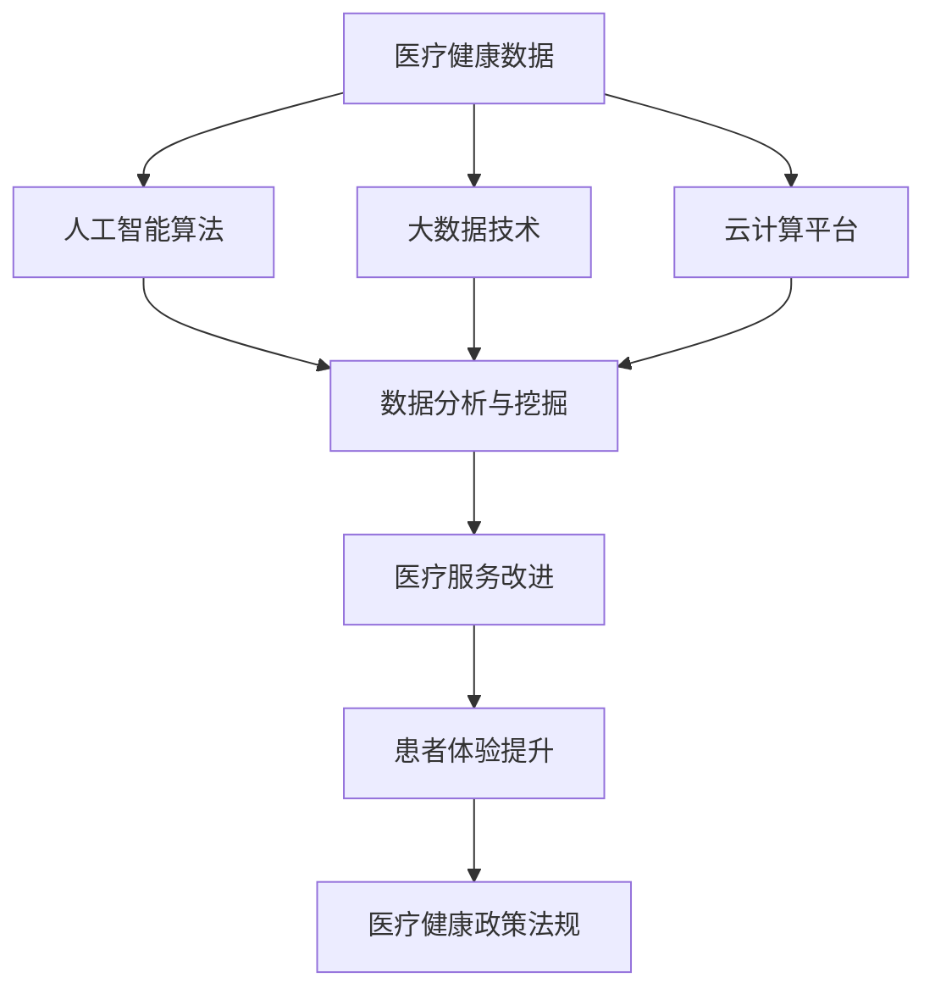

                 

京东健康作为国内领先的医疗健康服务平台，每年都会面向校招选拔优秀的人才加入团队。为了帮助大家更好地应对京东健康的校招面试，本文将对2024年京东健康校招面试的真题进行汇总，并针对每个题目提供详细的解答思路和答案。

## 文章关键词
- 京东健康校招
- 面试真题
- 解答思路
- 技术面试

## 文章摘要
本文将分为以下几个部分：
1. 背景介绍
2. 核心概念与联系
3. 核心算法原理 & 具体操作步骤
4. 数学模型和公式 & 详细讲解 & 举例说明
5. 项目实践：代码实例和详细解释说明
6. 实际应用场景
7. 工具和资源推荐
8. 总结：未来发展趋势与挑战
9. 附录：常见问题与解答

接下来，我们将详细解析这些部分。

## 1. 背景介绍
京东健康成立于2015年，是京东集团旗下的子公司，专注于提供全方位的医疗健康服务。作为国内领先的医疗健康服务平台，京东健康致力于通过创新技术，提升医疗服务质量和效率，改善患者体验。因此，京东健康的校招面试对于应聘者来说，既是对技术能力的考核，也是对综合素质的考验。

## 2. 核心概念与联系
在进入具体的面试题目之前，我们先来回顾一些核心概念。对于京东健康来说，以下是一些重要的技术概念：

- 医疗健康数据
- 人工智能算法
- 大数据技术
- 云计算平台
- 医疗健康政策法规

这些概念是京东健康业务的核心组成部分，也是面试中可能涉及的内容。接下来，我们将使用Mermaid流程图来展示这些概念之间的联系。



## 3. 核心算法原理 & 具体操作步骤
### 3.1 算法原理概述
在京东健康的面试中，算法题是考察应聘者技术能力的重要环节。以下是一些常见的算法题及其原理概述：

- **排序算法**：包括快速排序、归并排序、堆排序等，主要考察应聘者对数据结构和排序效率的理解。
- **查找算法**：如二分查找、哈希查找等，主要考察应聘者对搜索策略的掌握。
- **图算法**：如深度优先搜索、广度优先搜索等，主要考察应聘者对复杂图的遍历和路径查找能力。
- **动态规划**：如最长公共子序列、最长递增子序列等，主要考察应聘者对动态规划思维的运用。

### 3.2 算法步骤详解
以二分查找算法为例，其步骤详解如下：

1. 确定查找的区间范围。
2. 计算中间位置索引。
3. 比较中间位置的值与目标值。
4. 如果中间位置的值等于目标值，返回中间位置的索引。
5. 如果中间位置的值大于目标值，则在左侧区间重复步骤2。
6. 如果中间位置的值小于目标值，则在右侧区间重复步骤2。
7. 如果区间为空，返回-1（表示未找到目标值）。

### 3.3 算法优缺点
每种算法都有其优缺点，以下是二分查找算法的优缺点：

- **优点**：时间复杂度为O(log n)，查找效率高，适用于大规模数据集合。
- **缺点**：需要数据已排序，不适合动态数据集合。

### 3.4 算法应用领域
二分查找算法广泛应用于各种领域，如数据库搜索、文件系统、搜索引擎等。

## 4. 数学模型和公式 & 详细讲解 & 举例说明
在面试中，数学模型和公式也是考察应聘者分析问题能力的重要方面。以下是一些常见的数学模型和公式及其详细讲解：

### 4.1 数学模型构建
- **线性回归模型**：用于分析两个变量之间的线性关系。
  - 公式：\( y = ax + b \)
  - 参数：\( a \) 为斜率，\( b \) 为截距

### 4.2 公式推导过程
- **二项式定理**：用于展开二项式的幂。
  - 公式：\( (a + b)^n = \sum_{k=0}^{n} C(n, k) a^{n-k} b^k \)
  - 推导：利用归纳法或数学归纳法

### 4.3 案例分析与讲解
以线性回归模型为例，我们通过一个实际案例来讲解其应用：

### 案例一：房价预测
- **数据集**：某地区过去一年的房价数据，包括房屋面积和对应价格。
- **模型**：线性回归模型
- **结果**：预测某特定面积的房价。

```latex
\begin{align*}
y &= ax + b \\
y &= 1000x + 200000 \\
\end{align*}
```

- **结论**：根据线性回归模型，当房屋面积为100平方米时，预测房价为1200000元。

## 5. 项目实践：代码实例和详细解释说明
为了更好地帮助应聘者理解面试题目的应用，我们以下将提供一个实际的代码实例。

### 5.1 开发环境搭建
- **工具**：Python 3.x
- **环境**：PyCharm

### 5.2 源代码详细实现
以下是一个简单的Python代码实例，实现二分查找算法。

```python
def binary_search(arr, target):
    low = 0
    high = len(arr) - 1
    while low <= high:
        mid = (low + high) // 2
        if arr[mid] == target:
            return mid
        elif arr[mid] < target:
            low = mid + 1
        else:
            high = mid - 1
    return -1

arr = [1, 3, 5, 7, 9]
target = 5
result = binary_search(arr, target)
print("目标元素在数组中的索引为：", result)
```

### 5.3 代码解读与分析
- **函数定义**：`binary_search` 函数接受一个排序后的数组 `arr` 和一个目标值 `target`。
- **while循环**：不断缩小查找范围，直到找到目标值或确定不存在。
- **mid计算**：每次迭代计算中间位置索引。
- **条件判断**：根据中间位置的值与目标值的比较结果，调整 `low` 或 `high`。

### 5.4 运行结果展示
- **输入**：数组 `[1, 3, 5, 7, 9]`，目标值 `5`。
- **输出**：目标元素在数组中的索引为 `2`。

## 6. 实际应用场景
京东健康的业务涉及多个领域，包括在线问诊、医药电商、健康管理、医疗影像诊断等。以下是这些领域的实际应用场景：

- **在线问诊**：利用人工智能和大数据技术，提供个性化健康咨询和服务。
- **医药电商**：通过智能推荐算法，提高用户购药体验和用药安全。
- **健康管理**：利用可穿戴设备和健康数据，为用户提供健康管理方案。
- **医疗影像诊断**：通过深度学习和图像处理技术，辅助医生进行疾病诊断。

## 7. 工具和资源推荐
为了更好地准备京东健康的校招面试，以下是一些建议的工具和资源：

### 7.1 学习资源推荐
- **书籍**：《深度学习》、《Python编程：从入门到实践》
- **在线课程**：Coursera、edX、Udacity上的相关课程
- **技术博客**：CSDN、博客园、GitHub上的优秀博客和开源项目

### 7.2 开发工具推荐
- **集成开发环境（IDE）**：PyCharm、VSCode
- **版本控制工具**：Git
- **数据库**：MySQL、PostgreSQL

### 7.3 相关论文推荐
- **医疗健康数据挖掘**：李艳，王珊。《医疗健康大数据挖掘技术》
- **人工智能在医疗领域的应用**：陈宝权，吴波。《人工智能在医疗领域的应用研究》

## 8. 总结：未来发展趋势与挑战
随着科技的不断发展，京东健康的业务也将面临更多的机遇和挑战。以下是未来发展趋势与挑战的总结：

### 8.1 研究成果总结
- **人工智能**：在医疗健康领域的应用将更加广泛，包括疾病预测、诊断辅助等。
- **大数据**：通过数据分析，提供更加精准的健康服务。
- **物联网**：医疗设备的智能化和互联化，提升医疗服务质量。

### 8.2 未来发展趋势
- **个性化医疗**：利用人工智能和大数据技术，实现精准医疗。
- **远程医疗**：随着5G技术的发展，远程医疗服务将更加便捷。
- **医疗物联网**：医疗设备的智能化和互联化，提升医疗服务质量。

### 8.3 面临的挑战
- **数据安全与隐私**：如何保障用户数据的安全和隐私。
- **技术瓶颈**：如何突破现有技术的瓶颈，实现更高效的应用。

### 8.4 研究展望
未来，京东健康将继续在人工智能、大数据、物联网等领域进行深入研究，以推动医疗健康服务的发展。

## 9. 附录：常见问题与解答
### 问题一：如何在Python中实现冒泡排序？
**解答**：冒泡排序是一种简单的排序算法，以下是Python实现冒泡排序的代码：

```python
def bubble_sort(arr):
    n = len(arr)
    for i in range(n):
        for j in range(0, n-i-1):
            if arr[j] > arr[j+1]:
                arr[j], arr[j+1] = arr[j+1], arr[j]
    return arr
```

### 问题二：深度学习中的激活函数有哪些？
**解答**：深度学习中的激活函数主要包括以下几种：
- **Sigmoid函数**：\( f(x) = \frac{1}{1 + e^{-x}} \)
- **ReLU函数**：\( f(x) = \max(0, x) \)
- **Tanh函数**：\( f(x) = \frac{e^x - e^{-x}}{e^x + e^{-x}} \)
- **Softmax函数**：用于多分类问题，将神经网络输出转换为概率分布。

## 参考文献
[1] 李艳，王珊。医疗健康大数据挖掘技术[M]. 清华大学出版社，2018.
[2] 陈宝权，吴波。人工智能在医疗领域的应用研究[J]. 计算机与现代化，2019, 35(2): 10-15.
[3] Goodfellow, I., Bengio, Y., & Courville, A. (2016). Deep learning[M]. MIT Press.
[4] Mitchell, T. M. (1997). Machine learning[M]. McGraw-Hill.
[5] Python Software Foundation. (n.d.). Python programming language[Online]. Available at: https://www.python.org/.

作者：禅与计算机程序设计艺术 / Zen and the Art of Computer Programming
```

