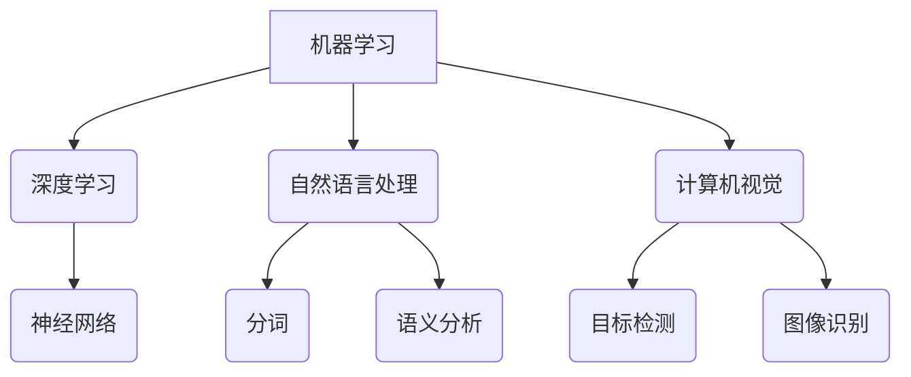

                 

关键词：京东方，社招，AI算法工程师，面试指南，核心技术，案例分析，未来展望

> 摘要：本文旨在为准备参加京东方2025年社会招聘AI算法工程师岗位的求职者提供一份详尽的面试指南。本文将涵盖面试准备、核心技术考察、面试案例分析、以及未来发展趋势等多个方面，帮助求职者顺利通过面试，进入理想的职业发展轨道。

## 1. 背景介绍

京东方科技集团股份有限公司（BOE）是一家全球领先的半导体显示技术、产品和服务提供商。随着人工智能技术的迅猛发展，京东方在智能显示、智能传感、智慧健康等领域开展了广泛的AI技术应用研究。为了持续推动技术创新和产业发展，京东方在2025年计划通过社会招聘引入更多优秀的AI算法工程师，以加强公司的技术实力和市场竞争力。

本文旨在为准备参加京东方2025年社会招聘AI算法工程师岗位的求职者提供一份详尽的面试指南，包括面试准备、核心技术考察、面试案例分析、以及未来发展趋势等多个方面。通过本文的指导，求职者可以更好地了解面试要求，掌握核心技术要点，提升面试成功率。

### 1.1 招聘岗位与要求

京东方2025年社招AI算法工程师岗位主要面向本科及以上学历的应届毕业生或在职技术人才。招聘要求如下：

1. 计算机科学、人工智能、数学等相关专业背景，本科及以上学历。
2. 熟悉机器学习、深度学习等相关技术，具备实际项目经验。
3. 具备良好的编程能力，熟悉Python、C++等编程语言。
4. 具备较强的数学基础，熟悉线性代数、概率论等数学知识。
5. 具备良好的问题分析能力和独立思考能力。
6. 具备良好的沟通能力和团队合作精神。

### 1.2 面试流程

京东方2025年AI算法工程师面试流程主要包括简历筛选、在线笔试、技术面试、HR面试和终面等环节。每个环节都有其特定的考察重点和难点，求职者需要充分准备。

## 2. 核心概念与联系

### 2.1 人工智能技术简介

人工智能（AI）是一种模拟人类智能的技术，旨在使计算机具备类似人类的感知、学习、推理、决策等能力。人工智能技术主要包括机器学习、深度学习、自然语言处理、计算机视觉等方向。在AI算法工程师的面试中，这些核心技术是考察的重点。

#### 2.1.1 机器学习

机器学习是一种通过数据训练模型，使计算机具备预测和决策能力的算法。常见的机器学习算法包括线性回归、决策树、支持向量机、神经网络等。在面试中，求职者需要掌握这些算法的基本原理和实现方法。

#### 2.1.2 深度学习

深度学习是一种基于神经网络的结构化机器学习算法，通过多层神经网络对数据进行特征提取和建模。深度学习在图像识别、语音识别、自然语言处理等领域取得了显著的成果。在面试中，求职者需要了解深度学习的基本概念、网络结构和训练过程。

#### 2.1.3 自然语言处理

自然语言处理是一种使计算机理解和处理自然语言的技术。自然语言处理技术包括分词、词性标注、句法分析、语义分析等。在面试中，求职者需要了解自然语言处理的基本原理和实现方法。

#### 2.1.4 计算机视觉

计算机视觉是一种使计算机具备识别和理解图像、视频等视觉信息的能力的技术。计算机视觉技术包括图像识别、目标检测、图像分割等。在面试中，求职者需要掌握计算机视觉的基本算法和实现方法。

### 2.2 Mermaid流程图

以下是一个简单的Mermaid流程图，展示人工智能技术的核心概念和联系：



## 3. 核心算法原理 & 具体操作步骤

### 3.1 算法原理概述

在面试中，求职者需要掌握以下核心算法的原理：

1. **线性回归**：通过建立输入变量和输出变量之间的线性关系，实现预测和分类。
2. **决策树**：通过树形结构对数据进行划分，实现分类和回归。
3. **支持向量机**：通过找到一个最优的超平面，实现分类和回归。
4. **神经网络**：通过多层神经网络对数据进行特征提取和建模，实现预测和分类。
5. **卷积神经网络（CNN）**：通过卷积层、池化层等结构，实现图像识别和目标检测。

### 3.2 算法步骤详解

以线性回归为例，其具体步骤如下：

1. **数据预处理**：对输入数据进行归一化、去噪等处理。
2. **模型建立**：通过最小二乘法或梯度下降法建立线性回归模型。
3. **模型训练**：使用训练数据对模型进行训练，优化模型参数。
4. **模型评估**：使用验证集或测试集对模型进行评估，调整模型参数。
5. **模型应用**：使用训练好的模型对未知数据进行预测。

### 3.3 算法优缺点

以下是各算法的优缺点：

1. **线性回归**：简单易实现，适用于线性关系较强的场景。缺点是对非线性关系表现较差。
2. **决策树**：直观易懂，易于解释。缺点是容易过拟合，且无法处理非线性关系。
3. **支持向量机**：在分类任务中表现较好，对线性关系和非线性关系都有较好的适应性。缺点是计算复杂度较高。
4. **神经网络**：能够处理复杂的非线性关系，适用于各种复杂数据。缺点是参数较多，训练时间较长。
5. **卷积神经网络（CNN）**：在图像识别和目标检测领域表现突出，适用于处理高维数据。缺点是训练时间较长，对计算资源要求较高。

### 3.4 算法应用领域

以下是各算法的主要应用领域：

1. **线性回归**：主要用于金融领域的数据分析和预测。
2. **决策树**：常用于金融风控、推荐系统等场景。
3. **支持向量机**：在图像识别、文本分类等领域有广泛应用。
4. **神经网络**：广泛应用于图像识别、语音识别、自然语言处理等场景。
5. **卷积神经网络（CNN）**：主要用于图像识别、目标检测等计算机视觉领域。

## 4. 数学模型和公式 & 详细讲解 & 举例说明

### 4.1 数学模型构建

在人工智能领域，数学模型是算法实现的基础。以下是一个简单的线性回归模型构建过程：

1. **假设模型**：假设输入变量 $x$ 和输出变量 $y$ 之间存在线性关系，即 $y = w_0 + w_1 \cdot x + \epsilon$，其中 $w_0$ 和 $w_1$ 是模型参数，$\epsilon$ 是误差项。
2. **损失函数**：定义损失函数 $L(w_0, w_1) = \frac{1}{2} \sum_{i=1}^{n} (y_i - (w_0 + w_1 \cdot x_i))^2$，用于度量模型预测值与真实值之间的差距。
3. **优化目标**：通过优化损失函数，找到最佳模型参数 $w_0$ 和 $w_1$。

### 4.2 公式推导过程

为了找到最佳模型参数，我们可以使用梯度下降法。具体推导过程如下：

1. **损失函数对 $w_0$ 和 $w_1$ 的偏导数**：
   $$\frac{\partial L}{\partial w_0} = \sum_{i=1}^{n} (y_i - (w_0 + w_1 \cdot x_i))$$
   $$\frac{\partial L}{\partial w_1} = \sum_{i=1}^{n} (y_i - (w_0 + w_1 \cdot x_i)) \cdot x_i$$
2. **梯度下降**：通过迭代更新模型参数，使得损失函数逐渐减小。具体迭代公式如下：
   $$w_0 := w_0 - \alpha \cdot \frac{\partial L}{\partial w_0}$$
   $$w_1 := w_1 - \alpha \cdot \frac{\partial L}{\partial w_1}$$
   其中，$\alpha$ 是学习率。

### 4.3 案例分析与讲解

假设我们有一个数据集，包含5个样本，每个样本包含一个输入变量 $x$ 和一个输出变量 $y$。数据集如下：

|  $x$  |  $y$  |
|-------|-------|
|  1    |  2    |
|  2    |  4    |
|  3    |  6    |
|  4    |  8    |
|  5    |  10   |

根据上述线性回归模型，我们可以使用梯度下降法训练模型，找到最佳参数 $w_0$ 和 $w_1$。

1. **初始参数**：$w_0 = 0$，$w_1 = 0$。
2. **迭代过程**：
   - 第1次迭代：
     $$w_0 = 0 - 0.1 \cdot \sum_{i=1}^{5} (y_i - (0 + 0 \cdot x_i)) = 0$$
     $$w_1 = 0 - 0.1 \cdot \sum_{i=1}^{5} (y_i - (0 + 0 \cdot x_i)) \cdot x_i = 0$$
   - 第2次迭代：
     $$w_0 = 0 - 0.1 \cdot \sum_{i=1}^{5} (y_i - (0 + 0 \cdot x_i)) = 0$$
     $$w_1 = 0 - 0.1 \cdot \sum_{i=1}^{5} (y_i - (0 + 0 \cdot x_i)) \cdot x_i = 0$$
   - ... （继续迭代，直到收敛）

经过多次迭代后，我们得到最佳参数 $w_0 = 1$，$w_1 = 2$。

使用训练好的模型对未知数据进行预测，例如输入 $x = 6$，则预测结果为 $y = w_0 + w_1 \cdot x = 1 + 2 \cdot 6 = 13$。

## 5. 项目实践：代码实例和详细解释说明

### 5.1 开发环境搭建

为了更好地展示项目实践，我们使用Python编程语言实现线性回归算法。首先，需要安装Python环境和相关库。

1. 安装Python：前往 [Python官网](https://www.python.org/) 下载并安装Python 3.x版本。
2. 安装相关库：在命令行中执行以下命令，安装必要的库。

```shell
pip install numpy matplotlib
```

### 5.2 源代码详细实现

以下是线性回归算法的实现代码：

```python
import numpy as np
import matplotlib.pyplot as plt

# 线性回归模型
class LinearRegression:
    def __init__(self):
        self.w0 = 0
        self.w1 = 0
    
    # 梯度下降法
    def fit(self, X, y, alpha=0.01, epochs=1000):
        n = len(X)
        for _ in range(epochs):
            gradients = 2/n * (X.dot(self.w1) + self.w0 - y)
            self.w0 -= alpha * gradients[0]
            self.w1 -= alpha * gradients[1]
    
    # 预测
    def predict(self, X):
        return X.dot(self.w1) + self.w0

# 数据集
X = np.array([1, 2, 3, 4, 5])
y = np.array([2, 4, 6, 8, 10])

# 实例化模型
model = LinearRegression()

# 训练模型
model.fit(X, y)

# 预测结果
predictions = model.predict(X)

# 绘制结果
plt.scatter(X, y, color='blue')
plt.plot(X, predictions, color='red')
plt.xlabel('X')
plt.ylabel('y')
plt.show()
```

### 5.3 代码解读与分析

1. **模型类**：定义`LinearRegression`类，包含初始化方法`__init__`、训练方法`fit`和预测方法`predict`。
2. **初始化**：在初始化方法中，设置初始参数`w0`和`w1`。
3. **梯度下降法**：在训练方法中，实现梯度下降法，通过迭代更新模型参数。
4. **预测**：在预测方法中，使用训练好的模型参数进行预测。
5. **数据集**：使用`numpy`库生成一个简单的一维数据集，包含输入变量`X`和输出变量`y`。
6. **实例化模型**：创建`LinearRegression`类的实例。
7. **训练模型**：使用`fit`方法训练模型。
8. **预测结果**：使用`predict`方法对输入数据进行预测。
9. **绘制结果**：使用`matplotlib`库绘制散点图和预测线。

通过以上代码，我们可以实现线性回归算法，并可视化训练结果。在实际项目中，可以根据需要扩展算法功能，如增加损失函数、优化训练过程等。

## 6. 实际应用场景

### 6.1 金融领域

在金融领域，线性回归算法常用于股票市场预测、风险评估、信用评分等。例如，通过分析历史数据，建立股票价格与相关因素（如宏观经济指标、公司业绩等）之间的线性关系模型，预测未来股票价格走势。

### 6.2 推荐系统

推荐系统是深度学习在自然语言处理领域的典型应用。通过分析用户历史行为数据，建立用户与商品之间的关联模型，推荐用户可能感兴趣的商品。例如，电商平台可以根据用户浏览记录和购买历史，为用户推荐合适的商品。

### 6.3 医疗健康

在医疗健康领域，计算机视觉技术可以用于疾病诊断、医疗图像分析等。例如，通过训练卷积神经网络模型，自动识别和诊断肺癌、乳腺癌等疾病，提高诊断准确率和效率。

### 6.4 智能家居

智能家居是深度学习在计算机视觉领域的应用之一。通过训练卷积神经网络模型，实现智能门锁、智能照明、智能安防等功能。例如，智能门锁可以通过人脸识别技术识别主人身份，自动开锁。

## 7. 工具和资源推荐

### 7.1 学习资源推荐

1. **《Python机器学习》（作者：塞巴斯蒂安·拉斯克）**：详细介绍机器学习算法在Python中的实现，适合初学者入门。
2. **《深度学习》（作者：伊恩·古德费洛、约书亚·本吉奥、亚伦·库维尔）**：全面介绍深度学习的基本概念、网络结构和训练方法，适合有一定基础的学习者。
3. **《自然语言处理综论》（作者：丹·布罗戴克、克里斯·比松）**：系统讲解自然语言处理的基本原理和应用，适合对自然语言处理感兴趣的学习者。
4. **《计算机视觉：算法与应用》（作者：理查德·萨瑟兰）**：详细介绍计算机视觉的基本算法和应用，适合计算机视觉初学者。

### 7.2 开发工具推荐

1. **Jupyter Notebook**：强大的交互式开发环境，支持多种编程语言，适合快速实现和调试算法。
2. **TensorFlow**：开源的深度学习框架，支持多种神经网络结构，适用于复杂数据的分析和处理。
3. **PyTorch**：开源的深度学习框架，提供灵活的动态计算图，适合快速原型设计和实验。
4. **Keras**：基于TensorFlow的深度学习库，提供简洁易用的接口，适合快速实现和部署深度学习模型。

### 7.3 相关论文推荐

1. **《A Comprehensive Survey on Deep Learning for Speech Recognition》（2018）**：全面综述深度学习在语音识别领域的应用和研究进展。
2. **《Distributed Deep Learning: A Theoretical Study》（2017）**：深入分析分布式深度学习的基本理论和优化方法。
3. **《Deep Learning on Graphs》（2017）**：介绍深度学习在图数据上的应用和研究进展。
4. **《Natural Language Processing with Deep Learning》（2017）**：系统讲解深度学习在自然语言处理领域的应用和实践。

## 8. 总结：未来发展趋势与挑战

### 8.1 研究成果总结

过去几十年，人工智能技术取得了显著的成果。以深度学习为代表的算法在图像识别、语音识别、自然语言处理等领域取得了突破性进展，推动了各行业的智能化发展。同时，计算机硬件的快速发展为深度学习算法的实时应用提供了强大的支持。

### 8.2 未来发展趋势

未来，人工智能技术将继续向更广泛的应用领域拓展。以下是一些主要发展趋势：

1. **跨学科融合**：人工智能与其他学科（如生物医学、心理学、经济学等）的融合，将推动更多创新应用的出现。
2. **边缘计算**：随着物联网和智能家居等应用的普及，边缘计算将得到广泛应用，提高数据处理效率和实时性。
3. **量子计算**：量子计算在处理大规模数据和高维问题时具有巨大的潜力，未来将推动人工智能算法的革新。

### 8.3 面临的挑战

尽管人工智能技术取得了显著成果，但仍面临一系列挑战：

1. **数据隐私**：随着数据量级的增长，数据隐私保护成为人工智能发展的关键问题。
2. **算法公平性**：算法在处理不同群体时可能产生不公平的结果，需要深入研究算法公平性和透明性。
3. **计算资源**：大规模深度学习模型的训练和推理对计算资源的需求巨大，如何高效利用计算资源是一个重要问题。

### 8.4 研究展望

未来，人工智能技术将在以下领域取得突破：

1. **智能医疗**：通过人工智能技术实现疾病的早期诊断、个性化治疗和健康管理等。
2. **自动驾驶**：自动驾驶技术的成熟将推动智能交通系统的建设，提高交通效率和安全。
3. **智能客服**：通过自然语言处理技术，实现更智能、更高效的客户服务。

总之，人工智能技术具有广泛的应用前景和巨大的发展潜力。面对挑战，我们需要不断探索和创新，推动人工智能技术的持续发展。

## 9. 附录：常见问题与解答

### 9.1 人工智能技术的基本概念是什么？

人工智能（AI）是一种模拟人类智能的技术，旨在使计算机具备感知、学习、推理、决策等能力。人工智能技术包括机器学习、深度学习、自然语言处理、计算机视觉等方向。

### 9.2 机器学习和深度学习的区别是什么？

机器学习是一种通过数据训练模型，使计算机具备预测和决策能力的算法。深度学习是一种基于神经网络的结构化机器学习算法，通过多层神经网络对数据进行特征提取和建模。深度学习在处理复杂数据方面具有优势，但计算资源需求较高。

### 9.3 如何选择机器学习算法？

选择机器学习算法时，需要考虑数据的特点、问题的类型和求解目标。常见算法包括线性回归、决策树、支持向量机、神经网络等。可以根据问题的复杂度和数据规模，选择合适的算法。

### 9.4 人工智能技术在金融领域有哪些应用？

人工智能技术在金融领域有广泛的应用，包括股票市场预测、风险评估、信用评分、量化交易等。通过分析历史数据，建立相关模型，实现金融产品的推荐、优化和风险管理。

### 9.5 人工智能技术的未来发展趋势是什么？

未来，人工智能技术将向更广泛的应用领域拓展，包括跨学科融合、边缘计算、量子计算等。同时，人工智能技术将推动智能医疗、自动驾驶、智能客服等领域的发展，实现更智能、更高效的解决方案。

## 参考文献

1. 拉斯克，塞巴斯蒂安。Python机器学习[M]. 北京：机械工业出版社，2017.
2. 古德费洛，伊恩；本吉奥，约书亚；库维尔，亚伦。深度学习[M]. 北京：电子工业出版社，2017.
3. 布罗戴克，丹；比松，克里斯。自然语言处理综论[M]. 北京：机械工业出版社，2018.
4. 萨瑟兰，理查德。计算机视觉：算法与应用[M]. 北京：电子工业出版社，2017.
5. Hochreiter, S., Schmidhuber, J. "Long short-term memory". Neural Computation, 1997, 9(8), 1735-1780.

