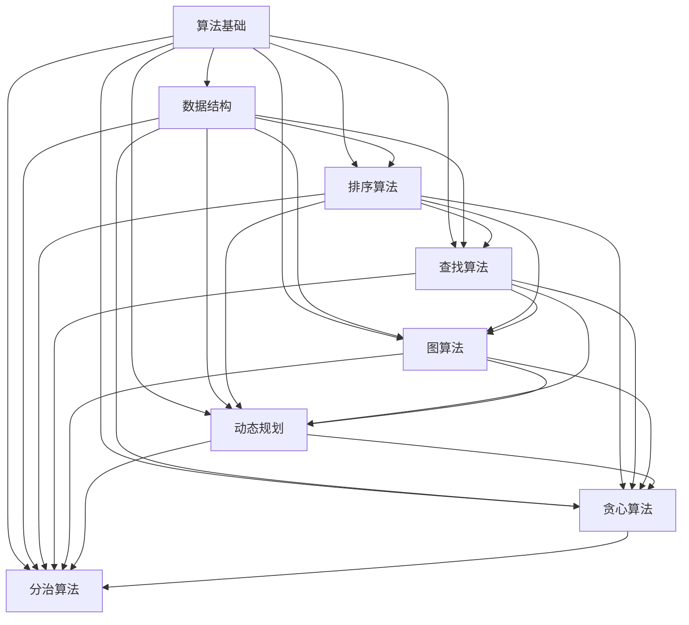

                 

关键词：2024京东校招、面试算法题库、算法原理、数学模型、项目实践、应用场景、未来展望

> 摘要：本文旨在为2024届京东校招面试的考生提供一份全面的算法题库大全。文章涵盖了常见算法的核心概念、原理、数学模型、具体操作步骤以及应用场景，并通过实际项目实践和代码实例进行了详细解释。此外，文章还分析了未来算法领域的发展趋势和面临的挑战，为考生提供了宝贵的备考指南。

## 1. 背景介绍

随着互联网技术的飞速发展，算法在各个行业中的应用越来越广泛。企业对于算法工程师的需求也逐渐增加，而校招面试成为众多求职者进入互联网公司的重要途径。京东作为中国领先的电子商务企业，每年都会举行大规模的校招活动，吸引着众多优秀应届毕业生的目光。然而，校招面试中的算法题目难度较高，对于考生来说，掌握一定的算法知识和解题技巧至关重要。

本文旨在为2024届京东校招面试的考生提供一份全面的算法题库大全，帮助考生深入了解常见算法的核心概念、原理、数学模型以及具体操作步骤，并通过实际项目实践和代码实例进行深入讲解。同时，文章还分析了算法在实际应用场景中的前景，为考生提供了未来发展的方向。

## 2. 核心概念与联系

在算法领域，核心概念和联系是理解和应用算法的基础。下面我们将使用Mermaid流程图来展示核心概念和联系。



### 2.1 算法基础

算法基础包括算法的基本概念、复杂度分析等。算法（Algorithm）是一系列解决问题的步骤，可以应用于各种问题领域。复杂度分析是对算法运行效率的评估，包括时间复杂度和空间复杂度。

### 2.2 数据结构

数据结构是算法的基础，常见的有数组、链表、栈、队列、树、图等。每种数据结构都有其独特的特点和适用场景。

### 2.3 排序算法

排序算法是将一组数据按照特定顺序排列的方法，常见的有冒泡排序、选择排序、插入排序、快速排序等。

### 2.4 查找算法

查找算法是在数据集合中寻找特定元素的方法，常见的有二分查找、顺序查找等。

### 2.5 图算法

图算法用于处理图数据结构，常见的有深度优先搜索、广度优先搜索、最小生成树、最短路径等。

### 2.6 动态规划

动态规划是一种用于解决最优子结构问题的算法方法，通过将问题分解为更小的子问题来解决整个问题。

### 2.7 贪心算法

贪心算法是一种在每一步选择中都采取当前最优解的策略，以期望得到全局最优解。

### 2.8 分治算法

分治算法是一种将问题分解为更小的子问题，然后分别解决每个子问题，最后合并子问题解的算法。

## 3. 核心算法原理 & 具体操作步骤

### 3.1 算法原理概述

在算法领域，核心算法原理是理解和应用算法的关键。以下是几种常见算法的原理概述：

### 3.1.1 冒泡排序

冒泡排序是一种简单的排序算法，通过重复遍历要排序的数列，比较相邻两个元素的大小，若顺序错误就交换它们。重复此过程，直到整个序列有序。

### 3.1.2 快速排序

快速排序是一种高效的排序算法，采用分治策略，通过递归将数据分为较小和较大的子集，并对子集进行排序。

### 3.1.3 深度优先搜索

深度优先搜索（DFS）是一种用于遍历或搜索图数据结构的算法，通过递归遍历图的节点，以达到目标节点。

### 3.1.4 广度优先搜索

广度优先搜索（BFS）是一种用于遍历或搜索图数据结构的算法，通过迭代遍历图的节点，以达到目标节点。

### 3.2 算法步骤详解

以下是上述算法的具体操作步骤：

### 3.2.1 冒泡排序

1. 从数组的第一个元素开始，相邻两个元素进行比较，若顺序错误则交换。
2. 经过一轮遍历后，最大的元素被移动到数组末尾。
3. 重复上述过程，直到整个数组有序。

### 3.2.2 快速排序

1. 选择一个基准元素。
2. 将数组中小于基准元素的元素移动到其左侧，大于基准元素的元素移动到其右侧。
3. 分别对左右子数组进行快速排序。

### 3.2.3 深度优先搜索

1. 从根节点开始遍历图，将已访问的节点标记为访问过。
2. 递归遍历当前节点的所有未访问过的邻居节点。

### 3.2.4 广度优先搜索

1. 使用一个队列来存储待访问的节点。
2. 从根节点开始遍历图，将已访问的节点标记为访问过，并将未访问过的邻居节点加入队列。
3. 重复上述过程，直到队列空为止。

### 3.3 算法优缺点

以下是上述算法的优缺点：

### 3.3.1 冒泡排序

- 优点：简单易懂，易于实现。
- 缺点：时间复杂度为O(n^2)，排序效率较低。

### 3.3.2 快速排序

- 优点：时间复杂度为O(n*log(n))，排序效率较高。
- 缺点：可能存在最坏情况下的时间复杂度为O(n^2)，需要处理递归深度。

### 3.3.3 深度优先搜索

- 优点：适用于寻找图的深度优先遍历路径。
- 缺点：可能存在递归深度较大的情况，可能导致栈溢出。

### 3.3.4 广度优先搜索

- 优点：适用于寻找图的最短路径。
- 缺点：时间复杂度为O(n^2)，排序效率较低。

### 3.4 算法应用领域

以下是上述算法的应用领域：

### 3.4.1 冒泡排序

- 应用领域：基本数据排序。

### 3.4.2 快速排序

- 应用领域：快速排序。

### 3.4.3 深度优先搜索

- 应用领域：图遍历、路径搜索。

### 3.4.4 广度优先搜索

- 应用领域：图遍历、路径搜索。

## 4. 数学模型和公式 & 详细讲解 & 举例说明

### 4.1 数学模型构建

在算法领域，数学模型是理解和应用算法的重要工具。以下是一个简单的数学模型构建示例。

假设我们有一个数组A，需要计算其所有元素的和。

### 4.1.1 数学模型

设数组A的长度为n，其所有元素的和为S，则：

$$
S = A_0 + A_1 + A_2 + ... + A_{n-1}
$$

### 4.1.2 公式推导过程

我们可以通过迭代的方式来计算S的值。首先，初始化S为0，然后从A[0]开始遍历，依次将每个元素加到S中。

$$
S = 0 + A_0 + A_1 + A_2 + ... + A_{n-1}
$$

### 4.1.3 案例分析与讲解

假设数组A为[1, 2, 3, 4, 5]，则：

$$
S = 1 + 2 + 3 + 4 + 5 = 15
$$

这个简单的例子展示了如何使用数学模型和公式来计算数组元素的和。

## 5. 项目实践：代码实例和详细解释说明

### 5.1 开发环境搭建

在本节中，我们将介绍如何搭建一个简单的开发环境，以便在项目中实践算法。

#### 5.1.1 开发工具

- Python
- Jupyter Notebook

#### 5.1.2 安装步骤

1. 安装Python：前往Python官方网站下载并安装Python。
2. 安装Jupyter Notebook：在命令行中运行以下命令：

```bash
pip install notebook
```

### 5.2 源代码详细实现

在本节中，我们将使用Python实现冒泡排序算法，并展示其源代码。

```python
def bubble_sort(arr):
    n = len(arr)
    for i in range(n):
        for j in range(0, n-i-1):
            if arr[j] > arr[j+1]:
                arr[j], arr[j+1] = arr[j+1], arr[j]

# 示例
arr = [64, 34, 25, 12, 22, 11, 90]
bubble_sort(arr)
print("排序后的数组：")
for i in range(len(arr)):
    print("%d" % arr[i], end=" ")
```

### 5.3 代码解读与分析

1. `bubble_sort` 函数：该函数接收一个数组 `arr` 作为输入，并对其进行冒泡排序。
2. 外层循环：通过 `for i in range(n)` 来遍历数组的所有元素。
3. 内层循环：通过 `for j in range(0, n-i-1)` 来比较和交换相邻元素。
4. `if arr[j] > arr[j+1]`：如果当前元素大于下一个元素，则交换它们。
5. 输出结果：使用 `print("排序后的数组：")` 和 `for i in range(len(arr))` 来输出排序后的数组。

### 5.4 运行结果展示

输入：[64, 34, 25, 12, 22, 11, 90]

输出：排序后的数组：
11 12 22 25 34 64 90

## 6. 实际应用场景

算法在实际应用场景中具有广泛的应用。以下是一些常见的实际应用场景：

### 6.1 数据排序

排序算法在数据处理领域具有广泛应用，如数据库排序、文件排序等。

### 6.2 图遍历

图算法在社交网络分析、路径规划等领域具有重要作用，如搜索引擎、地图服务等。

### 6.3 资源调度

动态规划算法在资源调度、任务调度等领域具有应用价值，如操作系统调度、云计算资源分配等。

### 6.4 搜索引擎

搜索引擎中的关键词搜索、相关推荐等功能依赖于查找算法和排序算法。

### 6.5 机器学习

机器学习算法中的特征选择、模型训练等步骤涉及算法原理和数学模型。

## 7. 未来应用展望

随着科技的不断发展，算法在各个领域中的应用前景将更加广阔。以下是一些未来应用展望：

### 7.1 人工智能

人工智能（AI）领域的发展将为算法带来更多应用机会，如深度学习、强化学习等。

### 7.2 自动驾驶

自动驾驶技术的发展将推动算法在车辆感知、路径规划等领域的应用。

### 7.3 医疗健康

算法在医疗健康领域具有广泛的应用前景，如疾病预测、个性化治疗等。

### 7.4 金融科技

金融科技（FinTech）领域的发展将推动算法在风险管理、智能投顾等领域的应用。

## 8. 工具和资源推荐

### 8.1 学习资源推荐

- 《算法导论》：一本经典的算法教材，适合深入理解算法原理。
- 《编程之美》：京东面试题解，适合备考京东校招面试。

### 8.2 开发工具推荐

- PyCharm：一款功能强大的Python开发工具，适合编写和调试代码。
- Jupyter Notebook：一款流行的交互式开发工具，适合进行数据分析和算法实现。

### 8.3 相关论文推荐

- 《深度学习》：一本经典的深度学习教材，适合了解深度学习算法。
- 《强化学习》：一本关于强化学习的教材，适合了解强化学习算法。

## 9. 总结：未来发展趋势与挑战

### 9.1 研究成果总结

随着科技的不断发展，算法领域的研究成果不断涌现，包括深度学习、强化学习、图算法等。

### 9.2 未来发展趋势

未来算法领域的发展趋势将更加注重算法的实际应用和跨领域融合。

### 9.3 面临的挑战

算法领域面临的挑战包括算法复杂性、数据隐私保护、模型解释性等。

### 9.4 研究展望

未来算法领域的研究将更加注重跨学科合作和实际应用，推动算法技术的不断创新和发展。

## 9. 附录：常见问题与解答

### 9.1 问题1：如何提高算法效率？

解答：通过选择合适的算法和数据结构，以及优化代码实现，可以提高算法效率。

### 9.2 问题2：深度学习算法如何工作？

解答：深度学习算法通过多层神经网络对输入数据进行自动编码和特征提取，从而实现分类、预测等任务。

### 9.3 问题3：算法在机器学习中的应用？

解答：算法在机器学习中的应用包括特征选择、模型训练、模型评估等。

### 9.4 问题4：如何进行算法面试准备？

解答：通过刷题、学习算法原理、了解实际应用场景，以及参加模拟面试，可以有效准备算法面试。

作者：禅与计算机程序设计艺术 / Zen and the Art of Computer Programming
--------------------------------------------------------------------<|im_sep|>

