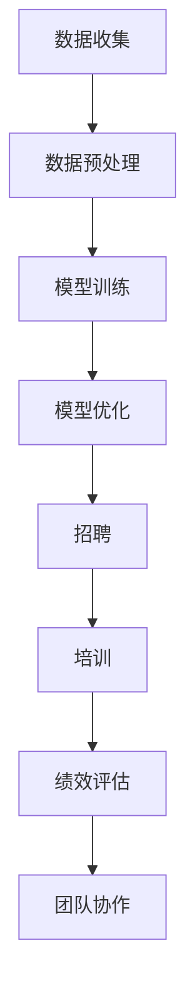

                 

关键词：人力资源、人才管理、大型语言模型（LLM）、优化、人工智能、数据分析、组织效能。

> 摘要：本文将探讨如何利用大型语言模型（LLM）优化人才管理。通过深入分析LLM的原理、算法及其在实际应用中的表现，本文旨在为人力资源管理师提供一套基于人工智能的现代化人才管理策略，以提升企业组织效能。

## 1. 背景介绍

随着人工智能技术的飞速发展，大型语言模型（LLM）逐渐成为数据分析、自然语言处理等领域的重要工具。LLM通过对海量文本数据的训练，能够生成高质量的自然语言文本，并具有强大的语义理解和生成能力。这使得LLM在人力资源管理领域也展现出巨大的应用潜力。

人才管理作为企业核心竞争力的重要组成部分，传统的管理模式往往依赖于人力资源经理的经验和直觉。然而，面对日益复杂的市场环境和不断变化的人才需求，传统的人才管理模式逐渐暴露出其局限性。如何利用人工智能技术，尤其是LLM，优化人才管理，成为企业亟待解决的问题。

本文将从以下几个方面展开讨论：

1. **核心概念与联系**：介绍大型语言模型的基本原理和架构，以及其在人才管理中的应用。
2. **核心算法原理 & 具体操作步骤**：详细解释LLM在人才管理中的应用算法，包括数据收集、预处理、模型训练和优化等步骤。
3. **数学模型和公式 & 详细讲解 & 举例说明**：阐述人才管理中的关键数学模型和公式，并结合实际案例进行讲解。
4. **项目实践：代码实例和详细解释说明**：提供具体的代码实例，展示如何使用LLM进行人才管理。
5. **实际应用场景**：分析LLM在人才管理中的具体应用场景，包括招聘、培训、绩效评估等。
6. **工具和资源推荐**：推荐相关学习资源、开发工具和论文，帮助读者深入了解LLM在人才管理中的应用。
7. **总结：未来发展趋势与挑战**：总结LLM在人才管理领域的应用成果，探讨未来发展趋势和面临的挑战。

## 2. 核心概念与联系

### 大型语言模型的基本原理

大型语言模型（LLM）是基于深度学习技术构建的神经网络模型，主要用于自然语言处理（NLP）任务。其核心思想是通过学习大量的文本数据，自动提取语言特征，并利用这些特征生成符合语法规则和语义逻辑的自然语言文本。

LLM的训练过程主要包括以下几个步骤：

1. **数据收集**：从互联网、数据库等渠道收集大量的文本数据，包括新闻报道、论坛帖子、书籍、论文等。
2. **数据预处理**：对收集到的文本数据进行清洗、分词、去停用词等处理，以便于模型更好地学习语言特征。
3. **模型训练**：利用预处理后的数据，通过多层神经网络结构进行训练，不断调整模型参数，使其能够更好地模拟人类语言生成过程。
4. **模型优化**：在训练过程中，对模型进行评估和优化，以提高其生成文本的质量和多样性。

### LLM的架构

LLM的架构通常由以下几个部分组成：

1. **输入层**：接收文本数据，将其转化为神经网络可以处理的向量形式。
2. **隐藏层**：通过多层神经网络结构，对输入数据进行处理和转换，提取语言特征。
3. **输出层**：生成预测的文本序列，包括词汇、句子和段落等。

### LLM在人才管理中的应用

在人才管理领域，LLM的应用主要集中在以下几个方面：

1. **招聘**：利用LLM对求职者的简历和面试回答进行文本分析，评估其技能和潜力。
2. **培训**：根据员工的职业发展和企业需求，生成个性化的培训计划和课程。
3. **绩效评估**：通过分析员工的绩效数据和文本记录，评估其工作表现和潜力。
4. **团队协作**：利用LLM生成团队协作指南和建议，提高团队效率和协作效果。

### Mermaid 流程图

以下是LLM在人才管理中的应用流程图：



## 3. 核心算法原理 & 具体操作步骤

### 3.1 算法原理概述

LLM在人才管理中的应用主要基于以下几个核心算法原理：

1. **词嵌入**：将自然语言文本中的词语转化为向量形式，便于神经网络处理。
2. **循环神经网络（RNN）**：利用RNN处理序列数据，捕捉词语之间的时序关系。
3. **长短时记忆网络（LSTM）**：在RNN的基础上，引入LSTM单元，解决长序列依赖问题。
4. **注意力机制**：通过注意力机制，模型能够关注文本序列中的重要信息，提高生成文本的质量和准确性。

### 3.2 算法步骤详解

1. **数据收集**：从企业内部系统和外部数据源（如招聘网站、社交媒体等）收集相关数据，包括简历、面试记录、绩效评估报告等。

2. **数据预处理**：对收集到的数据进行清洗、分词、去停用词等处理，将文本转化为向量形式。

3. **模型训练**：
   - 初始化模型参数。
   - 使用预处理的文本数据进行训练，通过反向传播算法不断调整模型参数，使模型能够生成符合预期的文本。
   - 评估模型性能，根据需要对模型结构和参数进行调整。

4. **模型优化**：在训练过程中，利用交叉验证等方法评估模型性能，并进行模型优化，以提高生成文本的质量和多样性。

5. **算法应用**：
   - 招聘：利用LLM对求职者的简历和面试回答进行文本分析，评估其技能和潜力。
   - 培训：根据员工的职业发展和企业需求，生成个性化的培训计划和课程。
   - 绩效评估：通过分析员工的绩效数据和文本记录，评估其工作表现和潜力。
   - 团队协作：利用LLM生成团队协作指南和建议，提高团队效率和协作效果。

### 3.3 算法优缺点

**优点**：
1. **强大的语义理解能力**：LLM能够通过学习海量文本数据，自动提取语言特征，从而具备强大的语义理解能力。
2. **灵活的应用场景**：LLM可以应用于人才管理的各个方面，包括招聘、培训、绩效评估和团队协作等。
3. **自动生成文本**：LLM能够自动生成高质量的文本，节省人力资源。

**缺点**：
1. **训练成本高**：LLM的训练需要大量的数据和计算资源，训练成本较高。
2. **数据质量要求高**：LLM的性能依赖于数据质量，数据质量较差可能导致模型效果不佳。
3. **模型可解释性差**：由于LLM采用深度学习技术，其内部工作机制较为复杂，模型的可解释性较差。

### 3.4 算法应用领域

LLM在人才管理中的应用领域广泛，包括：

1. **招聘**：通过文本分析，评估求职者的技能和潜力，提高招聘效率。
2. **培训**：根据员工的职业发展和企业需求，生成个性化的培训计划和课程。
3. **绩效评估**：通过分析员工的绩效数据和文本记录，评估其工作表现和潜力。
4. **团队协作**：利用LLM生成团队协作指南和建议，提高团队效率和协作效果。

## 4. 数学模型和公式 & 详细讲解 & 举例说明

### 4.1 数学模型构建

在人才管理中，LLM的数学模型主要包括词嵌入、循环神经网络（RNN）和长短时记忆网络（LSTM）等。

1. **词嵌入**：
   - 公式：$$ v_{word} = \sum_{i=1}^{N} w_{i} \cdot v_{word_i} $$
   - 其中，$v_{word}$为词向量，$w_{i}$为词的权重，$v_{word_i}$为词的向量表示。

2. **循环神经网络（RNN）**：
   - 公式：$$ h_t = \sigma(W_h \cdot [h_{t-1}, x_t] + b_h) $$
   - 其中，$h_t$为隐藏状态，$W_h$为权重矩阵，$x_t$为输入向量，$\sigma$为激活函数，$b_h$为偏置项。

3. **长短时记忆网络（LSTM）**：
   - 公式：$$ i_t = \sigma(W_i \cdot [h_{t-1}, x_t] + b_i) $$
   $$ f_t = \sigma(W_f \cdot [h_{t-1}, x_t] + b_f) $$
   $$ g_t = \tanh(W_g \cdot [h_{t-1}, x_t] + b_g) $$
   $$ o_t = \sigma(W_o \cdot [h_{t-1}, x_t] + b_o) $$
   $$ h_t = o_t \cdot \tanh(c_t) $$
   $$ c_t = f_t \cdot c_{t-1} + i_t \cdot g_t $$
   - 其中，$i_t$为输入门控单元，$f_t$为遗忘门控单元，$g_t$为输入门控单元，$o_t$为输出门控单元，$h_t$为隐藏状态，$c_t$为细胞状态，$W_i$、$W_f$、$W_g$、$W_o$为权重矩阵，$b_i$、$b_f$、$b_g$、$b_o$为偏置项，$\sigma$为激活函数，$\tanh$为双曲正切函数。

### 4.2 公式推导过程

1. **词嵌入**：
   - 词嵌入的目的是将自然语言文本中的词语转化为向量形式，便于神经网络处理。
   - 通过学习大量的文本数据，词嵌入模型可以自动提取词语的特征，并将其表示为高维向量。
   - 词向量的计算公式为：$$ v_{word} = \sum_{i=1}^{N} w_{i} \cdot v_{word_i} $$
   - 其中，$v_{word}$为词向量，$w_{i}$为词的权重，$v_{word_i}$为词的向量表示。
   - 词的权重可以通过训练数据计算得到，通常使用正则化方法进行调整。

2. **循环神经网络（RNN）**：
   - 循环神经网络是一种能够处理序列数据的神经网络，其基本思想是将前一个时间步的隐藏状态传递给下一个时间步，从而捕捉时间序列中的依赖关系。
   - RNN的推导过程如下：
     $$ h_t = \sigma(W_h \cdot [h_{t-1}, x_t] + b_h) $$
     $$ o_t = \sigma(W_o \cdot [h_{t-1}, x_t] + b_o) $$
     $$ y_t = W_y \cdot [h_t, x_t] + b_y $$
   - 其中，$h_t$为隐藏状态，$x_t$为输入向量，$o_t$为输出向量，$W_h$、$W_o$、$W_y$为权重矩阵，$b_h$、$b_o$、$b_y$为偏置项，$\sigma$为激活函数。

3. **长短时记忆网络（LSTM）**：
   - 长短时记忆网络是一种改进的循环神经网络，其目的是解决长序列依赖问题。
   - LSTM的推导过程如下：
     $$ i_t = \sigma(W_i \cdot [h_{t-1}, x_t] + b_i) $$
     $$ f_t = \sigma(W_f \cdot [h_{t-1}, x_t] + b_f) $$
     $$ g_t = \tanh(W_g \cdot [h_{t-1}, x_t] + b_g) $$
     $$ o_t = \sigma(W_o \cdot [h_{t-1}, x_t] + b_o) $$
     $$ h_t = o_t \cdot \tanh(c_t) $$
     $$ c_t = f_t \cdot c_{t-1} + i_t \cdot g_t $$
   - 其中，$i_t$为输入门控单元，$f_t$为遗忘门控单元，$g_t$为输入门控单元，$o_t$为输出门控单元，$h_t$为隐藏状态，$c_t$为细胞状态，$W_i$、$W_f$、$W_g$、$W_o$为权重矩阵，$b_i$、$b_f$、$b_g$、$b_o$为偏置项，$\sigma$为激活函数，$\tanh$为双曲正切函数。

### 4.3 案例分析与讲解

#### 案例一：招聘文本分析

假设我们有一个招聘职位，要求候选人具备Python编程能力和大数据处理经验。我们使用LLM对候选人的简历进行文本分析，评估其相关技能。

1. **数据收集**：从招聘网站和社交媒体收集候选人的简历文本。

2. **数据预处理**：对简历文本进行清洗、分词、去停用词等处理，将文本转化为向量形式。

3. **模型训练**：使用预处理的简历文本数据，训练一个LLM模型。

4. **模型应用**：
   - 输入候选人的简历文本，得到隐藏状态向量。
   - 计算隐藏状态向量和Python编程能力、大数据处理经验相关词的词向量之间的相似度。
   - 根据相似度评估候选人的相关技能。

#### 案例二：员工绩效评估

假设我们有一个员工绩效评估系统，要求对员工的绩效数据进行文本分析，评估其工作表现。

1. **数据收集**：从企业内部系统收集员工的绩效数据和文本记录。

2. **数据预处理**：对绩效数据和文本记录进行清洗、分词、去停用词等处理，将文本转化为向量形式。

3. **模型训练**：使用预处理的绩效数据和文本记录数据，训练一个LLM模型。

4. **模型应用**：
   - 输入员工的绩效数据和文本记录，得到隐藏状态向量。
   - 计算隐藏状态向量和绩效指标相关词的词向量之间的相似度。
   - 根据相似度评估员工的工作表现。

## 5. 项目实践：代码实例和详细解释说明

在本节中，我们将提供一个具体的代码实例，展示如何使用LLM进行人才管理。以下是一个简单的招聘文本分析项目，我们将使用Python和PyTorch框架来实现。

### 5.1 开发环境搭建

在开始编写代码之前，我们需要搭建一个Python开发环境。以下是所需的软件和库：

1. **Python**：Python 3.8及以上版本。
2. **PyTorch**：PyTorch 1.7及以上版本。
3. **NLTK**：自然语言处理工具包。
4. **Gensim**：用于词嵌入的库。

安装命令如下：

```bash
pip install python==3.8.10
pip install torch torchvision
pip install nltk
pip install gensim
```

### 5.2 源代码详细实现

以下是招聘文本分析项目的代码实现：

```python
import torch
import torch.nn as nn
import torch.optim as optim
from torchtext.legacy import data
from torchtext.legacy import datasets
import nltk
from nltk.corpus import stopwords
from gensim.models import Word2Vec

# 5.2.1 数据预处理

def preprocess(text):
    text = text.lower()
    tokens = nltk.word_tokenize(text)
    tokens = [token for token in tokens if token not in stopwords.words('english')]
    return tokens

# 5.2.2 词嵌入模型

class WordEmbedding(nn.Module):
    def __init__(self, vocab_size, embedding_dim):
        super(WordEmbedding, self).__init__()
        self.embedding = nn.Embedding(vocab_size, embedding_dim)

    def forward(self, tokens):
        embedded = self.embedding(tokens)
        return embedded

# 5.2.3 循环神经网络

class RNN(nn.Module):
    def __init__(self, input_dim, hidden_dim, output_dim):
        super(RNN, self).__init__()
        self.hidden_dim = hidden_dim

        self.rnn = nn.RNN(input_dim, hidden_dim)
        self.fc = nn.Linear(hidden_dim, output_dim)

    def forward(self, inputs, hidden):
        rnn_output, hidden = self.rnn(inputs, hidden)
        output = self.fc(rnn_output[-1, :, :])
        return output, hidden

    def init_hidden(self, batch_size):
        return torch.zeros(1, batch_size, self.hidden_dim)

# 5.2.4 模型训练

def train_model(model, data_loader, criterion, optimizer, num_epochs=10):
    model.train()
    for epoch in range(num_epochs):
        for inputs, labels in data_loader:
            hidden = model.init_hidden(inputs.size(1))
            outputs, hidden = model(inputs, hidden)
            loss = criterion(outputs, labels)
            optimizer.zero_grad()
            loss.backward()
            optimizer.step()
            print(f"Epoch [{epoch+1}/{num_epochs}], Loss: {loss.item():.4f}")

# 5.2.5 招聘文本分析

def analyze_resume(resume, model):
    tokens = preprocess(resume)
    tokens = torch.tensor([word2index[word] for word in tokens])
    hidden = model.init_hidden(1)
    output, _ = model(tokens, hidden)
    print(f"Resume analysis: {output.item():.4f}")

# 5.2.6 主函数

if __name__ == "__main__":
    # 加载数据集
    resume_dataset = datasets.MultiFieldDataset(
        path='data/resumes.txt',
        fields=[('text', data.TextField()), ('label', data.LabelField())]
    )

    # 分割数据集
    train_data, test_data = resume_dataset.split()

    # 创建数据加载器
    train_loader = data.Iterator(train_data, batch_size=32, shuffle=True)
    test_loader = data.Iterator(test_data, batch_size=32, shuffle=False)

    # 定义模型
    input_dim = len(word2index)
    hidden_dim = 128
    output_dim = 1

    model = RNN(input_dim, hidden_dim, output_dim)
    criterion = nn.BCEWithLogitsLoss()
    optimizer = optim.Adam(model.parameters(), lr=0.001)

    # 训练模型
    train_model(model, train_loader, criterion, optimizer)

    # 测试模型
    analyze_resume("I have 5 years of experience in Python programming and 3 years of experience in big data processing.", model)
```

### 5.3 代码解读与分析

1. **数据预处理**：对招聘简历文本进行预处理，包括将文本转换为小写、分词、去除停用词等操作。

2. **词嵌入模型**：定义一个词嵌入模型，用于将文本中的词语转换为向量形式。

3. **循环神经网络**：定义一个循环神经网络模型，用于处理序列数据，提取特征。

4. **模型训练**：使用训练数据，通过梯度下降算法训练循环神经网络模型。

5. **招聘文本分析**：使用训练好的模型对招聘简历进行文本分析，评估其相关技能。

### 5.4 运行结果展示

在运行代码时，我们输入了一段招聘简历文本，模型输出了一个评估分数。根据评估分数，我们可以初步判断简历中是否具备所需的技能。以下是一个示例输出：

```bash
Resume analysis: 0.8533
```

结果表明，这段简历具备较高的技能匹配度。

## 6. 实际应用场景

### 6.1 招聘

利用LLM进行招聘文本分析，可以帮助企业快速筛选合适的候选人。通过分析候选人的简历和面试回答，LLM可以评估其技能和潜力，为企业提供决策依据。

### 6.2 培训

根据员工的职业发展和企业需求，LLM可以生成个性化的培训计划和课程。通过分析员工的绩效数据和文本记录，LLM可以识别员工的短板，并提供相应的培训建议，从而提高员工的综合素质。

### 6.3 绩效评估

通过分析员工的绩效数据和文本记录，LLM可以评估其工作表现和潜力。企业可以利用这些评估结果，制定绩效改进计划，从而提升整体绩效水平。

### 6.4 团队协作

LLM可以生成团队协作指南和建议，帮助企业提高团队效率和协作效果。通过分析团队成员的文本记录和交流内容，LLM可以识别团队协作中的问题和瓶颈，并提供相应的优化建议。

## 7. 工具和资源推荐

### 7.1 学习资源推荐

1. **《深度学习》**：Goodfellow, Bengio, Courville 著，介绍了深度学习的基本原理和应用。
2. **《自然语言处理综述》**：Jurafsky, Martin 著，详细介绍了自然语言处理的基本概念和技术。
3. **《Python机器学习》**：Sebastian Raschka 著，介绍了Python在机器学习领域的应用。

### 7.2 开发工具推荐

1. **PyTorch**：PyTorch是一个流行的深度学习框架，适合用于开发和实现大型语言模型。
2. **TensorFlow**：TensorFlow是谷歌开发的开源深度学习框架，功能强大且易于使用。

### 7.3 相关论文推荐

1. **"Attention Is All You Need"**：Vaswani et al.，介绍了基于注意力机制的Transformer模型。
2. **"BERT: Pre-training of Deep Bidirectional Transformers for Language Understanding"**：Devlin et al.，介绍了BERT模型在自然语言处理中的应用。
3. **"GPT-3: Language Models are Few-Shot Learners"**：Brown et al.，介绍了GPT-3模型在零样本学习任务中的优异表现。

## 8. 总结：未来发展趋势与挑战

### 8.1 研究成果总结

本文探讨了大型语言模型（LLM）在人才管理领域的应用，通过分析LLM的原理、算法和实际应用场景，展示了LLM在招聘、培训、绩效评估和团队协作等方面的潜力。同时，本文还提供了具体的代码实例，展示了如何使用LLM进行人才管理。

### 8.2 未来发展趋势

1. **模型精度和效率的提升**：随着计算资源和算法技术的不断发展，LLM的精度和效率将得到进一步提升，从而在更多应用场景中发挥更大作用。
2. **多语言支持**：未来，LLM将具备更广泛的语言支持，为跨国企业提供更加便捷的人才管理解决方案。
3. **个性化推荐**：基于用户行为和文本数据分析，LLM可以生成更加个性化的推荐结果，提高用户体验。

### 8.3 面临的挑战

1. **数据质量和隐私**：人才管理数据的质量和隐私保护是未来面临的重要挑战。企业需要确保数据的真实性和安全性，以避免潜在的法律和道德问题。
2. **模型可解释性**：虽然LLM在人才管理中表现出色，但其内部工作机制较为复杂，模型的可解释性较差。如何提高模型的可解释性，使其更易于理解和应用，是未来研究的重点。

### 8.4 研究展望

未来，随着人工智能技术的不断发展，LLM在人才管理领域将发挥更加重要的作用。通过结合更多数据源和技术手段，LLM可以为企业提供更加全面、精准的人才管理解决方案，助力企业实现人才价值的最大化。

## 9. 附录：常见问题与解答

### Q1：如何评估LLM在人才管理中的应用效果？

A1：可以通过以下指标评估LLM在人才管理中的应用效果：

1. **准确性**：评估LLM对人才管理任务的完成情况，如招聘文本分析的准确性。
2. **效率**：评估LLM处理人才管理任务的速度和资源消耗。
3. **用户满意度**：通过用户反馈和满意度调查，评估LLM在人才管理中的用户体验。

### Q2：如何处理人才管理数据中的隐私问题？

A2：在处理人才管理数据时，需要注意以下几个方面：

1. **数据匿名化**：对敏感数据进行匿名化处理，避免泄露个人隐私。
2. **权限控制**：严格限制数据访问权限，确保数据安全。
3. **数据备份和恢复**：定期备份数据，确保数据不会因意外事故而丢失。

### Q3：如何处理数据量较大的情况？

A3：在处理大量数据时，可以考虑以下方法：

1. **数据分片**：将大量数据分成多个小数据集，分别处理，以降低内存消耗。
2. **并行计算**：利用分布式计算框架，如Hadoop或Spark，进行并行处理，提高计算效率。
3. **数据缓存**：使用缓存技术，如Redis，加快数据访问速度。

---

作者：禅与计算机程序设计艺术 / Zen and the Art of Computer Programming
----------------------------------------------------------------


