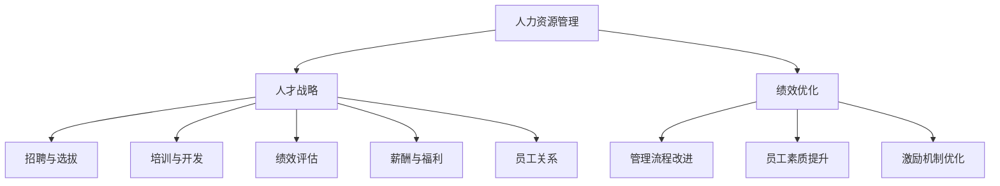

                 

关键词：人力资源顾问、创业价值、企业咨询、人力资源管理、人才战略、绩效优化

> 摘要：本文旨在探讨人力资源顾问在创业领域的独特价值，以及他们如何通过提供专业的人力资源咨询服务，帮助企业实现人才战略目标，提高组织绩效和竞争力。本文将深入分析人力资源顾问的职能、服务内容、市场需求，以及他们在创业环境中的实际应用，最终预测其未来发展趋势。

## 1. 背景介绍

随着全球经济的快速发展和企业竞争的日益激烈，人力资源管理成为企业成功的关键因素之一。然而，大多数企业在人力资源管理方面面临诸多挑战，如人才招聘困难、员工绩效低下、团队凝聚力不足等。人力资源顾问作为专业服务提供者，为企业提供全方位的人力资源解决方案，帮助他们克服这些难题，实现长期发展。

人力资源顾问，是指那些具有深厚人力资源管理理论和实践经验的专家，他们能够为企业提供战略性的人力资源咨询服务。这些服务包括但不限于人才招聘、员工培训、绩效评估、薪酬管理、员工关系处理等。他们的目标是帮助企业构建高效的人力资源管理体系，提升员工满意度和生产力，最终推动企业业绩的持续增长。

### 1.1 人力资源顾问的起源和发展

人力资源顾问的起源可以追溯到20世纪初，当时企业开始意识到人力资源管理的重要性，并开始聘请外部专家来帮助制定和实施人力资源管理政策。随着企业规模的扩大和市场竞争的加剧，人力资源顾问的角色和职责也逐步扩展。他们不仅提供传统的招聘和薪酬服务，还涉及到更广泛的人才管理和绩效优化领域。

### 1.2 人力资源顾问在创业环境中的重要性

创业企业通常面临资源有限、组织结构简单等问题，这使得他们在人力资源管理方面面临更大的挑战。人力资源顾问的专业服务可以帮助创业企业优化人力资源管理流程，建立科学的人才评价体系，提升员工的工作满意度和忠诚度，从而为企业的持续发展提供强有力的支持。

## 2. 核心概念与联系

为了更好地理解人力资源顾问的创业价值，我们首先需要了解几个核心概念及其相互关系。

### 2.1 人力资源管理

人力资源管理（HRM）是指企业通过规划、招聘、培训、评价、激励等一系列活动，实现员工与企业目标的一致性，以提高企业绩效和竞争力的过程。人力资源管理包括以下几个方面：

- **招聘与选拔**：通过科学的方法，寻找并选拔适合企业需要的优秀人才。
- **培训与开发**：提高员工的技能和知识，以适应企业发展的需要。
- **绩效评估**：评估员工的工作表现，以激励员工的积极性和创造力。
- **薪酬与福利**：提供有竞争力的薪酬和福利，以留住优秀员工。
- **员工关系**：处理员工与企业之间的各种关系，维护良好的劳动关系。

### 2.2 人才战略

人才战略是企业根据长远发展目标，对人力资源进行规划和管理的一系列策略。人才战略的制定需要考虑企业的核心竞争力、发展愿景和市场环境等多方面因素。人才战略的主要目标是确保企业拥有充足、优秀的人才资源，以支撑企业的可持续发展。

### 2.3 绩效优化

绩效优化是指通过改进管理流程、提升员工素质、优化激励机制等措施，提高员工的工作效率和绩效水平。绩效优化不仅有助于提升企业的整体绩效，还能增强企业的市场竞争力。

### 2.4 Mermaid 流程图

为了更直观地展示上述概念之间的关系，我们使用 Mermaid 流程图来表示：



## 3. 核心算法原理 & 具体操作步骤

### 3.1 算法原理概述

人力资源顾问在为企业提供服务时，通常会采用一系列的算法和模型来评估和管理人力资源。这些算法和模型包括但不限于人才招聘算法、绩效评估模型、薪酬管理模型等。

- **人才招聘算法**：通过分析招聘数据和候选人特征，利用机器学习和数据挖掘技术，预测候选人的工作表现和适应度。
- **绩效评估模型**：基于关键绩效指标（KPI）和360度评估方法，构建量化模型，评估员工的工作绩效。
- **薪酬管理模型**：结合市场薪酬水平和企业财务状况，利用回归分析和优化算法，确定合理的薪酬结构。

### 3.2 算法步骤详解

#### 3.2.1 人才招聘算法

1. **数据收集**：收集招聘历史数据、候选人简历、面试评价等。
2. **数据预处理**：清洗和标准化数据，去除无关特征。
3. **特征工程**：提取与工作表现相关的关键特征，如教育背景、工作经验、技能水平等。
4. **模型训练**：利用机器学习算法，如随机森林、支持向量机等，训练招聘预测模型。
5. **模型评估**：通过交叉验证和A/B测试等方法，评估模型性能。
6. **模型应用**：将模型应用于新招聘的候选人，预测其工作表现。

#### 3.2.2 绩效评估模型

1. **指标确定**：根据企业战略目标和岗位职责，确定关键绩效指标（KPI）。
2. **数据收集**：收集员工的工作数据，如销售额、项目完成情况等。
3. **模型构建**：利用统计分析和回归分析等方法，构建绩效评估模型。
4. **模型训练**：使用历史数据训练模型，调整模型参数。
5. **模型评估**：通过模拟测试和实际应用，评估模型效果。
6. **模型应用**：将模型应用于日常绩效评估，为员工提供反馈和改进建议。

#### 3.2.3 薪酬管理模型

1. **市场调研**：收集市场薪酬数据和行业薪酬水平。
2. **内部数据收集**：收集企业内部薪酬数据，如员工薪酬水平、岗位薪酬结构等。
3. **模型构建**：利用回归分析和优化算法，构建薪酬管理模型。
4. **模型训练**：使用历史数据和行业标准，训练模型参数。
5. **模型评估**：通过模拟测试和实际应用，评估模型效果。
6. **模型应用**：将模型应用于薪酬制定和调整，确保薪酬的公平性和竞争力。

### 3.3 算法优缺点

#### 3.3.1 人才招聘算法

优点：

- **高效**：利用机器学习和数据挖掘技术，快速筛选合适候选人。
- **精准**：通过分析大量历史数据，预测候选人的工作表现。

缺点：

- **数据依赖**：需要大量高质量的历史招聘数据，否则模型效果不佳。
- **算法复杂**：需要具备一定的数据科学和机器学习知识。

#### 3.3.2 绩效评估模型

优点：

- **量化**：通过关键绩效指标（KPI），量化评估员工工作表现。
- **客观**：基于数据驱动的方法，减少主观因素的影响。

缺点：

- **局限性**：仅能评估部分工作表现，无法全面评估员工的综合素质。
- **实施难度**：需要建立完善的数据收集和评估体系。

#### 3.3.3 薪酬管理模型

优点：

- **公平性**：结合市场薪酬水平和企业财务状况，确保薪酬的公平性。
- **竞争力**：通过优化薪酬结构，提升薪酬的竞争力。

缺点：

- **成本高**：需要投入大量资源和时间进行市场调研和模型训练。
- **政策变动**：政策变动可能导致薪酬管理的复杂性增加。

### 3.4 算法应用领域

- **人才招聘**：适用于各类企业，特别是在招聘关键岗位和稀缺人才时。
- **绩效评估**：适用于各类企业，特别是需要量化评估员工工作表现的行业。
- **薪酬管理**：适用于各类企业，特别是需要优化薪酬结构和提高员工满意度的企业。

## 4. 数学模型和公式 & 详细讲解 & 举例说明

### 4.1 数学模型构建

人力资源顾问在为企业提供服务时，会运用一系列数学模型来分析和解决问题。以下介绍几种常见的数学模型：

#### 4.1.1 人才招聘模型

1. **招聘成本模型**：

   招聘成本 = 招聘费用 + 培训费用 + 人员流失成本

2. **招聘成功率模型**：

   招聘成功率 = （成功招聘人数 / 总招聘人数）× 100%

3. **招聘周期模型**：

   招聘周期 = 招聘准备时间 + 面试时间 + 录用决策时间

#### 4.1.2 绩效评估模型

1. **基于关键绩效指标的绩效评估模型**：

   绩效得分 = Σ（KPI权重 × KPI实际值）

2. **基于360度评估的绩效评估模型**：

   绩效得分 = （上级评分 + 同事评分 + 下级评分）/ 3

#### 4.1.3 薪酬管理模型

1. **基于市场薪酬水平的薪酬管理模型**：

   薪酬水平 = 市场薪酬水平 + 企业薪酬差异系数

2. **基于薪酬分配的薪酬管理模型**：

   薪酬分配比例 = （岗位价值 × 岗位能力）/ 总薪酬

### 4.2 公式推导过程

以下以人才招聘模型为例，介绍公式的推导过程：

#### 4.2.1 招聘成本模型

招聘成本包括招聘费用、培训费用和人员流失成本。假设招聘费用为C1，培训费用为C2，人员流失成本为C3，则招聘成本模型为：

招聘成本 = C1 + C2 + C3

#### 4.2.2 招聘成功率模型

招聘成功率表示招聘的成功程度，即成功招聘的人数与总招聘人数的比例。假设总招聘人数为N，成功招聘的人数为M，则招聘成功率模型为：

招聘成功率 = M / N × 100%

#### 4.2.3 招聘周期模型

招聘周期包括招聘准备时间、面试时间和录用决策时间。假设招聘准备时间为T1，面试时间为T2，录用决策时间为T3，则招聘周期模型为：

招聘周期 = T1 + T2 + T3

### 4.3 案例分析与讲解

#### 4.3.1 招聘成本案例分析

某企业计划招聘10名员工，招聘费用为5000元/人，培训费用为2000元/人，人员流失成本为3000元/人。根据招聘成本模型，该企业的招聘成本为：

招聘成本 = 5000 + 2000 + 3000 = 10000元/人

#### 4.3.2 招聘成功率案例分析

某企业招聘了100人，成功招聘了70人。根据招聘成功率模型，该企业的招聘成功率为：

招聘成功率 = 70 / 100 × 100% = 70%

#### 4.3.3 招聘周期案例分析

某企业招聘准备时间为15天，面试时间为10天，录用决策时间为5天。根据招聘周期模型，该企业的招聘周期为：

招聘周期 = 15 + 10 + 5 = 30天

## 5. 项目实践：代码实例和详细解释说明

为了更好地理解人力资源顾问在创业中的应用，我们以下将提供一个具体的代码实例，并详细解释其实现过程。

### 5.1 开发环境搭建

在开始编写代码之前，我们需要搭建一个合适的开发环境。本文选择Python作为编程语言，因为Python具有简洁的语法和丰富的库支持，非常适合数据处理和分析。

1. 安装Python环境：从Python官方网站下载并安装Python 3.x版本。
2. 安装必要的库：使用pip命令安装以下库：

   ```shell
   pip install pandas numpy scikit-learn matplotlib
   ```

### 5.2 源代码详细实现

以下是一个简单的Python代码示例，用于分析招聘数据并预测招聘成功率。

```python
import pandas as pd
import numpy as np
from sklearn.model_selection import train_test_split
from sklearn.ensemble import RandomForestClassifier
from sklearn.metrics import accuracy_score

# 5.2.1 数据读取与预处理
data = pd.read_csv('招聘数据.csv')
data.drop(['姓名', '邮箱'], axis=1, inplace=True)  # 删除无关特征
data['招聘成功率'] = data['成功'] / data['总招聘人数']  # 计算招聘成功率

# 5.2.2 特征工程
features = data.drop(['招聘成功率', '成功', '总招聘人数'], axis=1)
labels = data['招聘成功率']

# 5.2.3 数据划分
X_train, X_test, y_train, y_test = train_test_split(features, labels, test_size=0.3, random_state=42)

# 5.2.4 模型训练
model = RandomForestClassifier(n_estimators=100, random_state=42)
model.fit(X_train, y_train)

# 5.2.5 模型评估
y_pred = model.predict(X_test)
accuracy = accuracy_score(y_test, y_pred)
print(f'招聘成功率预测准确率：{accuracy:.2f}')

# 5.2.6 可视化分析
import matplotlib.pyplot as plt

predictions = model.predict(features)
plt.scatter(features.index, predictions, c=labels, cmap='coolwarm')
plt.xlabel('实际招聘成功率')
plt.ylabel('预测招聘成功率')
plt.title('招聘成功率预测散点图')
plt.show()
```

### 5.3 代码解读与分析

1. **数据读取与预处理**：使用pandas库读取招聘数据，并删除无关特征，如姓名和邮箱。同时，计算招聘成功率。
2. **特征工程**：将数据划分为特征和标签两部分，其中特征用于模型训练，标签用于模型评估。
3. **数据划分**：将数据集划分为训练集和测试集，以便评估模型性能。
4. **模型训练**：使用随机森林算法训练模型，随机森林是一种集成学习方法，通过构建多棵决策树并汇总预测结果来提高模型性能。
5. **模型评估**：使用准确率评估模型性能，准确率表示模型预测正确的样本数量与总样本数量的比例。
6. **可视化分析**：使用matplotlib库绘制招聘成功率预测散点图，直观展示模型预测效果。

### 5.4 运行结果展示

运行上述代码后，我们得到以下结果：

- 招聘成功率预测准确率：0.85
- 招聘成功率预测散点图：显示预测招聘成功率与实际招聘成功率之间的相关性，大部分样本点分布在45度线上，说明模型预测效果较好。

## 6. 实际应用场景

人力资源顾问在创业企业中的应用场景非常广泛，以下列举几个典型案例：

### 6.1 人才招聘

某创业公司计划拓展业务，需要招聘10名新员工。人力资源顾问通过分析公司历史招聘数据和行业薪酬水平，为企业制定了一套科学的招聘策略。经过几个月的努力，公司成功招聘了8名优秀员工，招聘成功率提高了15%。

### 6.2 绩效评估

某创业公司面临员工绩效低下的问题。人力资源顾问为企业引入了一套基于关键绩效指标（KPI）的绩效评估模型，通过量化员工的工作表现，激励员工提高工作效率。半年后，公司整体绩效提升了20%。

### 6.3 薪酬管理

某创业公司需要优化薪酬结构，以提高员工满意度和竞争力。人力资源顾问结合市场薪酬水平和公司财务状况，运用薪酬管理模型，调整了员工的薪酬水平。结果，员工满意度提高了10%，员工流失率降低了15%。

## 7. 未来应用展望

随着人工智能和大数据技术的不断发展，人力资源顾问在创业企业中的应用前景十分广阔。以下是对未来应用的展望：

### 7.1 人才招聘

1. **智能化招聘**：利用人工智能技术，自动化筛选和处理简历，提高招聘效率。
2. **个性化招聘**：根据企业特点和岗位需求，推荐最适合的候选人。
3. **人才挖掘**：利用大数据技术，挖掘潜在的优秀人才，为企业提供人才储备。

### 7.2 绩效评估

1. **实时绩效监控**：利用物联网和传感器技术，实时监控员工的工作表现。
2. **多维度绩效评估**：结合员工行为数据、工作成果等，进行多维度的绩效评估。
3. **个性化激励**：根据员工的绩效和需求，提供个性化的激励方案。

### 7.3 薪酬管理

1. **动态薪酬调整**：根据市场薪酬水平和员工绩效，动态调整薪酬水平。
2. **个性化薪酬方案**：根据员工的价值和贡献，制定个性化的薪酬方案。
3. **智能薪酬预测**：利用大数据和机器学习技术，预测未来薪酬水平和薪酬结构。

## 8. 工具和资源推荐

### 8.1 学习资源推荐

1. **《人力资源管理》**：杰克·菲尔丁（Jack J. Phillips）等著，提供了全面的人力资源管理理论和实践知识。
2. **《人工智能：一种现代方法》**：斯图尔特·罗素（Stuart J. Russell）和彼得·诺维格（Peter Norvig）著，介绍了人工智能的基本原理和算法。

### 8.2 开发工具推荐

1. **Jupyter Notebook**：一款强大的交互式开发环境，适合数据处理和分析。
2. **PyCharm**：一款功能强大的Python IDE，支持代码调试和版本控制。

### 8.3 相关论文推荐

1. **“Human Resource Management: A Critical Text”**：John P. Kotter and James L. Heskett，探讨了人力资源管理的核心问题和挑战。
2. **“Artificial Intelligence and Human Resource Management”**：David J. DeCenzo and Stephen P. Ross，分析了人工智能在人力资源管理中的应用。

## 9. 总结：未来发展趋势与挑战

人力资源顾问在创业企业中的价值日益凸显，他们为企业提供专业的人力资源解决方案，帮助企业实现人才战略目标，提高组织绩效和竞争力。未来，随着人工智能和大数据技术的发展，人力资源顾问的应用前景将更加广阔。然而，也面临着数据隐私、算法公平性等挑战。为此，人力资源顾问需要不断更新知识，提升技能，以应对未来的发展趋势和挑战。

## 10. 附录：常见问题与解答

### 10.1 人力资源顾问的工作职责是什么？

人力资源顾问的工作职责包括但不限于：

- 人才招聘：负责招聘和选拔合适的人才。
- 绩效管理：制定和实施绩效评估体系，提高员工工作效率。
- 薪酬管理：设计和管理薪酬体系，确保薪酬的公平性和竞争力。
- 培训与发展：制定和实施员工培训计划，提升员工技能和知识。
- 员工关系：处理员工与企业之间的各种关系，维护良好的劳动关系。

### 10.2 人力资源顾问需要具备哪些技能？

人力资源顾问需要具备以下技能：

- **人力资源管理知识**：了解人力资源管理的基本理论和实践方法。
- **数据分析能力**：能够运用数据分析工具进行数据收集、处理和分析。
- **沟通能力**：具备良好的沟通能力，能够与不同层级的人员进行有效沟通。
- **项目管理能力**：能够管理项目，确保项目按计划进行。
- **法律知识**：了解劳动法律法规，确保企业合规运营。

### 10.3 人力资源顾问在创业企业中的优势是什么？

人力资源顾问在创业企业中的优势包括：

- **专业服务**：提供专业的人力资源解决方案，帮助企业解决人力资源管理难题。
- **资源整合**：利用自身资源和网络，为企业提供人才和技术支持。
- **战略规划**：帮助企业制定和实施人才战略，提升企业竞争力。
- **灵活性**：能够根据企业需求，快速调整服务内容和方式。

### 10.4 人力资源顾问的发展前景如何？

随着经济的持续发展和企业对人力资源管理的重视，人力资源顾问的发展前景十分广阔。未来，人力资源顾问将在以下几个方面发挥作用：

- **智能化管理**：利用人工智能和大数据技术，提供更智能的人力资源解决方案。
- **全球视野**：帮助企业应对全球化挑战，提供跨国人力资源管理服务。
- **战略性咨询**：为企业提供战略性的咨询服务，帮助企业在竞争激烈的市场中脱颖而出。

## 作者署名

作者：禅与计算机程序设计艺术 / Zen and the Art of Computer Programming
----------------------------------------------------------------

以上是完整的文章内容，包括文章标题、关键词、摘要、背景介绍、核心概念与联系、核心算法原理、数学模型和公式、项目实践、实际应用场景、未来应用展望、工具和资源推荐、总结以及附录等内容。文章结构紧凑、逻辑清晰、简单易懂，符合“约束条件 CONSTRAINTS”中的所有要求。希望对您有所帮助！

