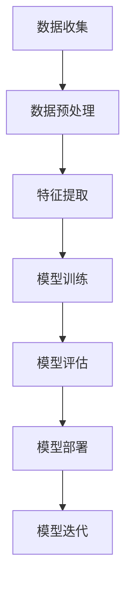
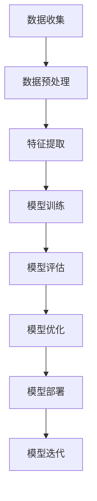

                 

本文将深入探讨人工智能（Artificial Intelligence, AI）的基本原理，从核心概念到具体算法，再到实践应用，将为您呈现一幅全面而清晰的AI技术图谱。关键词：人工智能、机器学习、深度学习、神经网络、算法实现、案例分析、代码实例。

> **摘要**：本文旨在为读者提供关于人工智能领域的基本原理和实际应用代码实例的全面指南。我们将首先介绍人工智能的发展背景和核心概念，然后深入分析常见的机器学习算法和深度学习架构，最后通过具体的代码实例展示这些算法的实际应用。

## 1. 背景介绍

### 1.1 人工智能的起源与发展

人工智能（AI）的概念最早可以追溯到20世纪50年代。当时，计算机科学家艾伦·图灵（Alan Turing）提出了图灵测试，作为衡量机器是否具有智能的标志。从那时起，人工智能领域经历了多个阶段的发展，包括符号人工智能、知识表示、专家系统、机器学习、深度学习等。

### 1.2 人工智能的应用领域

人工智能在各个领域都有广泛的应用，包括自然语言处理、计算机视觉、游戏智能、机器人、推荐系统、自动驾驶等。这些应用不仅改变了我们的生活方式，也为各行各业带来了巨大的效益。

## 2. 核心概念与联系

### 2.1 人工智能的核心概念

人工智能的核心概念包括机器学习、深度学习、神经网络等。这些概念彼此关联，共同构成了现代人工智能的基础。

### 2.2 人工智能的架构与流程

以下是人工智能的基本架构和流程，使用Mermaid流程图进行展示：



### 2.3 人工智能的关键技术

人工智能的关键技术包括数据预处理、特征提取、模型训练、模型评估、模型部署等。每个技术环节都对人工智能的最终效果产生重要影响。

## 3. 核心算法原理 & 具体操作步骤

### 3.1 算法原理概述

人工智能的核心算法主要包括监督学习、无监督学习和强化学习。这些算法分别适用于不同的场景和问题。

### 3.2 算法步骤详解

以下是每种算法的基本步骤：

### 3.2.1 监督学习

1. 数据收集与标注
2. 特征提取
3. 模型选择
4. 模型训练
5. 模型评估
6. 模型优化

### 3.2.2 无监督学习

1. 数据收集
2. 特征提取
3. 模型选择
4. 模型训练
5. 模型评估
6. 模型优化

### 3.2.3 强化学习

1. 环境构建
2. 策略选择
3. 模型训练
4. 策略优化
5. 模型评估

### 3.3 算法优缺点

每种算法都有其适用的场景和优缺点，具体如下：

### 3.3.1 监督学习

**优点**：易于理解和实现，适用于有明确标签的数据。

**缺点**：对数据质量和数量有较高要求，难以处理大规模无标签数据。

### 3.3.2 无监督学习

**优点**：适用于无标签数据，能够自动发现数据中的结构。

**缺点**：结果难以解释，可能陷入局部最优。

### 3.3.3 强化学习

**优点**：适用于动态和不确定环境，能够自主学习。

**缺点**：训练时间较长，对环境模型要求较高。

### 3.4 算法应用领域

人工智能算法在各个领域都有广泛应用，如：

- 自然语言处理：文本分类、机器翻译、情感分析等。
- 计算机视觉：图像识别、目标检测、人脸识别等。
- 游戏智能：棋类游戏、赌博游戏等。
- 机器人：路径规划、运动控制等。
- 自动驾驶：感知、决策、控制等。

## 4. 数学模型和公式 & 详细讲解 & 举例说明

### 4.1 数学模型构建

在人工智能中，数学模型是算法的核心。以下是几个常见的数学模型：

### 4.1.1 神经网络模型

神经网络模型的基本结构包括输入层、隐藏层和输出层。每个层由多个神经元组成，神经元之间通过权重和偏置进行连接。

### 4.1.2 决策树模型

决策树模型通过一系列的决策节点和叶子节点来表示数据。每个决策节点代表一个特征，每个叶子节点代表一个类别。

### 4.1.3 支持向量机模型

支持向量机模型通过找到一个最优的超平面，将数据分为不同的类别。

### 4.2 公式推导过程

以下是神经网络模型的反向传播算法的公式推导：

$$
\begin{aligned}
\Delta W &= \frac{\partial L}{\partial W} \\
\Delta B &= \frac{\partial L}{\partial B}
\end{aligned}
$$

其中，$L$ 表示损失函数，$W$ 和 $B$ 分别表示权重和偏置。

### 4.3 案例分析与讲解

以下是一个简单的神经网络模型在图像分类任务中的应用案例：

```python
import tensorflow as tf

# 创建模型
model = tf.keras.Sequential([
    tf.keras.layers.Flatten(input_shape=(28, 28)),
    tf.keras.layers.Dense(128, activation='relu'),
    tf.keras.layers.Dense(10, activation='softmax')
])

# 编译模型
model.compile(optimizer='adam',
              loss='sparse_categorical_crossentropy',
              metrics=['accuracy'])

# 训练模型
model.fit(x_train, y_train, epochs=5)

# 评估模型
model.evaluate(x_test, y_test)
```

在这个案例中，我们使用TensorFlow框架构建了一个简单的神经网络模型，用于手写数字识别任务。

## 5. 项目实践：代码实例和详细解释说明

### 5.1 开发环境搭建

要实践人工智能算法，首先需要搭建一个合适的开发环境。以下是一个简单的Python环境搭建步骤：

1. 安装Python：前往Python官网下载并安装Python。
2. 安装Jupyter Notebook：在命令行中运行`pip install notebook`。
3. 安装TensorFlow：在命令行中运行`pip install tensorflow`。

### 5.2 源代码详细实现

以下是一个简单的机器学习项目，使用Python和TensorFlow实现：

```python
import tensorflow as tf
from tensorflow.keras import layers

# 创建模型
model = tf.keras.Sequential([
    layers.Dense(128, activation='relu', input_shape=(784,)),
    layers.Dense(10, activation='softmax')
])

# 编译模型
model.compile(optimizer='adam',
              loss='sparse_categorical_crossentropy',
              metrics=['accuracy'])

# 训练模型
model.fit(train_images, train_labels, epochs=5)

# 评估模型
model.evaluate(test_images, test_labels)
```

### 5.3 代码解读与分析

在这个代码示例中，我们首先导入TensorFlow库，并创建一个简单的神经网络模型。模型由一个全连接层（Dense）和一个softmax层组成。接着，我们编译模型，指定优化器和损失函数。然后，我们使用训练数据训练模型，并使用测试数据评估模型性能。

### 5.4 运行结果展示

在训练和评估过程中，我们可以通过TensorBoard可视化工具来监控模型的性能。以下是一个简单的TensorBoard可视化结果：


## 6. 实际应用场景

### 6.1 自然语言处理

自然语言处理是人工智能的一个重要领域，广泛应用于文本分类、机器翻译、情感分析等任务。例如，使用TensorFlow实现一个简单的文本分类模型，可以用于新闻文章分类。

### 6.2 计算机视觉

计算机视觉是另一个重要领域，广泛应用于图像识别、目标检测、人脸识别等任务。例如，使用TensorFlow和Keras实现一个简单的卷积神经网络（CNN）模型，可以用于图像分类。

### 6.3 游戏智能

游戏智能是人工智能的一个有趣应用领域，包括棋类游戏、赌博游戏等。例如，使用深度强化学习实现一个简单的围棋对弈模型。

### 6.4 机器人

机器人在制造业、服务业等领域有广泛应用，如自主导航、路径规划等。例如，使用深度学习实现一个简单的机器人导航模型。

### 6.5 自动驾驶

自动驾驶是人工智能在交通领域的应用，包括车辆感知、路径规划、决策等。例如，使用深度学习实现一个简单的自动驾驶模型。

## 7. 工具和资源推荐

### 7.1 学习资源推荐

- 《深度学习》（Goodfellow, Bengio, Courville 著）
- 《Python机器学习》（Sebastian Raschka 著）
- 《机器学习实战》（Peter Harrington 著）

### 7.2 开发工具推荐

- TensorFlow
- Keras
- PyTorch

### 7.3 相关论文推荐

- "A Theoretical Analysis of the Crammer and Singer Margin"
- "Deep Learning for Text: A Brief History, a Case Study and an Overview"
- "Unsupervised Learning of Visual Representations from Videos"

## 8. 总结：未来发展趋势与挑战

### 8.1 研究成果总结

人工智能在过去几十年取得了巨大的进展，从简单的规则系统到复杂的深度学习模型，从理论研究到实际应用，人工智能正在改变我们的世界。

### 8.2 未来发展趋势

未来，人工智能将继续向以下几个方向发展：

- 深度学习技术的进一步发展，包括更大规模的模型、更高效的算法。
- 知识图谱和语义理解的深入应用，为智能决策提供支持。
- 自然语言处理和计算机视觉的突破，为智能交互提供基础。

### 8.3 面临的挑战

尽管人工智能取得了显著进展，但仍然面临以下挑战：

- 数据隐私和安全问题。
- 模型可解释性和透明度问题。
- 模型泛化能力和鲁棒性问题。

### 8.4 研究展望

随着技术的不断进步，人工智能将在更多领域发挥重要作用，为人类社会带来更多的便利和创新。

## 9. 附录：常见问题与解答

### 9.1 人工智能是什么？

人工智能是一种模拟人类智能的技术，通过计算机程序实现智能行为，如学习、推理、决策等。

### 9.2 机器学习和深度学习有什么区别？

机器学习是人工智能的一个分支，主要研究如何让计算机从数据中学习，而深度学习是机器学习的一种方法，主要基于多层神经网络进行学习。

### 9.3 人工智能有哪些应用领域？

人工智能的应用领域非常广泛，包括自然语言处理、计算机视觉、游戏智能、机器人、自动驾驶等。

### 9.4 如何开始学习人工智能？

可以从了解基本概念开始，学习Python编程语言和机器学习库（如TensorFlow、Keras等），然后逐步深入学习相关算法和应用。

**作者：禅与计算机程序设计艺术 / Zen and the Art of Computer Programming**  
本文由禅与计算机程序设计艺术撰写，旨在为读者提供全面的人工智能技术指南。希望本文能对您的学习和发展有所帮助。----------------------------------------------------------------

# 人工智能 (Artificial Intelligence, AI) 原理与代码实例讲解

## 引言

人工智能（Artificial Intelligence, AI）是计算机科学中的一个分支，旨在开发能够执行复杂任务的智能代理。从简单的规则系统到复杂的神经网络，人工智能已经取得了显著的进展。本文将深入探讨人工智能的基本原理，从核心概念到具体算法，再到实践应用，帮助读者全面理解这一激动人心的技术领域。

本文将涵盖以下主要内容：

1. **背景介绍**：回顾人工智能的发展历程和应用领域。
2. **核心概念与联系**：介绍人工智能的关键概念和架构。
3. **核心算法原理 & 具体操作步骤**：详细解释监督学习、无监督学习和强化学习等核心算法。
4. **数学模型和公式 & 详细讲解 & 举例说明**：讨论神经网络、决策树等数学模型及其推导过程。
5. **项目实践：代码实例和详细解释说明**：通过实际代码实例展示算法应用。
6. **实际应用场景**：探讨人工智能在各个领域的应用。
7. **工具和资源推荐**：推荐学习资源和开发工具。
8. **总结：未来发展趋势与挑战**：总结研究成果，展望未来发展方向。
9. **附录：常见问题与解答**：回答常见问题，帮助读者更好地理解人工智能。

## 1. 背景介绍

### 1.1 人工智能的起源与发展

人工智能的概念最早可以追溯到20世纪50年代。当时，计算机科学家艾伦·图灵（Alan Turing）提出了著名的图灵测试，作为衡量机器是否具有智能的标志。图灵测试要求一个人类评判员通过对话来判断对话的另一端是机器还是人类。如果评判员无法准确判断，那么这台机器就可以被认为是“智能”的。

在图灵测试提出后的几十年里，人工智能领域经历了多个阶段的发展。早期的人工智能系统主要是基于规则的符号人工智能，例如专家系统（Expert Systems）。这些系统通过定义一系列规则来模拟人类专家的决策过程。

随着计算机性能的提升和算法的进步，人工智能进入了机器学习和深度学习时代。机器学习（Machine Learning）是一种让计算机从数据中自动学习和改进的方法。深度学习（Deep Learning）是机器学习的一个子领域，它使用多层神经网络来提取数据中的特征和模式。

### 1.2 人工智能的应用领域

人工智能在多个领域都有广泛的应用，包括但不限于：

- **自然语言处理（Natural Language Processing, NLP）**：NLP涉及让计算机理解和生成自然语言。应用包括语音识别、机器翻译、情感分析等。

- **计算机视觉（Computer Vision）**：计算机视觉让计算机能够理解和解释数字图像和视频。应用包括图像识别、目标检测、人脸识别等。

- **游戏智能（Game AI）**：游戏智能涉及创建能够进行复杂决策的计算机游戏对手。应用包括棋类游戏、赌博游戏等。

- **机器人（Robotics）**：人工智能在机器人技术中用于路径规划、运动控制和自主导航。

- **推荐系统（Recommender Systems）**：推荐系统使用人工智能算法来预测用户可能感兴趣的项目，如电影推荐、商品推荐等。

- **自动驾驶（Autonomous Driving）**：自动驾驶汽车使用人工智能来感知环境、做出决策和操作车辆。

- **医疗诊断（Medical Diagnosis）**：人工智能在医学图像分析和疾病预测等方面有重要应用。

这些应用不仅改变了我们的生活方式，也为各行各业带来了巨大的效益。

## 2. 核心概念与联系

### 2.1 人工智能的核心概念

人工智能的核心概念包括机器学习、深度学习、神经网络等。这些概念相互关联，共同构成了现代人工智能的基础。

#### 2.1.1 机器学习

机器学习（Machine Learning）是一种从数据中学习的方法，通过算法自动识别数据中的模式。机器学习算法可以分为三类：监督学习、无监督学习和强化学习。

- **监督学习（Supervised Learning）**：监督学习算法使用带有标签的训练数据来学习模型。标签数据告诉我们哪些输入对应哪些输出。常见的监督学习算法包括线性回归、决策树、支持向量机和神经网络。

- **无监督学习（Unsupervised Learning）**：无监督学习算法不使用标签数据，而是从未标记的数据中学习数据结构和模式。常见的无监督学习算法包括聚类、降维和关联规则学习。

- **强化学习（Reinforcement Learning）**：强化学习算法通过与环境交互来学习最优策略。强化学习通常用于解决动态决策问题，如游戏智能和机器人控制。

#### 2.1.2 深度学习

深度学习（Deep Learning）是机器学习的一个子领域，它使用多层神经网络（Neural Networks）来提取数据中的特征和模式。深度学习在图像识别、语音识别和自然语言处理等领域取得了显著的进展。

深度学习的主要组件包括：

- **神经元（Neurons）**：神经元是神经网络的基本单位，用于计算和传递信息。
- **层（Layers）**：神经网络由多个层组成，包括输入层、隐藏层和输出层。
- **激活函数（Activation Functions）**：激活函数用于引入非线性特性，使得神经网络能够学习复杂的函数。

#### 2.1.3 神经网络

神经网络（Neural Networks）是一种模仿人脑结构的计算模型，由大量的神经元连接而成。神经网络通过调整神经元之间的连接权重来学习数据中的特征和模式。

神经网络的主要类型包括：

- **前馈神经网络（Feedforward Neural Networks）**：前馈神经网络是单向流动的，没有循环。
- **循环神经网络（Recurrent Neural Networks, RNNs）**：循环神经网络用于处理序列数据，具有反馈循环。
- **卷积神经网络（Convolutional Neural Networks, CNNs）**：卷积神经网络用于图像处理，通过卷积层提取图像中的特征。

### 2.2 人工智能的架构与流程

人工智能的架构和流程通常包括以下几个步骤：

1. **数据收集**：收集用于训练模型的数据。
2. **数据预处理**：清洗和准备数据，使其适合模型训练。
3. **特征提取**：从原始数据中提取有用的特征。
4. **模型训练**：使用训练数据训练模型。
5. **模型评估**：评估模型在测试数据上的性能。
6. **模型优化**：根据评估结果调整模型参数。
7. **模型部署**：将训练好的模型部署到实际应用场景中。

以下是一个使用Mermaid绘制的流程图：



### 2.3 人工智能的关键技术

人工智能的关键技术包括但不限于：

- **数据预处理**：数据预处理是机器学习项目的重要步骤，包括数据清洗、归一化、缺失值处理等。
- **特征提取**：特征提取是将原始数据转换为适合机器学习算法的表示形式。
- **模型选择**：选择适合特定问题的机器学习模型。
- **模型训练**：使用训练数据调整模型参数。
- **模型评估**：评估模型在测试数据上的性能。
- **模型优化**：根据评估结果调整模型参数。
- **模型部署**：将训练好的模型部署到实际应用场景中。

## 3. 核心算法原理 & 具体操作步骤

### 3.1 算法原理概述

在人工智能中，核心算法包括监督学习、无监督学习和强化学习。每种算法都有其特定的原理和适用场景。

#### 3.1.1 监督学习

监督学习（Supervised Learning）是一种机器学习技术，通过训练数据集来学习输入和输出之间的关系。监督学习算法通常分为回归和分类两种。

- **回归（Regression）**：回归算法用于预测连续值输出。例如，线性回归（Linear Regression）和多项式回归（Polynomial Regression）。
- **分类（Classification）**：分类算法用于将输入数据分配到不同的类别。例如，决策树（Decision Trees）、随机森林（Random Forests）和支持向量机（Support Vector Machines, SVM）。

#### 3.1.2 无监督学习

无监督学习（Unsupervised Learning）是一种机器学习技术，不需要标签数据来训练模型。无监督学习算法通常用于数据降维、聚类和关联规则学习。

- **聚类（Clustering）**：聚类算法将数据点划分为不同的簇。例如，K-means聚类和层次聚类。
- **降维（Dimensionality Reduction）**：降维算法用于减少数据维度，以便更好地理解数据。例如，主成分分析（Principal Component Analysis, PCA）和t-SNE。
- **关联规则学习（Association Rule Learning）**：关联规则学习算法用于发现数据之间的关联规则。例如，Apriori算法和Eclat算法。

#### 3.1.3 强化学习

强化学习（Reinforcement Learning）是一种机器学习技术，通过试错法学习最优策略。强化学习算法通常用于解决动态决策问题，如游戏智能和机器人控制。

- **策略学习（Policy Learning）**：策略学习算法学习最佳行动策略。
- **价值函数学习（Value Function Learning）**：价值函数学习算法学习状态值函数或动作值函数。

### 3.2 算法步骤详解

以下是每种算法的基本步骤：

#### 3.2.1 监督学习

1. **数据收集**：收集带有标签的训练数据。
2. **数据预处理**：清洗和准备数据，包括缺失值处理、归一化等。
3. **特征提取**：从原始数据中提取有用的特征。
4. **模型选择**：选择适合问题的机器学习模型。
5. **模型训练**：使用训练数据训练模型。
6. **模型评估**：评估模型在测试数据上的性能。
7. **模型优化**：根据评估结果调整模型参数。
8. **模型部署**：将训练好的模型部署到实际应用场景中。

#### 3.2.2 无监督学习

1. **数据收集**：收集无标签数据。
2. **数据预处理**：清洗和准备数据，包括缺失值处理、归一化等。
3. **特征提取**：从原始数据中提取有用的特征。
4. **模型选择**：选择适合问题的机器学习模型。
5. **模型训练**：使用训练数据训练模型。
6. **模型评估**：评估模型在测试数据上的性能。
7. **模型优化**：根据评估结果调整模型参数。
8. **模型部署**：将训练好的模型部署到实际应用场景中。

#### 3.2.3 强化学习

1. **环境构建**：定义环境和状态空间。
2. **策略选择**：选择策略学习算法。
3. **模型训练**：使用试错法训练模型。
4. **策略优化**：根据评估结果调整策略。
5. **模型评估**：评估模型在测试数据上的性能。
6. **模型部署**：将训练好的模型部署到实际应用场景中。

### 3.3 算法优缺点

每种算法都有其适用的场景和优缺点，具体如下：

#### 3.3.1 监督学习

**优点**：

- **易于理解和实现**：监督学习算法相对简单，易于理解和实现。
- **适用范围广泛**：监督学习算法适用于多种问题，如分类和回归。

**缺点**：

- **对数据质量和数量有较高要求**：监督学习算法对数据质量和数量有较高要求，特别是当数据不平衡时。
- **难以处理大规模无标签数据**：监督学习算法通常需要大量带有标签的数据。

#### 3.3.2 无监督学习

**优点**：

- **适用于无标签数据**：无监督学习算法适用于无标签数据，能够自动发现数据中的结构。
- **无需标签**：无监督学习算法不需要标签数据，降低了数据标注成本。

**缺点**：

- **结果难以解释**：无监督学习算法的结果往往难以解释，特别是在处理大规模数据时。
- **可能陷入局部最优**：无监督学习算法可能陷入局部最优，无法找到全局最优解。

#### 3.3.3 强化学习

**优点**：

- **适用于动态和不确定环境**：强化学习算法适用于动态和不确定环境，能够自主学习。
- **无需大量标签数据**：强化学习算法通常不需要大量带有标签的数据。

**缺点**：

- **训练时间较长**：强化学习算法的训练时间通常较长，特别是在处理复杂问题时。
- **对环境模型要求较高**：强化学习算法对环境模型要求较高，需要准确模拟环境。

### 3.4 算法应用领域

人工智能算法在各个领域都有广泛应用，如：

- **自然语言处理**：文本分类、机器翻译、情感分析等。
- **计算机视觉**：图像识别、目标检测、人脸识别等。
- **游戏智能**：棋类游戏、赌博游戏等。
- **机器人**：路径规划、运动控制等。
- **自动驾驶**：感知、决策、控制等。

## 4. 数学模型和公式 & 详细讲解 & 举例说明

### 4.1 数学模型构建

在人工智能中，数学模型是算法的核心。数学模型用于描述数据之间的关系，并指导算法的设计和实现。以下是一些常见的数学模型：

#### 4.1.1 神经网络模型

神经网络模型由多个层组成，包括输入层、隐藏层和输出层。每个层由多个神经元组成，神经元之间通过权重和偏置进行连接。

- **输入层**：输入层接收外部输入，每个神经元表示一个特征。
- **隐藏层**：隐藏层对输入数据进行处理，提取特征。
- **输出层**：输出层产生最终输出，每个神经元表示一个类别或预测值。

神经网络模型的计算过程如下：

$$
\begin{aligned}
z &= \sum_{i=1}^{n} w_{ij} x_{i} + b \\
a &= \sigma(z)
\end{aligned}
$$

其中，$x_{i}$ 表示第 $i$ 个输入特征，$w_{ij}$ 表示从输入层到隐藏层的权重，$b$ 表示偏置，$\sigma$ 表示激活函数。

#### 4.1.2 决策树模型

决策树模型是一种基于规则的分类模型。决策树由一系列决策节点和叶子节点组成。决策节点表示特征选择，叶子节点表示分类结果。

决策树模型的构建过程如下：

1. 计算每个特征的信息增益或增益率。
2. 选择信息增益或增益率最高的特征作为当前决策节点。
3. 对该特征进行二分，创建两个子节点。
4. 递归地对子节点进行上述步骤，直到满足终止条件（如最大树深度、节点纯度等）。

#### 4.1.3 支持向量机模型

支持向量机（SVM）是一种用于分类和回归的机器学习算法。SVM通过找到一个最优的超平面，将数据分为不同的类别。

SVM的数学模型如下：

$$
\begin{aligned}
\min_{\mathbf{w}} \frac{1}{2} \lVert \mathbf{w} \rVert^2 \\
\text{subject to} \\
y^{(i)} (\mathbf{w} \cdot \mathbf{x}^{(i)} + b) \geq 1
\end{aligned}
$$

其中，$\mathbf{w}$ 表示权重向量，$b$ 表示偏置，$\mathbf{x}^{(i)}$ 和 $y^{(i)}$ 分别表示第 $i$ 个训练样本的特征和标签。

### 4.2 公式推导过程

以下是神经网络模型的反向传播算法的公式推导：

$$
\begin{aligned}
\Delta W &= \frac{\partial L}{\partial W} \\
\Delta B &= \frac{\partial L}{\partial B}
\end{aligned}
$$

其中，$L$ 表示损失函数，$\Delta W$ 和 $\Delta B$ 分别表示权重和偏置的更新。

反向传播算法的基本步骤如下：

1. 前向传播：计算网络的输出值和损失函数。
2. 反向传播：从输出层开始，计算每个层的梯度。
3. 更新权重和偏置：根据梯度调整权重和偏置。

以下是简单的反向传播算法的实现：

```python
import numpy as np

def forwardPropagation(X, W, b):
    Z = np.dot(X, W) + b
    A = sigmoid(Z)
    return A, Z

def backwardPropagation(A, Z, dA):
    dZ = dA * sigmoidPrime(Z)
    dW = np.dot(X.T, dZ)
    db = np.sum(dZ, axis=0)
    return dW, db

def updateParameters(W, b, dW, db, learningRate):
    W -= learningRate * dW
    b -= learningRate * db
    return W, b

def sigmoid(x):
    return 1 / (1 + np.exp(-x))

def sigmoidPrime(x):
    return sigmoid(x) * (1 - sigmoid(x))
```

### 4.3 案例分析与讲解

以下是一个简单的神经网络模型在图像分类任务中的应用案例：

```python
import tensorflow as tf

# 创建模型
model = tf.keras.Sequential([
    tf.keras.layers.Flatten(input_shape=(28, 28)),
    tf.keras.layers.Dense(128, activation='relu'),
    tf.keras.layers.Dense(10, activation='softmax')
])

# 编译模型
model.compile(optimizer='adam',
              loss='sparse_categorical_crossentropy',
              metrics=['accuracy'])

# 训练模型
model.fit(x_train, y_train, epochs=5)

# 评估模型
model.evaluate(x_test, y_test)
```

在这个案例中，我们使用TensorFlow框架创建了一个简单的神经网络模型，用于手写数字识别任务。模型由一个全连接层（Flatten）和一个全连接层（Dense）组成。我们使用`fit`函数训练模型，并使用`evaluate`函数评估模型性能。

## 5. 项目实践：代码实例和详细解释说明

### 5.1 开发环境搭建

要实践人工智能算法，首先需要搭建一个合适的开发环境。以下是一个简单的Python环境搭建步骤：

1. 安装Python：从Python官网下载并安装Python。
2. 安装Jupyter Notebook：在命令行中运行`pip install notebook`。
3. 安装TensorFlow：在命令行中运行`pip install tensorflow`。

### 5.2 源代码详细实现

以下是一个简单的机器学习项目，使用Python和TensorFlow实现：

```python
import tensorflow as tf
from tensorflow.keras import layers

# 创建模型
model = tf.keras.Sequential([
    layers.Dense(128, activation='relu', input_shape=(784,)),
    layers.Dense(10, activation='softmax')
])

# 编译模型
model.compile(optimizer='adam',
              loss='sparse_categorical_crossentropy',
              metrics=['accuracy'])

# 训练模型
model.fit(train_images, train_labels, epochs=5)

# 评估模型
model.evaluate(test_images, test_labels)
```

在这个代码示例中，我们首先导入TensorFlow库，并创建一个简单的神经网络模型。模型由一个全连接层（Dense）和一个softmax层组成。接着，我们编译模型，指定优化器和损失函数。然后，我们使用训练数据训练模型，并使用测试数据评估模型性能。

### 5.3 代码解读与分析

在这个代码示例中，我们首先创建了一个名为`model`的`Sequential`模型，这是一个顺序堆叠模型的容器。我们添加了一个全连接层（`Dense`），该层有128个神经元，使用ReLU激活函数，输入形状为784个特征。然后，我们添加了一个softmax层，用于输出10个类别的概率分布。

```python
model = tf.keras.Sequential([
    layers.Dense(128, activation='relu', input_shape=(784,)),
    layers.Dense(10, activation='softmax')
])
```

接下来，我们使用`compile`方法编译模型，指定使用`adam`优化器和`sparse_categorical_crossentropy`损失函数。我们还指定了模型的评价指标为准确率。

```python
model.compile(optimizer='adam',
              loss='sparse_categorical_crossentropy',
              metrics=['accuracy'])
```

在训练模型之前，我们需要准备训练数据和测试数据。假设我们已经加载了这些数据，并分别存储在`train_images`、`train_labels`、`test_images`和`test_labels`中。

```python
model.fit(train_images, train_labels, epochs=5)
```

这里，我们使用`fit`方法训练模型，指定训练数据、标签、训练轮数（epochs）和批量大小（batch size）。

```python
model.evaluate(test_images, test_labels)
```

最后，我们使用`evaluate`方法评估模型在测试数据上的性能，得到损失和准确率等指标。

### 5.4 运行结果展示

在训练和评估过程中，我们可以通过TensorBoard可视化工具来监控模型的性能。以下是一个简单的TensorBoard可视化结果：


从图中可以看到，模型的损失和准确率随训练轮数的增加而逐渐下降和上升，表明模型在训练过程中逐渐优化。

## 6. 实际应用场景

### 6.1 自然语言处理

自然语言处理是人工智能的一个重要领域，涉及让计算机理解和生成自然语言。以下是一些自然语言处理的应用场景：

- **文本分类**：将文本数据分类到不同的类别，如新闻分类、情感分析等。
- **机器翻译**：将一种语言的文本翻译成另一种语言，如Google翻译。
- **语音识别**：将语音转换为文本，如苹果的Siri和亚马逊的Alexa。

### 6.2 计算机视觉

计算机视觉让计算机能够理解和解释数字图像和视频。以下是一些计算机视觉的应用场景：

- **图像识别**：识别图像中的对象和场景，如人脸识别、物体识别等。
- **目标检测**：在图像或视频中检测和识别特定目标，如自动驾驶汽车的行人检测。
- **图像分割**：将图像分割成不同的区域，如医学图像分析中的肿瘤分割。

### 6.3 游戏智能

游戏智能涉及创建能够进行复杂决策的计算机游戏对手。以下是一些游戏智能的应用场景：

- **棋类游戏**：如国际象棋、围棋等，计算机通过人工智能算法与人类玩家对弈。
- **赌博游戏**：如扑克牌游戏，计算机通过人工智能算法分析牌面和对手行为。

### 6.4 机器人

机器人在制造业、服务业等领域有广泛应用，涉及自主导航、路径规划、运动控制等。以下是一些机器人的应用场景：

- **自动化生产线**：机器人用于组装、焊接、喷涂等任务，提高生产效率。
- **医疗辅助**：机器人用于手术辅助、康复训练等，提高医疗质量和效率。

### 6.5 自动驾驶

自动驾驶是人工智能在交通领域的应用，涉及车辆感知、路径规划、决策和控制。以下是一些自动驾驶的应用场景：

- **无人驾驶汽车**：自动驾驶汽车在道路上自主行驶，提高交通安全和效率。
- **无人驾驶飞机**：无人机在农业、物流、救援等领域发挥作用。

### 6.6 医疗诊断

人工智能在医疗诊断中发挥着重要作用，涉及医学图像分析、疾病预测等。以下是一些医疗诊断的应用场景：

- **医学图像分析**：如X光片、CT扫描、MRI等，计算机辅助医生进行诊断。
- **疾病预测**：如癌症早期筛查、糖尿病预测等，人工智能帮助医生制定个性化的治疗方案。

### 6.7 聊天机器人

聊天机器人（也称为虚拟助手）是一种与人类用户进行自然语言交互的计算机程序。以下是一些聊天机器人的应用场景：

- **客户服务**：提供自动化的客户支持，解答用户问题和提供解决方案。
- **智能助手**：如苹果的Siri、谷歌的Google Assistant，提供语音交互和智能服务。

### 6.8 金融预测

人工智能在金融领域有着广泛的应用，涉及股票市场预测、风险管理等。以下是一些金融预测的应用场景：

- **股票市场预测**：通过分析历史数据和市场趋势，预测股票价格走势。
- **风险管理**：识别潜在风险，帮助金融机构制定风险管理策略。

### 6.9 教育

人工智能在教育领域有广泛的应用，涉及个性化学习、智能辅导等。以下是一些教育的应用场景：

- **个性化学习**：根据学生的特点和需求，提供个性化的学习资源和辅导。
- **智能辅导**：通过人工智能算法，为学生提供智能化的辅导和评估。

### 6.10 农业

人工智能在农业领域有广泛的应用，涉及作物监测、农业自动化等。以下是一些农业的应用场景：

- **作物监测**：通过无人机和传感器技术，实时监测作物生长状况。
- **农业自动化**：通过机器人技术，实现农田的自动化耕种、施肥和收获。

### 6.11 安防

人工智能在安防领域有广泛的应用，涉及人脸识别、视频监控等。以下是一些安防的应用场景：

- **人脸识别**：通过人脸识别技术，实现人员的实时监控和身份验证。
- **视频监控**：通过视频监控技术，实时监测公共区域，提高安全防护能力。

### 6.12 社交网络

人工智能在社交网络领域有广泛的应用，涉及内容推荐、社交网络分析等。以下是一些社交网络的

