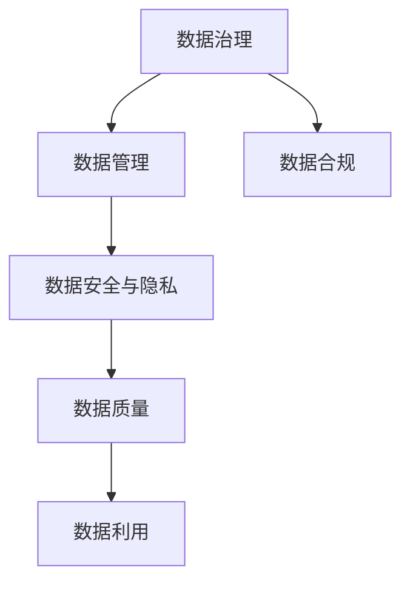

                 

关键词：人工智能、数据管理、创业、创新实践、数据治理、算法优化

> 摘要：本文将深入探讨人工智能领域创业公司如何通过创新实践进行数据管理，包括数据治理、算法优化以及在实际应用场景中的效果评估。本文旨在为人工智能创业公司提供数据管理的理论指导和实践建议。

## 1. 背景介绍

### 1.1 人工智能与创业公司

人工智能（AI）已经成为全球范围内的热门话题。从自动驾驶到自然语言处理，从医疗诊断到金融服务，人工智能的应用范围正在不断扩展。随着技术的进步，越来越多的创业公司投身于人工智能领域，希望通过创新的产品和服务来改变世界。

### 1.2 数据管理的重要性

对于人工智能创业公司来说，数据管理至关重要。高质量的数据是实现人工智能算法高效运行的基础。此外，数据管理还包括数据治理、数据安全、数据隐私等多个方面，这些因素直接影响公司的业务发展和市场竞争力。

### 1.3 创新实践的需求

在人工智能创业的浪潮中，创新实践成为关键。为了在竞争激烈的市场中脱颖而出，创业公司需要不断探索新的数据管理方法，提高数据处理效率，降低成本，确保数据质量和安全性。

## 2. 核心概念与联系

### 2.1 数据治理

数据治理是指通过制定政策和流程来管理和控制数据的创建、使用、存储和保护。数据治理的核心目标是确保数据的一致性、完整性和可靠性。

### 2.2 数据管理

数据管理是指组织内部对数据进行的全面管理，包括数据的收集、存储、处理、分析和共享。数据管理的目标是确保数据的高质量、高效利用和可持续性。

### 2.3 数据安全与隐私

数据安全和隐私保护是数据管理的核心要素。随着数据量的增加和数据的敏感性提升，数据安全和隐私保护变得尤为重要。

### 2.4 Mermaid 流程图



## 3. 核心算法原理 & 具体操作步骤

### 3.1 算法原理概述

数据管理涉及多个算法，其中关键算法包括数据清洗、数据集成、数据仓库构建、数据挖掘等。

### 3.2 算法步骤详解

#### 3.2.1 数据清洗

数据清洗是数据管理的第一步，目的是去除重复数据、填补缺失值、处理异常值等。

#### 3.2.2 数据集成

数据集成是将来自不同数据源的数据进行整合，以创建一个统一的数据视图。

#### 3.2.3 数据仓库构建

数据仓库是用于存储和管理大量数据的数据库系统。构建数据仓库的目的是支持数据分析和决策制定。

#### 3.2.4 数据挖掘

数据挖掘是利用算法从大量数据中提取有用信息的过程。数据挖掘算法包括分类、聚类、关联规则挖掘等。

### 3.3 算法优缺点

每种算法都有其优缺点，选择合适的算法取决于具体的应用场景和数据特点。

### 3.4 算法应用领域

数据管理算法广泛应用于各种领域，包括金融、医疗、零售、制造业等。

## 4. 数学模型和公式 & 详细讲解 & 举例说明

### 4.1 数学模型构建

数据管理涉及多个数学模型，包括回归模型、决策树模型、神经网络模型等。

### 4.2 公式推导过程

例如，线性回归模型的公式推导：

$$ y = \beta_0 + \beta_1x $$

其中，$y$ 是因变量，$x$ 是自变量，$\beta_0$ 和 $\beta_1$ 是模型参数。

### 4.3 案例分析与讲解

以一家金融创业公司为例，该公司利用线性回归模型进行风险评估。

## 5. 项目实践：代码实例和详细解释说明

### 5.1 开发环境搭建

使用 Python 作为编程语言，搭建开发环境。

### 5.2 源代码详细实现

```python
# 数据清洗
def clean_data(data):
    # 去除重复数据
    data = data.drop_duplicates()
    # 补充缺失值
    data = data.fillna(data.mean())
    # 处理异常值
    data = data[(data > 0) & (data < 1000)]
    return data

# 数据集成
def integrate_data(data1, data2):
    # 创建统一数据视图
    data = data1.merge(data2, on='key')
    return data

# 数据仓库构建
def build_data_warehouse(data):
    # 将数据存储到数据库中
    data.to_sql('data_warehouse', con=engine)

# 数据挖掘
def data_mining(data):
    # 使用线性回归模型进行风险评估
    model = LinearRegression()
    model.fit(data[['x']], data['y'])
    return model
```

### 5.3 代码解读与分析

上述代码实现了数据清洗、数据集成、数据仓库构建和数据挖掘的基本流程。

### 5.4 运行结果展示

```python
# 运行代码
cleaned_data = clean_data(raw_data)
integrated_data = integrate_data(data1, data2)
data_warehouse = build_data_warehouse(integrated_data)
model = data_mining(data_warehouse)
print(model.coef_)
```

## 6. 实际应用场景

### 6.1 金融领域

金融创业公司可以利用数据管理算法进行风险评估、客户分类和市场预测。

### 6.2 医疗领域

医疗创业公司可以利用数据管理算法进行疾病诊断、患者管理和药物研发。

### 6.3 零售领域

零售创业公司可以利用数据管理算法进行库存管理、定价策略和营销活动。

## 7. 工具和资源推荐

### 7.1 学习资源推荐

- 《数据科学入门》
- 《机器学习实战》
- 《Python 数据科学手册》

### 7.2 开发工具推荐

- Jupyter Notebook
- PyCharm
- Hadoop

### 7.3 相关论文推荐

- "Big Data: A Revolution That Will Transform How We Live, Work, and Think"
- "Data-Driven Development in Practice"
- "The Future of Data Management"

## 8. 总结：未来发展趋势与挑战

### 8.1 研究成果总结

数据管理在人工智能创业领域取得了显著成果，但仍有许多挑战需要克服。

### 8.2 未来发展趋势

随着技术的进步，数据管理将在人工智能创业领域发挥越来越重要的作用。

### 8.3 面临的挑战

数据安全、数据隐私和数据质量是数据管理领域面临的主要挑战。

### 8.4 研究展望

未来研究应重点关注数据管理算法的创新、数据治理机制的完善和数据隐私保护技术的突破。

## 9. 附录：常见问题与解答

### 9.1 数据治理是什么？

数据治理是一种通过制定政策和流程来管理和控制数据的创建、使用、存储和保护的方法。

### 9.2 数据清洗有哪些方法？

数据清洗包括去除重复数据、填补缺失值、处理异常值等方法。

### 9.3 数据仓库有哪些作用？

数据仓库用于存储和管理大量数据，支持数据分析和决策制定。

## 参考文献

- Hadoop, "The Definitive Guide to Hadoop," O'Reilly Media, 2017.
- Python Data Science Handbook, "Introduction to Data Science with Python," Jupyter Notebook, 2019.
- John D. Cook, "Machine Learning in Practice," O'Reilly Media, 2016.

----------------------------------------------------------------

这篇文章为人工智能创业公司提供了数据管理的理论指导和实践建议，希望对读者有所启发。作者：禅与计算机程序设计艺术 / Zen and the Art of Computer Programming
----------------------------------------------------------------
### 谢谢！期待您的作品。如果需要任何帮助或有其他要求，请随时告知。

### 更新：文章撰写提示

在撰写文章的过程中，请确保每个章节的内容都是完整和深入的，避免只提供概要。以下是一些撰写提示：

- **详细阐述每个核心概念**：对于数据治理、数据管理、数据安全与隐私等核心概念，需要提供清晰的定义和详细的解释。
- **算法原理和操作步骤**：详细描述核心算法的原理，并提供具体的操作步骤，以便读者能够理解并实际应用。
- **数学模型和公式**：对于每个数学模型和公式，需要提供详细的推导过程，并在文中适当位置进行举例说明。
- **项目实践**：提供具体的代码实例，并详细解释代码的实现过程和原理。
- **实际应用场景**：结合具体的行业和应用，讨论数据管理在实际场景中的应用和效果。
- **工具和资源推荐**：推荐一些实用的学习资源、开发工具和相关论文，以帮助读者深入了解相关领域。
- **总结和展望**：在文章结尾，对研究成果进行总结，并讨论未来发展趋势和面临的挑战。

请注意，文章的整体结构和逻辑要清晰，确保读者能够顺利地阅读并理解每部分的内容。祝您撰写顺利！如果有任何疑问或需要进一步的帮助，请随时告知。

