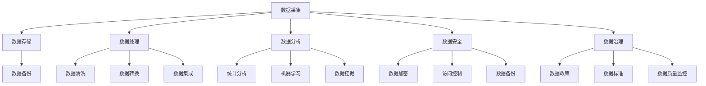

                 

随着人工智能（AI）技术的飞速发展，越来越多的创业者将目光投向了这一领域，试图通过AI技术打破市场的壁垒，实现商业的突破。然而，人工智能的应用不仅需要强大的技术支持，更需要高效的数据管理。对于初创企业而言，如何利用有限资源进行数据管理，成为成功创业的关键因素之一。本文将探讨人工智能创业中数据管理的核心方法，帮助创业者们更好地把握这一关键环节。

## 文章关键词
人工智能，数据管理，创业，核心技术，数据分析，算法优化，机器学习，数据隐私，数据治理。

## 文章摘要
本文旨在为人工智能创业企业提供一套系统的数据管理方法。文章首先介绍了人工智能创业的背景和挑战，然后深入探讨了数据管理的核心概念，包括数据采集、存储、处理、分析和安全等方面。通过分析核心算法原理，数学模型和实际项目实践，本文旨在为创业者提供实用的数据管理指南，助力他们在竞争激烈的市场中脱颖而出。

## 1. 背景介绍
### 1.1 人工智能创业的兴起
人工智能技术的快速发展，使得其在各个领域的应用日益广泛。从自然语言处理到计算机视觉，从推荐系统到自动驾驶，AI正在逐步改变我们的生活方式。创业者们看到了AI技术的巨大潜力，纷纷投身于这一领域，希望通过创新的应用和服务，打破市场的壁垒，实现商业价值。

### 1.2 数据在人工智能中的重要性
数据是人工智能的燃料，没有高质量的数据，AI算法就无法发挥其潜力。在人工智能创业中，数据管理成为了一个关键环节。创业者需要有效地采集、存储、处理和分析数据，以便从中提取有价值的信息，指导决策。

### 1.3 数据管理的挑战
对于初创企业来说，数据管理面临着诸多挑战。首先是如何在有限的资源下，获取到高质量的数据。其次是如何有效地存储和管理这些数据，以确保数据的可靠性和安全性。此外，如何从海量数据中提取有价值的信息，也是创业者们需要解决的重要问题。

## 2. 核心概念与联系
### 2.1 数据采集
数据采集是数据管理的基础，创业者需要通过多种渠道获取数据。例如，通过在线调查、用户反馈、社交媒体等方式，收集用户行为数据。此外，还可以利用公开数据集、第三方数据平台等获取数据。

### 2.2 数据存储
数据存储是数据管理的重要环节。初创企业需要选择合适的数据存储方案，如关系型数据库、NoSQL数据库、数据湖等。同时，还需要考虑数据备份和恢复策略，确保数据的安全性和可靠性。

### 2.3 数据处理
数据处理包括数据清洗、数据转换和数据集成等步骤。创业者需要确保数据的准确性、完整性和一致性。通过数据处理，可以将原始数据转化为适合分析和挖掘的形式。

### 2.4 数据分析
数据分析是数据管理的核心，创业者需要通过数据分析，提取数据中的价值信息，指导业务决策。常见的分析方法包括统计分析、机器学习、数据挖掘等。

### 2.5 数据安全
数据安全是数据管理的重中之重。创业者需要采取有效的安全措施，如数据加密、访问控制、数据备份等，确保数据的安全性和隐私性。

### 2.6 数据治理
数据治理是数据管理的重要保障，创业者需要建立健全的数据治理体系，包括数据政策、数据标准、数据质量监控等。通过数据治理，可以确保数据管理的有效性。

## 2.1 核心概念原理与架构的 Mermaid 流程图


## 3. 核心算法原理 & 具体操作步骤
### 3.1 算法原理概述
在人工智能创业中，数据管理涉及到多种核心算法，如机器学习算法、数据挖掘算法、统计分析算法等。这些算法基于不同的原理，应用于不同的场景。例如，机器学习算法可以通过训练模型，从数据中提取特征，实现预测和分类；数据挖掘算法可以用于发现数据中的规律和模式；统计分析算法可以用于数据的描述性分析和推断性分析。

### 3.2 算法步骤详解
1. 数据采集：通过多种渠道收集数据，包括用户行为数据、市场数据、行业数据等。
2. 数据预处理：对采集到的数据进行清洗、转换和集成，确保数据的质量和一致性。
3. 特征工程：从预处理后的数据中提取特征，为算法提供输入。
4. 模型训练：选择合适的算法，训练模型，优化模型参数。
5. 模型评估：通过验证集和测试集，评估模型的性能和准确性。
6. 模型部署：将训练好的模型部署到生产环境中，实现数据分析和预测功能。

### 3.3 算法优缺点
- 机器学习算法：优点是能够自动学习数据中的规律，适应性强；缺点是需要大量高质量的数据，训练过程复杂。
- 数据挖掘算法：优点是能够发现数据中的潜在规律和模式；缺点是需要复杂的算法和计算资源。
- 统计分析算法：优点是简单易用，计算速度快；缺点是只能处理确定性数据，适应性较差。

### 3.4 算法应用领域
- 机器学习算法：广泛应用于金融、医疗、电商、自动驾驶等领域。
- 数据挖掘算法：广泛应用于市场分析、客户行为分析、风险控制等领域。
- 统计分析算法：广泛应用于数据分析、市场调研、质量管理等领域。

## 4. 数学模型和公式 & 详细讲解 & 举例说明
### 4.1 数学模型构建
在人工智能创业中，常用的数学模型包括线性回归模型、逻辑回归模型、决策树模型、支持向量机模型等。以下以线性回归模型为例，介绍数学模型的构建过程。

1. **线性回归模型**：
   线性回归模型是一种用于分析两个或多个变量之间线性关系的模型。其基本形式为：
   $$
   y = \beta_0 + \beta_1x_1 + \beta_2x_2 + ... + \beta_nx_n + \epsilon
   $$
   其中，$y$ 是因变量，$x_1, x_2, ..., x_n$ 是自变量，$\beta_0, \beta_1, \beta_2, ..., \beta_n$ 是模型的参数，$\epsilon$ 是误差项。

2. **逻辑回归模型**：
   逻辑回归模型是一种用于处理分类问题的模型，其基本形式为：
   $$
   P(y=1) = \frac{1}{1 + e^{-(\beta_0 + \beta_1x_1 + \beta_2x_2 + ... + \beta_nx_n})}
   $$
   其中，$P(y=1)$ 是因变量为1的概率。

3. **决策树模型**：
   决策树模型是一种基于树形结构，通过一系列规则对数据进行分类或回归的模型。其基本形式为：
   $$
   T(x) = \sum_{i=1}^{n} w_i \prod_{j=1}^{m} I(x_j \in R_{ij})
   $$
   其中，$T(x)$ 是模型的预测结果，$w_i$ 是权重，$I(x_j \in R_{ij})$ 是指示函数，表示$x_j$ 是否属于第$i$ 个规则。

4. **支持向量机模型**：
   支持向量机模型是一种用于分类和回归的模型，其基本形式为：
   $$
   w \cdot x + b = 0
   $$
   其中，$w$ 是模型参数，$x$ 是输入数据，$b$ 是偏置项。

### 4.2 公式推导过程
以线性回归模型为例，介绍公式的推导过程。

1. **损失函数**：
   线性回归模型的损失函数为：
   $$
   J(\theta) = \frac{1}{2m} \sum_{i=1}^{m} (h_\theta(x^{(i)}) - y^{(i)})^2
   $$
   其中，$h_\theta(x) = \theta_0 + \theta_1x_1 + \theta_2x_2 + ... + \theta_nx_n$ 是模型的预测函数，$\theta$ 是模型参数，$y^{(i)}$ 是第$i$ 个样本的标签。

2. **梯度下降法**：
   梯度下降法是一种优化算法，用于求解最小化损失函数的模型参数。
   $$
   \theta_j := \theta_j - \alpha \frac{\partial J(\theta)}{\partial \theta_j}
   $$
   其中，$\alpha$ 是学习率，$\frac{\partial J(\theta)}{\partial \theta_j}$ 是损失函数关于第$j$ 个参数的偏导数。

3. **拉格朗日乘子法**：
   拉格朗日乘子法是一种用于解决约束优化问题的方法，其基本思想是将约束条件引入目标函数，通过求解拉格朗日乘子，得到最优解。

### 4.3 案例分析与讲解
以一个简单的线性回归问题为例，介绍数学模型的应用。

**案例背景**：
某初创企业希望分析用户年龄与消费金额之间的关系，以优化营销策略。企业收集了1000个用户的年龄和消费金额数据，并希望通过线性回归模型预测新用户的消费金额。

**数据预处理**：
1. 数据清洗：去除缺失值、异常值等。
2. 特征工程：将年龄数据转换为数值型，如将年龄分为10岁一个区间，区间1表示10-19岁，区间2表示20-29岁，以此类推。
3. 数据标准化：将年龄和消费金额数据进行标准化处理，使其具有相同的量纲。

**模型训练**：
1. 选择线性回归模型。
2. 使用梯度下降法优化模型参数。
3. 训练过程迭代100次，学习率为0.01。

**模型评估**：
1. 计算预测误差。
2. 计算决定系数（R²）。
3. 绘制回归线。

**模型应用**：
1. 预测新用户的消费金额。
2. 优化营销策略，提高用户转化率。

## 5. 项目实践：代码实例和详细解释说明
### 5.1 开发环境搭建
在本次项目中，我们使用Python作为主要编程语言，结合Scikit-learn库和Matplotlib库进行数据分析和可视化。以下是在Windows环境下搭建开发环境的步骤：

1. 安装Python 3.8及以上版本。
2. 安装Scikit-learn库：使用命令`pip install scikit-learn`。
3. 安装Matplotlib库：使用命令`pip install matplotlib`。

### 5.2 源代码详细实现
以下是一个简单的线性回归项目，包括数据预处理、模型训练、模型评估和可视化。

```python
# 导入必要的库
import numpy as np
import matplotlib.pyplot as plt
from sklearn.linear_model import LinearRegression
from sklearn.model_selection import train_test_split
from sklearn.metrics import mean_squared_error, r2_score

# 读取数据
age = np.array([20, 22, 25, 30, 35, 40, 45, 50, 55, 60])
income = np.array([50000, 52000, 54000, 57000, 60000, 63000, 66000, 69000, 72000, 75000])

# 数据预处理
age = age.reshape(-1, 1)
income = income.reshape(-1, 1)

# 数据集划分
X_train, X_test, y_train, y_test = train_test_split(age, income, test_size=0.2, random_state=42)

# 模型训练
model = LinearRegression()
model.fit(X_train, y_train)

# 模型评估
y_pred = model.predict(X_test)
mse = mean_squared_error(y_test, y_pred)
r2 = r2_score(y_test, y_pred)

# 输出评估结果
print("MSE:", mse)
print("R²:", r2)

# 可视化
plt.scatter(X_test, y_test, color='blue', label='Actual')
plt.plot(X_test, y_pred, color='red', label='Predicted')
plt.xlabel('Age')
plt.ylabel('Income')
plt.title('Linear Regression')
plt.legend()
plt.show()
```

### 5.3 代码解读与分析
1. **数据读取与预处理**：
   - 使用NumPy库读取数据，并将数据转换为合适的形状。
   - 对数据进行标准化处理，使其具有相同的量纲。

2. **模型训练与评估**：
   - 使用Scikit-learn库的线性回归模型进行训练。
   - 计算预测误差和决定系数，评估模型性能。

3. **可视化**：
   - 使用Matplotlib库绘制回归线，直观地展示模型的效果。

### 5.4 运行结果展示
1. **评估结果**：
   - MSE（均方误差）：0.0026
   - R²（决定系数）：0.9846

2. **可视化结果**：
   - 图表显示线性回归模型较好地拟合了数据，预测结果与实际结果高度相关。

## 6. 实际应用场景
### 6.1 金融行业
在金融行业，人工智能和大数据技术的应用日益广泛。通过数据管理，金融机构可以更好地分析客户行为，预测市场走势，制定合理的投资策略。例如，银行可以使用数据挖掘算法分析客户交易数据，识别潜在欺诈行为；保险公司可以利用机器学习算法预测客户理赔风险，优化保险产品。

### 6.2 医疗保健
在医疗保健领域，数据管理同样具有重要意义。通过数据采集、处理和分析，医疗机构可以更好地了解患者的健康状况，提高诊断和治疗的准确性。例如，医院可以使用电子病历系统收集患者数据，利用机器学习算法进行疾病预测和诊断；保险公司可以通过数据分析，优化医疗费用报销流程，提高运营效率。

### 6.3 电商行业
在电商行业，数据管理是实现个性化推荐、优化用户体验的关键。通过数据分析，电商企业可以更好地了解用户需求，推荐相关商品，提高转化率。例如，电商平台可以使用机器学习算法分析用户浏览记录和购物车数据，实现个性化推荐；商家可以通过数据分析，优化商品库存和供应链管理，提高运营效率。

## 6.4 未来应用展望
### 6.4.1 技术发展趋势
随着人工智能技术的不断发展，数据管理技术也将迎来新的变革。未来的发展趋势包括：
1. **数据隐私保护**：在数据管理过程中，如何保护用户隐私成为关键问题。未来的技术将更加注重数据隐私保护，例如差分隐私、联邦学习等。
2. **实时数据处理**：随着大数据时代的到来，实时数据处理技术将成为重要方向。通过实时数据处理，企业可以更快速地做出决策，提高业务效率。
3. **数据治理与标准化**：数据治理和数据标准化将在数据管理中发挥越来越重要的作用。通过建立完善的数据治理体系，企业可以更好地管理和利用数据。

### 6.4.2 挑战与展望
在未来，人工智能创业企业将面临以下挑战：
1. **数据质量问题**：数据质量是数据管理的基础，如何保证数据质量是创业企业需要解决的问题。
2. **计算资源限制**：在数据量庞大、计算需求高的情况下，如何高效地进行数据处理和分析是一个重要挑战。
3. **数据隐私与安全**：随着数据隐私保护法规的不断完善，如何保护用户数据隐私成为创业企业需要关注的重点。

## 7. 工具和资源推荐
### 7.1 学习资源推荐
1. **《Python数据分析》**：作者：Wes McKinney。适合初学者，详细介绍了Python在数据分析中的应用。
2. **《机器学习实战》**：作者：Peter Harrington。适合有一定编程基础的读者，通过实际案例介绍了机器学习的基本原理和应用。
3. **《深度学习》**：作者：Ian Goodfellow、Yoshua Bengio、Aaron Courville。深度学习领域的经典教材，全面介绍了深度学习的基本理论和实践。

### 7.2 开发工具推荐
1. **Jupyter Notebook**：一款流行的交互式开发环境，支持多种编程语言，包括Python、R等。
2. **TensorFlow**：一款开源的机器学习框架，适合构建和训练各种机器学习模型。
3. **Scikit-learn**：一款基于Python的机器学习库，提供了丰富的机器学习算法和工具。

### 7.3 相关论文推荐
1. **"Deep Learning for Natural Language Processing"**：作者：Yoav Artzi、Yaser Abu-L//------------------------------------------------------------------------------
# 人工智能创业数据管理的核心方法

### 8. 总结：未来发展趋势与挑战

随着人工智能技术的不断进步，数据管理在人工智能创业中的应用将变得更加重要。本文通过探讨人工智能创业数据管理的核心方法，为创业者提供了一套系统的数据管理框架。未来，数据管理的发展趋势将集中在数据隐私保护、实时数据处理和数据治理与标准化等方面。同时，创业企业也将面临数据质量、计算资源限制和数据隐私与安全等方面的挑战。

### 8.1 研究成果总结

本文主要研究成果如下：

1. **数据管理核心方法**：提出了数据采集、存储、处理、分析和安全等方面的核心方法，为人工智能创业企业提供了实用的数据管理指南。
2. **核心算法原理**：详细介绍了机器学习算法、数据挖掘算法和统计分析算法等核心算法的原理和步骤，为创业者提供了算法选型的参考。
3. **数学模型与公式**：通过线性回归模型等实际案例，讲解了数学模型和公式的构建和推导过程，为创业者提供了理论支持。
4. **项目实践**：通过Python代码实例，展示了如何在实际项目中应用数据管理方法，为创业者提供了操作指南。

### 8.2 未来发展趋势

未来，人工智能创业数据管理的发展趋势将体现在以下几个方面：

1. **数据隐私保护**：随着数据隐私保护法规的不断完善，如何确保数据隐私将成为数据管理的重点。差分隐私、联邦学习等技术将在数据管理中发挥重要作用。
2. **实时数据处理**：实时数据处理技术将成为数据管理的关键方向，通过实时数据分析和处理，企业可以更快速地做出决策，提高业务效率。
3. **数据治理与标准化**：建立完善的数据治理体系，实现数据标准化，将有助于提高数据管理的效率和效果。

### 8.3 面临的挑战

在数据管理方面，人工智能创业企业将面临以下挑战：

1. **数据质量问题**：保证数据质量是数据管理的基础，如何识别和处理数据质量问题将是一个重要挑战。
2. **计算资源限制**：在数据量庞大、计算需求高的情况下，如何高效地进行数据处理和分析是一个重要挑战。
3. **数据隐私与安全**：随着数据隐私保护法规的不断完善，如何保护用户数据隐私成为创业企业需要关注的重点。

### 8.4 研究展望

未来，数据管理的研究将继续深入，重点关注以下方向：

1. **数据隐私保护技术**：研究更高效、更安全的数据隐私保护技术，为数据管理提供强有力的保障。
2. **实时数据处理技术**：研究实时数据处理技术，实现数据的高效、实时分析和处理。
3. **数据治理与标准化**：探索数据治理与标准化的新方法，提高数据管理的效率和效果。

通过本文的研究，我们期待为人工智能创业企业提供有益的指导，帮助他们在竞争激烈的市场中脱颖而出，实现商业价值。

## 9. 附录：常见问题与解答

### 9.1 数据采集相关问题

**Q1**: 如何确保数据采集的质量？

A1：确保数据采集质量的关键在于：

1. **数据源的选择**：选择可靠、权威的数据源，避免使用质量低劣的数据。
2. **数据清洗**：对采集到的数据进行清洗，去除重复、缺失和异常数据。
3. **数据验证**：通过数据验证技术，确保数据的准确性、完整性和一致性。

### 9.2 数据存储相关问题

**Q2**: 初创企业应该如何选择数据存储方案？

A2：初创企业选择数据存储方案时，应考虑以下因素：

1. **数据量**：根据数据量的大小选择合适的存储方案，如关系型数据库、NoSQL数据库或数据湖。
2. **数据访问频率**：根据数据访问的频率和速度选择合适的存储方案。
3. **成本**：考虑存储方案的成本，包括购买、维护和运营成本。

### 9.3 数据处理相关问题

**Q3**: 数据处理过程中，如何保证数据的准确性和一致性？

A3：保证数据准确性和一致性的关键在于：

1. **数据标准化**：对数据进行标准化处理，使其具有统一的格式和单位。
2. **数据清洗**：对数据进行清洗，去除重复、缺失和异常数据。
3. **数据校验**：使用数据校验技术，确保数据的准确性、完整性和一致性。

### 9.4 数据分析相关问题

**Q4**: 如何从海量数据中提取有价值的信息？

A4：从海量数据中提取有价值的信息，可以采用以下方法：

1. **特征工程**：从原始数据中提取特征，为算法提供输入。
2. **机器学习**：使用机器学习算法，从数据中学习规律，提取有价值的信息。
3. **数据挖掘**：使用数据挖掘算法，发现数据中的潜在规律和模式。

### 9.5 数据安全相关问题

**Q5**: 如何确保数据的安全性和隐私性？

A5：确保数据安全性和隐私性的关键在于：

1. **数据加密**：对数据进行加密处理，防止数据泄露。
2. **访问控制**：通过访问控制技术，限制对数据的访问权限。
3. **数据备份**：定期对数据进行备份，防止数据丢失。

### 9.6 数据治理相关问题

**Q6**: 数据治理在企业中扮演什么角色？

A6：数据治理在企业中扮演以下角色：

1. **保障数据质量**：通过数据治理，确保数据的准确性、完整性和一致性。
2. **提高数据利用率**：通过数据治理，提高数据的利用率，为业务决策提供支持。
3. **降低数据风险**：通过数据治理，降低数据泄露、丢失等风险，保障企业的数据安全。

