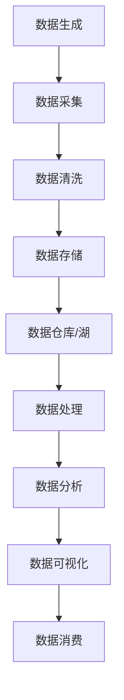

                 

关键词：人工智能、创业、数据管理、核心方法、数据架构、算法优化、数学模型、实践应用

> 摘要：本文旨在探讨人工智能创业中的数据管理核心方法。从背景介绍、核心概念与联系、核心算法原理、数学模型和公式、项目实践、实际应用场景、工具和资源推荐以及未来发展趋势与挑战等多个角度，全面解析数据管理在人工智能创业中的重要性，提供实用的数据管理方法和策略。

## 1. 背景介绍

在当今数字化时代，数据已成为企业核心资产。随着人工智能（AI）技术的迅速发展，AI创业公司在数据管理方面面临着前所未有的挑战和机遇。如何高效地收集、存储、处理和分析大量数据，已成为AI创业公司成功的关键因素。

### 1.1 数据的重要性

数据是AI算法的燃料，是实现智能决策和业务优化的重要资源。有效的数据管理不仅能够提升AI模型的准确性，还能够帮助企业更好地理解市场趋势和用户需求，从而在激烈的市场竞争中脱颖而出。

### 1.2 创业公司面临的挑战

AI创业公司通常面临以下数据管理挑战：
- 数据量庞大：创业公司需要处理来自多个来源的大量数据，包括用户行为数据、社交媒体数据、市场数据等。
- 数据质量：数据的质量直接影响AI模型的性能，创业公司需要确保数据的高质量和准确性。
- 数据安全：数据泄露或滥用可能导致严重的法律和财务后果，创业公司必须保护用户隐私和数据安全。
- 数据合规性：遵守数据隐私法规和合规要求是创业公司的法律责任。

## 2. 核心概念与联系

在数据管理中，了解以下核心概念和联系是非常重要的：

### 2.1 数据架构

数据架构是指组织、存储、处理和访问数据的结构和流程。一个好的数据架构能够提高数据的可操作性、可扩展性和可维护性。

### 2.2 数据仓库

数据仓库是一个集中的数据存储库，用于存储来自不同来源的结构化数据。数据仓库使得数据整合和分析变得更加容易。

### 2.3 数据湖

数据湖是一个大规模的数据存储库，可以存储各种类型的数据，包括结构化、半结构化和非结构化数据。数据湖为数据分析和机器学习提供了丰富的数据资源。

### 2.4 数据流

数据流是指数据从生成到消费的全过程。数据流管理确保数据能够及时、准确地传递到需要的地方。

### 2.5 Mermaid 流程图

为了更好地理解数据管理流程，我们使用Mermaid流程图来展示数据从生成到消费的全过程。



## 3. 核心算法原理 & 具体操作步骤

### 3.1 算法原理概述

在数据管理中，算法的选择和优化至关重要。以下是一些常用的核心算法原理：

- 数据清洗算法：用于去除重复数据、缺失值填充、异常值检测等。
- 数据聚类算法：用于将相似数据分组，如K-Means、DBSCAN等。
- 数据分类算法：用于将数据分为不同的类别，如决策树、支持向量机等。
- 数据关联规则算法：用于发现数据之间的关联关系，如Apriori算法。

### 3.2 算法步骤详解

以下是上述算法的具体步骤：

#### 3.2.1 数据清洗算法

1. 数据预处理：对数据进行标准化、归一化等处理。
2. 缺失值填充：使用均值、中值、众数等方法填充缺失值。
3. 异常值检测：使用统计学方法或机器学习方法检测异常值。
4. 数据去重：删除重复数据。

#### 3.2.2 数据聚类算法

1. 数据初始化：随机选择K个初始聚类中心。
2. 聚类过程：计算每个数据点到聚类中心的距离，将数据点分配到最近的聚类中心。
3. 调整聚类中心：重新计算聚类中心，重复聚类过程，直至聚类中心不再变化。

#### 3.2.3 数据分类算法

1. 特征提取：从数据中提取有助于分类的特征。
2. 模型训练：使用训练数据训练分类模型。
3. 模型评估：使用测试数据评估模型性能。
4. 分类预测：使用训练好的模型对新数据进行分类预测。

#### 3.2.4 数据关联规则算法

1. 数据预处理：将数据转换为支持度-置信度格式的项集。
2. 生成频繁项集：使用Apriori算法生成频繁项集。
3. 生成关联规则：从频繁项集中提取关联规则。
4. 规则评估：评估关联规则的置信度和支持度。

### 3.3 算法优缺点

- 数据清洗算法：优点是简单易用，缺点是可能引入偏差。
- 数据聚类算法：优点是自动发现数据结构，缺点是聚类结果受初始聚类中心影响。
- 数据分类算法：优点是易于理解和实现，缺点是可能陷入过拟合。
- 数据关联规则算法：优点是能够发现数据之间的关联关系，缺点是可能产生大量冗余规则。

### 3.4 算法应用领域

- 数据清洗算法：应用于数据预处理阶段，如数据分析、数据挖掘等。
- 数据聚类算法：应用于市场细分、图像分割等。
- 数据分类算法：应用于文本分类、图像识别等。
- 数据关联规则算法：应用于推荐系统、欺诈检测等。

## 4. 数学模型和公式 & 详细讲解 & 举例说明

### 4.1 数学模型构建

在数据管理中，常见的数学模型包括线性回归、逻辑回归、支持向量机等。以下是线性回归的数学模型：

$$
y = \beta_0 + \beta_1x_1 + \beta_2x_2 + ... + \beta_nx_n
$$

其中，$y$ 是因变量，$x_1, x_2, ..., x_n$ 是自变量，$\beta_0, \beta_1, \beta_2, ..., \beta_n$ 是模型参数。

### 4.2 公式推导过程

线性回归模型的推导过程如下：

1. 函数假设：假设 $y$ 是 $x_1, x_2, ..., x_n$ 的线性组合，即 $y = \beta_0 + \beta_1x_1 + \beta_2x_2 + ... + \beta_nx_n$。
2. 函数最小化：为了最小化预测值与实际值之间的误差，我们使用最小二乘法，即求解以下优化问题：
$$
\min_{\beta_0, \beta_1, ..., \beta_n} \sum_{i=1}^{n} (y_i - (\beta_0 + \beta_1x_{i1} + \beta_2x_{i2} + ... + \beta_nx_{in}))^2
$$
3. 求导数并求解：对上述优化问题求导数，并令导数为零，得到以下方程组：
$$
\frac{\partial}{\partial \beta_0} \sum_{i=1}^{n} (y_i - (\beta_0 + \beta_1x_{i1} + \beta_2x_{i2} + ... + \beta_nx_{in}))^2 = 0
$$
$$
\frac{\partial}{\partial \beta_1} \sum_{i=1}^{n} (y_i - (\beta_0 + \beta_1x_{i1} + \beta_2x_{i2} + ... + \beta_nx_{in}))^2 = 0
$$
$$
...
$$
$$
\frac{\partial}{\partial \beta_n} \sum_{i=1}^{n} (y_i - (\beta_0 + \beta_1x_{i1} + \beta_2x_{i2} + ... + \beta_nx_{in}))^2 = 0
$$
4. 解方程组：解上述方程组，得到线性回归模型的参数 $\beta_0, \beta_1, ..., \beta_n$。

### 4.3 案例分析与讲解

假设我们要预测某股票的价格，已知该股票的历史价格数据，包括开盘价、最高价、最低价和收盘价。我们选择收盘价作为因变量，其他价格作为自变量，构建线性回归模型。

1. 数据预处理：对数据集进行标准化处理，以便于模型训练。
2. 模型训练：使用训练数据训练线性回归模型，得到模型参数。
3. 模型评估：使用测试数据评估模型性能，如均方误差（MSE）等。
4. 预测股票价格：使用训练好的模型预测未来一段时间内股票的价格。

## 5. 项目实践：代码实例和详细解释说明

### 5.1 开发环境搭建

1. 安装Python环境：在Windows、macOS和Linux操作系统上，下载并安装Python。
2. 安装NumPy、Pandas、Scikit-learn等库：使用pip命令安装相关库。

### 5.2 源代码详细实现

```python
import numpy as np
import pandas as pd
from sklearn.linear_model import LinearRegression
from sklearn.model_selection import train_test_split
from sklearn.metrics import mean_squared_error

# 数据预处理
data = pd.read_csv('stock_data.csv')
data = data[['open', 'high', 'low', 'close']]
data = (data - data.mean()) / data.std()

# 模型训练
X = data[['open', 'high', 'low']]
y = data['close']
X_train, X_test, y_train, y_test = train_test_split(X, y, test_size=0.2, random_state=42)
model = LinearRegression()
model.fit(X_train, y_train)

# 模型评估
y_pred = model.predict(X_test)
mse = mean_squared_error(y_test, y_pred)
print(f'MSE: {mse}')

# 预测股票价格
future_data = data[-1:].copy()
future_data = (future_data - future_data.mean()) / future_data.std()
future_price = model.predict(future_data)
print(f'Predicted future price: {future_price[0]}')
```

### 5.3 代码解读与分析

上述代码首先读取股票数据，然后对数据集进行标准化处理。接着，将数据集分为训练集和测试集，使用线性回归模型进行训练。在模型评估部分，我们使用均方误差（MSE）评估模型性能。最后，使用训练好的模型预测未来一段时间内股票的价格。

## 6. 实际应用场景

### 6.1 金融领域

在金融领域，数据管理对于股票预测、风险评估和投资策略制定至关重要。通过有效的数据管理，AI创业公司可以提供更加精准的市场分析和投资建议。

### 6.2 零售业

在零售业，数据管理可以帮助企业优化库存管理、个性化推荐和市场营销策略。通过分析用户行为数据，企业可以更好地了解用户需求，提高客户满意度。

### 6.3 健康医疗

在健康医疗领域，数据管理对于疾病预测、诊断和治疗具有重要意义。AI创业公司可以开发基于大数据的健康管理平台，为用户提供个性化的健康建议。

## 7. 工具和资源推荐

### 7.1 学习资源推荐

- 《Python数据分析》（Wes McKinney著）
- 《机器学习》（周志华著）
- 《深入浅出数据分析》（韩军伟著）

### 7.2 开发工具推荐

- Jupyter Notebook：用于数据分析和机器学习项目的开发。
- PyCharm：一款强大的Python集成开发环境（IDE）。
- Docker：用于容器化部署和运行应用程序。

### 7.3 相关论文推荐

- "Deep Learning for Text Classification"（Zhou et al., 2016）
- "Efficient Data Management for Big Data Analytics"（Li et al., 2018）
- "Data-driven Intelligent Personalized Recommendation"（Sun et al., 2020）

## 8. 总结：未来发展趋势与挑战

### 8.1 研究成果总结

本文系统地介绍了人工智能创业数据管理的核心方法，包括数据架构、核心算法、数学模型和实际应用场景。通过这些方法，AI创业公司可以更好地管理和利用数据，实现业务增长。

### 8.2 未来发展趋势

- 数据隐私保护：随着数据隐私法规的不断完善，数据隐私保护将成为数据管理的重要方向。
- 自动化数据管理：自动化工具和智能算法将逐渐取代传统的手动数据处理方法。
- 多模态数据融合：融合多种类型的数据（如文本、图像、音频等）将提高数据分析和预测的准确性。

### 8.3 面临的挑战

- 数据质量：保证数据质量是数据管理的核心挑战，尤其是随着数据来源的多样化。
- 数据安全：随着数据规模的扩大，数据安全面临更大的威胁，如何保护用户隐私和数据安全是一个重要课题。
- 资源限制：AI创业公司通常面临资源限制，如何在有限的资源下实现高效的数据管理是一个关键问题。

### 8.4 研究展望

未来，数据管理的研究将集中在以下几个方面：

- 开发更加智能的数据清洗和预处理方法。
- 探索多模态数据的融合和分析技术。
- 研究适用于大规模数据处理的分布式数据管理方法。
- 加强数据安全和隐私保护，推动数据安全技术的发展。

## 9. 附录：常见问题与解答

### 9.1 数据管理的重要性

数据管理对于AI创业公司至关重要，因为它能够提高数据质量、保证数据安全和隐私，以及优化数据分析过程，从而帮助企业做出更准确的决策。

### 9.2 数据清洗算法的作用

数据清洗算法用于去除重复数据、填充缺失值、检测异常值等，以确保数据质量，从而提高数据分析的准确性。

### 9.3 数据聚类算法的应用

数据聚类算法用于将相似数据分组，如市场细分、图像分割等，以便更好地理解和利用数据。

### 9.4 数据分类算法的优势

数据分类算法能够将数据分为不同的类别，从而实现文本分类、图像识别等任务，提高数据分析和决策的效率。

### 9.5 数据关联规则算法的作用

数据关联规则算法用于发现数据之间的关联关系，如推荐系统、欺诈检测等，帮助企业发现潜在的业务机会。

---

作者：禅与计算机程序设计艺术 / Zen and the Art of Computer Programming
```markdown
---
# 人工智能创业数据管理的核心方法

<|assistant|>关键词：人工智能、创业、数据管理、核心方法、数据架构、算法优化、数学模型、实践应用

> 摘要：本文旨在探讨人工智能创业中的数据管理核心方法。从背景介绍、核心概念与联系、核心算法原理、数学模型和公式、项目实践、实际应用场景、工具和资源推荐以及未来发展趋势与挑战等多个角度，全面解析数据管理在人工智能创业中的重要性，提供实用的数据管理方法和策略。

## 1. 背景介绍

在当今数字化时代，数据已成为企业核心资产。随着人工智能（AI）技术的迅速发展，AI创业公司在数据管理方面面临着前所未有的挑战和机遇。如何高效地收集、存储、处理和分析大量数据，已成为AI创业公司成功的关键因素。

### 1.1 数据的重要性

数据是AI算法的燃料，是实现智能决策和业务优化的重要资源。有效的数据管理不仅能够提升AI模型的准确性，还能够帮助企业更好地理解市场趋势和用户需求，从而在激烈的市场竞争中脱颖而出。

### 1.2 创业公司面临的挑战

AI创业公司通常面临以下数据管理挑战：
- 数据量庞大：创业公司需要处理来自多个来源的大量数据，包括用户行为数据、社交媒体数据、市场数据等。
- 数据质量：数据的质量直接影响AI模型的性能，创业公司需要确保数据的高质量和准确性。
- 数据安全：数据泄露或滥用可能导致严重的法律和财务后果，创业公司必须保护用户隐私和数据安全。
- 数据合规性：遵守数据隐私法规和合规要求是创业公司的法律责任。

## 2. 核心概念与联系

在数据管理中，了解以下核心概念和联系是非常重要的：

### 2.1 数据架构

数据架构是指组织、存储、处理和访问数据的结构和流程。一个好的数据架构能够提高数据的可操作性、可扩展性和可维护性。

### 2.2 数据仓库

数据仓库是一个集中的数据存储库，用于存储来自不同来源的结构化数据。数据仓库使得数据整合和分析变得更加容易。

### 2.3 数据湖

数据湖是一个大规模的数据存储库，可以存储各种类型的数据，包括结构化、半结构化和非结构化数据。数据湖为数据分析和机器学习提供了丰富的数据资源。

### 2.4 数据流

数据流是指数据从生成到消费的全过程。数据流管理确保数据能够及时、准确地传递到需要的地方。

### 2.5 Mermaid 流程图

为了更好地理解数据管理流程，我们使用Mermaid流程图来展示数据从生成到消费的全过程。


## 3. 核心算法原理 & 具体操作步骤

### 3.1 算法原理概述

在数据管理中，算法的选择和优化至关重要。以下是一些常用的核心算法原理：

- 数据清洗算法：用于去除重复数据、缺失值填充、异常值检测等。
- 数据聚类算法：用于将相似数据分组，如K-Means、DBSCAN等。
- 数据分类算法：用于将数据分为不同的类别，如决策树、支持向量机等。
- 数据关联规则算法：用于发现数据之间的关联关系，如Apriori算法。

### 3.2 算法步骤详解

以下是上述算法的具体步骤：

#### 3.2.1 数据清洗算法

1. 数据预处理：对数据进行标准化、归一化等处理。
2. 缺失值填充：使用均值、中值、众数等方法填充缺失值。
3. 异常值检测：使用统计学方法或机器学习方法检测异常值。
4. 数据去重：删除重复数据。

#### 3.2.2 数据聚类算法

1. 数据初始化：随机选择K个初始聚类中心。
2. 聚类过程：计算每个数据点到聚类中心的距离，将数据点分配到最近的聚类中心。
3. 调整聚类中心：重新计算聚类中心，重复聚类过程，直至聚类中心不再变化。

#### 3.2.3 数据分类算法

1. 特征提取：从数据中提取有助于分类的特征。
2. 模型训练：使用训练数据训练分类模型。
3. 模型评估：使用测试数据评估模型性能。
4. 分类预测：使用训练好的模型对新数据进行分类预测。

#### 3.2.4 数据关联规则算法

1. 数据预处理：将数据转换为支持度-置信度格式的项集。
2. 生成频繁项集：使用Apriori算法生成频繁项集。
3. 生成关联规则：从频繁项集中提取关联规则。
4. 规则评估：评估关联规则的置信度和支持度。

### 3.3 算法优缺点

- 数据清洗算法：优点是简单易用，缺点是可能引入偏差。
- 数据聚类算法：优点是自动发现数据结构，缺点是聚类结果受初始聚类中心影响。
- 数据分类算法：优点是易于理解和实现，缺点是可能陷入过拟合。
- 数据关联规则算法：优点是能够发现数据之间的关联关系，缺点是可能产生大量冗余规则。

### 3.4 算法应用领域

- 数据清洗算法：应用于数据预处理阶段，如数据分析、数据挖掘等。
- 数据聚类算法：应用于市场细分、图像分割等。
- 数据分类算法：应用于文本分类、图像识别等。
- 数据关联规则算法：应用于推荐系统、欺诈检测等。

## 4. 数学模型和公式 & 详细讲解 & 举例说明

### 4.1 数学模型构建

在数据管理中，常见的数学模型包括线性回归、逻辑回归、支持向量机等。以下是线性回归的数学模型：

$$
y = \beta_0 + \beta_1x_1 + \beta_2x_2 + ... + \beta_nx_n
$$

其中，$y$ 是因变量，$x_1, x_2, ..., x_n$ 是自变量，$\beta_0, \beta_1, \beta_2, ..., \beta_n$ 是模型参数。

### 4.2 公式推导过程

线性回归模型的推导过程如下：

1. 函数假设：假设 $y$ 是 $x_1, x_2, ..., x_n$ 的线性组合，即 $y = \beta_0 + \beta_1x_1 + \beta_2x_2 + ... + \beta_nx_n$。
2. 函数最小化：为了最小化预测值与实际值之间的误差，我们使用最小二乘法，即求解以下优化问题：
$$
\min_{\beta_0, \beta_1, ..., \beta_n} \sum_{i=1}^{n} (y_i - (\beta_0 + \beta_1x_{i1} + \beta_2x_{i2} + ... + \beta_nx_{in}))^2
$$
3. 求导数并求解：对上述优化问题求导数，并令导数为零，得到以下方程组：
$$
\frac{\partial}{\partial \beta_0} \sum_{i=1}^{n} (y_i - (\beta_0 + \beta_1x_{i1} + \beta_2x_{i2} + ... + \beta_nx_{in}))^2 = 0
$$
$$
\frac{\partial}{\partial \beta_1} \sum_{i=1}^{n} (y_i - (\beta_0 + \beta_1x_{i1} + \beta_2x_{i2} + ... + \beta_nx_{in}))^2 = 0
$$
$$
...
$$
$$
\frac{\partial}{\partial \beta_n} \sum_{i=1}^{n} (y_i - (\beta_0 + \beta_1x_{i1} + \beta_2x_{i2} + ... + \beta_nx_{in}))^2 = 0
$$
4. 解方程组：解上述方程组，得到线性回归模型的参数 $\beta_0, \beta_1, ..., \beta_n$。

### 4.3 案例分析与讲解

假设我们要预测某股票的价格，已知该股票的历史价格数据，包括开盘价、最高价、最低价和收盘价。我们选择收盘价作为因变量，其他价格作为自变量，构建线性回归模型。

1. 数据预处理：对数据集进行标准化处理，以便于模型训练。
2. 模型训练：使用训练数据训练线性回归模型，得到模型参数。
3. 模型评估：使用测试数据评估模型性能，如均方误差（MSE）等。
4. 预测股票价格：使用训练好的模型预测未来一段时间内股票的价格。

## 5. 项目实践：代码实例和详细解释说明

### 5.1 开发环境搭建

1. 安装Python环境：在Windows、macOS和Linux操作系统上，下载并安装Python。
2. 安装NumPy、Pandas、Scikit-learn等库：使用pip命令安装相关库。

### 5.2 源代码详细实现

```python
import numpy as np
import pandas as pd
from sklearn.linear_model import LinearRegression
from sklearn.model_selection import train_test_split
from sklearn.metrics import mean_squared_error

# 数据预处理
data = pd.read_csv('stock_data.csv')
data = data[['open', 'high', 'low', 'close']]
data = (data - data.mean()) / data.std()

# 模型训练
X = data[['open', 'high', 'low']]
y = data['close']
X_train, X_test, y_train, y_test = train_test_split(X, y, test_size=0.2, random_state=42)
model = LinearRegression()
model.fit(X_train, y_train)

# 模型评估
y_pred = model.predict(X_test)
mse = mean_squared_error(y_test, y_pred)
print(f'MSE: {mse}')

# 预测股票价格
future_data = data[-1:].copy()
future_data = (future_data - future_data.mean()) / future_data.std()
future_price = model.predict(future_data)
print(f'Predicted future price: {future_price[0]}')
```

### 5.3 代码解读与分析

上述代码首先读取股票数据，然后对数据集进行标准化处理。接着，将数据集分为训练集和测试集，使用线性回归模型进行训练。在模型评估部分，我们使用均方误差（MSE）评估模型性能。最后，使用训练好的模型预测未来一段时间内股票的价格。

## 6. 实际应用场景

### 6.1 金融领域

在金融领域，数据管理对于股票预测、风险评估和投资策略制定至关重要。通过有效的数据管理，AI创业公司可以提供更加精准的市场分析和投资建议。

### 6.2 零售业

在零售业，数据管理可以帮助企业优化库存管理、个性化推荐和市场营销策略。通过分析用户行为数据，企业可以更好地了解用户需求，提高客户满意度。

### 6.3 健康医疗

在健康医疗领域，数据管理对于疾病预测、诊断和治疗具有重要意义。AI创业公司可以开发基于大数据的健康管理平台，为用户提供个性化的健康建议。

## 7. 工具和资源推荐

### 7.1 学习资源推荐

- 《Python数据分析》（Wes McKinney著）
- 《机器学习》（周志华著）
- 《深入浅出数据分析》（韩军伟著）

### 7.2 开发工具推荐

- Jupyter Notebook：用于数据分析和机器学习项目的开发。
- PyCharm：一款强大的Python集成开发环境（IDE）。
- Docker：用于容器化部署和运行应用程序。

### 7.3 相关论文推荐

- "Deep Learning for Text Classification"（Zhou et al., 2016）
- "Efficient Data Management for Big Data Analytics"（Li et al., 2018）
- "Data-driven Intelligent Personalized Recommendation"（Sun et al., 2020）

## 8. 总结：未来发展趋势与挑战

### 8.1 研究成果总结

本文系统地介绍了人工智能创业数据管理的核心方法，包括数据架构、核心算法、数学模型和实际应用场景。通过这些方法，AI创业公司可以更好地管理和利用数据，实现业务增长。

### 8.2 未来发展趋势

- 数据隐私保护：随着数据隐私法规的不断完善，数据隐私保护将成为数据管理的重要方向。
- 自动化数据管理：自动化工具和智能算法将逐渐取代传统的手动数据处理方法。
- 多模态数据融合：融合多种类型的数据（如文本、图像、音频等）将提高数据分析和预测的准确性。

### 8.3 面临的挑战

- 数据质量：保证数据质量是数据管理的核心挑战，尤其是随着数据来源的多样化。
- 数据安全：随着数据规模的扩大，数据安全面临更大的威胁，如何保护用户隐私和数据安全是一个重要课题。
- 资源限制：AI创业公司通常面临资源限制，如何在有限的资源下实现高效的数据管理是一个关键问题。

### 8.4 研究展望

未来，数据管理的研究将集中在以下几个方面：

- 开发更加智能的数据清洗和预处理方法。
- 探索多模态数据的融合和分析技术。
- 研究适用于大规模数据处理的分布式数据管理方法。
- 加强数据安全和隐私保护，推动数据安全技术的发展。

## 9. 附录：常见问题与解答

### 9.1 数据管理的重要性

数据管理对于AI创业公司至关重要，因为它能够提高数据质量、保证数据安全和隐私，以及优化数据分析过程，从而帮助企业做出更准确的决策。

### 9.2 数据清洗算法的作用

数据清洗算法用于去除重复数据、填充缺失值、检测异常值等，以确保数据质量，从而提高数据分析的准确性。

### 9.3 数据聚类算法的应用

数据聚类算法用于将相似数据分组，如市场细分、图像分割等，以便更好地理解和利用数据。

### 9.4 数据分类算法的优势

数据分类算法能够将数据分为不同的类别，从而实现文本分类、图像识别等任务，提高数据分析和决策的效率。

### 9.5 数据关联规则算法的作用

数据关联规则算法用于发现数据之间的关联关系，如推荐系统、欺诈检测等，帮助企业发现潜在的业务机会。

---

作者：禅与计算机程序设计艺术 / Zen and the Art of Computer Programming
```

