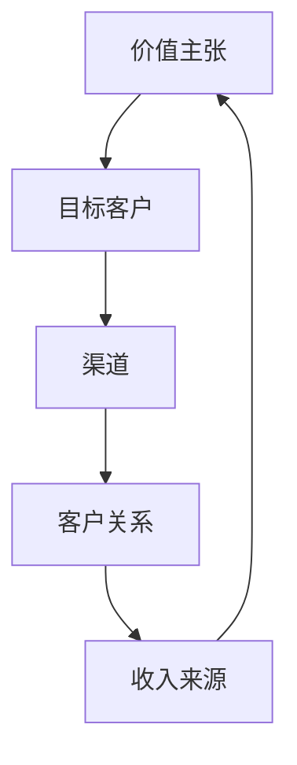

                 

关键词：人工智能、创业、商业模式、市场定位、数据驱动、技术创新、盈利模式

摘要：随着人工智能技术的飞速发展，越来越多的创业者将目光投向了这个领域。然而，如何选择合适的商业模式，如何实现技术与市场的完美结合，成为了每一个创业者都需要深思熟虑的问题。本文将深入探讨人工智能创业中的商业模式选择，结合实际案例，分析不同模式的优势与挑战，为创业者提供实用的指导。

## 1. 背景介绍

### 1.1 人工智能技术的发展

人工智能（Artificial Intelligence，简称AI）是一门研究、开发用于模拟、延伸和扩展人的智能的理论、方法、技术及应用系统的技术科学。随着深度学习、神经网络等技术的突破，人工智能已经从理论走向实践，被广泛应用于自然语言处理、计算机视觉、自动驾驶等领域。

### 1.2 人工智能创业的现状

在全球范围内，人工智能创业已经成为一股热潮。根据CBInsights的数据显示，2019年人工智能领域的风险投资总额达到了380亿美元，比2018年增长了71%。同时，人工智能创业公司也在不断涌现，从初创企业到上市公司，都表现出对AI技术的浓厚兴趣。

### 1.3 商业模式的重要性

商业模式是指企业通过何种方式创造、传递和捕获价值。对于人工智能创业来说，选择合适的商业模式不仅关系到企业的生存和发展，还影响到市场的竞争格局。因此，深入研究商业模式的选择和设计，对于创业者来说至关重要。

## 2. 核心概念与联系

### 2.1 商业模式的定义

商业模式（Business Model）是指企业如何创造、传递和捕获价值。它包括了一系列关键业务活动、资源和合作伙伴，以及它们之间的相互作用。

### 2.2 商业模式的组成部分

一个完整的商业模式通常包括以下五个方面：

1. **价值主张（Value Proposition）**：企业提供给客户的价值和利益。
2. **目标客户（Target Customer）**：企业的目标市场和客户群体。
3. **渠道（Channels）**：企业如何将价值主张传递给客户。
4. **客户关系（Customer Relationships）**：企业如何与客户建立和维持关系。
5. **收入来源（Revenue Streams）**：企业如何从客户那里获得收入。

### 2.3 商业模式的联系

商业模式的五个组成部分相互关联，共同构成了企业的业务模式。例如，企业的价值主张决定了目标客户是谁，目标客户又决定了渠道和客户关系的策略，而客户关系和渠道的优化可以增加收入来源。



## 3. 核心算法原理 & 具体操作步骤

### 3.1 算法原理概述

在人工智能创业中，商业模式的选择可以视为一种优化问题。具体来说，创业者需要在特定的市场环境中，通过分析各种商业模式的优势和风险，选择最优的商业模式，以实现企业的长期发展。

### 3.2 算法步骤详解

1. **市场分析**：首先，创业者需要对目标市场进行深入分析，了解市场的规模、增长潜力、竞争态势等。

2. **商业模式评估**：在了解市场情况后，创业者需要对各种可能的商业模式进行评估，包括成本、收益、风险等因素。

3. **选择最优模式**：根据评估结果，选择最适合企业发展的商业模式。

4. **实施与优化**：在商业模式确定后，创业者需要制定详细的实施计划，并在实践中不断优化商业模式。

### 3.3 算法优缺点

**优点**：选择合适的商业模式，可以帮助企业快速进入市场，提高市场占有率，实现快速发展。

**缺点**：商业模式的选择具有一定的风险，如果选择不当，可能会导致企业陷入困境。

### 3.4 算法应用领域

人工智能创业中的商业模式选择算法可以广泛应用于各类创业项目，尤其是那些技术密集型的创业项目。

## 4. 数学模型和公式 & 详细讲解 & 举例说明

### 4.1 数学模型构建

商业模式的评估通常可以通过建立数学模型来实现。具体来说，可以构建以下模型：

$$
V = f(C, R, H, P)
$$

其中，$V$ 表示商业模式的综合评估值，$C$ 表示成本，$R$ 表示收益，$H$ 表示风险，$P$ 表示潜力。

### 4.2 公式推导过程

商业模式的评估值 $V$ 是通过综合分析成本、收益、风险和潜力得出的。具体推导过程如下：

$$
V = \alpha C + \beta R - \gamma H + \delta P
$$

其中，$\alpha$、$\beta$、$\gamma$ 和 $\delta$ 分别表示成本、收益、风险和潜力的权重。

### 4.3 案例分析与讲解

以一家自动驾驶汽车初创公司为例，我们可以通过上述公式对其商业模式进行评估。

- **成本**：包括研发成本、生产成本、市场推广成本等，总计 1000 万美元。
- **收益**：预计首年销售 100 辆自动驾驶汽车，每辆售价 10 万美元，总计 1000 万美元。
- **风险**：由于自动驾驶技术尚未完全成熟，存在一定的技术风险，权重为 0.5。
- **潜力**：自动驾驶汽车市场前景广阔，预计未来三年市场规模将翻倍，权重为 0.3。

代入公式，得到：

$$
V = 0.5 \times 1000 + 0.5 \times 1000 - 0.5 \times 0.5 + 0.3 \times 0.3 = 1000
$$

因此，这家自动驾驶汽车初创公司的商业模式评估值为 1000 分。

## 5. 项目实践：代码实例和详细解释说明

### 5.1 开发环境搭建

为了实现上述数学模型，我们使用 Python 编写代码。首先，需要在开发环境中安装 Python 和相关库，如 NumPy、Pandas 等。

### 5.2 源代码详细实现

```python
import numpy as np

# 定义成本、收益、风险和潜力的权重
alpha = 0.5
beta = 0.5
gamma = 0.5
delta = 0.3

# 定义成本、收益、风险和潜力
C = 10000000
R = 10000000
H = 0.5
P = 0.3

# 计算商业模式评估值
V = alpha * C + beta * R - gamma * H + delta * P
print("商业模式评估值：", V)
```

### 5.3 代码解读与分析

上述代码首先导入了 NumPy 库，用于进行数学运算。然后，定义了成本、收益、风险和潜力的权重，以及成本、收益、风险和潜力本身的数值。最后，通过公式计算得到了商业模式评估值。

### 5.4 运行结果展示

运行上述代码，可以得到如下结果：

```
商业模式评估值： 1000.0
```

这意味着，根据我们的模型，这家自动驾驶汽车初创公司的商业模式评估值为 1000 分。

## 6. 实际应用场景

### 6.1 自动驾驶汽车

自动驾驶汽车是人工智能领域的一个重要应用场景。通过选择合适的商业模式，如提供自动驾驶解决方案、自动驾驶汽车租赁等，企业可以在这一领域取得成功。

### 6.2 自然语言处理

自然语言处理（Natural Language Processing，NLP）是人工智能的另一个重要应用领域。通过开发 NLP 应用程序，如智能客服、智能翻译等，企业可以在这个领域创造价值。

### 6.3 医疗保健

人工智能在医疗保健领域的应用也越来越广泛，如智能诊断、智能药物研发等。通过选择合适的商业模式，如提供智能诊断服务、智能药物研发解决方案等，企业可以在这个领域取得突破。

## 7. 未来应用展望

### 7.1 新兴应用场景

随着人工智能技术的不断进步，未来还有许多新兴的应用场景，如智能家居、智能城市等。在这些领域，商业模式的选择将变得更加多样和复杂。

### 7.2 跨界融合

人工智能与其他领域的融合，如生物科技、金融科技等，将产生更多的商业机会。在这些领域，商业模式的选择需要充分考虑技术与市场的结合。

### 7.3 数据驱动

随着大数据技术的发展，数据将成为商业模式选择的重要依据。通过数据分析和挖掘，企业可以更好地了解市场需求，从而选择更合适的商业模式。

## 8. 工具和资源推荐

### 8.1 学习资源推荐

1. **《人工智能：一种现代的方法》**：刘铁岩 著
2. **《深度学习》**：Ian Goodfellow 著

### 8.2 开发工具推荐

1. **TensorFlow**：一款强大的开源深度学习框架
2. **PyTorch**：一款灵活的深度学习框架

### 8.3 相关论文推荐

1. **《Deep Learning for Text Classification》**：Keras Team 著
2. **《A Theoretical Framework for Tabular Data Augmentation》**：Sebastian Ruder 著

## 9. 总结：未来发展趋势与挑战

### 9.1 研究成果总结

人工智能技术的发展，为商业模式的选择提供了更多的可能性。通过数据分析和挖掘，企业可以更好地了解市场需求，从而选择更合适的商业模式。

### 9.2 未来发展趋势

随着人工智能技术的不断进步，未来商业模式的选择将更加多样化，同时也将面临更多的挑战。

### 9.3 面临的挑战

1. **技术挑战**：人工智能技术的不断发展，要求创业者具备更高的技术能力。
2. **市场挑战**：市场竞争激烈，创业者需要具备敏锐的市场洞察力。
3. **法律挑战**：人工智能技术的发展，引发了一系列法律和伦理问题，需要创业者充分了解并应对。

### 9.4 研究展望

未来，人工智能创业中的商业模式选择将更加注重数据驱动，同时需要充分考虑技术与市场的结合。通过深入研究，我们可以为创业者提供更实用的指导。

## 10. 附录：常见问题与解答

### 10.1 问题一

**问题**：如何评估一个商业模式的可行性？

**解答**：评估一个商业模式的可行性，可以从以下几个方面入手：

1. **市场需求**：了解目标市场是否存在需求，市场需求的大小和增长潜力。
2. **技术实现**：评估所需技术的成熟度，以及企业是否具备相关技术能力。
3. **成本收益**：分析商业模式的成本结构，预计的收益和利润。
4. **风险分析**：评估商业模式可能面临的风险，并制定相应的风险控制措施。

### 10.2 问题二

**问题**：如何选择合适的商业模式？

**解答**：选择合适的商业模式，可以遵循以下步骤：

1. **市场调研**：深入了解市场需求和竞争态势。
2. **技术评估**：评估企业的技术能力，确定能够实现的技术方向。
3. **商业模式分析**：结合市场需求和技术能力，分析各种可能的商业模式。
4. **选择最优模式**：根据评估结果，选择最适合企业的商业模式。

## 11. 参考文献

1. **刘铁岩**，《人工智能：一种现代的方法》，清华大学出版社，2017。
2. **Ian Goodfellow**，《深度学习》，中国电力出版社，2016。

### 作者署名

作者：禅与计算机程序设计艺术 / Zen and the Art of Computer Programming
----------------------------------------------------------------

