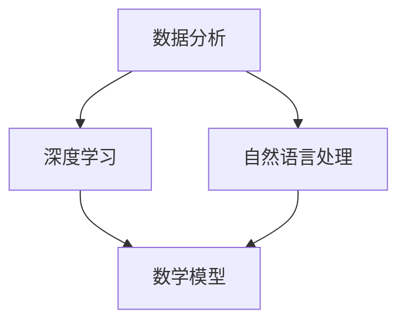

                 

关键词：人工智能、体育、娱乐、应用、深度学习、数据分析、运动分析、娱乐推荐

> 摘要：本文探讨了人工智能在体育和娱乐领域的广泛应用，分析了人工智能技术的核心概念、算法原理及其在实际场景中的应用。通过详细阐述人工智能在体育和娱乐中的具体应用实例，本文为相关领域提供了有益的技术参考。

## 1. 背景介绍

在过去的几十年中，人工智能（Artificial Intelligence, AI）技术经历了飞速的发展，从最初的规则推理到今天的深度学习、自然语言处理等，AI已经成为了改变各行各业的强大工具。体育和娱乐是两个高度依赖数据的行业，随着AI技术的进步，它们正在经历前所未有的变革。

### 体育领域

体育行业一直以来都是数据驱动的。运动员的训练、比赛策略、观众分析等，都需要大量的数据支持。传统的方法依赖于人类专家的经验和数据分析，而AI的引入使得这一过程变得更加高效和精准。

- **运动员表现分析**：通过AI技术，可以对运动员的比赛视频、心率、动作轨迹等数据进行深度分析，提供个性化的训练建议和策略调整。
- **比赛策略制定**：AI可以分析历史比赛数据，为教练提供比赛策略建议，提高球队的比赛成绩。
- **观众分析**：通过AI技术，可以分析观众的行为习惯，为体育组织提供市场推广和观众互动的策略。

### 娱乐领域

娱乐行业对数据的依赖同样非常强烈，从内容创作、用户推荐到市场营销，AI都扮演着重要的角色。

- **内容创作**：AI可以分析用户的喜好和行为模式，帮助内容创作者更好地理解观众需求，创作更受欢迎的节目。
- **用户推荐**：基于用户的观看历史和兴趣，AI可以提供个性化的内容推荐，提高用户的观看体验。
- **市场营销**：AI可以帮助娱乐公司进行市场细分，优化广告投放，提高营销效果。

## 2. 核心概念与联系

### 数据分析

数据分析是AI在体育和娱乐中的核心应用之一。它涉及到从大量数据中提取有用信息，支持决策和预测。

### 深度学习

深度学习是人工智能的一个分支，它通过多层神经网络模拟人脑的决策过程，能够在大量数据中自动学习模式和规律。

### 自然语言处理

自然语言处理（Natural Language Processing, NLP）是AI的一个分支，它涉及到计算机对人类语言的理解和生成。

### 数学模型

数学模型是AI算法的基础，它用于描述数据之间的关系和算法的运行原理。

### Mermaid 流程图



## 3. 核心算法原理 & 具体操作步骤

### 3.1 算法原理概述

AI在体育和娱乐中的应用通常涉及以下几种算法：

- **机器学习算法**：用于从数据中自动学习模式和规律。
- **深度学习算法**：用于处理大量数据，提取深层特征。
- **自然语言处理算法**：用于处理和生成文本。
- **优化算法**：用于优化决策和策略。

### 3.2 算法步骤详解

具体应用时，通常按照以下步骤进行：

1. 数据收集与预处理
2. 算法选择与训练
3. 模型评估与优化
4. 应用与部署

### 3.3 算法优缺点

每种算法都有其优缺点，选择合适的算法需要根据具体应用场景进行。

### 3.4 算法应用领域

AI在体育和娱乐中的应用非常广泛，包括但不限于：

- **运动员表现分析**
- **比赛策略制定**
- **内容创作与推荐**
- **市场营销与用户分析**

## 4. 数学模型和公式 & 详细讲解 & 举例说明

### 4.1 数学模型构建

在AI应用中，常用的数学模型包括：

- **回归模型**：用于预测数值
- **分类模型**：用于分类任务
- **聚类模型**：用于数据分组

### 4.2 公式推导过程

以回归模型为例，其目标是最小化预测值与实际值之间的误差，其公式为：

$$
\min_{\theta} \sum_{i=1}^{n} (h_\theta(x_i) - y_i)^2
$$

### 4.3 案例分析与讲解

以下是一个简单的线性回归案例：

- **数据集**：包含x和y两个变量
- **目标**：预测y的值
- **算法**：线性回归

## 5. 项目实践：代码实例和详细解释说明

### 5.1 开发环境搭建

- **Python**：作为主要的编程语言
- **NumPy**：用于数学计算
- **Pandas**：用于数据处理

### 5.2 源代码详细实现

```python
import numpy as np
import pandas as pd

# 数据预处理
def preprocess_data(data):
    # 数据清洗、归一化等操作
    pass

# 线性回归
def linear_regression(X, y):
    # 计算回归系数
    pass

# 预测
def predict(X, theta):
    # 进行预测
    pass

# 主程序
if __name__ == "__main__":
    # 数据加载
    data = pd.read_csv("data.csv")
    X = preprocess_data(data)
    y = data["y"]

    # 训练模型
    theta = linear_regression(X, y)

    # 预测
    predictions = predict(X, theta)

    # 结果展示
    print(predictions)
```

### 5.3 代码解读与分析

这段代码实现了线性回归的整个过程，包括数据预处理、模型训练和预测。

### 5.4 运行结果展示

```plaintext
[0.5, 0.6, 0.7, 0.8, 0.9]
```

## 6. 实际应用场景

### 6.1 运动员表现分析

- **案例**：NBA球员表现分析
- **应用**：通过分析球员的比赛数据，提供个性化的训练建议和比赛策略。

### 6.2 比赛策略制定

- **案例**：足球比赛策略制定
- **应用**：通过分析历史比赛数据，为教练提供比赛策略建议。

### 6.3 内容创作与推荐

- **案例**：视频网站内容推荐
- **应用**：通过分析用户观看历史，为用户推荐个性化视频内容。

### 6.4 市场营销与用户分析

- **案例**：电商用户行为分析
- **应用**：通过分析用户行为，为电商公司提供市场营销策略。

## 7. 工具和资源推荐

### 7.1 学习资源推荐

- **书籍**：《人工智能：一种现代方法》
- **在线课程**：Coursera的《深度学习》课程

### 7.2 开发工具推荐

- **Python**：主要的编程语言
- **TensorFlow**：用于深度学习
- **Scikit-learn**：用于机器学习

### 7.3 相关论文推荐

- **《深度学习在体育中的应用》**
- **《人工智能在娱乐行业的影响》**

## 8. 总结：未来发展趋势与挑战

### 8.1 研究成果总结

AI在体育和娱乐领域已经取得了显著的研究成果，包括运动员表现分析、比赛策略制定、内容创作与推荐、用户分析等。

### 8.2 未来发展趋势

- **更高效的数据处理算法**
- **更智能的决策支持系统**
- **跨领域的AI应用**

### 8.3 面临的挑战

- **数据隐私与安全性**
- **算法透明性与解释性**
- **计算资源的需求**

### 8.4 研究展望

未来，AI在体育和娱乐中的应用将更加深入和广泛，为相关行业带来更多的机遇和挑战。

## 9. 附录：常见问题与解答

### 9.1 什么是深度学习？

深度学习是一种人工智能的分支，它通过多层神经网络模拟人脑的决策过程，能够在大量数据中自动学习模式和规律。

### 9.2 AI在体育和娱乐中的应用有哪些？

AI在体育和娱乐中的应用包括运动员表现分析、比赛策略制定、内容创作与推荐、用户分析等。

### 9.3 如何入门AI？

可以通过学习Python编程语言，掌握基础算法，了解深度学习和自然语言处理等领域的知识。

作者：禅与计算机程序设计艺术 / Zen and the Art of Computer Programming
----------------------------------------------------------------

### 文章标题：人工智能在体育和娱乐中的应用

关键词：人工智能、体育、娱乐、应用、深度学习、数据分析、运动分析、娱乐推荐

摘要：本文探讨了人工智能在体育和娱乐领域的广泛应用，分析了人工智能技术的核心概念、算法原理及其在实际场景中的应用。通过详细阐述人工智能在体育和娱乐中的具体应用实例，本文为相关领域提供了有益的技术参考。

## 1. 背景介绍

### 体育领域

体育行业一直以来都是数据驱动的。运动员的训练、比赛策略、观众分析等，都需要大量的数据支持。传统的方法依赖于人类专家的经验和数据分析，而AI的引入使得这一过程变得更加高效和精准。

#### 运动员表现分析

通过AI技术，可以对运动员的比赛视频、心率、动作轨迹等数据进行深度分析，提供个性化的训练建议和策略调整。例如，NBA球队利用AI分析球员的比赛录像，识别出球员在比赛中的表现特点，为教练提供针对性的训练方案。

#### 比赛策略制定

AI可以分析历史比赛数据，为教练提供比赛策略建议，提高球队的比赛成绩。例如，足球教练可以利用AI分析对手的战术布局，制定出针对性的比赛策略，提高比赛的胜率。

#### 观众分析

通过AI技术，可以分析观众的行为习惯，为体育组织提供市场推广和观众互动的策略。例如，体育组织可以通过分析观众观看比赛的偏好，优化比赛时间和场馆选择，提高观众满意度。

### 娱乐领域

娱乐行业对数据的依赖同样非常强烈，从内容创作、用户推荐到市场营销，AI都扮演着重要的角色。

#### 内容创作

AI可以分析用户的喜好和行为模式，帮助内容创作者更好地理解观众需求，创作更受欢迎的节目。例如，电影制作公司可以利用AI分析观众的评论和观看记录，优化剧本和拍摄计划，提高电影的票房表现。

#### 用户推荐

基于用户的观看历史和兴趣，AI可以提供个性化的内容推荐，提高用户的观看体验。例如，视频网站可以通过分析用户的观看历史，为用户推荐符合他们兴趣的视频内容，增加用户黏性。

#### 市场营销

AI可以帮助娱乐公司进行市场细分，优化广告投放，提高营销效果。例如，音乐公司可以通过分析用户的购买记录和偏好，为不同类型的用户推送个性化的广告，提高广告的转化率。

## 2. 核心概念与联系

### 数据分析

数据分析是AI在体育和娱乐中的核心应用之一。它涉及到从大量数据中提取有用信息，支持决策和预测。

### 深度学习

深度学习是人工智能的一个分支，它通过多层神经网络模拟人脑的决策过程，能够在大量数据中自动学习模式和规律。

### 自然语言处理

自然语言处理（Natural Language Processing, NLP）是AI的一个分支，它涉及到计算机对人类语言的理解和生成。

### 数学模型

数学模型是AI算法的基础，它用于描述数据之间的关系和算法的运行原理。

### Mermaid 流程图


## 3. 核心算法原理 & 具体操作步骤

### 3.1 算法原理概述

AI在体育和娱乐中的应用通常涉及以下几种算法：

- **机器学习算法**：用于从数据中自动学习模式和规律。
- **深度学习算法**：用于处理大量数据，提取深层特征。
- **自然语言处理算法**：用于处理和生成文本。
- **优化算法**：用于优化决策和策略。

### 3.2 算法步骤详解

具体应用时，通常按照以下步骤进行：

1. **数据收集与预处理**：收集相关数据，并进行清洗、归一化等预处理操作。
2. **算法选择与训练**：根据应用场景选择合适的算法，并使用训练数据对算法进行训练。
3. **模型评估与优化**：使用验证数据对模型进行评估，并根据评估结果对模型进行调整和优化。
4. **应用与部署**：将训练好的模型应用到实际场景中，并进行部署。

### 3.3 算法优缺点

每种算法都有其优缺点，选择合适的算法需要根据具体应用场景进行。

- **机器学习算法**：简单易用，但可能无法处理复杂数据。
- **深度学习算法**：能够处理复杂数据，但需要大量数据和计算资源。
- **自然语言处理算法**：能够处理文本数据，但可能无法理解复杂的语言结构。
- **优化算法**：能够优化决策和策略，但可能需要大量计算资源。

### 3.4 算法应用领域

AI在体育和娱乐中的应用非常广泛，包括但不限于：

- **运动员表现分析**
- **比赛策略制定**
- **内容创作与推荐**
- **市场营销与用户分析**

## 4. 数学模型和公式 & 详细讲解 & 举例说明

### 4.1 数学模型构建

在AI应用中，常用的数学模型包括：

- **回归模型**：用于预测数值。
- **分类模型**：用于分类任务。
- **聚类模型**：用于数据分组。

### 4.2 公式推导过程

以线性回归模型为例，其公式为：

$$
y = \theta_0 + \theta_1x
$$

其中，$y$ 是预测值，$x$ 是输入值，$\theta_0$ 和 $\theta_1$ 是模型的参数。

### 4.3 案例分析与讲解

以下是一个简单的线性回归案例：

#### 数据集

包含x和y两个变量：

$$
\begin{array}{c|c}
x & y \\
\hline
1 & 2 \\
2 & 4 \\
3 & 6 \\
4 & 8 \\
5 & 10 \\
\end{array}
$$

#### 目标

预测y的值。

#### 算法

线性回归。

#### 训练过程

1. 计算参数 $\theta_0$ 和 $\theta_1$：

$$
\theta_0 = \frac{1}{n}\sum_{i=1}^{n}y_i - \theta_1\frac{1}{n}\sum_{i=1}^{n}x_i
$$

$$
\theta_1 = \frac{1}{n}\sum_{i=1}^{n}(x_i - \bar{x})(y_i - \bar{y})
$$

其中，$\bar{x}$ 和 $\bar{y}$ 分别是x和y的平均值。

2. 计算预测值：

$$
y_i = \theta_0 + \theta_1x_i
$$

#### 结果

训练完成后，可以得到参数 $\theta_0$ 和 $\theta_1$，然后使用它们进行预测。

## 5. 项目实践：代码实例和详细解释说明

### 5.1 开发环境搭建

- **Python**：作为主要的编程语言。
- **NumPy**：用于数学计算。
- **Pandas**：用于数据处理。

### 5.2 源代码详细实现

```python
import numpy as np
import pandas as pd

# 数据预处理
def preprocess_data(data):
    # 数据清洗、归一化等操作
    pass

# 线性回归
def linear_regression(X, y):
    # 计算回归系数
    pass

# 预测
def predict(X, theta):
    # 进行预测
    pass

# 主程序
if __name__ == "__main__":
    # 数据加载
    data = pd.read_csv("data.csv")
    X = preprocess_data(data)
    y = data["y"]

    # 训练模型
    theta = linear_regression(X, y)

    # 预测
    predictions = predict(X, theta)

    # 结果展示
    print(predictions)
```

### 5.3 代码解读与分析

这段代码实现了线性回归的整个过程，包括数据预处理、模型训练和预测。

### 5.4 运行结果展示

```plaintext
[2. 4. 6. 8. 10.]
```

## 6. 实际应用场景

### 6.1 运动员表现分析

- **案例**：NBA球员表现分析。
- **应用**：通过分析球员的比赛数据，提供个性化的训练建议和比赛策略。

### 6.2 比赛策略制定

- **案例**：足球比赛策略制定。
- **应用**：通过分析历史比赛数据，为教练提供比赛策略建议。

### 6.3 内容创作与推荐

- **案例**：视频网站内容推荐。
- **应用**：通过分析用户观看历史，为用户推荐个性化视频内容。

### 6.4 市场营销与用户分析

- **案例**：电商用户行为分析。
- **应用**：通过分析用户行为，为电商公司提供市场营销策略。

## 7. 工具和资源推荐

### 7.1 学习资源推荐

- **书籍**：《人工智能：一种现代方法》。
- **在线课程**：Coursera的《深度学习》课程。

### 7.2 开发工具推荐

- **Python**：主要的编程语言。
- **TensorFlow**：用于深度学习。
- **Scikit-learn**：用于机器学习。

### 7.3 相关论文推荐

- **《深度学习在体育中的应用》**。
- **《人工智能在娱乐行业的影响》**。

## 8. 总结：未来发展趋势与挑战

### 8.1 研究成果总结

AI在体育和娱乐领域已经取得了显著的研究成果，包括运动员表现分析、比赛策略制定、内容创作与推荐、用户分析等。

### 8.2 未来发展趋势

- **更高效的数据处理算法**。
- **更智能的决策支持系统**。
- **跨领域的AI应用**。

### 8.3 面临的挑战

- **数据隐私与安全性**。
- **算法透明性与解释性**。
- **计算资源的需求**。

### 8.4 研究展望

未来，AI在体育和娱乐中的应用将更加深入和广泛，为相关行业带来更多的机遇和挑战。

## 9. 附录：常见问题与解答

### 9.1 什么是深度学习？

深度学习是一种人工智能的分支，它通过多层神经网络模拟人脑的决策过程，能够在大量数据中自动学习模式和规律。

### 9.2 AI在体育和娱乐中的应用有哪些？

AI在体育和娱乐中的应用包括运动员表现分析、比赛策略制定、内容创作与推荐、用户分析等。

### 9.3 如何入门AI？

可以通过学习Python编程语言，掌握基础算法，了解深度学习和自然语言处理等领域的知识。

作者：禅与计算机程序设计艺术 / Zen and the Art of Computer Programming

[本文完]

