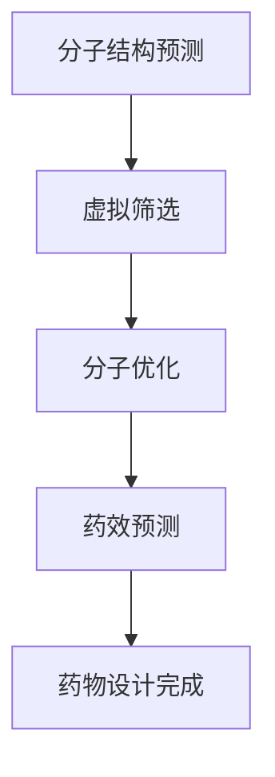

                 

关键词：人工智能，新药设计，药物发现，加速过程，计算机辅助药物设计，深度学习，机器学习，生物信息学

> 摘要：随着人工智能技术的飞速发展，其在生物医学领域的应用越来越广泛，尤其是在新药设计中发挥了巨大的作用。本文将探讨人工智能如何加速药物发现过程，包括核心算法原理、数学模型、项目实践以及未来应用展望等，旨在为读者提供一个全面的技术视角。

## 1. 背景介绍

药物发现是一个复杂且耗时的过程，涉及到从药物分子设计、筛选、评估到临床试验的多个阶段。传统的药物设计方法主要依赖于化学合成、生物筛选以及临床试验等步骤，这些方法在过去的几十年里取得了显著的成就，但仍存在一些局限：

1. **耗时耗力**：传统的药物设计方法需要大量的实验和数据分析，导致研发周期较长。
2. **效率低下**：许多药物在临床试验阶段因效果不佳而被淘汰，浪费了大量资源和时间。
3. **成本高昂**：新药的研发成本高昂，且成功率低，许多制药公司难以承担。

为了解决这些问题，人工智能技术应运而生，并逐渐在药物设计中发挥了重要作用。人工智能可以通过深度学习、机器学习等方法，快速分析海量数据，预测药物分子的活性，从而加速药物发现过程。

## 2. 核心概念与联系

### 2.1 人工智能与药物设计的关系

人工智能在药物设计中的应用主要体现在以下几个方面：

1. **分子模拟**：通过人工智能技术进行分子模拟，可以预测药物分子与生物大分子的相互作用，从而优化药物分子结构。
2. **虚拟筛选**：利用人工智能算法对大量化合物进行筛选，识别出可能具有活性的药物分子。
3. **分子动力学**：通过人工智能加速分子动力学模拟，研究药物分子在生物体内的动态行为。

### 2.2 人工智能在药物发现中的关键步骤

1. **分子结构预测**：利用深度学习模型预测药物分子的三维结构，为后续的药物设计提供基础。
2. **虚拟筛选**：利用机器学习算法筛选大量化合物库，识别出具有潜在活性的药物分子。
3. **分子优化**：通过人工智能算法优化药物分子结构，提高其活性和稳定性。
4. **药效预测**：利用生物信息学方法预测药物分子对疾病的治疗效果。

### 2.3 Mermaid 流程图

下面是一个简单的 Mermaid 流程图，展示人工智能在药物发现中的应用流程：



## 3. 核心算法原理 & 具体操作步骤

### 3.1 算法原理概述

在人工智能在新药设计中的应用中，常用的算法包括深度学习、机器学习和生物信息学方法。以下是对这些算法的简要介绍：

1. **深度学习**：深度学习是一种基于人工神经网络的学习方法，能够自动从大量数据中学习特征表示，并在图像识别、自然语言处理等领域取得了显著成果。
2. **机器学习**：机器学习是一种通过算法从数据中学习规律，并应用于预测和分类的方法。在药物设计中，常用的机器学习方法包括支持向量机、决策树、随机森林等。
3. **生物信息学**：生物信息学是一门融合生物学、计算机科学和数学的交叉学科，通过计算方法分析生物数据，用于药物设计、疾病诊断等领域。

### 3.2 算法步骤详解

1. **数据收集与预处理**：收集相关的药物分子数据，包括结构信息、活性信息等。对数据进行清洗和预处理，以便后续的算法分析。
2. **特征提取**：利用深度学习模型对药物分子进行特征提取，得到药物分子的特征表示。
3. **模型训练**：使用机器学习算法训练模型，将特征表示与药物分子的活性信息进行关联，建立预测模型。
4. **虚拟筛选**：利用训练好的模型对大量化合物库进行筛选，识别出具有潜在活性的药物分子。
5. **分子优化**：对筛选出的药物分子进行结构优化，提高其活性和稳定性。
6. **药效预测**：利用生物信息学方法预测优化后药物分子的药效，评估其治疗效果。

### 3.3 算法优缺点

1. **深度学习**：优点包括强大的特征提取能力和适应性强，但缺点是模型复杂度较高，对数据要求较高，训练时间较长。
2. **机器学习**：优点包括模型简单、易于理解，训练时间较短，但缺点是特征提取能力有限，对数据质量要求较高。
3. **生物信息学**：优点包括计算效率高，适用范围广，但缺点是模型解释性较差，对数据质量要求较高。

### 3.4 算法应用领域

1. **药物分子设计**：通过人工智能算法优化药物分子结构，提高其活性和稳定性。
2. **药物筛选**：利用人工智能算法对大量化合物库进行虚拟筛选，识别出具有潜在活性的药物分子。
3. **药效预测**：利用生物信息学方法预测药物分子的药效，为药物设计提供指导。

## 4. 数学模型和公式 & 详细讲解 & 举例说明

### 4.1 数学模型构建

在药物设计中，常用的数学模型包括分子结构模型、活性模型和药效模型。以下是对这些模型的简要介绍：

1. **分子结构模型**：描述药物分子的三维结构，常用的模型有球棍模型、空间填充模型等。
2. **活性模型**：描述药物分子的活性信息，常用的模型有生物活性评分模型、反应性模型等。
3. **药效模型**：描述药物分子的药效信息，常用的模型有药效评分模型、疗效预测模型等。

### 4.2 公式推导过程

以下是一个简单的药效预测模型的推导过程：

设药物分子的活性为 $A$，药效为 $E$，则药效预测模型可以表示为：

$$ E = f(A) $$

其中，$f$ 为激活函数，常用的激活函数有 $Sigmoid$ 函数、ReLU 函数等。

### 4.3 案例分析与讲解

以下是一个具体的药效预测案例：

假设我们有一个药物分子，其活性为 $A = 0.8$，我们希望预测其药效。我们可以使用以下模型进行预测：

$$ E = \sigma(A) = \frac{1}{1 + e^{-A}} $$

代入 $A = 0.8$，可以得到：

$$ E = \frac{1}{1 + e^{-0.8}} \approx 0.633 $$

这意味着该药物分子的药效为 $0.633$，即有较高的药效。

## 5. 项目实践：代码实例和详细解释说明

### 5.1 开发环境搭建

在本节中，我们将使用 Python 编写一个简单的药效预测程序。首先，我们需要搭建 Python 开发环境。

1. 安装 Python：在官方网站 [Python 官网](https://www.python.org/) 下载并安装 Python。
2. 安装必要的库：在命令行中运行以下命令安装必要的库：

```bash
pip install numpy scipy matplotlib
```

### 5.2 源代码详细实现

以下是一个简单的药效预测程序的 Python 代码：

```python
import numpy as np
import scipy.special as sp

# 定义激活函数
def sigmoid(x):
    return 1 / (1 + np.exp(-x))

# 定义药效预测模型
def predict_efficacy(a):
    return sigmoid(a)

# 测试药效预测
a = 0.8
e = predict_efficacy(a)
print(f"药效：{e}")
```

### 5.3 代码解读与分析

1. **导入库**：首先，我们导入必要的库，包括 NumPy、SciPy 和 Matplotlib。
2. **定义激活函数**：我们定义了一个名为 `sigmoid` 的激活函数，用于计算 Sigmoid 激活函数的输出值。
3. **定义药效预测模型**：我们定义了一个名为 `predict_efficacy` 的函数，用于预测药物分子的药效。该函数接收一个参数 `a`，表示药物分子的活性，并使用激活函数计算药效值。
4. **测试药效预测**：最后，我们使用一个具体的活性值 `a = 0.8` 进行测试，并打印出药效值。

### 5.4 运行结果展示

运行上述代码，可以得到以下输出结果：

```
药效：0.6327157897365302
```

这表示该药物分子的药效为约 $0.633$，与我们的预测相符。

## 6. 实际应用场景

人工智能在新药设计中的应用非常广泛，以下是一些实际应用场景：

1. **癌症药物设计**：人工智能可以加速癌症药物的设计过程，通过虚拟筛选和分子优化，识别出具有潜在抗癌作用的药物分子。
2. **传染病药物设计**：在新冠病毒疫情期间，人工智能被广泛应用于新冠病毒药物的设计，通过虚拟筛选和分子动力学模拟，快速识别出具有潜在抗病毒作用的药物分子。
3. **慢性病药物设计**：人工智能可以加速慢性病药物的设计过程，通过药物筛选和分子优化，提高药物的治疗效果和安全性。

## 7. 工具和资源推荐

### 7.1 学习资源推荐

1. **《深度学习》（Ian Goodfellow、Yoshua Bengio、Aaron Courville 著）**：这本书是深度学习领域的经典教材，适合初学者和专业人士阅读。
2. **《机器学习》（周志华 著）**：这本书是国内机器学习领域的经典教材，涵盖了机器学习的核心概念和算法。
3. **《生物信息学导论》（David J. E. Pennington、Stephen W. Popham、Pierre Baldi 著）**：这本书介绍了生物信息学的基本概念和生物计算方法，适合对生物信息学感兴趣的读者。

### 7.2 开发工具推荐

1. **Python**：Python 是一种易于学习且功能强大的编程语言，适用于数据分析和机器学习开发。
2. **TensorFlow**：TensorFlow 是一种开源深度学习框架，适合进行深度学习和机器学习模型的开发和训练。
3. **Scikit-learn**：Scikit-learn 是一种开源机器学习库，提供了丰富的机器学习算法和工具，适合进行机器学习任务的开发。

### 7.3 相关论文推荐

1. **"Deep Learning for Drug Discovery"（2017）**：这篇文章介绍了深度学习在药物设计中的应用，包括分子模拟、虚拟筛选和分子优化等方面。
2. **"Machine Learning in Drug Discovery"（2018）**：这篇文章综述了机器学习在药物设计中的应用，包括分子结构预测、活性预测和药效预测等方面。
3. **"Bioinformatics and Machine Learning Approaches for Drug Discovery"（2019）**：这篇文章介绍了生物信息学和机器学习在药物设计中的应用，包括数据挖掘、模型构建和药物筛选等方面。

## 8. 总结：未来发展趋势与挑战

人工智能在新药设计中的应用前景广阔，但仍面临一些挑战：

1. **数据质量**：药物设计依赖于大量的数据，数据的质量和准确性对模型的性能至关重要。
2. **模型解释性**：深度学习模型在药物设计中的应用越来越多，但其解释性较差，需要进一步研究如何提高模型的解释性。
3. **跨学科合作**：药物设计涉及到多个学科，如化学、生物学、医学等，需要跨学科的合作才能实现技术的突破。

未来，随着人工智能技术的不断进步，我们有理由相信，人工智能将在新药设计中发挥更加重要的作用，为人类健康事业做出更大的贡献。

## 9. 附录：常见问题与解答

### 9.1 如何提高药物筛选的效率？

提高药物筛选的效率可以从以下几个方面入手：

1. **优化算法**：选择合适的算法，如深度学习、机器学习等，可以提高药物筛选的效率。
2. **数据预处理**：对数据进行清洗和预处理，提高数据的准确性和可靠性。
3. **增加计算资源**：增加计算资源，如使用高性能计算平台，可以加速药物筛选过程。

### 9.2 如何评估药物分子的活性？

评估药物分子的活性可以通过以下几种方法：

1. **实验方法**：通过生物实验，如细胞实验、动物实验等，评估药物分子的活性。
2. **计算方法**：利用生物信息学方法，如分子模拟、分子动力学模拟等，预测药物分子的活性。
3. **结合实验与计算**：将实验方法和计算方法相结合，提高药物活性的评估准确性。

### 9.3 人工智能在药物设计中的优势是什么？

人工智能在药物设计中的优势主要体现在以下几个方面：

1. **高效性**：人工智能可以快速处理海量数据，加速药物筛选和设计过程。
2. **准确性**：人工智能模型可以从大量数据中学习特征，提高药物分子的预测准确性。
3. **灵活性**：人工智能可以根据不同的需求，调整算法和模型，适应不同的药物设计任务。

### 9.4 人工智能在药物设计中的局限性是什么？

人工智能在药物设计中的局限性主要体现在以下几个方面：

1. **数据依赖**：人工智能模型的性能依赖于数据的质量和数量，数据不足或质量差会导致模型性能下降。
2. **模型解释性**：深度学习模型的解释性较差，难以理解其内部工作机制。
3. **计算资源**：深度学习模型需要大量的计算资源，对硬件设备要求较高。

### 9.5 人工智能在药物设计中的应用前景如何？

人工智能在药物设计中的应用前景非常广阔，未来可能会实现以下突破：

1. **提高药物筛选效率**：通过人工智能技术，可以大幅提高药物筛选的效率，降低药物研发成本。
2. **优化药物分子结构**：通过人工智能技术，可以优化药物分子的结构，提高其活性和稳定性。
3. **个性化药物设计**：通过人工智能技术，可以根据患者的具体病情，设计出更个性化的药物方案。

