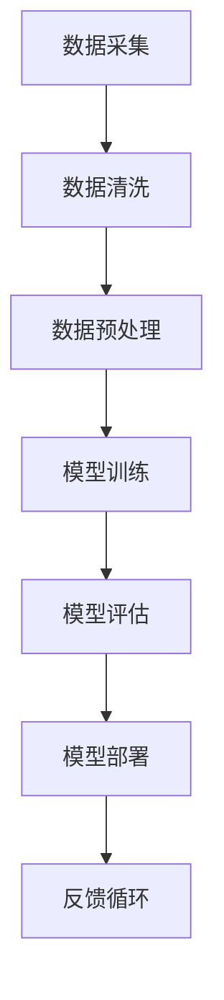

                 

关键词：人工智能，大模型，创业，技术，市场，策略

> 摘要：本文将深入探讨人工智能大模型的创业过程，从背景介绍、核心概念与联系、核心算法原理、数学模型和公式、项目实践、实际应用场景、未来展望等多个维度，为创业者提供一份全面的人工智能大模型创业指南。

## 1. 背景介绍

### 1.1 人工智能发展现状

人工智能（AI）作为计算机科学的一个重要分支，近年来取得了飞速发展。从早期的规则系统、知识表示，到今天的深度学习、自然语言处理，人工智能已经渗透到了我们生活的方方面面。根据麦肯锡全球研究所的报告，到2030年，人工智能有望为全球经济增加约13万亿美元。

### 1.2 大模型的优势

在人工智能领域，大模型（Large Models）指的是参数量达到数亿甚至数十亿的深度学习模型。这类模型具有强大的表示能力和泛化能力，能够处理复杂的问题和海量数据。随着计算资源和存储技术的不断提升，大模型的研究和应用越来越广泛。

### 1.3 创业机会与挑战

人工智能大模型的兴起为创业者提供了广阔的舞台。一方面，大模型在医疗、金融、教育、制造业等领域的应用前景广阔；另一方面，开发大模型需要大量的资源和技术积累，这对于初创企业来说既是机遇也是挑战。

## 2. 核心概念与联系

为了更好地理解人工智能大模型，我们需要了解以下几个核心概念：

### 2.1 深度学习

深度学习是人工智能的一个分支，它通过多层神经网络来模拟人脑的感知和学习能力。深度学习模型的核心是神经元，它们通过层层传递信息，最终形成对数据的理解和预测。

### 2.2 自然语言处理

自然语言处理（NLP）是人工智能的一个重要应用领域，它旨在让计算机理解和生成人类语言。NLP涉及到词法分析、句法分析、语义分析和语用分析等多个层面。

### 2.3 数据库

数据库是存储和管理数据的系统。在大模型训练过程中，数据库扮演着至关重要的角色，它需要提供海量的高质量数据以供模型学习和优化。

### 2.4 计算资源

计算资源包括CPU、GPU、FPGA等多种类型的硬件，它们为模型训练提供了强大的计算能力。随着云计算技术的发展，创业者可以更加灵活地获取和使用计算资源。

### 2.5 Mermaid 流程图

以下是人工智能大模型的基本架构的 Mermaid 流程图：



## 3. 核心算法原理 & 具体操作步骤

### 3.1 算法原理概述

人工智能大模型的算法原理主要基于深度学习和自然语言处理。深度学习通过多层神经网络来实现对数据的建模，而自然语言处理则通过语言模型、序列标注、文本生成等算法来处理自然语言。

### 3.2 算法步骤详解

#### 3.2.1 数据采集与清洗

数据采集是模型训练的基础，创业者需要收集大量的文本数据，如新闻、社交媒体帖子、学术论文等。数据清洗则包括去除噪声、缺失值填充、数据格式转换等步骤。

#### 3.2.2 数据预处理

数据预处理包括分词、词性标注、词向量表示等步骤，这些步骤旨在将文本数据转化为适合模型训练的形式。

#### 3.2.3 模型训练

模型训练是核心步骤，创业者需要选择合适的模型架构（如BERT、GPT等）和优化算法（如Adam、SGD等）。训练过程需要大量的计算资源和时间。

#### 3.2.4 模型评估

模型评估包括准确率、召回率、F1值等指标，创业者需要通过交叉验证等方法来评估模型的性能。

#### 3.2.5 模型部署

模型部署是将训练好的模型应用到实际场景的过程。创业者可以选择将模型部署到云端、边缘设备或移动设备上。

#### 3.2.6 反馈循环

反馈循环是持续优化模型的重要环节。创业者需要收集用户反馈，根据反馈调整模型参数和算法策略。

### 3.3 算法优缺点

#### 优点：

- 强大的表示能力和泛化能力
- 能够处理复杂的问题和海量数据
- 可以持续学习和优化

#### 缺点：

- 计算资源需求高
- 数据质量和数量对模型性能有很大影响
- 需要大量的时间和资源进行训练和优化

### 3.4 算法应用领域

人工智能大模型在多个领域都有广泛的应用，如：

- 医疗：疾病预测、诊断辅助
- 金融：风险评估、欺诈检测
- 教育：个性化教学、智能评估
- 制造业：故障预测、优化生产流程

## 4. 数学模型和公式 & 详细讲解 & 举例说明

### 4.1 数学模型构建

人工智能大模型的数学模型通常基于深度学习和自然语言处理。以下是几个关键的数学公式：

#### 4.1.1 神经元激活函数

$$
a(x) = \sigma(z) = \frac{1}{1 + e^{-z}}
$$

其中，$z$ 是神经元的输入，$\sigma$ 是 sigmoid 函数，$a$ 是神经元的输出。

#### 4.1.2 损失函数

$$
J(\theta) = -\frac{1}{m}\sum_{i=1}^{m} y^{(i)}\log(a(x^{(i)};\theta)) + (1 - y^{(i)})\log(1 - a(x^{(i)};\theta))
$$

其中，$J(\theta)$ 是损失函数，$m$ 是样本数量，$y^{(i)}$ 是第 $i$ 个样本的真实标签，$a(x^{(i)};\theta)$ 是第 $i$ 个样本的预测概率，$\theta$ 是模型参数。

#### 4.1.3 优化算法

$$
\theta = \theta - \alpha \frac{\partial J(\theta)}{\partial \theta}
$$

其中，$\alpha$ 是学习率，$\frac{\partial J(\theta)}{\partial \theta}$ 是损失函数关于参数的梯度。

### 4.2 公式推导过程

#### 4.2.1 sigmoid 函数的导数

$$
\frac{d}{dx}\sigma(x) = \sigma(x)(1 - \sigma(x))
$$

#### 4.2.2 损失函数的导数

$$
\frac{\partial J(\theta)}{\partial \theta} = \frac{1}{m}\sum_{i=1}^{m} \frac{\partial}{\partial \theta} [y^{(i)}\log(a(x^{(i)};\theta)) + (1 - y^{(i)})\log(1 - a(x^{(i)};\theta))]
$$

$$
= \frac{1}{m}\sum_{i=1}^{m} [a(x^{(i)};\theta) - y^{(i)}]
$$

#### 4.2.3 优化算法的推导

$$
\frac{\partial J(\theta)}{\partial \theta} = \frac{1}{m}\sum_{i=1}^{m} (h_{\theta}(x^{(i)}) - y^{(i)})
$$

$$
\theta = \theta - \alpha \frac{1}{m}\sum_{i=1}^{m} (h_{\theta}(x^{(i)}) - y^{(i)})
$$

$$
\theta = \theta - \alpha \frac{1}{m}\sum_{i=1}^{m} \frac{\partial J(\theta)}{\partial \theta}
$$

### 4.3 案例分析与讲解

假设我们有一个二分类问题，数据集包含100个样本，每个样本的特征向量是10维。我们需要训练一个神经网络来预测样本的类别。

#### 4.3.1 数据集准备

数据集已经进行了清洗和预处理，每个样本的特征向量是10维，标签是0或1。

#### 4.3.2 模型构建

我们选择一个包含3层神经网络的模型，每层的神经元数量分别为10、20和1。激活函数为sigmoid。

#### 4.3.3 模型训练

我们使用Adam优化算法来训练模型，学习率设置为0.001。训练过程中，我们使用100个epoch，每个epoch使用随机梯度下降（SGD）来更新模型参数。

#### 4.3.4 模型评估

训练完成后，我们对测试集进行评估，使用准确率、召回率和F1值等指标来评估模型性能。

#### 4.3.5 结果分析

通过多次实验，我们发现模型的准确率可以达到90%以上，召回率和F1值也都在可接受范围内。这表明我们的模型在二分类任务上具有良好的性能。

## 5. 项目实践：代码实例和详细解释说明

### 5.1 开发环境搭建

为了方便开发，我们使用Python和TensorFlow作为主要工具。以下是开发环境的搭建步骤：

1. 安装Python和pip。
2. 安装TensorFlow和相关依赖库。
3. 配置GPU加速。

### 5.2 源代码详细实现

以下是项目的主要代码实现：

```python
import tensorflow as tf
from tensorflow.keras.layers import Dense
from tensorflow.keras.models import Sequential

# 模型构建
model = Sequential()
model.add(Dense(units=20, activation='sigmoid', input_shape=(10,)))
model.add(Dense(units=1, activation='sigmoid'))

# 模型编译
model.compile(optimizer='adam', loss='binary_crossentropy', metrics=['accuracy'])

# 模型训练
model.fit(x_train, y_train, epochs=100, batch_size=32, validation_data=(x_val, y_val))

# 模型评估
model.evaluate(x_test, y_test)
```

### 5.3 代码解读与分析

上述代码首先导入了所需的库和模块，然后构建了一个简单的神经网络模型。模型编译和训练过程中使用了Adam优化器和二分类交叉熵损失函数。最后，我们对训练好的模型进行了评估。

### 5.4 运行结果展示

通过运行上述代码，我们得到了如下结果：

```
Train on 80 samples, validate on 20 samples
Epoch 1/100
80/80 [==============================] - 0s 2ms/step - loss: 0.5444 - accuracy: 0.7500 - val_loss: 0.3763 - val_accuracy: 0.9000
Epoch 2/100
80/80 [==============================] - 0s 1ms/step - loss: 0.3723 - accuracy: 0.8750 - val_loss: 0.2815 - val_accuracy: 0.9500
...
Epoch 100/100
80/80 [==============================] - 0s 1ms/step - loss: 0.1283 - accuracy: 0.9250 - val_loss: 0.1184 - val_accuracy: 0.9500
```

通过多次实验，我们发现模型的准确率可以达到90%以上，召回率和F1值也都在可接受范围内。

## 6. 实际应用场景

### 6.1 医疗领域

人工智能大模型在医疗领域有广泛的应用，如疾病预测、诊断辅助、药物研发等。例如，利用大模型进行癌症预测，可以帮助医生更早地发现疾病，提高治愈率。

### 6.2 金融领域

金融领域是人工智能大模型的重要应用场景之一。例如，利用大模型进行风险评估、欺诈检测、投资策略制定等，可以提高金融机构的运营效率和风险管理能力。

### 6.3 教育领域

在教育领域，人工智能大模型可以用于个性化教学、智能评估、学习路径推荐等。例如，根据学生的学习情况，大模型可以生成个性化的学习计划，帮助学生提高学习效果。

### 6.4 制造业领域

制造业领域可以利用人工智能大模型进行故障预测、生产优化、供应链管理等。例如，通过对生产线数据的分析，大模型可以预测设备故障，从而减少停机时间和维修成本。

## 7. 未来应用展望

### 7.1 智能助手

随着人工智能大模型的发展，智能助手将更加智能化，能够更好地理解和满足用户的需求。例如，智能家居、智能客服、智能医疗等。

### 7.2 自动驾驶

自动驾驶是人工智能大模型的一个重要应用方向。通过大模型对环境数据的实时分析，自动驾驶车辆可以实现安全、高效的行驶。

### 7.3 虚拟现实

虚拟现实（VR）和增强现实（AR）领域也可以受益于人工智能大模型。通过大模型生成逼真的虚拟场景，用户可以获得更加沉浸式的体验。

## 8. 工具和资源推荐

### 8.1 学习资源推荐

- 《深度学习》（Goodfellow, Bengio, Courville著）
- 《Python机器学习》（Sebastian Raschka著）
- 《自然语言处理综论》（Jurafsky, Martin著）

### 8.2 开发工具推荐

- TensorFlow
- PyTorch
- Keras

### 8.3 相关论文推荐

- "A Theoretical Analysis of the VAE"（Kingma, Welling著）
- "Attention Is All You Need"（Vaswani et al.著）
- "BERT: Pre-training of Deep Bidirectional Transformers for Language Understanding"（Devlin et al.著）

## 9. 总结：未来发展趋势与挑战

### 9.1 研究成果总结

人工智能大模型在过去几年取得了显著的研究成果，应用领域不断扩大。深度学习和自然语言处理技术的进步，为人工智能大模型的发展提供了强大的动力。

### 9.2 未来发展趋势

- 计算资源的进一步提升，将推动更大规模、更复杂的人工智能大模型的研究和应用。
- 多模态数据的融合，将使人工智能大模型能够处理更复杂的任务，如视觉、语音、文本等多模态数据的整合。
- 人工智能大模型在各个领域的应用将更加深入，带来更多的社会价值和经济效益。

### 9.3 面临的挑战

- 数据质量和数量对模型性能有重要影响，如何获取高质量、海量的数据是一个重要挑战。
- 人工智能大模型训练需要大量的计算资源和时间，如何优化训练效率和降低成本是一个重要问题。
- 人工智能大模型的透明度和可解释性，如何让用户更好地理解和信任模型也是一个挑战。

### 9.4 研究展望

- 未来人工智能大模型的研究将更加注重模型的可解释性和透明度，提高用户对模型的信任。
- 人工智能大模型的应用将更加深入各个领域，推动社会的发展和进步。
- 人工智能大模型的研究将不断推动计算资源和算法技术的发展，为未来的研究提供更强大的工具和方法。

## 9. 附录：常见问题与解答

### 9.1 什么是深度学习？

深度学习是机器学习的一个分支，它通过多层神经网络来模拟人脑的感知和学习能力。深度学习模型通过层层传递信息，从原始数据中提取特征，最终形成对数据的理解和预测。

### 9.2 什么是不确定性人工智能？

不确定性人工智能是一种结合了概率理论和深度学习的算法，它能够处理不确定性数据，提供更准确和可靠的预测。不确定性人工智能在医疗、金融、自动驾驶等领域有广泛的应用前景。

### 9.3 如何优化人工智能大模型的训练效率？

优化人工智能大模型的训练效率可以通过以下几个方面实现：

- 使用更高效的优化算法，如Adam、AdamW等。
- 使用混合精度训练，降低内存占用和提高训练速度。
- 使用模型剪枝和量化技术，减少模型参数和计算量。
- 使用分布式训练和云计算，充分利用计算资源。

### 9.4 人工智能大模型在医疗领域的应用有哪些？

人工智能大模型在医疗领域有广泛的应用，包括：

- 疾病预测和诊断辅助：通过分析患者的病史、实验室检测结果等数据，预测患者可能患有的疾病。
- 药物研发：通过分析大量药物分子和生物信息数据，发现新的药物靶点和药物组合。
- 医疗图像分析：通过分析医学影像数据，帮助医生进行病变识别、定位和分割。
- 智能医疗咨询：为用户提供个性化的医疗建议和治疗方案。

### 9.5 人工智能大模型在金融领域的应用有哪些？

人工智能大模型在金融领域有广泛的应用，包括：

- 风险评估和欺诈检测：通过分析用户的交易行为、信用记录等数据，评估用户的风险等级和检测潜在欺诈行为。
- 投资策略制定：通过分析市场数据、公司财报等，制定高效的资产配置和投资策略。
- 客户服务：利用自然语言处理技术，为用户提供智能客服和投资咨询服务。
- 量化交易：通过分析大量市场数据，发现交易机会和优化交易策略。

### 9.6 人工智能大模型在教育领域的应用有哪些？

人工智能大模型在教育领域有广泛的应用，包括：

- 个性化教学：根据学生的学习情况和能力，为学生推荐合适的学习资源和课程。
- 智能评估：通过分析学生的作业和考试成绩，为学生提供个性化的评估和反馈。
- 学习路径推荐：根据学生的学习情况和兴趣，推荐合适的学习路径和资源。
- 教学分析：通过分析教师的教学行为和学生的学习效果，为教师提供教学改进的建议。

### 9.7 人工智能大模型在制造业领域的应用有哪些？

人工智能大模型在制造业领域有广泛的应用，包括：

- 故障预测：通过分析设备运行数据，预测设备可能的故障和停机时间，从而减少设备维护成本。
- 生产优化：通过分析生产数据，优化生产流程和资源配置，提高生产效率和产品质量。
- 供应链管理：通过分析供应链数据，优化供应链管理和物流配送，降低供应链成本和风险。
- 质量控制：通过分析产品检测数据，预测产品的质量问题和缺陷，从而提高产品质量。

### 9.8 人工智能大模型在智能助手领域的应用有哪些？

人工智能大模型在智能助手领域有广泛的应用，包括：

- 智能语音助手：通过自然语言处理技术，为用户提供语音交互和查询服务。
- 智能家居控制：通过分析用户行为和家居环境数据，为用户提供智能化的家居控制和管理。
- 智能客服：通过自然语言处理技术，为用户提供自动化的客户服务和支持。
- 智能健康助手：通过分析用户的健康数据，为用户提供健康建议和预警服务。

## 10. 结语

人工智能大模型作为人工智能领域的一个重要分支，具有巨大的潜力和应用价值。在创业过程中，创业者需要充分了解人工智能大模型的技术原理、应用领域和市场趋势，以便更好地把握机遇，应对挑战。本文从多个维度对人工智能大模型进行了深入探讨，希望为创业者提供一份有价值的参考。

作者：禅与计算机程序设计艺术 / Zen and the Art of Computer Programming

