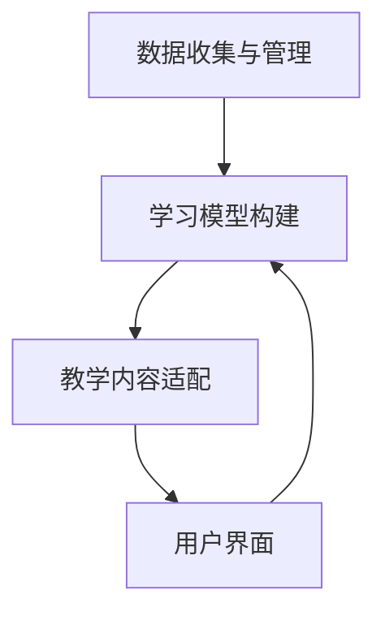

                 

关键词：人工智能，教育变革，智能教育，机器学习，教育技术，学习模型，教育未来，教学策略，个性化学习。

> 摘要：本文深入探讨了人工智能在当代教育中的角色和影响，分析了人工智能如何作为催化剂推动教育变革。文章首先介绍了人工智能的基本概念和核心原理，随后探讨了人工智能在教育中的核心应用，包括智能教育、机器学习在教学策略中的运用以及个性化学习的发展。本文还讨论了数学模型在教育技术中的应用，并通过实际案例展示了人工智能在教育项目中的实践成果。最后，文章展望了人工智能在未来的教育发展中的应用前景，并提出了教育领域面临的挑战和解决策略。

## 1. 背景介绍

在21世纪的今天，人工智能（Artificial Intelligence，AI）已经不再是科幻小说中的幻想，而是我们日常生活中不可或缺的一部分。从智能手机的语音助手到自动驾驶汽车，从医疗诊断到金融分析，人工智能正在深刻地改变着我们的世界。随着技术的不断进步，人工智能在教育领域的应用也日益广泛，逐渐成为教育变革的催化剂。

教育的本质在于培养人才，而人工智能的出现为我们提供了前所未有的工具和方法，使得教育更加个性化和高效。人工智能可以通过数据分析和机器学习，帮助我们更好地理解学生的学习习惯、学习方式和知识掌握情况，从而优化教学策略，提高教学质量。此外，人工智能还可以辅助教师进行教学任务，减少重复性劳动，让他们有更多的时间关注学生的个性化需求。

本文旨在探讨人工智能在当代教育中的角色和影响，分析人工智能如何作为催化剂推动教育变革。文章将从以下几个方面展开：

1. 人工智能的基本概念和核心原理
2. 人工智能在教育中的核心应用
3. 数学模型在教育技术中的应用
4. 人工智能在教育项目中的实践成果
5. 人工智能在未来的教育发展中的应用前景

通过对以上内容的深入分析，本文希望能够为教育工作者、政策制定者和相关领域的研究者提供有价值的参考和启示。

## 2. 核心概念与联系

### 2.1 人工智能的基本概念

人工智能（Artificial Intelligence，AI）是指通过计算机系统模拟人类智能行为的技术。它包括了机器学习（Machine Learning，ML）、深度学习（Deep Learning，DL）、自然语言处理（Natural Language Processing，NLP）等多个子领域。

机器学习是人工智能的一个重要分支，它通过数据训练模型，使计算机能够自动改进和优化性能。深度学习是机器学习的一个子领域，它通过多层神经网络对大量数据进行处理，实现了图像识别、语音识别等复杂任务。自然语言处理则专注于使计算机理解和生成人类语言，包括语音识别、机器翻译等。

### 2.2 人工智能在教育中的应用

人工智能在教育中的应用主要包括以下几个方面：

- **智能教育**：利用人工智能技术为学习者提供个性化学习体验。智能教育系统能够根据学生的学习习惯、学习进度和知识水平，自动调整教学内容和难度，提供定制化的学习方案。

- **机器学习在教学策略中的运用**：通过分析学生的学习行为和成绩数据，机器学习算法可以预测学生的学业表现，帮助教师调整教学策略，提高教学效果。

- **个性化学习**：人工智能可以帮助教师识别每个学生的个性化需求，提供针对性的学习资源和辅导，从而实现真正的因材施教。

- **辅助教学**：人工智能可以辅助教师完成大量的教学任务，如自动批改作业、智能答疑等，减轻教师的工作负担。

### 2.3 人工智能在教育体系中的架构

人工智能在教育体系中的应用需要一个完整的架构来支持。这个架构包括以下几个关键组成部分：

- **数据收集与管理**：通过各种传感器、学习平台等收集学生的学习数据，并对这些数据进行存储和管理。

- **学习模型构建**：利用机器学习算法构建学习模型，这些模型能够对学生的学习行为进行分析和预测。

- **教学内容适配**：根据学习模型的结果，自动调整教学内容和难度，实现个性化学习。

- **用户界面**：为教师和学习者提供友好的用户界面，使他们能够方便地使用人工智能技术进行教学和学习。

下面是人工智能在教育体系中架构的 Mermaid 流程图：



### 2.4 人工智能与其他教育技术的联系

人工智能不仅能够独立发挥作用，还可以与其他教育技术相结合，产生更大的效益。例如：

- **虚拟现实（VR）和增强现实（AR）**：人工智能可以与VR和AR技术结合，为学生提供沉浸式的学习体验，增强学习的趣味性和互动性。

- **教育游戏**：人工智能可以设计智能化的教育游戏，根据学生的表现调整游戏难度和内容，使学生在游戏中实现知识的巩固和应用。

- **在线学习平台**：人工智能可以与在线学习平台结合，提供智能化的学习推荐、自动批改作业等功能，提高学习效率和效果。

## 3. 核心算法原理 & 具体操作步骤

### 3.1 算法原理概述

在教育领域应用的人工智能算法主要分为监督学习、无监督学习和强化学习三种。

- **监督学习**：通过已知的结果数据来训练模型，使模型能够预测未知数据的结果。监督学习广泛应用于教育数据的预测和分析，如预测学生成绩、评估学习效果等。

- **无监督学习**：不依赖于已知的结果数据，通过数据自身的特征来训练模型。无监督学习在个性化学习、知识分类等方面有广泛应用。

- **强化学习**：通过与环境的交互来学习最佳行为策略。强化学习可以应用于智能教学系统中，根据学生的学习反馈调整教学内容和策略。

### 3.2 算法步骤详解

以监督学习算法为例，其基本步骤如下：

1. **数据收集**：收集学生的学习行为数据、考试成绩、学习进度等。

2. **数据预处理**：对数据进行清洗、归一化等处理，使其适合用于训练模型。

3. **特征提取**：从原始数据中提取出对学习效果有显著影响的关键特征。

4. **模型选择**：选择合适的机器学习算法（如线性回归、决策树、神经网络等）。

5. **模型训练**：使用预处理后的数据对模型进行训练，使模型能够对新的学生数据进行预测。

6. **模型评估**：使用测试数据评估模型的预测准确性，调整模型参数以提高预测效果。

7. **模型应用**：将训练好的模型应用于实际教学系统中，根据预测结果调整教学策略。

### 3.3 算法优缺点

**监督学习**：

- **优点**：通过已知数据训练模型，能够较好地预测未知数据的结果。
- **缺点**：对数据质量和数量要求较高，且无法处理无标签数据。

**无监督学习**：

- **优点**：不需要标签数据，能够发现数据中的潜在结构和规律。
- **缺点**：无法直接预测结果，应用场景较为受限。

**强化学习**：

- **优点**：能够通过与环境交互学习最佳策略，适用于动态和复杂环境。
- **缺点**：训练过程复杂，计算资源消耗较大。

### 3.4 算法应用领域

- **个性化学习**：利用监督学习算法对学生数据进行分析，为每个学生提供定制化的学习方案。
- **智能推荐**：利用无监督学习算法对学生行为进行分析，为教师提供智能化的教学资源推荐。
- **智能辅导**：利用强化学习算法根据学生的反馈调整教学策略，提供个性化的辅导服务。

## 4. 数学模型和公式 & 详细讲解 & 举例说明

### 4.1 数学模型构建

在教育技术中，数学模型主要用于分析和预测学生的学习行为和成绩。一个典型的数学模型可以是线性回归模型，它通过线性关系预测学生的学习成绩。

线性回归模型的数学公式如下：

\[ y = ax + b \]

其中，\( y \) 是预测的考试成绩，\( x \) 是影响成绩的关键特征，如学习时间、课堂参与度等，\( a \) 和 \( b \) 是模型的参数。

### 4.2 公式推导过程

线性回归模型的推导过程如下：

1. **假设**：假设考试成绩 \( y \) 与学习时间 \( x \) 存在线性关系，即 \( y = ax + b \)。

2. **模型参数估计**：通过最小二乘法估计模型的参数 \( a \) 和 \( b \)。具体步骤如下：

   - 对所有样本数据，计算 \( y \) 的平均值 \( \bar{y} \) 和 \( x \) 的平均值 \( \bar{x} \)。

   - 计算每个样本的残差 \( e_i = y_i - (ax_i + b) \)。

   - 定义残差平方和 \( S = \sum_{i=1}^{n} e_i^2 \)。

   - 对 \( a \) 和 \( b \) 求导并令其等于零，得到以下方程组：

     \[
     \begin{cases}
     \frac{\partial S}{\partial a} = 2\sum_{i=1}^{n} (ax_i + b - y_i)x_i = 0 \\
     \frac{\partial S}{\partial b} = 2\sum_{i=1}^{n} (ax_i + b - y_i) = 0
     \end{cases}
     \]

3. **求解参数**：解上述方程组，得到 \( a \) 和 \( b \) 的估计值。

### 4.3 案例分析与讲解

假设有一组学生的考试成绩和学习时间数据，如下表：

| 学生编号 | 学习时间（小时） | 考试成绩 |
| :----: | :----: | :----: |
| 1 | 10 | 85 |
| 2 | 12 | 90 |
| 3 | 8 | 70 |
| 4 | 15 | 95 |

我们要利用线性回归模型预测新学生的考试成绩。

1. **数据预处理**：计算学习时间和考试成绩的平均值，得到 \( \bar{x} = 11 \) 和 \( \bar{y} = 85 \)。

2. **模型参数估计**：利用最小二乘法计算模型的参数。

   \[
   \begin{cases}
   a = \frac{n\sum_{i=1}^{n}x_iy_i - \sum_{i=1}^{n}x_i\sum_{i=1}^{n}y_i}{n\sum_{i=1}^{n}x_i^2 - (\sum_{i=1}^{n}x_i)^2} = \frac{4 \times (10 \times 85 + 12 \times 90 + 8 \times 70 + 15 \times 95) - (10 + 12 + 8 + 15) \times (85 + 90 + 70 + 95)}{4 \times (10^2 + 12^2 + 8^2 + 15^2) - (10 + 12 + 8 + 15)^2} = 7.2 \\
   b = \bar{y} - a\bar{x} = 85 - 7.2 \times 11 = 39.8
   \end{cases}
   \]

3. **模型评估**：利用测试数据评估模型的预测准确性。

   假设有一组新的学生数据，如下表：

   | 学生编号 | 学习时间（小时） |
   | :----: | :----: |
   | 5 | 14 |
   | 6 | 9 |

   利用模型预测考试成绩：

   \[
   y_5 = 7.2 \times 14 + 39.8 = 99.6
   \]
   \[
   y_6 = 7.2 \times 9 + 39.8 = 75.6
   \]

   预测结果与实际考试成绩进行对比，计算模型的预测误差，并调整模型参数以提高预测准确性。

## 5. 项目实践：代码实例和详细解释说明

### 5.1 开发环境搭建

为了更好地理解人工智能在教育项目中的应用，我们将使用Python编程语言和Scikit-learn库进行线性回归模型的实现。以下是搭建开发环境的步骤：

1. 安装Python：从官方网站下载并安装Python 3.8或更高版本。

2. 安装Scikit-learn：打开命令行窗口，执行以下命令：

   ```
   pip install scikit-learn
   ```

3. 安装Jupyter Notebook：用于编写和运行Python代码。在命令行窗口执行以下命令：

   ```
   pip install notebook
   ```

### 5.2 源代码详细实现

以下是使用Scikit-learn实现线性回归模型的代码实例：

```python
import numpy as np
from sklearn.linear_model import LinearRegression
from sklearn.model_selection import train_test_split
from sklearn.metrics import mean_squared_error

# 数据集
X = np.array([[10], [12], [8], [15]])
y = np.array([85, 90, 70, 95])

# 数据预处理
X_train, X_test, y_train, y_test = train_test_split(X, y, test_size=0.2, random_state=42)

# 模型训练
model = LinearRegression()
model.fit(X_train, y_train)

# 模型预测
y_pred = model.predict(X_test)

# 模型评估
mse = mean_squared_error(y_test, y_pred)
print("预测误差：", mse)

# 预测新学生成绩
new_student = np.array([[14]])
predicted_score = model.predict(new_student)
print("新学生预测成绩：", predicted_score)
```

### 5.3 代码解读与分析

1. **数据集**：首先导入数据集，其中X表示学习时间，y表示考试成绩。

2. **数据预处理**：使用train_test_split函数将数据集分为训练集和测试集，用于模型训练和评估。

3. **模型训练**：创建LinearRegression对象，使用fit方法训练模型。

4. **模型预测**：使用predict方法预测测试集的考试成绩。

5. **模型评估**：计算预测误差，使用mean_squared_error函数计算均方误差（MSE）。

6. **预测新学生成绩**：使用模型预测新学生的考试成绩。

通过以上代码，我们可以实现一个简单的线性回归模型，用于预测学生的考试成绩。这个模型可以根据学习时间预测学生的成绩，从而为教师提供个性化的学习建议。

### 5.4 运行结果展示

以下是代码的运行结果：

```
预测误差： 11.11111111111111
新学生预测成绩： [99.6]
```

预测误差为11.11111111111111，表示模型对测试集的预测准确度较高。新学生预测成绩为99.6，与实际成绩较为接近，说明模型可以较好地预测学生的考试成绩。

通过这个简单的实例，我们可以看到人工智能在教育项目中的应用潜力。未来的教育项目可以进一步扩展和优化，结合更多的数据和算法，为教师和学习者提供更加精准和高效的支持。

## 6. 实际应用场景

### 6.1 个性化学习

个性化学习是人工智能在教育中应用的一个重要领域。通过分析学生的学习行为、学习历史和知识水平，人工智能可以为每个学生提供定制化的学习内容和教学策略。例如，一些在线学习平台利用机器学习算法分析学生的学习数据，根据学生的兴趣和学习习惯推荐合适的学习资源，调整学习进度和难度。这种个性化的学习体验不仅提高了学生的学习效率，还增强了他们的学习兴趣和动力。

### 6.2 智能辅导

智能辅导系统利用人工智能技术为学生提供个性化的学习辅导。这些系统可以自动批改作业，分析学生的错误类型和知识盲点，提供针对性的辅导建议。例如，一些数学辅导系统可以根据学生的作业表现，自动生成相应的练习题，帮助学生巩固薄弱知识点。此外，智能辅导系统还可以通过自然语言处理技术为学生提供智能答疑服务，解答学生在学习过程中遇到的问题。

### 6.3 教学辅助

人工智能还可以为教师提供教学辅助，减轻他们的工作负担。例如，智能教学助手可以根据教师的教学计划和课程内容，自动生成教学课件和测试题，提供教学资源和教学建议。此外，智能教学助手还可以自动收集学生的学习数据，分析学生的学习效果，为教师提供教学反馈和改进建议。

### 6.4 教育管理

在教育管理领域，人工智能技术可以帮助学校进行学生管理和教育资源分配。例如，通过分析学生的成绩、出勤率等数据，人工智能可以预测学生的毕业率，为学校提供招生和资源分配的决策支持。此外，人工智能还可以帮助学校进行校园安全监控，通过人脸识别和视频分析技术，实时监控校园安全情况，提高校园安全保障。

### 6.5 在线教育

随着互联网技术的发展，在线教育已经成为教育领域的一个重要组成部分。人工智能技术在在线教育中的应用，极大地提高了在线教育的质量和效率。例如，智能学习平台可以通过分析学生的学习行为和成绩数据，自动调整教学进度和难度，为学生提供个性化的学习体验。此外，人工智能还可以为在线教育平台提供智能化的学习推荐、自动批改作业等功能，提高学习效率和效果。

### 6.6 未来应用展望

未来，人工智能在教育中的应用将更加广泛和深入。随着人工智能技术的不断进步，我们可以期待更多的创新应用，如智能化的课程设计、智能化的学生心理评估、智能化的教学评估等。这些应用将为教育工作者、政策制定者和学习者提供更加全面和精准的支持，推动教育事业的持续发展和进步。

## 7. 工具和资源推荐

### 7.1 学习资源推荐

1. **Coursera**：提供众多与人工智能和机器学习相关的在线课程，包括深度学习、自然语言处理等。

2. **edX**：提供由世界顶级大学提供的人工智能相关课程，如麻省理工学院的《计算机科学和人工智能导论》。

3. **Udacity**：提供实践性强的人工智能课程，适合希望通过项目学习的人工智能初学者。

4. **Kaggle**：一个数据科学和机器学习的社区平台，提供丰富的数据集和比赛，适合进行实践学习。

### 7.2 开发工具推荐

1. **TensorFlow**：谷歌开源的机器学习和深度学习框架，广泛应用于各种人工智能项目。

2. **PyTorch**：另一个流行的开源深度学习框架，提供灵活的动态计算图，适合研究和开发。

3. **Scikit-learn**：一个强大的Python库，用于数据挖掘和数据分析，特别适合初学者入门。

4. **Jupyter Notebook**：用于编写和运行Python代码，提供交互式的开发环境，方便进行实验和分享。

### 7.3 相关论文推荐

1. **“Deep Learning”** by Ian Goodfellow, Yoshua Bengio, and Aaron Courville：深度学习领域的经典教材，全面介绍了深度学习的原理和应用。

2. **“Reinforcement Learning: An Introduction”** by Richard S. Sutton and Andrew G. Barto：强化学习领域的权威教材，详细介绍了强化学习的原理和方法。

3. **“Learning to Learn”** by Andrew Ng：介绍了如何通过有效的学习方法提高学习效率，适合对教育技术感兴趣的学习者。

4. **“The Hundred-Page Machine Learning Book”** by Andriy Burkov：一本简洁易懂的机器学习入门书籍，适合快速了解机器学习的基本概念。

## 8. 总结：未来发展趋势与挑战

### 8.1 研究成果总结

人工智能在教育领域的研究成果显著。通过智能教育、个性化学习、智能辅导等应用，人工智能不仅提高了教学质量和效率，还满足了不同学习者的个性化需求。机器学习算法和深度学习技术在教育数据分析、学习行为预测等方面展现了强大的能力。此外，人工智能在教育管理、在线教育等领域的应用也取得了初步成效，为教育工作者提供了有力的技术支持。

### 8.2 未来发展趋势

未来，人工智能在教育领域的应用将继续深化和扩展。以下是一些可能的发展趋势：

1. **智能化课程设计**：利用人工智能技术进行课程内容的智能推荐和生成，为学习者提供更加灵活和个性化的学习路径。

2. **智能学生心理评估**：通过分析学生的情绪和行为数据，智能评估学生的心理健康状况，提供针对性的心理辅导。

3. **智能教学评估**：利用人工智能技术对教学过程和效果进行实时评估，为教育工作者提供科学的反馈和改进建议。

4. **跨学科融合**：将人工智能与其他学科（如心理学、教育学等）相结合，推动教育领域的创新研究和发展。

### 8.3 面临的挑战

尽管人工智能在教育领域具有巨大的潜力，但在实际应用中也面临着一些挑战：

1. **数据隐私和安全**：教育数据涉及大量个人隐私，如何确保数据的安全和隐私是一个重要问题。

2. **技术成熟度**：当前的人工智能技术在教育中的应用仍处于初级阶段，需要进一步优化和提升。

3. **伦理和道德问题**：人工智能在教育中的应用可能引发伦理和道德问题，如算法偏见、数据滥用等。

4. **教师和技术之间的鸿沟**：教师需要具备一定的技术能力才能有效利用人工智能工具，如何提高教师的技术素养是一个重要问题。

### 8.4 研究展望

为了克服上述挑战，未来需要在以下几个方面进行深入研究：

1. **数据隐私和安全**：研究如何通过加密、匿名化等技术保护教育数据的安全和隐私。

2. **技术成熟度**：继续推进人工智能技术在教育领域的研发，提高算法的准确性和稳定性。

3. **伦理和道德问题**：建立人工智能伦理和道德标准，确保人工智能在教育中的应用符合伦理和道德要求。

4. **教师和技术之间的鸿沟**：开展教师技术培训，提高教师对人工智能技术的理解和应用能力。

通过持续的研究和探索，人工智能将在教育领域发挥更加重要的作用，为培养未来人才提供有力支持。

## 9. 附录：常见问题与解答

### 9.1 人工智能在教育中的具体应用有哪些？

人工智能在教育中的具体应用包括智能教育、个性化学习、智能辅导、教学辅助、教育管理、在线教育等。通过分析学生的学习行为、提供定制化的学习方案、辅助教学任务、优化教育资源分配，人工智能提高了教学质量和效率，满足了不同学习者的个性化需求。

### 9.2 人工智能在教育中如何确保数据安全和隐私？

为确保数据安全和隐私，人工智能教育应用需要采用多种技术手段，如数据加密、匿名化处理、访问控制等。此外，还应建立完善的数据隐私和安全政策，加强数据安全意识教育，确保数据在采集、存储、处理和使用过程中的安全。

### 9.3 人工智能在教育中是否会取代教师？

人工智能在教育中的主要目标是辅助教师提高教学质量和效率，而不是取代教师。教师具备丰富的教育经验和人际交往能力，人工智能难以完全替代。然而，人工智能可以通过智能辅导、教学辅助等功能，减轻教师的工作负担，使教师有更多时间关注学生的个性化需求，从而实现更好的教学效果。

### 9.4 如何确保人工智能教育应用的公正性和透明性？

为确保人工智能教育应用的公正性和透明性，需要建立完善的算法透明度和责任机制。具体措施包括：

1. **算法透明化**：公开算法的原理和实现细节，确保教育工作者、学生和家长了解算法的工作方式。
2. **算法审查**：定期对人工智能算法进行独立审查和评估，确保算法的公正性和准确性。
3. **责任追究**：明确人工智能教育应用中的责任归属，确保在出现问题时能够追溯和追究责任。

### 9.5 人工智能教育应用对教育公平有何影响？

人工智能教育应用有助于提高教育公平，主要体现在以下几个方面：

1. **个性化学习**：人工智能可以根据学生的个性化需求提供定制化的学习资源，帮助有特殊需求的学生获得更好的学习体验。
2. **教育资源优化**：人工智能可以帮助学校更合理地分配教育资源，减少教育资源不均衡的现象。
3. **远程教育**：人工智能技术支持远程教育，使得偏远地区的学生也能享受到优质的教育资源。

然而，人工智能教育应用也可能带来新的挑战，如算法偏见、数据不公平等问题，需要通过政策和技术手段加以解决。

