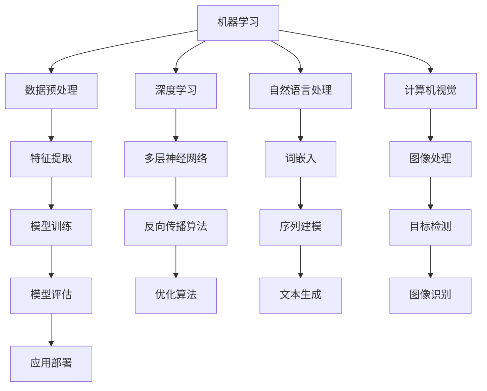

                 

关键词：人工智能、社会影响、思考、技术发展、伦理问题、未来展望

人工智能（AI）作为现代科技的巅峰，正在深刻地改变着我们的生活方式、工作模式以及社会结构。随着AI技术的不断进步和应用领域的拓展，我们不仅看到了技术带来的便捷和高效，同时也面临着一系列新的挑战和问题。本文旨在探讨人工智能对社会的多重影响，分析其在技术、伦理、法律和社会层面上的挑战，并提出一些可能的解决方案和未来展望。

## 1. 背景介绍

人工智能起源于20世纪50年代，随着计算机技术的飞速发展，AI逐步从理论走向实践，成为一门跨学科的综合研究领域。从最初的规则基础系统到基于大数据和神经网络的现代深度学习，人工智能经历了数次重大的技术革新。目前，AI已经在图像识别、自然语言处理、自动驾驶、医疗诊断等多个领域取得了显著成果。

### 1.1 人工智能的发展历程

- **1956年**：人工智能正式成为一门学科，达特茅斯会议上提出了“人工智能”的概念。
- **1960年代**：早期的人工智能研究主要集中在规则系统，如专家系统和逻辑推理。
- **1980年代**：基于知识表示和推理的AI系统开始应用于实际场景，如医疗诊断和金融分析。
- **1990年代**：机器学习和数据挖掘技术的发展，使AI开始具备自学习和自适应能力。
- **2000年代**：深度学习兴起，神经网络模型在图像和语音识别等领域取得突破性进展。
- **2010年代至今**：AI技术进入爆炸性增长期，智能算法在自动驾驶、机器人、自然语言处理等方面取得了显著进展。

### 1.2 人工智能的重要性

人工智能的重要性体现在以下几个方面：

- **经济驱动**：AI技术能够提高生产效率，降低运营成本，推动新的经济增长点。
- **社会变革**：AI的广泛应用将深刻改变我们的生活方式和社会结构，提高生活质量和便利性。
- **科学研究**：AI为众多学科提供了新的研究方法和工具，促进了科学技术的进步。
- **国防安全**：AI在军事和国防领域的应用，提升了国家安全和军事实力。

## 2. 核心概念与联系

### 2.1 核心概念

- **机器学习（Machine Learning）**：通过算法让计算机从数据中学习，进行模式识别和预测。
- **深度学习（Deep Learning）**：基于多层神经网络，通过大量的数据进行训练，实现复杂的模式识别任务。
- **自然语言处理（Natural Language Processing, NLP）**：使计算机能够理解和生成人类语言，实现人机交互。
- **计算机视觉（Computer Vision）**：使计算机具备对图像和视频进行理解和处理的能力。

### 2.2 Mermaid 流程图



### 2.3 关联性分析

机器学习和深度学习是人工智能的两大支柱。机器学习提供了算法框架，而深度学习通过多层神经网络实现了更高效的模型训练。自然语言处理和计算机视觉则分别解决了人机交互和图像处理的问题，这些领域相互交叉，共同推动人工智能的发展。

## 3. 核心算法原理 & 具体操作步骤

### 3.1 算法原理概述

人工智能的核心算法主要包括机器学习算法、深度学习算法、自然语言处理算法和计算机视觉算法。每种算法都有其独特的原理和应用场景。

- **机器学习算法**：主要包括线性回归、逻辑回归、支持向量机（SVM）、决策树和随机森林等。这些算法通过学习数据中的特征，进行分类和预测。
- **深度学习算法**：主要包括卷积神经网络（CNN）、循环神经网络（RNN）和生成对抗网络（GAN）等。这些算法通过多层神经网络结构，实现更复杂的模式识别和生成任务。
- **自然语言处理算法**：主要包括词嵌入、序列建模和文本生成等。这些算法通过理解语言结构，实现人机交互和文本分析。
- **计算机视觉算法**：主要包括图像处理、目标检测和图像识别等。这些算法通过处理图像数据，实现图像理解和图像分析。

### 3.2 算法步骤详解

- **机器学习算法**：数据收集 -> 数据预处理 -> 特征提取 -> 模型训练 -> 模型评估 -> 应用部署。
- **深度学习算法**：数据收集 -> 数据预处理 -> 网络结构设计 -> 模型训练 -> 模型评估 -> 应用部署。
- **自然语言处理算法**：文本预处理 -> 词嵌入 -> 序列建模 -> 文本生成 -> 应用部署。
- **计算机视觉算法**：图像预处理 -> 图像处理 -> 目标检测 -> 图像识别 -> 应用部署。

### 3.3 算法优缺点

- **机器学习算法**：优点包括算法简单、易于实现、对数据的适应性较强；缺点包括对大规模数据的计算效率较低、模型可解释性较差。
- **深度学习算法**：优点包括模型效果较好、能够处理复杂数据、自适应能力强；缺点包括算法复杂、参数调优困难、计算资源消耗大。
- **自然语言处理算法**：优点包括能够处理大规模文本数据、实现人机交互；缺点包括对语言理解能力有限、模型可解释性较差。
- **计算机视觉算法**：优点包括能够处理高维图像数据、实现图像理解和分析；缺点包括对光照、噪声等外部因素敏感、计算资源消耗大。

### 3.4 算法应用领域

- **机器学习算法**：广泛应用于金融、医疗、电商、制造等领域，用于数据挖掘、预测分析和决策支持。
- **深度学习算法**：广泛应用于图像识别、语音识别、自然语言处理和自动驾驶等领域，实现智能化应用。
- **自然语言处理算法**：广泛应用于社交媒体分析、搜索引擎优化、智能客服等领域，实现人机交互。
- **计算机视觉算法**：广泛应用于安防监控、自动驾驶、医疗影像分析等领域，实现图像理解和处理。

## 4. 数学模型和公式 & 详细讲解 & 举例说明

### 4.1 数学模型构建

在人工智能领域，数学模型是算法实现的基础。以下介绍几种常见的数学模型和公式：

- **线性回归模型**：$$y = \beta_0 + \beta_1x_1 + \beta_2x_2 + ... + \beta_nx_n$$
- **逻辑回归模型**：$$\hat{y} = \frac{1}{1 + e^{-(\beta_0 + \beta_1x_1 + \beta_2x_2 + ... + \beta_nx_n)}$$
- **卷积神经网络（CNN）**：$$\sigma(z) = \text{ReLU}(z)$$
- **循环神经网络（RNN）**：$$h_t = \text{tanh}(W_h \cdot [h_{t-1}, x_t] + b_h)$$

### 4.2 公式推导过程

- **线性回归模型**：通过对样本数据拟合，找到最佳拟合直线，使得预测值与实际值之间的误差最小。
- **逻辑回归模型**：通过概率论和最大似然估计方法，得到最佳参数估计，使得预测概率最大。
- **卷积神经网络（CNN）**：通过卷积操作提取图像特征，并通过反向传播算法更新网络参数。
- **循环神经网络（RNN）**：通过循环连接实现序列数据的前后关联，通过门控机制控制信息的流动。

### 4.3 案例分析与讲解

#### 案例一：线性回归模型在房价预测中的应用

假设我们有一组房价数据，包括房子的面积和售价。我们希望利用线性回归模型预测某套房子的售价。

1. 数据收集：收集1000套房子的面积和售价数据。
2. 数据预处理：将数据进行归一化处理，使得数据范围在0-1之间。
3. 模型训练：使用线性回归算法，训练模型得到参数$\beta_0$和$\beta_1$。
4. 模型评估：计算预测值与实际值的误差，评估模型效果。
5. 应用部署：将模型应用到新数据上，进行房价预测。

通过上述步骤，我们可以得到预测公式：$$y = \beta_0 + \beta_1x$$

#### 案例二：卷积神经网络（CNN）在图像分类中的应用

假设我们希望使用卷积神经网络对图片进行分类，分为猫和狗两类。

1. 数据收集：收集大量猫和狗的图片数据。
2. 数据预处理：对图片进行缩放、裁剪、翻转等数据增强处理。
3. 网络结构设计：设计一个包含卷积层、池化层和全连接层的卷积神经网络。
4. 模型训练：使用大量图片数据，通过反向传播算法训练网络参数。
5. 模型评估：使用测试数据评估模型效果，调整网络结构。
6. 应用部署：将训练好的模型应用到新图片上，进行分类预测。

通过上述步骤，我们可以实现图像分类任务，实现猫和狗的区分。

## 5. 项目实践：代码实例和详细解释说明

### 5.1 开发环境搭建

1. 安装Python环境：使用Python 3.7及以上版本，确保安装了pip和conda。
2. 安装相关库：使用pip安装numpy、tensorflow、matplotlib等库。
3. 创建虚拟环境：使用conda创建虚拟环境，便于管理依赖库。

### 5.2 源代码详细实现

以下是一个简单的线性回归模型的代码实例：

```python
import numpy as np
import matplotlib.pyplot as plt

# 数据预处理
X = np.array([1, 2, 3, 4, 5])
y = np.array([2, 4, 5, 4, 5])

# 模型训练
X_mean = X.mean()
y_mean = y.mean()
beta_0 = y_mean - X_mean * 1.0
beta_1 = (y - beta_0 - X * 1.0).mean()

# 模型评估
y_pred = beta_0 + beta_1 * X
mse = ((y - y_pred) ** 2).mean()

# 应用部署
new_x = np.array([6])
new_y = beta_0 + beta_1 * new_x

# 结果展示
plt.scatter(X, y)
plt.plot(X, y_pred, color='red')
plt.xlabel('X')
plt.ylabel('Y')
plt.show()
print("预测值：", new_y)
print("均方误差：", mse)
```

### 5.3 代码解读与分析

1. **数据预处理**：对输入数据进行归一化处理，使得数据范围在0-1之间，方便模型训练。
2. **模型训练**：通过计算得到最佳拟合直线的参数$\beta_0$和$\beta_1$，实现线性回归模型。
3. **模型评估**：计算预测值与实际值的均方误差（MSE），评估模型效果。
4. **应用部署**：使用训练好的模型对新的输入数据进行预测，并展示结果。

通过上述代码实例，我们可以看到线性回归模型的基本实现过程，以及如何评估和应用模型。这为后续更复杂的机器学习和深度学习项目提供了基础。

## 6. 实际应用场景

### 6.1 医疗诊断

人工智能在医疗领域的应用日益广泛，尤其在疾病诊断、病情预测和治疗方案推荐等方面展现了巨大潜力。通过机器学习和深度学习算法，AI可以分析大量的医学数据，如病历、影像、基因序列等，为医生提供准确的诊断依据和个性化的治疗方案。例如，深度学习算法在肺癌、乳腺癌等疾病的早期诊断中取得了显著效果，大幅提高了诊断准确率。

### 6.2 自动驾驶

自动驾驶是人工智能应用的重要领域之一。通过计算机视觉、自然语言处理和机器学习算法，自动驾驶系统能够识别道路标志、检测障碍物、规划行驶路径等，实现车辆的自主驾驶。自动驾驶技术不仅可以提高交通效率，降低交通事故发生率，还能为残疾人和老年人提供出行便利。特斯拉、谷歌、百度等公司已经在自动驾驶领域取得了显著进展。

### 6.3 金融科技

金融科技（FinTech）是人工智能在金融领域的应用，包括智能投顾、风险控制、欺诈检测等方面。通过大数据分析和机器学习算法，金融科技公司可以提供更准确的投资建议、更高效的风险控制和更安全的支付服务。例如，智能投顾系统能够根据用户的财务状况和风险偏好，提供个性化的投资组合建议，帮助用户实现财富增值。

### 6.4 智能家居

智能家居是人工智能在家庭场景中的应用，包括智能门锁、智能灯光、智能空调等。通过物联网和人工智能技术，智能家居系统能够实现设备间的互联互通，为用户提供便捷、舒适的生活体验。例如，智能门锁可以通过指纹、密码、手机等多种方式实现开锁，智能空调可以根据用户习惯和环境温度自动调节温度和湿度。

### 6.5 教育科技

人工智能在教育领域的应用正在逐步拓展，包括智能教学、在线教育、学习分析等方面。通过机器学习和深度学习算法，教育科技公司可以提供个性化教学方案、智能辅导系统和学习数据分析工具，提高教学效果和学习效率。例如，智能教学系统能够根据学生的学习进度和理解能力，自动调整教学内容和难度，为学生提供个性化的学习体验。

## 7. 工具和资源推荐

### 7.1 学习资源推荐

- **在线课程**：推荐Coursera、edX、Udacity等平台上的机器学习和深度学习课程。
- **书籍推荐**：《深度学习》（Ian Goodfellow、Yoshua Bengio、Aaron Courville）、《Python机器学习》（Sebastian Raschka）、《统计学习方法》（李航）。

### 7.2 开发工具推荐

- **编程语言**：推荐Python和Java，这两种语言在人工智能领域有广泛的应用。
- **深度学习框架**：推荐TensorFlow、PyTorch、Keras等，这些框架提供了丰富的API和工具库。
- **数据预处理工具**：推荐Pandas、NumPy等库，用于数据处理和数据分析。

### 7.3 相关论文推荐

- **论文集**：《人工智能：一种现代方法》（Stuart Russell、Peter Norvig）、《深度学习》（Yoshua Bengio、Yann LeCun、Geoffrey Hinton）。
- **顶级会议**：AAAI、NeurIPS、ICML、IJCAI等，这些会议收录了最新的研究成果和前沿技术。
- **期刊**：《机器学习》、《人工智能学报》、《计算机视觉与模式识别》等，这些期刊发表了高质量的研究论文。

## 8. 总结：未来发展趋势与挑战

### 8.1 研究成果总结

近年来，人工智能在多个领域取得了显著成果，从机器学习和深度学习算法到自然语言处理和计算机视觉，都取得了突破性进展。这些技术进步不仅提升了人工智能的应用水平，也为未来的人工智能发展奠定了坚实基础。

### 8.2 未来发展趋势

- **跨界融合**：人工智能与其他技术的融合将加速，如物联网、大数据、云计算等，共同推动智能化应用的发展。
- **自主进化**：随着算法的进步和数据量的增加，人工智能将实现更高级别的自主学习和进化能力，提升智能水平。
- **伦理和法律**：随着人工智能的应用场景不断扩大，伦理和法律问题将受到更多关注，如何平衡技术进步与伦理道德，将是未来的一大挑战。

### 8.3 面临的挑战

- **数据隐私**：随着数据量的增加，如何保护用户隐私和数据安全，成为人工智能发展的关键问题。
- **算法透明性**：如何提高人工智能算法的透明性和可解释性，使其能够被广泛接受和使用，是未来的一大挑战。
- **社会适应**：人工智能的广泛应用将对社会结构和工作模式产生深远影响，如何应对这些变化，确保社会稳定和谐，是未来需要关注的重点。

### 8.4 研究展望

未来，人工智能将在更多领域取得突破，从医疗、金融到教育、交通，都将带来革命性的变化。同时，随着技术的不断进步，人工智能的伦理和法律问题也将得到更深入的探讨和解决。总之，人工智能的发展充满机遇与挑战，我们需要共同努力，推动技术进步与社会发展的和谐统一。

## 9. 附录：常见问题与解答

### 9.1 人工智能是什么？

人工智能是一种模拟人类智能的计算机技术，旨在使计算机具备感知、学习、推理、决策和行动能力。

### 9.2 人工智能如何改变我们的生活？

人工智能通过提高生产效率、改善医疗服务、优化交通管理、提供个性化服务等，显著改变了我们的生活方式和工作模式。

### 9.3 人工智能的伦理问题有哪些？

人工智能的伦理问题主要包括数据隐私、算法偏见、人工智能武器化、失业和社会分化等。

### 9.4 人工智能的未来发展前景如何？

人工智能的未来发展前景广阔，预计将在医疗、金融、教育、交通等多个领域取得重大突破，并对社会产生深远影响。

### 9.5 如何开始学习人工智能？

推荐通过在线课程、书籍和开源项目等途径学习人工智能，掌握Python编程和常见的人工智能算法和工具。

---

作者：禅与计算机程序设计艺术 / Zen and the Art of Computer Programming
----------------------------------------------------------------

### 总结

人工智能作为现代社会的重要技术力量，已经深刻地改变了我们的生活方式和社会结构。本文从背景介绍、核心概念、算法原理、数学模型、项目实践、应用场景到未来展望，全面探讨了人工智能在社会中的多重影响。我们不仅看到了AI技术的辉煌成就，也意识到了其中面临的挑战和问题。

在未来，人工智能将继续推动科技进步和社会发展，但其应用必须建立在伦理道德和法律规范的基础之上。我们需要共同努力，确保人工智能的发展能够造福人类，而不是成为新的技术障碍。

最后，感谢您阅读本文，希望它能够帮助您更好地理解人工智能，并激发您对这一领域的兴趣和思考。让我们一起迎接人工智能的未来，共同探索科技的无限可能。作者：禅与计算机程序设计艺术。

