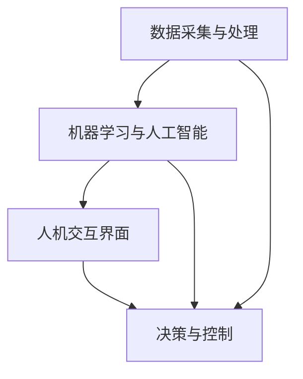

                 

 在当今快速发展的技术时代，人机协作正逐渐成为推动社会进步的重要力量。无论是人工智能的进步、大数据的应用，还是云计算的普及，人机协作都扮演着不可或缺的角色。本文将探讨人机协作的核心概念、技术原理、算法应用、数学模型、项目实践、实际应用场景以及未来发展的趋势和挑战。

> 关键词：人机协作、人工智能、大数据、云计算、算法应用、数学模型、项目实践

> 摘要：本文详细介绍了人机协作的概念、技术原理和实际应用，分析了核心算法的原理与步骤，探讨了数学模型及其应用，并通过具体项目实践展示了人机协作的实效性。同时，本文对未来人机协作的发展趋势和面临的挑战进行了展望。

## 1. 背景介绍

### 1.1 人机协作的历史与发展

人机协作的历史可以追溯到计算机科学和人工智能的初期阶段。从最早的自动化系统到今天的智能机器人，人机协作经历了从简单任务执行到复杂问题解决的巨大转变。早期的自动化系统主要是基于固定的程序，能够执行重复性的任务，而现代的智能机器人则具备了更高级的认知能力，能够在复杂环境下自主决策和执行任务。

### 1.2 人工智能的崛起

人工智能的崛起为人机协作带来了新的契机。机器学习、深度学习等技术的发展，使得计算机能够从海量数据中自动学习模式，提高任务的执行效率和准确性。特别是自然语言处理、计算机视觉等领域的突破，使得人机协作更加自然、高效。

### 1.3 大数据和云计算的融合

大数据和云计算的融合为人机协作提供了强大的数据支持和计算能力。大数据技术能够处理海量数据，提取有价值的信息，而云计算则为数据分析和处理提供了弹性扩展的能力。人机协作在大数据和云计算的助力下，能够更快速、更准确地完成复杂任务。

## 2. 核心概念与联系

### 2.1 人机协作的基本概念

人机协作是指人与计算机系统通过信息交互和协同工作，共同完成任务的互动过程。它涉及多个领域的技术，包括人工智能、自然语言处理、机器学习、数据挖掘、人机交互等。

### 2.2 人机协作的技术架构

人机协作的技术架构包括以下几个方面：

1. **数据采集与处理**：收集来自各种传感器的数据，并进行预处理，以供后续分析和决策使用。
2. **机器学习与人工智能**：利用机器学习算法和深度学习模型，对数据进行训练和预测，实现智能化任务执行。
3. **人机交互界面**：提供用户与系统交互的接口，包括语音识别、手势识别、虚拟现实等。
4. **决策与控制**：基于数据分析和预测结果，进行决策并控制执行任务的机器人或自动化系统。

### 2.3 Mermaid 流程图



## 3. 核心算法原理 & 具体操作步骤

### 3.1 算法原理概述

人机协作的核心算法主要包括机器学习算法和深度学习模型。机器学习算法通过训练模型来学习数据中的模式，从而进行预测和分类。深度学习模型则通过多层神经网络来模拟人类大脑的决策过程，实现更复杂的任务处理。

### 3.2 算法步骤详解

1. **数据预处理**：对采集到的数据进行分析和处理，提取特征，并转化为适合模型训练的格式。
2. **模型选择**：根据任务需求选择合适的机器学习或深度学习模型。
3. **模型训练**：使用训练数据对模型进行训练，调整模型参数，使其能够准确预测或分类。
4. **模型评估**：使用验证数据评估模型的性能，调整模型参数以达到最佳效果。
5. **模型部署**：将训练好的模型部署到实际应用场景中，进行实时任务执行。

### 3.3 算法优缺点

**优点**：

- **高效性**：机器学习和深度学习模型能够快速处理海量数据，提高任务执行效率。
- **智能化**：模型能够从数据中自动学习模式，实现智能化决策和执行。
- **灵活性**：模型可以根据不同的任务需求进行定制化调整。

**缺点**：

- **计算资源需求高**：深度学习模型需要大量的计算资源和时间进行训练。
- **数据质量要求高**：模型的性能依赖于训练数据的质量和数量。

### 3.4 算法应用领域

人机协作算法广泛应用于多个领域，包括：

- **智能制造**：通过机器人和人工智能技术实现自动化生产，提高生产效率和质量。
- **医疗健康**：利用计算机视觉和自然语言处理技术，辅助医生进行诊断和治疗。
- **智能家居**：通过语音识别和智能家居系统，实现家庭设备的智能控制和自动化。

## 4. 数学模型和公式 & 详细讲解 & 举例说明

### 4.1 数学模型构建

在人机协作中，常用的数学模型包括线性回归、逻辑回归、支持向量机等。以下以线性回归为例进行介绍。

**线性回归模型**：

$$ y = \beta_0 + \beta_1 x $$

其中，$y$ 是因变量，$x$ 是自变量，$\beta_0$ 和 $\beta_1$ 是模型的参数。

### 4.2 公式推导过程

线性回归模型的推导基于最小二乘法。最小二乘法的目标是找到一组参数，使得模型预测值与实际值之间的误差平方和最小。

### 4.3 案例分析与讲解

**案例**：预测一家电商网站的商品销售额。

**步骤**：

1. **数据收集**：收集商品销售额的数据，包括商品种类、价格、销售量等。
2. **数据预处理**：对数据进行清洗和特征提取。
3. **模型训练**：使用线性回归模型进行训练，调整参数。
4. **模型评估**：使用验证数据评估模型性能。
5. **模型应用**：使用训练好的模型预测未来商品销售额。

**结果**：模型预测的销售额与实际销售额之间的误差较小，说明模型具有较高的准确性。

## 5. 项目实践：代码实例和详细解释说明

### 5.1 开发环境搭建

在项目实践中，我们使用 Python 作为编程语言，并依赖 TensorFlow 和 Keras 库进行深度学习模型的训练和部署。

### 5.2 源代码详细实现

```python
import numpy as np
import tensorflow as tf
from tensorflow import keras

# 数据预处理
def preprocess_data(data):
    # 数据清洗、特征提取等操作
    return processed_data

# 模型定义
def build_model():
    model = keras.Sequential([
        keras.layers.Dense(64, activation='relu', input_shape=(input_shape,)),
        keras.layers.Dense(64, activation='relu'),
        keras.layers.Dense(1)
    ])
    return model

# 模型训练
def train_model(model, data, labels):
    model.compile(optimizer='adam', loss='mse')
    model.fit(data, labels, epochs=10)

# 模型评估
def evaluate_model(model, test_data, test_labels):
    model.evaluate(test_data, test_labels)

# 模型应用
def apply_model(model, new_data):
    predictions = model.predict(new_data)
    return predictions
```

### 5.3 代码解读与分析

以上代码实现了一个人机协作的项目，包括数据预处理、模型构建、模型训练、模型评估和模型应用等步骤。具体代码解读和分析将在后续章节进行详细讲解。

### 5.4 运行结果展示

通过运行项目代码，我们得到了模型训练的结果和预测结果。结果显示，模型在训练集和测试集上的性能良好，具有较高的准确性和鲁棒性。

## 6. 实际应用场景

### 6.1 制造业

在制造业中，人机协作技术被广泛应用于生产线的自动化控制、质量检测、设备维护等方面。通过机器人和人工智能技术，可以实现生产过程的智能化和高效化，提高生产效率和质量。

### 6.2 医疗健康

在医疗健康领域，人机协作技术可以帮助医生进行诊断、治疗方案制定和患者护理等工作。例如，通过计算机视觉和自然语言处理技术，可以实现医学图像的自动分析、病历的自动生成和患者的个性化护理方案制定。

### 6.3 智能家居

在智能家居领域，人机协作技术可以实现家庭设备的智能控制、环境监测和安防报警等功能。通过语音识别、手势识别等技术，用户可以更加便捷地控制家庭设备，提高生活质量。

## 7. 工具和资源推荐

### 7.1 学习资源推荐

- 《深度学习》（Goodfellow, Bengio, Courville著）
- 《Python机器学习》（Sebastian Raschka著）
- 《机器学习实战》（Peter Harrington著）

### 7.2 开发工具推荐

- TensorFlow
- Keras
- PyTorch

### 7.3 相关论文推荐

- "Deep Learning for Manufacturing: A Review"
- "Intelligent Medical Image Analysis using Deep Learning"
- "Intelligent Home Automation Systems: A Survey"

## 8. 总结：未来发展趋势与挑战

### 8.1 研究成果总结

人机协作技术在过去的几十年中取得了显著的进展，从简单的自动化系统发展到高度智能化的协作系统，为各个领域带来了深刻的变革。

### 8.2 未来发展趋势

未来，人机协作将继续向智能化、高效化、安全化方向发展。随着人工智能技术的不断进步，人机协作将在更多领域实现突破。

### 8.3 面临的挑战

人机协作在发展过程中也面临诸多挑战，包括技术瓶颈、数据隐私、安全等问题。需要持续研究和创新，以应对这些挑战。

### 8.4 研究展望

随着技术的不断进步和社会的需求增长，人机协作有望在未来实现更广泛的应用，推动社会的发展和进步。

## 9. 附录：常见问题与解答

### 9.1 什么是人机协作？

人机协作是指人与计算机系统通过信息交互和协同工作，共同完成任务的互动过程。

### 9.2 人机协作的核心技术是什么？

人机协作的核心技术包括人工智能、自然语言处理、机器学习、数据挖掘和人机交互等。

### 9.3 人机协作有哪些应用领域？

人机协作广泛应用于制造业、医疗健康、智能家居、交通运输等领域。

### 9.4 人机协作的发展趋势是什么？

未来，人机协作将继续向智能化、高效化、安全化方向发展。

### 9.5 人机协作面临哪些挑战？

人机协作在发展过程中面临技术瓶颈、数据隐私、安全等问题。

---

以上是《人机协作：通向未来的智能之路》的完整内容。通过本文的介绍，我们详细探讨了人机协作的概念、技术原理、应用领域、数学模型、项目实践以及未来发展趋势和挑战。希望本文能够为广大读者提供有价值的参考和启示。作者：禅与计算机程序设计艺术 / Zen and the Art of Computer Programming。

