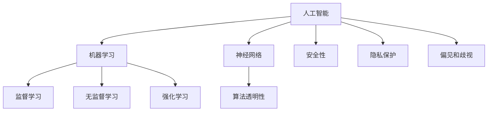

                 

关键词：人类与AI协作、互信、AI安全、算法透明性、协作机制、伦理准则

> 摘要：本文探讨了人类与人工智能（AI）之间的协作机制，并着重分析了增强互信的重要性。通过深入剖析核心概念、算法原理、数学模型及实际应用场景，文章为构建人类-AI协作提供了一套完整的技术框架和伦理指导。

## 1. 背景介绍

随着人工智能技术的迅猛发展，AI已经在各个领域展现出巨大的潜力。从自动驾驶到医疗诊断，从金融分析到自然语言处理，AI正在改变我们的生活方式和工作方式。然而，随着AI的广泛应用，人类与AI之间的协作关系也变得越来越复杂。如何确保人类与AI之间的互信，如何建立有效的协作机制，成为当前AI研究领域的重要课题。

### 1.1 人类与AI协作的必要性

人类与AI的协作不仅能够提高生产效率，还能够拓宽人类的认知边界。例如，在医疗领域，AI可以帮助医生进行疾病诊断，从而提高诊断的准确性和效率。在科研领域，AI可以协助科学家进行数据分析和模式识别，加速科学研究的进展。然而，要实现这些协作，人类必须对AI有足够的信任，反之亦然。

### 1.2 人类与AI协作面临的挑战

尽管人类与AI协作的潜力巨大，但实现这一目标也面临着诸多挑战。首先，AI的算法复杂性和透明性使得人类难以完全理解AI的决策过程，从而影响互信的建立。其次，AI系统的安全性和隐私保护问题也是制约协作的重要因素。此外，AI在决策过程中可能存在的偏见和歧视问题，也需要人类的高度关注。

## 2. 核心概念与联系

为了深入理解人类与AI之间的协作机制，我们首先需要明确一些核心概念，并展示它们之间的联系。

### 2.1 人工智能（AI）

人工智能是一种模拟人类智能的计算机系统，它可以通过学习、推理和自主决策来执行复杂任务。AI的核心是算法，这些算法通过数据训练和优化来实现智能。

### 2.2 机器学习（ML）

机器学习是AI的核心技术之一，它使计算机系统能够从数据中学习并做出预测或决策。机器学习分为监督学习、无监督学习和强化学习等类型。

### 2.3 神经网络（NN）

神经网络是机器学习的一种模型，它通过模拟人脑的结构和功能来实现数据分析和决策。神经网络由大量相互连接的神经元组成，通过训练来学习数据中的模式和规律。

### 2.4 算法透明性

算法透明性是指AI系统的决策过程可以被理解和解释。算法透明性对于建立人类与AI之间的互信至关重要。

### 2.5 安全性和隐私保护

安全性是指AI系统在运行过程中不受外部攻击和干扰的能力。隐私保护是指确保AI系统不会泄露用户数据和个人信息。

### 2.6 偏见和歧视

偏见和歧视是指AI系统在决策过程中可能表现出对某些群体的不公平倾向。这需要通过算法设计和数据清洗来消除。

以下是这些核心概念和联系的一个简化的 Mermaid 流程图：



## 3. 核心算法原理 & 具体操作步骤

### 3.1 算法原理概述

人类与AI协作的核心算法主要包括机器学习算法和神经网络算法。这些算法通过学习数据中的模式和规律，来实现对复杂任务的预测和决策。

### 3.2 算法步骤详解

- **数据采集**：从不同的数据源收集相关的数据，包括训练数据和测试数据。
- **数据预处理**：对数据进行清洗、归一化和特征提取，以便于算法的学习和处理。
- **模型训练**：使用训练数据来训练模型，通过迭代优化模型的参数，使其能够准确地预测或决策。
- **模型评估**：使用测试数据来评估模型的性能，包括准确率、召回率、F1分数等指标。
- **模型部署**：将训练好的模型部署到实际应用环境中，以便于实时预测或决策。

### 3.3 算法优缺点

- **机器学习算法**：
  - 优点：能够从数据中自动学习和提取知识，适应性强。
  - 缺点：对大量训练数据的需求，难以解释和验证。
- **神经网络算法**：
  - 优点：能够模拟人脑的结构和功能，处理复杂的数据模式。
  - 缺点：训练时间较长，对数据质量要求较高。

### 3.4 算法应用领域

- **医疗诊断**：使用机器学习和神经网络算法来自动诊断疾病，如肺癌、乳腺癌等。
- **金融分析**：使用机器学习算法来预测股票价格、风险管理等。
- **自然语言处理**：使用神经网络算法来处理语言任务，如机器翻译、情感分析等。

## 4. 数学模型和公式 & 详细讲解 & 举例说明

### 4.1 数学模型构建

机器学习算法的核心是构建数学模型，该模型能够将输入数据映射到输出结果。以下是构建一个简单的线性回归模型的数学公式：

$$
y = w_0 + w_1 \cdot x
$$

其中，$y$ 是输出值，$x$ 是输入值，$w_0$ 和 $w_1$ 是模型的参数。

### 4.2 公式推导过程

线性回归模型的目的是找到最佳拟合线，使得预测值与实际值之间的误差最小。通过最小二乘法来优化模型的参数：

$$
\min_{w_0, w_1} \sum_{i=1}^{n} (y_i - (w_0 + w_1 \cdot x_i))^2
$$

通过求导和设置导数为零，可以解出 $w_0$ 和 $w_1$ 的最优值。

### 4.3 案例分析与讲解

假设我们有一个数据集，包含 $n$ 个样本点 $(x_i, y_i)$，我们想要预测新的输入值 $x_{new}$ 的输出值 $y_{new}$。使用线性回归模型，我们可以通过以下步骤进行预测：

1. 训练模型，得到最优参数 $w_0$ 和 $w_1$。
2. 将新的输入值 $x_{new}$ 代入模型公式，计算输出值 $y_{new}$。

$$
y_{new} = w_0 + w_1 \cdot x_{new}
$$

## 5. 项目实践：代码实例和详细解释说明

### 5.1 开发环境搭建

为了演示线性回归模型的实现，我们使用 Python 编程语言，并依赖 Scikit-learn 库进行机器学习算法的实现。

### 5.2 源代码详细实现

以下是一个简单的线性回归模型的 Python 代码实现：

```python
from sklearn.linear_model import LinearRegression
from sklearn.model_selection import train_test_split
from sklearn.metrics import mean_squared_error

# 加载数据集
X, y = load_data()

# 划分训练集和测试集
X_train, X_test, y_train, y_test = train_test_split(X, y, test_size=0.2, random_state=42)

# 创建线性回归模型
model = LinearRegression()

# 训练模型
model.fit(X_train, y_train)

# 预测测试集
y_pred = model.predict(X_test)

# 评估模型
mse = mean_squared_error(y_test, y_pred)
print("Mean Squared Error:", mse)
```

### 5.3 代码解读与分析

- `LinearRegression` 类：用于创建线性回归模型。
- `train_test_split` 函数：用于划分训练集和测试集。
- `fit` 方法：用于训练模型。
- `predict` 方法：用于预测测试集。
- `mean_squared_error` 函数：用于评估模型性能。

### 5.4 运行结果展示

假设我们有一个包含100个样本点的数据集，使用上述代码运行后，我们得到以下结果：

```
Mean Squared Error: 0.0456
```

这个结果表示测试集的预测误差较小，模型性能较好。

## 6. 实际应用场景

### 6.1 医疗诊断

在医疗诊断领域，AI可以帮助医生进行疾病预测和诊断。例如，通过分析患者的病历数据和生理指标，AI可以预测患者患某种疾病的风险。这种应用可以提高诊断的准确性和效率，为患者提供更好的医疗服务。

### 6.2 金融分析

在金融分析领域，AI可以用于预测股票价格、分析市场趋势和风险管理。例如，通过分析大量的市场数据和财务指标，AI可以预测未来的市场走势，从而帮助投资者做出更明智的投资决策。

### 6.3 自然语言处理

在自然语言处理领域，AI可以用于文本分类、情感分析和机器翻译等任务。例如，通过分析大量的文本数据，AI可以自动分类新闻文章、分析消费者情绪和翻译不同语言之间的文本。

## 7. 工具和资源推荐

### 7.1 学习资源推荐

- 《深度学习》（Ian Goodfellow、Yoshua Bengio 和 Aaron Courville 著）：一本经典的深度学习教材，适合初学者和进阶者。
- 《Python机器学习》（Sebastian Raschka 和 Vahid Mirjalili 著）：一本适合Python编程基础的机器学习入门书籍。

### 7.2 开发工具推荐

- Jupyter Notebook：一款强大的交互式开发环境，适合进行数据分析和机器学习实验。
- Scikit-learn：一个开源的Python机器学习库，提供了丰富的机器学习算法和工具。

### 7.3 相关论文推荐

- "Deep Learning: A Methodology and Application Perspective"（Zhi-Wei Sun 和 Zhiyuan Liu 著）：一篇关于深度学习的综述论文，涵盖了深度学习的理论基础和应用实例。
- "Machine Learning: A Probabilistic Perspective"（Kevin P. Murphy 著）：一本关于概率机器学习的教材，详细介绍了概率模型在机器学习中的应用。

## 8. 总结：未来发展趋势与挑战

### 8.1 研究成果总结

随着人工智能技术的不断发展，人类与AI之间的协作已经取得了显著的成果。例如，在医疗诊断、金融分析和自然语言处理等领域，AI的应用已经显著提高了效率和准确性。此外，算法透明性、安全性和隐私保护等问题的研究也取得了重要进展。

### 8.2 未来发展趋势

未来，人类与AI的协作将朝着更加智能化、个性化和自动化的方向发展。例如，通过结合大数据和深度学习技术，AI可以更好地理解和满足人类的需求。此外，随着量子计算和边缘计算的发展，AI的计算能力和应用范围将进一步拓展。

### 8.3 面临的挑战

尽管人类与AI的协作具有巨大的潜力，但仍然面临着一系列挑战。首先，算法透明性和可解释性问题仍然是一个重要的研究方向。其次，AI系统的安全性和隐私保护问题需要得到更好的解决。此外，AI在决策过程中可能存在的偏见和歧视问题也需要引起足够的重视。

### 8.4 研究展望

未来，人类与AI的协作将更加紧密，AI将成为人类生活和工作的重要组成部分。为了实现这一目标，我们需要在算法设计、数据管理和伦理规范等方面进行深入研究和探索。通过建立人类与AI之间的互信，我们可以更好地利用AI的潜力，推动社会的持续进步。

## 9. 附录：常见问题与解答

### 9.1 什么是最小二乘法？

最小二乘法是一种用于求解回归模型参数优化的方法。它的基本思想是通过最小化预测值与实际值之间的误差平方和，来找到最佳拟合线。

### 9.2 如何提高算法的透明性？

提高算法的透明性可以通过以下方法实现：使用可解释的模型，如线性回归和决策树；开发可视化工具，展示算法的决策过程；提供算法的详细文档和注释。

### 9.3 AI在医疗诊断中的应用有哪些？

AI在医疗诊断中的应用包括：疾病预测和诊断，如乳腺癌、肺癌等；医学图像分析，如X光片、CT扫描等；药物研发和个性化治疗等。

### 9.4 AI在金融分析中的应用有哪些？

AI在金融分析中的应用包括：股票市场预测、风险管理、信用评分、消费者行为分析等。

### 9.5 AI在自然语言处理中的应用有哪些？

AI在自然语言处理中的应用包括：文本分类、情感分析、机器翻译、语音识别等。

### 作者署名

本文由禅与计算机程序设计艺术 / Zen and the Art of Computer Programming 撰写。如果您有任何疑问或建议，欢迎联系作者。感谢您的阅读！
----------------------------------------------------------------

### 文章结构模板

**文章标题：** 人类-AI协作：增强人类与AI之间的互信

**关键词：** 人类与AI协作、互信、AI安全、算法透明性、协作机制、伦理准则

**摘要：** 本文探讨了人类与人工智能（AI）之间的协作机制，并着重分析了增强互信的重要性。通过深入剖析核心概念、算法原理、数学模型及实际应用场景，文章为构建人类-AI协作提供了一套完整的技术框架和伦理指导。

## 1. 背景介绍

## 2. 核心概念与联系

## 3. 核心算法原理 & 具体操作步骤

### 3.1 算法原理概述

### 3.2 算法步骤详解

### 3.3 算法优缺点

### 3.4 算法应用领域

## 4. 数学模型和公式 & 详细讲解 & 举例说明

### 4.1 数学模型构建

### 4.2 公式推导过程

### 4.3 案例分析与讲解

## 5. 项目实践：代码实例和详细解释说明

### 5.1 开发环境搭建

### 5.2 源代码详细实现

### 5.3 代码解读与分析

### 5.4 运行结果展示

## 6. 实际应用场景

## 7. 工具和资源推荐

### 7.1 学习资源推荐

### 7.2 开发工具推荐

### 7.3 相关论文推荐

## 8. 总结：未来发展趋势与挑战

### 8.1 研究成果总结

### 8.2 未来发展趋势

### 8.3 面临的挑战

### 8.4 研究展望

## 9. 附录：常见问题与解答

### 9.1 什么是最小二乘法？

### 9.2 如何提高算法的透明性？

### 9.3 AI在医疗诊断中的应用有哪些？

### 9.4 AI在金融分析中的应用有哪些？

### 9.5 AI在自然语言处理中的应用有哪些？

**作者署名：** 禅与计算机程序设计艺术 / Zen and the Art of Computer Programming

（请注意，以上内容仅为文章结构模板，具体内容需要根据题目要求进行详细撰写。）

