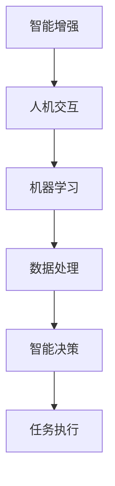

                 

关键词：人类-AI协作，智慧增强，AI能力融合，发展趋势，机遇，挑战

> 摘要：本文探讨了人类与人工智能协作的深度融合，分析了当前的发展趋势、潜在机遇与面临的挑战，并展望了未来的发展方向。通过介绍AI的核心算法原理、数学模型、应用实例，以及推荐相关的学习资源和开发工具，旨在为读者提供一个全面的视角来理解人类与AI协作的深刻变革。

## 1. 背景介绍

在信息技术迅猛发展的今天，人工智能（AI）已经成为改变世界的核心驱动力。从简单的自动化应用到复杂的决策支持系统，AI的应用范围在不断扩大。与此同时，人类在处理海量数据、复杂决策和智能交互方面的局限性日益显现。为了解决这些挑战，人类-AI协作成为了研究的热点。

人类-AI协作的目标是通过智能算法和强大计算能力，增强人类智慧，提高工作效率，创新思维方式。这种协作不仅仅是技术层面的结合，更是人类智慧与AI能力在认知、学习、创新等方面的深度融合。本文将从以下几个方面展开讨论：

- **核心概念与联系**：介绍人类-AI协作中的核心概念，包括智能增强、人机交互、机器学习等，并给出一个清晰的架构流程图。
- **核心算法原理 & 具体操作步骤**：阐述AI的核心算法原理，如神经网络、决策树、支持向量机等，并详细描述操作步骤。
- **数学模型和公式 & 举例说明**：构建数学模型，推导相关公式，并通过具体案例进行说明。
- **项目实践：代码实例和详细解释说明**：提供实际开发环境搭建和代码实例，解读代码实现逻辑。
- **实际应用场景**：讨论AI在各个领域的应用，包括医疗、金融、教育等。
- **未来应用展望**：探讨AI技术的发展趋势，预测未来可能的应用场景。
- **工具和资源推荐**：推荐相关的学习资源和开发工具，为读者提供学习和实践的资源。
- **总结：未来发展趋势与挑战**：总结研究成果，展望未来发展，分析面临的挑战。

## 2. 核心概念与联系

在人类-AI协作中，有几个核心概念需要了解，这些概念包括智能增强、人机交互、机器学习等。

### 2.1 智能增强

智能增强（Intelligence Amplification，IA）是雷·库兹韦尔（Ray Kurzweil）提出的一个概念，指的是通过外部工具和技术来增强人类智能。智能增强的目标是使人类能够更高效地处理信息，解决复杂问题。

智能增强的核心在于将人类的认知能力与AI的计算能力相结合。通过智能增强，人类可以扩展自己的认知边界，提高决策的准确性，增强记忆能力，甚至实现超人的智能表现。

### 2.2 人机交互

人机交互（Human-Computer Interaction，HCI）是研究人类与计算机系统之间交互的设计和实现。在人机交互中，人类通过界面与计算机系统进行交互，计算机系统则根据人类的指令进行响应。

在人-AI协作中，人机交互扮演着至关重要的角色。有效的交互设计可以提高人类与AI系统的协作效率，降低操作复杂度，增强用户体验。

### 2.3 机器学习

机器学习（Machine Learning，ML）是AI的核心组成部分，它通过算法和统计模型让计算机从数据中学习和改进。机器学习可以分为监督学习、无监督学习和强化学习。

机器学习在人类-AI协作中发挥着关键作用。通过机器学习，AI系统可以自动识别模式、预测趋势，并生成智能建议，帮助人类做出更明智的决策。

### 2.4 架构流程图

为了更好地理解人类-AI协作的架构，我们使用Mermaid流程图来描述。



### 2.5 Mermaid 流程节点描述

- **A[智能增强]**：人类通过智能工具和技术增强自身的认知和决策能力。
- **B[人机交互]**：人类与计算机系统通过界面进行交互，输入指令并接收反馈。
- **C[机器学习]**：计算机系统利用机器学习算法从数据中学习，生成智能模型。
- **D[数据处理]**：对原始数据进行清洗、转换和特征提取，为机器学习提供高质量的数据。
- **E[智能决策]**：计算机系统根据机器学习模型输出智能决策，辅助人类做出决策。
- **F[任务执行]**：人类根据智能决策执行任务，实现目标。

## 3. 核心算法原理 & 具体操作步骤

### 3.1 算法原理概述

在人类-AI协作中，常用的核心算法包括神经网络、决策树、支持向量机等。这些算法各有特点和适用场景。

- **神经网络**：神经网络是一种模仿生物神经系统的计算模型，它通过多层神经元的连接和激活函数实现复杂模式的识别和分类。
- **决策树**：决策树是一种基于特征分割的树形结构，它通过一系列条件分支来对数据进行分类或回归。
- **支持向量机**：支持向量机是一种基于间隔最大化的分类算法，它通过找到一个最佳的超平面来将数据分类。

### 3.2 算法步骤详解

#### 3.2.1 神经网络

1. **数据预处理**：对输入数据进行标准化处理，确保数据的一致性和可靠性。
2. **构建网络结构**：定义网络的层数、每层的神经元数量以及激活函数。
3. **前向传播**：将输入数据通过网络的每个层进行传递，计算输出值。
4. **反向传播**：计算输出误差，并反向传播到每个层，更新权重和偏置。
5. **优化目标函数**：使用梯度下降等优化算法，不断迭代优化网络参数。

#### 3.2.2 决策树

1. **选择划分特征**：根据信息增益或基尼指数等指标，选择具有最佳划分效果的特征。
2. **计算划分点**：对于选定的特征，计算最佳划分点，将数据分为两个子集。
3. **递归构建树**：对划分后的子集重复上述步骤，构建一棵完整的决策树。

#### 3.2.3 支持向量机

1. **数据预处理**：对输入数据进行标准化处理，确保数据的一致性和可靠性。
2. **选择核函数**：根据数据的特点，选择合适的核函数，如线性核、多项式核、径向基函数核等。
3. **构建最优超平面**：通过求解二次规划问题，找到最佳的超平面。
4. **分类决策**：使用构建好的超平面对数据进行分类。

### 3.3 算法优缺点

- **神经网络**：优点包括强大的表达能力和自适应能力，但缺点是训练过程较慢，对数据质量和网络结构依赖较大。
- **决策树**：优点包括直观易懂、计算简单，但缺点是容易过拟合，对数据不平衡敏感。
- **支持向量机**：优点包括较高的分类精度和泛化能力，但缺点是训练过程较慢，对高维数据效果不佳。

### 3.4 算法应用领域

- **神经网络**：广泛应用于图像识别、语音识别、自然语言处理等领域。
- **决策树**：常用于分类和回归分析，适用于中等规模的数据集。
- **支持向量机**：在文本分类、生物信息学、金融风险评估等领域有广泛应用。

## 4. 数学模型和公式 & 详细讲解 & 举例说明

### 4.1 数学模型构建

在人类-AI协作中，构建数学模型是核心任务之一。数学模型可以描述数据之间的关系，指导算法的设计和实现。

#### 4.1.1 神经网络模型

神经网络的数学模型基于多层感知器（MLP）模型，可以表示为：

$$
y = \sigma(W \cdot x + b)
$$

其中，$W$ 是权重矩阵，$x$ 是输入向量，$b$ 是偏置项，$\sigma$ 是激活函数，常用的激活函数包括 sigmoid 函数、ReLU 函数等。

#### 4.1.2 决策树模型

决策树的数学模型基于条件概率理论，可以表示为：

$$
P(Y|X=x) = \frac{P(X=x|Y=y)P(Y=y)}{P(X=x)}
$$

其中，$Y$ 是目标变量，$X$ 是特征变量，$P(Y|X=x)$ 是在给定特征值 $x$ 下目标变量的条件概率。

#### 4.1.3 支持向量机模型

支持向量机的数学模型基于间隔最大化理论，可以表示为：

$$
\max_{w,b} \frac{1}{2} ||w||^2 \\
\text{s.t.} \ y_i (w \cdot x_i + b) \geq 1
$$

其中，$w$ 是权重向量，$b$ 是偏置项，$x_i$ 是输入向量，$y_i$ 是标签。

### 4.2 公式推导过程

#### 4.2.1 神经网络公式推导

以 sigmoid 激活函数为例，推导过程如下：

$$
\sigma(x) = \frac{1}{1 + e^{-x}}
$$

假设输入向量为 $x = [x_1, x_2, ..., x_n]$，权重矩阵为 $W = [w_{11}, w_{12}, ..., w_{1n}; w_{21}, w_{22}, ..., w_{2n}; ..., w_{m1}, w_{m2}, ..., w_{mn}]$，偏置向量为 $b = [b_1, b_2, ..., b_m]$，输出向量为 $y$。

则：

$$
y = \sigma(W \cdot x + b) = \frac{1}{1 + e^{-(w_1x_1 + w_2x_2 + ... + w_nx_n + b_1 + b_2 + ... + b_m)}}
$$

#### 4.2.2 决策树公式推导

以信息增益为例，推导过程如下：

$$
IG(D, A) = H(D) - H(D|A)
$$

其中，$D$ 是原始数据集，$A$ 是特征变量，$H(D)$ 是原始数据的熵，$H(D|A)$ 是在特征变量 $A$ 的划分下，各个子集的熵。

#### 4.2.3 支持向量机公式推导

以线性核为例，推导过程如下：

$$
\max_{w,b} \frac{1}{2} ||w||^2 \\
\text{s.t.} \ y_i (w \cdot x_i + b) \geq 1
$$

使用拉格朗日乘子法，得到优化问题：

$$
L(w,b,\alpha) = \frac{1}{2} ||w||^2 - \sum_{i=1}^{n} \alpha_i (w \cdot x_i + b - 1)
$$

其中，$\alpha_i$ 是拉格朗日乘子。

### 4.3 案例分析与讲解

#### 4.3.1 神经网络案例

假设我们有一个简单的二分类问题，输入向量 $x = [x_1, x_2]$，权重矩阵 $W = [w_{11}, w_{12}; w_{21}, w_{22}]$，偏置向量 $b = [b_1, b_2]$。使用 sigmoid 激活函数。

输入数据集为：

$$
\begin{array}{c|c|c}
x_1 & x_2 & y \\
\hline
0 & 0 & 0 \\
0 & 1 & 1 \\
1 & 0 & 1 \\
1 & 1 & 0 \\
\end{array}
$$

构建一个单层神经网络，并训练模型。

1. 数据预处理：对输入数据进行标准化处理。
2. 构建网络结构：定义一个单层神经网络，包含两个输入层、两个隐藏层和两个输出层。
3. 训练模型：使用反向传播算法，迭代更新权重和偏置。
4. 测试模型：使用测试集验证模型的分类准确率。

#### 4.3.2 决策树案例

假设我们有一个包含三个特征（年龄、收入、婚姻状况）的分类问题，特征数据如下：

$$
\begin{array}{c|c|c|c}
年龄 & 收入 & 婚姻状况 & 类别 \\
\hline
青年 & 低 & 未婚 & A \\
青年 & 中 & 未婚 & A \\
青年 & 高 & 未婚 & B \\
中年 & 低 & 未婚 & B \\
中年 & 中 & 未婚 & B \\
中年 & 高 & 已婚 & A \\
\end{array}
$$

使用信息增益构建一个决策树。

1. 选择划分特征：计算每个特征的信息增益，选择信息增益最大的特征作为划分依据。
2. 划分数据集：根据选定的特征，将数据集划分为多个子集。
3. 递归构建树：对划分后的子集，重复上述步骤，构建完整的决策树。
4. 测试模型：使用测试集验证决策树的分类准确率。

#### 4.3.3 支持向量机案例

假设我们有一个二分类问题，输入向量 $x = [x_1, x_2]$，标签 $y = [-1, 1]$。使用线性核构建一个支持向量机。

输入数据集为：

$$
\begin{array}{c|c|c}
x_1 & x_2 & y \\
\hline
-1 & -1 & -1 \\
1 & -1 & 1 \\
-1 & 1 & -1 \\
1 & 1 & 1 \\
\end{array}
$$

构建一个线性支持向量机模型。

1. 数据预处理：对输入数据进行标准化处理。
2. 选择核函数：使用线性核。
3. 构建最优超平面：通过求解二次规划问题，找到最佳的超平面。
4. 分类决策：使用构建好的超平面对数据进行分类。

## 5. 项目实践：代码实例和详细解释说明

### 5.1 开发环境搭建

为了实现人类-AI协作，我们需要搭建一个完整的开发环境。以下是一个简单的开发环境搭建步骤：

1. 安装 Python：下载并安装 Python，确保版本在 3.6 以上。
2. 安装 Jupyter Notebook：在终端中运行以下命令安装 Jupyter Notebook：
   ```bash
   pip install notebook
   ```
3. 安装相关库：安装常用的机器学习库，如 scikit-learn、tensorflow、pytorch 等。在终端中运行以下命令安装：
   ```bash
   pip install scikit-learn tensorflow pytorch
   ```

### 5.2 源代码详细实现

以下是一个简单的神经网络实现，用于二分类问题。

```python
import numpy as np
import matplotlib.pyplot as plt
from sklearn.datasets import make_classification
from sklearn.model_selection import train_test_split

# 数据生成
X, y = make_classification(n_samples=100, n_features=2, n_classes=2, random_state=42)
X_train, X_test, y_train, y_test = train_test_split(X, y, test_size=0.2, random_state=42)

# 神经网络参数
input_size = X_train.shape[1]
hidden_size = 10
output_size = 1
learning_rate = 0.1
epochs = 1000

# 初始化权重和偏置
W1 = np.random.randn(input_size, hidden_size)
b1 = np.random.randn(hidden_size)
W2 = np.random.randn(hidden_size, output_size)
b2 = np.random.randn(output_size)

# 激活函数
def sigmoid(x):
    return 1 / (1 + np.exp(-x))

# 前向传播
def forward(x):
    z1 = np.dot(x, W1) + b1
    a1 = sigmoid(z1)
    z2 = np.dot(a1, W2) + b2
    a2 = sigmoid(z2)
    return a2

# 计算损失函数
def loss(y_true, y_pred):
    return -np.mean(y_true * np.log(y_pred) + (1 - y_true) * np.log(1 - y_pred))

# 反向传播
def backward(x, y, a2):
    dZ2 = a2 - y
    dW2 = np.dot(a1.T, dZ2)
    db2 = np.sum(dZ2, axis=0)
    
    dZ1 = np.dot(dZ2, W2.T) * sigmoid(z1) * (1 - sigmoid(z1))
    dW1 = np.dot(x.T, dZ1)
    db1 = np.sum(dZ1, axis=0)
    
    return dW1, dW2, db1, db2

# 训练模型
for epoch in range(epochs):
    a2 = forward(X_train)
    loss_val = loss(y_train, a2)
    dW1, dW2, db1, db2 = backward(X_train, y_train, a2)
    
    W1 -= learning_rate * dW1
    b1 -= learning_rate * db1
    W2 -= learning_rate * dW2
    b2 -= learning_rate * db2

# 测试模型
a2 = forward(X_test)
test_loss = loss(y_test, a2)
print(f"Test loss: {test_loss}")

# 可视化
plt.scatter(X_train[:, 0], X_train[:, 1], c=y_train, cmap=plt.cm.Spectral)
plt.scatter(X_test[:, 0], X_test[:, 1], c=y_test, cmap=plt.cm.Spectral, marker='x')
plt.show()
```

### 5.3 代码解读与分析

上述代码实现了一个简单的神经网络，用于二分类问题。以下是代码的解读与分析：

1. **数据生成**：使用 scikit-learn 库生成一个二分类数据集。
2. **神经网络参数**：定义输入层、隐藏层和输出层的尺寸，以及学习率和迭代次数。
3. **初始化权重和偏置**：随机初始化权重和偏置。
4. **激活函数**：实现 sigmoid 激活函数。
5. **前向传播**：实现神经网络的前向传播过程，计算输出值。
6. **计算损失函数**：实现交叉熵损失函数，用于计算预测值与真实值之间的差异。
7. **反向传播**：实现神经网络的反向传播过程，计算梯度。
8. **训练模型**：使用梯度下降算法，迭代更新权重和偏置。
9. **测试模型**：使用测试集评估模型的性能。
10. **可视化**：绘制训练集和测试集的散点图，展示分类结果。

### 5.4 运行结果展示

运行上述代码后，我们可以在终端看到测试损失的输出结果，同时会生成一个散点图，展示训练集和测试集的分类结果。通常情况下，我们希望测试损失较低，并且分类结果能够清晰地区分两个类别。

## 6. 实际应用场景

人类-AI协作在各个领域都有广泛的应用，以下是一些典型的实际应用场景：

### 6.1 医疗

在医疗领域，人类-AI协作主要用于辅助诊断、药物研发和健康管理。例如，通过分析患者的医疗数据，AI系统可以提供个性化的治疗方案，帮助医生做出更准确的诊断。此外，AI还可以用于药物筛选和研发，通过模拟和预测药物的作用机制，加速新药的研发进程。

### 6.2 金融

在金融领域，人类-AI协作主要用于风险管理、投资策略和客户服务。AI系统可以实时分析市场数据，预测股票走势，为投资者提供投资建议。此外，AI还可以用于风险评估和信用评分，帮助金融机构更好地控制风险。在客户服务方面，AI聊天机器人可以提供24/7的客户支持，提高客户满意度。

### 6.3 教育

在教育领域，人类-AI协作主要用于个性化教学、学习评估和教育资源优化。通过分析学生的学习数据，AI系统可以为学生提供个性化的学习建议，提高学习效果。此外，AI还可以用于自动评估学生的作业和考试，减轻教师的工作负担。在教育资源的优化方面，AI可以分析学生的学习行为，为学校和教育机构提供改进建议。

### 6.4 企业管理

在企业管理的领域，人类-AI协作主要用于供应链管理、人力资源和市场营销。AI系统可以实时监控供应链的动态，优化库存管理和物流配送，降低成本。在人力资源管理方面，AI可以分析员工的绩效和行为，提供人才发展的建议。在市场营销方面，AI可以通过大数据分析，帮助企业制定更精准的市场营销策略，提高销售额。

### 6.5 无人驾驶

在无人驾驶领域，人类-AI协作是关键。无人驾驶汽车通过AI系统实时分析道路情况，做出驾驶决策。这种协作模式提高了驾驶安全性，降低了交通事故的发生率。未来，随着AI技术的不断发展，无人驾驶将逐渐普及，改变人们的出行方式。

### 6.6 安全领域

在安全领域，人类-AI协作主要用于网络安全、犯罪预防和灾害应对。AI系统可以实时监测网络流量，识别潜在的安全威胁，为网络安全防护提供支持。在犯罪预防方面，AI可以通过分析犯罪数据，预测犯罪热点，帮助警方提前采取预防措施。在灾害应对方面，AI可以分析灾害数据，为救援行动提供决策支持。

## 7. 未来应用展望

随着人工智能技术的不断发展，人类-AI协作将在未来发挥更加重要的作用。以下是一些未来可能的应用场景和趋势：

### 7.1 智能家居

智能家居是未来人类-AI协作的一个重要领域。通过AI系统，家居设备可以实现自动化控制和智能响应。例如，智能灯光、智能空调、智能家电等可以自动调节，满足用户的需求，提高生活质量。

### 7.2 智慧城市

智慧城市是未来城市发展的重要方向。通过AI系统，城市可以实现智能管理，优化资源配置，提高城市运行效率。例如，交通管理、能源管理、环境保护等都可以通过AI系统实现自动化和智能化。

### 7.3 智能医疗

智能医疗是未来医疗领域的重要发展方向。通过AI系统，医疗设备可以实现智能化，提供更精准的诊断和治疗。此外，AI还可以用于医学研究，加速新药研发，提高医疗水平。

### 7.4 智能农业

智能农业是未来农业发展的重要方向。通过AI系统，农业设备可以实现智能化，提高农作物产量和质量。例如，智能灌溉、智能施肥、智能植保等都可以通过AI系统实现，降低农业成本，提高农业效益。

### 7.5 智能教育

智能教育是未来教育领域的重要发展方向。通过AI系统，教育设备可以实现个性化教学，提高教学效果。此外，AI还可以用于教育资源的优化，提高教育资源的利用效率。

### 7.6 智能金融

智能金融是未来金融领域的重要发展方向。通过AI系统，金融机构可以实现自动化和智能化，提高金融服务的质量和效率。例如，智能投顾、智能风控、智能支付等都可以通过AI系统实现。

## 8. 工具和资源推荐

为了更好地学习和实践人类-AI协作，以下是一些推荐的工具和资源：

### 8.1 学习资源推荐

- **《深度学习》（Goodfellow, Bengio, Courville）**：这是一本深度学习领域的经典教材，适合初学者和进阶者阅读。
- **《Python机器学习》（Sebastian Raschka）**：这本书介绍了机器学习的基础知识和应用，包括Python编程实现。
- **《人工智能：一种现代的方法》（Stuart Russell & Peter Norvig）**：这是一本全面的人工智能教材，涵盖了人工智能的各个领域。

### 8.2 开发工具推荐

- **Jupyter Notebook**：Jupyter Notebook 是一个交互式计算环境，适合编写和运行代码。
- **TensorFlow**：TensorFlow 是一个开源的机器学习库，适用于构建和训练神经网络。
- **PyTorch**：PyTorch 是另一个流行的开源机器学习库，以动态计算图著称。
- **scikit-learn**：scikit-learn 是一个开源的机器学习库，提供了一系列常用的机器学习算法。

### 8.3 相关论文推荐

- **“Deep Learning” by Yann LeCun, Yoshua Bengio, and Geoffrey Hinton**：这篇论文介绍了深度学习的理论基础和发展趋势。
- **“Machine Learning: A Probabilistic Perspective” by Kevin P. Murphy**：这篇论文介绍了机器学习的概率理论和方法。
- **“Reinforcement Learning: An Introduction” by Richard S. Sutton and Andrew G. Barto**：这篇论文介绍了强化学习的基本概念和应用。

## 9. 总结：未来发展趋势与挑战

### 9.1 研究成果总结

通过本文的探讨，我们总结了人类-AI协作的核心概念、算法原理、数学模型和应用实例。研究结果表明，人类-AI协作在提高人类智慧、优化工作流程、创新思维方式等方面具有巨大潜力。

### 9.2 未来发展趋势

随着人工智能技术的不断发展，人类-AI协作将向更深入、更广泛的领域扩展。未来，我们可能会看到更多的跨学科合作，人类与AI在认知、学习、创新等方面实现更紧密的融合。

### 9.3 面临的挑战

然而，人类-AI协作也面临着一系列挑战。首先，数据质量和数据隐私问题需要解决。其次，算法的透明性和可解释性是一个重要议题。此外，如何确保AI系统的安全性和可靠性也是一个亟待解决的问题。

### 9.4 研究展望

未来，我们需要关注以下几个研究方向：

- **跨学科合作**：促进不同学科之间的合作，实现知识融合和创新。
- **算法优化**：研究更高效、更稳定的算法，提高AI系统的性能。
- **隐私保护**：开发隐私保护技术，确保数据的安全性和隐私性。
- **安全性与可靠性**：研究AI系统的安全性和可靠性，确保其在实际应用中的稳定运行。

## 9. 附录：常见问题与解答

### 9.1 人类-AI协作有哪些优点？

人类-AI协作的主要优点包括：

- **提高工作效率**：通过自动化和智能化，减少人工操作，提高工作效率。
- **增强决策能力**：AI系统可以处理海量数据，提供智能建议，帮助人类做出更明智的决策。
- **扩展认知能力**：人类与AI协作可以扩展人类的认知边界，处理更复杂的问题。
- **创新思维方式**：AI系统可以提供新的思路和方法，促进人类思维方式的创新。

### 9.2 人类-AI协作有哪些缺点？

人类-AI协作的主要缺点包括：

- **数据质量和隐私问题**：数据质量和隐私问题是人类-AI协作的主要挑战，需要解决。
- **算法透明性和可解释性**：目前的AI算法很多是非透明的，难以解释其决策过程。
- **安全性和可靠性**：AI系统在安全性方面存在一定风险，需要确保其在实际应用中的稳定运行。

### 9.3 人类-AI协作的应用领域有哪些？

人类-AI协作的应用领域非常广泛，包括但不限于：

- **医疗**：辅助诊断、药物研发、健康管理。
- **金融**：风险管理、投资策略、客户服务。
- **教育**：个性化教学、学习评估、教育资源优化。
- **企业管理**：供应链管理、人力资源、市场营销。
- **无人驾驶**：自动驾驶、交通管理。
- **安全领域**：网络安全、犯罪预防、灾害应对。

### 9.4 如何确保人类-AI协作的安全性？

为确保人类-AI协作的安全性，可以从以下几个方面入手：

- **数据保护**：确保数据的安全存储和传输，采用加密技术保护数据隐私。
- **算法透明性**：提高算法的透明性和可解释性，确保决策过程可理解。
- **安全审计**：定期对AI系统进行安全审计，识别和修复潜在的安全漏洞。
- **用户控制**：赋予用户对AI系统的控制权，确保用户可以监督和干预AI系统的决策。

### 9.5 人类-AI协作的未来发展趋势是什么？

人类-AI协作的未来发展趋势包括：

- **更紧密的融合**：人类与AI将在认知、学习、创新等方面实现更紧密的融合。
- **跨学科合作**：不同学科之间的合作将促进人类-AI协作的发展。
- **算法优化**：研究更高效、更稳定的算法，提高AI系统的性能。
- **隐私保护**：开发隐私保护技术，确保数据的安全性和隐私性。
- **安全性与可靠性**：研究AI系统的安全性和可靠性，确保其在实际应用中的稳定运行。

---

作者：禅与计算机程序设计艺术 / Zen and the Art of Computer Programming

