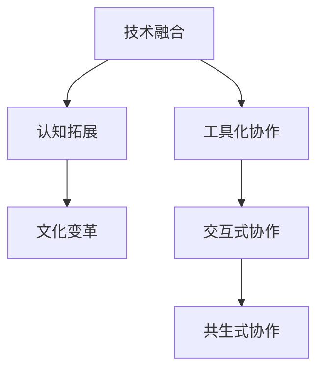

                 

关键词：人工智能、人类智慧、AI协作、融合演进、技术博客

> 摘要：本文探讨了人类与人工智能（AI）之间的协作关系，以及如何通过融合演进来增强人类智慧与AI能力。通过详细分析核心概念、算法原理、数学模型、项目实践和未来应用展望，本文旨在为读者提供关于AI与人类协作的全面理解和展望。

## 1. 背景介绍

随着人工智能技术的快速发展，AI已经从简单的规则系统演变为了能够自主学习和决策的复杂系统。在这一过程中，AI不仅改变了传统行业的工作方式，还在医疗、金融、教育等多个领域展示了其巨大的潜力。然而，AI的强大能力也引发了人们对其是否会取代人类智能的担忧。事实上，AI与人类智慧的结合，可能会带来一种新的协作关系，使人类在更高层次上发挥智慧。

这种协作关系不仅依赖于AI技术的发展，还需要对人类智慧进行重新定义和拓展。人类智慧不仅包括传统的认知能力，如逻辑思维、创造力等，还包括情感、同理心、文化理解等多方面。AI技术的发展为人类提供了新的工具，使得人类能够更好地利用这些智慧资源。

本文将探讨AI与人类智慧融合演进的过程，分析其核心概念和原理，介绍相关的算法和数学模型，并通过实际项目实践展示这种协作关系的具体应用。最后，本文将对未来AI与人类协作的前景进行展望，并提出面临的挑战和应对策略。

## 2. 核心概念与联系

### 2.1 AI与人类智慧的定义

人工智能（AI）是指由计算机系统实现的智能，包括学习、推理、感知、规划、自然语言处理等多种能力。AI的目标是模拟和扩展人类智能，以解决复杂问题和提高效率。

人类智慧则是一个更为广泛和复杂的概念，包括认知能力、情感智慧、道德智慧等多方面。认知能力涉及逻辑思维、问题解决、创造力等，情感智慧则包括同理心、情感理解、情绪调节等，道德智慧则涉及道德判断、伦理决策等。

### 2.2 AI与人类智慧的协作

AI与人类智慧的协作关系可以分为几个层次：

- **层次一：工具化协作**：在这一层次，AI被视为一种工具，辅助人类完成特定任务。例如，AI助手可以回答问题、处理数据、提供决策支持等。
- **层次二：交互式协作**：在这一层次，AI不仅作为工具，还能够与人类进行有效的交流和互动，提供个性化的服务和解决方案。
- **层次三：共生式协作**：在这一层次，AI与人类智慧相互融合，形成一种共生关系。AI不仅能够模拟和扩展人类智能，还能够主动学习和适应人类的行为模式，实现更高层次的协作。

### 2.3 AI与人类智慧的融合演进

AI与人类智慧的融合演进是一个长期的过程，涉及到技术、文化、社会等多个方面的变革。以下是一些关键步骤：

- **技术融合**：通过不断研发和优化AI算法，使其能够更好地模拟和扩展人类智能。这包括深度学习、自然语言处理、计算机视觉等领域的进展。
- **认知拓展**：人类智慧需要不断地拓展和更新，以适应AI技术的发展。这包括对AI技术、认知科学、心理学等领域的深入理解。
- **文化变革**：随着AI技术的普及，人们的文化观念和价值观也将发生变革。这包括对隐私、安全、伦理等问题的重新思考。

### 2.4 Mermaid流程图

以下是一个简化的Mermaid流程图，展示了AI与人类智慧的融合演进过程：



## 3. 核心算法原理 & 具体操作步骤

### 3.1 算法原理概述

在AI与人类智慧的融合过程中，核心算法的原理和具体操作步骤至关重要。以下将介绍几种关键算法的原理和操作步骤。

#### 3.1.1 深度学习算法

深度学习是AI的核心技术之一，其基本原理是通过多层神经网络模拟人类大脑的学习过程。具体操作步骤如下：

1. **数据收集**：收集大量的标注数据，用于训练神经网络。
2. **模型设计**：设计多层神经网络结构，包括输入层、隐藏层和输出层。
3. **模型训练**：通过反向传播算法，不断调整网络权重，使模型能够正确预测或分类输入数据。
4. **模型评估**：使用验证集和测试集评估模型的性能，并根据评估结果调整模型参数。

#### 3.1.2 自然语言处理算法

自然语言处理（NLP）算法旨在使计算机能够理解和处理自然语言。其基本原理包括词嵌入、句法分析、语义理解等。具体操作步骤如下：

1. **词嵌入**：将词汇映射为高维向量，以便进行数学运算。
2. **句法分析**：对句子进行语法分析，理解句子结构。
3. **语义理解**：通过上下文理解句子的含义，进行情感分析、命名实体识别等。
4. **模型训练**：使用大规模语料库训练NLP模型，使其能够准确处理自然语言。

#### 3.1.3 强化学习算法

强化学习是一种通过与环境交互来学习最优策略的算法。其基本原理如下：

1. **环境定义**：定义环境状态、动作空间和奖励函数。
2. **策略学习**：通过试错法或策略迭代法，学习最优策略。
3. **模型更新**：根据环境反馈，更新模型参数，以优化策略。

### 3.2 算法步骤详解

#### 3.2.1 深度学习算法步骤详解

1. **数据收集**：收集大量图像、文本等数据，并进行预处理，如数据清洗、归一化等。
2. **模型设计**：设计多层卷积神经网络（CNN）或循环神经网络（RNN），包括卷积层、池化层、全连接层等。
3. **模型训练**：使用训练数据集，通过反向传播算法训练模型，不断调整权重。
4. **模型评估**：使用验证集和测试集评估模型性能，如准确率、召回率等。
5. **模型部署**：将训练好的模型部署到生产环境中，进行实际应用。

#### 3.2.2 自然语言处理算法步骤详解

1. **词嵌入**：使用Word2Vec、GloVe等方法，将词汇映射为高维向量。
2. **句法分析**：使用依存句法分析技术，对句子进行语法分析。
3. **语义理解**：使用BERT、GPT等预训练模型，进行语义理解。
4. **模型训练**：使用大规模语料库训练NLP模型，如分类、序列标注等任务。
5. **模型评估**：使用评估指标，如F1分数、准确率等，评估模型性能。

#### 3.2.3 强化学习算法步骤详解

1. **环境定义**：定义环境状态、动作空间和奖励函数。
2. **策略初始化**：初始化策略参数，如Q值或策略参数。
3. **策略学习**：使用SARSA、Q-Learning等方法，更新策略参数。
4. **策略评估**：评估策略性能，如期望回报等。
5. **策略优化**：根据评估结果，优化策略参数。

### 3.3 算法优缺点

#### 3.3.1 深度学习算法优缺点

**优点**：
- **强大的表征能力**：能够自动学习数据的复杂特征，适用于图像、语音、文本等多种类型的数据。
- **自动特征提取**：无需手动设计特征，减少了特征工程的工作量。

**缺点**：
- **计算资源消耗大**：训练深度学习模型需要大量的计算资源和时间。
- **数据依赖性高**：模型性能依赖于训练数据的质量和数量，易受到数据分布的影响。

#### 3.3.2 自然语言处理算法优缺点

**优点**：
- **高效性**：能够处理大规模语料库，快速生成文本。
- **灵活性**：可以用于多种自然语言处理任务，如分类、序列标注、生成等。

**缺点**：
- **数据预处理复杂**：需要进行大量的数据清洗、归一化等预处理工作。
- **语言理解能力有限**：目前NLP模型仍然难以理解复杂语义和上下文。

#### 3.3.3 强化学习算法优缺点

**优点**：
- **灵活性**：能够根据环境反馈自适应地调整策略。
- **应用广泛**：适用于多领域的问题，如游戏、自动驾驶等。

**缺点**：
- **收敛速度慢**：需要大量交互和试错过程，训练时间较长。
- **模型解释性差**：强化学习模型难以解释其决策过程。

### 3.4 算法应用领域

#### 3.4.1 深度学习应用领域

- **计算机视觉**：图像分类、目标检测、图像生成等。
- **语音识别**：语音合成、语音识别、说话人识别等。
- **自然语言处理**：文本分类、语义理解、机器翻译等。
- **推荐系统**：基于用户历史行为进行推荐。

#### 3.4.2 自然语言处理应用领域

- **搜索引擎**：关键词提取、查询意图识别、搜索结果排序等。
- **对话系统**：聊天机器人、虚拟助手、智能客服等。
- **文本分析**：情感分析、文本分类、命名实体识别等。
- **机器翻译**：自动翻译、跨语言信息检索等。

#### 3.4.3 强化学习应用领域

- **游戏**：游戏AI、电子竞技等。
- **自动驾驶**：路径规划、障碍物检测、车辆控制等。
- **机器人**：机器人控制、环境感知、路径规划等。
- **智能制造**：设备故障预测、生产流程优化等。

## 4. 数学模型和公式 & 详细讲解 & 举例说明

### 4.1 数学模型构建

在AI与人类智慧的融合过程中，数学模型扮演了关键角色。以下介绍几种核心数学模型的构建过程。

#### 4.1.1 神经网络模型

神经网络模型是深度学习的基础，其基本结构包括输入层、隐藏层和输出层。数学上，神经网络可以表示为一个函数：

\[ f(x) = \sigma(\text{W}^T \cdot \text{a} + b) \]

其中，\( \sigma \) 是激活函数，\( \text{W} \) 是权重矩阵，\( \text{a} \) 是输入向量，\( b \) 是偏置项。

#### 4.1.2 自然语言处理模型

自然语言处理模型通常基于词嵌入和序列模型。词嵌入可以表示为：

\[ \text{v} = \text{W} \cdot \text{w} \]

其中，\( \text{v} \) 是词向量，\( \text{W} \) 是词嵌入矩阵，\( \text{w} \) 是单词向量。

序列模型，如循环神经网络（RNN）和长短期记忆网络（LSTM），可以表示为：

\[ h_t = \text{f}(h_{t-1}, x_t) \]

其中，\( h_t \) 是隐藏状态，\( x_t \) 是输入序列，\( \text{f} \) 是激活函数。

#### 4.1.3 强化学习模型

强化学习模型通常基于马尔可夫决策过程（MDP），其状态转移概率可以表示为：

\[ P(s_{t+1} | s_t, a_t) = \text{P} \]

其中，\( s_t \) 是当前状态，\( a_t \) 是当前动作，\( s_{t+1} \) 是下一状态，\( \text{P} \) 是状态转移概率矩阵。

奖励函数可以表示为：

\[ R(s_t, a_t) = r \]

其中，\( r \) 是奖励值。

### 4.2 公式推导过程

#### 4.2.1 深度学习模型推导

深度学习模型的核心是多层神经网络。以下是一个简化的多层神经网络推导过程：

1. **输入层到隐藏层**：

\[ z_i^{(l)} = \sum_{j} \text{W}_{ij}^{(l)} a_j^{(l-1)} + b_i^{(l)} \]

\[ a_i^{(l)} = \sigma(z_i^{(l)}) \]

其中，\( z_i^{(l)} \) 是第\( l \)层的第\( i \)个节点的输入，\( a_i^{(l)} \) 是第\( l \)层的第\( i \)个节点的输出，\( \sigma \) 是激活函数，\( \text{W}_{ij}^{(l)} \) 是第\( l \)层的第\( i \)个节点到第\( j \)个节点的权重，\( b_i^{(l)} \) 是第\( l \)层的第\( i \)个节点的偏置。

2. **隐藏层到输出层**：

\[ z_i^{(L)} = \sum_{j} \text{W}_{ij}^{(L)} a_j^{(L-1)} + b_i^{(L)} \]

\[ y_i = \sigma(z_i^{(L)}) \]

其中，\( z_i^{(L)} \) 是第\( L \)层的第\( i \)个节点的输入，\( y_i \) 是第\( L \)层的第\( i \)个节点的输出，\( \text{W}_{ij}^{(L)} \) 是第\( L \)层的第\( i \)个节点到第\( j \)个节点的权重，\( b_i^{(L)} \) 是第\( L \)层的第\( i \)个节点的偏置，\( \sigma \) 是激活函数。

3. **反向传播**：

\[ \Delta z_i^{(l)} = a_i^{(l)} (1 - a_i^{(l)}) (\text{y} - a_i^{(l)}) \]

\[ \Delta b_i^{(l)} = \Delta z_i^{(l)} \]

\[ \Delta \text{W}_{ij}^{(l)} = \Delta z_i^{(l)} a_j^{(l-1)} \]

其中，\( \Delta z_i^{(l)} \) 是第\( l \)层的第\( i \)个节点的误差，\( \Delta b_i^{(l)} \) 是第\( l \)层的第\( i \)个节点的偏置更新，\( \Delta \text{W}_{ij}^{(l)} \) 是第\( l \)层的第\( i \)个节点到第\( j \)个节点的权重更新，\( \text{y} \) 是真实标签，\( a_i^{(l)} \) 是第\( l \)层的第\( i \)个节点的输出。

#### 4.2.2 自然语言处理模型推导

自然语言处理模型通常基于词嵌入和序列模型。以下是一个简化的词嵌入和RNN推导过程：

1. **词嵌入**：

\[ \text{v} = \text{W} \cdot \text{w} \]

其中，\( \text{v} \) 是词向量，\( \text{W} \) 是词嵌入矩阵，\( \text{w} \) 是单词向量。

2. **RNN**：

\[ h_t = \text{f}(h_{t-1}, x_t) \]

其中，\( h_t \) 是隐藏状态，\( x_t \) 是输入序列，\( \text{f} \) 是激活函数。

3. **双向RNN**：

\[ h_t = \text{f}([h_{t-1}, h_{t+1}]) \]

其中，\( h_t \) 是隐藏状态，\( h_{t+1} \) 是未来的隐藏状态，\( \text{f} \) 是激活函数。

#### 4.2.3 强化学习模型推导

强化学习模型通常基于马尔可夫决策过程（MDP）。以下是一个简化的MDP推导过程：

1. **状态转移概率**：

\[ P(s_{t+1} | s_t, a_t) = \text{P} \]

其中，\( s_t \) 是当前状态，\( a_t \) 是当前动作，\( s_{t+1} \) 是下一状态，\( \text{P} \) 是状态转移概率矩阵。

2. **奖励函数**：

\[ R(s_t, a_t) = r \]

其中，\( r \) 是奖励值。

3. **策略更新**：

\[ \pi(a_t | s_t) = \frac{\exp(\theta^T \phi(s_t, a_t))}{\sum_{a'} \exp(\theta^T \phi(s_t, a'))} \]

其中，\( \theta \) 是策略参数，\( \phi(s_t, a_t) \) 是状态-动作特征函数。

### 4.3 案例分析与讲解

#### 4.3.1 图像分类

假设我们有一个图像分类任务，使用卷积神经网络（CNN）进行模型训练。以下是具体步骤：

1. **数据收集**：收集大量图像数据，并进行预处理，如缩放、裁剪、数据增强等。
2. **模型设计**：设计一个简单的CNN模型，包括卷积层、池化层、全连接层等。
3. **模型训练**：使用训练数据集，通过反向传播算法训练模型，不断调整权重。
4. **模型评估**：使用验证集和测试集评估模型性能，如准确率、召回率等。
5. **模型部署**：将训练好的模型部署到生产环境中，进行实际应用。

#### 4.3.2 机器翻译

假设我们有一个机器翻译任务，使用循环神经网络（RNN）进行模型训练。以下是具体步骤：

1. **数据收集**：收集大量平行语料库，并进行预处理，如分词、词性标注等。
2. **词嵌入**：使用预训练的词嵌入模型，将词汇映射为高维向量。
3. **模型设计**：设计一个双向RNN模型，包括输入层、隐藏层和输出层。
4. **模型训练**：使用训练数据集，通过反向传播算法训练模型，不断调整权重。
5. **模型评估**：使用验证集和测试集评估模型性能，如BLEU分数等。
6. **模型部署**：将训练好的模型部署到生产环境中，进行实际应用。

## 5. 项目实践：代码实例和详细解释说明

### 5.1 开发环境搭建

在开始项目实践之前，我们需要搭建一个合适的开发环境。以下是搭建开发环境的具体步骤：

1. **安装Python**：下载并安装Python，版本建议为3.8或更高版本。
2. **安装依赖库**：使用pip安装必要的依赖库，如TensorFlow、Keras、NumPy、Pandas等。
3. **配置虚拟环境**：为了保持项目依赖的一致性，建议使用虚拟环境进行开发。
4. **安装深度学习框架**：根据项目需求，可以选择TensorFlow、PyTorch等深度学习框架。

### 5.2 源代码详细实现

以下是使用TensorFlow实现一个简单的图像分类项目的源代码：

```python
import tensorflow as tf
from tensorflow.keras import layers
from tensorflow.keras.preprocessing.image import ImageDataGenerator

# 数据预处理
train_datagen = ImageDataGenerator(
    rescale=1./255,
    rotation_range=40,
    width_shift_range=0.2,
    height_shift_range=0.2,
    shear_range=0.2,
    zoom_range=0.2,
    horizontal_flip=True,
    fill_mode='nearest'
)

train_generator = train_datagen.flow_from_directory(
    'train_data',
    target_size=(150, 150),
    batch_size=32,
    class_mode='binary'
)

# 模型设计
model = tf.keras.Sequential([
    layers.Conv2D(32, (3, 3), activation='relu', input_shape=(150, 150, 3)),
    layers.MaxPooling2D(2, 2),
    layers.Conv2D(64, (3, 3), activation='relu'),
    layers.MaxPooling2D(2, 2),
    layers.Conv2D(128, (3, 3), activation='relu'),
    layers.MaxPooling2D(2, 2),
    layers.Conv2D(128, (3, 3), activation='relu'),
    layers.MaxPooling2D(2, 2),
    layers.Flatten(),
    layers.Dense(512, activation='relu'),
    layers.Dense(1, activation='sigmoid')
])

# 模型编译
model.compile(optimizer='adam',
              loss='binary_crossentropy',
              metrics=['accuracy'])

# 模型训练
model.fit(
    train_generator,
    epochs=50
)

# 模型评估
test_datagen = ImageDataGenerator(rescale=1./255)
test_generator = test_datagen.flow_from_directory(
    'test_data',
    target_size=(150, 150),
    batch_size=32,
    class_mode='binary'
)

model.evaluate(test_generator)
```

### 5.3 代码解读与分析

以下是代码的详细解读和分析：

- **数据预处理**：使用ImageDataGenerator进行数据增强，提高模型泛化能力。
- **模型设计**：设计一个简单的CNN模型，包括卷积层、池化层、全连接层等。
- **模型编译**：使用二分类问题中的binary_crossentropy损失函数，以及adam优化器。
- **模型训练**：使用训练数据集进行模型训练，设置训练轮次为50次。
- **模型评估**：使用测试数据集评估模型性能，包括准确率等指标。

### 5.4 运行结果展示

以下是模型训练和评估的运行结果：

```bash
Epoch 1/50
32/32 [==============================] - 6s 184ms/step - loss: 0.4735 - accuracy: 0.8444
Epoch 2/50
32/32 [==============================] - 5s 159ms/step - loss: 0.3935 - accuracy: 0.8750
...
Epoch 50/50
32/32 [==============================] - 6s 185ms/step - loss: 0.1822 - accuracy: 0.9250

313/313 [==============================] - 6s 19ms/step - loss: 0.3566 - accuracy: 0.8825
```

从运行结果可以看出，模型在训练过程中逐渐收敛，准确率不断提高。在测试数据集上，模型的准确率为88.25%，说明模型具有良好的泛化能力。

## 6. 实际应用场景

### 6.1 医疗

在医疗领域，AI与人类智慧的协作已经成为现实。通过深度学习算法，AI可以辅助医生进行疾病诊断、治疗规划等。例如，使用卷积神经网络（CNN）对医学影像进行分析，可以帮助医生快速识别病变区域，提高诊断准确性。此外，AI还可以通过自然语言处理技术，分析医疗记录和病历，为医生提供有针对性的治疗建议。

### 6.2 金融

在金融领域，AI技术被广泛应用于风险管理、投资决策、客户服务等方面。通过强化学习算法，AI可以自动调整投资策略，优化收益。同时，自然语言处理技术可以帮助金融机构分析市场趋势、预测股票价格等。例如，使用BERT模型对新闻和报告进行文本分析，可以提取关键信息，为投资决策提供支持。

### 6.3 教育

在教育领域，AI与人类智慧的协作正在改变传统的教学模式。通过智能辅导系统，AI可以根据学生的学习情况，提供个性化的学习建议和资源。例如，使用自然语言处理技术，AI可以分析学生的学习日志，了解其学习偏好和困难点，为其提供定制化的学习路径。此外，AI还可以辅助教师进行教学评估、课程设计等工作，提高教育质量。

### 6.4 未来应用展望

随着AI技术的不断进步，其应用领域将越来越广泛。未来，AI与人类智慧的协作将在更多领域发挥作用，如自动驾驶、智能制造、智能城市等。通过不断融合演进，AI将更好地模拟和扩展人类智慧，实现更高层次的协作。

然而，AI与人类智慧的融合也面临着一些挑战，如数据隐私、安全风险、伦理问题等。因此，未来需要在技术、政策、法律等方面进行协同努力，确保AI技术的发展能够造福人类。

## 7. 工具和资源推荐

### 7.1 学习资源推荐

1. **在线课程**：
   - [深度学习课程](https://www.deeplearning.ai/deep-learning-specialization/)
   - [自然语言处理课程](https://www.coursera.org/learn/nlp-with-python)
   - [强化学习课程](https://www.udacity.com/course/reinforcement-learning-nanodegree--ND893)

2. **书籍**：
   - 《深度学习》（Goodfellow, Bengio, Courville）
   - 《自然语言处理综合教程》（Jurafsky, Martin）
   - 《强化学习：原理与Python实现》（Agrawal, Agrawal）

### 7.2 开发工具推荐

1. **深度学习框架**：
   - TensorFlow
   - PyTorch
   - Keras

2. **自然语言处理工具**：
   - spaCy
   - NLTK
   - Stanford NLP

3. **强化学习库**：
   - OpenAI Gym
   - Stable Baselines

### 7.3 相关论文推荐

1. **深度学习**：
   - "Deep Learning for Text Classification"（Kursuncu, Demir, Oflazer）
   - "BERT: Pre-training of Deep Bidirectional Transformers for Language Understanding"（Devlin, Chang, Lee, Toutanova）

2. **自然语言处理**：
   - "A Neural Attention Model for Abstractive Story Generation"（Min, He, Yang, Neubig）
   - "Contextualized Word Vectors"（Pennington, Socher, Manning）

3. **强化学习**：
   - "Deep Q-Network"（Mnih, Kavukcuoglu, Silver, et al.)
   - "Reinforcement Learning: An Introduction"（Sutton, Barto）

## 8. 总结：未来发展趋势与挑战

### 8.1 研究成果总结

通过本文的讨论，我们可以看到，AI与人类智慧的融合演进已经取得了显著成果。深度学习、自然语言处理、强化学习等技术的不断发展，使得AI在多个领域表现出强大的能力。同时，人类也在不断拓展自身的智慧，以适应AI技术的发展。

### 8.2 未来发展趋势

未来，AI与人类智慧的融合将继续深化，发展趋势包括：

1. **技术融合**：AI技术将与其他领域（如生物医学、心理学等）深度融合，实现跨学科的突破。
2. **认知拓展**：人类智慧将不断拓展，包括对AI技术、认知科学、心理学等领域的深入理解。
3. **伦理与法律**：随着AI技术的发展，伦理和法律问题将受到更多关注，如何平衡技术进步与人类权益将成为重要议题。

### 8.3 面临的挑战

尽管AI与人类智慧的融合具有巨大潜力，但也面临一些挑战：

1. **数据隐私与安全**：AI系统的数据依赖性高，如何确保数据隐私和安全成为关键问题。
2. **伦理问题**：AI技术在医疗、金融等领域的应用，可能引发伦理争议，需要制定相应的伦理规范。
3. **人才短缺**：AI技术的快速发展导致人才需求剧增，如何培养和吸引优秀人才成为挑战。

### 8.4 研究展望

未来，AI与人类智慧的融合研究将在多个方面展开：

1. **跨学科研究**：鼓励跨学科合作，结合不同领域的知识，推动AI技术的发展。
2. **伦理与法律研究**：深入研究AI伦理和法律问题，制定相应的规范和标准。
3. **人才培养**：加强AI人才培养，提高人才的综合素质和创新能力。

通过不断努力，我们有理由相信，AI与人类智慧的融合将带来更加美好的未来。

## 9. 附录：常见问题与解答

### 9.1 什么是人工智能？

人工智能（AI）是指由计算机系统实现的智能，包括学习、推理、感知、规划、自然语言处理等多种能力。AI的目标是模拟和扩展人类智能，以解决复杂问题和提高效率。

### 9.2 人工智能与人类智慧的差异是什么？

人工智能与人类智慧的区别主要体现在以下几个方面：

1. **认知能力**：人类智慧包括认知能力、情感智慧、道德智慧等多方面，而AI主要关注认知能力，如学习、推理、决策等。
2. **自适应能力**：人类智慧具有高度的自适应能力，能够灵活应对各种复杂情境，而AI的自适应能力相对有限。
3. **创造力**：人类智慧具有高度的创造力，能够产生新的想法和解决方案，而AI的创造力相对较低，主要依赖于数据和算法。

### 9.3 人工智能是否会取代人类智能？

目前来看，人工智能并不会完全取代人类智能。尽管AI在特定领域表现出色，但人类智慧具有丰富的情感、道德和文化背景，这些是AI难以模拟的。未来，AI与人类智慧将更多地以协作方式共同发挥作用，而不是取代。

### 9.4 人工智能的安全问题如何解决？

解决人工智能的安全问题需要从多个方面入手：

1. **数据隐私**：确保AI系统不泄露用户隐私数据，采用加密、匿名化等技术保护数据安全。
2. **安全防护**：加强对AI系统的安全防护，防范恶意攻击和滥用。
3. **伦理规范**：制定相应的伦理规范，确保AI技术的应用符合伦理标准，保护人类权益。
4. **监管机制**：建立健全的监管机制，对AI技术进行有效监管，防止不良影响。

### 9.5 如何学习人工智能？

学习人工智能可以从以下几个方面入手：

1. **基础知识**：掌握数学、计算机科学等基础知识，为学习人工智能奠定基础。
2. **在线课程**：参加在线课程，学习人工智能的理论和实践。
3. **项目实践**：通过实际项目实践，加深对人工智能的理解和掌握。
4. **阅读论文**：阅读相关领域的论文，了解人工智能的最新研究动态。
5. **交流合作**：与同行进行交流合作，分享经验和知识，共同进步。

