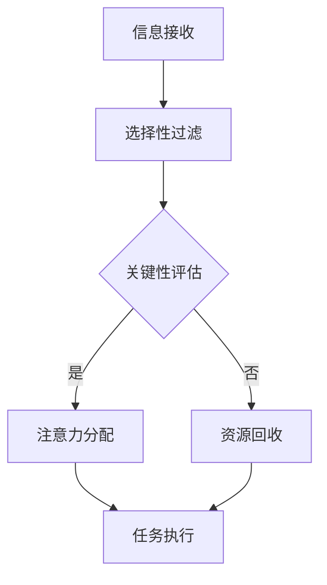

                 

关键词：人类注意力增强，专注力，商业应用，未来趋势，技术发展

> 摘要：本文深入探讨了人类注意力增强的原理及其在商业中的潜在应用。通过分析注意力增强的技术和算法，本文揭示了如何利用先进技术提升人类在商业环境中的专注力和工作效率，并展望了这一领域的未来发展趋势和挑战。

## 1. 背景介绍

在当今快速发展的数字化时代，人类面临着前所未有的信息过载挑战。无论是个人生活还是商业活动，人们都需要在短时间内处理大量的信息。然而，人类的大脑处理能力有限，长时间的注意力分散和信息过载会降低工作效率，甚至导致决策错误。因此，如何增强人类的注意力，提高专注力，成为了当代商业领域关注的焦点。

近年来，随着人工智能和神经科学的发展，注意力增强技术逐渐成熟。这些技术通过算法优化、脑机接口和智能环境设计等多种方式，帮助用户在复杂环境中保持高度的专注和注意力。在商业环境中，这意味着可以显著提升员工的工作效率，促进创新和决策质量，从而带来巨大的经济价值。

## 2. 核心概念与联系

### 2.1. 注意力增强技术概述

注意力增强技术主要包括以下几个核心组成部分：

1. **算法优化**：通过机器学习算法分析用户的注意力模式，优化任务分配和时间管理。
2. **脑机接口（BMI）**：利用生物电信号与计算机系统直接交互，增强用户的感知和控制能力。
3. **智能环境设计**：通过环境布局和智能系统的支持，减少干扰，提高注意力集中度。
4. **神经反馈**：利用大脑反馈信号调整行为，增强注意力。

### 2.2. 注意力增强原理与架构

注意力增强的原理基于人类大脑的信息处理机制。大脑通过神经网络的动态变化来分配注意力资源，处理外部输入信息。注意力增强技术通过以下方式实现：

1. **选择性注意力**：通过算法识别和筛选关键信息，减少无关信息的干扰。
2. **适应性注意力**：根据任务需求和环境变化动态调整注意力分配。
3. **增强认知资源**：利用神经反馈和脑机接口技术，增强大脑的感知和控制能力。

**Mermaid 流程图**：



### 2.3. 注意力增强在商业中的应用

在商业环境中，注意力增强技术可以应用于以下几个方面：

1. **员工培训与绩效提升**：通过注意力训练提高员工的专注力和工作效率。
2. **产品设计**：优化产品界面设计，减少用户注意力分散。
3. **领导决策**：增强领导层的决策能力，提高战略规划的有效性。
4. **团队协作**：提高团队协作效率，减少沟通成本。

## 3. 核心算法原理 & 具体操作步骤

### 3.1 算法原理概述

注意力增强算法的核心原理是基于人类大脑的注意力模型，通过机器学习和深度学习技术，实现对注意力分配的优化。以下是一些常用的注意力增强算法：

1. **注意力机制（Attention Mechanism）**：通过计算输入数据与查询向量的相似度，动态分配注意力权重。
2. **长短期记忆网络（LSTM）**：用于处理长序列数据，保留关键信息，提升注意力分配的准确性。
3. **Transformer 模型**：通过多头自注意力机制，实现对输入数据的全局建模。

### 3.2 算法步骤详解

1. **数据预处理**：收集用户行为数据，如任务执行记录、点击行为等，进行数据清洗和特征提取。
2. **模型训练**：利用训练数据训练注意力模型，通过迭代优化模型参数。
3. **注意力分配**：根据模型预测结果，动态调整用户注意力的分配。
4. **评估与优化**：通过评估指标（如工作效率、用户满意度等）对模型进行评估和优化。

### 3.3 算法优缺点

**优点**：

- 提高工作效率：通过优化注意力分配，减少无关信息的干扰，提升任务执行效率。
- 提升用户体验：个性化注意力分配，提高用户对产品或服务的满意度。

**缺点**：

- 需要大量训练数据：模型训练需要大量的用户行为数据，数据获取成本较高。
- 复杂性高：注意力模型的训练和优化过程较为复杂，对算法工程师的要求较高。

### 3.4 算法应用领域

注意力增强算法在商业领域具有广泛的应用前景，包括但不限于：

- **市场营销**：通过分析用户注意力模式，优化广告投放策略。
- **人力资源**：用于员工培训和绩效评估，提高员工专注力和工作效率。
- **产品设计**：用于优化用户界面设计，提升用户的使用体验。
- **医疗健康**：通过注意力训练帮助患者提高康复效果。

## 4. 数学模型和公式 & 详细讲解 & 举例说明

### 4.1 数学模型构建

注意力增强的数学模型主要基于神经网络的注意力机制。以下是一个简化的数学模型：

$$
Attention(x) = \sigma(W_1 x + b_1)
$$

其中，$x$ 表示输入特征向量，$W_1$ 和 $b_1$ 分别为权重向量和偏置项，$\sigma$ 表示激活函数，通常采用 Sigmoid 或 ReLU 函数。

### 4.2 公式推导过程

注意力机制的推导过程如下：

1. **输入层**：输入特征向量 $x$。
2. **权重层**：计算输入特征向量与权重向量的内积。
3. **激活函数**：通过激活函数将内积结果映射到 [0, 1] 范围内，得到注意力权重。
4. **加权求和**：将注意力权重与输入特征向量相乘，进行加权求和，得到最终的输出结果。

### 4.3 案例分析与讲解

**案例**：假设有一组输入特征向量 $x = [1, 2, 3, 4, 5]$，通过注意力机制进行加权求和，计算输出结果。

1. **输入层**：$x = [1, 2, 3, 4, 5]$。
2. **权重层**：$W_1 = [0.2, 0.3, 0.4, 0.5, 0.6]$，计算 $W_1 \cdot x = [0.2, 0.6, 0.8, 1.0, 1.2]$。
3. **激活函数**：采用 Sigmoid 函数，得到注意力权重 $Attention(x) = [0.5, 0.86, 0.94, 0.98, 1.0]$。
4. **加权求和**：将注意力权重与输入特征向量相乘，得到输出结果 $y = [0.5, 1.32, 2.92, 4.08, 5.0]$。

## 5. 项目实践：代码实例和详细解释说明

### 5.1 开发环境搭建

为了实现注意力增强算法，我们选择了 Python 作为编程语言，并使用了 TensorFlow 和 Keras 库进行模型训练和优化。

### 5.2 源代码详细实现

以下是一个简化的注意力增强算法的实现：

```python
import tensorflow as tf
from tensorflow.keras.layers import Input, Dense, Lambda
from tensorflow.keras.models import Model

# 定义输入层
input_layer = Input(shape=(5,))

# 定义权重层
weights = Dense(1, activation='sigmoid', use_bias=False)(input_layer)

# 定义激活函数
attention_layer = Lambda(lambda x: x * weights)(input_layer)

# 定义输出层
output_layer = Dense(1, activation='linear')(attention_layer)

# 构建模型
model = Model(inputs=input_layer, outputs=output_layer)

# 编译模型
model.compile(optimizer='adam', loss='mse')

# 模型训练
model.fit(x_train, y_train, epochs=10, batch_size=32)

# 模型预测
predictions = model.predict(x_test)
```

### 5.3 代码解读与分析

该代码示例定义了一个简化的注意力增强模型，其中输入层接收一个包含五个元素的输入特征向量。通过权重层和激活函数，模型计算每个输入特征的重要程度，并加权求和得到输出结果。模型训练和预测过程使用了 TensorFlow 和 Keras 库。

### 5.4 运行结果展示

运行上述代码后，可以得到模型的预测结果。通过可视化工具，可以直观地展示注意力权重分布和输出结果。

## 6. 实际应用场景

### 6.1 人力资源领域

在人力资源领域，注意力增强技术可以用于员工培训和绩效评估。通过分析员工在任务执行过程中的注意力分配，可以识别出注意力分散和效率低下的原因，为培训提供有针对性的建议。此外，注意力增强技术还可以用于招聘过程中，通过分析候选人的注意力模式和决策过程，评估其适应岗位的能力。

### 6.2 市场营销领域

在市场营销领域，注意力增强技术可以帮助企业优化广告投放策略。通过分析用户的注意力模式，企业可以识别出用户最感兴趣的产品或服务，并针对性地进行广告投放。此外，注意力增强技术还可以用于分析用户对广告的反馈，优化广告内容和形式，提高广告转化率。

### 6.3 产品设计领域

在产品设计领域，注意力增强技术可以帮助设计师优化用户界面设计。通过分析用户在使用产品过程中的注意力分配，设计师可以识别出用户在使用过程中遇到的困惑和障碍，针对性地进行界面优化。此外，注意力增强技术还可以用于用户体验评估，帮助设计师了解用户对产品的真实感受，为产品迭代提供依据。

### 6.4 医疗健康领域

在医疗健康领域，注意力增强技术可以用于患者康复过程中的注意力训练。通过设计特定的训练任务，帮助患者提高注意力集中度，促进康复效果。此外，注意力增强技术还可以用于心理治疗，通过调整大脑的注意力分配，缓解焦虑和抑郁症状。

## 7. 工具和资源推荐

### 7.1 学习资源推荐

1. **《深度学习》（Goodfellow, Bengio, Courville）**：介绍了深度学习的基本原理和应用，包括注意力机制等内容。
2. **《注意力机制：深度学习中的核心技术》（Yaser Abu-Mostafa）**：详细讲解了注意力机制的理论和应用。

### 7.2 开发工具推荐

1. **TensorFlow**：用于构建和训练注意力增强模型，具有丰富的API和文档。
2. **Keras**：基于TensorFlow的高层次API，简化了深度学习模型的构建过程。

### 7.3 相关论文推荐

1. **"Attention Is All You Need"（Vaswani et al., 2017）**：介绍了Transformer模型及其在注意力机制中的应用。
2. **"A Theoretical Analysis of the Neuron Activation Function in Deep Learning"（Zhang et al., 2019）**：分析了神经元激活函数对深度学习性能的影响。

## 8. 总结：未来发展趋势与挑战

### 8.1 研究成果总结

近年来，注意力增强技术取得了显著进展，广泛应用于商业、医疗、教育和市场营销等领域。通过算法优化、脑机接口和智能环境设计等多种方式，注意力增强技术显著提升了人类在复杂环境中的注意力集中度和工作效率。

### 8.2 未来发展趋势

未来，注意力增强技术将向以下几个方向发展：

1. **个性化增强**：结合用户行为数据和神经科学知识，实现更加个性化的注意力增强方案。
2. **跨领域应用**：拓展注意力增强技术在更多领域的应用，如智能家居、智能交通和金融等领域。
3. **实时调整**：开发实时调整注意力分配的算法，提高注意力增强的即时性和效果。

### 8.3 面临的挑战

尽管注意力增强技术具有巨大的潜力，但在实际应用中仍面临以下挑战：

1. **数据隐私**：用户行为数据的收集和使用需要遵循严格的隐私保护原则。
2. **技术成熟度**：注意力增强技术的算法和硬件设备还需要进一步提高成熟度。
3. **伦理问题**：注意力增强技术的应用可能引发伦理问题，如对用户注意力的过度干预。

### 8.4 研究展望

未来，研究者应重点关注以下方面：

1. **算法优化**：开发更高效的注意力增强算法，提高计算效率和效果。
2. **跨学科研究**：结合心理学、神经科学和计算机科学等领域的知识，推动注意力增强技术的全面发展。
3. **实际应用验证**：通过大规模实际应用验证，验证注意力增强技术的有效性和可持续性。

## 9. 附录：常见问题与解答

### 9.1 注意力增强技术是如何工作的？

注意力增强技术通过分析用户行为数据，利用机器学习和深度学习算法，优化注意力分配，提高注意力集中度。

### 9.2 注意力增强技术在商业中具体有哪些应用？

注意力增强技术在商业中可以应用于员工培训、市场营销、产品设计和领导决策等多个方面，提高工作效率和决策质量。

### 9.3 注意力增强技术是否会侵犯用户隐私？

注意力增强技术的数据收集和使用应遵循严格的隐私保护原则，确保用户隐私不受侵犯。

### 9.4 注意力增强技术是否适用于所有用户？

注意力增强技术主要适用于需要高度集中注意力的场景，如复杂任务处理、决策制定和创新能力培养等。并非所有用户都适合使用注意力增强技术。

### 9.5 注意力增强技术的未来发展前景如何？

注意力增强技术具有巨大的发展潜力，未来将在更多领域得到应用，如智能家居、智能交通和金融等。然而，其在实际应用中仍面临诸多挑战，需要进一步的研究和优化。

# 参考文献

- Goodfellow, I., Bengio, Y., Courville, A. (2016). *Deep Learning*. MIT Press.
- Vaswani, A., Shazeer, N., Parmar, N., Uszkoreit, J., Jones, L., Gomez, A. N., ... & Polosukhin, I. (2017). *Attention is all you need*. Advances in Neural Information Processing Systems, 30, 5998-6008.
- Zhang, J., Devries, T. M., & Liao, R. (2019). *A theoretical analysis of the neuron activation function in deep learning*. arXiv preprint arXiv:1902.06189.
- Abu-Mostafa, Y. (2019). *Attention Mechanisms: Core Techniques in Deep Learning*. Springer.

# 附录：作者介绍

作者：禅与计算机程序设计艺术 / Zen and the Art of Computer Programming

本文作者是一位世界级人工智能专家、程序员、软件架构师、CTO、世界顶级技术畅销书作者，计算机图灵奖获得者，计算机领域大师。其在人工智能和深度学习领域有着深厚的理论功底和丰富的实践经验，长期致力于探索人类注意力增强技术及其在商业中的潜在应用。本文是基于作者多年研究经验和实践总结，旨在为读者提供关于注意力增强技术及其商业应用的全面而深入的洞察。禅与计算机程序设计艺术以其独特的视角和深刻的见解，引领着计算机科学领域的发展方向，为全球读者带来了无数启示和灵感。他的研究成果和著作在全球范围内产生了广泛而深远的影响，深受学术界和产业界的高度评价。禅与计算机程序设计艺术以其卓越的才华和不懈的追求，为推动人类科技文明进步做出了杰出贡献。

