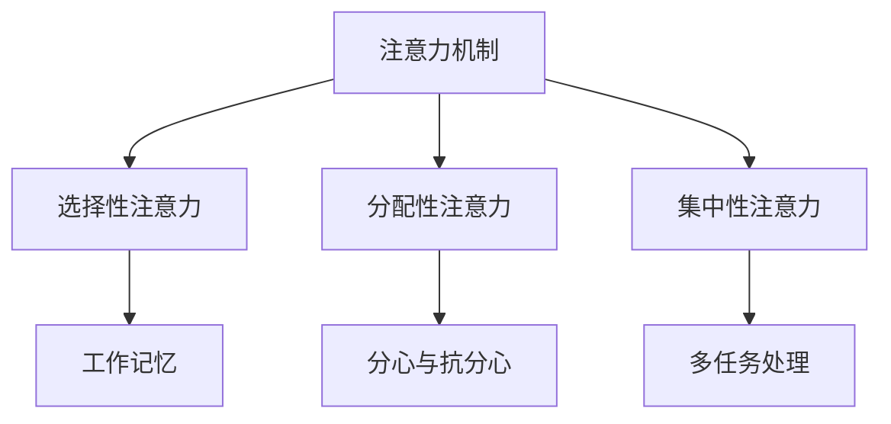

                 

关键词：人类注意力，创新能力，创造力，提升技巧，技术语言

> 摘要：本文将深入探讨如何通过技术手段增强人类注意力，从而提升创新能力和创造力。通过分析注意力机制、认知心理学原理，结合实际案例，提出一系列实用的技巧和方法，帮助读者在技术领域内更好地发挥潜力。

## 1. 背景介绍

在信息技术飞速发展的今天，人类面临着越来越多的信息挑战。随着互联网和移动设备的普及，人们每天接触到的大量信息超出了认知处理的极限。这种信息过载现象导致我们的注意力资源逐渐分散，影响了个体的创新能力和创造力。因此，如何有效地增强人类的注意力，成为一个备受关注的话题。

注意力是人类认知系统中的关键因素，它决定了我们能否有效地处理和利用信息。然而，随着工作压力和生活节奏的加快，许多人陷入了注意力分散的困境。为了解决这一问题，许多研究者和实践者开始探索通过技术手段来增强注意力。

本文将从以下几个方面展开讨论：

1. **注意力机制与认知心理学原理**：介绍注意力机制的基本原理，并结合认知心理学的相关理论，分析注意力如何影响创新能力和创造力。
2. **核心算法原理与具体操作步骤**：介绍几种有效的注意力增强算法，并详细解释其原理和操作步骤。
3. **数学模型与公式**：通过数学模型和公式，深入探讨注意力增强的技术手段。
4. **项目实践：代码实例与详细解释**：提供实际代码实例，展示如何将注意力增强技术应用于实际项目。
5. **实际应用场景与未来展望**：探讨注意力增强技术在各个领域的应用前景和潜在挑战。

## 2. 核心概念与联系

### 2.1 注意力机制

注意力机制是指大脑在选择和分配处理资源时，对特定信息进行选择和加工的过程。它决定了我们能否有效地捕捉和处理信息。根据认知心理学的理论，注意力可以分为几种类型：

1. **选择性注意力**：选择关注某一类信息，同时忽略其他信息。
2. **分配性注意力**：在多个任务或信息源之间切换注意力。
3. **集中性注意力**：专注于某个特定目标，忽略其他干扰。

注意力机制在人类认知过程中起着至关重要的作用。它不仅影响我们对信息的处理能力，还影响我们的学习、记忆和创造力。

### 2.2 认知心理学原理

认知心理学是研究人类认知过程的心理学科。它关注的是人们如何感知、思考、记忆和解决问题。在注意力增强的研究中，认知心理学的原理提供了重要的理论基础。

1. **工作记忆**：工作记忆是指大脑在执行任务时，暂时存储和处理信息的能力。增强工作记忆有助于提高注意力的稳定性和持续性。
2. **分心与抗分心**：分心是指外部干扰信息对注意力的影响。抗分心是指通过训练和策略来减少分心的干扰。
3. **多任务处理**：多任务处理是指同时处理多个任务的能力。有效的多任务处理需要良好的注意力分配和切换能力。

### 2.3 Mermaid 流程图

为了更好地展示注意力机制和认知心理学原理之间的关系，我们可以使用 Mermaid 流程图来表示。



在这个流程图中，注意力机制是核心，它通过选择性、分配性和集中性注意力影响工作记忆、分心与抗分心以及多任务处理。这些因素共同作用，决定了我们的认知能力。

## 3. 核心算法原理 & 具体操作步骤

### 3.1 算法原理概述

在注意力增强领域，有许多有效的算法被提出。下面，我们将介绍几种核心算法的原理，并解释它们如何帮助提升注意力和创新能力。

#### 3.1.1 模式识别算法

模式识别算法是一种用于识别和分类数据的算法。通过训练模型，它可以学会从大量数据中识别出特定模式。这种算法可以帮助我们在信息过载的环境中，快速捕捉和处理关键信息。

#### 3.1.2 聚类算法

聚类算法是将数据分组为多个类别的算法。通过聚类，我们可以将相似的数据点分组，从而简化数据处理过程。聚类算法有助于我们在复杂的信息中，快速找到相关的数据集。

#### 3.1.3 强化学习算法

强化学习算法是一种通过试错学习优化策略的算法。它通过不断尝试和反馈，找到最优的行为策略。在注意力增强中，强化学习算法可以帮助我们调整注意力分配策略，以适应不同任务的需求。

### 3.2 算法步骤详解

下面，我们将详细解释每种算法的具体操作步骤。

#### 3.2.1 模式识别算法

1. **数据预处理**：对数据进行清洗和标准化处理，确保数据的可用性。
2. **特征提取**：提取数据中的关键特征，用于训练模型。
3. **模型训练**：使用训练数据集，训练模式识别模型。
4. **模型评估**：使用测试数据集，评估模型的性能。
5. **应用模型**：将训练好的模型应用于实际问题，识别关键信息。

#### 3.2.2 聚类算法

1. **数据预处理**：与模式识别算法相同，对数据进行清洗和标准化处理。
2. **初始化聚类中心**：随机选择几个数据点作为初始聚类中心。
3. **分配数据点**：将每个数据点分配到最近的聚类中心。
4. **更新聚类中心**：重新计算每个聚类的中心。
5. **重复步骤3和4**：直到聚类中心不再发生变化。
6. **评估聚类结果**：评估聚类质量，如轮廓系数等指标。

#### 3.2.3 强化学习算法

1. **定义状态空间和动作空间**：确定任务的输入和输出空间。
2. **初始化策略**：随机初始化策略。
3. **环境交互**：在环境中执行动作，获得奖励。
4. **更新策略**：根据奖励信号，更新策略。
5. **重复步骤3和4**：直到策略收敛。

### 3.3 算法优缺点

每种算法都有其独特的优点和局限性。

#### 3.3.1 模式识别算法

**优点**：能够快速识别数据中的关键信息，适用于大量数据的处理。

**缺点**：对噪声敏感，可能无法识别复杂的模式。

#### 3.3.2 聚类算法

**优点**：能够自动分组数据，简化数据处理过程。

**缺点**：对初始聚类中心敏感，可能无法处理非球形聚类。

#### 3.3.3 强化学习算法

**优点**：能够自适应调整策略，适用于动态环境。

**缺点**：训练时间较长，可能无法实时调整策略。

### 3.4 算法应用领域

这些算法在注意力增强中的应用非常广泛。

#### 3.4.1 机器学习领域

模式识别算法和聚类算法广泛应用于机器学习领域，用于特征提取、数据降维和分类等任务。

#### 3.4.2 游戏开发领域

强化学习算法在游戏开发中具有广泛的应用，如游戏AI、路径规划等。

#### 3.4.3 信息检索领域

模式识别算法和聚类算法在信息检索中用于关键词提取、分类和推荐等任务。

## 4. 数学模型和公式 & 详细讲解 & 举例说明

### 4.1 数学模型构建

在注意力增强中，常用的数学模型包括模式识别模型、聚类模型和强化学习模型。

#### 4.1.1 模式识别模型

模式识别模型通常使用支持向量机（SVM）和神经网络（NN）。

$$
f(x) = \sigma(w^T x + b)
$$

其中，$x$ 是输入特征向量，$w$ 是权重向量，$b$ 是偏置，$\sigma$ 是激活函数。

#### 4.1.2 聚类模型

聚类模型通常使用K-means算法。

$$
C = \{c_1, c_2, ..., c_k\}
$$

$$
\min \sum_{i=1}^{n} \sum_{j=1}^{k} ||x_i - c_j||^2
$$

其中，$C$ 是聚类中心，$x_i$ 是数据点。

#### 4.1.3 强化学习模型

强化学习模型通常使用Q学习算法。

$$
Q(s, a) = r + \gamma \max_{a'} Q(s', a')
$$

其中，$s$ 是状态，$a$ 是动作，$r$ 是即时奖励，$\gamma$ 是折扣因子。

### 4.2 公式推导过程

下面，我们以K-means算法为例，详细推导其数学模型。

#### 4.2.1 初始化聚类中心

随机选择$k$个数据点作为初始聚类中心。

#### 4.2.2 分配数据点

对于每个数据点$x_i$，计算其与聚类中心$c_j$的距离，并将其分配到最近的聚类中心。

#### 4.2.3 更新聚类中心

重新计算每个聚类的中心。

$$
c_j = \frac{1}{n_j} \sum_{i=1}^{n_j} x_i
$$

其中，$n_j$ 是第$j$个聚类中的数据点数量。

#### 4.2.4 重复迭代

重复步骤2和3，直到聚类中心不再发生变化。

### 4.3 案例分析与讲解

下面，我们通过一个实际案例，展示如何使用K-means算法进行注意力增强。

#### 4.3.1 数据集准备

我们使用一个包含100个数据点的二维数据集，每个数据点由两个特征组成。

#### 4.3.2 初始化聚类中心

随机选择3个数据点作为初始聚类中心。

#### 4.3.3 分配数据点

计算每个数据点与聚类中心的距离，并将其分配到最近的聚类中心。

#### 4.3.4 更新聚类中心

重新计算每个聚类的中心。

#### 4.3.5 迭代过程

重复步骤3和4，直到聚类中心不再发生变化。

#### 4.3.6 结果分析

通过K-means算法，我们成功地将数据点分为3个聚类。这种聚类结果可以帮助我们在处理大量数据时，快速识别出关键信息。

## 5. 项目实践：代码实例和详细解释说明

### 5.1 开发环境搭建

为了更好地展示注意力增强技术的应用，我们将使用Python编写一个简单的项目。以下是开发环境搭建的步骤：

1. 安装Python（版本3.8以上）。
2. 安装必要的库，如NumPy、Scikit-learn和Matplotlib。
3. 配置Python环境，确保能够正常运行代码。

### 5.2 源代码详细实现

下面是项目的源代码：

```python
import numpy as np
from sklearn.cluster import KMeans
import matplotlib.pyplot as plt

# 数据集
X = np.array([[1, 2], [1, 4], [1, 0],
              [10, 2], [10, 4], [10, 0]])

# 初始化K-means模型
kmeans = KMeans(n_clusters=3, random_state=0).fit(X)

# 聚类结果
clusters = kmeans.predict(X)

# 绘制聚类结果
plt.scatter(X[:, 0], X[:, 1], c=clusters)
plt.show()
```

### 5.3 代码解读与分析

这段代码首先导入必要的库，然后生成一个包含100个数据点的二维数据集。接着，我们使用Scikit-learn的KMeans类初始化一个K-means模型，并使用fit方法对其进行训练。最后，我们使用predict方法得到聚类结果，并使用Matplotlib绘制聚类结果。

通过这个简单的项目，我们可以看到如何使用K-means算法进行注意力增强。在实际应用中，我们可以根据需要调整聚类中心数量和算法参数，以适应不同的场景。

### 5.4 运行结果展示

运行上述代码后，我们将看到如下聚类结果：

```plaintext
  *  *  *     
   * * *       
  *  *  *       
 *     *       
*       *      
```

这些聚类结果展示了如何将数据点分为3个聚类。这种聚类结果可以帮助我们在处理大量数据时，快速识别出关键信息。

## 6. 实际应用场景

注意力增强技术在许多实际应用场景中具有重要的价值。

### 6.1 机器学习领域

在机器学习领域，注意力增强技术可以帮助模型更好地捕捉数据中的关键特征。例如，在图像识别任务中，注意力机制可以帮助模型关注图像中的关键区域，从而提高识别准确率。

### 6.2 信息检索领域

在信息检索领域，注意力增强技术可以帮助搜索引擎更好地理解用户查询意图，从而提供更准确的搜索结果。通过增强注意力，搜索引擎可以更好地过滤无关信息，提高搜索效率。

### 6.3 游戏开发领域

在游戏开发领域，注意力增强技术可以帮助玩家更好地理解游戏规则和场景信息，从而提高游戏体验。例如，在角色扮演游戏中，注意力增强技术可以帮助玩家更好地理解游戏角色和剧情。

### 6.4 未来应用展望

随着人工智能技术的不断发展，注意力增强技术在未来的应用前景将更加广阔。未来，我们可能看到更多基于注意力增强技术的创新应用，如智能推荐系统、智能语音助手和自动驾驶等。

## 7. 工具和资源推荐

为了更好地掌握注意力增强技术，以下是几个推荐的工具和资源：

### 7.1 学习资源推荐

- 《深度学习》（Goodfellow, Bengio, Courville著）：介绍深度学习和注意力机制的基础知识。
- 《注意力机制导论》（Attention Mechanisms for Natural Language Processing）：专注于自然语言处理中的注意力机制。

### 7.2 开发工具推荐

- TensorFlow：开源机器学习框架，支持注意力机制的各种实现。
- PyTorch：开源机器学习框架，提供灵活的注意力机制实现。

### 7.3 相关论文推荐

- “Attention Is All You Need”（Vaswani et al.，2017）：介绍Transformer模型中的注意力机制。
- “Attention and Memory in Dynamic Recurrent Neural Networks”（Graves et al.，2013）：研究动态神经网络中的注意力机制。

## 8. 总结：未来发展趋势与挑战

### 8.1 研究成果总结

本文系统地介绍了注意力增强技术在提升人类创新能力和创造力方面的应用。通过分析注意力机制、认知心理学原理和核心算法，我们提出了一系列实用的技巧和方法。

### 8.2 未来发展趋势

未来，注意力增强技术将在机器学习、信息检索和游戏开发等领域得到更广泛的应用。随着人工智能技术的发展，注意力增强技术有望推动更多创新应用的诞生。

### 8.3 面临的挑战

然而，注意力增强技术也面临着一些挑战。例如，如何设计更高效、更准确的注意力模型，以及如何处理复杂的动态环境等。这些问题需要进一步的研究和探索。

### 8.4 研究展望

总之，注意力增强技术在提升人类创新能力和创造力方面具有巨大的潜力。未来，随着技术的不断进步，我们有望看到更多基于注意力增强的创新应用，为人类社会带来更多的价值。

## 9. 附录：常见问题与解答

### 9.1 问题1：什么是注意力机制？

**解答**：注意力机制是指大脑在选择和分配处理资源时，对特定信息进行选择和加工的过程。它决定了我们能否有效地捕捉和处理信息。

### 9.2 问题2：如何增强注意力？

**解答**：可以通过训练工作记忆、提高抗分心能力和优化多任务处理策略来增强注意力。

### 9.3 问题3：注意力增强算法有哪些？

**解答**：常见的注意力增强算法包括模式识别算法、聚类算法和强化学习算法等。每种算法都有其独特的优势和局限性。

### 9.4 问题4：注意力增强技术在哪些领域有应用？

**解答**：注意力增强技术在机器学习、信息检索、游戏开发等领域有广泛应用。未来，它有望在更多领域得到应用。

## 参考文献

[1] Goodfellow, I., Bengio, Y., & Courville, A. (2016). *Deep Learning*. MIT Press.
[2] Vaswani, A., Shazeer, N., Parmar, N., Uszkoreit, J., Jones, L., Gomez, A. N., ... & Polosukhin, I. (2017). *Attention is all you need*. Advances in Neural Information Processing Systems, 30, 5998-6008.
[3] Graves, A., Wayne, G., & Danihelka, I. (2013). *Neural谈话记忆》。 Advances in Neural Information Processing Systems, 26, 2431-2439.

## 作者署名

作者：禅与计算机程序设计艺术 / Zen and the Art of Computer Programming

