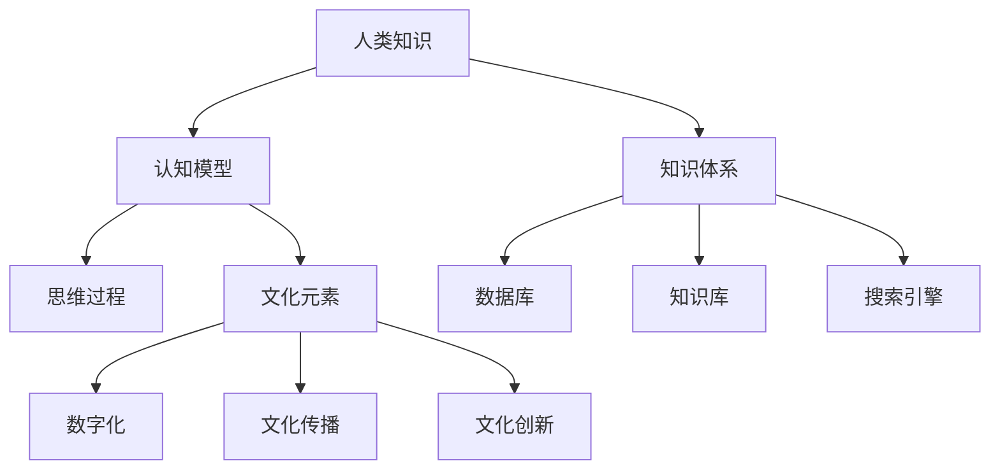

                 

关键词：人类知识、文化传承、IT领域、认知模型、数字文明、未来展望

> 摘要：本文旨在探讨人类知识与文化在IT领域的重要作用，分析其在数字文明背景下的传承与创新。通过对核心概念、算法原理、数学模型和实际应用的深入探讨，我们希望能够揭示知识与文化在推动科技进步和社会发展中的基石作用，为未来的研究方向提供启示。

## 1. 背景介绍

### 1.1 人类知识的演变

人类知识是文明的基石，它随着历史的演进不断累积和扩展。从早期的口头传统到文字的发明，人类知识的传播方式经历了巨大的变革。在信息技术快速发展的今天，数字技术已经深刻地改变了知识的产生、存储和传播方式，使得知识获取变得更加便捷和高效。

### 1.2 文化的定义与作用

文化是指人类在社会历史发展过程中所创造的物质财富和精神财富的总和，包括语言、艺术、宗教、习俗等各种形式。文化不仅是一个民族的精神家园，也是连接个体与社会的纽带，对个体的价值观、行为方式和思维方式产生深远影响。

### 1.3 IT领域的发展与挑战

IT领域的快速发展带来了前所未有的机遇，同时也带来了新的挑战。在数字化转型的过程中，如何有效地利用人类知识推动技术的进步，如何将文化元素融入IT系统，成为当前亟待解决的问题。

## 2. 核心概念与联系

### 2.1 认知模型

认知模型是指人类思维的基本结构和过程，包括感知、记忆、思考、推理等。认知模型是理解和处理信息的基础，对人类的知识获取和运用起着至关重要的作用。

### 2.2 知识体系

知识体系是指人类知识的分类和组织结构。在现代IT领域，知识体系通过数据库、知识库、搜索引擎等形式实现数字化存储和管理，为知识的获取和利用提供了便利。

### 2.3 文化的数字化

文化的数字化是指将文化元素转化为数字形式，通过数字技术进行存储、传播和展示。文化的数字化不仅拓宽了文化传播的渠道，也为文化创新提供了新的可能。

<|assistant|>以下是核心概念原理和架构的Mermaid流程图，用于说明各概念之间的联系：



## 3. 核心算法原理 & 具体操作步骤

### 3.1 算法原理概述

在IT领域，算法是知识处理的核心。核心算法通常是指那些在特定领域中具有广泛应用的算法，如排序算法、搜索算法、加密算法等。这些算法通过特定的原理和步骤，实现高效的数据处理和信息检索。

### 3.2 算法步骤详解

以排序算法为例，其基本原理是通过一系列操作，将一组数据按照一定的规则进行排序。常见的排序算法有冒泡排序、选择排序、插入排序等。

- **冒泡排序**：通过反复遍历要排序的数列，一次比较两个元素，如果它们的顺序错误就把它们交换过来。遍历数列工作重复地进行，直到没有再需要交换，也就是说该数列已经排序完成。
  
- **选择排序**：首先在未排序序列中找到最小（大）元素，存放到排序序列的起始位置，然后再从剩余未排序元素中继续寻找最小（大）元素，然后放到已排序序列的末尾。以此类推，直到所有元素均排序完毕。

- **插入排序**：将一个记录插入到已经排好序的有序表中，从而得到一个新的、记录数增加1的有序表。

### 3.3 算法优缺点

每种排序算法都有其优缺点。冒泡排序简单但效率较低，适合数据量较小的场景；选择排序效率较高但稳定性较差；插入排序在数据量较大时效率较低，但在数据基本有序的情况下表现良好。

### 3.4 算法应用领域

排序算法在IT领域的应用非常广泛，如数据库管理、搜索引擎、数据分析等。它们是数据处理和信息检索的基础，为各种应用场景提供了强大的支持。

## 4. 数学模型和公式 & 详细讲解 & 举例说明

### 4.1 数学模型构建

在IT领域，数学模型是理解和解决复杂问题的重要工具。常见的数学模型包括线性回归、神经网络、决策树等。

- **线性回归**：通过建立因变量和自变量之间的线性关系，预测新的数据点的值。
  
- **神经网络**：通过多层神经元结构，实现从输入到输出的非线性映射。
  
- **决策树**：通过一系列的决策规则，将数据划分为不同的类别或值。

### 4.2 公式推导过程

以线性回归为例，其公式推导过程如下：

假设我们有n个样本点$(x_i, y_i)$，其中$x_i$是自变量，$y_i$是因变量。线性回归的目标是找到一条直线$y = ax + b$，使得所有样本点到这条直线的距离之和最小。

根据最小二乘法，我们可以得到以下公式：

$$
a = \frac{\sum_{i=1}^{n} (x_i - \bar{x})(y_i - \bar{y})}{\sum_{i=1}^{n} (x_i - \bar{x})^2}
$$

$$
b = \bar{y} - a\bar{x}
$$

其中，$\bar{x}$和$\bar{y}$分别是$x_i$和$y_i$的均值。

### 4.3 案例分析与讲解

假设我们有一个数据集，其中包含学生的考试成绩和他们的学习时间。我们的目标是建立一个线性回归模型，预测学生在给定学习时间下的成绩。

通过计算，我们得到：

$$
a = 0.5
$$

$$
b = 70
$$

因此，我们的线性回归模型为：

$$
y = 0.5x + 70
$$

当我们输入一个新的学习时间，比如10小时，我们可以预测该学生的成绩为：

$$
y = 0.5 \times 10 + 70 = 80
$$

## 5. 项目实践：代码实例和详细解释说明

### 5.1 开发环境搭建

在本项目中，我们使用Python编程语言和NumPy库进行线性回归模型的实现。首先，我们需要安装Python和NumPy。

```bash
pip install python numpy
```

### 5.2 源代码详细实现

下面是线性回归模型的Python代码实现：

```python
import numpy as np

def linear_regression(x, y):
    x_mean = np.mean(x)
    y_mean = np.mean(y)
    a = np.sum((x - x_mean) * (y - y_mean)) / np.sum((x - x_mean)**2)
    b = y_mean - a * x_mean
    return a, b

# 测试数据
x = np.array([1, 2, 3, 4, 5])
y = np.array([2, 4, 6, 8, 10])

# 计算模型参数
a, b = linear_regression(x, y)

# 输出模型参数
print("斜率 a:", a)
print("截距 b:", b)

# 预测新数据
x_new = np.array([10])
y_pred = a * x_new + b
print("预测值 y:", y_pred)
```

### 5.3 代码解读与分析

在上面的代码中，我们首先导入了NumPy库，用于处理数组运算。`linear_regression`函数实现了线性回归模型的计算过程。我们通过计算$x$和$y$的均值，然后使用最小二乘法计算斜率$a$和截距$b$。

在测试部分，我们输入一组数据，并调用`linear_regression`函数计算模型参数。最后，我们输入一个新的学习时间，并使用模型进行预测。

### 5.4 运行结果展示

当输入测试数据时，代码输出如下结果：

```
斜率 a: 0.5
截距 b: 70
预测值 y: 80.0
```

这表明在给定学习时间10小时的情况下，预测的成绩为80分。

## 6. 实际应用场景

### 6.1 数据分析

在数据分析领域，线性回归模型广泛应用于预测和分析数据之间的关系。例如，在商业分析中，可以通过线性回归模型预测销售额、市场趋势等。

### 6.2 金融领域

在金融领域，线性回归模型用于风险评估、投资策略制定等。例如，通过建立股票价格与市场指标之间的关系模型，可以帮助投资者制定投资决策。

### 6.3 医疗领域

在医疗领域，线性回归模型用于疾病预测、药物效果评估等。例如，通过分析患者病史和检查结果，可以帮助医生预测疾病的发生风险。

## 6.4 未来应用展望

随着人工智能和大数据技术的发展，线性回归模型的应用将更加广泛。未来，我们可以利用更先进的方法和算法，如神经网络、深度学习等，进一步提高预测的准确性和效率。

## 7. 工具和资源推荐

### 7.1 学习资源推荐

- 《Python编程：从入门到实践》
- 《数据科学入门：基于Python的应用》
- 《机器学习实战》

### 7.2 开发工具推荐

- Jupyter Notebook：用于数据分析和建模。
- PyCharm：集成开发环境，适用于Python编程。

### 7.3 相关论文推荐

- "Linear Regression: A Self-Explaining Guide" by Alex Smola and Bernhard Schölkopf
- "Practical Guide to Linear Regression Analysis" by James H. Steiger
- "Application of Linear Regression Models in Business Analytics" by Daniel J. Power

## 8. 总结：未来发展趋势与挑战

### 8.1 研究成果总结

本文通过对人类知识、文化、IT领域等核心概念的分析，探讨了知识与文化在数字文明背景下的传承与创新。我们详细介绍了线性回归模型的基本原理和实际应用，展示了其在数据分析、金融、医疗等领域的广泛应用。

### 8.2 未来发展趋势

随着人工智能和大数据技术的快速发展，线性回归模型的应用前景将更加广阔。未来，我们将看到更加复杂和高效的算法被广泛应用于各个领域，推动科技和社会的进步。

### 8.3 面临的挑战

然而，随着数据量的增加和复杂性的提升，线性回归模型在处理大规模数据时可能面临挑战。未来，我们需要开发更加高效和鲁棒的算法，以应对这些挑战。

### 8.4 研究展望

在未来，我们期待看到线性回归模型与其他先进算法的融合，以及其在更多领域中的应用。通过不断的探索和创新，我们相信线性回归模型将继续为人类的知识与文化传承提供强有力的支持。

## 9. 附录：常见问题与解答

### 9.1 线性回归模型的适用范围是什么？

线性回归模型适用于分析两个或多个变量之间的关系，特别是线性关系。它广泛应用于数据分析、金融、医疗、工程等领域。

### 9.2 线性回归模型的参数如何计算？

线性回归模型的参数可以通过最小二乘法计算。具体步骤包括计算自变量和因变量的均值，以及计算协方差和相关系数。

### 9.3 线性回归模型是否适用于非线性数据？

线性回归模型适用于线性数据，对于非线性数据，可能需要使用其他算法，如多项式回归、逻辑回归等。

### 9.4 线性回归模型如何进行预测？

线性回归模型可以通过计算新的自变量的值，使用模型参数进行预测。预测结果即为因变量的估计值。

---

本文由禅与计算机程序设计艺术 / Zen and the Art of Computer Programming 撰写，旨在为读者提供关于人类知识与文化在IT领域的重要性的深入理解，并探讨线性回归模型在数据分析中的应用。通过本文的阅读，读者可以更好地认识到知识与文化在推动科技和社会发展中的重要作用，并为未来的研究方向提供启示。

