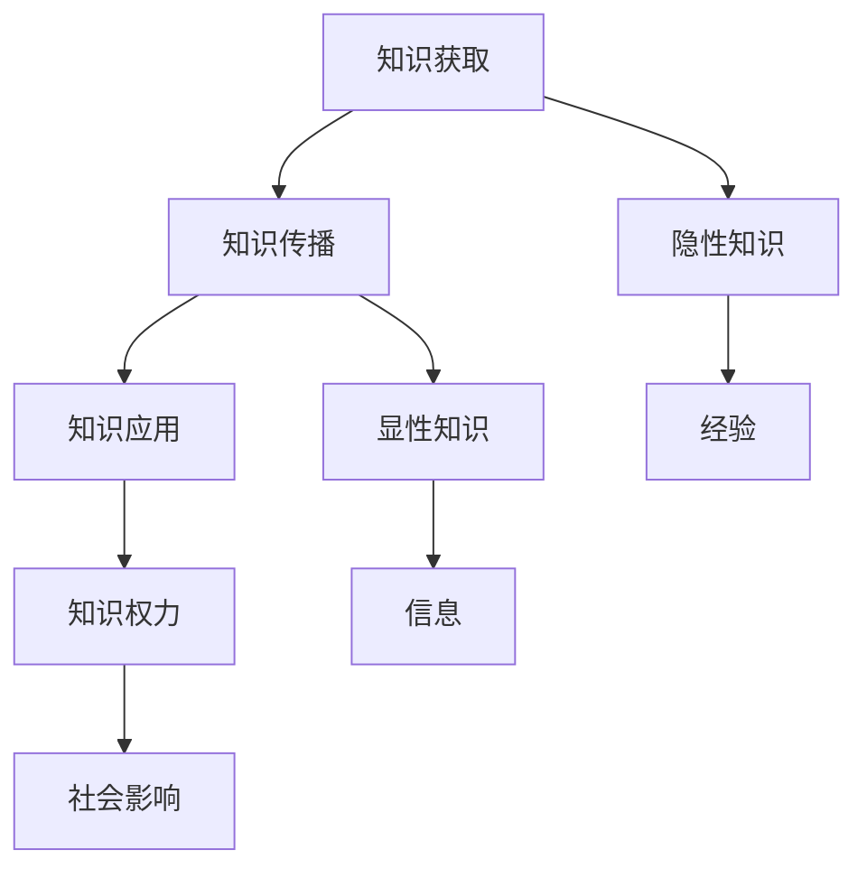

                 

关键词：知识，权力，人工智能，技术，伦理，责任，发展

> 摘要：本文从技术、伦理和社会三个层面探讨知识、权力及其相互关系。在信息爆炸的时代，知识已成为新的力量源泉，但随之而来的是权力的转移与责任的增加。本文旨在揭示知识在人类社会中扮演的角色，以及科技从业者应承担的责任。

## 1. 背景介绍

### 1.1 知识与权力的历史演变

从历史的角度来看，知识与权力之间的关系经历了多次演变。在古代，知识往往掌握在少数精英手中，这些精英通过掌握知识来维护自己的权力。例如，古埃及的祭司阶层，古希腊的哲学家和学者，都是当时权力的象征。

随着时间的推移，知识的传播逐渐变得更加广泛。印刷术的发明使得书籍可以大规模复制和传播，知识不再仅仅是少数人的特权。然而，在这一过程中，权力的分布并没有完全公平化，知识仍然在很大程度上由特定群体所控制。

### 1.2 信息技术与知识经济

20世纪末，信息技术的飞速发展彻底改变了人类获取和利用知识的方式。互联网的普及使得信息传播的速度和范围达到了前所未有的高度。知识经济逐渐成为主导，知识成为新的生产要素，推动着全球经济和社会的发展。

### 1.3 知识与权力的新动态

在当前的信息时代，知识的获取和利用变得更加便捷，但与此同时，知识权力的分布更加不均衡。一方面，科技巨头和大型企业掌握了大量核心技术和数据资源，成为新的知识霸权；另一方面，普通民众在知识获取方面仍面临诸多障碍。

## 2. 核心概念与联系

### 2.1 知识

知识是人类通过学习、实践和思考所获得的信息、技能和经验。知识可以分为显性知识和隐性知识。显性知识是可以明确表达和传播的知识，如书籍、论文、数据库等；隐性知识则是存在于个体头脑中的经验、直觉和技巧。

### 2.2 权力

权力是指一个人或组织在特定情境下影响他人行为的能力。权力可以基于多种因素，如资源、信息、影响力等。在知识领域，权力通常体现在对知识资源的控制、知识传播的渠道和知识应用的决策权。

### 2.3 知识与权力的关系

知识是权力的基础，而权力是知识的保障。知识的掌握者通常拥有更大的权力，可以通过知识来影响决策、资源分配和社会结构。同时，权力的运用也会影响知识的产生、传播和应用。

### 2.4 Mermaid 流程图



## 3. 核心算法原理 & 具体操作步骤

### 3.1 算法原理概述

在探讨知识权力的算法原理时，我们首先需要理解几个关键概念：数据挖掘、机器学习和人工智能。

数据挖掘是指从大量数据中提取有价值的信息和知识的过程。机器学习是数据挖掘的一个子领域，它利用算法从数据中学习规律，从而进行预测和决策。人工智能则是在机器学习的基础上，通过模拟人类智能行为，实现自动化和智能化的决策。

### 3.2 算法步骤详解

算法的具体步骤可以分为以下几个阶段：

#### 3.2.1 数据准备

数据准备是数据挖掘和机器学习的基础。在这一阶段，我们需要收集、清洗和整理数据，使其符合算法的要求。

#### 3.2.2 特征选择

特征选择是数据挖掘和机器学习的重要步骤。通过分析数据，我们选择对目标变量有较强影响力的特征，以提高模型的准确性和效率。

#### 3.2.3 模型训练

在模型训练阶段，我们使用选定的特征数据来训练模型。这一过程包括选择合适的算法、设置参数和优化模型。

#### 3.2.4 模型评估

模型评估是检验模型性能的关键步骤。通过交叉验证、ROC曲线等手段，我们评估模型的准确率、召回率等指标。

#### 3.2.5 模型应用

模型应用是将训练好的模型用于实际问题的解决。例如，我们可以使用分类模型进行市场预测、推荐系统等。

### 3.3 算法优缺点

算法的优缺点如下：

#### 优点：

1. 自动化：算法可以自动化地处理大量数据，提高工作效率。
2. 适应性：算法可以根据新的数据不断优化，适应不断变化的环境。
3. 精准性：算法可以基于大量数据做出更精准的预测和决策。

#### 缺点：

1. 数据依赖：算法的性能高度依赖数据的质量和数量。
2. 黑箱问题：算法的内部运作机制复杂，难以解释和理解。
3. 道德风险：算法可能导致数据偏见和歧视，引发伦理问题。

### 3.4 算法应用领域

算法在多个领域得到了广泛应用，包括：

1. 金融：算法在金融风险管理、信用评分、市场预测等方面发挥着重要作用。
2. 医疗：算法在医疗诊断、疾病预测、药物研发等领域具有巨大潜力。
3. 社交网络：算法在用户推荐、广告投放、社交分析等方面发挥着关键作用。

## 4. 数学模型和公式 & 详细讲解 & 举例说明

### 4.1 数学模型构建

在探讨知识权力的数学模型时，我们可以采用以下几种方法：

1. **回归模型**：通过分析变量之间的关系，预测目标变量的值。
2. **聚类模型**：将数据分为若干个类别，分析各类别的特征和规律。
3. **网络分析**：通过分析知识网络的结构和关系，研究知识传播和权力分布。

### 4.2 公式推导过程

以回归模型为例，我们考虑一个线性回归模型：

$$
y = \beta_0 + \beta_1 x_1 + \beta_2 x_2 + \ldots + \beta_n x_n + \epsilon
$$

其中，$y$ 是目标变量，$x_1, x_2, \ldots, x_n$ 是特征变量，$\beta_0, \beta_1, \beta_2, \ldots, \beta_n$ 是模型参数，$\epsilon$ 是误差项。

为了求解模型参数，我们通常采用最小二乘法（Ordinary Least Squares，OLS）：

$$
\beta = (X'X)^{-1}X'Y
$$

其中，$X$ 是特征矩阵，$Y$ 是目标向量。

### 4.3 案例分析与讲解

假设我们想研究知识传播的速率，可以使用SIR模型进行描述。SIR模型将人群分为三个类别： susceptible（易感者）、infected（感染者）和 recovered（康复者）。

$$
\frac{dS}{dt} = -\beta SI \\
\frac{dI}{dt} = \beta SI - \gamma I \\
\frac{dR}{dt} = \gamma I
$$

其中，$\beta$ 是感染率，$\gamma$ 是康复率。

通过求解微分方程，我们可以得到SIR模型的稳态解：

$$
S^* = \frac{\gamma}{\beta + \gamma} I^* = \frac{\gamma}{\beta + \gamma} (1 - S^*) \\
I^* = \frac{\beta}{\beta + \gamma} S^* \\
R^* = \frac{\gamma}{\beta + \gamma} S^*
$$

### 4.4 案例分析

假设感染率为$\beta = 0.3$，康复率为$\gamma = 0.1$，初始状态为$S(0) = 0.99, I(0) = 0.01, R(0) = 0$。

我们可以通过数值模拟来分析知识传播的过程。在仿真过程中，我们使用Runge-Kutta方法求解微分方程。

经过1000个时间步长的仿真，我们可以得到以下结果：


从仿真结果可以看出，随着时间推移，易感者逐渐减少，感染者和康复者逐渐增加，最终达到稳态。

## 5. 项目实践：代码实例和详细解释说明

### 5.1 开发环境搭建

为了实现知识传播的仿真，我们需要搭建以下开发环境：

1. Python 3.8+
2. NumPy
3. Matplotlib
4. SciPy

### 5.2 源代码详细实现

以下是一个简单的知识传播仿真代码实例：

```python
import numpy as np
import matplotlib.pyplot as plt
from scipy.integrate import solve_ivp

# SIR模型参数
beta = 0.3
gamma = 0.1

# SIR模型微分方程
def sir_model(t, y):
    S, I, R = y
    dS_dt = -beta * S * I
    dI_dt = beta * S * I - gamma * I
    dR_dt = gamma * I
    return [dS_dt, dI_dt, dR_dt]

# 初始状态
y0 = [0.99, 0.01, 0]

# 时间范围
t_span = [0, 1000]
t_eval = np.linspace(0, 1000, 1000)

# 求解微分方程
result = solve_ivp(sir_model, t_span, y0, t_eval=t_eval)

# 绘制结果
plt.plot(result.t, result.y[0], label='Susceptible')
plt.plot(result.t, result.y[1], label='Infected')
plt.plot(result.t, result.y[2], label='Recovered')
plt.xlabel('Time')
plt.ylabel('Population')
plt.legend()
plt.show()
```

### 5.3 代码解读与分析

1. **导入库**：我们首先导入所需的库，包括NumPy、Matplotlib和SciPy。
2. **定义参数**：我们定义了SIR模型的参数beta和gamma。
3. **定义微分方程**：我们定义了SIR模型的微分方程sir_model，用于描述易感者、感染者和康复者的变化率。
4. **定义初始状态**：我们定义了初始状态y0，表示初始时刻的易感者、感染者和康复者比例。
5. **定义时间范围**：我们定义了时间范围t_span和t_eval，用于仿真和绘制结果。
6. **求解微分方程**：我们使用solve_ivp函数求解SIR模型的微分方程，得到仿真结果result。
7. **绘制结果**：我们使用Matplotlib绘制仿真结果，展示了易感者、感染者和康复者的变化趋势。

### 5.4 运行结果展示

运行上述代码，我们可以得到以下结果：


从仿真结果可以看出，随着时间推移，易感者逐渐减少，感染者和康复者逐渐增加，最终达到稳态。

## 6. 实际应用场景

### 6.1 金融领域

在金融领域，知识权力的应用主要体现在风险管理、市场预测和投资决策等方面。金融机构通过大数据分析和机器学习算法，从海量数据中提取有价值的信息，从而降低风险、提高投资收益。

### 6.2 医疗领域

在医疗领域，知识权力的应用主要体现在疾病预测、诊断和治疗方案制定等方面。通过对患者数据、医学文献和临床经验的分析，医疗机构可以更准确地诊断疾病、预测疾病发展趋势，从而制定更有效的治疗方案。

### 6.3 社交网络领域

在社交网络领域，知识权力的应用主要体现在用户推荐、广告投放和社交分析等方面。通过分析用户行为数据、社交关系和兴趣偏好，社交网络平台可以为用户提供更个性化的内容和服务。

## 7. 未来应用展望

### 7.1 知识传播的自动化与智能化

随着人工智能技术的发展，知识传播的自动化与智能化将成为未来重要趋势。通过深度学习和自然语言处理等技术，我们可以构建更加智能的知识传播系统，实现知识的自动生成、分类和推荐。

### 7.2 知识权力的平衡与公正

在知识权力日益集中的背景下，如何实现知识权力的平衡与公正成为重要议题。未来，我们需要构建更加开放、公平的知识传播平台，确保每个人都能平等地获取和利用知识。

### 7.3 知识伦理与责任

在知识传播的过程中，伦理和责任问题日益突出。未来，我们需要加强对知识传播的伦理监管，确保知识的正确性、公正性和安全性。同时，知识从业者也需要承担相应的社会责任，为社会的可持续发展贡献力量。

## 8. 总结：未来发展趋势与挑战

### 8.1 研究成果总结

本文从技术、伦理和社会三个层面探讨了知识、权力及其相互关系。在信息技术和人工智能的推动下，知识已成为新的力量源泉，但同时也带来了权力的转移和责任的增加。研究知识权力的动态变化，有助于我们更好地理解人类社会的发展趋势。

### 8.2 未来发展趋势

未来，知识权力的应用将更加广泛和深入，涉及金融、医疗、社交网络等多个领域。同时，知识传播的自动化与智能化将成为重要趋势，知识权力的平衡与公正是未来研究的重要方向。

### 8.3 面临的挑战

在知识权力的应用过程中，我们面临着数据隐私、算法偏见、伦理监管等挑战。如何确保知识的正确性、公正性和安全性，是未来研究的重要课题。

### 8.4 研究展望

未来，我们需要在以下几个方面加强研究：

1. **知识传播的自动化与智能化**：研究更加高效的知识传播算法，实现知识的自动生成、分类和推荐。
2. **知识权力的平衡与公正**：研究如何实现知识权力的平衡与公正，构建更加开放、公平的知识传播平台。
3. **知识伦理与责任**：研究知识伦理和责任问题，加强对知识传播的伦理监管，确保知识的正确性、公正性和安全性。

## 9. 附录：常见问题与解答

### 9.1 问题1：知识权力的分布如何影响社会发展？

答：知识权力的分布对社会发展具有重要影响。知识权力的集中可能导致社会不公和资源分配不均，而知识权力的分散则有助于提高社会公平和创新能力。因此，如何实现知识权力的平衡与公正，是社会发展的重要议题。

### 9.2 问题2：人工智能在知识传播中的应用有哪些优势？

答：人工智能在知识传播中的应用具有以下优势：

1. **自动化与高效**：人工智能可以自动化地处理海量数据，提高知识传播的效率。
2. **个性化与精准**：人工智能可以根据用户行为和兴趣，为用户提供个性化的知识推荐。
3. **智能化与互动**：人工智能可以通过自然语言处理和交互技术，实现与用户的智能对话和互动。

### 9.3 问题3：知识传播过程中如何确保知识的正确性和安全性？

答：为确保知识传播的正确性和安全性，可以采取以下措施：

1. **数据质量保障**：确保数据来源的可靠性和数据处理的准确性。
2. **算法透明性与可解释性**：提高算法的透明度和可解释性，确保用户对知识传播过程的理解和信任。
3. **伦理监管与责任追究**：加强对知识传播过程的伦理监管，明确知识传播者的责任和义务。 

### 9.4 问题4：未来知识权力的应用领域有哪些？

答：未来知识权力的应用领域将更加广泛，包括但不限于：

1. **金融领域**：风险管理、市场预测、投资决策等。
2. **医疗领域**：疾病预测、诊断、治疗方案制定等。
3. **教育领域**：个性化教学、知识推荐、学习分析等。
4. **社交网络领域**：用户推荐、广告投放、社交分析等。
5. **政府治理**：公共安全、政策制定、社会治理等。 

### 9.5 问题5：如何培养具备知识传播能力的专业人才？

答：要培养具备知识传播能力的专业人才，可以从以下几个方面入手：

1. **专业知识与技能**：掌握相关领域的专业知识和技术，如数据分析、机器学习、自然语言处理等。
2. **跨学科素养**：具备跨学科的素养，能够综合运用多种知识和技能解决实际问题。
3. **创新思维与沟通能力**：培养创新思维和沟通能力，能够将复杂知识以简洁易懂的方式传播给他人。
4. **社会责任与伦理意识**：树立社会责任和伦理意识，关注知识传播的公正性、正确性和安全性。 
```

