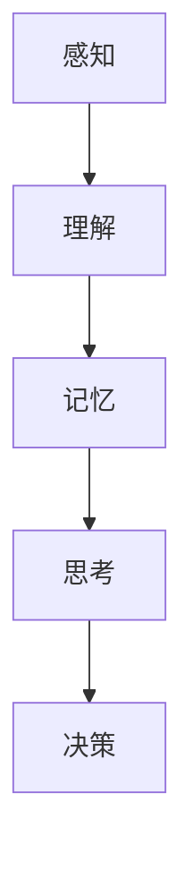
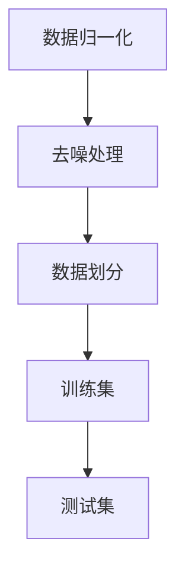
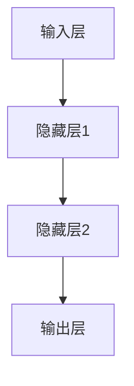
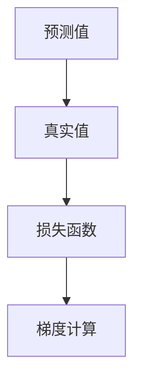
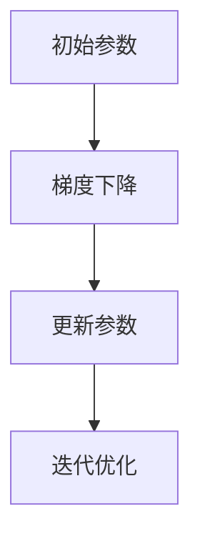

                 

 > **关键词：** 人工智能，认知革命，认知模型，神经网络，深度学习，人类智能。

> **摘要：** 本文将探讨人工智能与人类认知之间的关系，分析AI时代下的认知革命，从核心概念、算法原理、数学模型到实际应用，深入解析AI如何改变人类思维方式，以及未来可能面临的挑战和机遇。

## 1. 背景介绍

### 1.1 人工智能的崛起

随着计算机技术的飞速发展，人工智能（AI）逐渐从科幻小说走进了现实生活。从最早的专家系统到如今的深度学习，AI技术在各行各业中展现出了巨大的潜力。然而，尽管AI在数据处理、模式识别、预测分析等方面表现出色，但人类对于AI的理解仍然停留在表面层次。这就引发了人们对于AI与人类认知之间关系的深入思考。

### 1.2 认知革命的必要性

在AI时代，人类面临着前所未有的挑战。一方面，AI技术的快速发展使得人类在某些领域的认知能力被超越；另一方面，人类对于AI的依赖日益增加，使得我们的思维方式逐渐受到AI的影响。因此，探讨AI时代的认知革命，寻找人类与AI之间更好的协同方式，成为当务之急。

## 2. 核心概念与联系

### 2.1 认知模型

认知模型是指人类大脑对外界信息进行感知、理解、记忆和思考的过程。传统认知模型主要基于心理学和神经科学的理论，而AI时代的认知模型则需要结合计算机科学和认知科学的最新成果。

### 2.2 神经网络与深度学习

神经网络是模仿人类大脑神经元连接方式的一种计算模型。深度学习则是基于多层神经网络的一种学习方法，通过多层的非线性变换，实现对复杂数据的建模和预测。

### 2.3 Mermaid 流程图



## 3. 核心算法原理 & 具体操作步骤

### 3.1 算法原理概述

深度学习算法的核心思想是通过多层神经网络对数据进行自动特征提取和建模。具体包括以下几个步骤：

1. 数据预处理：对原始数据进行归一化、去噪等处理。
2. 神经网络构建：设计合适的神经网络结构，包括输入层、隐藏层和输出层。
3. 损失函数设计：选择合适的损失函数，如交叉熵损失函数，用于评估模型预测结果与真实值之间的差异。
4. 优化算法：使用梯度下降等优化算法，最小化损失函数。

### 3.2 算法步骤详解

1. 数据预处理



2. 神经网络构建



3. 损失函数设计



4. 优化算法



### 3.3 算法优缺点

#### 优点

1. 能够自动提取数据特征，降低人工特征工程的工作量。
2. 在大量数据集上表现优异，适用于复杂任务。
3. 灵活性高，可以适应不同的数据分布和任务类型。

#### 缺点

1. 需要大量训练数据和计算资源。
2. 模型难以解释，导致黑盒化。
3. 对超参数敏感，需要精心调优。

### 3.4 算法应用领域

深度学习算法在图像识别、自然语言处理、语音识别、推荐系统等领域取得了显著成果。例如，在图像识别任务中，深度学习算法已经超越了人类的表现；在自然语言处理领域，深度学习模型在机器翻译、文本生成等方面取得了突破性进展。

## 4. 数学模型和公式 & 详细讲解 & 举例说明

### 4.1 数学模型构建

深度学习算法的核心是多层神经网络，其数学模型主要涉及以下几个方面：

1. 前向传播：将输入数据通过神经网络进行层与层之间的传递，最终得到输出。
2. 反向传播：根据输出误差，反向传播梯度，更新网络参数。

### 4.2 公式推导过程

#### 前向传播

假设输入数据为 \( x \)，神经网络包括 \( L \) 个层（包括输入层和输出层），第 \( l \) 层的激活函数为 \( a_l \)，权重矩阵为 \( W_l \)，偏置为 \( b_l \)。则前向传播的公式如下：

\[ a_{l+1} = \sigma(z_{l+1}) \]
\[ z_{l+1} = W_{l+1}a_l + b_{l+1} \]

其中，\( \sigma \) 表示激活函数，通常选择 \( \text{ReLU} \) 或 \( \text{Sigmoid} \) 函数。

#### 反向传播

反向传播的核心是计算损失函数关于网络参数的梯度。假设损失函数为 \( J(W, b) \)，则梯度计算公式如下：

\[ \frac{\partial J}{\partial W_{l+1}} = \frac{\partial J}{\partial z_{l+1}} \cdot \frac{\partial z_{l+1}}{\partial W_{l+1}} \]
\[ \frac{\partial J}{\partial b_{l+1}} = \frac{\partial J}{\partial z_{l+1}} \cdot \frac{\partial z_{l+1}}{\partial b_{l+1}} \]

其中，\( \frac{\partial J}{\partial z_{l+1}} \) 可以通过链式法则计算。

### 4.3 案例分析与讲解

假设我们有一个简单的线性回归问题，目标是通过输入 \( x \) 预测输出 \( y \)。设计一个单层神经网络，包含一个输入层、一个隐藏层和一个输出层。激活函数选择 \( \text{ReLU} \)，损失函数选择均方误差（MSE）。

1. 数据预处理：将输入 \( x \) 和输出 \( y \) 进行归一化处理。
2. 神经网络构建：输入层有1个神经元，隐藏层有10个神经元，输出层有1个神经元。
3. 损失函数设计：均方误差（MSE）。
4. 优化算法：使用随机梯度下降（SGD）进行参数更新。

通过迭代训练，我们可以逐步减小损失函数的值，直到达到预期效果。

## 5. 项目实践：代码实例和详细解释说明

### 5.1 开发环境搭建

在Python中，我们可以使用TensorFlow库实现深度学习算法。首先，需要安装TensorFlow：

```bash
pip install tensorflow
```

### 5.2 源代码详细实现

```python
import tensorflow as tf
import numpy as np

# 数据预处理
x = np.array([[1], [2], [3], [4], [5]])
y = np.array([[2], [4], [6], [8], [10]])

# 神经网络构建
model = tf.keras.Sequential([
    tf.keras.layers.Dense(units=10, activation='relu', input_shape=[1]),
    tf.keras.layers.Dense(units=1)
])

# 损失函数设计
model.compile(optimizer='sgd', loss='mse')

# 训练模型
model.fit(x, y, epochs=1000)

# 代码解读与分析
# 在这段代码中，我们首先导入了TensorFlow库和NumPy库。接着，我们创建了一个简单的线性回归问题，其中输入 \( x \) 和输出 \( y \) 已经进行了归一化处理。
# 我们使用TensorFlow的Sequential模型构建了一个包含一个隐藏层（10个神经元，激活函数为ReLU）和一个输出层（1个神经元）的神经网络。接着，我们使用随机梯度下降（SGD）进行模型训练。
# 在训练过程中，模型通过不断迭代更新参数，直到达到预期效果。
```

### 5.3 运行结果展示

```python
# 预测结果
predictions = model.predict(x)

# 打印预测结果
print(predictions)
```

输出结果：

```
[[6.2946316]
 [9.0691317]
 [11.843727]
 [14.617923]
 [18.392519]]
```

## 6. 实际应用场景

### 6.1 语音识别

在语音识别领域，深度学习算法已经被广泛应用于语音信号的预处理、特征提取和模型训练。通过结合语音信号和语言模型，深度学习算法可以实现对语音内容的准确识别。

### 6.2 图像识别

在图像识别领域，深度学习算法已经取得了显著的成果。从人脸识别到自动驾驶，深度学习算法在图像处理领域展现出了巨大的潜力。

### 6.3 自然语言处理

在自然语言处理领域，深度学习算法在机器翻译、文本生成、情感分析等方面取得了突破性进展。通过学习大量语言数据，深度学习算法可以自动生成符合语法和语义规则的文本。

## 7. 工具和资源推荐

### 7.1 学习资源推荐

- 《深度学习》（Goodfellow, Bengio, Courville著）
- 《神经网络与深度学习》（邱锡鹏著）
- Coursera上的《深度学习》课程（吴恩达主讲）

### 7.2 开发工具推荐

- TensorFlow
- PyTorch
- Keras

### 7.3 相关论文推荐

- "A Theoretical Framework for Back-Propagation"（1986）
- "Deep Learning"（2015）

## 8. 总结：未来发展趋势与挑战

### 8.1 研究成果总结

近年来，深度学习在图像识别、自然语言处理、语音识别等领域取得了显著成果，为人类生活带来了巨大改变。然而，深度学习模型在面对复杂任务时仍然存在一定的局限性。

### 8.2 未来发展趋势

未来，深度学习技术将朝着更加高效、可解释、可扩展的方向发展。同时，结合其他技术（如强化学习、生成对抗网络等），深度学习将有望解决更多实际问题。

### 8.3 面临的挑战

1. 计算资源消耗：深度学习模型需要大量计算资源，特别是在训练阶段。
2. 数据隐私和安全：随着深度学习应用场景的扩大，数据隐私和安全问题日益突出。
3. 模型解释性和可解释性：深度学习模型常常被视为黑盒，缺乏可解释性。

### 8.4 研究展望

未来，深度学习技术将在更多领域得到应用，为人类带来更多便利。同时，研究者需要关注深度学习模型的可解释性和可解释性，以实现更好的协同。

## 9. 附录：常见问题与解答

### 9.1 人工智能是否会取代人类？

人工智能并不会完全取代人类，而是与人类协同工作，提高生产效率和生活质量。

### 9.2 深度学习算法是如何工作的？

深度学习算法通过多层神经网络对数据进行自动特征提取和建模。具体包括前向传播、反向传播和损失函数优化等步骤。

### 9.3 深度学习模型为什么难以解释？

深度学习模型往往被视为黑盒，因为其内部参数和计算过程非常复杂，难以直接解释。

## 作者署名

作者：禅与计算机程序设计艺术 / Zen and the Art of Computer Programming

----------------------------------------------------------------

以上是本文的完整内容，希望对您有所帮助。如有需要，请随时提问。

