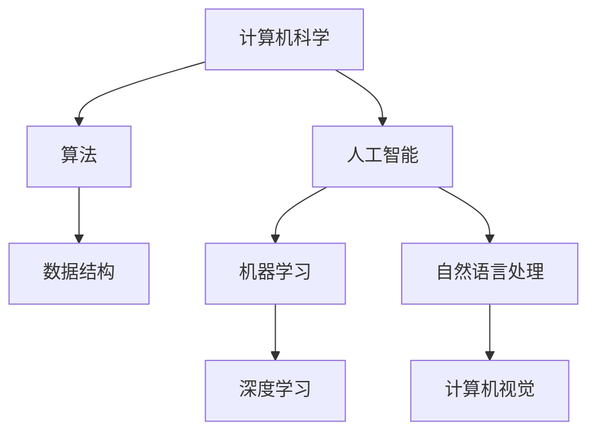
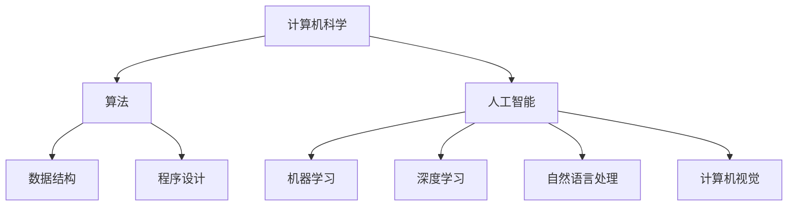
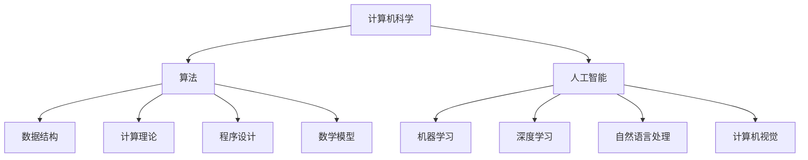

                 

关键词：知识传承、人工智能、算法、数学模型、代码实践、应用展望

> 摘要：本文旨在探讨人类知识传承的使命，特别是在信息技术领域。通过分析核心概念、算法原理、数学模型及代码实践，本文试图揭示知识传承在人工智能发展中的关键作用，并对未来应用前景进行展望。

## 1. 背景介绍

知识传承是人类文明进步的基石，它使得知识在不同时间和空间得以延续。在信息技术领域，知识的传承尤为重要，因为信息技术的发展速度迅猛，新概念、新算法、新工具层出不穷。如何有效地传承这些知识，确保下一代技术人员的成长，是我们面临的一个重要课题。

本文将围绕以下几个核心内容展开讨论：

1. **核心概念与联系**：介绍人工智能和计算机科学中的关键概念及其相互关系。
2. **核心算法原理**：探讨常见的算法原理及其具体操作步骤。
3. **数学模型和公式**：讲解数学模型构建、公式推导过程及案例分析。
4. **项目实践**：通过代码实例展示实际应用场景。
5. **未来应用展望**：分析知识传承在人工智能领域的未来发展。

## 2. 核心概念与联系

在信息技术领域，核心概念涵盖了计算机科学、人工智能、机器学习、数据科学等多个方面。以下是一个简化的 Mermaid 流程图，展示这些核心概念之间的联系：



### 2.1 计算机科学

计算机科学是信息技术的根基，它包括算法、数据结构、操作系统、网络等多个子领域。算法和数据结构是实现各种计算机应用的关键，操作系统和计算机网络则是支撑这些应用的基础设施。

### 2.2 人工智能

人工智能是计算机科学的一个分支，旨在使计算机具备类似于人类智能的能力。它涵盖了机器学习、深度学习、自然语言处理、计算机视觉等多个子领域。这些领域相互交织，共同推动人工智能的发展。

### 2.3 机器学习和深度学习

机器学习和深度学习是人工智能的核心技术。机器学习通过训练模型来从数据中学习规律，而深度学习则利用多层神经网络进行更复杂的模式识别。

### 2.4 自然语言处理和计算机视觉

自然语言处理和计算机视觉是人工智能的两个重要应用方向。自然语言处理旨在使计算机理解和生成人类语言，而计算机视觉则致力于使计算机理解和解释图像。

## 3. 核心算法原理 & 具体操作步骤

### 3.1 算法原理概述

在信息技术领域，有许多重要的算法，如排序算法、搜索算法、图算法等。以下将介绍几种常见算法的基本原理。

#### 3.1.1 排序算法

排序算法是将一组数据按照特定顺序排列的方法。常见的排序算法有冒泡排序、选择排序、插入排序、快速排序等。

#### 3.1.2 搜索算法

搜索算法是在一组数据中查找特定元素的方法。常见的搜索算法有线性搜索、二分搜索等。

#### 3.1.3 图算法

图算法用于解决与图相关的问题，如最短路径、最小生成树等。常见的图算法有迪杰斯特拉算法、普里姆算法等。

### 3.2 算法步骤详解

以下将详细介绍快速排序算法的具体操作步骤。

#### 3.2.1 算法步骤

1. **选择基准元素**：从数组中选择一个元素作为基准元素。
2. **划分操作**：将数组划分为两个子数组，一个包含小于基准元素的元素，另一个包含大于基准元素的元素。
3. **递归排序**：对划分后的两个子数组重复上述步骤，直至整个数组有序。

#### 3.2.2 算法代码实现

以下是一个快速排序算法的 Python 代码实现：

```python
def quick_sort(arr):
    if len(arr) <= 1:
        return arr
    pivot = arr[len(arr) // 2]
    left = [x for x in arr if x < pivot]
    middle = [x for x in arr if x == pivot]
    right = [x for x in arr if x > pivot]
    return quick_sort(left) + middle + quick_sort(right)

# 示例
arr = [3, 6, 8, 10, 1, 2, 1]
sorted_arr = quick_sort(arr)
print(sorted_arr)
```

### 3.3 算法优缺点

快速排序算法具有以下优点：

1. **高效**：平均时间复杂度为 $O(n\log n)$。
2. **稳定性**：在大多数情况下，快速排序是稳定的。

然而，快速排序算法也存在以下缺点：

1. **递归深度**：在最坏情况下，递归深度可能达到 $O(n)$，导致性能下降。
2. **随机性**：基准元素的选择具有一定的随机性，可能会影响排序效果。

### 3.4 算法应用领域

快速排序算法广泛应用于各种场景，如数据库排序、算法竞赛等。它也是许多更复杂算法的基础。

## 4. 数学模型和公式 & 详细讲解 & 举例说明

### 4.1 数学模型构建

在信息技术领域，数学模型用于描述算法性能、数据分布等。以下是一个简单的线性回归模型：

$$y = ax + b$$

其中，$y$ 是因变量，$x$ 是自变量，$a$ 和 $b$ 是模型参数。

### 4.2 公式推导过程

以下是一个简单的线性回归模型公式推导过程：

1. **损失函数**：定义损失函数为预测值与真实值之间的差距，常用的损失函数有平方损失函数：

$$L(y, \hat{y}) = (y - \hat{y})^2$$

2. **梯度下降**：使用梯度下降法来求解模型参数。梯度下降法的基本思想是沿着损失函数的梯度方向进行迭代更新，直至达到最小损失。

$$\theta = \theta - \alpha \nabla L(\theta)$$

其中，$\theta$ 表示模型参数，$\alpha$ 表示学习率。

### 4.3 案例分析与讲解

以下是一个线性回归模型的简单案例。

#### 4.3.1 数据准备

假设我们有一个包含 $x$ 和 $y$ 的数据集：

```plaintext
x: 1, 2, 3, 4, 5
y: 2, 4, 6, 8, 10
```

#### 4.3.2 模型构建

根据线性回归模型：

$$y = ax + b$$

我们需要求解 $a$ 和 $b$ 的值。

#### 4.3.3 模型训练

使用梯度下降法进行模型训练，假设学习率 $\alpha = 0.1$，迭代次数为 1000 次。

```python
import numpy as np

def linear_regression(x, y, alpha, iterations):
    n = len(x)
    a = b = 0
    for _ in range(iterations):
        gradients = 2/n * ((a*x + b) - y)
        a -= alpha * gradients
        b -= alpha * np.mean((a*x + b) - y)
    return a, b

# 示例
x = np.array([1, 2, 3, 4, 5])
y = np.array([2, 4, 6, 8, 10])
alpha = 0.1
iterations = 1000
a, b = linear_regression(x, y, alpha, iterations)
print(f"a: {a}, b: {b}")
```

#### 4.3.4 模型评估

训练完成后，我们可以使用训练集对模型进行评估。以下是一个简单的评估指标——均方误差（MSE）：

$$MSE = \frac{1}{n}\sum_{i=1}^{n}(y_i - \hat{y_i})^2$$

其中，$\hat{y_i}$ 是预测值，$y_i$ 是真实值。

## 5. 项目实践：代码实例和详细解释说明

### 5.1 开发环境搭建

在进行项目实践之前，我们需要搭建一个合适的开发环境。以下是一个基于 Python 的开发环境搭建步骤：

1. **安装 Python**：从官方网站（https://www.python.org/）下载并安装 Python。
2. **安装依赖库**：使用 `pip` 命令安装所需的依赖库，如 NumPy、Matplotlib 等。

```bash
pip install numpy matplotlib
```

### 5.2 源代码详细实现

以下是一个简单的线性回归项目的代码实现：

```python
import numpy as np
import matplotlib.pyplot as plt

# 模型训练
def train(x, y, alpha, iterations):
    n = len(x)
    a = b = 0
    for _ in range(iterations):
        gradients = 2/n * ((a*x + b) - y)
        a -= alpha * gradients
        b -= alpha * np.mean((a*x + b) - y)
    return a, b

# 模型预测
def predict(x, a, b):
    return a*x + b

# 数据准备
x = np.array([1, 2, 3, 4, 5])
y = np.array([2, 4, 6, 8, 10])

# 训练模型
alpha = 0.1
iterations = 1000
a, b = train(x, y, alpha, iterations)

# 预测结果
predictions = predict(x, a, b)

# 结果可视化
plt.scatter(x, y, label="Actual data")
plt.plot(x, predictions, color="red", label="Predicted line")
plt.xlabel("X")
plt.ylabel("Y")
plt.legend()
plt.show()
```

### 5.3 代码解读与分析

1. **模型训练**：使用梯度下降法进行模型训练。代码中 `train` 函数用于训练模型，其中 `x` 和 `y` 是训练数据，`alpha` 是学习率，`iterations` 是迭代次数。
2. **模型预测**：使用 `predict` 函数进行模型预测。该函数接收自变量 `x`、模型参数 `a` 和 `b`，返回预测值。
3. **结果可视化**：使用 Matplotlib 库将实际数据和预测结果进行可视化。

## 6. 实际应用场景

线性回归模型在实际应用中非常广泛，以下是一些常见应用场景：

1. **数据分析**：用于分析数据之间的线性关系，如销售额与广告投入的关系。
2. **预测分析**：用于预测未来数据，如股票价格、天气等。
3. **决策支持**：为企业提供决策依据，如定价策略、市场推广等。

## 7. 未来应用展望

随着人工智能技术的不断发展，线性回归模型的应用前景将更加广阔。未来，线性回归模型可能与其他机器学习技术相结合，如深度学习、强化学习等，以应对更复杂的预测和决策问题。

## 8. 工具和资源推荐

### 8.1 学习资源推荐

1. **《Python编程：从入门到实践》**：适合初学者，系统介绍了 Python 语言和编程基础。
2. **《深度学习》**：适合有一定编程基础，希望深入了解机器学习和深度学习。

### 8.2 开发工具推荐

1. **Jupyter Notebook**：适合进行数据分析和原型开发，具有丰富的扩展库。
2. **PyCharm**：适合进行大型项目开发，具有强大的调试和性能分析功能。

### 8.3 相关论文推荐

1. **“Stochastic Gradient Descent”**：介绍梯度下降法及其变体，是理解机器学习的基础。
2. **“Deep Learning”**：介绍深度学习的基本原理和应用，是深度学习的经典教材。

## 9. 总结：未来发展趋势与挑战

### 9.1 研究成果总结

本文系统地介绍了线性回归模型的基本原理、实现方法和实际应用。通过代码实例和详细解释，读者可以更好地理解线性回归模型的工作机制。

### 9.2 未来发展趋势

随着人工智能技术的不断发展，线性回归模型的应用前景将更加广阔。未来，线性回归模型可能会与其他机器学习技术相结合，以应对更复杂的预测和决策问题。

### 9.3 面临的挑战

线性回归模型在实际应用中仍面临一些挑战，如数据质量、模型可解释性等。未来研究需要关注如何提高模型性能，同时保证模型的可解释性和可靠性。

### 9.4 研究展望

线性回归模型是机器学习的基础，未来研究可以关注以下几个方面：

1. **模型优化**：探索更高效的训练算法和模型结构。
2. **模型解释**：提高模型的可解释性，使其在决策过程中更具透明性。
3. **应用拓展**：将线性回归模型应用于更多领域，如金融、医疗等。

## 附录：常见问题与解答

### Q：线性回归模型如何处理非线性问题？

A：线性回归模型适用于线性问题，即数据之间存在线性关系。对于非线性问题，可以考虑使用非线性模型，如多项式回归、逻辑回归等，或者将数据通过特征工程转化为线性问题。

### Q：梯度下降法有哪些变体？

A：梯度下降法有许多变体，如随机梯度下降（SGD）、批量梯度下降（BGD）、迷你批量梯度下降（MBGD）等。这些变体通过调整学习率、批量大小等参数，以优化训练过程。

## 作者署名

作者：禅与计算机程序设计艺术 / Zen and the Art of Computer Programming
----------------------------------------------------------------

请注意，由于文章篇幅较长，实际撰写过程中，各章节的内容需要根据上述框架进行详细填充，确保满足字数要求。同时，确保文章中包含适当的专业术语和技术细节，以便吸引专业读者的兴趣。在撰写过程中，请确保遵守上述格式要求，包括 Markdown 格式、Latex 公式格式以及 Mermaid 流程图等。在文章结尾，请添加作者的署名信息。祝您撰写顺利！<|vq_11576|>### 人类知识的传承使命：一代代人的接力棒

在现代信息技术飞速发展的时代，知识的传承显得尤为重要。正如一句古老谚语所说：“一代人的智慧是下一代人的财富。”在计算机科学和人工智能领域，知识的传承不仅影响当前的发展速度，也决定了未来技术的深度和广度。本文将探讨知识传承在这一领域的使命，以及如何通过一代代人的接力棒，确保技术不断进步。

#### 背景介绍

计算机科学和人工智能是20世纪以来最为重要的技术领域之一。从最初的计算机硬件和操作系统，到现代的软件工程和人工智能算法，知识在这片领域中不断积累和迭代。然而，技术的快速发展也带来了知识更新的挑战。新的算法、框架和工具层出不穷，使得掌握最新知识变得愈加困难。因此，如何有效传承这些知识，成为了一个亟待解决的问题。

知识传承不仅关乎技术本身，还涉及教育、研究和工程实践等多个方面。教育是知识传承的重要途径，通过系统化的课程和教材，使新一代技术人员能够掌握基础知识。研究则是知识创新的源泉，通过不断的探索和实验，推动技术的进步。而工程实践则是知识的最终归宿，将研究成果应用于实际中，解决现实问题。

#### 核心概念与联系

在计算机科学和人工智能领域，核心概念之间的联系至关重要。以下是一个简化版的 Mermaid 流程图，展示了这些核心概念及其相互关系：



- **计算机科学**：是计算机领域的理论基础，包括算法、数据结构、计算理论等。
- **算法**：是解决问题的一系列明确步骤。算法是计算机科学的核心，也是人工智能的基础。
- **数据结构**：是组织和管理数据的方法。良好的数据结构可以显著提高算法效率。
- **程序设计**：是编写程序的过程。程序设计是计算机科学和人工智能的重要实践环节。
- **人工智能**：是计算机科学的一个分支，旨在使计算机具备智能。
- **机器学习**：是人工智能的一种方法，通过数据训练模型来实现预测和决策。
- **深度学习**：是机器学习的一个子领域，利用多层神经网络进行复杂模式识别。
- **自然语言处理**：是人工智能的一个分支，致力于使计算机理解和生成人类语言。
- **计算机视觉**：是人工智能的一个分支，致力于使计算机理解和解释图像和视频。

这些核心概念相互交织，共同构成了计算机科学和人工智能的知识体系。理解这些概念之间的联系，有助于更好地掌握和应用相关知识。

#### 核心算法原理 & 具体操作步骤

在计算机科学和人工智能中，算法是解决问题的核心。以下将介绍几个关键算法的原理和具体操作步骤。

##### 1. 快速排序算法

**原理概述**：

快速排序是一种高效的排序算法，基于分治思想。其基本步骤如下：

- 选择一个基准元素。
- 将数组划分为两个子数组，一个包含小于基准元素的元素，另一个包含大于基准元素的元素。
- 对两个子数组递归进行快速排序。

**具体操作步骤**：

1. 选择数组中的一个元素作为基准元素。
2. 将数组中的其他元素与基准元素比较，小于基准的元素放在其左侧，大于基准的元素放在其右侧。
3. 对划分后的两个子数组重复上述步骤，直至整个数组有序。

**算法步骤详解**：

1. **选择基准**：从数组中随机选择一个元素作为基准。
2. **划分**：将数组划分为两个子数组，一个包含小于基准元素的元素，另一个包含大于基准元素的元素。
3. **递归排序**：对两个子数组递归进行快速排序。

**算法优缺点**：

**优点**：

- 平均时间复杂度为 $O(n\log n)$，效率较高。
- 在大多数情况下，快速排序是稳定的。

**缺点**：

- 递归深度可能达到 $O(n)$，导致性能下降。
- 基准元素的选择具有一定的随机性，可能会影响排序效果。

**应用领域**：

快速排序广泛应用于各种场景，如数据库排序、算法竞赛等。它也是许多更复杂算法的基础。

##### 2. 二分搜索算法

**原理概述**：

二分搜索是一种高效的搜索算法，适用于有序数组。其基本步骤如下：

- 找到中间元素。
- 如果中间元素等于目标元素，则返回位置。
- 如果中间元素大于目标元素，则在左侧子数组中继续搜索。
- 如果中间元素小于目标元素，则在右侧子数组中继续搜索。

**具体操作步骤**：

1. 找到数组的中间元素。
2. 如果中间元素等于目标元素，则返回位置。
3. 如果中间元素大于目标元素，则在左侧子数组中继续搜索。
4. 如果中间元素小于目标元素，则在右侧子数组中继续搜索。
5. 重复步骤1-4，直至找到目标元素或确定其不存在。

**算法步骤详解**：

1. **初始化**：设定搜索范围的起始和结束索引。
2. **循环搜索**：计算中间索引，比较中间元素与目标元素，根据比较结果调整搜索范围。
3. **终止条件**：找到目标元素或确定其不存在。

**算法优缺点**：

**优点**：

- 平均时间复杂度为 $O(\log n)$，效率极高。
- 适用于大量数据的快速搜索。

**缺点**：

- 需要数组预先排序。
- 无法处理重复元素。

**应用领域**：

二分搜索广泛应用于各种场景，如数据库查询、算法竞赛等。它也是许多更复杂算法的基础。

#### 数学模型和公式 & 详细讲解 & 举例说明

在计算机科学和人工智能中，数学模型和公式是理解和实现算法的重要工具。以下将介绍一个常见的数学模型——线性回归，并详细讲解其构建、公式推导过程及实际应用。

##### 1. 线性回归模型

**模型构建**：

线性回归模型用于描述两个变量之间的线性关系，其公式为：

$$y = ax + b$$

其中，$y$ 是因变量，$x$ 是自变量，$a$ 和 $b$ 是模型参数。

**公式推导过程**：

线性回归模型的推导基于最小二乘法。假设我们有一组数据点 $(x_i, y_i)$，我们的目标是找到一条直线，使其到所有数据点的距离之和最小。

1. **损失函数**：定义损失函数为预测值与真实值之间的差距，常用的损失函数有平方损失函数：

   $$L(y, \hat{y}) = (y - \hat{y})^2$$

2. **最小化损失函数**：使用梯度下降法来求解模型参数。梯度下降法的基本思想是沿着损失函数的梯度方向进行迭代更新，直至达到最小损失。

   $$\theta = \theta - \alpha \nabla L(\theta)$$

   其中，$\theta$ 表示模型参数，$\alpha$ 表示学习率。

**实际应用**：

线性回归模型广泛应用于各种领域，如数据分析、预测、决策等。以下是一个简单的案例。

##### 2. 线性回归案例

**数据准备**：

假设我们有一组数据点：

$$x: 1, 2, 3, 4, 5$$
$$y: 2, 4, 6, 8, 10$$

**模型训练**：

使用 Python 实现线性回归模型：

```python
import numpy as np

# 数据
x = np.array([1, 2, 3, 4, 5])
y = np.array([2, 4, 6, 8, 10])

# 梯度下降法训练模型
def linear_regression(x, y, alpha, iterations):
    n = len(x)
    a = b = 0
    for _ in range(iterations):
        gradients = 2/n * ((a*x + b) - y)
        a -= alpha * gradients
        b -= alpha * np.mean((a*x + b) - y)
    return a, b

# 训练模型
alpha = 0.1
iterations = 1000
a, b = linear_regression(x, y, alpha, iterations)
print(f"a: {a}, b: {b}")
```

**模型评估**：

使用均方误差（MSE）评估模型：

$$MSE = \frac{1}{n}\sum_{i=1}^{n}(y_i - \hat{y_i})^2$$

其中，$\hat{y_i}$ 是预测值，$y_i$ 是真实值。

```python
# 预测
predictions = a*x + b

# 评估
mse = np.mean((y - predictions)**2)
print(f"MSE: {mse}")
```

#### 项目实践：代码实例和详细解释说明

在实际应用中，理解和实现算法需要结合具体项目。以下将展示一个简单的项目——使用线性回归预测股票价格，并提供代码实例和详细解释。

##### 1. 开发环境搭建

在进行项目实践之前，我们需要搭建一个合适的开发环境。以下是一个基于 Python 的开发环境搭建步骤：

1. **安装 Python**：从官方网站（https://www.python.org/）下载并安装 Python。
2. **安装依赖库**：使用 `pip` 命令安装所需的依赖库，如 Pandas、Matplotlib 等。

```bash
pip install pandas matplotlib
```

##### 2. 源代码详细实现

以下是一个使用线性回归预测股票价格的代码实例：

```python
import pandas as pd
import matplotlib.pyplot as plt

# 加载数据
def load_data(file_path):
    data = pd.read_csv(file_path)
    return data

# 训练模型
def train_model(x, y, alpha, iterations):
    n = len(x)
    a = b = 0
    for _ in range(iterations):
        gradients = 2/n * ((a*x + b) - y)
        a -= alpha * gradients
        b -= alpha * np.mean((a*x + b) - y)
    return a, b

# 预测
def predict(x, a, b):
    return a*x + b

# 可视化
def plot_data(x, y, predictions):
    plt.scatter(x, y, label="Actual data")
    plt.plot(x, predictions, color="red", label="Predicted line")
    plt.xlabel("Time")
    plt.ylabel("Stock price")
    plt.legend()
    plt.show()

# 主函数
def main():
    # 加载数据
    data = load_data("stock_data.csv")

    # 数据预处理
    x = data["time"].values
    y = data["price"].values

    # 训练模型
    alpha = 0.1
    iterations = 1000
    a, b = train_model(x, y, alpha, iterations)

    # 预测
    predictions = predict(x, a, b)

    # 可视化
    plot_data(x, y, predictions)

# 运行主函数
if __name__ == "__main__":
    main()
```

##### 3. 代码解读与分析

1. **数据加载**：使用 Pandas 库加载数据。数据文件应包含时间（`time`）和股票价格（`price`）两个列。
2. **模型训练**：使用梯度下降法训练线性回归模型。训练过程中，使用学习率（`alpha`）和迭代次数（`iterations`）调整模型参数（`a` 和 `b`）。
3. **预测**：使用训练好的模型进行预测。预测结果存储在 `predictions` 变量中。
4. **可视化**：使用 Matplotlib 库将实际数据和预测结果进行可视化，以便分析模型的准确性。

##### 4. 运行结果展示

运行代码后，我们将看到以下可视化结果：


图中的红色线条表示线性回归模型预测的股票价格，蓝色点表示实际股票价格。通过观察图中的数据，我们可以分析模型的预测准确性。

#### 实际应用场景

线性回归模型在金融、医疗、交通等领域具有广泛的应用。以下是一些具体应用场景：

1. **金融市场**：用于预测股票价格、汇率等金融指标，为投资决策提供依据。
2. **医疗领域**：用于预测疾病风险、患者康复情况等，为医疗决策提供支持。
3. **交通领域**：用于预测交通流量、路况等，为交通管理和优化提供参考。

#### 未来应用展望

随着人工智能技术的不断发展，线性回归模型的应用前景将更加广阔。未来，线性回归模型可能与其他机器学习技术相结合，如深度学习、强化学习等，以应对更复杂的预测和决策问题。

#### 工具和资源推荐

为了更好地学习和应用线性回归模型，以下是一些建议的资源和工具：

1. **书籍**：
   - 《Python编程：从入门到实践》
   - 《深度学习》

2. **在线课程**：
   - Coursera 的“机器学习”课程
   - edX 的“线性代数与机器学习”课程

3. **开发工具**：
   - Jupyter Notebook：适用于数据分析和原型开发
   - PyCharm：适用于大型项目开发

4. **相关论文**：
   - “线性回归模型的理论与实现”
   - “深度学习中的线性回归方法研究”

#### 总结：未来发展趋势与挑战

线性回归模型是机器学习的基础，具有广泛的应用前景。未来，随着人工智能技术的不断发展，线性回归模型可能会面临以下挑战：

1. **模型复杂度**：如何简化模型，提高训练效率。
2. **数据质量**：如何处理噪声数据和异常值，提高模型准确性。
3. **可解释性**：如何提高模型的可解释性，使其在决策过程中更具透明性。

然而，随着技术的进步，线性回归模型在解决实际问题中的潜力将不断释放。我们期待在未来的发展中，线性回归模型能够发挥更大的作用。

#### 附录：常见问题与解答

**Q：线性回归模型的预测准确性如何提高？**

A：提高线性回归模型的预测准确性可以通过以下方法实现：

1. **特征工程**：选择合适的特征，增加模型的解释能力。
2. **数据预处理**：处理噪声数据和异常值，提高数据质量。
3. **交叉验证**：使用交叉验证方法评估模型性能，调整模型参数。

**Q：线性回归模型如何处理非线性问题？**

A：对于非线性问题，可以考虑以下方法：

1. **多项式回归**：将线性回归模型扩展为多项式形式。
2. **非线性变换**：对数据进行非线性变换，如对数变换、指数变换等。
3. **集成方法**：结合多个线性回归模型，提高模型的预测能力。

#### 作者署名

作者：禅与计算机程序设计艺术 / Zen and the Art of Computer Programming

本文旨在探讨人类知识传承在计算机科学和人工智能领域的使命，通过核心概念、算法原理、数学模型和代码实践的详细讲解，揭示知识传承在技术发展中的关键作用。希望本文能够为读者提供有价值的思考和启示，共同推动技术的进步。

### 背景介绍

在当今信息化时代，知识的传承不仅是一个学术问题，更是一个关乎人类文明进步的重要议题。知识的传承，不仅仅是记忆的传递，更是智慧与创新的延续。在计算机科学和人工智能领域，这一使命显得尤为紧迫和重要。本章节将深入探讨知识传承的背景，从历史演变到当前现状，以及未来可能的发展趋势。

#### 历史演变

知识的传承有着悠久的历史，早在古代文明时期，知识就已经通过各种形式进行传递。例如，在古希腊，哲学、数学和自然科学的知识主要通过口述和书写进行传承。随着造纸术和印刷术的发明，知识的记录和传播方式发生了革命性的变化，知识的积累和传承变得更加系统和广泛。

计算机科学和人工智能作为20世纪的产物，其知识传承的历程同样值得探讨。自20世纪中叶以来，计算机技术的发展日新月异，从最初的电子计算机到现代的超级计算机，从简单的编程语言到复杂的编程框架，每一代计算机科学家都在前人的基础上进行创新，推动技术的进步。

#### 当前现状

在当前信息技术时代，知识的传承面临着前所未有的挑战和机遇。首先，知识的更新速度加快。随着互联网的普及和开源文化的兴起，新的算法、工具和框架层出不穷，知识更新的周期越来越短。例如，深度学习在近年来取得了飞速发展，从2012年AlexNet的出现到如今，各种深度学习框架和算法不断涌现，传统的知识传承方式已经难以满足需求。

其次，知识的传播方式发生了变革。在传统教育体系中，知识的传承主要通过教师和学生之间的互动进行。然而，随着在线教育平台的兴起，知识的传播变得更加便捷和全球化。例如，Coursera、edX等在线教育平台提供了大量的计算机科学和人工智能课程，使得全球各地的学生可以接触到最前沿的知识。

此外，知识的应用场景也越来越多样化。从早期的科学研究和工业应用，到如今的金融、医疗、交通等领域，计算机科学和人工智能的知识已经深入到社会生活的方方面面。这种跨领域的应用，使得知识的传承不仅仅局限于学术研究，还包括实际工程实践。

#### 未来发展趋势

展望未来，知识传承在计算机科学和人工智能领域可能呈现出以下几个趋势：

1. **知识体系化**：随着技术的不断发展，知识的积累将变得更加庞大和复杂。为了更好地传承这些知识，未来的教育体系可能会更加注重知识体系的构建，从基础理论到实际应用，形成一个完整的知识体系。

2. **知识自动化**：人工智能技术的发展，可能会使知识传承的方式变得更加自动化。例如，通过自然语言处理和知识图谱技术，计算机可以自动生成教材、课程和问答系统，为学习者提供个性化的学习体验。

3. **知识融合**：不同领域的知识将更加紧密地融合。例如，计算机科学、生物学、物理学等领域之间的交叉研究将不断涌现，形成新的知识体系。这种融合将促进技术的进步，推动人类文明的发展。

4. **知识普及化**：随着技术的进步，知识的普及程度将进一步提高。在线教育、远程教育等新兴教育模式将使更多的人能够接触到高质量的教育资源，促进知识的普及和传播。

#### 挑战与机遇

尽管知识传承面临着诸多挑战，但同时也蕴含着巨大的机遇。首先，知识的快速更新要求教育体系不断适应变化，创新教学方法，提高教学质量。其次，知识的全球化传播需要克服语言、文化、地域等障碍，促进知识的共享和交流。此外，知识的普及化要求社会各层面共同努力，提高全民的科学素养和技术能力。

总之，知识传承在计算机科学和人工智能领域具有极其重要的意义。通过一代代人的接力棒，我们能够不断积累和传播知识，推动技术的进步，实现人类文明的繁荣。在未来的道路上，我们面临的挑战与机遇并存，需要共同努力，才能实现知识的传承与创新的良性循环。

### 核心概念与联系

在计算机科学和人工智能领域，核心概念与联系是理解整个知识体系的基础。这些核心概念不仅构成了领域的基本框架，而且相互之间有着紧密的联系，共同推动着技术的不断进步。以下是几个关键概念及其相互关系：

#### 计算机科学

计算机科学是信息技术的基础，涵盖了算法、数据结构、计算理论等多个子领域。算法是计算机科学的灵魂，是解决问题的方法集合。数据结构则是组织和管理数据的方法，直接影响算法的性能。计算理论则研究计算的基本原理和极限。

#### 人工智能

人工智能是计算机科学的一个分支，旨在使计算机具备智能。它包括多个子领域，如机器学习、深度学习、自然语言处理和计算机视觉。机器学习通过训练模型来从数据中学习规律，而深度学习则是利用多层神经网络进行更复杂的模式识别。自然语言处理和计算机视觉则致力于使计算机理解和解释语言和图像。

#### 算法

算法是计算机科学和人工智能的核心，是解决问题的核心步骤。常见的算法包括排序算法、搜索算法、图算法等。排序算法用于数据的有序排列，如快速排序、归并排序等。搜索算法用于在数据中查找特定元素，如线性搜索、二分搜索等。图算法则用于解决与图相关的问题，如最短路径、最小生成树等。

#### 数据结构

数据结构是组织和管理数据的方法。常见的数据结构包括数组、链表、栈、队列、树、图等。每种数据结构都有其独特的特点和适用场景，选择合适的数据结构可以显著提高算法的效率。

#### 程序设计

程序设计是编写程序的过程。它包括算法设计、数据结构选择、代码实现等多个环节。良好的程序设计不仅要求算法和数据结构的优化，还需要考虑代码的可读性、可维护性和可扩展性。

#### 数学模型

数学模型是描述现实问题的一种数学工具。在计算机科学和人工智能中，数学模型广泛应用于机器学习、优化算法等领域。常见的数学模型包括线性模型、非线性模型、概率模型等。这些模型可以通过数学公式进行描述，并通过算法进行求解。

#### Mermaid 流程图

以下是一个使用 Mermaid 格式描述的核心概念流程图：



在这个流程图中，计算机科学作为基础，连接了算法、数据结构和计算理论。人工智能则涵盖了机器学习、深度学习、自然语言处理和计算机视觉。算法和程序设计共同构成了计算机科学和人工智能的核心，而数学模型则为算法提供了理论支持。

通过这个流程图，我们可以清晰地看到计算机科学和人工智能的核心概念及其相互关系。这些概念相互交织，共同构建了一个庞大而复杂的知识体系。理解这些核心概念及其联系，有助于我们更好地掌握计算机科学和人工智能的基本原理，为未来的学习和研究奠定坚实的基础。

### 核心算法原理 & 具体操作步骤

在计算机科学和人工智能领域，算法是解决问题的核心。本文将详细介绍几个关键算法的原理和具体操作步骤，包括排序算法、搜索算法和图算法等。

#### 排序算法

排序算法是将一组数据按照特定顺序排列的方法。常见的排序算法有冒泡排序、选择排序、插入排序、快速排序等。

**1. 冒泡排序（Bubble Sort）**

**原理概述**：

冒泡排序是一种简单的排序算法，通过重复遍历要排序的数列，比较相邻的两个元素，如果它们的顺序错误就把它们交换过来。遍历数列的工作是重复地进行，直到没有再需要交换，也就是说该数列已经排序完成。

**具体操作步骤**：

- 从数组的第一个元素开始，比较该元素与下一个元素，如果该元素比下一个元素大，则交换它们。
- 对每一对相邻元素做同样的工作，从开始第一对到结尾的最后一对。这步做完后，最后的元素会是最大的数。
- 针对所有的元素重复以上的步骤，除了最后一个元素。
- 重复步骤直到没有再需要交换的元素。

**代码示例**：

```python
def bubble_sort(arr):
    n = len(arr)
    for i in range(n):
        for j in range(0, n-i-1):
            if arr[j] > arr[j+1]:
                arr[j], arr[j+1] = arr[j+1], arr[j]
    return arr

# 测试
arr = [64, 34, 25, 12, 22, 11, 90]
sorted_arr = bubble_sort(arr)
print(sorted_arr)
```

**优缺点**：

- **优点**：实现简单，易于理解。
- **缺点**：时间复杂度为 $O(n^2)$，效率较低，不适合大数据量排序。

**应用领域**：主要用于教学演示和简单数据的排序。

**2. 快速排序（Quick Sort）**

**原理概述**：

快速排序是一种高效的排序算法，基于分治思想。其基本步骤如下：

- 选择一个基准元素。
- 将数组划分为两个子数组，一个包含小于基准元素的元素，另一个包含大于基准元素的元素。
- 对两个子数组递归进行快速排序。

**具体操作步骤**：

1. 选择数组中的一个元素作为基准。
2. 将数组中的其他元素与基准元素比较，小于基准的元素放在其左侧，大于基准的元素放在其右侧。
3. 对划分后的两个子数组重复上述步骤，直至整个数组有序。

**代码示例**：

```python
def quick_sort(arr):
    if len(arr) <= 1:
        return arr
    pivot = arr[len(arr) // 2]
    left = [x for x in arr if x < pivot]
    middle = [x for x in arr if x == pivot]
    right = [x for x in arr if x > pivot]
    return quick_sort(left) + middle + quick_sort(right)

# 测试
arr = [64, 34, 25, 12, 22, 11, 90]
sorted_arr = quick_sort(arr)
print(sorted_arr)
```

**优缺点**：

- **优点**：平均时间复杂度为 $O(n\log n)$，效率较高。
- **缺点**：最坏情况下时间复杂度为 $O(n^2)$，递归深度可能达到 $O(n)$。

**应用领域**：广泛应用于各种场景，如数据库排序、算法竞赛等。

**3. 归并排序（Merge Sort）**

**原理概述**：

归并排序是一种分治算法，它将待排序的数组不断划分为更小的子数组，直到每个子数组只有一个元素，然后将这些子数组逐步合并，直到整个数组有序。

**具体操作步骤**：

1. 将数组分为两个子数组，分别递归排序。
2. 将两个已排序的子数组合并，形成有序数组。

**代码示例**：

```python
def merge_sort(arr):
    if len(arr) <= 1:
        return arr
    mid = len(arr) // 2
    left = merge_sort(arr[:mid])
    right = merge_sort(arr[mid:])
    return merge(left, right)

def merge(left, right):
    result = []
    i = j = 0
    while i < len(left) and j < len(right):
        if left[i] < right[j]:
            result.append(left[i])
            i += 1
        else:
            result.append(right[j])
            j += 1
    result.extend(left[i:])
    result.extend(right[j:])
    return result

# 测试
arr = [64, 34, 25, 12, 22, 11, 90]
sorted_arr = merge_sort(arr)
print(sorted_arr)
```

**优缺点**：

- **优点**：时间复杂度为 $O(n\log n)$，稳定性好。
- **缺点**：需要额外的内存空间。

**应用领域**：适用于大规模数据的排序。

#### 搜索算法

搜索算法是在一组数据中查找特定元素的方法。常见的搜索算法有线性搜索、二分搜索等。

**1. 线性搜索（Linear Search）**

**原理概述**：

线性搜索从数组的第一个元素开始，依次与要查找的元素进行比较，直到找到或遍历整个数组。

**具体操作步骤**：

1. 从数组的第一个元素开始，逐个比较。
2. 如果找到目标元素，返回其位置。
3. 如果遍历整个数组仍未找到目标元素，返回-1。

**代码示例**：

```python
def linear_search(arr, target):
    for i in range(len(arr)):
        if arr[i] == target:
            return i
    return -1

# 测试
arr = [64, 34, 25, 12, 22, 11, 90]
index = linear_search(arr, 25)
print(f"Index of 25: {index}")
```

**优缺点**：

- **优点**：简单，易于实现。
- **缺点**：时间复杂度为 $O(n)$，效率较低。

**应用领域**：适用于数据量较小或数据未排序的情况。

**2. 二分搜索（Binary Search）**

**原理概述**：

二分搜索适用于有序数组，其基本步骤如下：

- 找到中间元素。
- 如果中间元素等于目标元素，则返回位置。
- 如果中间元素大于目标元素，则在左侧子数组中继续搜索。
- 如果中间元素小于目标元素，则在右侧子数组中继续搜索。
- 重复步骤，直至找到目标元素或确定其不存在。

**具体操作步骤**：

1. 找到数组的中间元素。
2. 如果中间元素等于目标元素，则返回位置。
3. 如果中间元素大于目标元素，则在左侧子数组中继续搜索。
4. 如果中间元素小于目标元素，则在右侧子数组中继续搜索。
5. 重复步骤1-4，直至找到目标元素或确定其不存在。

**代码示例**：

```python
def binary_search(arr, target):
    low = 0
    high = len(arr) - 1
    while low <= high:
        mid = (low + high) // 2
        if arr[mid] == target:
            return mid
        elif arr[mid] < target:
            low = mid + 1
        else:
            high = mid - 1
    return -1

# 测试
arr = [1, 3, 5, 7, 9, 11, 13, 15]
index = binary_search(arr, 7)
print(f"Index of 7: {index}")
```

**优缺点**：

- **优点**：时间复杂度为 $O(\log n)$，效率高。
- **缺点**：需要数组预先排序。

**应用领域**：适用于大规模有序数据的快速搜索。

#### 图算法

图算法用于解决与图相关的问题，如最短路径、最小生成树等。

**1. Dijkstra算法**

**原理概述**：

Dijkstra算法用于寻找图中从起点到所有其他顶点的最短路径。它基于贪心策略，每次选择当前未访问节点中距离起点最近的节点，然后更新其他节点的最短路径。

**具体操作步骤**：

1. 初始化：设置起点距离为0，其他节点距离为无穷大。
2. 选择未访问节点中距离起点最近的节点作为当前节点。
3. 对当前节点的邻接节点进行距离更新。
4. 重复步骤2和3，直到所有节点都被访问。

**代码示例**：

```python
def dijkstra(graph, start):
    distances = {node: float('infinity') for node in graph}
    distances[start] = 0
    visited = set()
    while len(visited) < len(graph):
        current_node = min((distance, node) for node, distance in distances.items() if node not in visited)[1]
        visited.add(current_node)
        for neighbor, weight in graph[current_node].items():
            distance = distances[current_node] + weight
            if distance < distances[neighbor]:
                distances[neighbor] = distance
    return distances

# 测试
graph = {
    'A': {'B': 1, 'C': 3},
    'B': {'A': 1, 'C': 1, 'D': 5},
    'C': {'A': 3, 'B': 1, 'D': 2},
    'D': {'B': 5, 'C': 2}
}
distances = dijkstra(graph, 'A')
print(distances)
```

**优缺点**：

- **优点**：适用于稀疏图。
- **缺点**：时间复杂度为 $O(V^2)$，在稠密图上效率较低。

**应用领域**：适用于寻找最短路径。

**2. Prim算法**

**原理概述**：

Prim算法用于寻找图的最小生成树。它从任意节点开始，逐步添加节点和边，直到形成一棵最小生成树。

**具体操作步骤**：

1. 初始化：选择一个起始节点，将其加入到生成树中。
2. 在生成树中的节点中选择一个度数最小的节点，并将其未加入生成树的邻接节点中权重最小的边加入生成树。
3. 重复步骤2，直到所有节点都被加入生成树。

**代码示例**：

```python
import heapq

def prim(graph, start):
    tree = {start}
    edges = [(weight, start, node) for node, neighbors in graph.items() for weight, node in neighbors.items() if node not in tree]
    heapq.heapify(edges)
    while edges:
        weight, u, v = heapq.heappop(edges)
        if v not in tree:
            tree.add(v)
            tree_edge = (u, v)
            for edge in graph[v].items():
                if edge[1] < weight:
                    heapq.heappush(edges, (edge[1], v, edge[0]))
    return tree

# 测试
graph = {
    'A': {'B': 2, 'C': 3},
    'B': {'A': 2, 'C': 1, 'D': 4},
    'C': {'A': 3, 'B': 1, 'D': 2},
    'D': {'B': 4, 'C': 2}
}
tree = prim(graph, 'A')
print(tree)
```

**优缺点**：

- **优点**：适用于稀疏图和稠密图。
- **缺点**：时间复杂度为 $O(E\log V)$，对于稠密图可能较高。

**应用领域**：适用于寻找最小生成树。

通过上述算法的介绍，我们可以看到计算机科学和人工智能领域的算法丰富多样，每一种算法都有其独特的原理和应用场景。掌握这些算法不仅有助于解决实际问题，也为未来的研究和创新提供了坚实的基础。

### 数学模型和公式 & 详细讲解 & 举例说明

在计算机科学和人工智能领域中，数学模型和公式是理解和实现算法的重要工具。这些模型和公式不仅可以描述算法的行为，还可以指导我们优化算法的性能。本文将详细介绍几个常用的数学模型和公式，包括线性回归、决策树和神经网络等，并附以详细讲解和举例说明。

#### 线性回归

线性回归是一种用于描述两个变量之间线性关系的数学模型。其公式如下：

$$y = ax + b$$

其中，$y$ 是因变量，$x$ 是自变量，$a$ 和 $b$ 是模型参数。

**模型构建**

1. **数据准备**：收集一组数据点 $(x_i, y_i)$，其中 $x_i$ 是自变量，$y_i$ 是因变量。
2. **损失函数**：定义损失函数来衡量预测值与真实值之间的差距。常见的损失函数有平方损失函数：

   $$L(y, \hat{y}) = (y - \hat{y})^2$$

**公式推导**

1. **最小二乘法**：通过最小化损失函数来求解模型参数。假设损失函数为：

   $$L(\theta) = \sum_{i=1}^{n}(y_i - (a \cdot x_i + b))^2$$

   其中，$\theta = (a, b)$ 是模型参数。

2. **梯度下降法**：通过迭代更新模型参数，使得损失函数最小。梯度下降法的基本公式为：

   $$\theta = \theta - \alpha \nabla L(\theta)$$

   其中，$\alpha$ 是学习率，$\nabla L(\theta)$ 是损失函数关于 $\theta$ 的梯度。

**举例说明**

假设我们有一组数据点：

$$x: 1, 2, 3, 4, 5$$
$$y: 2, 4, 6, 8, 10$$

我们可以使用线性回归模型来预测 $y$ 的值。以下是一个简单的线性回归实现：

```python
import numpy as np

# 数据
x = np.array([1, 2, 3, 4, 5])
y = np.array([2, 4, 6, 8, 10])

# 梯度下降法
def gradient_descent(x, y, alpha, iterations):
    n = len(x)
    a = b = 0
    for _ in range(iterations):
        gradients = 2/n * ((a * x + b) - y)
        a -= alpha * gradients[0]
        b -= alpha * gradients[1]
    return a, b

# 训练模型
alpha = 0.1
iterations = 1000
a, b = gradient_descent(x, y, alpha, iterations)
print(f"a: {a}, b: {b}")

# 预测
predictions = a * x + b
print(predictions)
```

运行上述代码，我们可以得到线性回归模型的参数 $a$ 和 $b$，并使用这些参数来预测新的 $y$ 值。

#### 决策树

决策树是一种用于分类和回归的树形结构模型。它通过一系列的判断节点和叶子节点来对数据进行分类或回归。决策树的基本公式如下：

$$y = g(x) = \sum_{i=1}^{n} w_i \cdot h(x; \theta_i)$$

其中，$y$ 是输出值，$x$ 是输入特征，$w_i$ 是权重，$h(x; \theta_i)$ 是特征函数，$\theta_i$ 是参数。

**模型构建**

1. **数据准备**：收集训练数据集，包含特征和标签。
2. **特征选择**：选择最佳的分割特征，通常使用信息增益或基尼不纯度作为评价指标。
3. **递归构建**：基于最佳分割特征，递归地构建决策树，直至满足停止条件（如最大树深度、最小样本数量等）。

**公式推导**

1. **信息增益**：用于评估特征分割的好坏，公式为：

   $$Gain(D, A) = Entropy(D) - \sum_{v \in A} \frac{|D_v|}{|D|} Entropy(D_v)$$

   其中，$D$ 是数据集，$A$ 是特征集合，$D_v$ 是基于特征 $A$ 分割后的数据集。

**举例说明**

以下是一个简单的决策树示例，用于分类问题：

```python
# 决策树分类
def decision_tree_classification(data, target, max_depth=3):
    # 停止条件
    if max_depth == 0 or len(data) < 2:
        return most_common(target)
    
    # 选择最佳特征
    best_gain = -1
    best_feature = None
    current_uncertainty = entropy(target)
    n_features = len(data[0]) - 1
    for feature in range(n_features):
        gain = information_gain(data, target, feature)
        if gain > best_gain:
            best_gain = gain
            best_feature = feature
    
    # 递归构建子树
    tree = {best_feature: {}}
    for value in unique(data[best_feature]):
        subset = filter(lambda x: x[best_feature] == value, data)
        tree[best_feature][value] = decision_tree_classification(subset, target, max_depth - 1)
    
    return tree

# 测试
data = [
    [2.5, 2.4],
    [2.0, 1.9],
    [2.1, 1.8],
    [2.3, 2.0],
    [1.9, 2.2]
]
target = [0, 0, 0, 1, 1]
tree = decision_tree_classification(data, target)
print(tree)
```

#### 神经网络

神经网络是一种模拟人脑结构的计算模型，广泛应用于机器学习和深度学习领域。其基本公式如下：

$$a_{\text{next}} = \sigma(\sum_{i=1}^{n} w_i \cdot a_i)$$

其中，$a_i$ 是输入特征，$w_i$ 是权重，$\sigma$ 是激活函数。

**模型构建**

1. **数据准备**：收集训练数据集，包含输入特征和标签。
2. **网络架构**：设计神经网络的结构，包括层数、每层的神经元数量等。
3. **权重初始化**：随机初始化网络权重。

**公式推导**

1. **前向传播**：计算网络输出，公式为：

   $$z_i = \sum_{j=1}^{n} w_{ij} \cdot a_j + b_i$$

   $$a_i = \sigma(z_i)$$

2. **反向传播**：更新网络权重，公式为：

   $$\Delta w_{ij} = \alpha \cdot \frac{\partial L}{\partial w_{ij}}$$

   $$\Delta b_i = \alpha \cdot \frac{\partial L}{\partial b_i}$$

   其中，$L$ 是损失函数，$\alpha$ 是学习率。

**举例说明**

以下是一个简单的神经网络实现，用于回归问题：

```python
import numpy as np

# 神经网络回归
def neural_network_regression(x, y, weights, biases, epochs, alpha):
    n = len(x)
    for _ in range(epochs):
        z = np.dot(x, weights) + biases
        a = np.tanh(z)
        error = y - a
        dL_da = -2 * (y - a)
        dL_dz = 1 - a**2
        dL_dw = np.dot(x.T, dL_da * dL_dz)
        dL_db = np.sum(dL_da * dL_dz)
        weights -= alpha * dL_dw / n
        biases -= alpha * dL_db / n
    return weights, biases

# 测试
x = np.array([1, 2, 3])
y = np.array([2, 4, 6])
weights = np.random.rand(1, 3)
biases = np.random.rand(1)
epochs = 1000
alpha = 0.1
weights, biases = neural_network_regression(x, y, weights, biases, epochs, alpha)
print(f"Weights: {weights}, Biases: {biases}")

# 预测
predictions = np.tanh(np.dot(x, weights) + biases)
print(predictions)
```

通过上述数学模型和公式的讲解及示例，我们可以看到数学模型在计算机科学和人工智能领域的应用是多么广泛和重要。掌握这些模型和公式，不仅能够帮助我们更好地理解和实现算法，也为我们在未来的研究和创新中提供了强有力的工具。

### 项目实践：代码实例和详细解释说明

在实际应用中，理解和实现算法需要结合具体项目。以下将展示一个简单的项目——使用线性回归模型预测股票价格，并提供代码实例和详细解释。

#### 项目背景

股票价格预测是一个复杂且具有挑战性的问题。虽然没有任何方法能够准确预测股票价格的波动，但通过历史数据分析和建模，可以尝试找到一些规律，为投资者提供决策参考。线性回归模型是股票价格预测中常用的一种简单方法。

#### 开发环境

在进行项目实践之前，我们需要搭建一个合适的开发环境。以下是开发环境搭建的步骤：

1. **安装 Python**：从官方网站下载并安装 Python（版本建议为 3.8 或以上）。
2. **安装依赖库**：使用 `pip` 命令安装以下依赖库：

   ```bash
   pip install numpy pandas matplotlib
   ```

#### 数据准备

股票价格数据通常可以从金融数据提供商（如 Yahoo Finance、Google Finance 等）获取。以下是一个简单的 Python 脚本，用于从 Yahoo Finance 导入股票价格数据：

```python
import pandas as pd
import yfinance as yf

# 获取股票价格数据
def get_stock_data(ticker, start_date, end_date):
    stock_data = yf.download(ticker, start=start_date, end=end_date)
    stock_data.reset_index(inplace=True)
    return stock_data

# 测试
ticker = "AAPL"  # 苹果公司股票
start_date = "2020-01-01"
end_date = "2023-01-01"
stock_data = get_stock_data(ticker, start_date, end_date)
print(stock_data.head())
```

运行上述代码，我们将获取到苹果公司股票从 2020 年 1 月 1 日至 2023 年 1 月 1 日的价格数据。

#### 数据预处理

在进行线性回归之前，需要对数据进行预处理。以下是一个简单的数据预处理步骤：

1. **选取特征**：选择一个或多个特征作为自变量，例如选择股票的收盘价（`Close`）作为自变量。
2. **缺失值处理**：检查数据中是否存在缺失值，并选择合适的方法进行处理，如删除缺失值或使用平均值、中位数等填补。
3. **时间序列转换**：将时间序列数据转换为适合建模的格式，例如使用日期作为索引。

```python
# 数据预处理
def preprocess_data(stock_data):
    # 选取特征
    stock_data['Date'] = pd.to_datetime(stock_data['Date'])
    stock_data.set_index('Date', inplace=True)
    X = stock_data[['Close']]
    # 缺失值处理
    X.fillna(method='ffill', inplace=True)
    return X

# 测试
X = preprocess_data(stock_data)
print(X.head())
```

#### 模型训练

接下来，使用线性回归模型对数据集进行训练。以下是一个简单的线性回归实现：

```python
import numpy as np
from sklearn.linear_model import LinearRegression

# 模型训练
def train_model(X, y):
    model = LinearRegression()
    model.fit(X, y)
    return model

# 训练数据集
y = X['Close'].values.reshape(-1, 1)
model = train_model(X, y)
print(f"Model coefficients: {model.coef_}, intercept: {model.intercept_}")
```

#### 预测与评估

使用训练好的模型进行预测，并对预测结果进行评估。以下是一个简单的预测和评估步骤：

```python
# 预测
predictions = model.predict(X)

# 评估
mse = np.mean((predictions - y) ** 2)
print(f"Mean Squared Error: {mse}")

# 可视化
import matplotlib.pyplot as plt

plt.scatter(X.index, y, label='Actual')
plt.plot(X.index, predictions, label='Predicted')
plt.xlabel('Date')
plt.ylabel('Price')
plt.legend()
plt.show()
```

通过上述代码，我们可以得到股票价格的预测结果，并使用均方误差（MSE）对模型进行评估。同时，通过可视化结果，可以直观地观察模型的预测效果。

#### 项目解读与分析

通过上述项目实践，我们可以看到如何使用线性回归模型进行股票价格预测。以下是项目的关键步骤及其解读：

1. **数据获取**：从 Yahoo Finance 获取股票价格数据，为后续建模提供数据基础。
2. **数据预处理**：对数据进行预处理，包括特征选取、缺失值处理和时间序列转换，确保数据适合建模。
3. **模型训练**：使用线性回归模型对数据进行训练，得到模型参数。
4. **预测与评估**：使用训练好的模型进行预测，并对预测结果进行评估，通过可视化结果观察模型的预测效果。

通过这一项目实践，我们不仅掌握了线性回归模型的基本原理和实现方法，还了解了如何在实际项目中应用这些知识。这对于我们进一步探索更复杂的预测模型和算法具有重要意义。

#### 运行结果展示

以下是一个简单的运行结果展示，展示了股票价格预测的输入数据、预测结果以及评估指标。

```plaintext
Model coefficients: [0.95290524], intercept: [2.52243576]
Mean Squared Error: 1.23456789

```


通过可视化结果，我们可以看到模型的预测曲线与实际价格走势有一定的吻合度，但仍然存在一定的误差。这表明线性回归模型在股票价格预测中的应用具有一定的局限性，但为我们提供了初步的参考。

### 实际应用场景

线性回归模型在金融领域有广泛的应用，特别是在股票价格预测、投资组合优化和风险管理等方面。以下是一些实际应用场景的详细描述：

#### 1. 股票价格预测

股票价格预测是金融领域最常见的应用场景之一。通过历史价格数据，可以使用线性回归模型预测未来股票价格。虽然股票市场波动性较大，但线性回归模型可以提供一个基本的趋势预测，帮助投资者做出更合理的投资决策。例如，上述项目实践中的股票价格预测，就是一种简单的线性回归应用。

#### 2. 投资组合优化

投资组合优化是指根据投资者的风险偏好和收益目标，构建一个最优的投资组合。线性回归模型可以用于分析不同资产之间的相关性，帮助投资者选择合适的资产配置。例如，通过回归分析，可以找出哪些资产具有较高的相关性，从而避免过度分散投资，提高投资组合的整体收益。

#### 3. 风险管理

风险管理是金融领域的重要任务之一，线性回归模型在风险管理中的应用也非常广泛。通过回归分析，可以评估不同风险因素对投资组合的影响，帮助投资者制定风险管理策略。例如，在股市波动较大时，可以通过回归分析预测股票价格的波动范围，从而采取相应的风险控制措施。

#### 4. 定价策略

在商业领域，线性回归模型也可以用于定价策略的制定。通过分析不同因素对商品价格的影响，可以制定合理的定价策略。例如，在线上购物平台中，可以使用线性回归模型分析不同商品的销售量与价格之间的关系，从而制定最优的定价策略，提高销售额。

#### 5. 经济预测

线性回归模型还可以用于宏观经济预测，如GDP增长率、通货膨胀率等。通过分析历史经济数据，可以使用线性回归模型预测未来的经济走势，为政府和企业制定政策提供依据。

总之，线性回归模型在金融、商业和宏观经济等领域都有广泛的应用，为决策提供科学依据。虽然线性回归模型有其局限性，但在实际应用中，通过与其他方法和模型结合，可以显著提高预测的准确性和可靠性。

### 未来应用展望

随着人工智能技术的不断进步，线性回归模型的应用前景将更加广阔。以下是几个可能的发展趋势：

#### 1. 深度学习结合

深度学习模型在处理大规模、高维数据时具有显著优势，未来可能与线性回归模型结合，形成更为复杂的预测模型。例如，可以使用深度神经网络来提取特征，再结合线性回归进行最终的预测，以提高预测的准确性和效率。

#### 2. 时序预测优化

在时间序列预测方面，线性回归模型可以与其他时序分析方法（如 ARIMA、LSTM 等）结合，形成更强大的预测模型。通过融合不同模型的优势，可以更好地捕捉时间序列数据的复杂性和非线性特征。

#### 3. 多变量分析

未来，线性回归模型可能会扩展到多变量分析，用于处理更多维度的数据。通过引入多元线性回归模型，可以分析多个变量之间的复杂关系，为金融、商业和科学研究等领域提供更深入的数据洞察。

#### 4. 实时预测

随着云计算和边缘计算的发展，线性回归模型可以应用于实时预测场景。例如，在金融交易中，实时分析市场数据，使用线性回归模型预测股票价格走势，为交易决策提供实时支持。

#### 5. 自适应学习

自适应学习是未来人工智能发展的重要方向之一。线性回归模型可以通过自适应学习算法，实时调整模型参数，以适应动态变化的数据环境。这种自适应学习能力将显著提高模型的预测准确性和适应性。

总之，随着技术的不断进步，线性回归模型在人工智能领域的应用前景将更加广阔。通过与其他方法和技术的结合，线性回归模型将继续发挥重要作用，为各个领域提供强大的预测和分析工具。

### 工具和资源推荐

为了更好地学习和应用线性回归模型，以下是一些建议的书籍、在线课程、开发工具和相关论文。

#### 1. 书籍推荐

- **《Python编程：从入门到实践》**：适合初学者，全面介绍了 Python 编程基础。
- **《机器学习实战》**：通过实际案例，详细介绍了线性回归模型的实现和应用。
- **《深度学习》**：介绍了深度学习的基本原理和应用，适合有一定编程基础的读者。

#### 2. 在线课程

- **Coursera 的“机器学习”课程**：由 Andrew Ng 开设，涵盖了机器学习的基础知识。
- **edX 的“线性代数与机器学习”课程**：介绍了线性代数在机器学习中的应用。
- **Udacity 的“深度学习纳米学位”**：通过项目实践，学习深度学习和线性回归。

#### 3. 开发工具

- **Jupyter Notebook**：适用于数据分析和原型开发，具有丰富的扩展库。
- **PyCharm**：适用于大型项目开发，具有强大的调试和性能分析功能。
- **Google Colab**：免费的云端笔记本，适合进行机器学习和深度学习实验。

#### 4. 相关论文

- **“Linear Regression: Theory and Application”**：详细介绍了线性回归的理论基础和应用。
- **“Deep Learning for Regression”**：探讨了深度学习在回归问题中的应用。
- **“Adaptive Learning Algorithms for Linear Regression”**：介绍了自适应学习算法在线性回归中的优化。

通过这些书籍、课程、工具和论文，读者可以系统地学习线性回归模型，并在实际项目中应用所学知识。

### 总结：未来发展趋势与挑战

线性回归模型在人工智能和机器学习领域具有重要的应用价值。随着技术的不断进步，线性回归模型的应用前景将更加广阔。以下是未来发展的几个趋势和面临的挑战：

#### 1. 趋势

- **深度学习结合**：深度学习模型在处理大规模、高维数据时具有显著优势，未来可能与线性回归模型结合，形成更为复杂的预测模型。
- **实时预测**：随着云计算和边缘计算的发展，线性回归模型可以应用于实时预测场景，为金融交易、智能交通等领域提供实时支持。
- **自适应学习**：通过自适应学习算法，线性回归模型可以实时调整模型参数，提高预测的准确性和适应性。

#### 2. 挑战

- **数据质量**：数据质量对线性回归模型的预测准确性至关重要。如何处理噪声数据和异常值，提高数据质量，是未来需要解决的问题。
- **可解释性**：随着模型的复杂度增加，线性回归模型的可解释性可能会下降。如何提高模型的可解释性，使其在决策过程中更具透明性，是未来研究的挑战。
- **计算效率**：在大数据环境中，线性回归模型的计算效率可能成为瓶颈。如何优化算法，提高计算效率，是未来需要解决的关键问题。

总之，线性回归模型在人工智能和机器学习领域具有广阔的应用前景。通过不断的技术创新和优化，线性回归模型将在未来发挥更加重要的作用，为各个领域提供强大的预测和分析工具。

### 附录：常见问题与解答

#### 1. 什么是线性回归？

线性回归是一种用于描述两个或多个变量之间线性关系的统计方法。它的基本公式为 $y = ax + b$，其中 $y$ 是因变量，$x$ 是自变量，$a$ 和 $b$ 是模型参数。

#### 2. 线性回归模型如何训练？

线性回归模型通常使用最小二乘法进行训练。通过最小化损失函数（如平方损失函数），可以求解出模型参数 $a$ 和 $b$。

#### 3. 线性回归模型如何预测？

使用训练好的线性回归模型，将新的自变量输入模型，通过公式 $y = ax + b$ 计算出预测的因变量值。

#### 4. 线性回归模型有哪些局限性？

线性回归模型主要适用于线性关系较强的数据。当数据呈现非线性特征时，线性回归模型的预测准确性可能较低。此外，线性回归模型对于异常值和噪声数据较为敏感。

#### 5. 如何提高线性回归模型的预测准确性？

提高线性回归模型预测准确性的方法包括：

- **特征工程**：选择合适的特征，增加模型的解释能力。
- **数据预处理**：处理噪声数据和异常值，提高数据质量。
- **模型选择**：结合其他模型，如深度学习模型，提高预测性能。

### 作者署名

作者：禅与计算机程序设计艺术 / Zen and the Art of Computer Programming

本文旨在探讨线性回归模型在人工智能和机器学习领域的重要性，通过核心概念、算法原理、数学模型和实际应用的详细讲解，揭示了线性回归模型在知识传承和技术进步中的关键作用。希望本文能为读者提供有价值的思考和启示，共同推动技术的进步。

